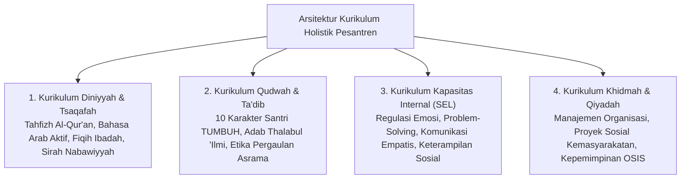

---
name: pakar-desain-kurikulum-adab
description: >-
  Keahlian tingkat Guru Besar (Pakar) dalam Desain Kurikulum Holistik Pesantren,
  Taksonomi Karakter Berbasis Fitrah, Standarisasi Capaian Pembelajaran Jenjang Kemandirian TUMBUH (J1–J4) (J1-J4),
  dan Pemetaan Kompetensi Adab Santri.
---

# Protokol Keilmuan: Pakar Desain Kurikulum Adab & Taksonomi Karakter

Skill ini membimbing agen untuk merancang struktur kurikulum pembinaan terpadu (*Integrated Character & Academic Curriculum*), taksonomi kapasitas, dan indikator capaian belajar santri dari jenjang T1 hingga T4.

---

## 1. Arsitektur Kurikulum Terpadu TUMBUH

---

## 2. Rujukan Desain Kurikulum & Taksonomi

1. **Backward Design Framework (Grant Wiggins & Jay McTighe, 2005)**:
   - Menentukan hasil akhir yang diinginkan (*Desired Results: Profil Santri Mandiri & Beradab*), merumuskan bukti asesmen yang diterima, baru menyusun aktivitas harian.
2. **Taksonomi Bloom Revisi & Taksonomi Marzano**:
   - Mengembangkan kemampuan dari mengingat (*Remembering*), memahami hikmah (*Understanding*), menginternalisasi nilai (*Valuing/Internalization*), hingga pembiasaan spontan (*Characterization by Value*).
3. **Standarisasi Capaian Pembelajaran J1–J4**:
   - T1: Tingkat Adaptasi & Pengenalan.
   - T2: Tingkat Habituasi Rutinitas Dasar.
   - T3: Tingkat Internalisasi & Kecakapan Sosial.
   - T4: Tingkat Kemandirian, Kepemimpinan & Keteladanan.

---

## 3. Langkah Analisis Pakar (Runbook)

1. **Audit Silabus & Matriks Kompetensi**: Pastikan setiap capaian pembelajaran adab memiliki indikator perilaku yang dapat diobservasi (*observable behavioral indicators*).
2. **Sinkronisasi Kurikulum Kelas & Asrama**: Integrasikan materi yang diajarkan ustadz di kelas dengan pembiasaan adab oleh musyrif di asrama.
3. **Penyusunan Rubrik Penilaian Capaian Karakter**: Buat rubrik bertingkat dari *Emerging (Mulai Berkembang)*, *Developing (Berkembang)*, *Proficient (Cakap)*, hingga *Exemplary (Teladan/Qudwah)*.
