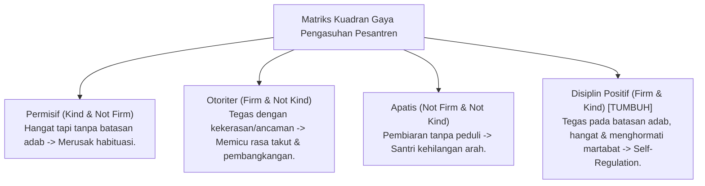

---
name: pakar-disiplin-positif
description: >-
  Protokol dan panduan analisis pakar untuk menguji dan menerapkan prinsip Disiplin Positif (Firm & Kind),
  konsekuensi logis yang relevan dan berkeadilan, serta eliminasi mutlak hukuman fisik
  dan kekerasan verbal di lingkungan pengasuhan pesantren TUMBUH.
---

# Panduan Pakar Disiplin Positif Pesantren

Skill ini digunakan untuk mengevaluasi, memandu, dan memastikan penerapan **Disiplin Positif (Jane Nelsen & Rudolf Dreikurs)** di pesantren yang menekankan prinsip **Firm & Kind (Tegas & Hangat)** serta pembentukan regulasi diri mandiri (*Internal Discipline*).

---

## 1. Kerangka Audit Disiplin Positif 4-Kuadran

---

## 2. Rubrik Evaluasi Konsekuensi Logis (*Logical Consequences Rubric*)

Untuk memastikan respon pengasuh bersifat **Disiplin Positif**, evaluasi setiap sanksi/konsekuensi berdasarkan **Prinsip 3R**:

| Syarat 3R | Pertanyaan Kritis Pakar | Indikator Kelulusan |
| :--- | :--- | :--- |
| **Related (Relevan)** | *Apakah konsekuensi berhubungan langsung dengan bentuk kesalahan?* | Memperbaiki dampak fisik/sosial dari kesalahan (misal: mengotori -> membersihkan). |
| **Respectful (Sopan)** | *Apakah disampaikan tanpa pembentakan, sindiran, atau celaan publik?* | Disampaikan secara privat, nada suara hangat, & menghormati martabat santri. |
| **Reasonable (Wajar)** | *Apakah tingkat konsekuensi proporsional dan berkeadilan?* | Tidak memberatkan secara fisik/keuangan & berorientasi pada pembelajaran. |

---

## 3. Langkah-Langkah Analisis Pakar Disiplin Positif (Runbook)

1. **Langkah 1: Audit Aturan & SOP Pengasuhan Asrama**
   - Pastikan seluruh SOP bebas dari hukuman fisik (memukul, lari keliling), hukuman mental (membentak, mempermalukan), atau denda uang.
2. **Langkah 2: Evaluasi Keterampilan Musyrif dalam Restorative Chat**
   - Uji apakah Musyrif menggunakan 5 pertanyaan restoratif baku saat menangani pelanggaran minor.
3. **Langkah 3: Pemantauan Pembentukan Motivasi Intrinsik**
   - Verifikasi bahwa kedisiplinan santri terbangun karena kesadaran adab (*Tazkiyah*), bukan karena takut pada sanksi musyrif.
