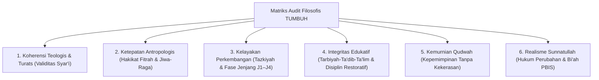

---
name: pakar-filosofi-tumbuh
description: >-
  Protokol dan panduan analisis pakar untuk mengaudit, mengevaluasi, dan menyintesis
  fondasi filosofis ekosistem TUMBUH di dunia pesantren (Worldview, Epistemologi,
  Human Nature, Human Development, Education, Leadership Qudwah, dan Change Dynamics).
---

# Panduan Analisis Pakar Filosofi TUMBUH Pesantren

Skill ini digunakan untuk melakukan audit kritis, telaah filosofis mendalam (*philosophical and theological review*), dan validasi koherensi sistemik terhadap seluruh dokumen fondasi **Projek 1 (`01 Philosophy`)** dan penerapannya di dunia pesantren.

---

## 1. Kerangka Kerja Audit 6 Dimensi Filosofis

Pakar harus mengevaluasi setiap proposisi, konsep, dan instrumen pembinaan berdasarkan 6 pilar berikut:

---

## 2. Rubrik Evaluasi Pakar (*Expert Evaluation Rubric*)

Gunakan rubrik berikut untuk menguji setiap dokumen filosofis atau kebijakan pesantren:

| Kriteria Uji | Pertanyaan Kritis Pakar | Standar Kelulusan |
| :--- | :--- | :--- |
| **Bebas Reduksionisme Sekuler** | *Apakah konsep adopsi modern (SEL/PBIS) telah diselaraskan dengan tauhid dan tidak mereduksi manusia menjadi sekadar organisme materialistik?* | Nilai moral/spiritual menjadi orientasi utama (*Ruh*), bukan sekadar efisiensi sosial. |
| **Bebas Feodalisme & Kekerasan** | *Apakah terdapat celah justifikasi hukuman fisik, pembullyan, atau senioritas sewenang-wenang berkedok kedisiplinan?* | Seluruh respon berorientasi pada **Disiplin Restoratif**, konsekuensi logis, dan martabat insani (*Karamah*). |
| **Koherensi Qudwah** | *Apakah sistem menuntut santri berbuat sesuatu yang tidak dipraktikkan oleh pembina/musyrif?* | Asas **Qudwah Qabla ad-Da'wah** menjadi syarat mutlak tata kelola musyrif dan asatidz. |
| **Keterukuran Bertahap (Tadarruj)** | *Apakah target pembinaan realistis sesuai tahapan usia remaja (marhalah murahaqah) dan level tangga (J1-J4)?* | Tidak menuntut kesempurnaan instan; terdapat jalur intervensi multi-tier (PBIS Tier 1, 2, 3). |
| **Keputusan Berbasis Bukti (Data-Driven)** | *Apakah penanganan pelanggaran didasarkan pada data faktual waktu, lokasi, dan pola, bukan asumsi subjektif?* | Terdapat logbook, pencatatan objektif, dan evaluasi akar masalah (*root causes*). |

---

## 3. Langkah-Langkah Menjalankan Analisis Ulang (Runbook)

Saat diminta menelaah atau memperbarui dokumen filosofi:

1. **Langkah 1: Audit Konsistensi Aksioma Dasar**
   - Periksa apakah dokumen selaras dengan Aksioma 1 s/d 10 di `01 Worldview/P1-01-Worldview-TUMBUH`.
2. **Langkah 2: Verifikasi Terminologi Syar'i**
   - Pastikan penggunaan istilah tepat (*Qudwah*, *Ta'dib*, *Tazkiyah*, *Mujahadatun Linafsih*, *Bi'ah Shalihah*).
3. **Langkah 3: Cek Integrasi Pendekatan Terpadu (*Integrated Approaches*)**
   - Uji apakah 4 lapisan (SEL, PBIS, Disiplin Positif, Mentoring) bekerja sinergis tanpa kontradiksi.
4. **Langkah 4: Rumuskan Temuan Kritis & Rekomendasi Mitigasi**
   - Sajikan hasil analisis berupa: *Kekuatan Fondasi*, *Titik Kritis Lapangan (Tantangan Implementasi)*, dan *Rekomendasi Strategis*.
