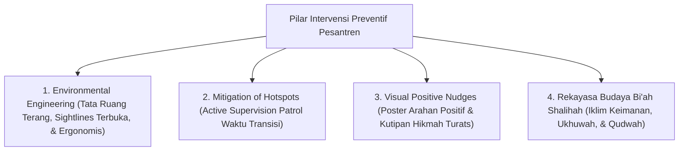

---
name: pakar-intervensi-preventif
description: >-
  Protokol dan panduan analisis pakar untuk merancang dan mengaudit strategi pencegahan primer,
  rekayasa tata ruang lingkungan (Environmental Engineering), mitigasi titik rawan (Hotspots Patrol),
  serta pembentukan iklim positif Bi'ah Shalihah di pesantren TUMBUH.
---

# Panduan Pakar Intervensi Preventif Pesantren

Skill ini digunakan untuk mengaudit, memandu, dan merancang **Strategi Pencegahan Primer (Preventive Strategies)** guna mencegah munculnya masalah perilaku santri sebelum terjadi, melalui rekayasa lingkungan fisik (*Environmental Engineering*), mitigasi titik rawan (*Hotspots Patrol*), dan budaya *Bi'ah Shalihah*.

---

## 1. Kerangka Kerja Intervensi Preventif 4-Pilar

---

## 2. Rubrik Evaluasi Kesiapsiagaan Preventif (*Preventive Evaluation Rubric*)

| Komponen Preventif | Indikator Keberhasilan Pakar | Standar Kelulusan |
| :--- | :--- | :--- |
| **Environmental Design** | Eliminasi area gelap / terisolasi di asrama. | Seluruh koridor, tangga, & ruang publik memiliki pencahayaan terang & pengawasan visual terbuka. |
| **Active Patrol** | Kehadiran musyrif di lokasi & waktu rawan transisi. | Musyrif bergerak aktif (*Movement, Scanning, Warm Interaction*) pada jam-jam risik tinggi. |
| **Visual Architecture** | Ketersediaan Nudges visual positif di seluruh area. | Poster & garis antrean visual mengarahkan adab secara halus tanpa kata larangan. |
| **Antecedent Modification**| Modifikasi pemicu sebelum masalah perilaku muncul. | Jadwal rutinitas kamar/masjid terstruktur rapi sehingga mencegah kebosanan/kegaduhan. |

---

## 3. Langkah-Langkah Analisis Pakar Preventif (Runbook)

1. **Langkah 1: Pemetaan Heatmap Titik Rawan (Hotspots Audit)**
   - Analisis data logbook digital untuk mengidentifikasi 3 lokasi dan waktu transisi yang paling sering memicu masalah.
2. **Langkah 2: Evaluasi Tata Ruang Lingkungan Asrama**
   - Inspeksi pencahayaan, kerapian kamar, dan keterbukaan akses visual di area asrama.
3. **Langkah 3: Pemantauan Kehadiran Musyrif (*Warm Presence*)**
   - Verifikasi bahwa Musyrif mendampingi santri secara aktif dengan hangat pada waktu transisi Subuh, Maghrib, dan Tidur Malam.
