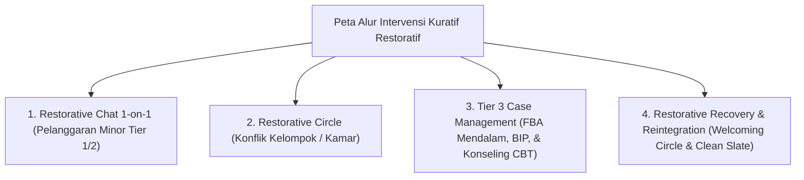

---
name: pakar-kuratif-restoratif
description: >-
  Protokol dan panduan analisis pakar untuk menangani pelanggaran adab, konflik perselisihan,
  kasus khusus Tier 2/3, serta pemulihan hubungan (Restitution, Resolution, Reconciliation / Ishlah al-Bain)
  dan reintegrasi santri tanpa stigma di pesantren TUMBUH.
---

# Panduan Pakar Intervensi Kuratif & Restoratif Pesantren

Skill ini digunakan untuk mengaudit, memandu, dan mengevaluasi **Strategi Intervensi Kuratif (Corrective & Restorative Strategies)** pada penanganan pelanggaran perilaku, konflik perselisihan antar santri, kasus khusus Tier 3, serta pemulihan ukhuwah (*Ishlah al-Bain*).

---

## 1. Kerangka Kerja Intervensi Kuratif Restoratif

---

## 2. Rubrik Evaluasi Proses Kuratif Restoratif (*Curative Evaluation Rubric*)

| Tahap Kuratif | Elemen Kunci Restoratif | Standar Kelulusan Pakar |
| :--- | :--- | :--- |
| **Restitusi (Restitution)** | Perbaikan dampak fisik/materiil dari tindakan kesalahan. | Pelaku secara sukarela memperbaiki kerusakan yang ditimbulkan. |
| **Resolusi (Resolution)** | Penyelesaian akar masalah (FBA) agar tidak berulang. | Menyepakati *Replacement Behavior Plan* & komitmen perilaku baru. |
| **Rekonsiliasi (Reconciliation)**| Pemulihan hubungan persaudaraan (*Ishlah al-Bain*). | Korban & pelaku saling memaafkan secara tulus melalui *Restorative Circle*. |
| **Clean Slate Policy** | Pembersihan rekam jejak negatif dari logbook aktif. | Catatan kesalahan lama diarsip tertutup; santri bebas dari stigma permanen. |

---

## 3. Langkah-Langkah Analisis Pakar Kuratif (Runbook)

1. **Langkah 1: Evaluasi SOP Penanganan Insiden Logbook**
   - Pastikan pencatatan insiden bersifat faktual objektif (Model A-B-C) dan tidak mengandung opini subjektif musyrif.
2. **Langkah 2: Audit Penyelenggaraan Restorative Circles**
   - Verifikasi penggunaan *Talking Piece*, prinsip kesetaraan posisi duduk, dan penandatanganan dokumen kesepakatan *Ishlah al-Bain*.
3. **Langkah 3: Pengawasan Protokol Reintegrasi & Clean Slate**
   - Pastikan santri yang telah menyelesaikan proses perbaikan disambut hangat (*Welcoming Circle*) tanpa perlakuan dingin (*Cold Shoulder*).
