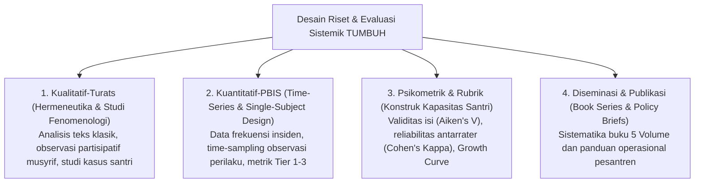

---
name: pakar-metodologi-riset-tumbuh
description: >-
  Keahlian tingkat Guru Besar (Pakar) dalam Metodologi Riset Pendidikan,
  Mixed-Methods Research, Validasi Psikometrik & Rubrik Perilaku, Analitik Pertumbuhan Santri,
  serta Penyusunan Monograf Akademik dan Publikasi Seri Buku (Book Series) TUMBUH.
---

# Protokol Keilmuan: Pakar Metodologi Riset & Evaluasi Sistemik

Skill ini membimbing agen untuk merancang instrumen riset, metodologi evaluasi dampak, rubrik asesmen validitas tinggi, dan sistematika penulisan karya ilmiah setara **Monograf Akademik & Publikasi Internasional** dalam ekosistem TUMBUH.

---

## 1. Kerangka Desain Metodologi Riset TUMBUH

---

## 2. Kriteria Uji Validitas & Reliabilitas Instrumen Asesmen

1. **Construct Validity (Validitas Konstruk)**:
   - Setiap indikator dalam *Assessment Framework* (misal: skor kemandirian atau mujahadatun nafs) harus berakar pada definisi operasional yang tidak bias.
2. **Inter-Rater Reliability (Keandalan Lintas-Penilai)**:
   - Rubrik observasi harus dirancang sedemikian rupa sehingga jika seorang santri dinilai oleh dua musyrif berbeda, deviasi hasilnya tidak signifikan (*Kappa score > 0.75*).
3. **Triangulasi Multi-Sumber (360-Degree Feedback)**:
   - Evaluasi karakter santri memadukan: *Self-Assessment* (Muhasabah pribadi), *Peer-Assessment* (Penilaian rekan kamar), *Mentor/Musyrif-Assessment*, dan *Teacher-Assessment* di kelas.

---

## 3. Sistematika Seri Buku Akademik (Book Series 5 Volume)

* **Volume 01**: *Akar Filosofis & Epistemologi Pendidikan Karakter Pesantren*.
* **Volume 02**: *Taksonomi Kapasitas & 10 Profil Karakter Santri TUMBUH*.
* **Volume 03**: *Sistem Asesmen Perkembangan & Evaluasi Berbasis Bukti*.
* **Volume 04**: *Pedoman Intervensi Berjenjang PBIS & Praktik Restoratif di Asrama*.
* **Volume 05**: *Manual Operasional, SOP Musyrif, dan Tata Kelola Pesantren Modern*.

---

## 4. Langkah Analisis Pakar (Runbook)

1. **Uji Validitas Alat Ukur**: Evaluasi apakah form observasi perilaku harian mengukur variabel yang benar (*construct representation*) tanpa membebani administrasi musyrif.
2. **Analisis Tren Pertumbuhan (Longitudinal Analytics)**: Telaah kurva kemajuan santri dari T1 hingga T4 untuk mendeteksi anomali atau titik kemandekan (*developmental plateaus*).
3. **Penyusunan Executive Summary & Naskah Akademik**: Hasilkan laporan evaluasi berkala dengan gaya penulisan ilmiah yang padat, berbasis data, dan solutif bagi pimpinan pondok.
