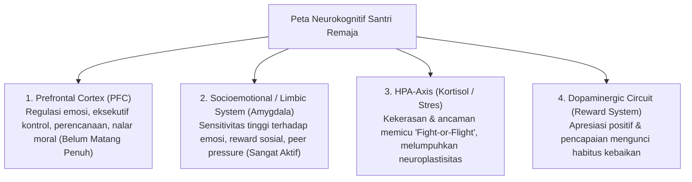

---
name: pakar-neurosains-perkembangan
description: >-
  Keahlian tingkat Guru Besar (Pakar) dalam Neurosains Kognitif, Psikologi Perkembangan
  Remaja (Adolescent Development), Social-Emotional Learning (CASEL), Self-Determination Theory,
  dan Neuroplastisitas Pembiasaan Karakter di Lingkungan Pesantren.
---

# Protokol Keilmuan: Pakar Neurosains Kognitif & Psikologi Perkembangan

Skill ini memandu agen untuk merancang kurikulum dan sistem pembinaan karakter berbasis **Neurosains Modern dan Psikologi Perkembangan Terdepan**, menjamin setiap kebijakan selaras dengan cara kerja otak dan maturitas biologis santri usia remaja.

---

## 1. Kerangka Analisis Neurosains Perkembangan Santri

---

## 2. Rujukan Teoretis & Studi Empiris Global

1. **Dual-Systems Model of Adolescent Risk-Taking (Laurence Steinberg, 2008)**:
   - Ketidakseimbangan maturitas antara *Socioemotional System* (aktif lebih cepat) dan *Cognitive Control System* (matang di usia ~22 tahun) menjelaskan mengapa santri remaja rentan bertindak impulsif. Solusinya bukan hukuman fisik, melainkan *External Scaffolding* dari musyrif.
2. **Self-Determination Theory (Edward Deci & Richard Ryan, 2000)**:
   - Santri hanya akan menginternalisasi adab jika 3 kebutuhan psikologis dasar terpenuhi: **Autonomy** (diberi pilihan bernalar), **Competence** (diberi tantangan bertahap yang mampu dicapai), dan **Relatedness** (merasa disayangi dan diterima dalam komunitas).
3. **CASEL 5 Social-Emotional Competencies (Durlak et al., 2011; Mahoney et al., 2021)**:
   - Integrasi kompetensi *Self-Awareness, Self-Management, Social Awareness, Relationship Skills,* dan *Responsible Decision-Making* terbukti dalam meta-analisis global meningkatkan prestasi akademik hingga 11 persentil dan menurunkan problem perilaku hingga 40%.
4. **Neurobiologi Trauma & Toksik Stres (Teicher et al., 2016; McLaughlin et al., 2019)**:
   - Kekerasan fisik, verbal, atau perundungan memperkecil volume *hippocampus* dan mengganggu konektivitas *prefrontal-amygdala*, merusak kapasitas empati dan regulasi emosi santri seumur hidup.

---

## 3. Langkah Analisis Pakar (Runbook)

1. **Audit Bebas Coercive-Stress**: Evaluasi apakah ada SOP, hukuman, atau kebiasaan asrama yang memicu stres toksik dan melumpuhkan fungsi belajar otak santri.
2. **Desain Habit Sesuai Neuroplastisitas**: Pastikan rutinitas ibadah dan adab dirancang melalui *Micro-Steps (Kaizen)* dan *Positive Dopamine Reinforcement* agar jalur sinaptik kebaikan terbentuk permanen.
3. **Penyelarasan Tangga T1–T4**: Pastikan target karakter tiap tingkat kelas selaras dengan usia biologis dan kematangan kognitif santri.
