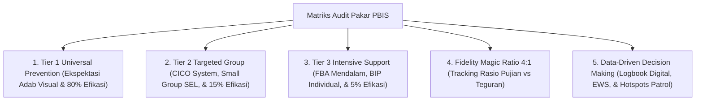

---
name: pakar-pbis
description: >-
  Protokol dan panduan analisis pakar untuk merancang, mengaudit, dan mengimplementasikan
  sistem Positive Behavioral Interventions and Supports (SW-PBIS Multi-Tier) berbasis
  data faktual dan nilai-nilai Islami di ekosistem pesantren TUMBUH.
---

# Panduan Pakar PBIS (Positive Behavioral Interventions and Supports) Pesantren

Skill ini digunakan untuk mengaudit dan mengevaluasi efektivitas arsitektur PBIS di lingkungan pesantren, mencakup **Tier 1 Universal (80%)**, **Tier 2 Targeted Group (15%)**, **Tier 3 Intensive Individual (5%)**, **Data Logbook PBIS**, dan **Magic Ratio 4:1**.

---

## 1. Kerangka Kerja Audit PBIS 5-Dimensi

---

## 2. Rubrik Audit Efikasi PBIS (*PBIS Evaluation Rubric*)

| Kriteria Uji | Pertanyaan Kritis Pakar | Standar Kelulusan |
| :--- | :--- | :--- |
| **Keseimbangan Multi-Tier** | *Apakah intervensi terdistribusi sesuai proporsi ideal 80-15-5%?* | Tier 1 mencegah mayoritas masalah; Tier 2/3 aktif melayani kelompok khusus tanpa over-referral. |
| **Penerapan Magic Ratio** | *Apakah Musyrif & Guru konsisten menerapkan rasio 4 pujian positif per 1 teguran?* | Terdaftar aktif di logbook digital; sistem EWS memberi pengingat jika rasio di bawah 4:1. |
| **Kejelasan Ekspektasi** | *Apakah matriks adab dinyatakan dalam kalimat arahan positif, bukan larangan 'Jangan'?* | Matriks adab visual terpasang jelas di kamar, masjid, kelas, & area makan. |
| **Validitas FBA** | *Apakah penanganan Tier 3 didasarkan pada Functional Behavior Assessment (Model A-B-C)?* | Setiap kasus khusus memiliki hipotesis fungsi perilaku (Escape, Attention, Tangible, Sensory). |

---

## 3. Langkah-Langkah Analisis Pakar PBIS (Runbook)

1. **Langkah 1: Audit Data Logbook & Dashboard Analitik**
   - Periksa tren masalah perilaku per lokasi/waktu (*Hotspots*) dan status rasio penguatan positif musyrif.
2. **Langkah 2: Evaluasi Efikasi CICO Tier 2**
   - Pastikan kartu CICO santri diperbarui harian dan memiliki target pencapaian $\ge 80\%$ untuk graduasi.
3. **Langkah 3: Validasi Plan Replacement Behavior Tier 3**
   - Pastikan *Behavior Intervention Plan (BIP)* menyediakan alternatif perilaku adaptif yang setara secara fungsional.
