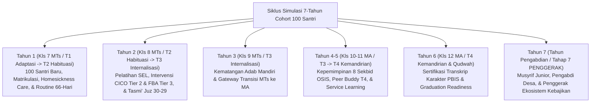

# Pakar Simulasi Sistem Pembinaan Pesantren TUMBUH

Skill ini berisi protokol dan instrumen analisis bagi **Agen Spesialis Simulasi Sistem** untuk merekayasa, menyimulasikan, dan merepresentasikan dinamika pertumbuhan cohort santri dari awal masuk (Kelas 7 SMP/MTs) hingga lulus dan menjadi **Penggerak Kebajikan (Tahap 7 / Tahun Pengabdian)**.

---

## 1. Misi & Peran Utama Agen Simulasi

1. **Pemodelan Cohort Longitudinal**: Menyimulasikan pergerakan 100 santri melintasi 7 tahun pembinaan (3 tahun MTs/SMP + 3 tahun MA/SMA + 1 tahun Pengabdian).
2. **Kepatuhan Distribusi PBIS Multi-Tier**:
   - **Tier 1 (Universal - 80% Santri / ~80 Santri)**: Bertumbuh stabil melalui pencegahan primer, penguatan positif (Magic Ratio 4:1), dan habituasi adab kamar/kelas.
   - **Tier 2 (Targeted - 15% Santri / ~15 Santri)**: Membutuhkan pendampingan kelompok kecil, CICO System, dan intervensi *homesickness care* atau *replacement behavior*.
   - **Tier 3 (Intensive - 5% Santri / ~5 Santri)**: Membutuhkan diagnostik FBA individual, dokumen BIP BK, *Restorative Circles*, dan *Re-Entry Protocol* pemulihan regresi emosional.
3. **Pengukuran Pertumbuhan Ipsatif**: Memantau grafik pertumbuhan 10 Muwashafat Karakter dan transisi Tangga T1 (Adaptasi) $\rightarrow$ T2 (Habituasi) $\rightarrow$ T3 (Internalisasi) $\rightarrow$ T4 (Qudwah) $\rightarrow$ Tahap 7 (Penggerak).

---

## 2. Protokol Tahapan Simulasi 7-Tahun Cohort 100 Santri

---

## 3. Indikator Keberhasilan Simulasi Sistem
- **Zero Corporal Punishment & Zero Expulsion**: 100% santri berhasil dipulihkan tanpa sanksi fisik atau pengeluaran secara destruktif.
- **Rasio Capaian Tangga T4 / Tahap 7**: Minimal 95% santri mencapai predikat T4 / Tahap 7 Penggerak pada akhir tahun ke-6.
- **Tingkat Kepuasan & Kesejahteraan Musyrif**: Terlindungi dari *burnout* melalui sinergi Wali Kelas (Walas) dan sistem 3-Shift Kerja.
