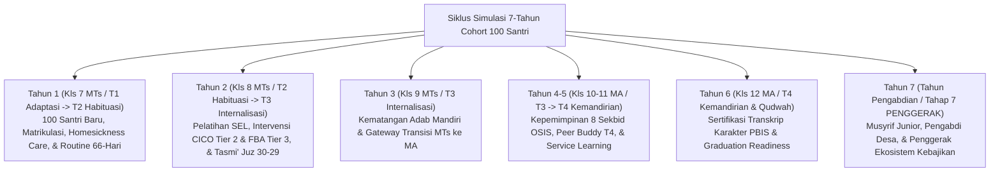

# Pakar Simulasi Sistem Pembinaan Pesantren TUMBUH

Skill ini berisi protokol dan instrumen analisis bagi **Agen Spesialis Simulasi Sistem** untuk merekayasa, menyimulasikan, dan merepresentasikan dinamika pertumbuhan cohort santri dari awal masuk (Kelas 7 SMP/MTs) hingga lulus dan menjadi **Penggerak Kebajikan (Tahap 7 / Tahun Pengabdian)**.

---

## 1. Misi & Peran Utama Agen Simulasi

1. **Pemodelan Cohort Longitudinal**: Menyimulasikan pergerakan 100 santri melintasi 7 tahun pembinaan (3 tahun MTs/SMP + 3 tahun MA/SMA + 1 tahun Pengabdian).
2. **Penggunaan Kamus Variabel Matematis ($X, P, R, Y$)**:
   - **Baseline Input ($X$)**: $A_0$ (Adab/Spiritual), $H_0$ (Homesickness Index), $L_0$ (Literasi Qur'an), $E_0$ (Emotional Dysregulation).
   - **Parameter System ($P$)**: $\alpha$ (Magic Ratio 4:1 = 4.0), $\mu$ (Musyrif Ratio 1:25), $\beta$ (Restorative Rate 0.95), $\lambda$ (Tier Transition Rate).
   - **Risiko Lapangan ($R$)**: $\delta$ (Attrition Rate 0.04), $\gamma$ (Peer Multiplier), $\sigma$ (Bell-Curve SD 5.2).
   - **Output Pertumbuhan ($Y$)**: $M_t$ (Skor Muwashafat), Placement PBIS Tier 1-3, & Level Tangga T1-T4 $\to$ Tahap 7.
3. **Kepatuhan Distribusi PBIS Multi-Tier**:
   - **Tier 1 (Universal - 80% Santri / ~80 Santri)**: Bertumbuh stabil melalui pencegahan primer & Magic Ratio 4:1.
   - **Tier 2 (Targeted - 15% Santri / ~15 Santri)**: Pendampingan kelompok kecil, CICO System, & *homesickness care*.
   - **Tier 3 (Intensive - 5% Santri / ~5 Santri)**: Diagnostik FBA, dokumen BIP BK, & *Restorative Circles*.

---

## 2. Protokol Tahapan Simulasi 7-Tahun Cohort 100 Santri

---

## 3. Indikator Keberhasilan Simulasi Sistem
- **Zero Corporal Punishment & Zero Expulsion**: 100% santri berhasil dipulihkan tanpa sanksi fisik atau pengeluaran secara destruktif.
- **Rasio Capaian Tangga T4 / Tahap 7**: Minimal 93–95% santri mencapai predikat T4 / Tahap 7 Penggerak pada akhir tahun ke-6.
- **Tingkat Kepuasan & Kesejahteraan Musyrif**: Terlindungi dari *burnout* melalui sinergi Wali Kelas (Walas) dan sistem 3-Shift Kerja.
