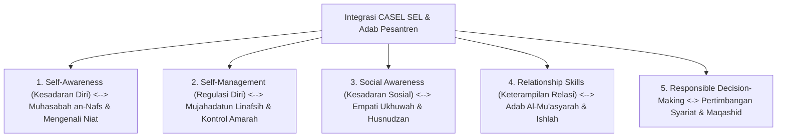

---
name: pakar-social-emotional-learning
description: >-
  Protokol dan panduan analisis pakar untuk mengintegrasikan 5 Kompetensi CASEL SEL
  (Self-Awareness, Self-Management, Social Awareness, Relationship Skills, Responsible Decision-Making)
  dengan taksonomi adab dan pembentukan kecerdasan sosio-emosional santri di pesantren TUMBUH.
---

# Panduan Pakar Social Emotional Learning (CASEL SEL) Pesantren

Skill ini digunakan untuk merancang dan mengaudit kurikulum serta modul pelatihan **Social-Emotional Learning (SEL)** yang mengawinkan kerangka **CASEL (Collaborative for Academic, Social, and Emotional Learning)** dengan prinsip **Tazkiyatun Nafs** dan **Adab Islami**.

---

## 1. Kerangka Integrasi 5 Kompetensi CASEL SEL & Adab

---

## 2. Rubrik Evaluasi Modul SEL (*SEL Evaluation Rubric*)

| Kompetensi SEL | Indikator Adab Terintegrasi | Standar Kelulusan Modul |
| :--- | :--- | :--- |
| **Self-Awareness** | Santri mampu mengenali emosi emosional & niat hatinya (*Tazkiyah*). | Tersedia lembar refleksi jurnal malam 3-pertanyaan & muhasabah diri. |
| **Self-Management** | Santri mampu mengontrol impuls amarah melalui Sunnah (Wudhu, Dzikir, Pause). | Mempraktikkan teknik pernafasan & *Cognitive Reframing* saat tertekan. |
| **Social Awareness** | Santri menunjukkan empati pada kesulitan teman kamar & tidak diskriminatif. | Terlibat aktif dalam Lingkaran Apresiasi Kamar (*Circle of Gratitude*). |
| **Relationship Skills** | Santri menguasai naskah komunikasi santun & resolusi konflik damai. | Mampu melakukan *Restorative Dialogue* saat terjadi kesalahpahaman kawan. |
| **Responsible Decision** | Santri mempertimbangkan hukum syar'i & kemaslahatan bersama sebelum bertindak. | Memilih keputusan adab secara mandiri tanpa dorongan/ancaman eksternal. |

---

## 3. Langkah-Langkah Analisis Pakar SEL (Runbook)

1. **Langkah 1: Audit Modul SEL Kelompok Kecil Tier 2**
   - Pastikan modul 6-sesi memadukan latihan kecerdasan emosional modern dengan dalil/hikmah Turats Islam.
2. **Langkah 2: Evaluasi Asesmen Metakognisi & Refleksi**
   - Uji apakah jurnal refleksi santri melatih *Self-Monitoring* tanpa memicu rasa takut atau tekanan hukuman.
3. **Langkah 3: Integrasi SEL dalam Kehidupan Asrama 24 Jam**
   - Pastikan Musyrif dan Wali Kelas menggunakan bahasa SEL dalam pengasuhan harian (*Emotional Co-Regulation*).
