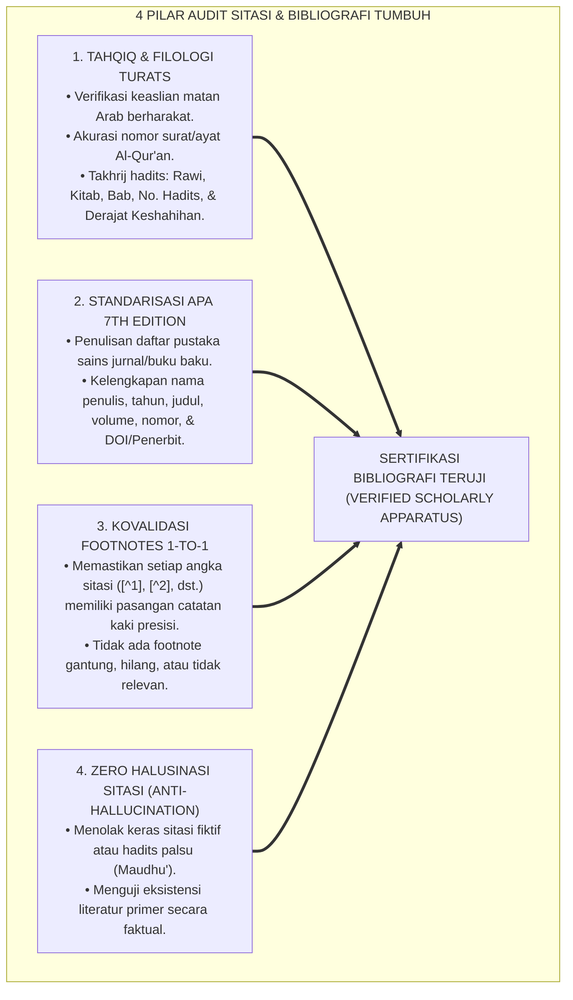

# Panduan & Protokol Pakar Validasi Sitasi, Filologi Turats, & Bibliografi Akademis

Skill ini dirancang untuk melakukan **verifikasi ketat, audit filologi, takhrij hadits, dan validasi bibliografis mutlak** terhadap seluruh sitasi ayat Al-Qur'an, matan hadits, teks Turats Arab klasik, catatan kaki (*footnotes*), dan daftar pustaka sains modern di seluruh dokumen repositori **TUMBUH**.

---

## 1. Peran Utama Auditor Sitasi & Bibliografi

---

## 2. Standar Protokol Validasi 4 Jenis Sumber

### A. Validasi Ayat Al-Qur'an al-Karim
* **Format Penulisan**: Teks Arab berharakat sempurna + Terjemahan Kemenag RI / Terjemahan Maknawiyyah Berjiwa.
* **Pemberian Identitas**: Wajib mencantumkan Nama Surah, Nomor Surah, dan Nomor Ayat.  
  *Format Baku:* `(QS. Al-An'am [6]: 82)` atau `(QS. Luqman [31]: 13–19)`.
* **Uji Integritas**: Tidak boleh ada salah ketik huruf hijaiyah, harakat syaddah, atau harakat sukun.

### B. Validasi Hadits Nabawi & Takhrij
* **Format Penulisan**: Matan Arab ringkas/lengkap + Terjemahan Bahasa Indonesia.
* **Elemen Takhrij Wajib**:
  1. *Mukharrij / Perawi Utama*: (HR. Al-Bukhari, HR. Muslim, HR. Abu Dawud, HR. At-Tirmidzi, HR. Ahmad, dll.).
  2. *Nama Kitab & Bab Asli*: (Kitab *Al-Iman*, Bab *Ma'rifat al-Islam wal-Ihsan*).
  3. *Nomor Hadits Baku*: Mengacu pada penomoran kitab tahqiq standar (*Al-Alamiyyah / Fathul Bari / Syarah Shahih Muslim An-Nawawi*).
  4. *Hukum Derajat Hadits*: Wajib berderajat minimal **Hasan** atau **Shahih**. Dilarang keras menggunakan hadits *Dha'if Jiddan* atau *Maudhu'* (Palsu).

### C. Validasi Rujukan Kitab Turats Klasik
* **Format Entri**: Nama Ulama Pengarang, Tahun Wafat (H), *Judul Lengkap Kitab*, Jilid/Juz, Nama Bab/Fasal, Halaman, Kota Terbit: Penerbit.  
  *Contoh Entri Daftar Pustaka:*  
  `Al-Ghazali, Abu Hamid Muhammad bin Muhammad. (2011). Ihya' 'Ulumiddin (Kitab Al-Muraqabah wal-Muhasabah). Beirut: Dar al-Ma'rifah.`  
  *Contoh Entri Footnote:*  
  `[^2]: Al-Ghazali, Ihya' 'Ulumiddin, Jilid 4, Kitab At-Tauhid wat-Tawakkul, hlm. 245–280.`

### D. Validasi Literatur Sains Global (Standar APA 7th Edition)
* **Jurnal Peer-Reviewed**:  
  `Penulis, A. A., & Penulis, B. B. (Tahun). Judul artikel. Nama Jurnal, Volume(Nomor), Halaman. https://doi.org/xxxx`  
  *Contoh:*  
  `Locke, E. A., & Latham, G. P. (2002). Building a practically useful theory of goal setting and task motivation: A 35-year odyssey. American Psychologist, 57(9), 705–717.`
* **Buku / Monograf**:  
  `Penulis, C. C. (Tahun). Judul buku (Edisi). Penerbit.`  
  *Contoh:*  
  `Frankl, V. E. (1984). Man's Search for Meaning: An Introduction to Logotherapy. Boston: Beacon Press.`

---

## 3. Checklist Audit Mutu Bibliografi (Quality Gate Sitasi)

Sebelum berkas monograf dinyatakan **🌟 A+**, Auditor Sitasi wajib memverifikasi checklist berikut:

| No | Parameter Audit Sitasi | Kriteria Lolos Mutlak | Status Verifikasi |
| :---: | :--- | :--- | :---: |
| 1 | **Kuantitas Rujukan Primer** | Minimal memuat **10 hingga 15 entri daftar pustaka primer** pada Bagian III. | [ ] |
| 2 | **Kuantitas Footnotes** | Minimal memuat **12 hingga 18 sitasi catatan kaki** (`[^1]` s/d `[^16]`) yang terhubung 1-to-1. | [ ] |
| 3 | **Kesesuaian Takhrij Hadits** | Setiap hadits mencantumkan perawi dan nomor hadits valid yang dapat dilacak. | [ ] |
| 4 | **Keotentikan Teks Arab** | Matan Arab berharakat rapi tanpa kesalahan tipografi nash syar'i. | [ ] |
| 5 | **Standarisasi Format APA 7th**| Penulisan jurnal dan buku modern konsisten mengikuti kaidah APA 7th Edition. | [ ] |
| 6 | **Zero Fake Citation** | Seluruh nama tokoh dan judul riset adalah literatur yang benar-benar ada secara akademis. | [ ] |
| 7 | **Glosarium Istilah** | Memuat minimal **10 entri glosarium** dengan definisi operasional yang jelas. | [ ] |

---

## 4. Perintah Khusus Pemeriksaan Cepat (Fast Verification Routine)
Jika agen diminta memeriksa sitasi dokumen tertentu, jalankan protokol:
1. Scan seluruh tag `[^n]` dalam teks dan pastikan ada pasangannya di bagian `### 3. Catatan Kaki Akademis (*Footnotes*)`.
2. Cross-check setiap nama penulis di `Daftar Pustaka` dengan sitasi dalam naskah (*In-Text Citations*).
3. Verifikasi apakah ada hadits tanpa nomor perawi, lalu lengkapi dengan nomor hadits baku.
