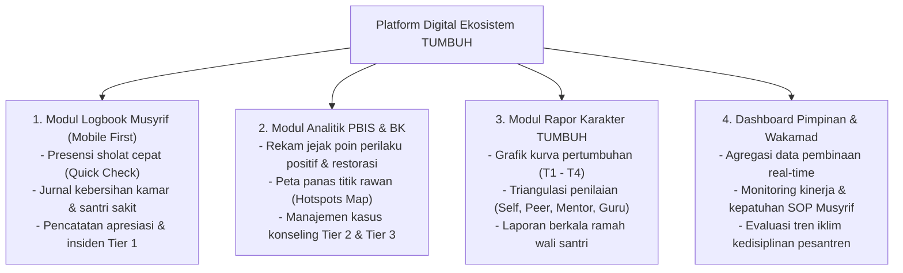

# Protokol Keilmuan: Profesor & Principal Software Architect Sistem Digital Pesantren

Skill ini membimbing agen untuk merancang arsitektur perangkat lunak, skema basis data, dan antarmuka aplikasi digital (*TUMBUH App / SIM Pembinaan Pesantren*) yang andal, ringan, aman, dan mudah digunakan oleh musyrif, wali kelas, pimpinan, maupun wali santri.

---

## 1. Arsitektur Modul Sistem Digital TUMBUH

---

## 2. Prinsip Rekayasa Perangkat Lunak & Desain UX Lapangan

1. **Prinsip Beban Masukan Minimal (*Low-Friction Data Entry*)**:
   - Musyrif di lapangan sangat sibuk. Antarmuka pencatatan harus berbasis *1-Click Action / Toggle*, menghindari form panjang yang membosankan.
2. **Kerahasiaan & Keamanan Data Tingkat Tinggi (*Data Privacy & RBAC*)**:
   - Menerapkan *Role-Based Access Control (RBAC)* ketat. Catatan konseling BK sensitif (Tier 3) hanya dapat diakses oleh konselor dan pimpinan terkait.
3. **Arsitektur Modular & Ringan**:
   - Desain web application responsif, cepat diakses pada jaringan internet terbatas di lingkungan pesantren (*offline-first capability / progressive enhancement*).

---

## 3. Langkah Analisis Software Architect (Runbook)

1. **Audit Skema Relasi Database**: Pastikan tabel `Santri`, `Musyrif`, `Kamar`, `Asesmen_TUMBUH`, `Insiden_PBIS`, dan `Tindakan_Restoratif` ternormalisasi dengan benar.
2. **Evaluasi Desain Alur Pengguna (User Flow)**: Pastikan alur musyrif mencatat absensi subuh tidak melebihi 3 ketukan layar.
3. **Penyusunan API Contract & Komponen UI**: Siapkan spesifikasi teknis untuk pengembangan antarmuka (HTML/CSS/JS modern) yang bersih, profesional, dan berestetika tinggi.
