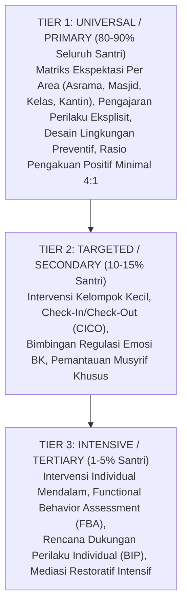

# Protokol Keilmuan: Profesor Arsitektur PBIS & Pedagogi Restoratif

Skill ini membimbing agen untuk merancang, mengaudit, dan mengoperasionalkan sistem kedisiplinan dan intervensi perilaku pesantren berbasis **Data-Driven Multi-Tier PBIS dan Praktik Restoratif**, menghilangkan ketergantungan pada hukuman fisik/reaktif.

---

## 1. Arsitektur Multi-Tier PBIS & Restorative Discipline

---

## 2. Metodologi Analisis Perilaku & Restoratif (FBA & Restorative Chat)

### A. Functional Behavior Assessment (FBA)
Setiap perilaku bermasalah memiliki fungsi pemenuhan kebutuhan (*function of behavior*):
* **Antecedent (Pemicu)**: Waktu, lokasi, situasi sosial pemicu (contoh: kelelahan saat jeda Maghrib di lorong gelap).
* **Behavior (Perilaku)**: Tindakan spesifik yang dapat diobservasi.
* **Consequence (Konsekuensi yang Diperoleh Santri)**: Apa yang didapatkan santri? (Menghindari tugas, mencari perhatian teman sebaya, atau menyalurkan agresi).
* **Intervensi PBIS**: Mengubah *Antecedent* dan melatih *Replacement Behavior* (perilaku pengganti yang adaptif).

### B. Prinsip Disiplin Restoratif (Howard Zehr & Jane Nelsen)
* **3 Elemen Kunci (Restitution, Resolution, Reconciliation)**:
  1. *Restitution*: Memperbaiki kerusakan fisik atau kerugian materiil.
  2. *Resolution*: Mengidentifikasi akar masalah agar pelanggaran tidak terulang.
  3. *Reconciliation*: Memulihkan relasi persaudaraan (*Ishlah al-Bain*) dengan korban tanpa mempermalukan pelaku.
* **Firm & Kind**: Tegas pada batasan dan konsekuensi logis, hangat dalam perlakuan dan penghargaan martabat.

---

## 3. Langkah Analisis Profesor (Runbook)

1. **Audit Matriks Ekspektasi Per Konteks**: Pastikan seluruh area pesantren memiliki matriks perilaku positif yang jelas (bukan daftar larangan "Jangan...", melainkan arahan konkret "Lakukan...").
2. **Evaluasi Decision Rules**: Pastikan ada aturan baku kapan sebuah kasus ditangani di Tier 1 (Musyrif), Tier 2 (Wali Kelas/BK), atau Tier 3 (Sidang Terpadu Kesiswaan & Wali Santri).
3. **Analisis Data Titik Rawan (Hotspots)**: Periksa data logbook untuk mengidentifikasi waktu dan lokasi rawan, lalu lakukan mitigasi tata ruang dan penempatan jadwal patroli musyrif.
