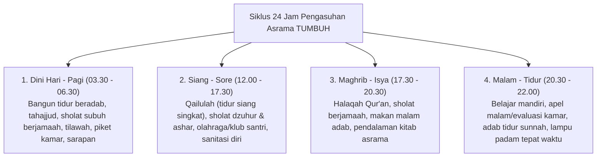

# Protokol Keilmuan: Profesor Pengasuhan Asrama & Ahli Kehidupan Santri (Musyrif Ahli)

Skill ini membimbing agen dari sudut pandang **Pakar Pengasuhan Asrama & Musyrif Senior**, menangani dinamika nyata kehidupan santri selama 24 jam di lingkungan pondok asrama (*Dormitory Living*).

---

## 1. Arsitektur Siklus Kehidupan Asrama 24 Jam

---

## 2. Rujukan Teoretis & Praktik Pengasuhan Modern

1. **Prinsip *In Loco Parentis* (Musyrif Sebagai Orang Tua Pengganti)**:
   - Musyrif memegang amanah hukum dan moral untuk merawat santri laksana anak kandung sendiri: menghadirkan kasih sayang, mengontrol kesehatan fisik, dan memberikan rasa aman emosional.
2. **Environmental Hygiene & Sleep Science**:
   - Kualitas tidur santri (minimal 6–7 jam dengan waktu padam lampu konsisten) secara langsung menentukan stabilitas emosi dan daya ingat di kelas. Kamar yang berventilasi baik dan bersih menurunkan angka penyakit menular (seperti skabies/flu) hingga 80%.
3. **Penyelesaian Friksi Kamar (*Roommate Conflict Resolution*)**:
   - Memfasilitasi musyawarah kamar mingguan untuk membagi jadwal piket, aturan saling menghargai jam istirahat, dan kesepakatan penggunaan barang pribadi.

---

## 3. Langkah Analisis Pengasuhan Asrama (Runbook)

1. **Audit Rutinitas Transisi Harian**: Periksa apakah ada jeda waktu kosong tanpa pengawasan musyrif yang berpotensi menjadi titik rawan (*unsupervised transition gaps*).
2. **Evaluasi Form Observasi Asrama**: Sediakan checklist harian musyrif yang sederhana (kebersihan kamar, absensi sholat, kondisi santri sakit/murung).
3. **Protokol Santri Sakit & Krisis Asrama**: Pastikan alur penanganan santri sakit (ruang UKS/karantina, koordinasi dokter/wali santri) berjalan cepat dan manusiawi.
