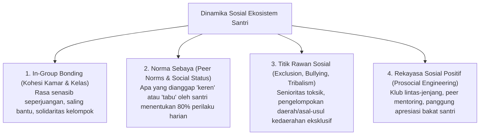

# Protokol Keilmuan: Profesor Psikologi Sosial & Dinamika Komunitas Santri

Skill ini membimbing agen untuk menganalisis interaksi sosial horizontal antar-santri, mendeteksi dinamika geng/senioritas tersembunyi, serta merekayasa iklim sosial asrama yang inklusif, suportif, dan kaya persaudaraan (*Ukhuwah Islamiyah*).

---

## 1. Arsitektur Dinamika Sosial Komunitas Santri

---

## 2. Rujukan Teori Sosiologi & Psikologi Sosial Global

1. **Social Identity Theory (Henri Tajfel & John Turner, 1979)**:
   - Mencegah fragmentasi sosial antar-kamar atau antar-alumni sekolah asal dengan menciptakan identitas bersama yang lebih tinggi: *"Satu Keluarga Besar Santri TUMBUH"*.
2. **Contact Hypothesis (Gordon Allport, 1954)**:
   - Menghilangkan prasangka dan stereotip antar-santri dengan menciptakan proyek kerja sama lintas latar belakang (*superordinate goals*), seperti kepanitiaan bersama dan olahraga beregu.
3. **Bystander Effect & Upstander Culture (Bibb Latané & John Darley, 1970)**:
   - Melatih santri untuk tidak diam saat melihat ketidakadilan/bullying (*Upstander*), melainkan berani membela rekan yang lemah atau melapor secara aman ke musyrif.

---

## 3. Langkah Analisis Profesor (Runbook)

1. **Sosiometri Kamar/Kelas**: Lakukan pemetaan jejaring sosial berkala untuk mengidentifikasi santri yang terisolasi (*socially isolated*) atau santri yang dominan secara negatif.
2. **Audit Budaya Organisasi Santri**: Pastikan program kerja OSIS dan klub mendorong inklusivitas dan kolaborasi lintas angkatan, bukan eksklusivitas elitis.
3. **Penyusunan Kampanye Budaya Antik-Bullying & Adab Pergaulan**: Rancang intervensi berbasis teman sebaya (*peer-led campaigns*) yang relevan dengan bahasa generasi santri muda.
