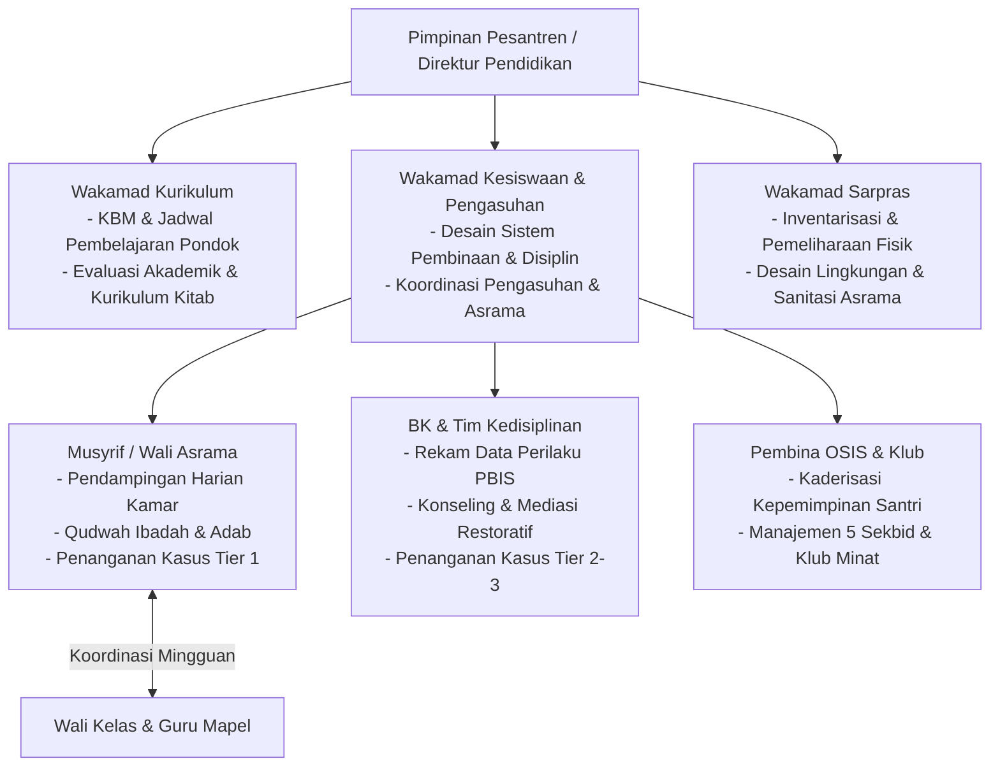

# Protokol Keilmuan: Profesor Tata Kelola Pesantren & Kepemimpinan Qudwah

Skill ini membimbing agen untuk merancang arsitektur kelembagaan, pembagian peran operasional (*Governance*), dan sistem kepemimpinan pesantren berbasis **Qudwah Hasanah dan Manajemen Profesional**, menjamin keselarasan antara visi pimpinan dan eksekusi harian di lapangan.

---

## 1. Arsitektur Tata Kelola & Koordinasi Antar-Unit

---

## 2. Pilar Kepemimpinan Berbasis Qudwah

1. **Prinsip Utama: Qudwah Qabla ad-Da'wah (Model The Way)**:
   - Keteladanan mendahului instruksi lisan. Wibawa musyrif dan pimpinan diukur dari keselarasan antara amalan pribadi dan nilai yang diajarkan (*Shidq al-Amal*).
2. **Kepemimpinan Pelayan (*Sayyidul Qaumi Khaadimuhum / Servant Leadership*)**:
   - Pemimpin dan pengasuh hadir untuk memfasilitasi santri agar bertumbuh (*enabler of growth*), bukan sebagai penguasa yang menuntut dilayani atau ditakuti.
3. **Kaderisasi Santri Anti-Feodalisme & Anti-Bullying**:
   - Organisasi Santri (OSIS/Asrama) difungsikan sebagai wadah *Peer Mentoring* (Kakak Pembimbing), dengan pengawasan ketat dari Musyrif.
   - Larangan mutlak segala bentuk sanksi fisik atau perpeloncoan oleh santri senior terhadap adik kelas.

---

## 3. Langkah Analisis Profesor (Runbook)

1. **Audit Job Description & Hindari Silo Organisasi**: Pastikan pembagian tugas antar-unit (Kurikulum, Kesiswaan, Musyrif, BK, Sarpras) tidak tumpang tindih dan memiliki forum sinkronisasi rutin.
2. **Evaluasi Standarisasi SOP Harian**: Uji apakah SOP bangun subuh, halaqah Qur'an, jam belajar mandiri, dan istirahat malam memiliki indikator yang terukur (*measurable*).
3. **Desain Jalur Kaderisasi Santri (T1-T4)**: Pastikan proses pemilihan ketua OSIS, LDKS, dan pengurus klub memiliki rubrik asesmen kompetensi yang transparan dan mendidik.
