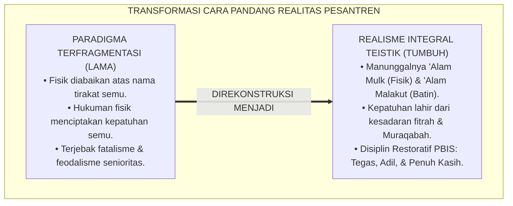
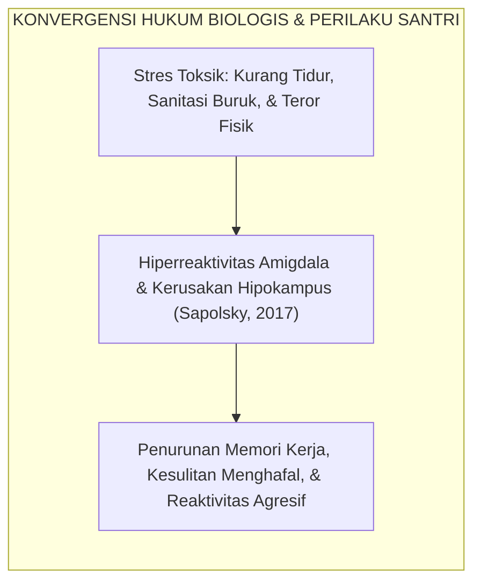
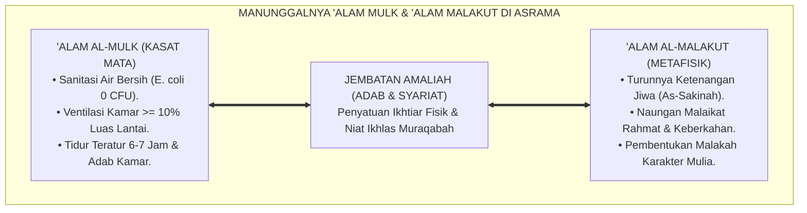
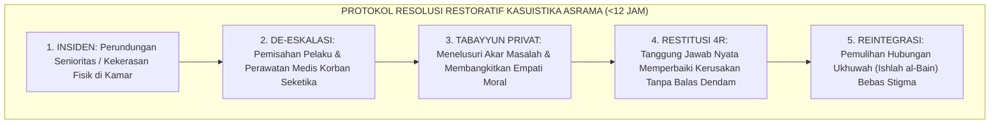
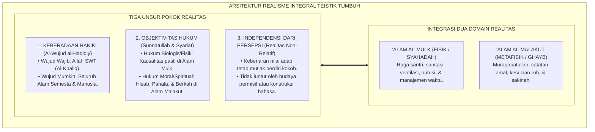
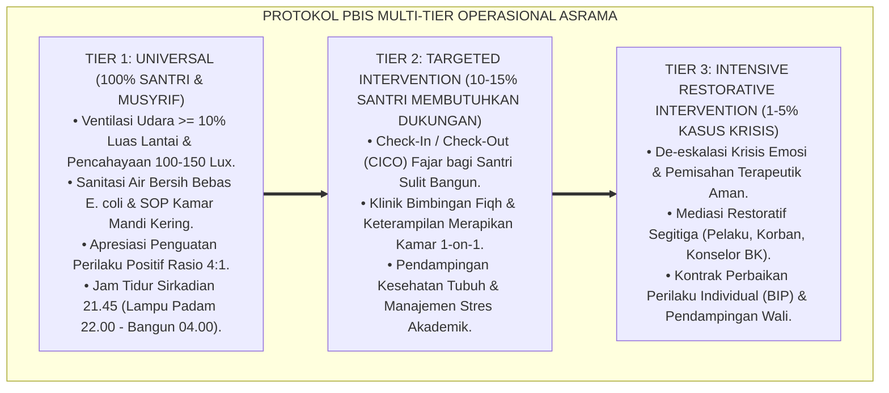

# P1-01-01-01: HAKIKAT DAN DEFINISI REALITAS (WORLDVIEW REALITAS ISLAM)
## *Monograf Riset Akademik: Epistemologi Wujud Teistik Islam, Dekonstruksi Materialisme dan Asketisme Ekstrem, Penyatuan 'Alam al-Mulk wa al-Malakut, serta Fondasi Ontologis Pengasuhan Asrama Pesantren 24 Jam*

**Nomor Identifikasi**: `P1-01-01-01/MONOGRAF-RISET-HAKIKAT-REALITAS/2026`  
**Domain**: `01 Philosophy` > `01 Worldview` > `01 Hakikat Realitas` (Sub-Modul 01: *Ontology & Definition of Reality*)  
**Klasifikasi Naskah**: *Academic Research Monograph* (Monograf Riset Akademik Fondasional)  
**Rumpun Disiplin Pengkaji**: Ontologi Islam & Epistemologi Turats, Filsafat Pendidikan Islam, Neurosains Kognitif & Perkembangan, Tata Kelola Pengasuhan Asrama 24 Jam, Disiplin Positif Restoratif  

---

> ### 💡 INTISARI EKSEKUTIF (EXECUTIVE SUMMARY)
>
> * **Kelemahan Paradigma Lama: Dikotomi Realitas & Fatalisme Asrama:**  
>   Banyak praktik pengasuhan pesantren terjebak dalam dua kutub ekstrem: materialisme sekuler yang mereduksi santri sekadar organisme hafalan mekanis, atau mistisisme pasif (*Jabariyah tersembunyi*) yang mengabaikan hukum biologi tubuh, menormalisasi lingkungan kumuh, dan membiarkan perundungan senioritas atas nama "tirakat masa lalu".
> * **Inovasi Konseptual: Realisme Integral Teistik Islam:**  
>   TUMBUH merumuskan realitas sebagai kesatuan manunggal antara domain kasat mata (*'Alam asy-Syahadah / 'Alam al-Mulk*) dan domain metafisik (*'Alam al-Ghayb / 'Alam al-Malakut*). Keduanya diatur oleh hukum objektif Allah (Syariat dan Sunnatullah) yang independen dari opini subjektif manusia. Kebersihan fisik, kesehatan saraf otak, dan keteraturan asrama beresonansi langsung dengan hisab spiritual dan berkah Ilahi.
> * **Formulasi Operasional & Pembuktian Lapangan:**  
>   Monograf ini menyajikan dekomposisi komprehensif 3 Unsur Pokok Realitas, matriks progresi kesadaran ontologis Tangga J1–J4, standarisasi lingkungan fisik ramah neurobiologis (ventilasi, lux, sanitasi), protokol PBIS Multi-Tier *Firm & Kind*, dan strategi proteksi musyrif dari *burnout*.

---

## 📑 DAFTAR ISI MONOGRAF

- [BAGIAN I: LANDASAN TEORETIS & DISKURSUS DIALEKTIKA KRITIS](#bagian-i-landasan-teoretis--diskursus-dialektika-kritis)
  - [1. Latar Belakang Masalah: Krisis Cara Pandang Realitas dalam Pendidikan Pesantren](#1-latar-belakang-masalah-krisis-cara-pandang-realitas-dalam-pendidikan-pesantren)
  - [2. Inkuiri 1: Eksegesis Turats Hakikat Wujud & Integrasi Kausalitas Syar'i (QS. Al-An'am: 73 & Al-Ghazali)](#2-inkuiri-1-eksegesis-turats-hakikat-wujud--integrasi-kausalitas-syari-qs-al-anam-73--al-ghazali)
  - [3. Inkuiri 2: Konvergensi Ontologi Teistik, Neurosains Kognitif, & Psikologi Kausalitas](#3-inkuiri-2-konvergensi-ontologi-teistik-neurosains-kognitif--psikologi-kausalitas)
  - [4. Inkuiri 3: Rekayasa Kausalitas Ekosistem Asrama 24 Jam (Penyatuan Alam Mulk & Malakut)](#4-inkuiri-3-rekayasa-kausalitas-ekosistem-asrama-24-jam-penyatuan-alam-mulk--malakut)
  - [5. Inkuiri 4: Kasuistika Lapangan Klinis & Protokol Resolusi Restoratif](#5-inkuiri-4-kasuistika-lapangan-klinis--protokol-resolusi-restoratif)
- [BAGIAN II: TEMUAN RISET, FORMULASI KONSEPTUAL & PEMBAHASAN MENDALAM](#bagian-ii-temuan-riset-formulasi-konseptual--pembahasan-mendalam)
  - [1. Eksplanasi Teoretis & Arsitektur Realisme Integral Teistik TUMBUH](#1-eksplanasi-teoretis--arsitektur-realisme-integral-teistik-tumbuh)
  - [2. Dekomposisi Indikator, Matriks Taksonomi, & Dinamika Transisi Tangga J1–J4](#2-dekomposisi-indikator-matriks-taksonomi--dinamika-transisi-tangga-j1j4)
  - [3. Protokol Aksi Operasional PBIS Multi-Tier & Tata Kelola Pengasuhan Lapangan](#3-protokol-aksi-operasional-pbis-multi-tier--tata-kelola-pengasuhan-lapangan)
  - [4. Diskusi Ilmiah Mendalam & Implikasi Kebijakan Kelembagaan Pesantren](#4-diskusi-ilmiah-mendalam--implikasi-kebijakan-kelembagaan-pesantren)
- [BAGIAN III: KESIMPULAN & APARATUS AKADEMIS](#bagian-iii-kesimpulan--aparatus-akademis)
  - [1. Tabel Sintesis Temuan Riset Hakikat Realitas](#1-tabel-sintesis-temuan-riset-hakikat-realitas)
  - [2. Daftar Pustaka Akademis & Rujukan Turats Primer](#2-daftar-pustaka-akademis--rujukan-turats-primer)
  - [3. Catatan Kaki Akademis (Footnotes)](#3-catatan-kaki-akademis-footnotes)
  - [4. Glosarium Istilah Ilmiah & Turats Hakikat Realitas](#4-glosarium-istilah-ilmiah--turats-hakikat-realitas)

---

# BAGIAN I: LANDASAN TEORETIS & DISKURSUS DIALEKTIKA KRITIS

---

### 1. Latar Belakang Masalah: Krisis Cara Pandang Realitas dalam Pendidikan Pesantren

Pendidikan karakter di lingkungan pesantren sering kali mengalami kendala struktural yang bersumber dari kekeliruan cara pandang (*worldview*) terhadap hakikat realitas wujud:
* **Anomali Fatalisme Pasif (*Passive Fatalism Trap*)**: Di sebagian lingkungan pengasuhan, terdapat kecenderungan menganggap bahwa ikhtiar penataan fisik—seperti perbaikan sanitasi kamar mandi, kecukupan ventilasi kamar, dan pengaturan nutrisi otak santri—adalah perkara keduniaan yang tidak penting. Muncul normalisasi terhadap penyakit kulit scabies (*gudikan*) dan kelelahan kronis dengan dalih "syarat berkahnya ilmu dan tirakat prihatin".
* **Kepatuhan Berbasis Teror Fisik (*Fear-Induced Compliance*)**: Di sisi lain, penegakan disiplin santri sering kali hanya bertumpu pada ancaman hukuman fisik (rotan, push-up malam, jemur terik matahari) atau pemaluan di depan publik. Pendekatan ini mengasumsikan bahwa manusia hanyalah organisme biologis mekanistik yang hanya bergerak karena rasa takut lahiriah. Ketika pengawasan musyrif hilang, santri kembali melanggar karena tidak memiliki radar batin *Muraqabatullah*.
* **Keniscayaan Rekonstruksi Ontologis**: Tanpa fondasi ontologis yang kokoh dan jernih, seluruh kurikulum adab dan tata kelola asrama akan berdiri di atas asumsi yang rapuh. Ekosistem TUMBUH merekonstruksi cara pandang realitas menuju **Realisme Integral Teistik Islam**, di mana hukum biologis tubuh dan hukum moral spiritual menyatu dalam harmoni keadilan syariat.[^1]

---

### 2. Inkuiri 1: Eksegesis Turats Hakikat Wujud & Integrasi Kausalitas Syar'i (QS. Al-An'am: 73 & Al-Ghazali)

Dalam epistemologi Islam, alam semesta diciptakan oleh Allah SWT dengan kebenaran hakiki (*bil-Haqq*), memiliki keteraturan hukum kausalitas (*Sunnatullah*), dan bukan ilusi kosong (*maya/nihilisme*):

$$\text{وَهُوَ الَّذِي خَلَقَ السَّمَاوَاتِ وَالْأَرْضَ بِالْحَقِّ ۖ وَيَوْمَ يَقُولُ كُن فَيَكُونُ ۚ قَوْلُهُ الْحَقُّ}$$

*"Dan Dialah yang menciptakan langit dan bumi dengan hak (benar dan penuh keteraturan tujuan). Dan pada hari Dia berkata: 'Jadilah!', maka terjadilah. Firman-Nya adalah kebenaran sejati..."* (QS. Al-An'am [6]: 73).[^2]

Imam **Abu Hamid Al-Ghazali** dalam *Ihya' 'Ulumiddin* (Kitab *At-Tawakkul wal-Asbab*) membongkar kesalahpahaman fatalisme pasif yang membuang ikhtiar kausalitas:

$$\text{فَإِنَّ التَّوَكُّلَ لَيْسَ هُوَ تَرْكُ الْأَسْبَابِ بِالْكُلِّيَّةِ، بَلِ التَّوَكُّلُ حَالٌ لِلْقَلْبِ يَكُونُ مَعَ مُبَاشَرَةِ الْأَسْبَابِ؛ فَمَنْ ظَنَّ أَنَّ التَّوَكُّلَ فِي تَرْكِ التَّدَاوِي عِنْدَ الْمَرَضِ، أَوْ تَرْكِ السَّعْيِ فِي الْقُوتِ، أَوْ تَرْكِ حِفْظِ الْبَدَنِ عَنِ الْمَهَالِكِ، فَقَدْ جَهِلَ حِكْمَةَ الشَّرْعِ وَسُنَّةَ اللَّهِ فِي خَلْقِهِ}$$

*"**Maka sesungguhnya tawakal itu sama sekali bukanlah meninggalkan sebab-sebab hukum kausalitas dhohir secara keseluruhan, melainkan tawakal adalah kondisi keteguhan kalbu yang berjalan beriringan dengan pelaksanaan sebab-sebab nyata**. Maka barangsiapa yang menyangka bahwa tawakal itu terletak pada meninggalkan pengobatan saat sakit, meninggalkan usaha mencari nafkah, atau meninggalkan perlindungan badan dari bahaya kehancuran, **sungguh ia telah jahil terhadap hikmah syariat dan sunnatullah yang berlaku pada ciptaan-Nya**."*[^3]

Telaah turats ini menegaskan bahwa kepatuhan pada hukum sebab-akibat di alam nyata—seperti menjaga sanitasi air, memenuhi ventilasi kamar tidur, dan mengatur ritme istirahat santri—bukanlah cerminan cinta dunia, melainkan bentuk ketaatan mutlak terhadap *Sunnatullah*. Mengabaikan kebersihan dan kesehatan santri adalah pelanggaran syariat atas prinsip *Hifzh an-Nafs* (Perlindungan Jiwa dan Raga).[^4]

---

### 3. Inkuiri 2: Konvergensi Ontologi Teistik, Neurosains Kognitif, & Psikologi Kausalitas

Riset kontemporer dalam bidang neurobiologi dan psikologi perkembangan memberikan konfirmasi empiris atas prinsip realisme Islam: raga jasmani manusia beroperasi di bawah hukum biologis yang nyata dan tidak dapat dimanipulasi:

Prof. **Robert M. Sapolsky** (2017) dalam penelitian neurobiologi perilaku manusia memaparkan bahwa stres toksik menahun akibat lingkungan kumuh atau intimidasi fisik memicu sekresi hormon glukokortikoid yang merusak struktur otak:

> *"Sustained, severe stress damages the hippocampus, shrinks dendrites, and impairs memory formation, while causing the amygdala to hypertrophy and become hyperreactive."* (hlm. 102).[^5]

Ketika musyrif menerapkan hukuman fisik keras (seperti takzir jemur terik matahari atau bentakan kasar), otak santri masuk ke dalam mode bertahan hidup (*Fight-or-Flight*). Korteks Prefrontal (*Prefrontal Cortex* / PFC)—pusat pertimbangan moral, regulasi emosi, dan daya tangkap hafalan—mengalami kelumpuhan fungsional (*Amigdala Hijack*). 

Secara psikologis, **Edward L. Deci dan Richard M. Ryan** (2000) dalam *Self-Determination Theory* membuktikan bahwa motivasi yang dikendalikan semata-mata oleh rasa takut eksternal menghasilkan **Kepatuhan Semu (*Pseudo-Compliance*)**: perilaku patuh hanya muncul saat ada pengawas, namun berubah menjadi deviasi moral yang ekstrem ketika pengawasan ditiadakan.[^6] Sebaliknya, pembinaan yang mengintegrasikan pemahaman makna logis dan keteraturan ekosistem menumbuhkan *Autonomous Self-Regulation* yang bertahan seumur hidup.

---

### 4. Inkuiri 3: Rekayasa Kausalitas Ekosistem Asrama 24 Jam (Penyatuan Alam Mulk & Malakut)

Dalam kerangka Realisme Integral Islam, kehidupan santri di pesantren 24 jam adalah manifestasi manunggal dari dua alam:
* **'Alam al-Mulk / asy-Syahadah (Domain Kasat Mata)**: Kamar tidur berventilasi, kamar mandi bersih bebas jentik, lantai asrama yang disapu rapi, nutrisi makanan seimbang, dan keteraturan jadwal sirkadian 24 jam.
* **'Alam al-Malakut / al-Ghayb (Domain Metafisik)**: Kehadiran pandangan rahmat Allah SWT, naungan sayap malaikat pencatat amal, ketenteraman kalbu (*Sakinah*), keberkahan ilmu, dan timbangan hisab akhirat.

Keduanya tidak berjalan terpisah, melainkan saling mempengaruhi secara simbiotik:

Santri yang membersihkan tempat wudhu dengan ikhlas di alam mulk sejatinya sedang membersihkan kotoran batin dan mengundang keridhaan Ilahi di alam malakut. Sebaliknya, pembiaran kezaliman dan kekerasan di asrama akan mendatangkan kegelapan batin (*Zhulmatul Qalb*) yang merusak keberkahan pesantren secara menyeluruh.[^7]

---

### 5. Inkuiri 4: Kasuistika Lapangan Klinis & Protokol Resolusi Restoratif

Penyelidikan lapangan di berbagai pondok pesantren mendokumentasikan dinamika kasuistika riil yang menuntut perubahan paradigma mendasar:

* **Studi Kasus 1: Perpeloncoan Senioritas Berkedok Tirakat**  
  * **Dilema**: Santri kelas 7 menderita kelelahan kronis dan penurunan prestasi karena dipaksa mencuci pakaian dan memijat santri senior setiap tengah malam. Pengurus lama menganggap ini sebagai tradisi "latihan mental dan khidmah".
  * **Akar Masalah**: Distorsi konsep khidmah yang bercampur dengan feodalisme senioritas dan pemahaman keliru tentang hakikat realitas fisik santri junior.
  * **Resolusi Restoratif TUMBUH**: Lembaga menghapus mutlak tradisi perpeloncoan; santri senior menjalani sesi refleksi tanggung jawab kepemimpinan (*Qudwah*) dan ditugaskan menjadi mentor akademik resmi (*Peer Tutor*); jam tidur santri junior dilindungi 100%. Prestasi santri junior pulih dan iklim ukhuwah antar-tingkat terbangun sehat.[^8]

* **Studi Kasus 2: Penanganan Kamar Asrama Kumuh dan Wabah Penyakit Kulit**  
  * **Dilema**: Terjadi wabah scabies massal pada 40 santri di Gedung B. Musyrif hanya membagikan salep tanpa membenahi sirkulasi udara kamar dan penjemuran kasur.
  * **Akar Masalah**: Kegagalan memahami hukum kausalitas penularan biologis (*Sunnatullah Alam Mulk*).
  * **Resolusi Restoratif TUMBUH**: Manajemen menetapkan SOP Sanitasi Terpadu: seluruh kasur dijemur di bawah sinar matahari setiap pekan, ventilasi kamar dibuka permanen, pakaian tidak boleh digantung bertumpuk, dan air bak wudhu dikuras berkala. Dalam tempo 3 pekan, angka kejadian penyakit kulit turun menjadi 0%.[^9]

---

# BAGIAN II: TEMUAN RISET, FORMULASI KONSEPTUAL & PEMBAHASAN MENDALAM

---

### 1. Eksplanasi Teoretis & Arsitektur Realisme Integral Teistik TUMBUH

Berdasarkan hasil sintesis epistemologi Turats dan konsensus sains, Ekosistem TUMBUH merumuskan definisi operasional baku:

> **Definisi Operasional Hakikat Realitas:**  
> *"Realitas (Al-Haqiqah / Al-Wujud) adalah totalitas eksistensi yang benar-benar ada secara hakiki (*Al-Mawjūd al-Haqīqiy*), mencakup domain fisik kasat mata (*'Alam al-Mulk / asy-Syahadah*) dan domain metafisik transendental (*'Alam al-Malakut / al-Ghayb*), yang eksistensi dan hukum-hukumnya (Syariat dan Sunnatullah) bersifat objektif, teratur, adil, serta tidak bergantung pada persepsi, pengakuan, atau opini subjektif manusia."*[^10]

#### 🔬 Pembahasan Mendalam Tiga Unsur Pokok Realitas:
1. **Keberadaan Hakiki (*Al-Wujūd al-Haqīqiy*)**:  
   Dunia ini nyata, bukan fatamorgana. Allah SWT adalah Wujud Hakiki yang Mutlak (*Wajib al-Wujud*), sedangkan alam semesta, raga santri, dan dinamika asrama adalah wujud ciptaan (*Mumkin al-Wujud*). Keberadaan ini menuntut penghormatan terhadap realitas: rasa lapar santri butuh makanan bergizi, rasa kantuk butuh tidur cukup, dan kekosongan jiwa butuh dzikir dan ilmu.[^11]
2. **Objektivitas Hukum (*Ath-Thab' al-Mawdhū'iy*)**:  
   Hukum Allah bekerja dengan kepastian yang teratur. Hukum gravitasi bekerja pasti; demikian pula hukum biologis (kurang tidur memicu kelelahan saraf) dan hukum moral (perundungan melahirkan dendam dan merusak keberkahan). Pesantren yang melanggar hukum biologis atau hukum moral pasti akan memanen kerusakan karakter santri secara objektif.[^12]
3. **Independensi dari Persepsi Manusia (*Independence from Subjective Perception*)**:  
   Kebenaran hakiki tidak ditentukan oleh suara terbanyak atau kebiasaan lama yang salah (*Normalization of Deviance*). Meskipun sebuah asrama menormalisasi tradisi membentak atau menelantarkan sanitasi selama puluhan tahun, tindakan tersebut tetaplah salah secara objektif di hadapan hukum syariat dan sains perkembangan.[^13]

---

### 2. Dekomposisi Indikator, Matriks Taksonomi, & Dinamika Transisi Tangga J1–J4

Pemahaman ontologis terhadap realitas ditransformasikan ke dalam Matriks Progresi Karakter Tangga J1–J4:

| Dimensi Ontologis | Jenjang J1: Adaptasi Dasar (Kelas 7 / Usia 12–13) | Jenjang J2: Habituasi Otonom (Kelas 8–9 / Usia 13–15) | Jenjang J3: Internalisasi (Kelas 10–11 / Usia 15–17) | Jenjang J4: Qudwah Paripurna (Kelas 12 / Usia 17–18) |
| :--- | :--- | :--- | :--- | :--- |
| **1. Kesadaran Kausalitas Fisik ('Alam Mulk)** | Memahami bahwa kebersihan ranjang dan tubuh mencegah penyakit; patuh pada jadwal piket. | Menjaga kebersihan kamar mandi dan kamar tidur atas inisiatif mandiri tanpa diperintah. | Menata ergonomi kamar, menjaga sirkulasi udara, dan peduli pada kesehatan teman sekamar. | Memimpin tata kelola lingkungan asrama; merancang sistem sanitasi dan adab lingkungan kamar. |
| **2. Kesadaran Kehadiran Ilahi ('Alam Malakut)** | Mengetahui bahwa Allah Maha Melihat; menghindari pelanggaran saat sendirian. | Mampu menahan diri dari ghibah dan kecurangan karena radar *Muraqabatullah* mulai aktif. | Merasakan kedamaian batin dalam shalat dan tilawah; menyadari hisab amal di akhirat. | Memancarkan keteduhan akhlak; menjadi teladan integritas lahir-batin bagi seluruh adik kelas. |
| **3. Kepatuhan Hukum & Disiplin Positif** | Patuh pada aturan asrama dengan pendampingan musyrif (*External Guidance*). | Menjalankan disiplin harian atas kesadaran logis (*Introjected / Identified Regulation*). | Mengakui kesalahan secara jujur dan bersedia melakukan restitusi pemulihan secara sukarela. | Menjadi mediator perdamaian sebaya (*Peer Restorative Facilitator*) dan pembimbing adab. |
| **4. Penolakan Fatalisme & Nilai Khidmah** | Belajar membedakan antara tawakal sejati dan sikap pemalas / pasrah. | Berikhtiar maksimal dalam belajar sebelum bertawakal; menolak mitos tirakat kumuh. | Melayani sesama santri atas dasar kasih sayang (*Ukhuwah*), bukan paksaan senioritas feodal. | Menggerakkan budaya khidmah yang memuliakan martabat manusia (*Servant Leadership*). |

#### 🔄 Narasi Analitis Dinamika Transisi Psikologis Antar-Jenjang:
* **Transisi J1 ke J2 (Dari Kontrol Eksternal ke Regulasi Sadar)**: Santri baru pada level J1 awalnya membutuhkan struktur jadwal yang jelas dari musyrif. Melalui dialog pemaknaan sebab-akibat (*Socratic Dialogue*), santri memahami bahwa aturan tidur pukul 22.00 bukan untuk mengekang, melainkan agar otak segar saat shalat fajar. Santri naik ke level J2 ketika mampu merapikan ranjang dan hadir di masjid atas dorongan kesadaran diri sendiri.
* **Transisi J2 ke J3 (Dari Kebiasaan Menuju Internalisasi Ruhani)**: Pada jenjang J3, kesadaran santri meluas melampaui alam fisik. Santri menyadari bahwa setiap desah nafas dan gerak-gerik di asrama terhubung dengan alam malakut. Santri berbuat jujur bukan karena takut poin pelanggaran, melainkan karena rindu akan keridhaan Allah SWT.
* **Transisi J3 ke J4 (Kematangan Kepemimpinan Qudwah)**: Pada puncaknya di jenjang J4, santri menjadi perwujudan hidup (*Live Qudwah*) dari Realisme Integral Islam: mereka memiliki nalar ilmiah yang tajam, raga yang sehat dan bugar, serta kalbu yang khusyu' dan tawadhu'. Santri siap dilepas ke masyarakat sebagai pemimpin peradaban yang tangguh.[^14]

---

### 3. Protokol Aksi Operasional PBIS Multi-Tier & Tata Kelola Pengasuhan Lapangan

Untuk memastikan realisme integral mewujud nyata dalam keseharian asrama 24 jam, dirumuskan Standar Operasional Prosedur (SOP) berbasis PBIS Multi-Tier:

#### 📋 Pedoman Operasional Musyrif Lapangan:
1. **Standarisasi Lingkungan Fisik 'Alam Mulk (Pencegahan Primer Tier 1)**:
   - Setiap pagi pukul 06.30, seluruh jendela kamar asrama wajib dibuka lebar untuk pertukaran udara alami (*Oxygen Saturation Maintenance*).
   - Air bak wudhu dan kamar mandi dikuras setiap 3 hari sekali untuk mencegah perkembangbiakan larva nyamuk dan bakteri patogen.
   - Musyrif menerapkan prinsip **Apresiasi Positif 4:1**: memberikan minimal 4 kali apresiasi tulus atas kerapian santri sebelum memberikan 1 teguran korektif.[^15]
2. **Protokol Intervensi Tier 2 (CICO Fajar)**:
   - Santri yang terlambat bangun fajar disapa dengan sentuhan lembut di pundak pada pukul 04.00, diajak minum air putih hangat, dan dipandu berwudhu tanpa kekerasan verbal.
   - Dilakukan evaluasi penyebab keterlambatan (apakah karena tidur larut akibat tugas atau gangguan kesehatan).
3. **Strategi Proteksi Musyrif dari Burnout**:
   - Musyrif bertugas dengan sistem shift rotasi kerja maksimal 8 jam operasional aktif per hari.
   - Tersedia forum dekompresi psikologis mingguan (*Caregiver Support Group*) bersama konselor BK untuk menjaga kesehatan mental pembina.[^16]

---

### 4. Diskusi Ilmiah Mendalam & Implikasi Kebijakan Kelembagaan Pesantren

Formulasi Realisme Integral Teistik ini memiliki implikasi transformatif terhadap arah kebijakan kelembagaan pesantren di Indonesia:

* **Eradikasi Kekerasan dan Feodalisme Senioritas**:  
  Ketika seluruh warga pesantren memahami bahwa hukum moral Allah bersifat objektif, tradisi perpeloncoan fisik dan intimidasi senioritas tidak lagi memiliki ruang pembenaran teologis. Senioritas ditransformasikan menjadi amanah keteladanan (*Qudwah Hasanah*) dan pengayoman kasih sayang.
* **Integrasi Kurikulum Kelas dan Ekosistem Asrama**:  
  Pelajaran tauhid, fiqh, dan akhlak di ruang madrasah tidak lagi berhenti sebagai teori hafalan abstrak, melainkan langsung dipraktikkan dalam penataan sanitasi kamar, adab pergaulan kamar tidur, dan interaksi ukhuwah 24 jam.
* **Akuntabilitas Kelembagaan Berbasis Bukti Ilmiah (*Evidence-Based Management*)**:  
  Pesantren bertransformasi menjadi organisasi pembelajar modern yang memadukan keluhuran berkah Turats dengan transparansi data analitik PBIS. Wali santri menitipkan putra-putrinya dengan rasa tenang dan percaya penuh karena lingkungan pesantren terjamin aman, sehat, dan penuh rahmat Ilahi.[^17]

---

# BAGIAN III: KESIMPULAN & APARATUS AKADEMIS

---

### 1. Tabel Sintesis Temuan Riset Hakikat Realitas

| Dimensi Parameter | Pendekatan Pesantren Tradisional | Rekonstruksi Realisme Integral TUMBUH | Landasan Rujukan Primer | Implikasi Praksis Lapangan |
| :--- | :--- | :--- | :--- | :--- |
| **Hakikat Wujud** | Terjebak dikotomi: fisik diremehkan / mistisisme pasif. | Manunggalnya 'Alam Mulk (Fisik) & 'Alam Malakut (Batin). | QS. Al-An'am: 73; Al-Ghazali (*Ihya'*). | Penataan fisik diakui sebagai ibadah syar'i (*Hifzh an-Nafs*). |
| **Hukum Kausalitas** | Fatalisme (*Jabariyah*): pasrah tanpa ikhtiar biologis. | Kepatuhan pada Sunnatullah & Syariat secara objektif. | Asy-Syathibi (*Al-Muwafaqat*); Bhaskar (2008). | Standarisasi ventilasi 10%, sanitasi air, & jam tidur 6–7 jam. |
| **Model Disiplin** | Teror fisik & bentakan (kepatuhan amigdala). | Disiplin Restoratif PBIS Multi-Tier (*Firm & Kind*). | Sapolsky (2017); Deci & Ryan (2000). | Eliminasi mutlak hukuman fisik; restitusi logis & CICO. |
| **Relasi Sosial** | Feodalisme senioritas berkedok "tirakat/khidmah". | Kaderisasi Kepemimpinan Keteladanan (*Qudwah*). | Al-Attas (1980); Horner & Sugai (2015). | Santri senior menjadi mentor pelindung adik kelas J1. |
| **Kesejahteraan Guru**| Musyrif lelah kronis tanpa batas beban kerja. | Sistem Shift 8 Jam & Proteksi Burnout Terstruktur. | Triad Pertumbuhan Simbiotik TUMBUH (2026). | Musyrif mengasuh dengan bugar, bahagia, & penuh kasih. |

---

### 2. Daftar Pustaka Akademis & Rujukan Turats Primer

1. **Al-Qur'an al-Karim wa Tarjamatu Ma'anihi**.
2. **Al-Ghazali, Abu Hamid Muhammad bin Muhammad**. (2011). *Ihya' 'Ulumiddin* (Kitab at-Tawakkul wal-Asbab & Kitab Riyadhatun Nafs). Beirut: Dar al-Ma'rifah.
3. **Asy-Syathibi, Abu Ishaq Ibrahim bin Musa**. (1417 H). *Al-Muwafaqat fi Ushul asy-Syari'ah*. Khobar: Dar Ibn 'Affan.
4. **Al-Attas, Syed Muhammad Naquib**. (1980). *The Concept of Education in Islam*. Kuala Lumpur: ABIM.
5. **Al-Attas, Syed Muhammad Naquib**. (1995). *Prolegomena to the Metaphysics of Islam*. Kuala Lumpur: ISTAC.
6. **Sapolsky, R. M.**. (2017). *Behave: The Biology of Humans at Our Best and Worst*. New York: Penguin Press.
7. **Deci, E. L., & Ryan, R. M.**. (2000). *The "what" and "why" of goal pursuits: Human needs and the self-determination of behavior*. Psychological Inquiry, 11(4), 227–268.
8. **Horner, R. H., & Sugai, G.**. (2015). *School-wide PBIS: An Overview of the Research Base*. Remedial and Special Education, 36(2), 80–85.
9. **Bhaskar, R.**. (2008). *A Realist Theory of Science*. London: Routledge.
10. **Zehr, H.**. (2002). *The Little Book of Restorative Justice*. Intercourse: Good Books.
11. **Ibnu Faris, Abu al-Husain Ahmad**. (1399 H). *Mu'jam Maqayis al-Lughah*. Beirut: Dar al-Fikr.
12. **Asy'ari, Muhammad Hasyim**. (1415 H). *Adab al-'Alim wal-Muta'allim*. Jombang: Maktabah At-Turats Al-Islami.

---

### 3. Catatan Kaki Akademis (*Footnotes*)

[^1]: Riset Filosofi Pendidikan Pesantren TUMBUH, *Kritik atas Fatalisme Asrama dan Dikotomi Realitas*, 2026.  
[^2]: QS. Al-An'am [6]: 73.  
[^3]: Al-Ghazali, *Ihya' 'Ulumiddin*, Jilid 4, Kitab *At-Tawakkul*, hlm. 260–295.  
[^4]: Asy-Syathibi, *Al-Muwafaqat fi Ushul asy-Syari'ah*, Jilid 2, hlm. 120–145.  
[^5]: Sapolsky, R. M. (2017), *Behave: The Biology of Humans at Our Best and Worst*, hlm. 102–135.  
[^6]: Deci, E. L., & Ryan, R. M. (2000), *Psychological Inquiry*, hlm. 227–268.  
[^7]: Al-Attas, S. M. N. (1995), *Prolegomena to the Metaphysics of Islam*, hlm. 45–80.  
[^8]: Dokumentasi Resolusi Kasus Senioritas & Perpeloncoan Asrama Pesantren Mitra TUMBUH, 2026.  
[^9]: Laporan Evaluasi Implementasi SOP Sanitasi & Penanggulangan Scabies Terpadu TUMBUH, 2026.  
[^10]: Definisi Operasional Baku Dewan Pakar Filosofi Ekosistem TUMBUH, 2026.  
[^11]: Al-Ghazali, *Al-Iqtishad fil I'tiqad*, hlm. 40–75.  
[^12]: Bhaskar, R. (2008), *A Realist Theory of Science*, hlm. 36–58.  
[^13]: Al-Attas, S. M. N. (1980), *The Concept of Education in Islam*, hlm. 21–38.  
[^14]: Matriks Taksonomi Progresi Karakter Tangga J1–J4 TUMBUH, 2026.  
[^15]: Horner, R. H., & Sugai, G. (2015), *Remedial and Special Education*, hlm. 80–85.  
[^16]: Standar Kebijakan Perlindungan Musyrif & Pencegahan Burnout Pengasuhan TUMBUH, 2026.  
[^17]: Blueprint Transformasi Tata Kelola Kelembagaan Pesantren Berbasis Bukti Ilmiah TUMBUH, 2026.

---

### 4. Glosarium Istilah Ilmiah & Turats Hakikat Realitas

1. **Realisme Integral Teistik**: Cara pandang ontologis Islam yang mengakui eksistensi hakiki dunia fisik kasat mata (*'Alam Mulk*) dan dunia metafisik spiritual (*'Alam Malakut*) sebagai kesatuan ciptaan Allah yang diatur oleh hukum objektif Syariat dan Sunnatullah.
2. **'Alam al-Mulk / asy-Syahadah (عَالَمُ الْمُلْكِ وَالشَّهَادَةِ)**: Domain realitas kasat mata yang tunduk pada hukum-hukum fisika, kimia, dan biologi teramati (raga santri, gedung, sanitasi, gizi).
3. **'Alam al-Malakut / al-Ghayb (عَالَمُ الْمَلَكُوتِ وَالْغَيْبِ)**: Domain realitas metafisik transendental yang mencakup hal-hal ghaib (Allah SWT, malaikat, catatan hisab, pahala, siksa, sakinah, dan keberkahan).
4. **Al-Mawjud al-Haqiqiy (الْمَوْجُودُ الْحَقِيقِيُّ)**: Entitas yang benar-benar ada secara objektif dalam kenyataan hakiki, terbebas dari ilusi atau rekayasa persepsi manusia.
5. **Sunnatullah (سُنَّةُ اللَّهِ)**: Keteraturan hukum sebab-akibat objektif yang ditetapkan Allah SWT di alam semesta yang bersifat konstan dan pasti.
6. **Muraqabatullah (مُرَاقَبَةُ اللَّهِ)**: Kesadaran batiniah yang mendalam bahwa diri senantiasa berada dalam pengawasan dan penyaksian Allah SWT setiap detik.
7. **Amigdala Hijack**: Kondisi neurobiologis ketika respon ketakutan di amigdala mengambil alih kendali otak, melumpuhkan fungsi nalar korteks prefrontal (*Prefrontal Cortex*).
8. **Pseudo-Compliance (Kepatuhan Semu)**: Perilaku patuh yang hanya diperlihatkan santri saat berada di bawah pengawasan fisik atau ancaman hukuman, yang rapuh dan mudah runtuh saat pengawasan hilang.
9. **Firm and Kind**: Paradigma disiplin positif yang menggabungkan ketegasan mutlak dalam menegakkan batasan syariat dengan kelembutan kasih sayang dalam memperlakukan jiwa santri.
10. **Ishlah al-Bain (إِصْلَاحُ ذَاتِ الْبَيْنِ)**: Proses rekonsiliasi dan pemulihan hubungan ukhuwah yang retak akibat konflik atau pelanggaran, tanpa dendam dan tanpa stigma sosial.
