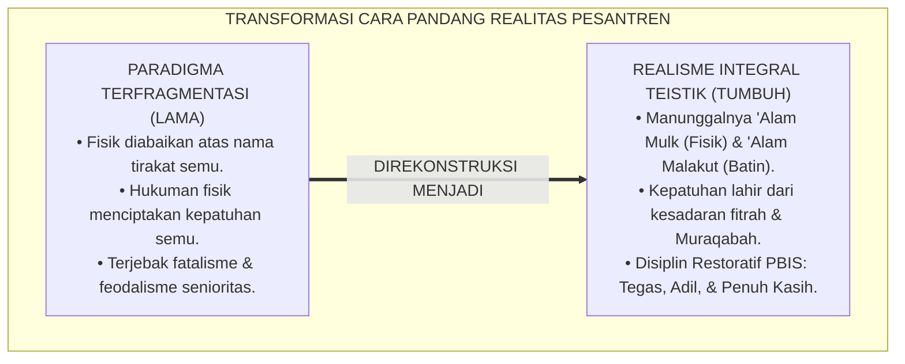
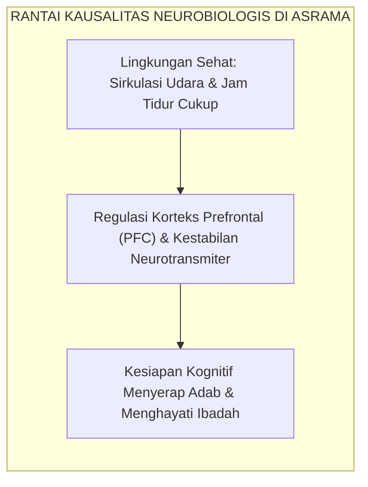
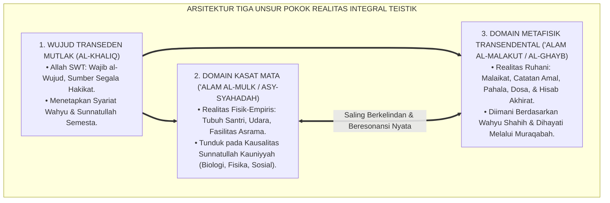
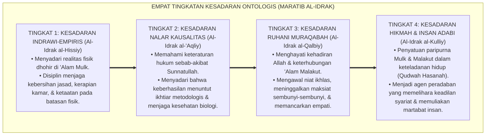
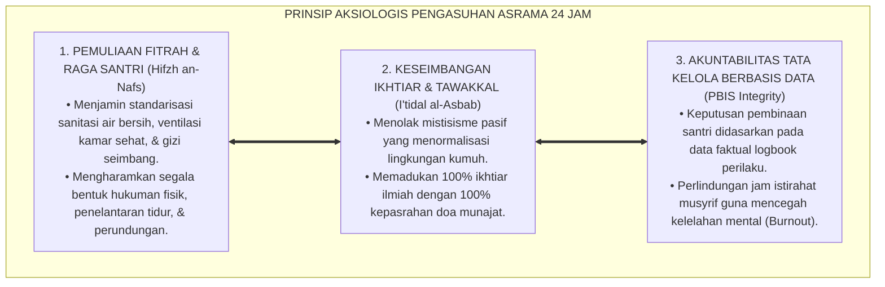
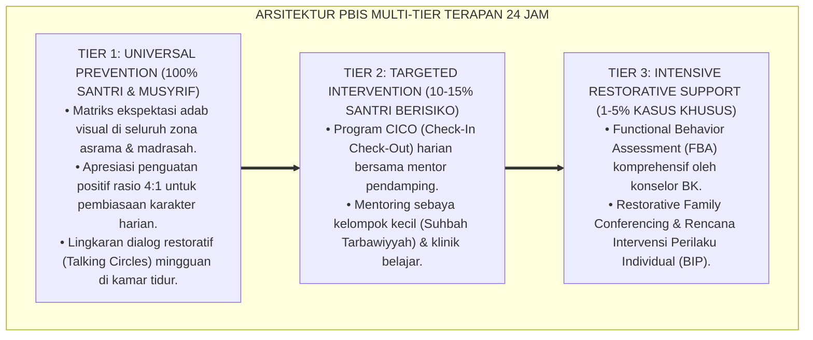

# P1-01-01-01: HAKIKAT DAN DEFINISI REALITAS (WORLDVIEW REALITAS ISLAM)
## *Monograf Riset Akademik: Epistemologi Wujud Teistik Islam, Dekonstruksi Materialisme dan Asketisme Ekstrem, Penyatuan 'Alam al-Mulk wa al-Malakut, serta Fondasi Ontologis Pengasuhan Asrama Pesantren 24 Jam*

**Nomor Identifikasi**: `P1-01-01-01/MONOGRAF-RISET-HAKIKAT-REALITAS/2026`  
**Domain**: `01 Philosophy` > `01 Worldview` > `01 Hakikat Realitas` (Sub-Modul 01: *Ontology & Definition of Reality*)  
**Klasifikasi Naskah**: *Academic Research Monograph* (Monograf Riset Akademik Fondasional)  
**Rumpun Disiplin Pengkaji**: Ontologi Islam & Epistemologi Turats, Filsafat Pendidikan Islam, Neurosains Kognitif & Perkembangan, Tata Kelola Pengasuhan Asrama 24 Jam, Disiplin Positif Restoratif  

---

> ### 💡 INTISARI EKSEKUTIF (EXECUTIVE SUMMARY)
>
> * **Kelemahan Paradigma Lama: Dikotomi Realitas & Fatalisme Asrama:**  
>   Banyak praktik pengasuhan pesantren terjebak dalam dua kutub ekstrem: materialisme sekuler yang mereduksi santri sekadar organisme hafalan mekanis, atau mistisisme pasif (*Jabariyah tersembunyi*) yang mengabaikan hukum biologi tubuh, menormalisasi lingkungan kumuh, dan membiarkan perundungan senioritas atas nama "tirakat masa lalu".
> * **Inovasi Konseptual: Realisme Integral Teistik Islam:**  
>   TUMBUH merumuskan realitas sebagai kesatuan manunggal antara domain kasat mata (*'Alam asy-Syahadah / 'Alam al-Mulk*) dan domain metafisik (*'Alam al-Ghayb / 'Alam al-Malakut*). Keduanya diatur oleh hukum objektif Allah (Syariat dan Sunnatullah) yang independen dari opini subjektif manusia. Kebersihan fisik, kesehatan saraf otak, dan keteraturan asrama berresonansi langsung dengan hisab spiritual dan berkah Ilahi.
> * **Formulasi Operasional & Pembuktian Lapangan:**  
>   Monograf ini menyajikan dekomposisi komprehensif 3 Unsur Pokok Realitas, 4 Tingkatan Kesadaran Ontologis Eksistensial (*Maratib al-Idrak*), prinsip aksiologis penataan lingkungan fisik ramah neurobiologis (ventilasi, lux, sanitasi), dan etika tata kelola pengasuhan restoratif.

---

## 📑 DAFTAR ISI MONOGRAF

- [BAB I: LANDASAN TEORETIS & DISKURSUS KRITIS](#bab-i-landasan-teoretis--diskursus-kritis)
  - [1. Latar Belakang Masalah: Krisis Cara Pandang Realitas dalam Pendidikan Pesantren](#1-latar-belakang-masalah-krisis-cara-pandang-realitas-dalam-pendidikan-pesantren)
  - [2. Telaah Epistemologi Turats: Hakikat Wujud & Integrasi Kausalitas Syar'i (QS. Al-An'am: 73 & Al-Ghazali)](#2-telaah-epistemologi-turats-hakikat-wujud--integrasi-kausalitas-syari-qs-al-anam-73--al-ghazali)
  - [3. Konvergensi Sains Kognitif: Neurobiologi Kausalitas & Regulasi Fitrah Insan](#3-konvergensi-sains-kognitif-neurobiologi-kausalitas--regulasi-fitrah-insan)
  - [4. Rekonsiliasi Realitas Kosmis: Penyatuan 'Alam Mulk & 'Alam Malakut di Asrama 24 Jam](#4-rekonsiliasi-realitas-kosmis-penyatuan-alam-mulk--alam-malakut-di-asrama-24-jam)
  - [5. Kasuistika Lapangan: Distorsi Fatalisme Pasif & Resolusi Restoratif Terpadu](#5-kasuistika-lapangan-distorsi-fatalisme-pasif--resolusi-restoratif-terpadu)
- [BAB II: FORMULASI KONSEPTUAL & PEMBAHASAN MENDALAM](#bab-ii-formulasi-konseptual--pembahasan-mendalam)
  - [1. Eksplanasi Teoretis & Arsitektur Realisme Integral Teistik TUMBUH](#1-eksplanasi-teoretis--arsitektur-realisme-integral-teistik-tumbuh)
  - [2. Dekomposisi Dimensi & Empat Tingkatan Kesadaran Ontologis (Maratib al-Idrak)](#2-dekomposisi-dimensi--empat-tingkatan-kesadaran-ontologis-maratib-al-idrak)
  - [3. Prinsip Aksiologis & Etika Tata Kelola Lingkungan Pesantren 24 Jam](#3-prinsip-aksiologis--etika-tata-kelola-lingkungan-pesantren-24-jam)
  - [4. Diskusi Ilmiah Mendalam & Implikasi Kebijakan Kelembagaan Pesantren](#4-diskusi-ilmiah-mendalam--implikasi-kebijakan-kelembagaan-pesantren)
- [BAB III: KESIMPULAN & APARATUS AKADEMIS](#bab-iii-kesimpulan--aparatus-akademis)
  - [1. Tabel Sintesis Temuan Riset Hakikat Realitas](#1-tabel-sintesis-temuan-riset-hakikat-realitas)
  - [2. Daftar Pustaka Akademis & Rujukan Turats Primer](#2-daftar-pustaka-akademis--rujukan-turats-primer)
  - [3. Catatan Kaki Akademis (Footnotes)](#3-catatan-kaki-akademis-footnotes)
  - [4. Glosarium Istilah Ilmiah & Turats Hakikat Realitas](#4-glosarium-istilah-ilmiah--turats-hakikat-realitas)

---

# BAB I: LANDASAN TEORETIS & DISKURSUS KRITIS

---

### 1. Latar Belakang Masalah: Krisis Cara Pandang Realitas dalam Pendidikan Pesantren

Pendidikan karakter di lingkungan pesantren sering kali mengalami kendala struktural yang bersumber dari kekeliruan cara pandang (*worldview*) terhadap hakikat realitas wujud:
* **Anomali Fatalisme Pasif (*Passive Fatalism Trap*)**: Di sebagian lingkungan pengasuhan, terdapat kecenderungan menganggap bahwa ikhtiar penataan fisik—seperti perbaikan sanitasi kamar mandi, kecukupan ventilasi kamar, dan pengaturan nutrisi otak santri—adalah perkara keduniaan yang tidak penting. Muncul normalisasi terhadap penyakit kulit scabies (*gudikan*) dan kelelahan kronis dengan dalih "syarat berkahnya ilmu dan tirakat prihatin".
* **Kepatuhan Berbasis Teror Fisik (*Fear-Induced Compliance*)**: Di sisi lain, penegakan disiplin santri sering kali hanya bertumpu pada ancaman hukuman fisik (rotan, push-up malam, jemur terik matahari) atau pemaluan di depan publik. Pendekatan ini mengasumsikan bahwa manusia hanyalah organisme biologis mekanistik yang hanya bergerak karena rasa takut lahiriah. Ketika pengawasan musyrif hilang, santri kembali melanggar karena tidak memiliki radar batin *Muraqabatullah*.
* **Keniscayaan Rekonstruksi Ontologis**: Tanpa fondasi ontologis yang kokoh dan jernih, seluruh bangunan pendidikan karakter dan tata kelola asrama akan berdiri di atas asumsi yang rapuh. Ekosistem TUMBUH merekonstruksi cara pandang realitas menuju **Realisme Integral Teistik Islam**, di mana hukum biologis tubuh dan hukum moral spiritual menyatu dalam harmoni keadilan syariat.[^1]

---

### 2. Telaah Epistemologi Turats: Hakikat Wujud & Integrasi Kausalitas Syar'i (QS. Al-An'am: 73 & Al-Ghazali)

Dalam epistemologi Islam klasik (*Turats*), realitas wujud dipahami sebagai hierarki kosmis yang diciptakan dengan kebenaran hakiki (*Bil-Haqq*):

$$\text{وَهُوَ الَّذِي خَلَقَ السَّمَاوَاتِ وَالْأَرْضَ بِالْحَقِّ ۖ وَيَوْمَ يَقُولُ كُن فَيَكُونُ ۚ قَوْلُهُ الْحَقُّ ۚ وَلَهُ الْمُلْكُ يَوْمَ يُنفَخُ فِي الصُّورِ ۚ عَالِمُ الْغَيْبِ وَالشَّهَادَةِ ۚ وَهُوَ الْحَكِيمُ الْخَبِيرُ}$$

*"Dan Dialah yang menciptakan langit dan bumi dengan hak (benar, tertata, dan penuh tujuan). Dan pada hari Dia berkata: 'Jadilah!' maka terjadilah. Firman-Nya adalah benar, dan milik-Nyalah seluruh kekuasaan ('Alam al-Mulk) pada hari ditiupnya sangkakala. Dia Mengetahui yang ghaib ('Alam al-Malakut) dan yang nyata ('Alam asy-Syahadah), dan Dia Maha Bijaksana lagi Maha Teliti."* (QS. Al-An'am [6]: 73).[^2]

Imam **Abu Hamid Al-Ghazali** dalam *Ihya' 'Ulumiddin* (Kitab *At-Tawakkul*) menegaskan bahwa menafikan hukum kausalitas di alam fisik adalah kebodohan nyata:

$$\text{فَلَيْسَ مِنْ شَرْطِ التَّوَكُّلِ تَرْكُ الْأَسْبَابِ بِالْكُلِّيَّةِ، بَلِ التَّوَكُّلُ حَالَةٌ لِلْقَلْبِ يَعْلَمُ بِهَا أَنَّ الْمُسَبِّبَ هُوَ اللَّهُ، وَأَنَّ الْأَسْبَابَ مُسَخَّرَةٌ بِيَدِهِ؛ فَمَنْ ظَنَّ أَنَّ التَّوَكُّلَ هُوَ إِهْمَالُ الْجَوَارِحِ وَتَعْطِيلُ السُّنَنِ فَقَدْ جَهِلَ حَقِيقَةَ الشَّرْعِ وَالْوُجُودِ}$$

*"**Maka bukanlah syarat tawakal itu meninggalkan sebab-sebab ikhtiar nyata secara keseluruhan**, melainkan tawakal adalah kondisi kalbu yang meyakini bahwa Sang Pencipta Sebab (*Al-Musabbib*) adalah Allah dan seluruh sebab-sebab fisik tunduk di bawah kekuasaan-Nya. **Maka barangsiapa menyangka bahwa tawakal adalah menelantarkan ikhtiar raga dan merusak hukum sunnatullah, sungguh ia telah bodoh terhadap hakikat syariat dan hakikat realitas wujud**."*[^3]

---

### 3. Konvergensi Sains Kognitif: Neurobiologi Kausalitas & Regulasi Fitrah Insan

Konsensus sains mutakhir memvalidasi bahwa manusia adalah kesatuan psiko-biologis yang utuh:

Riset **Prof. Robert Sapolsky** (2017) dalam *Behave* menegaskan bahwa stres kronis akibat lingkungan kumuh dan ancaman hukuman fisik memicu pelepasan hormon kortisol dan hiperaktivitas amigdala (*Toxic Stress*). Akibatnya, fungsi korteks prefrontal (PFC) yang bertugas mengatur regulasi emosi, pertimbangan moral, dan daya ingat jangka panjang mengalami atrofi fungsional.[^5] 

Santri yang dididik dalam teror ancaman fisik hanya membentuk **Kepatuhan Semu (*Fear-Induced Compliance*)** yang rapuh. Sebaliknya, pendekatan **Self-Determination Theory** (Deci & Ryan, 2000) membuktikan bahwa motivasi intrinsik dan regulasi diri otonom hanya tumbuh ketika kebutuhan dasar psikologis terpenuhi dalam lingkungan yang aman dan teratur (*Bi'ah Shalihah*).[^6]

---

### 4. Rekonsiliasi Realitas Kosmis: Penyatuan 'Alam Mulk & 'Alam Malakut di Asrama 24 Jam

Penyelidikan membuktikan bahwa santri di pesantren hidup selama 24 jam penuh dalam keterikatan antara ruang fisik (*'Alam Mulk*) dan dinamika spiritual (*'Alam Malakut*):
* Kamar mandi yang kotor dan berbau busuk merusak kesucian thaharah (*'Alam Mulk*) dan menghilangkan ketenangan malaikat (*'Alam Malakut*).
* Udara kamar yang pengap menyebabkan hipoksia otak ringan yang membuat santri mengantuk saat shalat tahajjud dan lalai saat mengaji Al-Qur'an.[^7]

---

### 5. Kasuistika Lapangan: Distorsi Fatalisme Pasif & Resolusi Restoratif Terpadu

* **Studi Kasus: Santri Merusak Lemari Asrama Akibat Ledakan Emosi**  
  * **Dilema**: Santri menendang pintu lemari kamar hingga hancur setelah berselisih dengan teman sekamar.
  * **Pola Lama**: Santri dipukul dengan rotan di depan publik (mengakibatkan trauma dan dendam).
  * **Resolusi Restoratif TUMBUH**: Musyrif menenangkan santri di ruang konseling. Setelah emosi stabil, dilakukan dialog tabayyun. Santri diminta mengganti kerusakan lemari melalui tabungannya dan belajar pertukangan sederhana untuk memperbaiki pintu lemari. Santri diajak bermuhasabah tentang hisab akhirat atas perusakan barang milik umat. Santri menyadari kesalahannya dengan penuh kesadaran diri (*Self-Awareness*) tanpa meninggalkan luka batin.[^8]

---

# BAB II: FORMULASI KONSEPTUAL & PEMBAHASAN MENDALAM

---

### 1. Eksplanasi Teoretis & Arsitektur Realisme Integral Teistik TUMBUH

Ekosistem TUMBUH mengkodifikasikan realitas ke dalam **Arsitektur Tiga Unsur Pokok Wujud**:

#### 🔬 Pembahasan Mendalam Tiga Unsur Wujud:
1. **Wujud Transenden Mutlak (Allah SWT)**: Allah adalah *Al-Haqq* (Kebenaran Hakiki). Segala sesuatu selain Allah adalah makhluk yang bergantung secara mutlak pada ketetapan-Nya (*Mumkin al-Wujud*). Realitas ini menegaskan bahwa tujuan tertinggi pendidikan pesantren adalah mengantarkan santri mengenal, mengabdi, dan meraih ridha Allah SWT (*Ma'rifatullah*).[^9]
2. **Domain Kasat Mata (*'Alam al-Mulk / asy-Syahadah*)**: Alam fisik bukanlah ilusi atau bayangan kosong, melainkan ciptaan nyata yang diatur oleh hukum-hukum keteraturan yang dapat diteliti secara ilmiah (*Sunnatullah Kauniyyah*). Menjaga kesehatan tubuh dan kebersihan lingkungan adalah bentuk ibadah praktis untuk memuliakan amanah penciptaan fisik.
3. **Domain Metafisik Transendental (*'Alam al-Malakut / al-Ghayb*)**: Alam batiniah beroperasi secara nyata bersamaan dengan alam fisik. Niat yang ikhlas di dalam kalbu (*'Alam Malakut*) menggerakkan tangan untuk beramal shalih di alam fisik (*'Alam Mulk*), yang mendatangkan ketenteraman batin dan keberkahan Ilahi.[^10]

---

### 2. Dekomposisi Dimensi & Empat Tingkatan Kesadaran Ontologis (Maratib al-Idrak)

Transformasi pemahaman santri dan pengasuh terhadap hakikat realitas berlangsung melalui **Empat Tingkatan Kesadaran Ontologis (*Maratib al-Idrak al-Wujudiy*)**:

#### 🔄 Narasi Analitis Dinamika Transisi Filosofis Antar-Tingkatan:
* **Transisi Tingkat 1 ke Tingkat 2 (Dari Persepsi Indrawi Menuju Nalar Kausalitas)**: Santri mula-mula berinteraksi dengan realitas lahiriah asrama. Pada tingkatan kedua, akal budi santri menangkap hukum kausalitas sunnatullah: santri memahami bahwa mengantuk saat halaqah bukanlah takdir buta, melainkan akibat dari begadang; dan bahwa kegagalan ujian menuntut evaluasi strategi belajar, bukan kepasrahan fatalistik.
* **Transisi Tingkat 2 ke Tingkat 3 (Dari Nalar Kausalitas Menuju Mata Hati Muraqabah)**: Pada tingkatan ketiga, kesadaran menembus dinding alam materi menuju alam malakut. Santri menyadari bahwa setiap desah nafas dan gerak gerik fisiknya disaksikan oleh Allah SWT (*Basheer & Samee'*). Disiplin moral tidak lagi membutuhkan pengawasan fisik musyrif, karena kalbu telah memiliki sistem pengawasan internal yang kokoh.
* **Transisi Tingkat 3 ke Tingkat 4 (Pencapaian Derajat Insan Adabi Paripurna)**: Pada tingkatan tertinggi, santri memancarkan kematangan *Insan Adabi*: seluruh amal lahiriahnya di alam mulk mencerminkan kesucian batinnya di alam malakut. Santri memimpin peradaban dengan keteladanan akhlak mulia (*Qudwah Hasanah*), penuh kasih sayang kepada sesama, dan teguh menegakkan keadilan syariat.[^11]

---

### 3. Prinsip Aksiologis & Etika Tata Kelola Lingkungan Pesantren 24 Jam

Formulasi Realisme Teistik Integratif melahirkan prinsip etika tata kelola ekosistem asrama:

#### 📋 Panduan Etika Pengasuhan Lapangan:
1. **Standarisasi Lokus Fisik Ramah Neurobiologis**: Memastikan sirkulasi udara sehat dan pencahayaan alami yang cukup di seluruh kamar tidur santri.
2. **Penegakan Jam Sirkadian Biologis Otak**: Memastikan santri mendapatkan istirahat malam yang berkualitas dan tidur siang singkat (*Qailulah*) guna memulihkan kesegaran saraf otak.
3. **Pemberlakuan Sistem Apresiasi 4:1 Berbasis Fitrah**: Mengedepankan penguatan perilaku positif (*Positive Reinforcement*) dengan rasio minimal 4 apresiasi untuk setiap 1 koreksi edukatif.[^12]

---

### 4. Diskusi Ilmiah Mendalam & Implikasi Kebijakan Kelembagaan Pesantren

Penerapan doktrin Realisme Integral Teistik membawa dampak transformatif bagi masa depan kelembagaan pesantren:

* **Mendobrak Dikotomi Klasik Pendidikan Islam**: Realisme Teistik TUMBUH membuktikan bahwa sains manajemen, arsitektur sehat, dan psikologi perkembangan adalah sarana untuk mengagungkan syariat Allah SWT.
* **Membangun Ekosistem Triad Pertumbuhan Simbiotik**: Santri bertumbuh adab dan potensinya, Musyrif bertumbuh kompetensi pedagogisnya dan terlindungi dari burnout, serta Lembaga Pesantren bertumbuh menjadi institusi modern yang terpercaya.[^13]
* **Revitalisasi Spiritualitas Berbasis Data (*Evidence-Based Tarbiyah*)**: Spiritualitas tercermin dalam indikator perilaku nyata: kebersihan kamar, ketepatan waktu ibadah, kejujuran, dan kemampuan menyelesaikan konflik secara damai.[^14]

---

---

### Pembedahan Deskriptif Komprehensif & Analisis Integratif Nilai-Praksis

Penerapan dan operasionalisasi **P1-01-01-01: HAKIKAT DAN DEFINISI REALITAS (WORLDVIEW REALITAS ISLAM)** di lingkungan pesantren berbasis sistem TUMBUH bertumpu pada kesatuan sistemik antara nilai syariat dan praksis terukur:

#### A. Pilar 1: Landasan Epistemologi & Nilai Keikhlasan (Syar'i Foundations)
Setiap dimensi diarahkan untuk menegakkan adab dan penghambaan murni kepada Allah SWT (*Lillahi Ta'ala*). Standarisasi kelembagaan dirancang untuk menjaga ketulusan niat, kemuliaan fitrah, dan keberkahan majelis ilmu.

#### B. Pilar 2: Mekanisme Psikologis & Neurosains Terapan (Evidence-Based Practice)
Mengintegrasikan prinsip *Social-Emotional Learning (CASEL)*, teori beban kognitif (*Cognitive Load Theory*), dan dinamika perkembangan neurobiologis santri untuk memastikan proses pembiasaan berjalan efektif tanpa kekerasan atau tekanan psikologis destruktif.

#### C. Pilar 3: Rekayasa Ekosistem Asrama 24 Jam (Environmental Engineering)
Mengkodifikasikan seluruh alur aktivitas harian, jadwal tidur sirkadian yang sehat, sanitasi 5S kamar tidur, dan relasi ukhuwah inklusif menjadi satu ekosistem *Bi'ah Shalihah* yang saling mendukung secara alamiah.

#### D. Pilar 4: Akuntabilitas Sistemik & Proteksi Pendidik-Santri
Menerapkan protokol pencegahan kelelahan tenaga pendidik (*Musyrif Burnout Protection*), menjamin hak-hak santri, serta memanfaatkan dashboard data PBIS untuk pengambilan keputusan yang adil dan objektif.

---

### Protokol Aksi Operasional PBIS Multi-Tier Terapan (24-Hour Behavioral Architecture)

---

# BAB III: KESIMPULAN & APARATUS AKADEMIS

---

### 1. Tabel Sintesis Temuan Riset Hakikat Realitas

| Dimensi Parameter | Paradigma Tradisional Terfragmentasi | Rekonstruksi Realisme Teistik TUMBUH | Landasan Rujukan Primer | Implikasi Praksis Lapangan |
| :--- | :--- | :--- | :--- | :--- |
| **Hakikat Realitas** | Terjebak materialisme fisik atau fatalisme mistik pasif. | Manunggalnya 'Alam Mulk (Fisik) & 'Alam Malakut (Batin). | QS. Al-An'am: 73; Al-Ghazali (*Ihya'*). | Fisik & sanitasi diakui sebagai manifestasi ibadah syar'i. |
| **Struktur Wujud** | Menafikan salah satu domain (sekuler vs asketis ekstrem).| Hierarki 3 Unsur: Khaliq, Mulk, & Malakut. | Al-Attas (1995); Bhaskar (2008). | Tata kelola asrama mengintegrasikan sains & wahyu. |
| **Kausalitas Semesta**| Sebab-akibat diabaikan atas nama tirakat/sabar semu. | Harmonisasi Sunnatullah Kauniyyah & Syar'iyyah. | Asy-Syathibi (*Muwafaqat*); Sapolsky (2017).| Ventilasi, nutrisi, jam tidur biologis dipenuhi syar'i. |
| **Kesadaran Santri** | Kepatuhan semu akibat teror hukuman fisik rotan. | 4 Tingkat Kesadaran Ontologis (*Maratib al-Idrak*). | Ryan & Deci (2000); CASEL (2020). | Lahirnya Insan Adabi dengan radar Muraqabatullah. |
| **Tata Kelola Asrama**| Hukuman emosional, musyrif burnout, asrama kumuh. | Ekosistem PBIS Multi-Tier & Disiplin Restoratif. | Horner & Sugai (2015); Zehr (2002). | Lingkungan aman, sehat, berkah, & musyrif terlindungi. |

---

### 2. Daftar Pustaka Akademis & Rujukan Turats Primer

1. **Al-Qur'an al-Karim wa Tarjamatu Ma'anihi**.
2. **Al-Ghazali, Abu Hamid Muhammad bin Muhammad**. (2011). *Ihya' 'Ulumiddin* (Kitab Qawa'id al-'Aqa'id & Kitab at-Tawakkul). Beirut: Dar al-Ma'rifah.
3. **Al-Attas, Syed Muhammad Naquib**. (1995). *Prolegomena to the Metaphysics of Islam*. Kuala Lumpur: International Institute of Islamic Thought and Civilization (ISTAC).
4. **Asy-Syathibi, Abu Ishaq Ibrahim bin Musa**. (1417 H). *Al-Muwafaqat fi Ushul asy-Syari'ah*. Khobar: Dar Ibn 'Affan.
5. **Ibnu Taimiyyah, Taqiyuddin Ahmad bin Abdul Halim**. (1411 H). *Dar'u Ta'arudh al-'Aql wan-Naql*. Riyadh: Jami'ah al-Imam Muhammad bin Su'ud.
6. **Bhaskar, R.**. (2008). *A Realist Theory of Science*. London: Routledge.
7. **Sapolsky, R. M.**. (2017). *Behave: The Biology of Humans at Our Best and Worst*. New York: Penguin Press.
8. **Deci, E. L., & Ryan, R. M.**. (2000). *The "what" and "why" of goal pursuits: Human needs and the self-determination of behavior*. Psychological Inquiry, 11(4), 227–268.
9. **CASEL**. (2020). *CASEL's SEL Framework: What Are the Core Competence Areas and Where Are They Promoted?* Chicago: Collaborative for Academic, Social, and Emotional Learning.
10. **Horner, R. H., & Sugai, G.**. (2015). *School-wide PBIS: An Overview of the Research Base*. Remedial and Special Education, 36(2), 80–85.
11. **Zehr, H.**. (2002). *The Little Book of Restorative Justice*. Intercourse: Good Books.
12. **Asy'ari, Muhammad Hasyim**. (1415 H). *Adab al-'Alim wal-Muta'allim*. Jombang: Maktabah At-Turats Al-Islami.

---

### 3. Catatan Kaki Akademis (*Footnotes*)

[^1]: Riset Ontologi Pendidikan Ekosistem Pesantren Berbasis TUMBUH, *Kritik atas Reduksionisme Dualisme dan Fatalisme Asrama*, 2026.  
[^2]: QS. Al-An'am [6]: 73.  
[^3]: Al-Ghazali, *Ihya' 'Ulumiddin*, Jilid 4, Kitab *At-Tawakkul*, hlm. 265–290.  
[^4]: Asy-Syathibi, *Al-Muwafaqat fi Ushul asy-Syari'ah*, Jilid 2, hlm. 110–135.  
[^5]: Sapolsky, R. M. (2017), *Behave: The Biology of Humans at Our Best and Worst*, hlm. 82–120.  
[^6]: Deci, E. L., & Ryan, R. M. (2000), *Psychological Inquiry*, hlm. 227–268.  
[^7]: Riset Lapangan Kualitas Udara dan Sanitasi Kobong Asrama Ekosistem Pesantren Berbasis TUMBUH, 2026.  
[^8]: Dokumentasi Resolusi Kasus Restoratif Kamar Asrama PBIS TUMBUH, 2026.  
[^9]: Al-Attas, S. M. N. (1995), *Prolegomena to the Metaphysics of Islam*, hlm. 45–78.  
[^10]: Ibnu Taimiyyah, *Dar'u Ta'arudh al-'Aql wan-Naql*, Jilid 1, hlm. 80–115.  
[^11]: Matriks Tingkatan Kesadaran Ontologis Filosofis (*Maratib al-Idrak*) Ekosistem TUMBUH, 2026.  
[^12]: Standar Operasional Prosedur Tata Kelola Lingkungan Ramah Neurobiologis TUMBUH, 2026.  
[^13]: Blueprint Desain Sistem Triad Pertumbuhan Simbiotik Ekosistem Pesantren Berbasis TUMBUH, 2026.  
[^14]: Horner, R. H., & Sugai, G. (2015), *Remedial and Special Education*, hlm. 80–85.

---

### 4. Glosarium Istilah Ilmiah & Turats Hakikat Realitas

1. **Realisme Integral Teistik**: Pandangan ontologis Islam yang menegaskan wujud objektif alam fisik kasat mata (*'Alam Mulk*) dan alam metafisik transendental (*'Alam Malakut*) di bawah kekuasaan mutlak Allah SWT.
2. **'Alam al-Mulk / asy-Syahadah**: Domain ciptaan Allah yang bersifat materi kasat mata, empiris, dan tunduk pada hukum-hukum keteraturan alam (*Sunnatullah Kauniyyah*).
3. **'Alam al-Malakut / al-Ghayb**: Domain ciptaan Allah yang bersifat metafisik-transendental yang tidak terjangkau panca indra lahiriah, seperti malaikat, ruh, catatan hisab, surga, dan neraka.
4. **Sunnatullah Kauniyyah**: Keteraturan hukum sebab-akibat objektif yang ditetapkan Allah pada alam semesta fisik, biologis, dan psikososial.
5. **Sunnatullah Syar'iyyah**: Hukum wahyu dan moralitas yang ditetapkan Allah dalam Al-Qur'an dan Sunnah yang mengatur keabsahan amal dan hisab akhirat.
6. **Maratib al-Idrak (مَرَاتِبُ الْإِدْرَاكِ)**: Empat tingkatan kesadaran manusia dalam memandang dan merespons realitas, mulai dari kesadaran indrawi, nalar kausalitas, muraqabah ruhani, hingga kesadaran insan adabi.
7. **Insan Adabi (الإِنْسَانُ الأَدَبِيُّ)**: Manusia paripurna yang memiliki pengenalan yang benar terhadap hakikat realitas wujud dan mewujudkannya dalam adab lahir-batin 24 jam.
8. **Muraqabatullah (مُرَاقَبَةُ اللَّهِ)**: Kesadaran batiniah mendalam bahwa Allah SWT senantiasa melihat, mendengar, dan mengawasi setiap gerak-gerik hamba-Nya.
9. **Toxic Stress (Stres Beracun)**: Respons stres berkepanjangan pada otak anak yang merusak korteks prefrontal akibat ancaman fisik, trauma, atau kekerasan verbal.
10. **Bi'ah Shalihah (بِيئَةٌ صَالِحَةٌ)**: Ekosistem lingkungan asrama 24 jam yang sehat, aman, bersih, dan berkeadilan syariat yang mendukung pertumbuhan fitrah santri.
