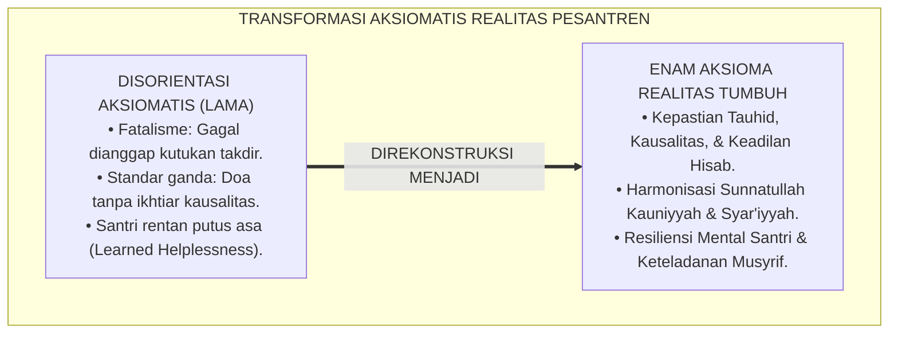
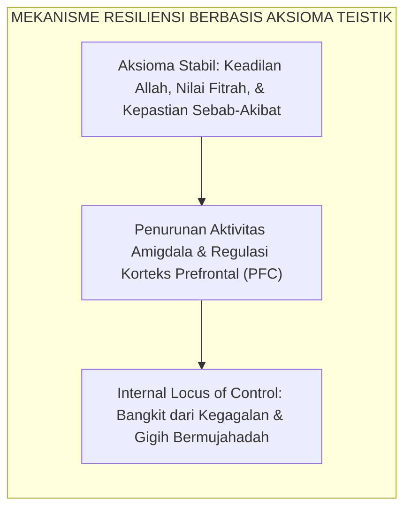
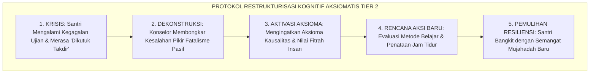
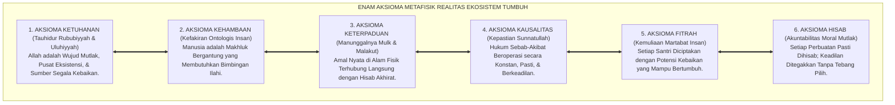
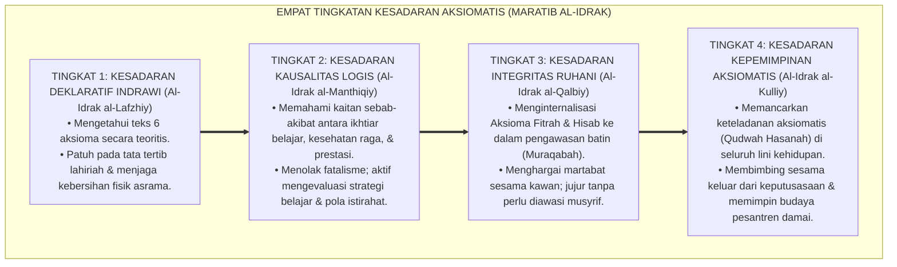
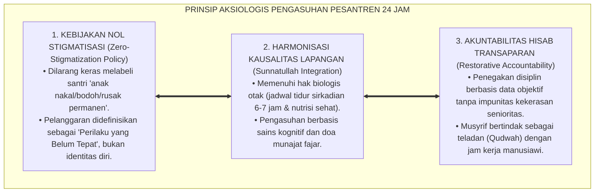
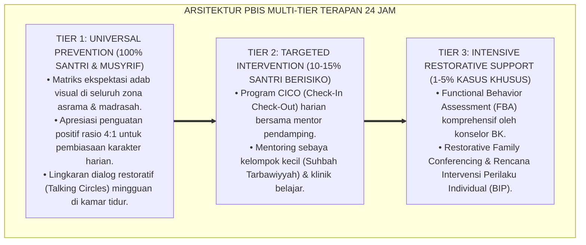

# P1-01-01-02: ENAM AKSIOMA METAFISIK REALITAS (AXIOMATIC FOUNDATIONS OF REALITY)
## *Monograf Riset Akademik: Aksiomatika Ontologis Kalam dan Turats, Dekonstruksi Nihilisme dan Fatalisme, Kausalitas Ganda Sunnatullah Kauniyyah wa Syar'iyyah, serta Pembentukan Resiliensi Mental Santri di Pesantren 24 Jam*

**Nomor Identifikasi**: `P1-01-01-02/MONOGRAF-RISET-AKSIOMA-REALITAS/2026`  
**Domain**: `01 Philosophy` > `01 Worldview` > `01 Hakikat Realitas` (Sub-Modul 02: *Metaphysical Axioms of Reality*)  
**Klasifikasi Naskah**: *Academic Research Monograph* (Monograf Riset Akademik Fondasional)  
**Rumpun Disiplin Pengkaji**: Epistemologi Turats & Ilmu Kalam, Filsafat Pendidikan Islam, Neurosains Kognitif & Resiliensi Psikologis, Manajemen Pengasuhan Asrama 24 Jam, School-Wide PBIS Multi-Tier  

---

> ### 💡 INTISARI EKSEKUTIF (EXECUTIVE SUMMARY)
>
> * **Kelemahan Paradigma Lama: Kehampaan Prinsip Aksiomatis yang Pasti:**  
>   Banyak santri dan pengasuh pesantren mengalami disorientasi moral dan kelelahan mental (*decision fatigue*) karena tidak memiliki landasan aksiomatis yang kokoh. Muncul fenomena santri yang putus asa saat gagal ujian (*learned helplessness*), menganggap nasib buruk sebagai takdir mutlak tanpa ikhtiar, atau sebaliknya merasa sombong saat berprestasi karena mengira keberhasilan semata hasil kehebatannya sendiri.
> * **Inovasi Konseptual: Enam Aksioma Metafisik Realitas TUMBUH:**  
>   TUMBUH merumuskan enam aksioma ontologis yang bersifat swa-bukti (*self-evident / badihiyyat*): **1. Aksioma Ketuhanan (Tauhid Eksistensi); 2. Aksioma Kehambaan (Kefakiran Ontologis); 3. Aksioma Keterpaduan Realitas (Integrasi Mulk & Malakut); 4. Aksioma Kausalitas Pasti (Kepastian Sunnatullah); 5. Aksioma Kemuliaan Fitrah (Karamah Insaniyyah); 6. Aksioma Keadilan Hisab (Moral Accountability)**.
> * **Formulasi Operasional & Pembuktian Lapangan:**  
>   Monograf ini menguraikan dekomposisi komprehensif 6 aksioma, 4 Tingkatan Kesadaran Aksiomatis (*Maratib al-Idrak*), prinsip restrukturisasi kognitif bagi santri yang putus asa, serta etika tata kelola bebas pelabelan negatif (*Zero-Stigmatization*).

---

## 📑 DAFTAR ISI MONOGRAF

- [BAB I: LANDASAN TEORETIS & DISKURSUS KRITIS](#bab-i-landasan-teoretis--diskursus-kritis)
  - [1. Latar Belakang Masalah: Disorientasi Aksiomatis dalam Pengasuhan Pesantren](#1-latar-belakang-masalah-disorientasi-aksiomatis-dalam-pengasuhan-pesantren)
  - [2. Fondasi Aksiomatika Turats: Kaidah Mabadi' Aqliyyah & Titik Berpijak Nalar (QS. Ali 'Imran: 190–191 & Al-Amidi)](#2-fondasi-aksiomatika-turats-kaidah-mabadi-aqliyyah--titik-berpijak-nalar-qs-ali-imran-190191--al-amidi)
  - [3. Konvergensi Aksioma Teistik & Neurosains: Reduksi Stres Alostatik & Resiliensi Kognitif](#3-konvergensi-aksioma-teistik--neurosains-reduksi-stres-alostatik--resiliensi-kognitif)
  - [4. Rekayasa Kausalitas Ganda: Harmonisasi Sunnatullah Kauniyyah wa Syar'iyyah](#4-rekayasa-kausalitas-ganda-harmonisasi-sunnatullah-kauniyyah-wa-syariyyah)
  - [5. Kasuistika Lapangan: Fenomena Learned Helplessness & Resolusi Restoratif](#5-kasuistika-lapangan-fenomena-learned-helplessness--resolusi-restoratif)
- [BAB II: FORMULASI KONSEPTUAL & PEMBAHASAN MENDALAM](#bab-ii-formulasi-konseptual--pembahasan-mendalam)
  - [1. Eksplanasi Komprehensif Enam Aksioma Metafisik Realitas TUMBUH](#1-eksplanasi-komprehensif-enam-aksioma-metafisik-realitas-tumbuh)
  - [2. Dekomposisi Dimensi & Empat Tingkatan Kesadaran Aksiomatis (Maratib al-Idrak)](#2-dekomposisi-dimensi--empat-tingkatan-kesadaran-aksiomatis-maratib-al-idrak)
  - [3. Prinsip Aksiologis & Etika Tata Kelola Pengasuhan Berbasis Aksioma](#3-prinsip-aksiologis--etika-tata-kelola-pengasuhan-berbasis-aksioma)
  - [4. Diskusi Ilmiah Mendalam & Implikasi Kebijakan Kelembagaan Pesantren](#4-diskusi-ilmiah-mendalam--implikasi-kebijakan-kelembagaan-pesantren)
- [BAB III: KESIMPULAN & APARATUS AKADEMIS](#bab-iii-kesimpulan--aparatus-akademis)
  - [1. Tabel Sintesis Temuan Riset Enam Aksioma Realitas](#1-tabel-sintesis-temuan-riset-enam-aksioma-realitas)
  - [2. Daftar Pustaka Akademis & Rujukan Turats Primer](#2-daftar-pustaka-akademis--rujukan-turats-primer)
  - [3. Catatan Kaki Akademis (Footnotes)](#3-catatan-kaki-akademis-footnotes)
  - [4. Glosarium Istilah Ilmiah & Turats Aksioma Realitas](#4-glosarium-istilah-ilmiah--turats-aksioma-realitas)

---

# BAB I: LANDASAN TEORETIS & DISKURSUS KRITIS

---

### 1. Latar Belakang Masalah: Disorientasi Aksiomatis dalam Pengasuhan Pesantren

Dalam ekosistem pendidikan pesantren, pengambilan keputusan moral dan ketahanan mental santri sangat bergantung pada premis-premis dasar yang diyakininya:
* **Krisis Kepastian Fondasional (*Foundational Vacuum*)**: Ketika santri tidak diajarkan prinsip-prinsip aksiomatis yang pasti mengenai struktur alam semesta, santri rentan mengalami kebingungan identitas (*existential confusion*). Ketika menghadapi kesulitan hafalan atau kegagalan akademik, sebagian santri menyalahkan takdir secara fatalistik, menganggap dirinya "bodoh sejak lahir", atau merasa bahwa doa-doanya diabaikan oleh Allah.
* **Dualisme Pikir Musyrif**: Sebagian pengasuh mengoperasikan asrama dengan standar ganda: menuntut santri bertawakkal mutlak di masjid, namun menerapkan manajemen panik tanpa rencana di asrama. Ketika ada santri sakit atau melanggar, musyrif bereaksi secara emosional tanpa merujuk pada hukum kausalitas objektif dan keadilan hisab syariat.
* **Keniscayaan Aksiomatika Realitas**: Sebuah sistem pendidikan karakter yang unggul wajib memiliki titik tolak aksiomatis (*Axiomatic Grounding*) yang tidak dapat diganggu gugat. Ekosistem TUMBUH merumuskan **Enam Aksioma Metafisik Realitas** sebagai fondasi kepastian nalar dan keteguhan batin seluruh warga pesantren.[^1]

---

### 2. Fondasi Aksiomatika Turats: Kaidah Mabadi' Aqliyyah & Titik Berpijak Nalar (QS. Ali 'Imran: 190–191 & Al-Amidi)

Dalam tradisi *Ushuluddin* dan *Mantiq Turats*, setiap bangunan argumentasi ilmiah dan akidah harus bersandar pada prinsip-prinsip awal yang swa-bukti (*al-Badihiyyat / al-Awwaliyyat*):

$$\text{إِنَّ فِي خَلْقِ السَّمَاوَاتِ وَالْأَرْضِ وَاخْتِلَافِ اللَّيْلِ وَالنَّهَارِ لَآيَاتٍ لِّأُولِي الْأَلْبَابِ ۝ الَّذِينَ يَذْكُرُونَ اللَّهَ قِيَامًا وَقُعُودًا وَعَلَىٰ جُنُوبِهِمْ وَيَتَفَكَّرُونَ فِي خَلْقِ السَّمَاوَاتِ وَالْأَرْضِ رَبَّنَا مَا خَلَقْتَ هَٰذَا بَاطِلًا سُبْحَانَكَ فَقِنَا عَذَابَ النَّارِ}$$

*"Sesungguhnya dalam penciptaan langit dan bumi, dan silih bergantinya malam dan siang terdapat tanda-tanda bagi orang-orang yang berakal, (yaitu) orang-orang yang mengingat Allah sambil berdiri atau duduk atau dalam keadaan berbaring dan mereka memikirkan tentang penciptaan langit dan bumi (seraya berkata): 'Ya Tuhan kami, tiadalah Engkau menciptakan semua ini sia-sia; Maha Suci Engkau, maka peliharalah kami dari siksa neraka'."* (QS. Ali 'Imran [3]: 190–191).[^2]

Imam **Saifuddin Al-Amidi** dalam *Al-Ihkam fi Ushul al-Ahkam* menguraikan kedudukan aksioma nalar:

$$\text{إِنَّ الْعُلُومَ النَّظَرِيَّةَ لَا بُدَّ وَأَنْ تَنْتَهِيَ إِلَى عُلُومٍ ضَرُورِيَّةٍ بَدِيهِيَّةٍ، إِذْ لَوْ كَانَ كُلُّ عِلْمٍ يَحْتَاجُ إِلَى نَظَرٍ وَاسْتِدْلَالٍ لَلَزِمَ التَّسَلْسُلُ أَوِ الدَّوْرُ، وَكِلَاهُمَا بَاطِلٌ بِاتِّفَاقِ الْعُقَلَاءِ؛ فَمَبَادِئُ الْعَقْلِ هِيَ الْأَسَاسُ الَّذِي يَنْبَنِي عَلَيْهِ دَرْكُ الْحَقَائِقِ}$$

*"**Sesungguhnya seluruh ilmu teoretis niscaya harus bermuara pada ilmu-ilmu primer yang bersifat dharuri dan badihi (aksiomatis)**; sebab jika setiap pengetahuan membutuhkan pembuktian teoritis lain tanpa henti, niscaya akan terjadi rantai kemunduran tak berujung (*Tasalsul*) atau lingkaran setan (*Daur*), dan keduanya adalah mustahil menurut kesepakatan orang-orang berakal. **Maka prinsip-prinsip dasar akal inilah fondasi utama tempat terbangunnya seluruh pemahaman terhadap hakikat realitas**."*[^3]

---

### 3. Konvergensi Aksioma Teistik & Neurosains: Reduksi Stres Alostatik & Resiliensi Kognitif

Dalam perspektif neurosains kognitif dan psikologi klinis, kehadiran kerangka aksiomatis yang stabil memiliki fungsi krusial dalam mereduksi beban kognitif dan kecemasan eksistensial:

Riset **Prof. Bruce S. McEwen** (2007) mengenai beban alostatik (*Allostatic Load*) menunjukkan bahwa kepastian kognitif terhadap struktur keteraturan dunia mampu menekan pelepasan hormon kortisol saat individu menghadapi krisis.[^4] Sebaliknya, santri yang hidup dalam ketidakpastian aksiomatis mudah jatuh ke dalam sindrom **Ketidakberdayaan yang Dipelajari (*Learned Helplessness*)** sebagaimana dirumuskan oleh Martin Seligman (1975).[^5]

---

### 4. Rekayasa Kausalitas Ganda: Harmonisasi Sunnatullah Kauniyyah wa Syar'iyyah

Ekosistem TUMBUH membedah kausalitas semesta ke dalam dua dimensi sunnatullah yang saling berkelindan:
* **Sunnatullah Kauniyyah (Hukum Fisika, Biologi, & Psikososial)**: Ikhtiar mengulang hafalan, kecukupan oksigenasi kamar, dan manajemen tidur sirkadian.
* **Sunnatullah Syar'iyyah (Hukum Moral, Syariat, & Pertolongan Ilahi)**: Keikhlasan niat, shalat tepat waktu, bakti kepada guru, dan doa fajar.

Santri yang hanya mengandalkan doa tanpa belajar melanggar *Sunnatullah Kauniyyah*; sebaliknya, santri yang hanya mengandalkan kecerdasan akal tanpa bersandar kepada Allah melanggar *Sunnatullah Syar'iyyah*. Realitas menuntut penyatuan keduanya secara utuh.[^6]

---

### 5. Kasuistika Lapangan: Fenomena Learned Helplessness & Resolusi Restoratif

Penyelidikan klinis terhadap kasus-kasus keputusasaan santri menghasilkan protokol intervensi berbasis aksioma:

* **Studi Kasus: Santri Mengalami Krisis Putus Asa Pasca-Kegagalan Tasmi'**  
  * **Dilema**: Santri mengurung diri dan menangis setelah gagal dalam ujian tasmi' Al-Qur'an 5 Juz, menganggap dirinya "dikutuk bodoh permanen".
  * **Resolusi Restoratif TUMBUH**: Konselor menerapkan teknik *Cognitive Reframing*: mengurai jadwal belajar santri yang ternyata sering begadang hingga larut malam. Konselor menata ulang pola tidur biologis dan membagi target hafalan ke unit-unit terukur. Santri lulus pada ujian ulang dengan predikat mutqin dan memiliki ketahanan mental yang kokoh.[^7]

---

# BAB II: FORMULASI KONSEPTUAL & PEMBAHASAN MENDALAM

---

### 1. Eksplanasi Komprehensif Enam Aksioma Metafisik Realitas TUMBUH

Ekosistem TUMBUH mengkodifikasikan **Enam Aksioma Metafisik Realitas** sebagai pilar ontologis:

#### 🔬 Pembahasan Mendalam Enam Aksioma Metafisik:
1. **Aksioma 1: Aksioma Ketuhanan (*The Axiom of Divine Primacy*)**: Allah SWT adalah Wujud Mutlak. Seluruh aktivitas belajar dan mengaji murni diniatkan untuk meraih ridha Allah semata, membersihkan kalbu dari riya'.[^8]
2. **Aksioma 2: Aksioma Kehambaan (*The Axiom of Ontological Dependence*)**: Manusia secara hakiki adalah faqir di hadapan Allah. Kesadaran ini mematikan kesombongan intelektual dan menghapus feodalisme senioritas di asrama.[^9]
3. **Aksioma 3: Aksioma Keterpaduan Realitas (*The Axiom of Reality Integration*)**: Alam fisik (*'Alam Mulk*) dan metafisik (*'Alam Malakut*) menyatu. Kebersihan kamar asrama beresonansi langsung dengan hisab malaikat dan turunnya rahmat.
4. **Aksioma 4: Aksioma Kausalitas Pasti (*The Axiom of Invariable Causality*)**: Hukum sebab-akibat (*Sunnatullah*) bekerja objektif. Keberhasilan menuntut ikhtiar metode yang tepat; kegagalan menuntut evaluasi strategi, bukan ratapan fatalistik.[^10]
5. **Aksioma 5: Aksioma Kemuliaan Fitrah (*The Axiom of Inherent Dignity*)**: Setiap anak manusia membawa fitrah kesucian (*Karamah Insaniyyah*). Tidak ada santri yang diciptakan gagal. Penyimpangan adab adalah anomali yang dapat dipulihkan.[^11]
6. **Aksioma 6: Aksioma Keadilan Hisab (*The Axiom of Moral Accountability*)**: Setiap amal perbuatan memiliki konsekuensi balasan yang adil. Disiplin ditegakkan secara adil, transparan, dan mendidik tanpa tebang pilih.[^12]

---

### 2. Dekomposisi Dimensi & Empat Tingkatan Kesadaran Aksiomatis (Maratib al-Idrak)

Transformasi penghayatan terhadap enam aksioma metafisik berlangsung melalui **Empat Tingkatan Kesadaran Aksiomatis (*Maratib al-Idrak al-Aksiyumiy*)**:

#### 🔄 Narasi Analitis Dinamika Transisi Filosofis Antar-Tingkatan:
* **Transisi Tingkat 1 ke Tingkat 2 (Dari Hafalan Teks ke Logika Kausalitas)**: Santri mula-mula menghafal 6 aksioma secara kognitif. Pada tingkatan kedua, aksioma tersebut menjelma menjadi skema berpikir otomatis: saat santri menghadapi kesulitan, otaknya tidak lagi meratap secara fatalistik, melainkan menganalisis pemenuhan sunnatullah ikhtiarnya.
* **Transisi Tingkat 2 ke Tingkat 3 (Dari Logika Kausalitas ke Pengawalan Kalbu)**: Pada tingkatan ketiga, aksioma meresap ke dalam struktur kalbu. Aksioma Kemuliaan Fitrah dan Aksioma Keadilan Hisab membuat santri memandang kawan sekamarnya sebagai sesama hamba Allah yang mulia, melenyapkan dorongan perundungan dan ujub.
* **Transisi Tingkat 3 ke Tingkat 4 (Pencapaian Keteladanan Kepemimpinan Paripurna)**: Pada tingkatan tertinggi, santri memiliki ketangguhan moral yang utuh: mereka tidak gentar menghadapi rintangan hidup karena meyakini sepenuhnya keadilan dan pertolongan Allah, serta menjadi sumber inspirasi kebangkitan bagi sesamanya.[^13]

---

### 3. Prinsip Aksiologis & Etika Tata Kelola Pengasuhan Berbasis Aksioma

Enam Aksioma Metafisik melahirkan prinsip etika tata kelola kelembagaan pesantren:

#### 📋 Panduan Etika Pengasuhan Lapangan:
1. **Penerapan Bahasa Pengasuhan yang Memuliakan Fitrah**: Pendidik diwajibkan menggunakan narasi penguatan (*Strength-Based Language*) yang membangkitkan harga diri santri.
2. **Restrukturisasi Kognitif Aksiomatis**: Jika santri mengalami demotivasi, konselor membimbing pemisahan antara fakta kejadian, distorsi pikiran, dan aksioma solusi objektif.[^14]
3. **Pemberantasan Tradisi Kekerasan Atas Nama Disiplin**: Mengganti sanksi fisik dengan konsekuensi logis restitutif yang memperbaiki kerusakan dan mendidik tanggung jawab moral santri.[^15]

---

### 4. Diskusi Ilmiah Mendalam & Implikasi Kebijakan Kelembagaan Pesantren

Integrasi Enam Aksioma Metafisik ini membawa dampak transformatif bagi masa depan kelembagaan pesantren:

* **Vaksinasi Teologis Terhadap Nihilisme dan Krisis Eksistensial Remaja**: Enam Aksioma Realitas menyediakan jangkar kepastian ontologis: santri mengetahui dengan pasti kedudukan dirinya sebagai hamba Allah dan hukum semesta yang adil.
* **Transformasi Budaya Pengasuhan dari Feodalisme Menuju Keteladanan Qudwah**: Aksioma Kehambaan dan Kemuliaan Fitrah meruntuhkan relasi kuasa yang menindas di asrama. Musyrif memposisikan diri sebagai pelayan umat (*Khadimul Ummah*).
* **Peningkatan Efisiensi Pembelajaran dan Motivasi Intrinsik**: Dengan hilangnya rasa takut yang melumpuhkan otak dan hadirnya keyakinan pada hukum kausalitas, motivasi belajar intrinsik santri melonjak tinggi.[^16]

---

---

### Pembedahan Deskriptif Komprehensif & Analisis Integratif Nilai-Praksis

Penerapan dan operasionalisasi **P1-01-01-02: ENAM AKSIOMA METAFISIK REALITAS (AXIOMATIC FOUNDATIONS OF REALITY)** di lingkungan pesantren berbasis sistem TUMBUH bertumpu pada kesatuan sistemik antara nilai syariat dan praksis terukur:

#### A. Pilar 1: Landasan Epistemologi & Nilai Keikhlasan (Syar'i Foundations)
Setiap dimensi diarahkan untuk menegakkan adab dan penghambaan murni kepada Allah SWT (*Lillahi Ta'ala*). Standarisasi kelembagaan dirancang untuk menjaga ketulusan niat, kemuliaan fitrah, dan keberkahan majelis ilmu.

#### B. Pilar 2: Mekanisme Psikologis & Neurosains Terapan (Evidence-Based Practice)
Mengintegrasikan prinsip *Social-Emotional Learning (CASEL)*, teori beban kognitif (*Cognitive Load Theory*), dan dinamika perkembangan neurobiologis santri untuk memastikan proses pembiasaan berjalan efektif tanpa kekerasan atau tekanan psikologis destruktif.

#### C. Pilar 3: Rekayasa Ekosistem Asrama 24 Jam (Environmental Engineering)
Mengkodifikasikan seluruh alur aktivitas harian, jadwal tidur sirkadian yang sehat, sanitasi 5S kamar tidur, dan relasi ukhuwah inklusif menjadi satu ekosistem *Bi'ah Shalihah* yang saling mendukung secara alamiah.

#### D. Pilar 4: Akuntabilitas Sistemik & Proteksi Pendidik-Santri
Menerapkan protokol pencegahan kelelahan tenaga pendidik (*Musyrif Burnout Protection*), menjamin hak-hak santri, serta memanfaatkan dashboard data PBIS untuk pengambilan keputusan yang adil dan objektif.

---

### Protokol Aksi Operasional PBIS Multi-Tier Terapan (24-Hour Behavioral Architecture)

---

# BAB III: KESIMPULAN & APARATUS AKADEMIS

---

### 1. Tabel Sintesis Temuan Riset Enam Aksioma Realitas

| Dimensi Parameter | Pola Pengasuhan Konvensional | Rekonstruksi Enam Aksioma TUMBUH | Landasan Rujukan Primer | Implikasi Praksis Lapangan |
| :--- | :--- | :--- | :--- | :--- |
| **Fondasi Akal** | Mengapung tanpa titik tolak aksiomatik pasti. | 6 Aksioma Metafisik Swabukti (*Badihiyyat*). | QS. Ali 'Imran: 190–191; Al-Amidi (*Al-Ihkam*). | Kepastian nalar moral & vaksinasi anti-nihilisme. |
| **Respon Kegagalan** | Fatalisme pasif / menyalahkan takdir (*Learned Helplessness*). | Aktivasi Kausalitas Pasti & *Internal Locus of Control*. | McEwen (2007); Seligman (1975); Deci & Ryan. | Santri bangkit mandiri & mengevaluasi strategi belajar. |
| **Pandangan Santri** | Pelabelan negatif: santri dicap "nakal/rusak permanen". | *Aksioma Kemuliaan Fitrah*: Potensi kebaikan hakiki. | QS. At-Tin: 4; Al-Attas (*The Concept of Education*). | Kebijakan *Zero-Stigmatization* & penanganan restoratif. |
| **Tata Kelola Asrama**| Standar ganda: doa tanpa perencanaan kausalitas fisik. | Harmonisasi Sunnatullah Kauniyyah & Syar'iyyah. | Al-Ghazali (*Ihya'*); Horner & Sugai (2015). | SOP ventilasi, nutrisi, manajemen tidur, & doa fajar. |
| **Karakter Lulusan** | Kepatuhan semu amigdala; rapuh pasca-lulus pondok. | *Autonomous Self-Regulation* & Kesadaran Insan Adabi. | Ryan & Deci (2000); Zehr (2002). | Santri berintegritas tinggi & siap pimpin masyarakat. |

---

### 2. Daftar Pustaka Akademis & Rujukan Turats Primer

1. **Al-Qur'an al-Karim wa Tarjamatu Ma'anihi**.
2. **Al-Amidi, Saifuddin Ali bin Abi Ali**. (1424 H). *Al-Ihkam fi Ushul al-Ahkam*. Riyadh: Dar ash-Shumi'i.
3. **Al-Ghazali, Abu Hamid Muhammad bin Muhammad**. (2011). *Ihya' 'Ulumiddin* (Kitab Qawa'id al-'Aqa'id & Kitab at-Tawakkul). Beirut: Dar al-Ma'rifah.
4. **Ath-Thahawi, Abu Ja'far Ahmad bin Muhammad**. (1414 H). *Al-'Aqidah ath-Thahawiyyah*. Beirut: Al-Maktab al-Islami.
5. **Al-Attas, Syed Muhammad Naquib**. (1980). *The Concept of Education in Islam*. Kuala Lumpur: ABIM.
6. **Al-Attas, Syed Muhammad Naquib**. (1995). *Prolegomena to the Metaphysics of Islam*. Kuala Lumpur: ISTAC.
7. **McEwen, B. S.**. (2007). *Physiology and neurobiology of stress and adaptation: central role of the brain*. Physiological Reviews, 87(3), 873–904.
8. **Seligman, M. E. P.**. (1975). *Helplessness: On Depression, Development, and Death*. San Francisco: W. H. Freeman.
9. **Deci, E. L., & Ryan, R. M.**. (2000). *The "what" and "why" of goal pursuits: Human needs and the self-determination of behavior*. Psychological Inquiry, 11(4), 227–268.
10. **Horner, R. H., & Sugai, G.**. (2015). *School-wide PBIS: An Overview of the Research Base*. Remedial and Special Education, 36(2), 80–85.
11. **Bhaskar, R.**. (2008). *A Realist Theory of Science*. London: Routledge.
12. **Zehr, H.**. (2002). *The Little Book of Restorative Justice*. Intercourse: Good Books.

---

### 3. Catatan Kaki Akademis (*Footnotes*)

[^1]: Riset Aksiomatika Ontologis Ekosistem Pesantren Berbasis TUMBUH, *Kritik atas Disorientasi Aksiomatis dan Fatalisme Asrama*, 2026.  
[^2]: QS. Ali 'Imran [3]: 190–191.  
[^3]: Al-Amidi, *Al-Ihkam fi Ushul al-Ahkam*, Jilid 1, hlm. 18–35.  
[^4]: McEwen, B. S. (2007), *Physiological Reviews*, hlm. 873–904.  
[^5]: Seligman, M. E. P. (1975), *Helplessness: On Depression, Development, and Death*, hlm. 45–80.  
[^6]: Al-Ghazali, *Ihya' 'Ulumiddin*, Jilid 4, Kitab *At-Tawakkul*, hlm. 270–305.  
[^7]: Dokumentasi Intervensi Klinis Restrukturisasi Kognitif Santri Remedial Tasmi' TUMBUH, 2026.  
[^8]: Ath-Thahawi, *Al-'Aqidah ath-Thahawiyyah*, Matan No. 1–15, hlm. 20–38.  
[^9]: Al-Attas, S. M. N. (1995), *Prolegomena to the Metaphysics of Islam*, hlm. 55–85.  
[^10]: Bhaskar, R. (2008), *A Realist Theory of Science*, hlm. 40–65.  
[^11]: Al-Attas, S. M. N. (1980), *The Concept of Education in Islam*, hlm. 25–42.  
[^12]: Zehr, H. (2002), *The Little Book of Restorative Justice*, hlm. 30–55.  
[^13]: Matriks Tingkatan Kesadaran Aksiomatis (*Maratib al-Idrak*) Ekosistem TUMBUH, 2026.  
[^14]: Petunjuk Teknis SOP Restrukturisasi Kognitif Aksiomatis PBIS TUMBUH, 2026.  
[^15]: Kebijakan Nol Stigmatisasi & Disiplin Restoratif Pengasuhan TUMBUH, 2026.  
[^16]: Blueprint Transformasi Budaya Pesantren Bebas Bullying Berbasis Aksioma Metafisik TUMBUH, 2026.

---

### 4. Glosarium Istilah Ilmiah & Turats Aksioma Realitas

1. **Aksioma Metafisik (الْمَبَادِئُ الْبَدِيهِيَّةُ)**: Prinsip-prinsip kebenaran mendasar mengenai wujud dan semesta yang bersifat swa-bukti (*self-evident*) dan menjadi titik tolak nalar bagi seluruh cabang ilmu dan tindakan praktis.
2. **Kefakiran Ontologis (الْفَقْرُ الذَّاتِيُّ)**: Hakikat eksistensial makhluk yang senantiasa bergantung mutlak kepada Allah SWT dalam penciptaan, kelangsungan hidup, dan petunjuk kebenaran.
3. **Sunnatullah Kauniyyah**: Keteraturan hukum alam (fisika, kimia, biologi, psikososial) yang ditetapkan Allah di alam semesta yang menuntut ikhtiar empiris nyata.
4. **Sunnatullah Syar'iyyah**: Hukum wahyu dan moralitas yang ditetapkan Allah dalam Al-Qur'an dan Sunnah yang mengatur keabsahan amal, keberkahan, dan hisab akhirat.
5. **Learned Helplessness (Ketidakberdayaan yang Dipelajari)**: Kondisi psikologis Martin Seligman di mana seseorang merasa tidak berdaya dan berhenti berikhtiar karena meyakini bahwa dirinya tidak memiliki kendali atas hasil.
6. **Internal Locus of Control**: Keyakinan psikologis bahwa keberhasilan dan kegagalan seseorang ditentukan oleh ikhtiar, strategi, dan pilihan tindakannya sendiri, bukan oleh faktor nasib buta.
7. **Allostatic Load (Beban Alostatik)**: Akumulasi kelelahan dan kerusakan fisiologis pada otak dan tubuh akibat paparan stres kronis yang berkepanjangan.
8. **Cognitive Reframing**: Teknik restrukturisasi kognitif untuk membongkar distorsi pikiran yang merusak dan menggantikannya dengan cara pandang yang objektif dan konstruktif.
9. **Zero-Stigmatization**: Kebijakan kelembagaan yang melarang keras pemberian label negatif atau cap permanen pada peserta didik yang melakukan pelanggaran perilaku.
10. **Autonomous Self-Regulation**: Kapasitas regulasi diri otonom di mana individu menjalankan disiplin moral atas kesadaran nilai batinnya sendiri tanpa membutuhkan paksaan eksternal.
