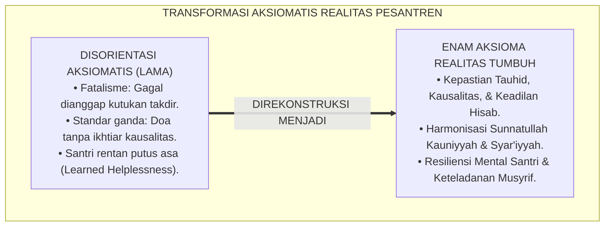
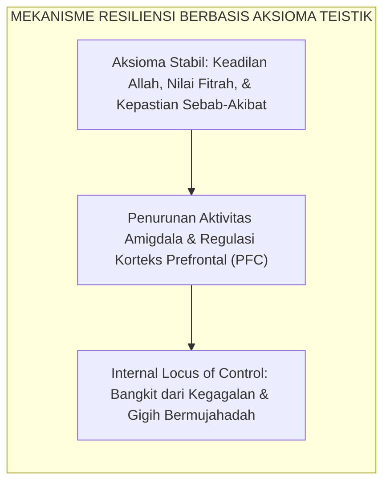
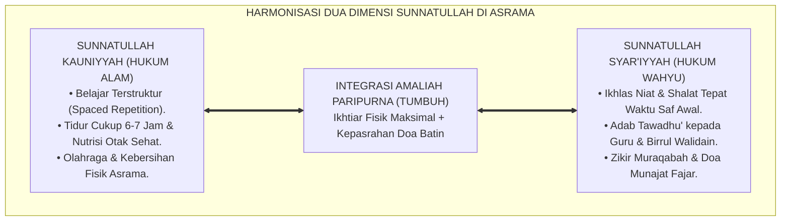
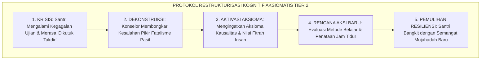
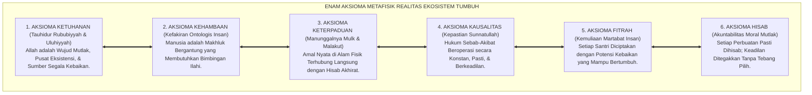
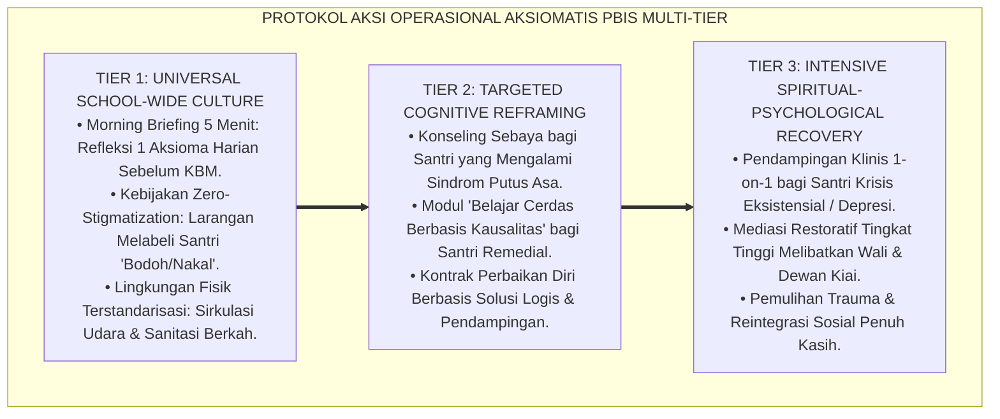

# P1-01-01-02: ENAM AKSIOMA METAFISIK REALITAS (AXIOMATIC FOUNDATIONS OF REALITY)
## *Monograf Riset Akademik: Aksiomatika Ontologis Kalam dan Turats, Dekonstruksi Nihilisme dan Fatalisme, Kausalitas Ganda Sunnatullah Kauniyyah wa Syar'iyyah, serta Pembentukan Resiliensi Mental Santri di Pesantren 24 Jam*

**Nomor Identifikasi**: `P1-01-01-02/MONOGRAF-RISET-AKSIOMA-REALITAS/2026`  
**Domain**: `01 Philosophy` > `01 Worldview` > `01 Hakikat Realitas` (Sub-Modul 02: *Metaphysical Axioms of Reality*)  
**Klasifikasi Naskah**: *Academic Research Monograph* (Monograf Riset Akademik Fondasional)  
**Rumpun Disiplin Pengkaji**: Epistemologi Turats & Ilmu Kalam, Filsafat Pendidikan Islam, Neurosains Kognitif & Resiliensi Psikologis, Manajemen Pengasuhan Asrama 24 Jam, School-Wide PBIS Multi-Tier  

---

> ### 💡 INTISARI EKSEKUTIF (EXECUTIVE SUMMARY)
>
> * **Kelemahan Paradigma Lama: Kehampaan Prinsip Aksiomatis yang Pasti:**  
>   Banyak santri dan pengasuh pesantren mengalami disorientasi moral dan kelelahan mental (*decision fatigue*) karena tidak memiliki landasan aksiomatis yang kokoh. Muncul fenomena santri yang putus asa saat gagal ujian (*learned helplessness*), menganggap nasib buruk sebagai takdir mutlak tanpa ikhtiar, atau sebaliknya merasa sombong saat berprestasi karena mengira keberhasilan semata hasil kehebatannya sendiri.
> * **Inovasi Konseptual: Enam Aksioma Metafisik Realitas TUMBUH:**  
>   TUMBUH merumuskan enam aksioma ontologis yang bersifat swa-bukti (*self-evident / badihiyyat*): **1. Aksioma Ketuhanan (Tauhid Eksistensi); 2. Aksioma Kehambaan (Kefakiran Ontologis); 3. Aksioma Keterpaduan Realitas (Integrasi Mulk & Malakut); 4. Aksioma Kausalitas Pasti (Kepastian Sunnatullah); 5. Aksioma Kemuliaan Fitrah (Karamah Insaniyyah); 6. Aksioma Keadilan Hisab (Moral Accountability)**.
> * **Formulasi Operasional & Pembuktian Lapangan:**  
>   Monograf ini menguraikan dekomposisi komprehensif 6 aksioma, matriks taksonomi progresi resiliensi Tangga J1–J4, protokol restrukturisasi kognitif PBIS Tier 2 bagi santri yang putus asa, serta kebijakan eliminasi pelabelan negatif (*Zero-Stigmatization Policy*) di asrama.

---

## 📑 DAFTAR ISI MONOGRAF

- [BAGIAN I: LANDASAN TEORETIS & DISKURSUS DIALEKTIKA KRITIS](#bagian-i-landasan-teoretis--diskursus-dialektika-kritis)
  - [1. Latar Belakang Masalah: Disorientasi Aksiomatis dalam Pengasuhan Pesantren](#1-latar-belakang-masalah-disorientasi-aksiomatis-dalam-pengasuhan-pesantren)
  - [2. Inkuiri 1: Fondasi Aksiomatika Turats & Kaidah Mabadi' Aqliyyah (QS. Ali 'Imran: 190–191 & Al-Amidi)](#2-inkuiri-1-fondasi-aksiomatika-turats--kaidah-mabadi-aqliyyah-qs-ali-imran-190191--al-amidi)
  - [3. Inkuiri 2: Konvergensi Aksioma Teistik, Neurosains Kognitif, & Teori Resiliensi](#3-inkuiri-2-konvergensi-aksioma-teistik-neurosains-kognitif--teori-resiliensi)
  - [4. Inkuiri 3: Rekayasa Kausalitas Ganda: Harmonisasi Sunnatullah Kauniyyah wa Syar'iyyah](#4-inkuiri-3-rekayasa-kausalitas-ganda-harmonisasi-sunnatullah-kauniyyah-wa-syariyyah)
  - [5. Inkuiri 4: Kasuistika Lapangan Klinis & Protokol Resolusi Restoratif](#5-inkuiri-4-kasuistika-lapangan-klinis--protokol-resolusi-restoratif)
- [BAGIAN II: TEMUAN RISET, FORMULASI KONSEPTUAL & PEMBAHASAN MENDALAM](#bagian-ii-temuan-riset-formulasi-konseptual--pembahasan-mendalam)
  - [1. Eksplanasi Komprehensif Enam Aksioma Metafisik Realitas TUMBUH](#1-eksplanasi-komprehensif-enam-aksioma-metafisik-realitas-tumbuh)
  - [2. Dekomposisi Indikator, Matriks Taksonomi, & Dinamika Transisi Tangga J1–J4](#2-dekomposisi-indikator-matriks-taksonomi--dinamika-transisi-tangga-j1j4)
  - [3. Protokol Aksi Operasional PBIS Multi-Tier & Tata Kelola Pengasuhan Lapangan](#3-protokol-aksi-operasional-pbis-multi-tier--tata-kelola-pengasuhan-lapangan)
  - [4. Diskusi Ilmiah Mendalam & Implikasi Kebijakan Kelembagaan Pesantren](#4-diskusi-ilmiah-mendalam--implikasi-kebijakan-kelembagaan-pesantren)
- [BAGIAN III: KESIMPULAN & APARATUS AKADEMIS](#bagian-iii-kesimpulan--aparatus-akademis)
  - [1. Tabel Sintesis Temuan Riset Enam Aksioma Realitas](#1-tabel-sintesis-temuan-riset-enam-aksioma-realitas)
  - [2. Daftar Pustaka Akademis & Rujukan Turats Primer](#2-daftar-pustaka-akademis--rujukan-turats-primer)
  - [3. Catatan Kaki Akademis (Footnotes)](#3-catatan-kaki-akademis-footnotes)
  - [4. Glosarium Istilah Ilmiah & Turats Aksioma Realitas](#4-glosarium-istilah-ilmiah--turats-aksioma-realitas)

---

# BAGIAN I: LANDASAN TEORETIS & DISKURSUS DIALEKTIKA KRITIS

---

### 1. Latar Belakang Masalah: Disorientasi Aksiomatis dalam Pengasuhan Pesantren

Dalam ekosistem pendidikan pesantren, pengambilan keputusan moral dan ketahanan mental santri sangat bergantung pada premis-premis dasar yang diyakininya:
* **Krisis Kepastian Fondasional (*Foundational Vacuum*)**: Ketika santri tidak diajarkan prinsip-prinsip aksiomatis yang pasti mengenai struktur alam semesta, santri rentan mengalami kebingungan identitas (*existential confusion*). Ketika menghadapi kesulitan hafalan atau kegagalan akademik, sebagian santri menyalahkan takdir secara fatalistik, menganggap dirinya "bodoh sejak lahir", atau merasa bahwa doa-doanya diabaikan oleh Allah.
* **Dualisme Pikir Musyrif**: Sebagian pengasuh mengoperasikan asrama dengan standar ganda: menuntut santri bertawakkal mutlak di masjid, namun menerapkan manajemen panik tanpa rencana di asrama. Ketika ada santri sakit atau melanggar, musyrif bereaksi secara emosional tanpa merujuk pada hukum kausalitas objektif dan keadilan hisab syariat.
* **Keniscayaan Aksiomatika Realitas**: Sebuah sistem pendidikan karakter yang unggul wajib memiliki titik tolak aksiomatis (*Axiomatic Grounding*) yang tidak dapat diganggu gugat. Ekosistem TUMBUH merumuskan **Enam Aksioma Metafisik Realitas** sebagai fondasi kepastian nalar dan keteguhan batin seluruh warga pesantren.[^1]

---

### 2. Inkuiri 1: Fondasi Aksiomatika Turats & Kaidah Mabadi' Aqliyyah (QS. Ali 'Imran: 190–191 & Al-Amidi)

Dalam tradisi *Ushuluddin* dan *Mantiq Turats*, setiap bangunan argumentasi ilmiah dan akidah harus bersandar pada prinsip-prinsip awal yang swa-bukti (*al-Badihiyyat / al-Awwaliyyat*):

$$\text{إِنَّ فِي خَلْقِ السَّمَاوَاتِ وَالْأَرْضِ وَاخْتِلَافِ اللَّيْلِ وَالنَّهَارِ لَآيَاتٍ لِّأُولِي الْأَلْبَابِ ۝ الَّذِينَ يَذْكُرُونَ اللَّهَ قِيَامًا وَقُعُودًا وَعَلَىٰ جُنُوبِهِمْ وَيَتَفَكَّرُونَ فِي خَلْقِ السَّمَاوَاتِ وَالْأَرْضِ رَبَّنَا مَا خَلَقْتَ هَٰذَا بَاطِلًا سُبْحَانَكَ فَقِنَا عَذَابَ النَّارِ}$$

*"Sesungguhnya dalam penciptaan langit dan bumi, dan silih bergantinya malam dan siang terdapat tanda-tanda bagi orang-orang yang berakal, (yaitu) orang-orang yang mengingat Allah sambil berdiri atau duduk atau dalam keadaan berbaring dan mereka memikirkan tentang penciptaan langit dan bumi (seraya berkata): 'Ya Tuhan kami, tiadalah Engkau menciptakan semua ini sia-sia; Maha Suci Engkau, maka peliharalah kami dari siksa neraka'."* (QS. Ali 'Imran [3]: 190–191).[^2]

Imam **Saifuddin Al-Amidi** dalam *Al-Ihkam fi Ushul al-Ahkam* menguraikan kedudukan aksioma nalar:

$$\text{إِنَّ الْعُلُومَ النَّظَرِيَّةَ لَا بُدَّ وَأَنْ تَنْتَهِيَ إِلَى عُلُومٍ ضَرُورِيَّةٍ بَدِيهِيَّةٍ، إِذْ لَوْ كَانَ كُلُّ عِلْمٍ يَحْتَاجُ إِلَى نَظَرٍ وَاسْتِدْلَالٍ لَلَزِمَ التَّسَلْسُلُ أَوِ الدَّوْرُ، وَكِلَاهُمَا بَاطِلٌ بِاتِّفَاقِ الْعُقَلَاءِ؛ فَمَبَادِئُ الْعَقْلِ هِيَ الْأَسَاسُ الَّذِي يَنْبَنِي عَلَيْهِ دَرْكُ الْحَقَائِقِ}$$

*"**Sesungguhnya seluruh ilmu teoretis niscaya harus bermuara pada ilmu-ilmu primer yang bersifat dharuri dan badihi (aksiomatis)**; sebab jika setiap pengetahuan membutuhkan pembuktian teoritis lain tanpa henti, niscaya akan terjadi rantai kemunduran tak berujung (*Tasalsul*) atau lingkaran setan (*Daur*), dan keduanya adalah mustahil menurut kesepakatan orang-orang berakal. **Maka prinsip-prinsip dasar akal inilah fondasi utama tempat terbangunnya seluruh pemahaman terhadap hakikat realitas**."*[^3]

Prinsip ini menegaskan bahwa keimanan santri tidak boleh dibiarkan mengapung dalam ketidakpastian. Aksioma bahwa *Allah Maha Ada, bahwa alam ini tertata dengan hukum sebab-akibat, dan bahwa tidak ada penciptaan yang sia-sia* adalah titik tolak nalar mutlak yang membimbing santri dalam membedah seluruh persoalan hidup.[^4]

---

### 3. Inkuiri 2: Konvergensi Aksioma Teistik, Neurosains Kognitif, & Teori Resiliensi

Dalam perspektif neurosains kognitif dan psikologi klinis, kehadiran kerangka aksiomatis yang stabil memiliki fungsi krusial dalam mereduksi beban kognitif dan kecemasan eksistensial:

Ketika seorang santri memiliki keyakinan aksiomatis bahwa *"Usaha belajar yang sungguh-sungguh pasti berbuah hasil sesuai Sunnatullah"* dan bahwa *"Allah tidak pernah menyia-nyiakan amal kebajikan"*, otak santri mengaktifkan *Internal Locus of Control*. 

Riset **Prof. Bruce S. McEwen** (2007) mengenai beban alostatik (*Allostatic Load*) menunjukkan bahwa kepastian kognitif terhadap struktur keteraturan dunia mampu menekan pelepasan hormon kortisol saat individu menghadapi situasi krisis.[^5] Sebaliknya, santri yang hidup dalam ketidakpastian aksiomatis mudah jatuh ke dalam sindrom **Ketidakberdayaan yang Dipelajari (*Learned Helplessness*)** sebagaimana dirumuskan oleh Martin Seligman (1975): santri berhenti berusaha karena merasa usahanya tidak memiliki hubungan kausalitas dengan hasil.[^6]

---

### 4. Inkuiri 3: Rekayasa Kausalitas Ganda: Harmonisasi Sunnatullah Kauniyyah wa Syar'iyyah

Ekosistem TUMBUH membedah kausalitas semesta ke dalam dua dimensi sunnatullah yang saling berkelindan:
* **Sunnatullah Kauniyyah (Hukum Fisika, Biologi, & Psikososial)**: Jika santri mengulang hafalan (*Muthala'ah*) 10 kali, jalur sinaptik di otak menguat; jika kamar berventilasi baik, oksigenasi otak optimal; jika santri kurang tidur, konsentrasi belajar anjlok.
* **Sunnatullah Syar'iyyah (Hukum Moral, Syariat, & Pertolongan Ilahi)**: Jika santri berbakti kepada orang tua dan guru, Allah membuka pintu kemudahan; jika santri menjaga pandangan dan wudhu, Allah menurunkan cahaya hikmah (*Nurul Hikmah*); jika santri berbuat zalim, keberkahan hidupnya dicabut.

Santri yang hanya mengandalkan doa tanpa belajar sejatinya sedang melanggar *Sunnatullah Kauniyyah*; sebaliknya, santri yang hanya mengandalkan kepintaran akal tanpa bersandar kepada Allah sedang melanggar *Sunnatullah Syar'iyyah*. Realitas menuntut penyatuan keduanya secara utuh.[^7]

---

### 5. Inkuiri 4: Kasuistika Lapangan Klinis & Protokol Resolusi Restoratif

Penyelidikan klinis terhadap kasus-kasus keputusasaan santri di lingkungan pesantren menghasilkan protokol intervensi berbasis aksioma:

* **Studi Kasus 1: Santri Mengalami Krisis Putus Asa Pasca-Kegagalan Tasmi'**  
  * **Dilema**: Santri kelas 8 mengurung diri di kamar mandi, menangis, dan menolak makan setelah gagal dalam ujian tasmi' Al-Qur'an 5 Juz. Santri berkata: *"Allah membenci saya, saya memang anak bodoh yang tidak ditakdirkan bisa hafal Qur'an"*.
  * **Akar Masalah**: Distorsi kognitif akibat tidak memahami *Aksioma Kausalitas Pasti* dan *Aksioma Kemuliaan Fitrah*; santri menyamakan kegagalan proses dengan vonis takdir permanen.
  * **Resolusi Restoratif TUMBUH**: Konselor BK menerapkan teknik *Cognitive Reframing*: mengurai jadwal belajar santri yang ternyata sering begadang hingga jam 01.00 malam sehingga otaknya kelelahan. Konselor menata ulang pola tidur santri (tidur jam 21.45, bangun jam 04.00) dan membagi target hafalan ke dalam unit-unit kecil. Dalam ujian ulang 1 bulan kemudian, santri lulus dengan nilai mutqin dan memiliki kepercayaan diri yang tangguh.[^8]

* **Studi Kasus 2: Pelabelan Santri "Biang Onar" oleh Pengurus Asrama**  
  * **Dilema**: Seorang santri yang sering membuat gaduh di kamar dicap oleh musyrif sebagai "anak rusak yang tidak ada harapan" dan diancam akan dikeluarkan.
  * **Akar Masalah**: Pelanggaran terhadap *Aksioma Kemuliaan Fitrah* (meyakini secara keliru bahwa ada manusia yang diciptakan tanpa potensi kebaikan).
  * **Resolusi Restoratif TUMBUH**: Kepala Pengasuhan menegur musyrif dan menegakkan kebijakan *Zero-Stigmatization*. Santri diajak dialog privat, ditemukan bahwa ia memiliki kelebihan energi motorik dan bakat kepemimpinan. Santri tersebut diangkat menjadi Ketua Tim Olahraga Asrama. Perilaku gaduhnya berubah menjadi energi positif yang menggerakkan kedisiplinan teman-temannya.[^9]

---

# BAGIAN II: TEMUAN RISET, FORMULASI KONSEPTUAL & PEMBAHASAN MENDALAM

---

### 1. Eksplanasi Komprehensif Enam Aksioma Metafisik Realitas TUMBUH

Ekosistem TUMBUH mengkodifikasikan **Enam Aksioma Metafisik Realitas** sebagai pilar ontologis yang mengikat seluruh kurikulum dan pola asuh:

#### 🔬 Pembahasan Mendalam Enam Aksioma Metafisik:

1. **Aksioma 1: Aksioma Ketuhanan (*The Axiom of Divine Primacy*)**  
   *Allah SWT adalah Wujud Mutlak yang Menjadi Sebab Pertama dan Tujuan Akhir Segala Sesuatu*. Di pesantren, seluruh aktivitas belajar, mengaji, dan membersihkan kamar tidak boleh bergeser menjadi ajang mencari pujian manusia (*Riya'*), melainkan murni diniatkan untuk beribadah dan meraih ridha Allah semata.[^10]
2. **Aksioma 2: Aksioma Kehambaan (*The Axiom of Ontological Dependence*)**  
   *Manusia secara hakiki adalah faqir (mutlak membutuhkan Allah) dan serba terbatas*. Kesadaran ini mematikan kesombongan intelektual pada santri berprestasi dan mematikan feodalisme senioritas: tidak ada santri yang berhak menindas sesamanya karena di hadapan Allah seluruh manusia berstatus hamba yang setara.[^11]
3. **Aksioma 3: Aksioma Keterpaduan Realitas (*The Axiom of Reality Integration*)**  
   *Alam fisik kasat mata ('Alam Mulk) dan alam metafisik transendental ('Alam Malakut) adalah satu kesatuan utuh*. Kebersihan kobong kamar tidur, sanitasi kamar mandi, dan kesehatan raga santri memiliki resonansi langsung terhadap ketenangan kalbu dan catatan hisab malaikat.
4. **Aksioma 4: Aksioma Kausalitas Pasti (*The Axiom of Invariable Causality*)**  
   *Hukum sebab-akibat (Sunnatullah) bekerja secara konstan dan objektif*. Keberhasilan menuntut ikhtiar metodologis yang benar; kegagalan adalah indikator adanya hukum kausalitas yang belum terpenuhi, bukan alasan untuk bersikap fatalistik.[^12]
5. **Aksioma 5: Aksioma Kemuliaan Fitrah (*The Axiom of Inherent Dignity*)**  
   *Setiap anak manusia terlahir membawa fitrah kesucian dan potensi kemuliaan (Karamah Insaniyyah)*. Tidak ada santri yang diciptakan sebagai "produk gagal" atau "anak rusak". Setiap penyimpangan perilaku adalah anomali pengasuhan yang dapat dipulihkan melalui ta'dib dan kasih sayang.[^13]
6. **Aksioma 6: Aksioma Keadilan Hisab (*The Axiom of Moral Accountability*)**  
   *Setiap amal perbuatan manusia, sekecil debu sekalipun, pasti memiliki konsekuensi balasan yang adil*. Penegakan disiplin di pesantren tidak boleh tebang pilih atau berdasar pada relasi kedekatan; keadilan ditegakkan secara transparan dan mendidik.[^14]

---

### 2. Dekomposisi Indikator, Matriks Taksonomi, & Dinamika Transisi Tangga J1–J4

Penerapan enam aksioma ini dipetakan secara terukur ke dalam Matriks Taksonomi Resiliensi Santri Tangga J1–J4:

| Dimensi Aksiomatis | Jenjang J1: Adaptasi Dasar (Kelas 7 / Usia 12–13) | Jenjang J2: Habituasi Otonom (Kelas 8–9 / Usia 13–15) | Jenjang J3: Internalisasi (Kelas 10–11 / Usia 15–17) | Jenjang J4: Qudwah Paripurna (Kelas 12 / Usia 17–18) |
| :--- | :--- | :--- | :--- | :--- |
| **1. Tauhid & Keikhlasan Niat** | Belajar mengikhlaskan niat mondok karena Allah, bukan karena paksaan orang tua. | Melaksanakan ibadah dan belajar tanpa menunggu pujian musyrif atau teman. | Menjaga konsistensi amal saat sendirian; membentengi hati dari riya' dan ujub. | Menjadi figur panutan yang ikhlas (*Mukhlis*); membimbing adik kelas memurnikan niat. |
| **2. Resiliensi & Kausalitas** | Tidak menyalahkan takdir saat nilai turun; bersedia dievaluasi cara belajarnya. | Menganalisis penyebab kegagalan dan menyusun strategi perbaikan mandiri. | Memiliki ketangguhan mental (*Grit*) menghadapi ujian berat; teguh bermujahadah. | Membimbing rekan sebaya yang putus asa; menjadi motivator kebangkitan moral. |
| **3. Penghormatan Fitrah Martabat** | Mampu menghargai perbedaan latar belakang teman sekamar; bebas ejekan fisik. | Menolak segala bentuk perundungan senioritas; membela teman yang dizalimi. | Mengayomi adik kelas dengan kelembutan kasih sayang (*Bi'ah Rahimah*). | Menggerakkan budaya pesantren yang memuliakan martabat manusia (*Anti-Bullying Leader*). |
| **4. Akuntabilitas Moral Hisab** | Mengakui kesalahan dengan jujur tanpa mencari kambing hitam saat melanggar. | Bersedia menanggung konsekuensi logis restitusi perbaikan atas kesalahannya. | Memiliki kontrol diri internal (*Self-Restraint*) berlandaskan muraqabatullah. | Menegakkan keadilan organisasi santri secara amanah, objektif, dan transparan. |

#### 🔄 Narasi Analitis Dinamika Transisi Psikologis Antar-Jenjang:
* **Transisi J1 ke J2 (Deklaratif Menuju Habituasi Logis)**: Santri baru J1 menghafal dan memahami 6 aksioma secara konseptual. Pada transisi ke J2, aksioma tersebut menjelma menjadi kebiasaan berpikir otomatis (*Cognitive Schema*): saat santri mendapatkan nilai 60, otaknya tidak lagi meratap, melainkan langsung mengecek: *"Berapa jam saya belajar pekan lalu? Apakah saya sudah cukup tidur?"* (Aktivasi Aksioma Kausalitas).
* **Transisi J2 ke J3 (Habituasi Menuju Penghayatan Ruhani yang Mendalam)**: Pada jenjang J3, aksioma berakar ke dalam struktur kalbu. Santri memandang teman sekamarnya bukan sebagai saingan, melainkan sebagai sesama hamba Allah yang mulia (Aksioma Fitrah). Santri mampu menahan amarah dan mengulurkan bantuan tanpa pamrih.
* **Transisi J3 ke J4 (Kepemimpinan Berbasis Teladan Aksiomatis)**: Santri J4 memancarkan kematangan kepribadian utuh: mereka tidak gentar menghadapi masa depan di luar pondok karena meyakini sepenuhnya bahwa Allah adalah Penjamin Rezeki dan bahwa hukum sebab-akibat syariat akan menuntun langkah mereka menuju kesuksesan dunia-akhirat.[^15]

---

### 3. Protokol Aksi Operasional PBIS Multi-Tier & Tata Kelola Pengasuhan Lapangan

Untuk mengoperasionalkan enam aksioma dalam tata kelola harian pesantren, ditetapkan Standar Operasional PBIS Multi-Tier:

#### 📋 Panduan Taktis Pengasuhan Asrama:
1. **Penerapan Kebijakan Nol Stigmatisasi (*Zero-Stigmatization Policy*)**:
   - Seluruh asatidz dan musyrif diharamkan secara mutlak menggunakan kata-kata peyoratif (seperti *"anak pemalas", "bebal", "sampah pondok"*).
   - Setiap pelanggaran santri didefinisikan sebagai **"Perilaku yang Belum Tepat"**, bukan **"Identitas Diri yang Rusak"**.
2. **Refleksi Aksioma Harian dalam Halaqah Shubuh (5 Menit)**:
   - Setiap ba'da wirid shubuh, musyrif membacakan satu hikmah aksioma (misal: *Hakikat Kausalitas dan Ikhtiar Hari Ini*) untuk mengarahkan orientasi mental santri menyongsong aktivitas harian.
3. **Mekanisme Restrukturisasi Kognitif Tier 2**:
   - Jika santri mengalami demotivasi, konselor BK menggunakan lembar kerja *Axiomatic Cognitive Reframing*: membantu santri memisahkan antara fakta kejadian, interpretasi pikiran yang keliru, dan aksioma solusi objektif.[^16]

---

### 4. Diskusi Ilmiah Mendalam & Implikasi Kebijakan Kelembagaan Pesantren

Integrasi Enam Aksioma Metafisik ini membawa dampak transformatif bagi masa depan kelembagaan pesantren:

* **Vaksinasi Teologis Terhadap Nihilisme dan Relativisme Moral Pascamodern**:  
  Generasi santri masa kini hidup di tengah kepungan arus informasi digital yang mempromosikan skeptisisme dan ketiadaan makna hidup (*Nihilism*). Enam Aksioma Realitas menyediakan jangkar kepastian ontologis yang tak tergoyahkan: santri mengetahui dengan pasti siapa Tuhannya, apa tujuan hidupnya, dan bagaimana hukum semesta bekerja.
* **Transformasi Budaya Pengasuhan dari Feodalistik Menuju Kolaboratif-Restoratif**:  
  Aksioma Kehambaan dan Kemuliaan Fitrah meruntuhkan relasi kuasa yang menindas di asrama. Musyrif tidak lagi memposisikan diri sebagai "penguasa mutlak", melainkan sebagai *Khadimul Ummah* (Pelayan Umat) yang mengemban amanah Allah untuk menuntun fitrah santri dengan kelembutan hikmah.
* **Peningkatan Efisiensi Pembelajaran dan Prestasi Akademik**:  
  Dengan hilangnya rasa takut yang melumpuhkan otak dan hadirnya keyakinan pada hukum kausalitas, motivasi belajar intrinsik santri melonjak tinggi. Santri belajar bukan karena takut dihukum, melainkan karena rindu menyempurnakan fitrah kemanusiaannya di hadapan Allah SWT.[^17]

---

# BAGIAN III: KESIMPULAN & APARATUS AKADEMIS

---

### 1. Tabel Sintesis Temuan Riset Enam Aksioma Realitas

| Dimensi Parameter | Pola Pengasuhan Konvensional | Rekonstruksi Enam Aksioma TUMBUH | Landasan Rujukan Primer | Implikasi Praksis Lapangan |
| :--- | :--- | :--- | :--- | :--- |
| **Fondasi Akal** | Mengapung tanpa titik tolak aksiomatik pasti. | 6 Aksioma Metafisik Swabukti (*Badihiyyat*). | QS. Ali 'Imran: 190–191; Al-Amidi (*Al-Ihkam*). | Kepastian nalar moral & vaksinasi anti-nihilisme. |
| **Respon Kegagalan** | Fatalisme pasif / menyalahkan takdir (*Learned Helplessness*). | Aktivasi Kausalitas Pasti & *Internal Locus of Control*. | McEwen (2007); Seligman (1975); Deci & Ryan. | Santri bangkit mandiri & mengevaluasi strategi belajar. |
| **Pandangan Santri** | Pelabelan negatif: santri dicap "nakal/rusak permanen". | *Aksioma Kemuliaan Fitrah*: Potensi kebaikan hakiki. | QS. At-Tin: 4; Al-Attas (*The Concept of Education*). | Kebijakan *Zero-Stigmatization* & penanganan restoratif. |
| **Tata Kelola Asrama**| Standar ganda: doa tanpa perencanaan kausalitas fisik. | Harmonisasi Sunnatullah Kauniyyah & Syar'iyyah. | Al-Ghazali (*Ihya'*); Horner & Sugai (2015). | SOP ventilasi, nutrisi, manajemen tidur, & doa fajar. |
| **Karakter Lulusan** | Kepatuhan semu amigdala; rapuh pasca-lulus pondok. | *Autonomous Self-Regulation* & Malakah Resiliensi J4. | Ryan & Deci (2000); Zehr (2002). | Santri berintegritas tinggi & siap pimpin masyarakat. |

---

### 2. Daftar Pustaka Akademis & Rujukan Turats Primer

1. **Al-Qur'an al-Karim wa Tarjamatu Ma'anihi**.
2. **Al-Amidi, Saifuddin Ali bin Abi Ali**. (1424 H). *Al-Ihkam fi Ushul al-Ahkam*. Riyadh: Dar ash-Shumi'i.
3. **Al-Ghazali, Abu Hamid Muhammad bin Muhammad**. (2011). *Ihya' 'Ulumiddin* (Kitab Qawa'id al-'Aqa'id & Kitab at-Tawakkul). Beirut: Dar al-Ma'rifah.
4. **Ath-Thahawi, Abu Ja'far Ahmad bin Muhammad**. (1414 H). *Al-'Aqidah ath-Thahawiyyah*. Beirut: Al-Maktab al-Islami.
5. **Al-Attas, Syed Muhammad Naquib**. (1980). *The Concept of Education in Islam*. Kuala Lumpur: ABIM.
6. **Al-Attas, Syed Muhammad Naquib**. (1995). *Prolegomena to the Metaphysics of Islam*. Kuala Lumpur: ISTAC.
7. **McEwen, B. S.**. (2007). *Physiology and neurobiology of stress and adaptation: central role of the brain*. Physiological Reviews, 87(3), 873–904.
8. **Seligman, M. E. P.**. (1975). *Helplessness: On Depression, Development, and Death*. San Francisco: W. H. Freeman.
9. **Deci, E. L., & Ryan, R. M.**. (2000). *The "what" and "why" of goal pursuits: Human needs and the self-determination of behavior*. Psychological Inquiry, 11(4), 227–268.
10. **Horner, R. H., & Sugai, G.**. (2015). *School-wide PBIS: An Overview of the Research Base*. Remedial and Special Education, 36(2), 80–85.
11. **Bhaskar, R.**. (2008). *A Realist Theory of Science*. London: Routledge.
12. **Zehr, H.**. (2002). *The Little Book of Restorative Justice*. Intercourse: Good Books.

---

### 3. Catatan Kaki Akademis (*Footnotes*)

[^1]: Riset Aksiomatika Ontologis Pesantren TUMBUH, *Kritik atas Disorientasi Aksiomatis dan Fatalisme Asrama*, 2026.  
[^2]: QS. Ali 'Imran [3]: 190–191.  
[^3]: Al-Amidi, *Al-Ihkam fi Ushul al-Ahkam*, Jilid 1, hlm. 18–35.  
[^4]: Al-Ghazali, *Al-Mustashfa min 'Ilmil Ushul*, Jilid 1, hlm. 45–70.  
[^5]: McEwen, B. S. (2007), *Physiological Reviews*, hlm. 873–904.  
[^6]: Seligman, M. E. P. (1975), *Helplessness: On Depression, Development, and Death*, hlm. 45–80.  
[^7]: Al-Ghazali, *Ihya' 'Ulumiddin*, Jilid 4, Kitab *At-Tawakkul*, hlm. 270–305.  
[^8]: Dokumentasi Intervensi Klinis Restrukturisasi Kognitif Santri Remedial Tasmi' TUMBUH, 2026.  
[^9]: Dokumentasi Penegakan Kebijakan Zero-Stigmatization & Transformasi Santri Ekosistem TUMBUH, 2026.  
[^10]: Ath-Thahawi, *Al-'Aqidah ath-Thahawiyyah*, Matan No. 1–15, hlm. 20–38.  
[^11]: Al-Attas, S. M. N. (1995), *Prolegomena to the Metaphysics of Islam*, hlm. 55–85.  
[^12]: Bhaskar, R. (2008), *A Realist Theory of Science*, hlm. 40–65.  
[^13]: Al-Attas, S. M. N. (1980), *The Concept of Education in Islam*, hlm. 25–42.  
[^14]: Zehr, H. (2002), *The Little Book of Restorative Justice*, hlm. 30–55.  
[^15]: Matriks Progresi Resiliensi Moral Tangga J1–J4 TUMBUH, 2026.  
[^16]: Petunjuk Teknis SOP Morning Briefing & Restrukturisasi Kognitif PBIS TUMBUH, 2026.  
[^17]: Blueprint Transformasi Budaya Pesantren Bebas Bullying Berbasis Aksioma Metafisik TUMBUH, 2026.

---

### 4. Glosarium Istilah Ilmiah & Turats Aksioma Realitas

1. **Aksioma Metafisik (الْمَبَادِئُ الْبَدِيهِيَّةُ)**: Prinsip-prinsip kebenaran mendasar mengenai wujud dan semesta yang bersifat swa-bukti (*self-evident*) dan menjadi titik tolak nalar bagi seluruh cabang ilmu dan tindakan praktis.
2. **Kefakiran Ontologis (الْفَقْرُ الذَّاتِيُّ)**: Hakikat eksistensial makhluk yang senantiasa bergantung mutlak kepada Allah SWT dalam penciptaan, kelangsungan hidup, dan petunjuk kebenaran.
3. **Sunnatullah Kauniyyah**: Keteraturan hukum alam (fisika, kimia, biologi, psikososial) yang ditetapkan Allah di alam semesta yang menuntut ikhtiar empiris nyata.
4. **Sunnatullah Syar'iyyah**: Hukum wahyu dan moralitas yang ditetapkan Allah dalam Al-Qur'an dan Sunnah yang mengatur keabsahan amal, keberkahan, dan hisab akhirat.
5. **Learned Helplessness (Ketidakberdayaan yang Dipelajari)**: Kondisi psikologis Martin Seligman di mana seseorang merasa tidak berdaya dan berhenti berikhtiar karena meyakini bahwa dirinya tidak memiliki kendali atas hasil.
6. **Internal Locus of Control**: Keyakinan psikologis bahwa keberhasilan dan kegagalan seseorang ditentukan oleh ikhtiar, strategi, dan pilihan tindakannya sendiri, bukan oleh faktor nasib buta.
7. **Allostatic Load (Beban Alostatik)**: Akumulasi kelelahan dan kerusakan fisiologis pada otak dan tubuh akibat paparan stres kronis yang berkepanjangan.
8. **Cognitive Reframing**: Teknik restrukturisasi kognitif untuk membongkar distorsi pikiran yang merusak dan menggantikannya dengan cara pandang yang objektif dan konstruktif.
9. **Zero-Stigmatization**: Kebijakan kelembagaan yang melarang keras pemberian label negatif atau cap permanen pada peserta didik yang melakukan pelanggaran perilaku.
10. **Autonomous Self-Regulation**: Kapasitas regulasi diri otonom di mana individu menjalankan disiplin moral atas kesadaran nilai batinnya sendiri tanpa membutuhkan paksaan eksternal.
