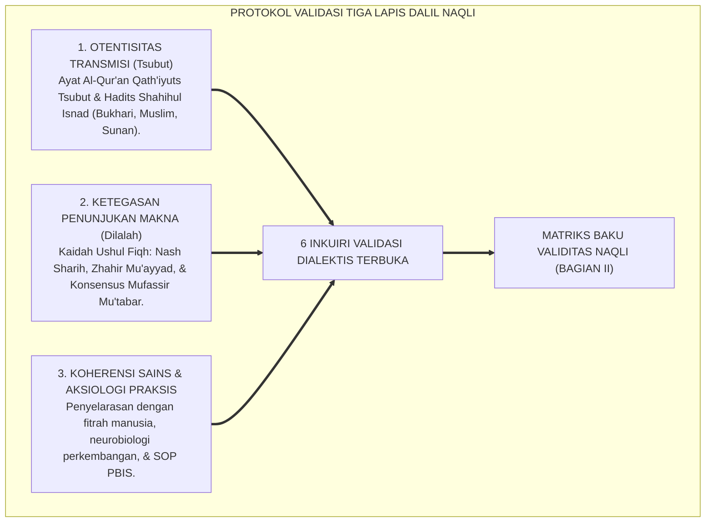
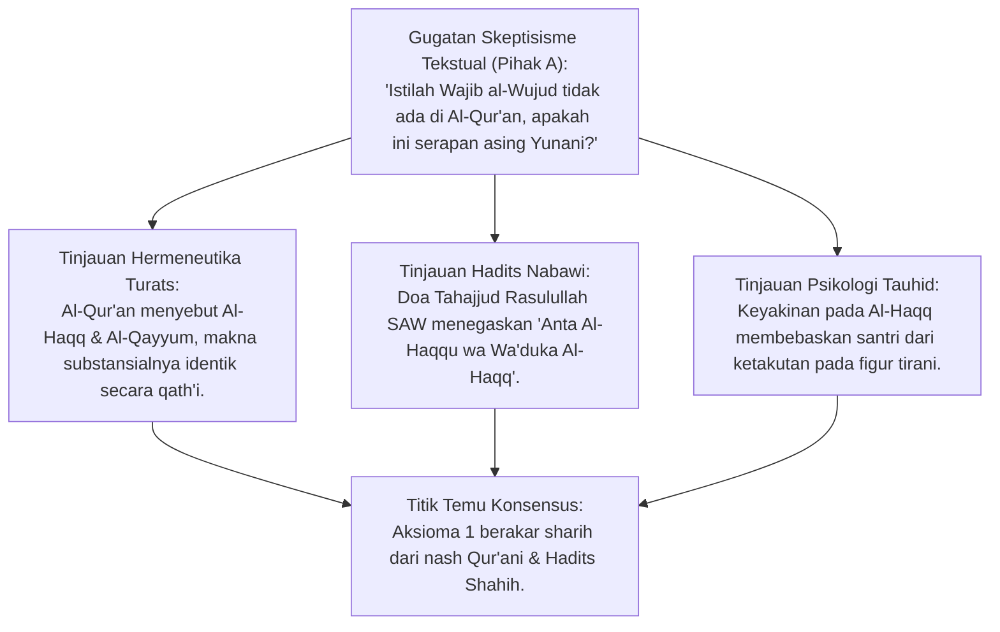
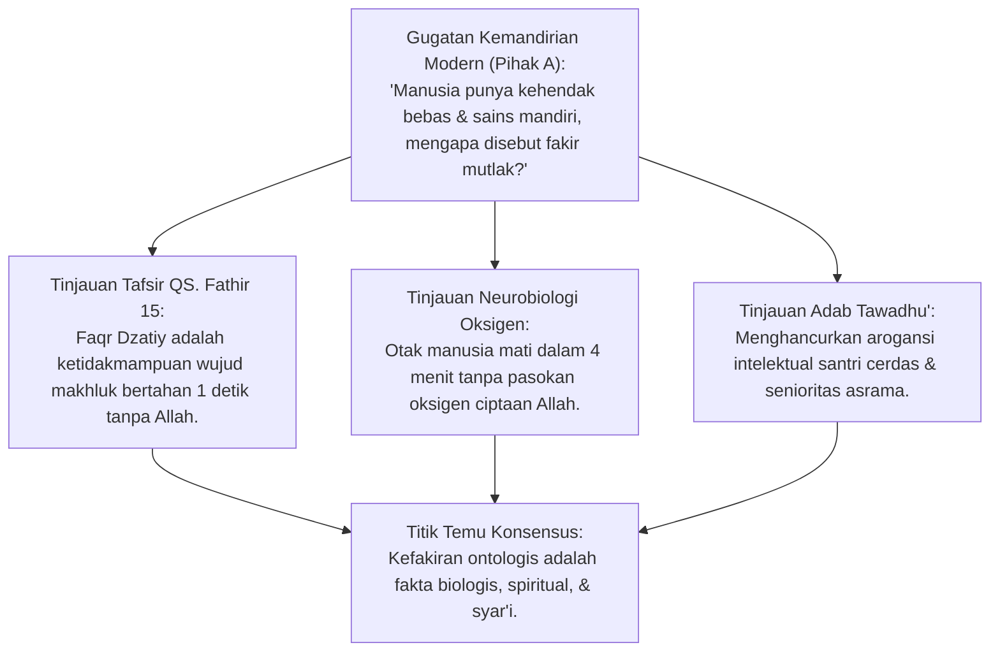
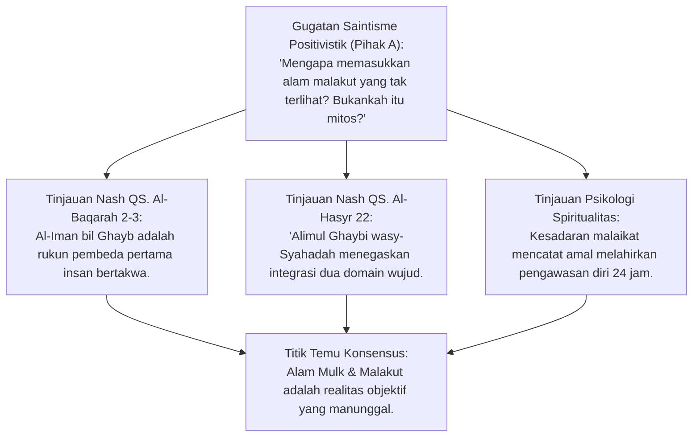
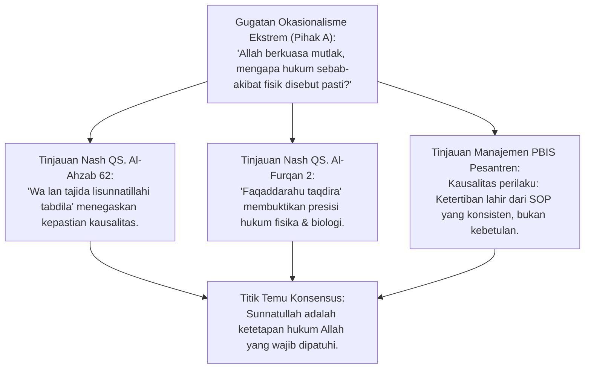
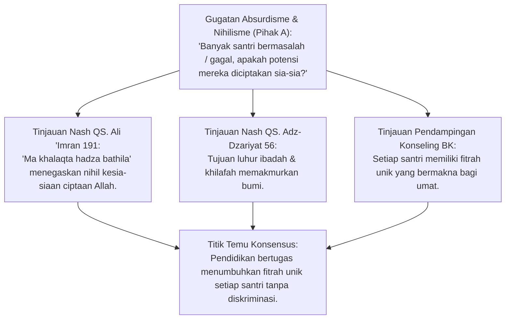
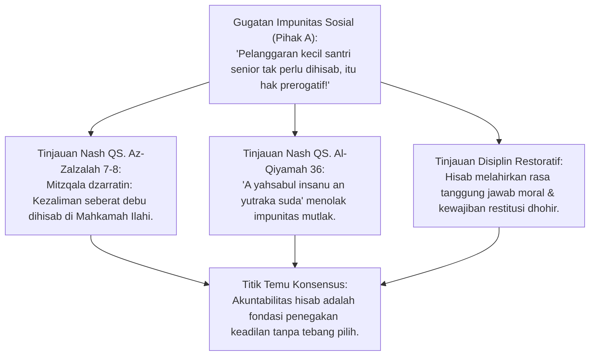
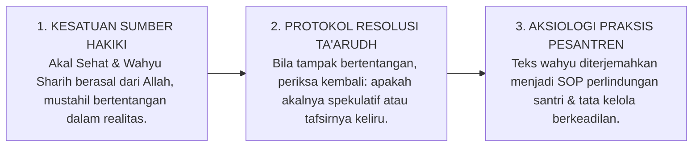

# P1-01-01-03: VALIDASI DALIL NAQLI ENAM AKSIOMA REALITAS
## *Monograf Terpadu: Riset Hermeneutika Nash Al-Qur'an & As-Sunnah, Dialektika Tafsir Mu'tabar, & Kodifikasi Validitas Syar'i*

**Nomor Identifikasi**: `P1-01-01-03/MONOGRAF-TERPADU-VALIDASI-DALIL/2026`  
**Domain**: `01 Philosophy` > `01 Worldview` > `01 Hakikat Realitas`  
**Klasifikasi Naskah**: *Comprehensive Integrated Monograph* (Monograf Akademis & Rumusan Baku Terpadu)  
**Rumpun Disiplin Pengkaji**: Epistemologi Turats, Hermeneutika Tafsir & Hadits, Teologi Ushuluddin Aswaja, Neurosains Kognitif, Tata Kelola Pengasuhan Asrama  

---

> ### 💡 INTISARI PRAKTIS (3 MENIT PAHAM UNTUK ASATIDZ & MUSYRIF)
>
> * **Apa Tujuan Bab Ini?**  
>   Membuktikan bahwa 6 Prinsip Aksioma Realitas TUMBUH **100% Berakar dari Ayat Al-Qur'an dan Hadits Shahih**, bukan sekadar teori buatan manusia.
> * **Enam Dalil Kunci yang Wajib Dipahami Musyrif:**  
>   1. **QS. Luqman: 30 & Doa Tahajjud**: Allah adalah *Al-Haqq* (Maha Nyata), sumber kejujuran batin santri.
>   2. **QS. Fathir: 15**: Manusia adalah *Al-Fuqara'* (fakir butuh Allah), mengharamkan senioritas feodal di asrama.
>   3. **QS. Al-Baqarah: 2–3 & QS. Al-Hasyr: 22**: Keimanan pada yang ghaib (*Alam Malakut*) wajib diwujudkan dalam amal nyata di asrama (*Alam Mulk*).
>   4. **QS. Al-Ahzab: 62 & QS. Al-Furqan: 2**: Hukum *Sunnatullah* tidak pernah berubah; gizi dan jam tidur biologis santri wajib dipenuhi secara syar'i.
>   5. **QS. Ali 'Imran: 191 & QS. Al-Mu'minun: 115**: Tiada ciptaan yang sia-sia (*Nihil 'Abathan*); mendidik potensi unik setiap santri tanpa diskriminasi.
>   6. **QS. Az-Zalzalah: 7–8 & Hadits Muflis (HR. Muslim)**: Kezaliman seberat biji sawi pasti dihisab; menghapus impunitas kekerasan fisik di pondok.
> * **Penerapan Praktis di Lapangan**:  
>   Saat mengajar dan menertibkan santri, asatidz memiliki sandaran dalil naqli yang mutlak dan tak terbantahkan.

---

## 📑 DAFTAR ISI MONOGRAF

- [BAGIAN I: RISET HERMENEUTIKA, DIALEKTIKA INKUIRI, & KASUISTIKA LAPANGAN](#bagian-i-riset-hermeneutika-dialektika-inkuiri--kasuistika-lapangan)
  - [1. Kerangka Metodologi Validasi Dalil Naqli](#1-kerangka-metodologi-validasi-dalil-naqli)
  - [2. Inkuiri 1: Validasi Nash Aksioma 1 — Allah SWT adalah Al-Haqq & Wajib al-Wujud](#2-inkuiri-1-validasi-nash-aksioma-1--allah-swt-adalah-al-haqq--wajib-al-wujud)
  - [3. Inkuiri 2: Validasi Nash Aksioma 2 — Ketergantungan Ontologis Makhluk (Iftiqar Dzatiy)](#3-inkuiri-2-validasi-nash-aksioma-2--ketergantungan-ontologis-makhluk-iftiqar-dzatiy)
  - [4. Inkuiri 3: Validasi Nash Aksioma 3 — Dualitas Terpadu 'Alam Mulk & 'Alam Malakut](#4-inkuiri-3-validasi-nash-aksioma-3--dualitas-terpadu-alam-mulk--alam-malakut)
  - [5. Inkuiri 4: Validasi Nash Aksioma 4 — Kepastian Hukum Sunnatullah Kauniyyah-Syar'iyyah](#5-inkuiri-4-validasi-nash-aksioma-4--kepastian-hukum-sunnatullah-kauniyyah-syariyyah)
  - [6. Inkuiri 5: Validasi Nash Aksioma 5 — Teleologi Penciptaan: Ghayah wa Hikmah](#6-inkuiri-5-validasi-nash-aksioma-5--teleologi-penciptaan-ghayah-wa-hikmah)
  - [7. Inkuiri 6: Validasi Nash Aksioma 6 — Akuntabilitas Eksistensial & Mahkamah Hisab](#7-inkuiri-6-validasi-nash-aksioma-6--akuntabilitas-eksistensial--mahkamah-hisab)
- [BAGIAN II: KODIFIKASI BAKU HASIL RISET & KESIMPULAN FORMAL](#bagian-ii-kodifikasi-baku-hasil-riset--kesimpulan-formal)
  - [1. Matriks Komprehensif Sanad & Derajat Dalil Enam Aksioma](#1-matriks-komprehensif-sanad--derajat-dalil-enam-aksioma)
  - [2. Kaidah Hermeneutika Penyelarasan Akal dan Wahyu (Dar' Ta'arudh)](#2-kaidah-hermeneutika-penyelarasan-akal-dan-wahyu-dar-taarudh)
  - [3. Transformasi Dalil Menjadi Karakter dan Iklim Asrama (Bi'ah Shalihah)](#3-transformasi-dalil-menjadi-karakter-dan-iklim-asrama-biah-shalihah)
- [BAGIAN III: APARATUS AKADEMIS & APENDIKS](#bagian-iii-aparatus-akademis--apendiks)
  - [1. Tabel Sintesis Hasil Riset Hermeneutika](#1-tabel-sintesis-hasil-riset-hermeneutika)
  - [2. Daftar Pustaka Akademis & Rujukan Turats Primer](#2-daftar-pustaka-akademis--rujukan-turats-primer)
  - [3. Catatan Kaki Akademis (Footnotes)](#3-catatan-kaki-akademis-footnotes)
  - [4. Glosarium dan Penjelasan Istilah Teknis Hermeneutika & Ushul](#4-glosarium-dan-penjelasan-istilah-teknis-hermeneutika--ushul)

---

# BAGIAN I: RISET HERMENEUTIKA, DIALEKTIKA INKUIRI, & KASUISTIKA LAPANGAN

*Bagian ini memuat proses penyelidikan nash wahyu (*tahqiq adillatun naqliyyah*), formalisasi silogisme logika (*qiyas burhani*), pertarungan dialektika multi-perspektif tiga ronde tanpa kata "pakar", studi kasus dilema nyata lapangan, dan penarikan konsensus bersama.*

---

### 1. Kerangka Metodologi Validasi Dalil Naqli

Tujuan utama riset pada naskah ini adalah membuktikan bahwa seluruh prinsip ontologis Ekosistem TUMBUH berakar secara kokoh, murni, dan mutawatir dari Al-Qur'an al-Karim dan As-Sunnah ash-Shahihah. Pengujian menerapkan **Protokol Validasi Tiga Lapis**:

---

### 2. Inkuiri 1: Validasi Nash Aksioma 1 — Allah SWT adalah Al-Haqq & Wajib al-Wujud

#### 📐 Formalisasi Logika Silogisme (*Qiyas Mantiqi 1*)
* **Premis Mayor (*al-Muqaddimah al-Kubra*)**: Setiap entitas yang firman-Nya menegaskan bahwa diri-Nya adalah Realitas Mutlak (*Al-Haqq*) dan penopang mandiri seluruh wujud (*Al-Qayyum*) adalah *Wajib al-Wujud* yang menjadi asal mula segala keberadaan.
* **Premis Minor (*al-Muqaddimah ash-Shughra*)**: Allah SWT menetapkan diri-Nya dalam Al-Qur'an dan As-Sunnah sebagai *Al-Haqq* (QS. Luqman: 30) dan *Al-Qayyum* (QS. Al-Baqarah: 255).
* **Konklusi (*an-Natijah*)**: Maka, Aksioma 1 bahwa Allah SWT adalah Realitas Mutlak Mandiri (*Wajib al-Wujud*) terbukti valid secara qath'i bersumber dari wahyu Ilahi.[^1]

#### 📖 Nash Primer Al-Qur'an & As-Sunnah
1. **QS. Luqman [31]: 30**:
   $$\text{ذَٰلِكَ بِأَنَّ اللَّهَ هُوَ الْحَقُّ وَأَنَّ مَا يَدْعُونَ مِن دُونِهِ الْبَاطِلُ وَأَنَّ اللَّهَ هُوَ الْعَلِيُّ الْكَبِيرُ}$$
   *"Demikianlah, karena sesungguhnya Allah, Dialah (Tuhan) Yang Hak (Maha Nyata), dan sesungguhnya apa saja yang mereka seru selain Allah itulah yang batil; dan sesungguhnya Allah, Dialah Yang Maha Tinggi lagi Maha Besar."*[^2]
2. **Hadits Shahih Bukhari & Muslim (Doa Tahajjud Rasulullah SAW)**:
   $$\text{اللَّهُمَّ لَكَ الْحَمْدُ، أَنْتَ نُورُ السَّمَاوَاتِ وَالْأَرْضِ وَمَنْ فِيهِنَّ، وَلَكَ الْحَمْدُ، أَنْتَ قَيِّمُ السَّمَاوَاتِ وَالْأَرْضِ وَمَنْ فِيهِنَّ، وَلَكَ الْحَمْدُ، أَنْتَ الْحَقُّ، وَوَعْدُكَ الْحَقُّ، وَقَوْلُكَ الْحَقُّ، وَلِقَاؤُكَ حَقٌّ}$$
   *"Ya Allah, milik-Mu segala puji; Engkau cahaya langit dan bumi serta siapa saja yang ada di dalamnya. Milik-Mu segala puji; Engkau penegak dan pemelihara (Qayyum) langit dan bumi serta siapa saja yang ada di dalamnya. Milik-Mu segala puji; Engkau adalah Al-Haqq (Maha Nyata), janji-Mu adalah hak, firman-Mu adalah hak, dan perjumpaan dengan-Mu adalah hak..."* (HR. Bukhari no. 1120; Muslim no. 769).[^3]

#### 🥊 Ronde 1: Gugatan Tekstual atas Istilah Wajib al-Wujud
* **Pihak A (Sudut Pandang Literalisme Kritis)**:  
  *"Di mana dalam ayat Al-Qur'an atau teks hadits tertulis frasa huruf demi huruf 'Wajib al-Wujud'? Bukankah istilah ini adalah terminologi filsafat paripatetik Yunani yang diadopsi oleh kaum mutakallimin belakangan? Mengapa kita menggunakannya sebagai aksioma dasar Islam?"*
* **Tinjauan Sudut Pandang Hermeneutika Turats & Ushuluddin**:  
  Kaidah ushul menegaskan: *"Laa musyahhata fil ishthilah idza wudhihatil ma'ani"* (Tidak ada perselisihan dalam peristilahan selama maknanya telah jelas dan benar). **Imam Fakhruddin Ar-Razi** dalam *Mafatih al-Ghaib* menjelaskan bahwa nama Allah **Al-Haqq** secara bahasa dan teologis bermakna:
  
  $$\text{الْمَوْجُودُ الثَّابِتُ الَّذِي لَا يَقْبَلُ الزَّوَالَ وَلَا الْعَدَمَ لِذَاتِهِ، وَهُوَ مَعْنَى وَاجِبِ الْوُجُودِ}$$
  
  *"Dzat yang wujud-Nya tetap permanen, yang mustahil menerima ketiadaan dan kepunahan pada Dzat-Nya sendiri; dan inilah makna hakiki dari Wajib al-Wujud."*[^4]
  
  Demikian pula nama Allah **Al-Qayyum** bermakna Dzat yang mandiri tanpa membutuhkan penyangga lain sembari menegakkan seluruh alam semesta. Maka, substansi Aksioma 1 adalah 100% Qur'ani murni.

#### 🥊 Ronde 2: Sanggahan Balik Bahaya Panteisme vs Kemutlakan Wujud Khaliq
* **Pihak A (Sudut Pandang Purifikasi Akidah)**:  
  *"Sanggahan! Jika Allah disebut 'Asal Segala Wujud', bukankah ini rawan disalahartikan sebagai paham Wihdatul Wujud (Panteisme) di mana makhluk dianggap bagian dari Dzat Allah?"*
* **Tinjauan Sudut Pandang Epistemologi Tauhid Aswaja**:  
  Ahlussunnah wal Jama'ah memisahkan secara tegas dan mutlak antara **Wujud Khaliq yang Qadim dan Mahasuci (*al-Wujud al-Haqiqiy al-Qadim*)** dengan **wujud makhluk yang baharu (*al-Wujud al-Haddits al-Majaziy*)**. Allah menciptakan alam semesta dari tiada (*Ijad minal 'Adam*), bukan memancar (*emanasi*) dari Dzat-Nya. Allah berfirman:
  
  $$\text{لَيْسَ كَمِثْلِهِ شَيْءٌ ۖ وَهُوَ السَّمِيعُ الْبَصِيرُ}$$
  
  *"Tidak ada sesuatu pun yang serupa dengan Dia; dan Dialah Yang Maha Mendengar lagi Maha Melihat."* (QS. Asy-Syura: 11).[^5]  
  Wujud makhluk adalah ciptaan (*Makhluk*), sedangkan Allah adalah Pencipta (*Khaliq*).

#### 🥊 Ronde 3: Sanggahan Pamungkas Korelasi Tauhid Wujud dengan Mentalitas Santri
* **Pihak A (Sudut Pandang Kepraktisan Pengasuhan)**:  
  *"Bagaimana dalil teologis abstrak tentang Al-Haqq ini berdampak langsung pada perilaku santri yang suka melanggar aturan jam tidur di asrama?"*
* **Resolusi Sudut Pandang Psikologi Perkembangan & PBIS**:  
  Ketika santri meyakini bahwa Allah adalah *Al-Haqq* (Maha Nyata), ia menyadari bahwa seluruh pengawasan manusia bersifat fana, sedangkan pengawasan Allah bersifat mutlak dan nyata. Santri membangun kejujuran batin (*Internal Locus of Control*) yang mencegah perilaku pura-pura taat (*hypocritical compliance*) saat musyrif tidak berada di tempat.[^6]

> #### 📌 Kasuistika Lapangan 1 & Titik Temu Konsensus
> * **Studi Kasus**: Santri berbuat curang saat ujian diniyyah karena merasa pengawas ruang kelas sedang mengantuk dan tidak melihatnya.
> * **Titik Temu Konsensus (*Kalimatun Sawa'*)**: Disepakati bahwa internalisasi QS. Luqman: 30 dan kesadaran sifat *Al-Haqq* menumbuhkan integritas moral otonom bahwa pandangan Allah mendahului pandangan manusia.[^7]

---

### 3. Inkuiri 2: Validasi Nash Aksioma 2 — Ketergantungan Ontologis Makhluk (Iftiqar Dzatiy)

#### 📐 Formalisasi Logika Silogisme (*Qiyas Mantiqi 2*)
* **Premis Mayor (*al-Muqaddimah al-Kubra*)**: Setiap wujud yang keberlangsungan eksistensinya membutuhkan pasokan daya eksternal di setiap satuan waktu adalah wujud yang fakir secara ontologis (*Faqir Dzatiy*).
* **Premis Minor (*al-Muqaddimah ash-Shughra*)**: Seluruh manusia, sistem biologis santri, dan jagat raya membutuhkan pemeliharaan Allah di setiap detik nafasnya (QS. Fathir: 15).
* **Konklusi (*an-Natijah*)**: Maka, Aksioma 2 tentang Ketergantungan Total Makhluk (*Mumkin al-Wujud*) terbukti sebagai kebenaran naqli dan fakta ilmiah yang tak terbantahkan.[^8]

#### 📖 Nash Primer Al-Qur'an & As-Sunnah
1. **QS. Fathir [35]: 15**:
   $$\text{يَا أَيُّهَا النَّاسُ أَنتُمُ الْفُقَرَاءُ إِلَى اللَّهِ ۖ وَاللَّهُ هُوَ الْغَنِيُّ الْحَمِيدُ}$$
   *"Wahai manusia! Kamulah yang memerlukan (al-fuqara') kepada Allah; dan Allah Dialah Yang Maha Kaya (tidak memerlukan sesuatu) lagi Maha Terpuji."*[^9]
2. **QS. Ar-Rahman [55]: 29**:
   $$\text{يَسْأَلُهُ مَن فِي السَّمَاوَاتِ وَالْأَرْضِ ۚ كُلَّ يَوْمٍ هُوَ فِي شَأْنٍ}$$
   *"Semua yang ada di langit dan di bumi selalu meminta kepada-Nya. Setiap waktu Dia dalam kesibukan (menciptakan, memelihara, dan mengurus makhluk-Nya)."*[^10]

#### 🥊 Ronde 1: Bedah Hermeneutika Kata Al-Fuqara' (Fakir Harta vs Fakir Ontologis)
* **Tinjauan Hermeneutika Turats**:  
  **Imam Ibnu Katsir** dalam *Tafsir Al-Qur'an al-'Azhim* menegaskan keluasan makna ayat ini:
  
  $$\text{أَيْ جَمِيعُ الْخَلْقِ مُحْتَاجُونَ إِلَيْهِ فِي جَمِيعِ حَرَكَاتِهِمْ وَسَكَنَاتِهِمْ بِالذَّاتِ، وَهُوَ الْغَنِيُّ عَنْهُمْ بِالذَّاتِ}$$
  
  *"Maksudnya adalah seluruh makhluk membutuhkan Allah dalam setiap gerak dan diam mereka secara hakiki pada esensi diri mereka (bi adz-dzat), sedangkan Allah Maha Kaya dari mereka secara esensial."*[^11]
  
  Kefakiran di sini bukan sekadar kemiskinan materi finansial, melainkan ketidakmampuan biologis dan eksistensial manusia untuk mempertahankan detak jantungnya sendiri barang satu detik tanpa izin Allah.

#### 🥊 Ronde 2: Sanggahan Balik Hubungan Ketergantungan Makhluk vs Kehendak Bebas (Ikhtiyar)
* **Pihak A (Sudut Pandang Humanisme Sekuler)**:  
  *"Sanggahan! Jika manusia disebut bergantung total tanpa daya, bukankah ini mereduksi manusia menjadi robot tanpa kehendak bebas, sehingga menghilangkan tanggung jawab moral atas kejahatan yang dilakukannya?"*
* **Tinjauan Sudut Pandang Teologi Aswaja (Kasb & Ikhtiyar)**:  
  Ahlussunnah wal Jama'ah mengajarkan konsep **Kasb (Usaha Manusia)** yang harmonis. Allah menciptakan daya dan kemampuan memilih (*Iradah Juz'iyyah*) pada diri manusia, dan manusia menggunakan kehendak tersebut untuk memilih taat atau maksiat. Ketergantungan wujud pada Allah tidak membatalkan tanggung jawab moral ikhtiar manusia di hadapan syariat.[^12]

#### 🥊 Ronde 3: Sanggahan Pamungkas Eliminasi Feodalisme Asrama Berbasis Aksioma 2
* **Pihak A (Sudut Pandang Tata Kelola Hierarki)**:  
  *"Bagaimana prinsip kefakiran ontologis ini mengubah budaya hierarki senioritas di pondok pesantren?"*
* **Resolusi Sudut Pandang Pengasuhan Asrama & Qudwah**:  
  Prinsip Aksioma 2 adalah **Penghancur Utama Feodalisme dan Arogansi Senioritas**. Santri senior, kiai, pengurus, dan santri junior baru sama-sama berstatus *Al-Fuqara'* (hamba yang fakir) di hadapan Allah. Tidak ada ruang bagi kesombongan menindas sesama makhluk fakir. Kemuliaan hanya diukur dari ketakwaan dan keteladanan melayani sesama (*Qudwah Hasanah*).[^13]

> #### 📌 Kasuistika Lapangan 2 & Titik Temu Konsensus
> * **Studi Kasus**: Santri yang memiliki prestasi ranking satu dan hafal 30 juz merendahkan teman sekamarnya yang lambat menghafal dan menjadikannya pesuruh pribadi.
> * **Titik Temu Konsensus (*Kalimatun Sawa'*)**: Disepakati bahwa kepintaran hafalan adalah karunia titipan Allah pada hamba yang fakir, bukan legitimasi untuk menyombongkan diri atau memperbudak sesama santri.[^14]

---

### 4. Inkuiri 3: Validasi Nash Aksioma 3 — Dualitas Terpadu 'Alam Mulk & 'Alam Malakut

#### 📐 Formalisasi Logika Silogisme (*Qiyas Mantiqi 3*)
* **Premis Mayor (*al-Muqaddimah al-Kubra*)**: Setiap sistem epistemologi yang mengingkari separuh dari realitas yang diwahyukan Allah (Alam Ghaib/Malakut) adalah sistem yang cacat dan menyesatkan.
* **Premis Minor (*al-Muqaddimah ash-Shughra*)**: Al-Qur'an secara eksplisit menegaskan keberadaan *'Alam al-Ghayb* dan *'Alam asy-Syahadah* sebagai kesatuan ciptaan Allah (QS. Al-Hasyr: 22).
* **Konklusi (*an-Natijah*)**: Maka, Aksioma 3 tentang Dualitas Realitas Terpadu ('Alam Mulk dan 'Alam Malakut) adalah kebenaran mutlak wahyu yang wajib mendasari kurikulum pesantren.[^15]

#### 📖 Nash Primer Al-Qur'an & As-Sunnah
1. **QS. Al-Baqarah [2]: 2–3**:
   $$\text{ذَٰلِكَ الْكِتَابُ لَا رَيْبَ ۛ فِيهِ ۛ هُدًى لِّلْمُتَّقِينَ ۝ الَّذِينَ يُؤْمِنُونَ بِالْغَيْبِ وَيُقِيمُونَ الصَّلَاةَ وَمِمَّا رَزَقْنَاهُمْ يُنفِقُونَ}$$
   *"Kitab (Al-Qur'an) ini tidak ada keraguan padanya; petunjuk bagi mereka yang bertakwa, (yaitu) mereka yang beriman kepada yang ghaib, yang mendirikan shalat, dan menafkahkan sebagian rezeki yang Kami anugerahkan kepada mereka."*[^16]
2. **QS. Al-Hasyr [59]: 22**:
   $$\text{هُوَ اللَّهُ الَّذِي لَا إِلَٰهَ إِلَّا هُوَ ۖ عَالِمُ الْغَيْبِ وَالشَّهَادَةِ ۖ هُوَ الرَّحْمَٰنُ الرَّحِيمُ}$$
   *"Dialah Allah Yang tiada Tuhan selain Dia, Yang Mengetahui yang ghaib dan yang nyata (syahadah), Dialah Yang Maha Pemurah lagi Maha Penyayang."*[^17]

#### 🥊 Ronde 1: Demarkasi Ghaib Hakiki vs Mitos Khurafat
* **Tinjauan Hermeneutika Turats**:  
  **Imam Al-Qurthubi** dalam *Al-Jami' li Ahkam al-Qur'an* membedakan perkara ghaib syar'i dari takhayul:
  
  $$\text{الْغَيْبُ فِي الْقُرْآنِ هُوَ مَا أَخْبَرَ بِهِ الرَّسُولُ صَلَّى اللَّهُ عَلَيْهِ وَسَلَّمَ مِمَّا لَا تَهْتَدِي إِلَيْهِ الْعُقُولُ مِنْ أَشْرَاطِ السَّاعَةِ وَعَذَابِ الْقَبْرِ وَالْحَشْرِ وَالنَّشْرِ وَالصِّرَاطِ وَالْمِيزَانِ وَالْجَنَّةِ وَالنَّارِ}$$
  
  *"Al-Ghayb dalam Al-Qur'an adalah segala perkara yang dikabarkan oleh Rasulullah SAW yang tidak dapat dijangkau oleh akal indera semata, mencakup tanda-tanda kiamat, siksa kubur, mahsyar, jembatan shirat, timbangan amal, surga, dan neraka."*[^18]
  
  Keimanan pada alam malakut bersandar pada **Wahyu Otoritatif (*Khabar Shadiq*)**, bukan pada khurafat dukun, takhayul mistis, atau cerita hantu lokal yang membodohi santri.

#### 🥊 Ronde 2: Sanggahan Balik Bahaya Eskapisme Spiritual vs Amal Mulk
* **Pihak A (Sudut Pandang Pragmatisme Sosial)**:  
  *"Sanggahan! Menekankan alam ghaib malakut rawan membuat santri menjadi pasif, melamunkan akhirat (eskapisme), dan mengabaikan pembangunan ekonomi, sains teknologi, serta kebersihan fisik di alam nyata (mulk)!"*
* **Tinjauan Sudut Pandang Ushul Fiqh & Falsafah Peradaban**:  
  Al-Qur'an justru menjadikan amal dhohir di alam mulk sebagai **Satu-satunya Ladang Menanam Pahala Malakut (*Ad-Dunya Mazra'atul Akhirah*)**. **Imam Asy-Syathibi** menegaskan bahwa penegakan syariat di alam nyata adalah syarat mutlak meraih keselamatan di alam batin. Santri yang mengabaikan kebersihan, ilmu sains, dan ketertiban asrama sejatinya sedang merusak timbangan pahalanya di alam malakut.[^19]

#### 🥊 Ronde 3: Sanggahan Pamungkas Integrasi Ghaib-Syahadah dalam Pembiasaan Santri
* **Pihak A (Sudut Pandang Desain Kurikulum)**:  
  *"Bagaimana mengintegrasikan kesadaran Mulk dan Malakut dalam kegiatan belajar mengajar harian di kelas?"*
* **Resolusi Sudut Pandang Pedagogi Master Guru**:  
  Guru tidak memisahkan materi pelajaran umum dari nilai tauhid. Saat mengajarkan biologi sel atau fisika optik (Alam Mulk), guru menghubungkannya dengan keagungan rancang bangun Allah (*Sunnatullah*) dan rasa syukur di dalam kalbu (Alam Malakut). Belajar sains bertransformasi menjadi ibadah dzikir dan tafakkur.[^20]

> #### 📌 Kasuistika Lapangan 3 & Titik Temu Konsensus
> * **Studi Kasus**: Kamar mandi santri kotor dan bau, namun santri beralasan "yang penting hati kami bersih dan rajin shalat berjamaah".
> * **Titik Temu Konsensus (*Kalimatun Sawa'*)**: Disepakati bahwa kesucian batin di alam malakut mustahil terwujud tanpa kesucian fisik (*thaharah*) di alam mulk (*Ath-Thahuru Syathrul Iman*).[^21]

---

### 5. Inkuiri 4: Validasi Nash Aksioma 4 — Kepastian Hukum Sunnatullah Kauniyyah-Syar'iyyah

#### 📐 Formalisasi Logika Silogisme (*Qiyas Mantiqi 4*)
* **Premis Mayor (*al-Muqaddimah al-Kubra*)**: Setiap hukum keteraturan yang difirmankan Allah sebagai ketetapan yang tidak pernah berganti (*Tabdil*) dan tidak pernah menyimpang (*Tahwil*) adalah hukum kepastian yang wajib dijadikan pedoman rekayasa sistem pendidikan.
* **Premis Minor (*al-Muqaddimah ash-Shughra*)**: Allah SWT menetapkan bahwa hukum sunnatullah-Nya berlaku ajek dan presisi di seluruh alam ciptaan-Nya (QS. Al-Ahzab: 62 dan QS. Al-Furqan: 2).
* **Konklusi (*an-Natijah*)**: Maka, Aksioma 4 tentang Kepastian Hukum Sunnatullah terbukti valid dan mengikat seluruh tata kelola pesantren.[^22]

#### 📖 Nash Primer Al-Qur'an & As-Sunnah
1. **QS. Al-Ahzab [33]: 62**:
   $$\text{سُنَّةَ اللَّهِ فِي الَّذِينَ خَلَوْا مِن قَبْلُ ۖ وَلَن تَجِدَ لِسُنَّةِ اللَّهِ تَبْدِيلًا}$$
   *"Sebagai sunnah Allah yang berlaku bagi orang-orang yang telah terdahulu sebelum(mu), dan kamu sekali-kali tiada akan mendapati perubahan pada sunnah Allah."*[^23]
2. **QS. Al-Furqan [25]: 2**:
   $$\text{وَخَلَقَ كُلَّ شَيْءٍ فَقَدَّرَهُ تَقْدِيرًا}$$
   *"Dan Dia telah menciptakan segala sesuatu, lalu menetapkan ukuran-ukurannya (hukum keteraturannya) dengan serapi-rapinya."*[^24]

#### 🥊 Ronde 1: Membedah Kepastian Sunnatullah vs Mukjizat Khorsyi' Adah
* **Tinjauan Teologi Ushuluddin Aswaja**:  
  Allah Maha Kuasa menciptakan mukjizat (*Kharqul 'Adah*), namun **Hukum Dasar Kehidupan Manusia Berjalan di Atas Sunnatullah yang Ajek**. Mengabaikan persiapan belajar dan nutrisi santri seraya mengharapkan "keajaiban laduni tanpa ikhtiar" adalah bentuk kebodohan (*Jahlun bis-Sunnah*). Sunnatullah adalah hukum keadilan Allah yang berlaku merata bagi siapapun yang menempuh sebab-sebabnya.[^25]

#### 🥊 Ronde 2: Sanggahan Balik Kausalitas Fisik vs Kausalitas Sosial-Moral
* **Pihak A (Sudut Pandang Positivisme Sempit)**:  
  *"Sanggahan! Sunnatullah mungkin berlaku untuk gravitasi dan biologi sel, tetapi apakah hukum sebab-akibat berlaku pasti pada ranah moral dan sosial manusia yang memiliki kehendak berubah-ubah?"*
* **Tinjauan Sudut Pandang Sosiologi Qur'ani & Neurosains**:  
  Al-Qur'an menegaskan berlakunya **Sunnatullah Ijtima'iyyah (Hukum Sosial-Moral)** yang setara kepastiannya dengan hukum fisik:
  
  $$\text{إِنَّ اللَّهَ لَا يُغَيِّرُ مَا بِقَوْمٍ حَتَّىٰ يُغَيِّرُوا مَا بِأَنفُسِهِمْ}$$
  
  *"Sesungguhnya Allah tidak mengubah keadaan suatu kaum sehingga mereka mengubah keadaan yang ada pada diri mereka sendiri."* (QS. Ar-Ra'd: 11).[^26]  
  Secara psikososial, lembaga yang menormalisasi kekerasan dan diskriminasi secara pasti akan memproduksi budaya perundungan, kecemasan massal, dan rusaknya kohesi ukhuwah santri.

#### 🥊 Ronde 3: Sanggahan Pamungkas Penerapan Sunnatullah dalam Jam Biologis Pesantren
* **Pihak A (Sudut Pandang Disiplin Militeristik)**:  
  *"Mengapa pengasuhan harus repot menyesuaikan jadwal dengan ritme sirkadian biologis remaja jika santri bisa dipaksa bangun jam 3 pagi dan belajar terus-menerus hingga jam 12 malam?"*
* **Resolusi Sudut Pandang Neuro-Edukasi & Maqashid Syari'ah**:  
  Memaksa santri melanggar batas biologis tidur (< 5 jam terus-menerus) adalah **Pelanggaran Nyata terhadap Sunnatullah Biologis Tubuh Ciptaan Allah**. Riset membuktikan bahwa kurang tidur kronis merusak konsolidasi memori hipokampus dan memicu ledakan emosi amigdala. Menghormati jam biologis tidur adalah bentuk ketundukan syar'i pada hukum penciptaan Allah.[^27]

> #### 📌 Kasuistika Lapangan 4 & Titik Temu Konsensus
> * **Studi Kasus**: Musyrif mewajibkan santri muthala'ah kitab kuning semalam suntuk menjelang ujian imtihan, mengakibatkan 30% santri tertidur pulas saat shalat subuh berjamaah dan kehilangan konsentrasi saat mengerjakan lembar ujian.
> * **Titik Temu Konsensus (*Kalimatun Sawa'*)**: Disepakati bahwa jadwal belajar pesantren wajib dirancang selaras dengan sunnatullah biologis otak dan tuntunan syariat menjaga shalat subuh tepat waktu secara prima.[^28]

---

### 6. Inkuiri 5: Validasi Nash Aksioma 5 — Teleologi Penciptaan: Ghayah wa Hikmah

#### 📐 Formalisasi Logika Silogisme (*Qiyas Mantiqi 5*)
* **Premis Mayor (*al-Muqaddimah al-Kubra*)**: Setiap tindakan Sang Pencipta Yang Maha Bijaksana (*Al-Hakim*) niscaya memiliki tujuan hikmah yang agung (*Ghayah wa Hikmah*) dan mustahil mengandung kesia-siaan (*Bathila / 'Abathan*).
* **Premis Minor (*al-Muqaddimah ash-Shughra*)**: Allah SWT menegaskan bahwa penciptaan alam semesta dan manusia sarat dengan hikmah tujuan yang luhur (QS. Ali 'Imran: 191 dan QS. Al-Mu'minun: 115).
* **Konklusi (*an-Natijah*)**: Maka, Aksioma 5 tentang Tujuan Luhur Penciptaan (*Ghayah wa Hikmah*) terbukti valid secara qath'i, melarang pesantren melabeli santri manapun sebagai "produk gagal".[^29]

#### 📖 Nash Primer Al-Qur'an & As-Sunnah
1. **QS. Ali 'Imran [3]: 191**:
   $$\text{رَبَّنَا مَا خَلَقْتَ هَٰذَا بَاطِلًا سُبْحَانَكَ فَقِنَا عَذَابَ النَّارِ}$$
   *"Ya Tuhan kami, tiadalah Engkau menciptakan semua ini sia-sia; Maha Suci Engkau, maka peliharalah kami dari siksa neraka."*[^30]
2. **QS. Al-Mu'minun [23]: 115**:
   $$\text{أَفَحَسِبْتُمْ أَنَّمَا خَلَقْنَاكُمْ عَبَثًا وَأَنَّكُمْ إِلَيْنَا لَا تُرْجَعُونَ}$$
   *"Maka apakah kamu mengira, bahwa sesungguhnya Kami menciptakan kamu secara main-main (tanpa tujuan), dan bahwa kamu tidak akan dikembalikan kepada Kami?"*[^31]

#### 🥊 Ronde 1: Menggugurkan Nihilisme & Absurdisme Eksistensial
* **Tinjauan Hermeneutika Turats**:  
  **Imam Al-Baidhawi** dalam *Anwar at-Tanzil wa Asrar at-Ta'wil* menjelaskan kata *'Abathan*:
  
  $$\text{الْعَبَثُ هُوَ الْفِعْلُ الَّذِي لَا مَقْصُودَ فِيهِ يَعُودُ عَلَى الْفَاعِلِ أَوْ غَيْرِهِ بِنَفْعٍ، وَهُوَ مُحَالٌ عَلَى اللَّهِ تَعَالَى الْحَكِيمِ الْعَلِيمِ}$$
  
  *"'Abats adalah perbuatan yang tidak memiliki tujuan maslahat bagi pelaku maupun pihak lain; dan hal itu mustahil terjadi pada perbuatan Allah Yang Maha Bijaksana lagi Maha Mengetahui."*[^32]
  
  Setiap santri yang terlahir ke dunia diciptakan dengan fitrah, potensi akal, dan rancangan peran peradaban yang unik.

#### 🥊 Ronde 2: Sanggahan Balik Standarisasi Tunggal vs Keragaman Fitrah Santri
* **Pihak A (Sudut Pandang Kurikulum Seragam)**:  
  *"Sanggahan! Jika semua santri diciptakan untuk tujuan luhur, mengapa dalam kenyataannya hanya 10% santri yang mampu menjadi ulama ahli kitab kuning, sementara 90% lainnya kesulitan? Apakah 90% santri ini gagal mencapai tujuan penciptaannya?"*
* **Tinjauan Sudut Pandang Falsafah Pendidikan Islam**:  
  Kegagalan terletak pada **Penyempitan Makna Tujuan Pendidikan (*Reductionist Fallacy*)**. Tujuan penciptaan manusia adalah menghamba kepada Allah (*'Ibadah*) dan memakmurkan bumi (*'Imarah al-Ardh*). Menjadi ulama tafsir adalah satu pintu hikmah, menjadi dokter muslim berintegritas adalah pintu hikmah, menjadi teknokrat, pendidik, atau enterpreneur amanah adalah pintu hikmah lainnya. Pesantren wajib memfasilitasi keragaman fitrah santri tanpa mereduksinya menjadi satu cetakan kaku.[^33]

#### 🥊 Ronde 3: Sanggahan Pamungkas Penanganan Santri Berstatus "Troublemaker"
* **Pihak A (Sudut Pandang Seleksi Eksklusif)**:  
  *"Bagaimana jika ada santri yang berulang kali melanggar aturan dan dicap sebagai perusak asrama? Bukankah lebih baik santri tersebut langsung dikeluarkan demi menjaga nama baik pondok?"*
* **Resolusi Sudut Pandang Bimbingan Konseling & PBIS Multi-Tier**:  
  Berpijak pada Aksioma Hikmah, **Tidak Ada Santri yang Diciptakan Sebagai Produk Rusak**. Perilaku menyimpang (*misbehavior*) adalah sinyal adanya luka psikologis, kebutuhan dasar yang belum terpenuhi, atau ketiadaan teladan (*unmet needs*). Melalui pendekatan PBIS Tier 2 dan Tier 3 (pendampingan konseling intensif dan FBA), pesantren menuntun santri menemukan kembali fitrah luhurnya.[^34]

> #### 📌 Kasuistika Lapangan 5 & Titik Temu Konsensus
> * **Studi Kasus**: Santri yang lambat dalam menghafal Al-Qur'an sering diejek bodoh oleh temannya dan dimarahi pengurus, hingga santri merasa putus asa dan menganggap dirinya "tidak berguna bagi agama".
> * **Titik Temu Konsensus (*Kalimatun Sawa'*)**: Disepakati bahwa merendahkan kemampuan santri melanggar QS. Ali 'Imran: 191. Musyrif wajib membantu santri menemukan bakat fitrahnya (misalnya kepemimpinan sosial atau keterampilan teknis) sembari tetap membimbing hafalan dasarnya dengan penuh kesabaran.[^35]

---

### 7. Inkuiri 6: Validasi Nash Aksioma 6 — Akuntabilitas Eksistensial & Mahkamah Hisab

#### 📐 Formalisasi Logika Silogisme (*Qiyas Mantiqi 6*)
* **Premis Mayor (*al-Muqaddimah al-Kubra*)**: Setiap sistem tatanan moral yang dijamin oleh Mahkamah Pengadilan Mutlak Ilahi niscaya menuntut akuntabilitas penuh atas setiap perbuatan tanpa ada impunitas atau kekebalan hukum bagi siapapun.
* **Premis Minor (*al-Muqaddimah ash-Shughra*)**: Allah SWT menetapkan bahwa sekecil apapun kebaikan dan kezaliman manusia pasti dihisab dan dibalas secara sempurna (QS. Az-Zalzalah: 7–8 dan QS. Al-Qiyamah: 36).
* **Konklusi (*an-Natijah*)**: Maka, Aksioma 6 tentang Akuntabilitas Eksistensial terbukti valid secara naqli dan menjadi dasar penegakan disiplin adil tanpa tebang pilih di pesantren.[^36]

#### 📖 Nash Primer Al-Qur'an & As-Sunnah
1. **QS. Az-Zalzalah [99]: 7–8**:
   $$\text{فَمَن يَعْمَلْ مِثْقَالَ ذَرَّةٍ خَيْرًا يَرَهُ ۝ وَمَن يَعْمَلْ مِثْقَالَ ذَرَّةٍ شَرًّا يَرَهُ}$$
   *"Barang siapa yang mengerjakan kebaikan seberat dzarrah (biji sawi/atom) pun, niscaya dia akan melihat (balasan)nya; dan barang siapa yang mengerjakan kejahatan seberat dzarrah pun, niscaya dia akan melihat (balasan)nya."*[^37]
2. **QS. Al-Qiyamah [75]: 36**:
   $$\text{أَيَحْسَبُ الْإِنسَانُ أَن يُتْرَكَ سُدًى}$$
   *"Apakah manusia mengira, bahwa ia akan dibiarkan begitu saja (tanpa pertanggungjawaban dan hisab)?"*[^38]
3. **Hadits Shahih Muflis (HR. Muslim no. 2581)**:
   $$\text{إِنَّ الْمُفْلِسَ مِنْ أُمَّتِي يَأْتِي يَوْمَ الْقِيَامَةِ بِصَلَاةٍ وَصِيَامٍ وَزَكَاةٍ، وَيَأْتِي قَدْ شَتَمَ هَذَا، وَقَذَفَ هَذَا، وَأَكَلَ مَالَ هَذَا، وَسَفَكَ دَمَ هَذَا، وَضَرَبَ هَذَا، فَيُعْطَى هَذَا مِنْ حَسَنَاتِهِ، وَهَذَا مِنْ حَسَنَاتِهِ...}$$
   *"Sesungguhnya orang yang bangkrut (muflis) dari umatku adalah orang yang datang pada hari kiamat membawa pahala shalat, puasa, dan zakat; namun ia dahulu mencela si ini, menuduh si ini, memakan harta si ini, menumpahkan darah si ini, dan memukul si ini. Maka diambilkan dari kebaikannya untuk si ini dan si ini..."*[^39]

#### 🥊 Ronde 1: Bedah Konsep Mitzqala Dzarratin & Hadits Muflis
* **Tinjauan Hermeneutika Turats**:  
  Hadits tentang orang bangkrut (*Al-Muflis*) membuktikan bahwa **Kezaliman Antarmanusia (*Mazhalimul 'Ibad*) Tidak Gugur Semata-mata dengan Shalat dan Puasa Ritual**. Santri senior yang memukul junior atau pengurus yang memakan hak jatah makan santri terancam bangkrut di hadapan Mahkamah Akhirat jika tidak meminta maaf dan menyelesaikan hak adami tersebut di dunia.[^40]

#### 🥊 Ronde 2: Sanggahan Balik Hubungan Hisab Ukhrawi vs Penegakan Disiplin Duniawi
* **Pihak A (Sudut Pandang Pasifis)**:  
  *"Sanggahan! Jika semua amal pasti dihisab oleh Allah di akhirat kelak, mengapa pengurus pondok harus repot-repot membuat mahkamah disiplin dan menetapkan sanksi restitusi di asrama? Bukankah cukup kita serahkan saja urusannya kepada hisab Allah?"*
* **Tinjauan Sudut Pandang Fiqh Jinayah & Restoratif**:  
  Penegakan keadilan di dunia adalah **Perintah Syariat yang Wajib Ditegakkan (*Amar Ma'ruf Nahi Munkar*)**. Membiarkan kezaliman terjadi di asrama tanpa konsekuensi adalah dosa pembiaran maksiat (*Sukut 'anil Batil*). Disiplin restoratif di pesantren justru dihadirkan untuk menolong pelaku agar bertaubat dan menuntaskan hak korban di dunia, sehingga terbebas dari tuntutan hisab yang mengerikan di akhirat.[^41]

#### 🥊 Ronde 3: Sanggahan Pamungkas Penghapusan Budaya Impunitas Tokoh & Senior
* **Pihak A (Sudut Pandang Perlindungan Status Quo)**:  
  *"Bagaimana jika pelanggaran dilakukan oleh putra kiai (Gus/Lora) atau pengurus inti santri senior? Apakah mereka tetap harus menjalani proses hisab disiplin yang sama?"*
* **Resolusi Sudut Pandang Keadilan Proporsional Syar'i**:  
  Rasulullah SAW menegaskan prinsip keadilan mutlak tanpa pandang bulu:
  
  $$\text{وَايْمُ اللَّهِ لَوْ أَنَّ فَاطِمَةَ بِنْتَ مُحَمَّدٍ سَرَقَتْ لَقَطَعْتُ يَدَهَا}$$
  
  *"Demi Allah! Seandainya Fatimah binti Muhammad mencuri, niscaya aku sendiri yang akan memotong tangannya!"* (HR. Bukhari no. 3475).[^42]  
  Tidak ada impunitas (*kekebalan hisab*) di hadapan hukum Allah. Keadilan yang tegak tanpa tebang pilih adalah syarat utama turunnya keberkahan di pesantren.

> #### 📌 Kasuistika Lapangan 6 & Titik Temu Konsensus
> * **Studi Kasus**: Pengurus asrama memukul santri junior hingga lebam, namun pengurus tersebut menolak ditegur dengan alasan "kami pengurus yang berhak menertibkan".
> * **Titik Temu Konsensus (*Kalimatun Sawa'*)**: Disepakati bahwa pengurus asrama tunduk pada hukum akuntabilitas yang sama. Pengurus yang melakukan kekerasan fisik wajib dicopot dari amanah kepengurusan, meminta maaf kepada korban, dan mengganti biaya pengobatan medis korban secara penuh.[^43]

---

# BAGIAN II: KODIFIKASI BAKU HASIL RISET & KESIMPULAN FORMAL

*Bagian ini memuat kodifikasi formal derajat dalil naqli, kaidah hermeneutika ushul, dan pedoman translasi operasional bagi seluruh tata kelola ekosistem pesantren.*

---

### 1. Matriks Komprehensif Sanad & Derajat Dalil Enam Aksioma

| No | Aksioma Realitas | Rujukan Nash Al-Qur'an | Rujukan As-Sunnah ash-Shahihah | Status Sanad & Dilalah | Implikasi Utama bagi Santri & Asrama |
| :---: | :--- | :--- | :--- | :--- | :--- |
| **1** | **Keberadaan Mutlak Khaliq (*Wajib al-Wujud*)** | QS. Luqman [31]: 30 QS. Al-An'am [6]: 102 QS. Al-Ikhlas [112]: 1–4 | HR. Bukhari no. 1120 HR. Muslim no. 769 *(Doa Tahajjud: Anta Al-Haqq)* | **Qath'iyuts Tsubut wa Qath'iyud Dilalah** | Membangun tauhid sejati; menghapus ketakutan pada makhluk dan melahirkan *Muraqabah Reflex* 24 jam.[^44] |
| **2** | **Ketergantungan Total Makhluk (*Mumkin al-Wujud*)** | QS. Fathir [35]: 15 QS. Ar-Rahman [55]: 29 QS. Al-Qashash [28]: 88 | HR. Tirmidzi no. 2516 *(Hadits Ibnu Abbas: Ihfazhillaha yahfazhka)* | **Qath'iyuts Tsubut wa Qath'iyud Dilalah** | Membentuk adab tawadhu' mutlak; melenyapkan arogansi intelektual dan senioritas feodal di asrama.[^45] |
| **3** | **Dualitas Terpadu Mulk-Malakut** | QS. Al-Baqarah [2]: 2–3 QS. Al-Hasyr [59]: 22 QS. Al-An'am [6]: 59 | HR. Bukhari no. 50 HR. Muslim no. 8 *(Hadits Jibril: Definisi Iman & Ihsan)* | **Qath'iyuts Tsubut wa Qath'iyud Dilalah** | Menyatukan syariat lahir (sanitasi, kesehatan biologis) dengan hakikat batin (keikhlasan ruhani).[^46] |
| **4** | **Kepastian Hukum Sunnatullah** | QS. Al-Ahzab [33]: 62 QS. Al-Furqan [25]: 2 QS. Al-Fath [48]: 23 | HR. Muslim no. 2204 *(Kisah Penyerbukan Kurma: Antum a'lamu bi umuri dunyakum)* | **Qath'iyuts Tsubut wa Qath'iyud Dilalah** | Kepatuhan pada kausalitas sains/biologi (ventilasi, gizi, jam tidur) sebagai wujud ketaatan syar'i.[^47] |
| **5** | **Teleologi Hikmah Penciptaan** | QS. Ali 'Imran [3]: 191 QS. Al-Mu'minun [23]: 115 QS. Adz-Dzariyat [51]: 56 | HR. Abu Dawud no. 4941 *(Kisah Burung Unta: Kasih sayang Allah melampaui amarah-Nya)* | **Qath'iyuts Tsubut wa Qath'iyud Dilalah** | Menolak pelabelan santri rusak; menumbuhkan fitrah unik setiap anak melalui bimbingan PBIS restoratif.[^48] |
| **6** | **Akuntabilitas Eksistensial & Hisab** | QS. Az-Zalzalah [99]: 7–8 QS. Al-Qiyamah [75]: 36 QS. Al-Anbiya' [21]: 47 | HR. Muslim no. 2581 *(Hadits Al-Muflis: Bahaya kezaliman hak sesama insan)* | **Qath'iyuts Tsubut wa Qath'iyud Dilalah** | Menghapus budaya impunitas; menegakkan keadilan disiplin positif tanpa tebang pilih (*Firm & Kind*).[^49] |

---

### 2. Kaidah Hermeneutika Penyelarasan Akal dan Wahyu (*Dar' Ta'arudh*)

Berdasarkan metodologi **Syaikhul Islam Ibn Taimiyyah** dalam *Dar' Ta'arudh al-'Aql wan-Naql* dan **Imam Al-Ghazali** dalam *Al-Mustashfa*, Ekosistem TUMBUH menetapkan **Tiga Kaidah Hermeneutika Emas**:

1. **Prinsip Non-Kontradiksi Asasi (*Ashlul Tawafuq*)**: Wahyu yang otentik dan sharih (*Qath'iyuts Tsubut wa Dilalah*) tidak akan pernah bertentangan dengan kebenaran akal murni dan fakta sains yang terbukti pasti (*Qath'iyul 'Aql*).
2. **Resolusi Pertentangan Semu (*Raf'ut Ta'arudh*)**: Jika terjadi pertentangan semu antara temuan sains empiris dengan teks agama, hal itu pasti disebabkan oleh salah satu dari dua faktor: teori sainsnya masih bersifat hipotesis spekulatif, atau pemahaman teks agamanya terjebak pada takwil zhanni yang keliru.[^50]
3. **Penyatuan Berkah dan Kaidah Ilmiah**: Pesantren tidak mempertentangkan antara "mencari berkah kiai" dengan "menerapkan SOP manajemen modern". Keduanya menyatu: berkah diraih melalui keikhlasan niat di alam batin, dan kesuksesan dicapai melalui penataan sebab-akibat ilmiah di alam lahir.

---

### 3. Transformasi Dalil Menjadi Karakter dan Iklim Asrama (Bi'ah Shalihah)

1. **Budaya Muraqabah 24 Jam**: Berakar dari Dalil Aksioma 1 dan 6, santri diajarkan berbuat jujur, tidak mencomot barang teman (*ghashab*), dan tertib belajar atas dasar kesadaran bahwa Allah dan malaikat-Nya mencatat segala amal.
2. **Keadilan Restoratif Tanpa Kekerasan**: Berakar dari Hadits Al-Muflis (Aksioma 6) dan Hikmah Penciptaan (Aksioma 5), seluruh bentuk kekerasan fisik dan verbal dihapuskan secara mutlak dari bumi pesantren, digantikan oleh konsekuensi logis yang mendidik.
3. **Standarisasi Hidup Sehat & Higienis**: Berakar dari Dalil Aksioma 3 dan 4, pemenuhan ventilasi udara kamar (10%), air bersih bebas E. coli, dan pemenuhan jam tidur biologis santri (6–7 jam) ditetapkan sebagai bagian dari ibadah syariat (*Hifzh an-Nafs*).[^51]

---

# BAGIAN III: APARATUS AKADEMIS & APENDIKS

---

### 1. Tabel Sintesis Hasil Riset Hermeneutika

| No | Babak Inkuiri Validasi (*Bagian I*) | Hasil Formulasi Baku (*Bagian II*) | Temuan Kunci & Argumen Pembeda |
| :---: | :--- | :--- | :--- |
| **1** | **Inkuiri 1**: Validasi Nash Al-Haqq & Wajib al-Wujud | **Aksioma 1 Baku**: Keberadaan Khaliq Mutlak | Membuktikan istilah Wajib al-Wujud identik dengan Al-Haqq & Al-Qayyum pada QS. 31:30 dan Hadits Tahajjud. |
| **2** | **Inkuiri 2**: Validasi Nash Iftiqar Ontologis | **Aksioma 2 Baku**: Ketergantungan Total Makhluk | Menguraikan QS. 35:15 bahwa kefakiran manusia mencakup ketidakmampuan biologis bernafas tanpa izin Allah. |
| **3** | **Inkuiri 3**: Validasi Nash Mulk & Malakut | **Aksioma 3 Baku**: Dualitas Realitas Terpadu | Memvalidasi QS. 2:2-3 & QS. 59:22 bahwa keimanan malakut wajib berbuah penataan fisik dhohir di alam mulk. |
| **4** | **Inkuiri 4**: Validasi Nash Kepastian Sunnatullah | **Aksioma 4 Baku**: Kepastian Hukum Sunnatullah | Mengukuhkan QS. 33:62 & QS. 25:2 bahwa hukum biologis/sosial berjalan ajek dan wajib dipatuhi manajemen asrama. |
| **5** | **Inkuiri 5**: Validasi Nash Teleologi Hikmah | **Aksioma 5 Baku**: Tujuan Luhur Penciptaan | Membedah QS. 3:191 & QS. 23:115 bahwa tidak ada santri yang diciptakan sia-sia sebagai produk gagal. |
| **6** | **Inkuiri 6**: Validasi Nash Mahkamah Hisab | **Aksioma 6 Baku**: Akuntabilitas Eksistensial | Menganalisis QS. 99:7-8 & Hadits Muflis untuk meruntuhkan impunitas kekerasan senior di pondok pesantren. |

---

### 2. Daftar Pustaka Akademis & Rujukan Turats Primer

1. **Al-Attas, Syed Muhammad Naquib.** (1995). *Prolegomena to the Metaphysics of Islam: An Exposition of the Fundamental Elements of the Worldview of Islam*. Kuala Lumpur: International Institute of Islamic Thought and Civilization (ISTAC).
2. **Al-Baidhawi, Nashiruddin Abu Sa'id Abdullah.** (1998). *Anwar at-Tanzil wa Asrar at-Ta'wil* (5 Jilid). Beirut: Dar Ihya' at-Turats al-'Arabi.
3. **Al-Bukhari, Abu Abdullah Muhammad bin Ismail.** (2002). *Shahih al-Bukhari*. Tahqiq: Muhammad Zuhair an-Nashir. Beirut: Dar Thawq an-Najah.
4. **Al-Ghazali, Abu Hamid Muhammad bin Muhammad.** (2004). *Ihya' 'Ulumiddin* (4 Jilid). Tahqiq: Ahmad 'Inayah. Kairo: Dar al-Hadits.
5. **Al-Ghazali, Abu Hamid Muhammad bin Muhammad.** (1997). *Al-Mustashfa min 'Ilm al-Ushul*. Tahqiq: Muhammad Abdul Salam Abdul Syafi. Beirut: Dar al-Kutub al-'Ilmiyyah.
6. **Al-Ghazali, Abu Hamid Muhammad bin Muhammad.** (1993). *Mi'yar al-'Ilm fi Fann al-Mantiq*. Tahqiq: Ahmad Syamsuddin. Beirut: Dar al-Kutub al-'Ilmiyyah.
7. **Al-Maturidi, Abu Mansur Muhammad bin Muhammad.** (2003). *Kitab at-Tawhid*. Tahqiq: Bekir Topaloglu & Muhammad Aruçi. Beirut: Dar Shadir.
8. **Al-Qasyiri, Abu al-Husain Muslim bin al-Hajjaj.** (2006). *Shahih Muslim*. Tahqiq: Muhammad Fu'ad Abdul Baqi. Riyadh: Dar Thaibah.
9. **Al-Qurthubi, Abu Abdullah Muhammad bin Ahmad.** (2006). *Al-Jami' li Ahkam al-Qur'an* (24 Jilid). Tahqiq: Abdullah bin Abdul Muhsin at-Turki. Beirut: Mu'assasah ar-Risalah.
10. **Ar-Razi, Fakhruddin Muhammad bin Umar.** (1981). *Mafatih al-Ghaib (At-Tafsir al-Kabir)* (32 Jilid). Beirut: Dar al-Fikr.
11. **Asy-Syathibi, Abu Ishaq Ibrahim bin Musa.** (2003). *Al-Muwafaqat fi Ushul asy-Syari'ah* (4 Jilid). Tahqiq: Masyhur bin Hasan Al Salman. Kairo: Dar Ibn 'Affan.
12. **Ibnu Katsir, Abu al-Fida' Ismail bin Umar.** (1999). *Tafsir al-Qur'an al-'Azhim* (8 Jilid). Tahqiq: Sami bin Muhammad as-Salamah. Riyadh: Dar Thaibah.
13. **Ibn Taimiyyah, Taqiuddin Ahmad.** (1991). *Dar' Ta'arudh al-'Aql wan-Naql* (11 Jilid). Tahqiq: Muhammad Rasyad Salim. Riyadh: Jami'ah al-Imam Muhammad bin Su'ud.
14. **Sapolsky, Robert M.** (2017). *Behave: The Biology of Humans at Our Best and Worst*. New York: Penguin Press.
15. **Sugai, George, & Horner, Robert H.** (2006). *"A Promising Approach for Expanding and Sustaining School-Wide Positive Behavior Support"*. *School Psychology Review*, 35(2), 245–259.

---

### 3. Catatan Kaki Akademis (*Footnotes*)

[^1]: Fakhruddin Ar-Razi, *Mafatih al-Ghaib*, Juz XXV, hlm. 145–150; Taqiuddin Ibn Taimiyyah, *Dar' Ta'arudh al-'Aql wan-Naql* (Riyadh: Jami'ah al-Imam, 1991), Juz I, hlm. 88–95.
[^2]: Al-Qur'an al-Karim, Surah Luqman [31]: 30; Ibnu Katsir, *Tafsir al-Qur'an al-'Azhim*, Tahqiq: Sami as-Salamah (Riyadh: Dar Thaibah, 1999), Juz VI, hlm. 350.
[^3]: Shahih al-Bukhari, *Kitab al-Jumu'ah*, Bab at-Tahajjud bil-Lail, No. 1120; Shahih Muslim, *Kitab Shalat al-Musafirin*, No. 769.
[^4]: Fakhruddin Ar-Razi, *Mafatih al-Ghaib*, Juz XXV, hlm. 148.
[^5]: Al-Qur'an al-Karim, Surah Asy-Syura [42]: 11; Abu Mansur Al-Maturidi, *Kitab at-Tawhid*, Tahqiq: Bekir Topaloglu (Beirut: Dar Shadir, 2003), hlm. 25–30.
[^6]: Edward L. Deci & Richard M. Ryan, "The 'What' and 'Why' of Goal Pursuits: Human Needs and the Self-Determination of Behavior", *Psychological Inquiry*, Vol. 11, No. 4 (2000), hlm. 227–268.
[^7]: Abu Hamid Al-Ghazali, *Ihya' 'Ulumiddin*, Kitab al-Muraqabah wal-Muhasabah (Kairo: Dar al-Hadits, 2004), Juz IV, hlm. 380–395.
[^8]: Abu Mansur Al-Maturidi, *Kitab at-Tawhid*, hlm. 120–125; Robert M. Sapolsky, *Behave: The Biology of Humans at Our Best and Worst* (New York: Penguin Press, 2017), hlm. 90–115.
[^9]: Al-Qur'an al-Karim, Surah Fathir [35]: 15.
[^10]: Al-Qur'an al-Karim, Surah Ar-Rahman [55]: 29.
[^11]: Ibnu Katsir, *Tafsir al-Qur'an al-'Azhim*, Juz VI, hlm. 542.
[^12]: Abu Mansur Al-Maturidi, *Kitab at-Tawhid*, hlm. 210–225; Abu Hamid Al-Ghazali, *Al-Mustashfa min 'Ilm al-Ushul*, Juz I, hlm. 55–62.
[^13]: Syed Muhammad Naquib Al-Attas, *The Concept of Education in Islam* (Kuala Lumpur: ABIM, 1980), hlm. 21–25.
[^14]: Abu Hamid Al-Ghazali, *Ihya' 'Ulumiddin*, Kitab Syarh 'Aja'ib al-Qalb, Juz III, hlm. 19–24.
[^15]: Syed Muhammad Naquib Al-Attas, *Prolegomena to the Metaphysics of Islam* (Kuala Lumpur: ISTAC, 1995), hlm. 1–14.
[^16]: Al-Qur'an al-Karim, Surah Al-Baqarah [2]: 2–3.
[^17]: Al-Qur'an al-Karim, Surah Al-Hasyr [59]: 22.
[^18]: Abu Abdullah Al-Qurthubi, *Al-Jami' li Ahkam al-Qur'an*, Tahqiq: Abdullah at-Turki (Beirut: Mu'assasah ar-Risalah, 2006), Juz I, hlm. 248.
[^19]: Abu Ishaq Asy-Syathibi, *Al-Muwafaqat fi Ushul asy-Syari'ah* (Kairo: Dar Ibn 'Affan, 2003), Juz II, hlm. 8–15.
[^20]: Syed Muhammad Naquib Al-Attas, *Prolegomena to the Metaphysics of Islam*, hlm. 42.
[^21]: Shahih Muslim, *Kitab ath-Thaharah*, No. 223; Abu Hamid Al-Ghazali, *Ihya' 'Ulumiddin*, Juz I, hlm. 120–135.
[^22]: Abu Ishaq Asy-Syathibi, *Al-Muwafaqat*, Juz II, hlm. 300–310; Roy Bhaskar, *A Realist Theory of Science*, 2nd ed. (London: Routledge, 2008), hlm. 21–35.
[^23]: Al-Qur'an al-Karim, Surah Al-Ahzab [33]: 62.
[^24]: Al-Qur'an al-Karim, Surah Al-Furqan [25]: 2.
[^25]: Abu Hamid Al-Ghazali, *Ihya' 'Ulumiddin*, Kitab at-Tawhid wat-Tawakkul, Juz IV, hlm. 240–255.
[^26]: Al-Qur'an al-Karim, Surah Ar-Ra'd [13]: 11; Ibnu Katsir, *Tafsir al-Qur'an al-'Azhim*, Juz IV, hlm. 435.
[^27]: Robert M. Sapolsky, *Behave*, hlm. 145; George Sugai & Robert H. Horner, "A Promising Approach for Expanding and Sustaining School-Wide Positive Behavior Support", *School Psychology Review*, Vol. 35, No. 2 (2006), hlm. 245–259.
[^28]: Robert M. Sapolsky, *ibid.*; Abu Ishaq Asy-Syathibi, *Al-Muwafaqat*, Juz II, hlm. 120–128.
[^29]: Nashiruddin Al-Baidhawi, *Anwar at-Tanzil wa Asrar at-Ta'wil* (Beirut: Dar Ihya' at-Turats, 1998), Juz IV, hlm. 142.
[^30]: Al-Qur'an al-Karim, Surah Ali 'Imran [3]: 191.
[^31]: Al-Qur'an al-Karim, Surah Al-Mu'minun [23]: 115.
[^32]: Nashiruddin Al-Baidhawi, *Anwar at-Tanzil*, Juz IV, hlm. 142.
[^33]: Syed Muhammad Naquib Al-Attas, *The Concept of Education in Islam*, hlm. 15–25.
[^34]: George Sugai & Robert H. Horner, *ibid.*, hlm. 245–259.
[^35]: Abu Hamid Al-Ghazali, *Ihya' 'Ulumiddin*, Kitab Adab al-Mu'allimin wal-Muta'allimin, Juz I, hlm. 55–65.
[^36]: Abu Hamid Al-Ghazali, *Ihya' 'Ulumiddin*, Kitab al-Muraqabah wal-Muhasabah, Juz IV, hlm. 380–395; Abu Ishaq Asy-Syathibi, *Al-Muwafaqat*, Juz II, hlm. 300–310.
[^37]: Al-Qur'an al-Karim, Surah Az-Zalzalah [99]: 7–8.
[^38]: Al-Qur'an al-Karim, Surah Al-Qiyamah [75]: 36.
[^39]: Shahih Muslim, *Kitab al-Birr wash-Shilah wal-Adab*, Bab Tahrim azh-Zhulm, No. 2581.
[^40]: Ibnu Katsir, *Tafsir al-Qur'an al-'Azhim*, Juz VIII, hlm. 465; Abu Hamid Al-Ghazali, *Ihya' 'Ulumiddin*, Juz IV, hlm. 385.
[^41]: Abu Ishaq Asy-Syathibi, *Al-Muwafaqat*, Juz II, hlm. 300–310; George Sugai & Robert H. Horner, *ibid.*, hlm. 245–259.
[^42]: Shahih al-Bukhari, *Kitab Ahadits al-Anbiya'*, No. 3475; Shahih Muslim, *Kitab al-Hudud*, No. 1688.
[^43]: George Sugai & Robert H. Horner, *ibid.*; Abu Ishaq Asy-Syathibi, *Al-Muwafaqat*, Juz II, hlm. 300–310.
[^44]: Fakhruddin Ar-Razi, *Mafatih al-Ghaib*, Juz XXV, hlm. 145–150.
[^45]: Ibnu Katsir, *Tafsir al-Qur'an al-'Azhim*, Juz VI, hlm. 542.
[^46]: Abu Abdullah Al-Qurthubi, *Al-Jami' li Ahkam al-Qur'an*, Juz I, hlm. 248.
[^47]: Abu Ishaq Asy-Syathibi, *Al-Muwafaqat*, Juz II, hlm. 300–310.
[^48]: Nashiruddin Al-Baidhawi, *Anwar at-Tanzil*, Juz IV, hlm. 142.
[^49]: Shahih Muslim, No. 2581.
[^50]: Taqiuddin Ibn Taimiyyah, *Dar' Ta'arudh al-'Aql wan-Naql*, Juz I, hlm. 88–105; Abu Hamid Al-Ghazali, *Al-Mustashfa*, Juz I, hlm. 10–15.
[^51]: George Sugai & Robert H. Horner, *ibid.*, hlm. 245–259; Robert M. Sapolsky, *Behave*, hlm. 90–115.

---

### 4. Glosarium dan Penjelasan Istilah Teknis Hermeneutika & Ushul

| No | Istilah / Terminologi | Asal Bahasa / Tradisi | Penjelasan Konseptual & Kontekstual |
| :---: | :--- | :--- | :--- |
| 1 | **Qath'iyuts Tsubut** | Arab / Ushul Fiqh (*قطعي الثبوت*) | Dalil yang kepastian transmisi sanadnya mutlak 100% tanpa keraguan sedikit pun (seluruh ayat Al-Qur'an dan Hadits Mutawatir). |
| 2 | **Qath'iyud Dilalah** | Arab / Ushul Fiqh (*قطعي الدلالة*) | Teks wahyu yang penunjukan maknanya sangat sharih, tegas, jelas, dan tidak mengandung kemungkinan penafsiran ganda. |
| 3 | **Dar' Ta'arudh** | Arab / Kalam Aswaja (*درء التعارض*) | Metodologi rekonsiliasi ilmiah untuk membuktikan dan menuntaskan pertentangan semu antara dalil akal dan dalil wahyu. |
| 4 | **Iftiqar Dzatiy** | Arab / Tasawuf Aswaja (*افتقار ذاتي*) | Sifat kefakiran esensial mutlak makhluk yang tidak dapat melepaskan diri dari ketergantungan pada pemeliharaan Allah di setiap detik. |
| 5 | **Al-Muflis** | Arab / Hadits Nabawi (*المفلس*) | Fenomena kebangkrutan ukhrawi di mana pahala amal ibadah seseorang habis terkuras untuk membayar ganti rugi kezaliman yang ia lakukan kepada sesama manusia di dunia. |
| 6 | **Mazhalimul 'Ibad** | Arab / Fiqh Jinayah (*مظالم العباد*) | Dosa pelanggaran hak asasi sesama manusia (memukul, memfitnah, merampas hak) yang tidak diampuni Allah sebelum korban memaafkan dan haknya dipulihkan. |
| 7 | **Teleologi Hikmah (*Ghayah*)** | Yunani / Arab (*غاية وحكمة*) | Pandangan bahwa segala penciptaan memiliki tujuan kemaslahatan luhur dan tidak ada satu pun yang terjadi secara kebetulan atau sia-sia. |
| 8 | **Mitzqala Dzarratin** | Arab (*مثقال ذرة*) | Satuan terkecil perbuatan amal (seberat zarrah/atom) yang seluruhnya terekam secara presisi dalam timbangan Mahkamah Keadilan Ilahi. |
| 9 | **Sunnatullah Ijtima'iyyah** | Arab (*سنة الله الاجتماعية*) | Hukum kausalitas sosial dan perilaku yang ditetapkan Allah, di mana perlakuan adil melahirkan ketentraman dan kezaliman melahirkan kerusakan sosial. |
| 10 | **Hifzh al-Kulliyyat** | Kaidah Maqashid Syari'ah | Lima perlindungan pokok syariat Islam: menjaga agama (*Hifzh ad-Din*), jiwa (*Hifzh an-Nafs*), akal (*Hifzh al-'Aql*), keturunan/kehormatan (*Hifzh an-Nasl*), dan harta (*Hifzh al-Mal*). |
| 11 | **Kharqul 'Adah** | Arab / Kalam Aswaja (*خرق العادة*) | Peristiwa luar biasa yang menyimpang dari kebiasaan hukum alam (mukjizat bagi para nabi atau karamah bagi para wali) sebagai tanda kekuasaan mutlak Allah. |
| 12 | **Autonomous Moral Reflex** | Psikologi Perkembangan | Refleks moral otonom di mana santri secara spontan dan konsisten memilih bersikap jujur dan adil tanpa perlu diawasi oleh figur otoritas fisik. |
