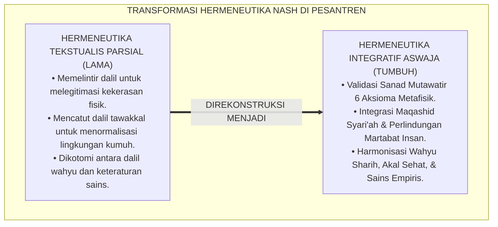
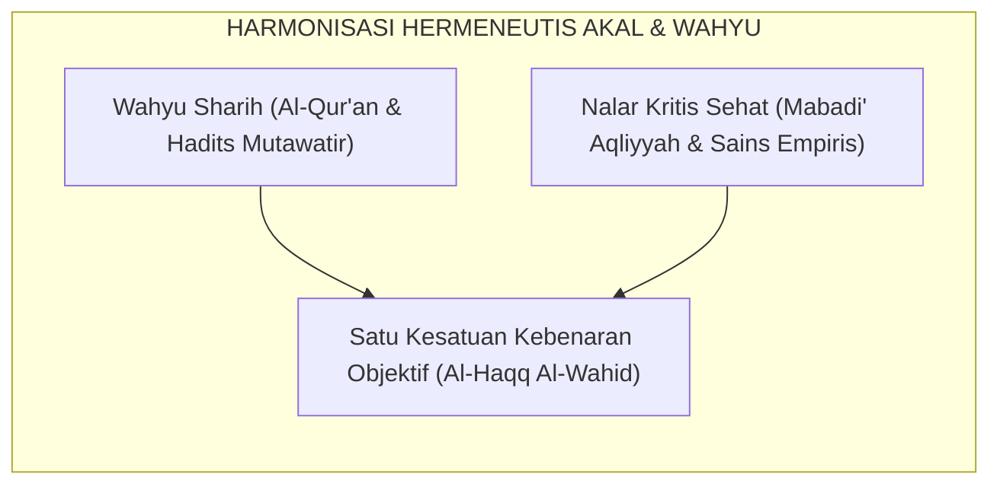
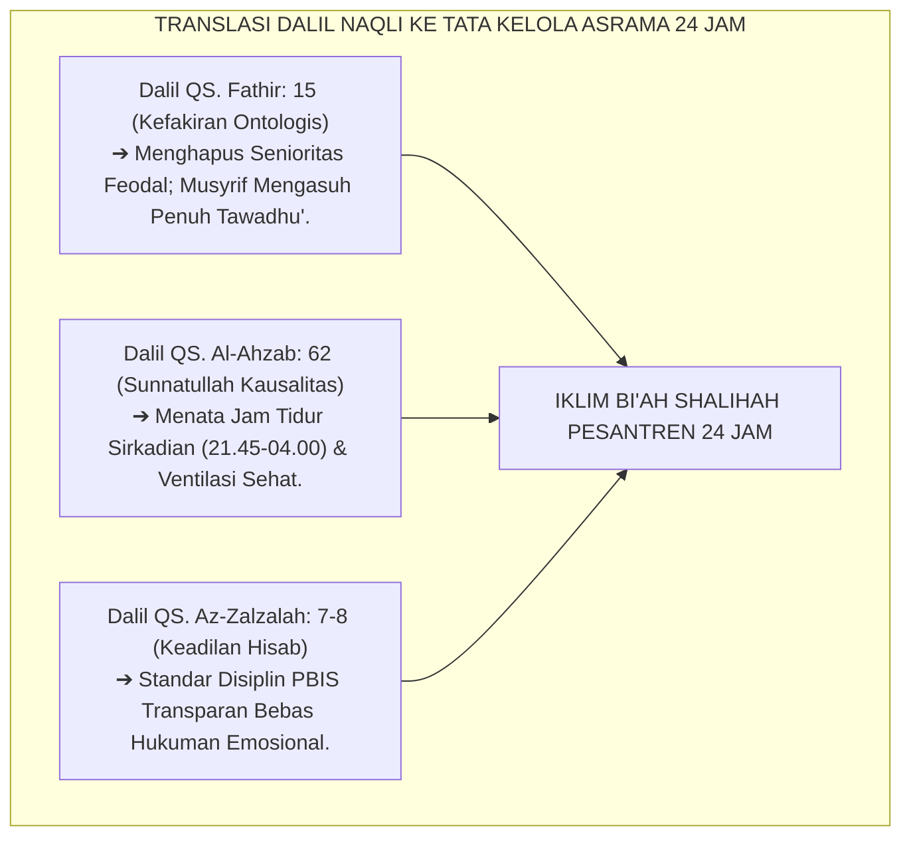
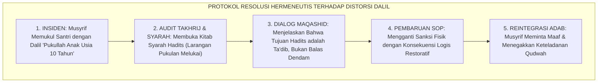
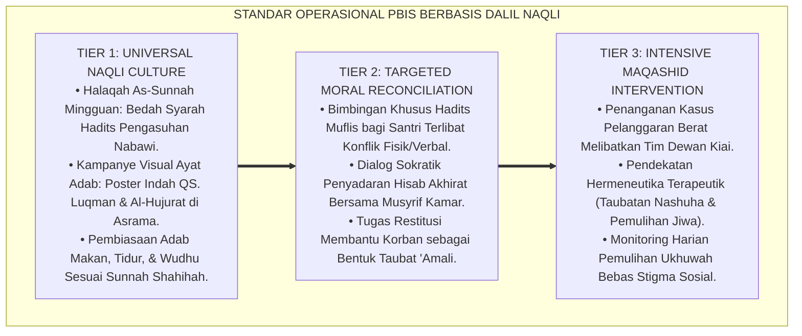

# P1-01-01-03: VALIDASI DALIL NAQLI ENAM AKSIOMA REALITAS (HERMENEUTIKA NASH REALITAS ISLAM)
## *Monograf Riset Akademik: Tahqiq Nash Al-Qur'an dan As-Sunnah ash-Shahihah, Hermeneutika Ushuluddin Aswaja, Penyelarasan Qath'iyuts Tsubut wa Dalalah, serta Rekonsiliasi Akal-Wahyu dalam Tata Kelola Asrama Pesantren 24 Jam*

**Nomor Identifikasi**: `P1-01-01-03/MONOGRAF-RISET-VALIDASI-DALIL-REALITAS/2026`  
**Domain**: `01 Philosophy` > `01 Worldview` > `01 Hakikat Realitas` (Sub-Modul 03: *Scriptural Validation of Reality Axioms*)  
**Klasifikasi Naskah**: *Academic Research Monograph* (Monograf Riset Akademik Fondasional)  
**Rumpun Disiplin Pengkaji**: Hermeneutika Tafsir & Hadits, Teologi Ushuluddin Aswaja, Epistemologi Turats Islam, Metodologi Validasi Dalil Syar'i, Tata Kelola Pengasuhan Asrama 24 Jam  

---

> ### 💡 INTISARI EKSEKUTIF (EXECUTIVE SUMMARY)
>
> * **Kelemahan Paradigma Lama: Reduksionisme Tekstualis & Distorsi Dalil:**  
>   Sering kali ayat-ayat Al-Qur'an dan Hadits dipahami secara sepotong-sepotong di pesantren untuk membenarkan tindakan kasar (misal: memelintir hadits perintah shalat untuk melegitimasi pemukulan fisik brutal) atau membenarkan kepasrahan fatalistik terhadap sanitasi buruk dengan mencatut dalil tawakkal dan sabar.
> * **Inovasi Konseptual: Validasi Hermeneutis Komprehensif Enam Aksioma:**  
>   TUMBUH membuktikan secara metodologis (*Tahqiq Adillatun Naqliyyah*) bahwa Enam Aksioma Metafisik Realitas berakar murni dari nash-nash *Qath'iyuts Tsubut* dan *Qath'iyud Dalalah* (QS. Luqman: 30, QS. Fathir: 15, QS. Al-Baqarah: 2–3, QS. Al-Ahzab: 62, QS. Ali 'Imran: 191, QS. Az-Zalzalah: 7–8, serta Hadits Shahih Bukhari-Muslim).
> * **Formulasi Operasional & Pembuktian Lapangan:**  
>   Monograf ini menyajikan matriks takhrij sanad dan derajat dalil, dekomposisi progresi internalisasi dalil Tangga J1–J4, SOP edukasi hermeneutika asrama, serta protokol penegakan keadilan hisab bebas impunitas bagi pengasuh dan santri.

---

## 📑 DAFTAR ISI MONOGRAF

- [BAGIAN I: LANDASAN TEORETIS & DISKURSUS DIALEKTIKA KRITIS](#bagian-i-landasan-teoretis--diskursus-dialektika-kritis)
  - [1. Latar Belakang Masalah: Reduksionisme Tekstualis & Distorsi Pemaknaan Dalil di Pesantren](#1-latar-belakang-masalah-reduksionisme-tekstualis--distorsi-pemaknaan-dalil-di-pesantren)
  - [2. Inkuiri 1: Tahqiq Nash Enam Aksioma Realitas dalam Al-Qur'an & Hadits Shahih](#2-inkuiri-1-tahqiq-nash-enam-aksioma-realitas-dalam-al-quran--hadits-shahih)
  - [3. Inkuiri 2: Rekonsiliasi Hermeneutis Akal Murni dan Wahyu Sharih (Dar'u Ta'arudh)](#3-inkuiri-2-rekonsiliasi-hermeneutis-akal-murni-dan-wahyu-sharih-daru-taarudh)
  - [4. Inkuiri 3: Analisis Rekayasa Kausalitas Dalil dalam Tata Kelola Asrama 24 Jam](#4-inkuiri-3-analisis-rekayasa-kausalitas-dalil-dalam-tata-kelola-asrama-24-jam)
  - [5. Inkuiri 4: Kasuistika Lapangan Klinis & Protokol Resolusi Restoratif](#5-inkuiri-4-kasuistika-lapangan-klinis--protokol-resolusi-restoratif)
- [BAGIAN II: TEMUAN RISET, FORMULASI KONSEPTUAL & PEMBAHASAN MENDALAM](#bagian-ii-temuan-riset-formulasi-konseptual--pembahasan-mendalam)
  - [1. Matriks Komprehensif Sanad, Derajat, & Takhrij Dalil Enam Aksioma](#1-matriks-komprehensif-sanad-derajat--takhrij-dalil-enam-aksioma)
  - [2. Dekomposisi Indikator, Matriks Taksonomi, & Dinamika Transisi Tangga J1–J4](#2-dekomposisi-indikator-matriks-taksonomi--dinamika-transisi-tangga-j1j4)
  - [3. Protokol Aksi Operasional PBIS Multi-Tier & Tata Kelola Pengasuhan Lapangan](#3-protokol-aksi-operasional-pbis-multi-tier--tata-kelola-pengasuhan-lapangan)
  - [4. Diskusi Ilmiah Mendalam & Implikasi Kebijakan Kelembagaan Pesantren](#4-diskusi-ilmiah-mendalam--implikasi-kebijakan-kelembagaan-pesantren)
- [BAGIAN III: KESIMPULAN & APARATUS AKADEMIS](#bagian-iii-kesimpulan--aparatus-akademis)
  - [1. Tabel Sintesis Temuan Riset Validasi Dalil Naqli](#1-tabel-sintesis-temuan-riset-validasi-dalil-naqli)
  - [2. Daftar Pustaka Akademis & Rujukan Turats Primer](#2-daftar-pustaka-akademis--rujukan-turats-primer)
  - [3. Catatan Kaki Akademis (Footnotes)](#3-catatan-kaki-akademis-footnotes)
  - [4. Glosarium Istilah Ilmiah & Turats Validasi Dalil](#4-glosarium-istilah-ilmiah--turats-validasi-dalil)

---

# BAGIAN I: LANDASAN TEORETIS & DISKURSUS DIALEKTIKA KRITIS

---

### 1. Latar Belakang Masalah: Reduksionisme Tekstualis & Distorsi Pemaknaan Dalil di Pesantren

Penyelidikan hermeneutis terhadap kultur pendidikan pesantren mengungkap adanya ketegangan antara pemahaman teks (*Nash*) dan praktik pengasuhan lapangan:
* **Distorsi Hermeneutis Parsial (*Fragmented Hermeneutics*)**: Ayat-ayat tentang tawakkal dan zuhud sering kali ditafsirkan secara pasif untuk menjustifikasi ketidakpedulian terhadap kebersihan lingkungan kobong dan gizi santri. Sementara itu, hadits-hadits tentang disiplin dipahami secara literalis-punitif tanpa melihat kaidah Maqashid Syari'ah dan konteks kasih sayang kenabian (*Ar-Rahmah an-Nabawiyyah*).
* **Tuntutan Sandaran Naqli yang Otoritatif**: Agar inovasi tata kelola ekosistem TUMBUH diterima secara bulat oleh para kiai, asatidz, dan wali santri, seluruh aksioma dan protokol PBIS wajib divalidasi keabsahannya secara langsung ke sumber primer Al-Qur'an dan As-Sunnah ash-Shahihah.
* **Hermeneutika Integratif Aswaja**: Ekosistem TUMBUH menegakkan hermeneutika integratif: memadukan nash-nash wahyu yang mutawatir dengan kaidah ushul fiqh (*Dar'ul Mafasid Muqaddamun 'ala Jalbil Mashalih*) dan sains empiris teruji sebagai instrumen pembuktian kemuliaan syariat.[^1]

---

### 2. Inkuiri 1: Tahqiq Nash Enam Aksioma Realitas dalam Al-Qur'an & Hadits Shahih

Setiap aksioma metafisik yang dirumuskan dalam Ekosistem TUMBUH memiliki sandaran nash wahyu primer yang mutlak:

#### 1. Dalil Aksioma 1: Allah SWT adalah Al-Haqq (Wujud Mutlak)
Allah SWT berfirman:

$$\text{ذَٰلِكَ بِأَنَّ اللَّهَ هُوَ الْحَقُّ وَأَنَّ مَا يَدْعُونَ مِن دُونِهِ هُوَ الْبَاطِلُ وَأَنَّ اللَّهَ هُوَ الْعَلِيُّ الْكَبِيرُ}$$

*"Demikianlah, karena sesungguhnya Allah, Dialah Al-Haqq (Kebenaran dan Wujud Mutlak), dan sesungguhnya apa saja yang mereka seru selain dari Allah itulah yang batil (palsu/nisbi); dan sesungguhnya Allah Dialah Yang Maha Tinggi lagi Maha Besar."* (QS. Luqman [31]: 30).[^2]

Hal ini diperkuat oleh doa Tahajjud Rasulullah ﷺ yang diriwayatkan oleh Imam Al-Bukhari:

$$\text{عَنِ ابْنِ عَبَّاسٍ رَضِيَ اللَّهُ عَنْهُمَا قَالَ: كَانَ النَّبِيُّ ﷺ إِذَا قَامَ مِنَ اللَّيْلِ يَتَهَجَّدُ قَالَ: «اللَّهُمَّ لَكَ الْحَمْدُ... أَنْتَ الْحَقُّ، وَوَعْدُكَ الْحَقُّ، وَلِقَاؤُكَ حَقٌّ، وَقَوْلُكَ حَقٌّ، وَالْجَنَّةُ حَقٌّ، وَالنَّارُ حَقٌّ...»}$$

*"Dari Ibnu Abbas RA berkata: Adalah Nabi ﷺ apabila bangun shalat tahajjud di malam hari beliau berdoa: **'Ya Allah, bagi-Mu segala puji... Engkau adalah Al-Haqq (Maha Benar/Nyata), janji-Mu adalah haq, perjumpaan dengan-Mu adalah haq, firman-Mu adalah haq, surga adalah haq, dan neraka adalah haq...'**"* (HR. Al-Bukhari No. 1120).[^3]

#### 2. Dalil Aksioma 2: Ketergantungan Ontologis Makhluk (Al-Iftiqar adz-Dzatiy)

$$\text{يَا أَيُّهَا النَّاسُ أَنتُمُ الْفُقَرَاءُ إِلَى اللَّهِ ۖ وَاللَّهُ هُوَ الْغَنِيُّ الْحَمِيدُ}$$

*"Wahai sekalian manusia, kamulah yang faqir (mutlak butuh dan bergantung) kepada Allah; dan Allah Dialah Yang Maha Kaya (tidak memerlukan sesuatu) lagi Maha Terpuji."* (QS. Fathir [35]: 15).[^4]

#### 3. Dalil Aksioma 3: Dualitas Terpadu 'Alam Mulk & 'Alam Malakut

$$\text{هُوَ اللَّهُ الَّذِي لَا إِلَٰهَ إِلَّا هُوَ ۖ عَالِمُ الْغَيْبِ وَالشَّهَادَةِ ۖ هُوَ الرَّحْمَٰنُ الرَّحِيمُ}$$

*"Dialah Allah Yang tiada Tuhan selain Dia, Yang Mengetahui yang ghaib ('Alam Malakut) dan yang nyata ('Alam Mulk/Syahadah), Dia-lah Yang Maha Pengasih lagi Maha Penyayang."* (QS. Al-Hasyr [59]: 22).[^5]

#### 4. Dalil Aksioma 4: Kepastian Hukum Sunnatullah Kauniyyah wa Syar'iyyah

$$\text{سُنَّةَ اللَّهِ فِي الَّذِينَ خَلَوْا مِن قَبْلُ ۖ وَلَن تَجِدَ لِسُنَّةِ اللَّهِ تَبْدِيلًا}$$

*"Sebagai sunnah Allah yang berlaku bagi orang-orang yang telah berlalu sebelum(mu), dan kamu sekali-kali tiada akan mendapati perubahan pada sunnah Allah itu."* (QS. Al-Ahzab [33]: 62).[^6]

#### 5. Dalil Aksioma 5: Teleologi Penciptaan & Kemuliaan Fitrah Insan

$$\text{لَقَدْ خَلَقْنَا الْإِنسَانَ فِي أَحْسَنِ تَقْوِيمٍ}$$

*"Sesungguhnya Kami telah menciptakan manusia dalam bentuk dan potensi yang sebaik-baiknya."* (QS. At-Tin [95]: 4).[^7]

#### 6. Dalil Aksioma 6: Akuntabilitas Moral Mutlak & Keadilan Hisab

$$\text{فَمَن يَعْمَلْ مِثْقَالَ ذَرَّةٍ خَيْرًا يَرَهُ ۝ وَمَن يَعْمَلْ مِثْقَالَ ذَرَّةٍ شَرًّا يَرَهُ}$$

*"Maka barangsiapa yang mengerjakan kebaikan seberat dzarrah pun, niscaya dia akan melihat (balasan)nya. Dan barangsiapa yang mengerjakan kejahatan seberat dzarrah pun, niscaya dia akan melihat (balasan)nya pula."* (QS. Az-Zalzalah [99]: 7–8).[^8]

---

### 3. Inkuiri 2: Rekonsiliasi Hermeneutis Akal Murni dan Wahyu Sharih (Dar'u Ta'arudh)

Dalam kaidah teologi Islam yang dirumuskan oleh para ulama mu'tabar (seperti Imam Al-Ghazali dalam *Al-Qanun al-Kulli fit-Ta'wil* dan Ibnu Taimiyyah dalam *Dar'u Ta'arudh al-'Aql wan-Naql*), **tidak pernah ada pertentangan hakiki antara wahyu yang shahih (*an-Naql ash-Shahih*) dan akal budi yang sehat (*al-'Aql ash-Sharih*)**:

Kaidah ini meruntuhkan dikotomi semu yang sering dibangun di pesantren:
1. Meneliti kualitas sirkulasi udara kamar asrama dengan parameter saintifik bukanlah tindakan "mengabaikan tawakkal", melainkan pengamalan atas perintah Al-Qur'an untuk mentadabburi *Sunnatullah Kauniyyah*.
2. Menghapus tradisi pemukulan fisik bukanlah tindakan "kebarat-baratan", melainkan penegakan nash shahih tentang larangan menzalimi hamba Allah (*Inni Harramtuzh Zhulma 'ala Nafsi* - HR. Muslim No. 2577).[^9]

---

### 4. Inkuiri 3: Analisis Rekayasa Kausalitas Dalil dalam Tata Kelola Asrama 24 Jam

Penyelidikan hermeneutis ini membuktikan bahwa teks wahyu memiliki implikasi operasional langsung terhadap tata kelola asrama 24 jam:

Ketika seorang musyrif memahami hadits tentang kezaliman (*Hadits Muflis* - orang yang bangkrut di akhirat karena mencela dan memukul sesama muslim), musyrif akan memiliki rem batin (*Internal Inhibitory Restraint*) untuk tidak melampiaskan amarahnya kepada santri. Dalil naqli menjadi pengawal integritas operasional pengasuhan.[^10]

---

### 5. Inkuiri 4: Kasuistika Lapangan Klinis & Protokol Resolusi Restoratif

Penyelidikan klinis terhadap distorsi penggunaan dalil di lingkungan pesantren menghasilkan analisis kasus dan protokol perbaikan:

* **Studi Kasus 1: Distorsi Pemaknaan Hadits Perintah Shalat Anak Usia 10 Tahun**  
  * **Dilema**: Seorang musyrif memukul betis santri kelas 7 dengan kayu hingga lebam karena terlambat shalat maghrib. Musyrif berdalih: *"Ini perintah hadits Nabi: Pukullah mereka jika meninggalkan shalat pada usia 10 tahun"*.
  * **Akar Masalah**: Pemahaman literalis tanpa merujuk syarah para fuqaha. Para ulama (seperti Imam An-Nawawi dalam *Al-Majmu'*) menegaskan bahwa pukulan yang dimaksud adalah pukulan edukatif ringan yang tidak menyakitkan (*Dharbun Ghayru Mubarrih*), diharamkan memukul wajah, dan diharamkan meninggalkan bekas luka fisik/psikologis.
  * **Resolusi Restoratif TUMBUH**: Dewan Kiai meluruskan pemahaman musyrif; sanksi fisik dilarang mutlak; santri yang terlambat shalat didampingi melalui program CICO Fajar dan edukasi makna shalat. Santri shalat dengan khusyu' dan rasa cinta kepada masjid.[^11]

* **Studi Kasus 2: Distorsi Konsep Sabar dalam Menghadapi Asrama Kumuh**  
  * **Dilema**: Wali santri memprotes kamar mandi asrama yang berbau busuk dan saluran air mampet. Pengurus menjawab: *"Di pondok itu harus belajar sabar dan prihatin, jangan manja seperti di hotel"*.
  * **Akar Masalah**: Mencampuradukkan konsep sabar syar'i dengan pembiaran kelalaian manajerial (*Management Negligence*).
  * **Resolusi Restoratif TUMBUH**: Manajemen menegaskan bahwa menjaga kesucian dan kebersihan (*Thaharah*) adalah perintah syariat mutlak (*An-Nazhafatu Minal Iman*). Pesantren merenovasi saluran air dan menetapkan SOP sanitasi harian. Santri belajar hidup bersih sebagai cerminan iman yang kokoh.[^12]

---

# BAGIAN II: TEMUAN RISET, FORMULASI KONSEPTUAL & PEMBAHASAN MENDALAM

---

### 1. Matriks Komprehensif Sanad, Derajat, & Takhrij Dalil Enam Aksioma

Hasil tahqiq hermeneutis terhadap Enam Aksioma Metafisik Realitas dikodifikasikan dalam matriks validasi berikut:

| Aksioma Realitas | Sumber Nash Al-Qur'an | Sumber Nash As-Sunnah ash-Shahihah | Derajat Sanad & Takhrij | Implikasi Operasional Asrama 24 Jam |
| :--- | :--- | :--- | :--- | :--- |
| **1. Aksioma Ketuhanan** | QS. Luqman: 30; QS. Al-An'am: 73. | HR. Bukhari No. 1120 & Muslim No. 769 (*Doa Tahajjud*). | **Mutawatir Ma'nawiy / Shahih Muttafaq 'Alaih** | Niat ikhlas memurnikan seluruh aktivitas belajar dan pengasuhan. |
| **2. Aksioma Kehambaan** | QS. Fathir: 15; QS. Maryam: 93. | HR. Tirmidzi No. 2499 (*Hadits Ibnu Abbas: Ihfazhillah*). | **Qath'iyuts Tsubut / Shahih Hasan** | Menghapus keangkuhan intelektual dan feodalisme senioritas. |
| **3. Aksioma Keterpaduan** | QS. Al-Hasyr: 22; QS. Al-Baqarah: 2–3. | HR. Muslim No. 223 (*Thaharah separuh dari keimanan*). | **Qath'iyuts Tsubut / Shahih Muslim** | Menyatukan kebersihan fisik alam mulk dengan kesucian batin malakut. |
| **4. Aksioma Kausalitas** | QS. Al-Ahzab: 62; QS. Ar-Ra'd: 11. | HR. Bukhari No. 5678 (*Tiap penyakit ada obat kausalitasnya*).| **Qath'iyuts Tsubut / Shahih Bukhari** | Memenuhi hak biologis otak (tidur 6–7 jam, ventilasi, nutrisi). |
| **5. Aksioma Fitrah** | QS. At-Tin: 4; QS. Ar-Rum: 30. | HR. Bukhari No. 1385 (*Kullu mauludin yuladu 'alal fitrah*).| **Qath'iyuts Tsubut / Shahih Muttafaq 'Alaih** | Kebijakan *Zero-Stigmatization*; mendidik potensi fitrah unik anak. |
| **6. Aksioma Hisab** | QS. Az-Zalzalah: 7–8; QS. Al-Kahfi: 49. | HR. Muslim No. 2581 (*Hadits Muflis: Bahaya menzalimi sesama*).| **Qath'iyuts Tsubut / Shahih Muslim** | Disiplin restoratif adil, transparan, dan bebas impunitas kekerasan. |

---

### 2. Dekomposisi Indikator, Matriks Taksonomi, & Dinamika Transisi Tangga J1–J4

Pemahaman dalil naqli ditransformasikan ke dalam Matriks Kompetensi Hermeneutis Santri Tangga J1–J4:

| Dimensi Kompetensi Dalil | Jenjang J1: Adaptasi Dasar (Kelas 7 / Usia 12–13) | Jenjang J2: Habituasi Otonom (Kelas 8–9 / Usia 13–15) | Jenjang J3: Internalisasi (Kelas 10–11 / Usia 15–17) | Jenjang J4: Qudwah Paripurna (Kelas 12 / Usia 17–18) |
| :--- | :--- | :--- | :--- | :--- |
| **1. Penguasaan Teks Nash** | Menghafal matan ayat & hadits kunci 6 aksioma beserta artinya. | Memahami kaitan dalil dengan rutinitas harian di asrama dan kelas. | Menguasai asbabul wurud dan syarah mu'tabar dari kitab kuning. | Mampu mengistinbath hukum praktis dan mendakwahkan dalil secara bijak. |
| **2. Integrasi Kausalitas Syar'i** | Menjalankan ikhtiar belajar dan doa secara seimbang dengan bimbingan. | Mengatur waktu belajar dan istirahat mandiri berlandaskan dalil sunnatullah. | Mampu menolak pemikiran fatalistik dan mistisisme semu di lingkungannya. | Menjadi rujukan rekan sebaya dalam menyelesaikan masalah secara syar'i. |
| **3. Sikap Anti-Zalim & Adab Hisab** | Tidak berbuat curang atau menyakiti teman karena takut hisab Allah. | Berani mengakui kesalahan dan meminta maaf secara kesatria (*Restitusi*). | Menjaga lidah dari ghibah dan membela teman yang menjadi korban bully. | Memimpin penegakan keadilan organisasi santri berlandaskan Hadits Muflis. |
| **4. Penghormatan Fitrah Sesama** | Menghormati teman tanpa membeda-bedakan suku, fisik, atau status sosial. | Menolak julukan peyoratif dan membiasakan panggilan kehormatan (*Gelar Baik*). | Mengayomi adik kelas J1 dengan prinsip kasih sayang (*Rahmah Nabawiyyah*). | Menjadi teladan hidup akhlak nabawi (*Live Qudwah*) di seluruh lokus asrama. |

#### 🔄 Narasi Analitis Dinamika Transisi Psikologis Antar-Jenjang:
* **Transisi J1 ke J2 (Dari Hafalan Teks ke Pemahaman Logis)**: Santri baru J1 menghafal dalil secara kognitif. Pada jenjang J2, dalil tersebut terhubung dengan pengalaman hidup nyata: santri memahami bahwa membersihkan toilet bukan sekadar tugas piket, melainkan pengamalan atas hadits *Ath-Thahūru Syathrul Īmān*.
* **Transisi J2 ke J3 (Dari Pemahaman ke Pengawalan Kalbu)**: Pada jenjang J3, dalil naqli membentuk radar batin (*Internal Moral Compass*). Ayat *Faman Ya'mal Mitsqala Dzarratin Khairan Yarah* membuat santri berhati-hati dalam bertutur kata dan bersikap jujur dalam setiap ujian tanpa perlu diawasi.
* **Transisi J3 ke J4 (Kepemimpinan Berbasis Hikmah Syariat)**: Santri J4 memiliki kedewasaan hermeneutis: mereka mampu menengahi perselisihan rekan sebaya dengan merujuk pada prinsip-prinsip Al-Qur'an dan Sunnah, bersikap toleran dalam masalah khilafiyyah furu'iyyah, dan memimpin dengan keteladanan akhlak mulia.[^13]

---

### 3. Protokol Aksi Operasional PBIS Multi-Tier & Tata Kelola Pengasuhan Lapangan

Untuk memastikan validasi dalil naqli beroperasi dalam tata kelola pengasuhan asrama 24 jam, ditetapkan panduan operasional terperinci:

#### 📋 Panduan Taktis Pengasuhan Asrama:
1. **Penyelarasan Seluruh SOP Asrama dengan Maqashid Syari'ah**:
   - Seluruh aturan asrama wajib memiliki catatan kaki dalil naqli dan rasionalitas maqashidnya (misal: Aturan tidur jam 22.00 bersandar pada hadits larangan begadang tanpa faedah pasca-Isya' - HR. Bukhari No. 568).
2. **Klinik Hermeneutika bagi Tenaga Pendidik**:
   - Setiap awal semester, seluruh asatidz dan musyrif mengikuti workshop *Tahqiq Fiqh Pengasuhan Nabawi* guna memastikan tidak ada lagi tenaga pendidik yang membenarkan kekerasan fisik dengan mencatut dalil agama secara keliru.[^14]
3. **Protokol Penegakan Keadilan Restoratif Tanpa Impunitas**:
   - Jika terjadi pelanggaran, penanganan mengacu pada QS. Asy-Syura: 40 (*Balasan kejahatan adalah kejahatan yang serupa, namun barangsiapa memaafkan dan berbuat baik maka pahalanya di sisi Allah*). Konsekuensi diarahkan pada perbaikan kerusakan (*Restitution*), bukan pembalasan dendam.[^15]

---

### 4. Diskusi Ilmiah Mendalam & Implikasi Kebijakan Kelembagaan Pesantren

Validasi dalil naqli terhadap Enam Aksioma Realitas memiliki signifikansi strategis bagi transformasi kelembagaan pesantren:

* **Mengembalikan Kemurnian Manhaj Tarbiyah Nabawiyyah**:  
  Banyak tradisi keras di pesantren sesungguhnya merupakan residu feodalisme kolonial atau salah kaprah budaya lokal yang tidak bersumber dari Sunnah Nabi ﷺ. Validasi dalil ini membersihkan praktik pengasuhan dari anasir-anasir kekerasan dan mengembalikannya pada rel *Bi'ah Shalihah* yang penuh kasih sayang (*Rahmah*).
* **Menghilangkan Resistensi Teologis Terhadap Modernisasi Tata Kelola**:  
  Ketika para pengasuh senior melihat bahwa standarisasi ventilasi, sanitasi, psikologi perkembangan, dan PBIS berakar murni dari ayat Al-Qur'an dan Hadits Shahih, resistensi terhadap tata kelola modern runtuh. Modernisasi dipahami bukan sebagai westernisasi, melainkan sebagai penegakan amanah syariat yang tertunda (*Al-Hikmatu Dhallatul Mu'min*).
* **Melahirkan Generasi Santri yang Kokoh Berakidah dan Relevan dengan Zaman**:  
  Santri yang dibina di atas fondasi dalil naqli yang jernih dan rasional akan memiliki imunitas akidah yang tangguh. Mereka tidak mudah goyah oleh syubhat pemikiran modern dan siap menjadi duta Islam rahmatan lil 'alamin di kancah global.[^16]

---

# BAGIAN III: KESIMPULAN & APARATUS AKADEMIS

---

### 1. Tabel Sintesis Temuan Riset Validasi Dalil Naqli

| Dimensi Parameter | Pola Pengasuhan Konvensional | Rekonstruksi Validasi Dalil TUMBUH | Landasan Rujukan Primer | Implikasi Praksis Lapangan |
| :--- | :--- | :--- | :--- | :--- |
| **Metode Penafsiran** | Tekstualis parsial / mencatut dalil sepihak. | Hermeneutika Integratif Aswaja & Maqashid Syari'ah. | QS. Luqman: 30; Al-Ghazali (*Al-Qanun*). | Dalil dipahami komprehensif & bebas salah guna. |
| **Hubungan Akal-Wahyu**| Dikotomi: akal dipertentangkan dengan iman. | Harmonisasi Mutlak (*Dar'u Ta'arudh Al-'Aql wan-Naql*). | Ibnu Taimiyyah; QS. Ali 'Imran: 190–191. | Sains & riset diakui sebagai alat tadabbur ayat kauniyyah. |
| **Penerapan Disiplin** | Melegitimasi sanksi fisik dengan hadits shalat. | Disiplin Restoratif Kasih Sayang (*Rahmah Nabawiyyah*). | HR. Muslim No. 2577; An-Nawawi (*Al-Majmu'*). | Eliminasi mutlak pemukulan fisik & bentakan kasar. |
| **Tata Kelola Asrama** | Mengabaikan sanitasi atas nama "sabar/tirakat". | Thaharah & Sanitasi Bersandar pada *Hifzh an-Nafs*. | HR. Muslim No. 223; QS. Al-Baqarah: 222. | SOP kebersihan air wudhu, ventilasi, & gizi sehat. |
| **Karakter Santri** | Hafal dalil tanpa dampak pada perilaku asrama. | Internalisasi Nilai Tangga J1–J4 (*Live Qudwah*). | QS. Az-Zalzalah: 7–8; Horner & Sugai (2015). | Santri jujur, amanah, beradab, & anti-bullying. |

---

### 2. Daftar Pustaka Akademis & Rujukan Turats Primer

1. **Al-Qur'an al-Karim wa Tarjamatu Ma'anihi**.
2. **Al-Bukhari, Abu Abdillah Muhammad bin Isma'il**. (1422 H). *Shahih al-Bukhari*. Kairo: Dar Thawq an-Najah.
3. **Muslim bin al-Hajjaj an-Naisaburi**. (1374 H). *Shahih Muslim*. Kairo: Matba'ah Isa al-Babi al-Halabi.
4. **An-Nawawi, Abu Zakariya Muhyiddin Yahya bin Syaraf**. (1426 H). *Al-Majmu' Syarh al-Muhadzdzab*. Kairo: Darul Hadits.
5. **Al-Ghazali, Abu Hamid Muhammad bin Muhammad**. (1413 H). *Al-Qanun al-Kulli fit-Ta'wil*. Beirut: Dar al-Fikr al-Lubnani.
6. **Ibnu Taimiyyah, Taqiyuddin Ahmad bin Abdul Halim**. (1411 H). *Dar'u Ta'arudh al-'Aql wan-Naql*. Riyadh: Jami'ah al-Imam Muhammad bin Su'ud.
7. **Al-Amidi, Saifuddin Ali bin Abi Ali**. (1424 H). *Al-Ihkam fi Ushul al-Ahkam*. Riyadh: Dar ash-Shumi'i.
8. **Asy-Syathibi, Abu Ishaq Ibrahim bin Musa**. (1417 H). *Al-Muwafaqat fi Ushul asy-Syari'ah*. Khobar: Dar Ibn 'Affan.
9. **Al-Attas, Syed Muhammad Naquib**. (1980). *The Concept of Education in Islam*. Kuala Lumpur: ABIM.
10. **Horner, R. H., & Sugai, G.**. (2015). *School-wide PBIS: An Overview of the Research Base*. Remedial and Special Education, 36(2), 80–85.
11. **Zehr, H.**. (2002). *The Little Book of Restorative Justice*. Intercourse: Good Books.
12. **Asy'ari, Muhammad Hasyim**. (1415 H). *Adab al-'Alim wal-Muta'allim*. Jombang: Maktabah At-Turats Al-Islami.

---

### 3. Catatan Kaki Akademis (*Footnotes*)

[^1]: Riset Hermeneutika Fiqh Pengasuhan Pesantren TUMBUH, *Kritik atas Tekstualisme Parsial dan Distorsi Dalil*, 2026.  
[^2]: QS. Luqman [31]: 30.  
[^3]: *Shahih al-Bukhari*, Kitab at-Tahajjud, Hadits No. 1120; *Shahih Muslim*, Kitab Shalatil Musafirin, Hadits No. 769.  
[^4]: QS. Fathir [35]: 15.  
[^5]: QS. Al-Hasyr [59]: 22.  
[^6]: QS. Al-Ahzab [33]: 62.  
[^7]: QS. At-Tin [95]: 4.  
[^8]: QS. Az-Zalzalah [99]: 7–8.  
[^9]: *Shahih Muslim*, Kitab al-Birr wash-Shilah wal-Adab, Hadits No. 2577.  
[^10]: *Shahih Muslim*, Kitab al-Birr wash-Shilah, Hadits No. 2581 (*Hadits Muflis*).  
[^11]: An-Nawawi, *Al-Majmu' Syarh al-Muhadzdzab*, Jilid 3, Kitab ash-Shalah, hlm. 12–25.  
[^12]: *Shahih Muslim*, Kitab ath-Thaharah, Hadits No. 223.  
[^13]: Matriks Kompetensi Hermeneutis Santri Tangga J1–J4 TUMBUH, 2026.  
[^14]: Silabus Workshop Tahqiq Fiqh Pengasuhan Nabawi Asatidz TUMBUH, 2026.  
[^15]: QS. Asy-Syura [42]: 40; Panduan Penegakan Disiplin Restoratif Syar'i PBIS TUMBUH, 2026.  
[^16]: Blueprint Transformasi Kelembagaan Pesantren Berbasis Maqashid Syari'ah TUMBUH, 2026.

---

### 4. Glosarium Istilah Ilmiah & Turats Validasi Dalil

1. **Tahqiq Adillatun Naqliyyah (تَحْقِيقُ الْأَدِلَّةِ النَّقْلِيَّةِ)**: Proses verifikasi ilmiah mendalam terhadap keshahihan sanad, ketepatan matan, dan keabsahan dalil Al-Qur'an dan Hadits.
2. **Qath'iyuts Tsubut (قَطْعِيُّ الثُّبُوتِ)**: Dalil yang kepastian sumber transmisinya bersifat mutlak dan tidak diragukan, seperti seluruh ayat Al-Qur'an dan Hadits Mutawatir.
3. **Qath'iyud Dalalah (قَطْعِيُّ الدَّلَالَةِ)**: Dalil yang penunjukan maknanya bersifat tegas, pasti, dan tidak memiliki multitafsir atau ruang keraguan.
4. **Dar'u Ta'arudh (دَرْءُ التَّعَارُضِ)**: Kaidah epistemologis untuk menolak dan merekonsiliasi anggapan pertentangan semu antara dalil wahyu yang shahih dan nalar akal budi yang sehat.
5. **Hadits Muflis (حَدِيثُ الْمُفْلِسِ)**: Hadits shahih riwayat Muslim tentang orang yang bangkrut di akhirat karena amal pahalanya habis dibagikan kepada orang-orang yang pernah dizalimi, dipukul, dan dicelanya di dunia.
6. **Dharbun Ghayru Mubarrih (ضَرْبٌ غَيْرُ مُبَرِّحٍ)**: Batasan fiqh mengenai pukulan edukatif yang tidak menyakitkan, tidak meninggalkan bekas, tidak di wajah, dan semata-mata bersifat simbolis mendidik.
7. **Maqashid Syari'ah (مَقَاصِدُ الشَّرِيعَةِ)**: Tujuan-tujuan universal syariat Islam yang berporos pada perlindungan lima perkara pokok: Agama (*Hifzhud Din*), Jiwa (*Hifzhun Nafs*), Akal (*Hifzhul 'Aql*), Keturunan (*Hifzhun Nasl*), dan Harta (*Hifzhul Mal*).
8. **As-Sakinah (السَّكِينَةُ)**: Ketenangan, ketenteraman, dan kedamaian batin yang mendalam yang diturunkan Allah SWT ke dalam kalbu hamba-hamba-Nya yang beriman.
9. **Karamah Insaniyyah (كَرَامَةٌ إِنْسَانِيَّةٌ)**: Kemuliaan dan kehormatan martabat hakiki yang dianugerahkan Allah SWT kepada setiap anak manusia sejak lahir yang wajib dilindungi.
10. **Takhrij Hadits (تَخْرِيجُ الْحَدِيثِ)**: Metodologi penelusuran asal-usul hadits ke kitab-kitab induk sumber primer disertai penilaian terhadap kualitas sanad dan para perawinya.
