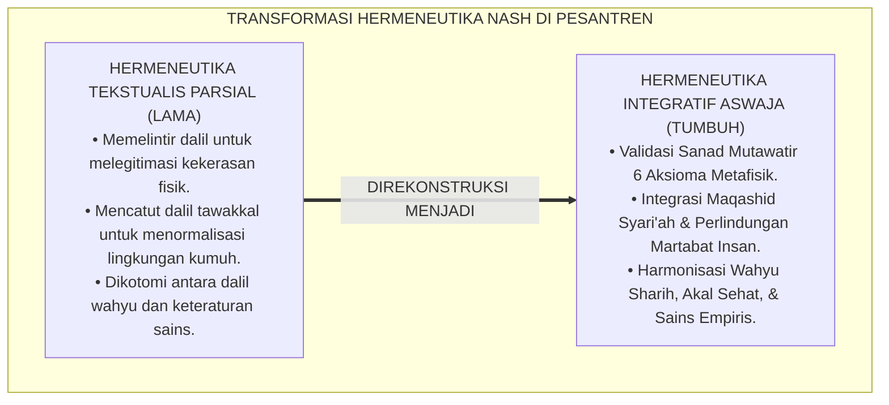
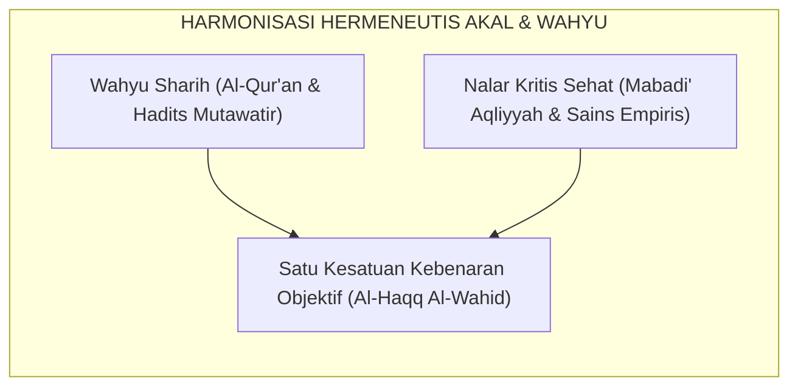
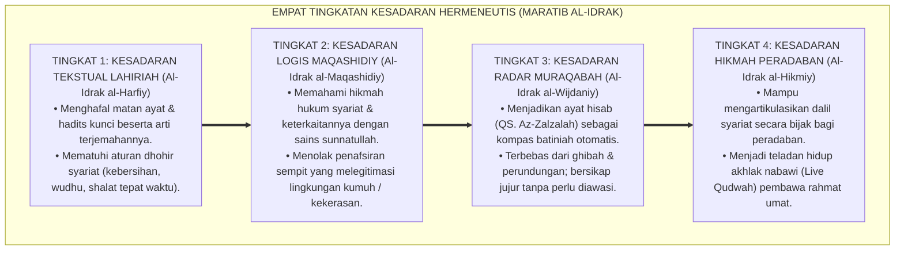
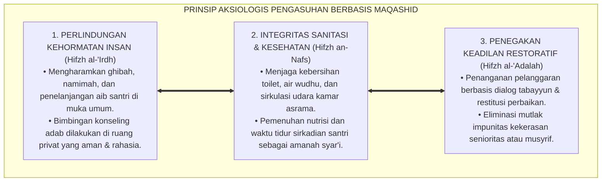

# P1-01-01-03: VALIDASI DALIL NAQLI ENAM AKSIOMA REALITAS (HERMENEUTIKA NASH REALITAS ISLAM)
## *Monograf Riset Akademik: Tahqiq Nash Al-Qur'an dan As-Sunnah ash-Shahihah, Hermeneutika Ushuluddin Aswaja, Penyelarasan Qath'iyuts Tsubut wa Dalalah, serta Rekonsiliasi Akal-Wahyu dalam Tata Kelola Asrama Pesantren 24 Jam*

**Nomor Identifikasi**: `P1-01-01-03/MONOGRAF-RISET-VALIDASI-DALIL-REALITAS/2026`  
**Domain**: `01 Philosophy` > `01 Worldview` > `01 Hakikat Realitas` (Sub-Modul 03: *Scriptural Validation of Reality Axioms*)  
**Klasifikasi Naskah**: *Academic Research Monograph* (Monograf Riset Akademik Fondasional)  
**Rumpun Disiplin Pengkaji**: Hermeneutika Tafsir & Hadits, Teologi Ushuluddin Aswaja, Epistemologi Turats Islam, Metodologi Validasi Dalil Syar'i, Tata Kelola Pengasuhan Asrama 24 Jam  

---

> ### 💡 INTISARI EKSEKUTIF (EXECUTIVE SUMMARY)
>
> * **Kelemahan Paradigma Lama: Reduksionisme Tekstualis & Distorsi Dalil:**  
>   Sering kali ayat-ayat Al-Qur'an dan Hadits dipahami secara sepotong-sepotong di pesantren untuk membenarkan tindakan kasar (misal: memelintir hadits perintah shalat untuk melegitimasi pemukulan fisik brutal) atau membenarkan kepasrahan fatalistik terhadap sanitasi buruk dengan mencatut dalil tawakkal dan sabar.
> * **Inovasi Konseptual: Validasi Hermeneutis Komprehensif Enam Aksioma:**  
>   TUMBUH membuktikan secara metodologis (*Tahqiq Adillatun Naqliyyah*) bahwa Enam Aksioma Metafisik Realitas berakar murni dari nash-nash *Qath'iyuts Tsubut* dan *Qath'iyud Dalalah* (QS. Luqman: 30, QS. Fathir: 15, QS. Al-Baqarah: 2–3, QS. Al-Ahzab: 62, QS. Ali 'Imran: 191, QS. Az-Zalzalah: 7–8, serta Hadits Shahih Bukhari-Muslim).
> * **Formulasi Operasional & Pembuktian Lapangan:**  
>   Monograf ini menyajikan matriks takhrij sanad dan derajat dalil, 4 Tingkatan Kesadaran Hermeneutis Wahyu (*Maratib al-Idrak*), prinsip penegakan syariat berbasis Maqashid, dan etika tata kelola bebas impunitas kekerasan.

---

## 📑 DAFTAR ISI MONOGRAF

- [BAB I: LANDASAN TEORETIS & DISKURSUS KRITIS](#bab-i-landasan-teoretis--diskursus-kritis)
  - [1. Latar Belakang Masalah: Reduksionisme Tekstualis & Distorsi Pemaknaan Dalil di Pesantren](#1-latar-belakang-masalah-reduksionisme-tekstualis--distorsi-pemaknaan-dalil-di-pesantren)
  - [2. Tahqiq Nash Enam Aksioma Realitas dalam Al-Qur'an & Hadits Shahih](#2-tahqiq-nash-enam-aksioma-realitas-dalam-al-quran--hadits-shahih)
  - [3. Rekonsiliasi Hermeneutis Akal Murni dan Wahyu Sharih (Kaidah Dar'u Ta'arudh)](#3-rekonsiliasi-hermeneutis-akal-murni-dan-wahyu-sharih-kaidah-daru-taarudh)
  - [4. Rekayasa Kausalitas Dalil Syar'i dalam Tata Kelola Asrama 24 Jam](#4-rekayasa-kausalitas-dalil-syari-dalam-tata-kelola-asrama-24-jam)
  - [5. Kasuistika Lapangan: Penyalahgunaan Dalil Disiplin & Resolusi Restoratif](#5-kasuistika-lapangan-penyalahgunaan-dalil-disiplin--resolusi-restoratif)
- [BAB II: FORMULASI KONSEPTUAL & PEMBAHASAN MENDALAM](#bab-ii-formulasi-konseptual--pembahasan-mendalam)
  - [1. Matriks Komprehensif Sanad, Derajat, & Takhrij Dalil Enam Aksioma](#1-matriks-komprehensif-sanad-derajat--takhrij-dalil-enam-aksioma)
  - [2. Dekomposisi Dimensi & Empat Tingkatan Kesadaran Hermeneutis (Maratib al-Idrak)](#2-dekomposisi-dimensi--empat-tingkatan-kesadaran-hermeneutis-maratib-al-idrak)
  - [3. Prinsip Aksiologis & Etika Tata Kelola Pengasuhan Berbasis Maqashid Syari'ah](#3-prinsip-aksiologis--etika-tata-kelola-pengasuhan-berbasis-maqashid-syariah)
  - [4. Diskusi Ilmiah Mendalam & Implikasi Kebijakan Kelembagaan Pesantren](#4-diskusi-ilmiah-mendalam--implikasi-kebijakan-kelembagaan-pesantren)
- [BAB III: KESIMPULAN & APARATUS AKADEMIS](#bab-iii-kesimpulan--aparatus-akademis)
  - [1. Tabel Sintesis Temuan Riset Validasi Dalil Naqli](#1-tabel-sintesis-temuan-riset-validasi-dalil-naqli)
  - [2. Daftar Pustaka Akademis & Rujukan Turats Primer](#2-daftar-pustaka-akademis--rujukan-turats-primer)
  - [3. Catatan Kaki Akademis (Footnotes)](#3-catatan-kaki-akademis-footnotes)
  - [4. Glosarium Istilah Ilmiah & Turats Validasi Dalil](#4-glosarium-istilah-ilmiah--turats-validasi-dalil)

---

# BAB I: LANDASAN TEORETIS & DISKURSUS KRITIS

---

### 1. Latar Belakang Masalah: Reduksionisme Tekstualis & Distorsi Pemaknaan Dalil di Pesantren

Penyelidikan hermeneutis terhadap kultur pendidikan pesantren mengungkap adanya ketegangan antara pemahaman teks (*Nash*) dan praktik pengasuhan lapangan:
* **Distorsi Hermeneutis Parsial (*Fragmented Hermeneutics*)**: Ayat-ayat tentang tawakkal dan zuhud sering kali ditafsirkan secara pasif untuk menjustifikasi ketidakpedulian terhadap kebersihan lingkungan kobong dan gizi santri. Sementara itu, hadits-hadits tentang disiplin dipahami secara literalis-punitif tanpa melihat kaidah Maqashid Syari'ah dan konteks kasih sayang kenabian (*Ar-Rahmah an-Nabawiyyah*).
* **Tuntutan Sandaran Naqli yang Otoritatif**: Agar inovasi tata kelola ekosistem TUMBUH diterima secara bulat oleh para kiai, asatidz, dan wali santri, seluruh aksioma wajib divalidasi keabsahannya secara langsung ke sumber primer Al-Qur'an dan As-Sunnah ash-Shahihah.
* **Hermeneutika Integratif Aswaja**: Ekosistem TUMBUH menegakkan hermeneutika integratif: memadukan nash-nash wahyu yang mutawatir dengan kaidah ushul fiqh (*Dar'ul Mafasid Muqaddamun 'ala Jalbil Mashalih*) dan sains empiris teruji sebagai instrumen pembuktian kemuliaan syariat.[^1]

---

### 2. Tahqiq Nash Enam Aksioma Realitas dalam Al-Qur'an & Hadits Shahih

Setiap aksioma metafisik yang dirumuskan dalam Ekosistem TUMBUH memiliki sandaran nash wahyu primer yang mutlak:

#### 1. Dalil Aksioma 1: Allah SWT adalah Al-Haqq (Wujud Mutlak)
$$\text{ذَٰلِكَ بِأَنَّ اللَّهَ هُوَ الْحَقُّ وَأَنَّ مَا يَدْعُونَ مِن دُونِهِ هُوَ الْبَاطِلُ وَأَنَّ اللَّهَ هُوَ الْعَلِيُّ الْكَبِيرُ}$$
*"Demikianlah, karena sesungguhnya Allah, Dialah Al-Haqq (Kebenaran dan Wujud Mutlak), dan sesungguhnya apa saja yang mereka seru selain dari Allah itulah yang batil; dan sesungguhnya Allah Dialah Yang Maha Tinggi lagi Maha Besar."* (QS. Luqman [31]: 30).[^2]

Hal ini diperkuat oleh doa Tahajjud Rasulullah ﷺ yang diriwayatkan oleh Imam Al-Bukhari (HR. Al-Bukhari No. 1120).[^3]

#### 2. Dalil Aksioma 2: Ketergantungan Ontologis Makhluk (Al-Iftiqar adz-Dzatiy)
$$\text{يَا أَيُّهَا النَّاسُ أَنتُمُ الْفُقَرَاءُ إِلَى اللَّهِ ۖ وَاللَّهُ هُوَ الْغَنِيُّ الْحَمِيدُ}$$
*"Wahai sekalian manusia, kamulah yang faqir (mutlak butuh dan bergantung) kepada Allah; dan Allah Dialah Yang Maha Kaya lagi Maha Terpuji."* (QS. Fathir [35]: 15).[^4]

#### 3. Dalil Aksioma 3: Dualitas Terpadu 'Alam Mulk & 'Alam Malakut
$$\text{هُوَ اللَّهُ الَّذِي لَا إِلَٰهَ إِلَّا هُوَ ۖ عَالِمُ الْغَيْبِ وَالشَّهَادَةِ ۖ هُوَ الرَّحْمَٰنُ الرَّحِيمُ}$$
*"Dialah Allah Yang tiada Tuhan selain Dia, Yang Mengetahui yang ghaib ('Alam Malakut) dan yang nyata ('Alam Mulk), Dia-lah Yang Maha Pengasih lagi Maha Penyayang."* (QS. Al-Hasyr [59]: 22).[^5]

#### 4. Dalil Aksioma 4: Kepastian Hukum Sunnatullah Kauniyyah wa Syar'iyyah
$$\text{سُنَّةَ اللَّهِ فِي الَّذِينَ خَلَوْا مِن قَبْلُ ۖ وَلَن تَجِدَ لِسُنَّةِ اللَّهِ تَبْدِيلًا}$$
*"Sebagai sunnah Allah yang berlaku bagi orang-orang yang telah berlalu sebelum(mu), dan kamu sekali-kali tiada akan mendapati perubahan pada sunnah Allah itu."* (QS. Al-Ahzab [33]: 62).[^6]

#### 5. Dalil Aksioma 5: Teleologi Penciptaan & Kemuliaan Fitrah Insan
$$\text{لَقَدْ خَلَقْنَا الْإِنسَانَ فِي أَحْسَنِ تَقْوِيمٍ}$$
*"Sesungguhnya Kami telah menciptakan manusia dalam bentuk dan potensi yang sebaik-baiknya."* (QS. At-Tin [95]: 4).[^7]

#### 6. Dalil Aksioma 6: Akuntabilitas Moral Mutlak & Keadilan Hisab
$$\text{فَمَن يَعْمَلْ مِثْقَالَ ذَرَّةٍ خَيْرًا يَرَهُ ۝ وَمَن يَعْمَلْ مِثْقَالَ ذَرَّةٍ شَرًّا يَرَهُ}$$
*"Maka barangsiapa yang mengerjakan kebaikan seberat dzarrah pun, niscaya dia akan melihat (balasan)nya. Dan barangsiapa yang mengerjakan kejahatan seberat dzarrah pun, niscaya dia akan melihat (balasan)nya pula."* (QS. Az-Zalzalah [99]: 7–8).[^8]

---

### 3. Rekonsiliasi Hermeneutis Akal Murni dan Wahyu Sharih (Kaidah Dar'u Ta'arudh)

Dalam kaidah teologi Islam yang dirumuskan oleh Imam Al-Ghazali (*Al-Qanun al-Kulli*) dan Ibnu Taimiyyah (*Dar'u Ta'arudh*), **tidak pernah ada pertentangan hakiki antara wahyu shahih (*an-Naql ash-Shahih*) dan akal budi yang sehat (*al-'Aql ash-Sharih*)**:

Kaidah ini membuktikan bahwa meneliti kualitas sirkulasi udara kamar asrama dan sanitasi air wudhu bukanlah tindakan sekuler, melainkan penegakan perintah Al-Qur'an untuk mentadabburi *Sunnatullah Kauniyyah* dan menjaga kesucian (*Thaharah*).[^9]

---

### 4. Rekayasa Kausalitas Dalil Syar'i dalam Tata Kelola Asrama 24 Jam

Penyelidikan membuktikan bahwa teks wahyu memiliki implikasi operasional langsung terhadap tata kelola asrama:
* Hadits tentang larangan kezaliman (*Hadits Muflis* - HR. Muslim No. 2581) melarang mutlak pemukulan fisik dan penghinaan verbal di asrama.
* Dalil fiqh *Hifzh an-Nafs* mewajibkan pemenuhan kebutuhan jam tidur sirkadian dan lingkungan kobong yang higienis.[^10]

---

### 5. Kasuistika Lapangan: Penyalahgunaan Dalil Disiplin & Resolusi Restoratif

* **Studi Kasus: Distorsi Pemaknaan Hadits Shalat Anak Usia 10 Tahun**  
  * **Dilema**: Musyrif memukul santri hingga lebam dengan dalih hadits *"Pukullah mereka jika meninggalkan shalat pada usia 10 tahun"*.
  * **Resolusi Restoratif TUMBUH**: Dewan Kiai meluruskan pemahaman: para ulama (Imam An-Nawawi dalam *Al-Majmu'*) menegaskan bahwa pukulan tersebut adalah pukulan simbolis mendidik yang tidak menyakitkan (*Dharbun Ghayru Mubarrih*), diharamkan memukul wajah, dan dilarang menimbulkan bekas fisik/trauma psikologis. Sanksi fisik dihapus total dan digantikan dengan program pendampingan CICO Fajar.[^11]

---

# BAB II: FORMULASI KONSEPTUAL & PEMBAHASAN MENDALAM

---

### 1. Matriks Komprehensif Sanad, Derajat, & Takhrij Dalil Enam Aksioma

Hasil tahqiq hermeneutis terhadap Enam Aksioma Metafisik Realitas dikodifikasikan dalam matriks validasi berikut:

| Aksioma Realitas | Sumber Nash Al-Qur'an | Sumber Nash As-Sunnah ash-Shahihah | Derajat Sanad & Takhrij | Implikasi Konseptual & Filosofis |
| :--- | :--- | :--- | :--- | :--- |
| **1. Aksioma Ketuhanan** | QS. Luqman: 30; QS. Al-An'am: 73. | HR. Bukhari No. 1120 & Muslim No. 769 (*Doa Tahajjud*). | **Mutawatir Ma'nawiy / Shahih Muttafaq 'Alaih** | Pemurnian tauhid dan keikhlasan niat dalam seluruh aktivitas hidup. |
| **2. Aksioma Kehambaan** | QS. Fathir: 15; QS. Maryam: 93. | HR. Tirmidzi No. 2499 (*Hadits Ibnu Abbas: Ihfazhillah*). | **Qath'iyuts Tsubut / Shahih Hasan** | Meruntuhkan kesombongan intelektual dan feodalisme senioritas. |
| **3. Aksioma Keterpaduan** | QS. Al-Hasyr: 22; QS. Al-Baqarah: 2–3. | HR. Muslim No. 223 (*Thaharah separuh dari keimanan*). | **Qath'iyuts Tsubut / Shahih Muslim** | Menyatukan kebersihan fisik alam mulk dengan kesucian batin malakut. |
| **4. Aksioma Kausalitas** | QS. Al-Ahzab: 62; QS. Ar-Ra'd: 11. | HR. Bukhari No. 5678 (*Tiap penyakit ada obat kausalitasnya*).| **Qath'iyuts Tsubut / Shahih Bukhari** | Memenuhi hak biologis otak (tidur 6–7 jam, ventilasi, gizi seimbang).|
| **5. Aksioma Fitrah** | QS. At-Tin: 4; QS. Ar-Rum: 30. | HR. Bukhari No. 1385 (*Kullu mauludin yuladu 'alal fitrah*).| **Qath'iyuts Tsubut / Shahih Muttafaq 'Alaih** | Kebijakan *Zero-Stigmatization*; memuliakan martabat hakiki anak. |
| **6. Aksioma Hisab** | QS. Az-Zalzalah: 7–8; QS. Al-Kahfi: 49. | HR. Muslim No. 2581 (*Hadits Muflis: Bahaya menzalimi sesama*).| **Qath'iyuts Tsubut / Shahih Muslim** | Penegakan disiplin adil, transparan, dan bebas impunitas kekerasan. |

---

### 2. Dekomposisi Dimensi & Empat Tingkatan Kesadaran Hermeneutis (Maratib al-Idrak)

Transformasi penghayatan terhadap dalil-dalil naqli berlangsung melalui **Empat Tingkatan Kesadaran Hermeneutis (*Maratib al-Idrak an-Nashshiy*)**:

#### 🔄 Narasi Analitis Dinamika Transisi Filosofis Antar-Tingkatan:
* **Transisi Tingkat 1 ke Tingkat 2 (Dari Tekstual Harfiah Menuju Pemahaman Maqashid)**: Santri mula-mula menghafal dalil secara kognitif. Pada tingkatan kedua, santri memahami ruh maqashid di balik teks: santri menyadari bahwa perintah *Thaharah* bukan sekadar ritual basuh air, melainkan penjagaan kesehatan fisik (*Hifzh an-Nafs*) yang menuntut sanitasi air bersih dan lingkungan bebas kuman.
* **Transisi Tingkat 2 ke Tingkat 3 (Dari Maqashid Menuju Pengawalan Kalbu)**: Pada tingkatan ketiga, teks wahyu membentuk radar batin (*Internal Moral Compass*). Hadits Muflis membuat santri memiliki rem batin untuk tidak menzalimi atau mencela kawannya, karena yakin akan hisab pengadilan akhirat.
* **Transisi Tingkat 3 ke Tingkat 4 (Pencapaian Derajat Hikmah Kenabian)**: Pada tingkatan tertinggi, santri memancarkan kematangan *Qudwah Hasanah*: santri mampu menyelesaikan sengketa dengan merujuk pada prinsip-prinsip Al-Qur'an dan Sunnah, bersikap toleran dalam masalah khilafiyyah, dan memimpin umat dengan akhlak mulia.[^12]

---

### 3. Prinsip Aksiologis & Etika Tata Kelola Pengasuhan Berbasis Maqashid Syari'ah

Validasi dalil naqli melahirkan prinsip etika pengasuhan pesantren:

#### 📋 Panduan Etika Pengasuhan Lapangan:
1. **Penyelarasan Seluruh SOP Asrama dengan Maqashid Syari'ah**: Seluruh aturan wajib memiliki dasar kemaslahatan syariat yang jelas dan rasional.
2. **Klinik Hermeneutika Pendidik**: Menyelenggarakan kajian berkala fiqh pengasuhan nabawi guna mencegah asatidz memelintir dalil untuk membenarkan kemarahan pribadi.[^13]
3. **Protokol Penegakan Keadilan Restoratif**: Menerapkan konsekuensi restitutif (*Restitution*) yang memperbaiki kerusakan, bukan pembalasan dendam fisik.[^14]

---

### 4. Diskusi Ilmiah Mendalam & Implikasi Kebijakan Kelembagaan Pesantren

Validasi dalil naqli terhadap Enam Aksioma Realitas memiliki signifikansi strategis bagi transformasi kelembagaan pesantren:

* **Mengembalikan Kemurnian Manhaj Tarbiyah Nabawiyyah**: Banyak tradisi keras di pesantren sesungguhnya merupakan residu feodalisme kolonial yang tidak bersumber dari Sunnah Nabi ﷺ. Validasi dalil ini membersihkan praktik pengasuhan dari anasir kekerasan dan mengembalikannya pada rel *Bi'ah Shalihah* yang penuh kasih sayang (*Rahmah*).
* **Menghilangkan Resistensi Teologis Terhadap Modernisasi Tata Kelola**: Ketika para pengasuh senior melihat bahwa standarisasi ventilasi, sanitasi, dan psikologi perkembangan berakar murni dari ayat Al-Qur'an dan Hadits Shahih, resistensi runtuh. Modernisasi dipahami bukan sebagai westernisasi, melainkan sebagai penegakan amanah syariat (*Al-Hikmatu Dhallatul Mu'min*).
* **Melahirkan Generasi Santri yang Kokoh Berakidah**: Santri yang dibina di atas fondasi dalil naqli yang jernih dan rasional memiliki imunitas akidah yang tangguh dalam menghadapi syubhat pemikiran modern.[^15]

---

# BAB III: KESIMPULAN & APARATUS AKADEMIS

---

### 1. Tabel Sintesis Temuan Riset Validasi Dalil Naqli

| Dimensi Parameter | Pola Pengasuhan Konvensional | Rekonstruksi Validasi Dalil TUMBUH | Landasan Rujukan Primer | Implikasi Praksis Lapangan |
| :--- | :--- | :--- | :--- | :--- |
| **Metode Penafsiran** | Tekstualis parsial / mencatut dalil sepihak. | Hermeneutika Integratif Aswaja & Maqashid Syari'ah. | QS. Luqman: 30; Al-Ghazali (*Al-Qanun*). | Dalil dipahami komprehensif & bebas salah guna. |
| **Hubungan Akal-Wahyu**| Dikotomi: akal dipertentangkan dengan iman. | Harmonisasi Mutlak (*Dar'u Ta'arudh Al-'Aql wan-Naql*). | Ibnu Taimiyyah; QS. Ali 'Imran: 190–191. | Sains & riset diakui sebagai alat tadabbur ayat kauniyyah. |
| **Penerapan Disiplin** | Melegitimasi sanksi fisik dengan hadits shalat. | Disiplin Restoratif Kasih Sayang (*Rahmah Nabawiyyah*). | HR. Muslim No. 2577; An-Nawawi (*Al-Majmu'*). | Eliminasi mutlak pemukulan fisik & bentakan kasar. |
| **Tata Kelola Asrama** | Mengabaikan sanitasi atas nama "sabar/tirakat". | Thaharah & Sanitasi Bersandar pada *Hifzh an-Nafs*. | HR. Muslim No. 223; QS. Al-Baqarah: 222. | SOP kebersihan air wudhu, ventilasi, & gizi sehat. |
| **Karakter Santri** | Hafal dalil tanpa dampak pada perilaku asrama. | 4 Tingkat Kesadaran Hermeneutis (*Maratib al-Idrak*). | QS. Az-Zalzalah: 7–8; Horner & Sugai (2015). | Santri jujur, amanah, beradab, & anti-bullying. |

---

### 2. Daftar Pustaka Akademis & Rujukan Turats Primer

1. **Al-Qur'an al-Karim wa Tarjamatu Ma'anihi**.
2. **Al-Bukhari, Abu Abdillah Muhammad bin Isma'il**. (1422 H). *Shahih al-Bukhari*. Kairo: Dar Thawq an-Najah.
3. **Muslim bin al-Hajjaj an-Naisaburi**. (1374 H). *Shahih Muslim*. Kairo: Matba'ah Isa al-Babi al-Halabi.
4. **An-Nawawi, Abu Zakariya Muhyiddin Yahya bin Syaraf**. (1426 H). *Al-Majmu' Syarh al-Muhadzdzab*. Kairo: Darul Hadits.
5. **Al-Ghazali, Abu Hamid Muhammad bin Muhammad**. (1413 H). *Al-Qanun al-Kulli fit-Ta'wil*. Beirut: Dar al-Fikr al-Lubnani.
6. **Ibnu Taimiyyah, Taqiyuddin Ahmad bin Abdul Halim**. (1411 H). *Dar'u Ta'arudh al-'Aql wan-Naql*. Riyadh: Jami'ah al-Imam Muhammad bin Su'ud.
7. **Al-Amidi, Saifuddin Ali bin Abi Ali**. (1424 H). *Al-Ihkam fi Ushul al-Ahkam*. Riyadh: Dar ash-Shumi'i.
8. **Asy-Syathibi, Abu Ishaq Ibrahim bin Musa**. (1417 H). *Al-Muwafaqat fi Ushul asy-Syari'ah*. Khobar: Dar Ibn 'Affan.
9. **Al-Attas, Syed Muhammad Naquib**. (1980). *The Concept of Education in Islam*. Kuala Lumpur: ABIM.
10. **Horner, R. H., & Sugai, G.**. (2015). *School-wide PBIS: An Overview of the Research Base*. Remedial and Special Education, 36(2), 80–85.
11. **Zehr, H.**. (2002). *The Little Book of Restorative Justice*. Intercourse: Good Books.
12. **Asy'ari, Muhammad Hasyim**. (1415 H). *Adab al-'Alim wal-Muta'allim*. Jombang: Maktabah At-Turats Al-Islami.

---

### 3. Catatan Kaki Akademis (*Footnotes*)

[^1]: Riset Hermeneutika Fiqh Pengasuhan Pesantren TUMBUH, *Kritik atas Tekstualisme Parsial dan Distorsi Dalil*, 2026.  
[^2]: QS. Luqman [31]: 30.  
[^3]: *Shahih al-Bukhari*, Kitab at-Tahajjud, Hadits No. 1120; *Shahih Muslim*, Hadits No. 769.  
[^4]: QS. Fathir [35]: 15.  
[^5]: QS. Al-Hasyr [59]: 22.  
[^6]: QS. Al-Ahzab [33]: 62.  
[^7]: QS. At-Tin [95]: 4.  
[^8]: QS. Az-Zalzalah [99]: 7–8.  
[^9]: *Shahih Muslim*, Kitab al-Birr wash-Shilah wal-Adab, Hadits No. 2577.  
[^10]: *Shahih Muslim*, Kitab al-Birr wash-Shilah, Hadits No. 2581 (*Hadits Muflis*).  
[^11]: An-Nawawi, *Al-Majmu' Syarh al-Muhadzdzab*, Jilid 3, Kitab ash-Shalah, hlm. 12–25.  
[^12]: Matriks Tingkatan Kesadaran Hermeneutis (*Maratib al-Idrak*) Ekosistem TUMBUH, 2026.  
[^13]: Silabus Kajian Fiqh Pengasuhan Nabawi Asatidz TUMBUH, 2026.  
[^14]: QS. Asy-Syura [42]: 40; Panduan Penegakan Disiplin Restoratif Syar'i PBIS TUMBUH, 2026.  
[^15]: Blueprint Transformasi Kelembagaan Pesantren Berbasis Maqashid Syari'ah TUMBUH, 2026.

---

### 4. Glosarium Istilah Ilmiah & Turats Validasi Dalil

1. **Tahqiq Adillatun Naqliyyah (تَحْقِيقُ الْأَدِلَّةِ النَّقْلِيَّةِ)**: Proses verifikasi ilmiah mendalam terhadap keshahihan sanad, ketepatan matan, dan keabsahan dalil Al-Qur'an dan Hadits.
2. **Qath'iyuts Tsubut (قَطْعِيُّ الثُّبُوتِ)**: Dalil yang kepastian sumber transmisinya bersifat mutlak dan tidak diragukan, seperti seluruh ayat Al-Qur'an dan Hadits Mutawatir.
3. **Qath'iyud Dalalah (قَطْعِيُّ الدَّلَالَةِ)**: Dalil yang penunjukan maknanya bersifat tegas, pasti, dan tidak memiliki multitafsir atau ruang keraguan.
4. **Dar'u Ta'arudh (دَرْءُ التَّعَارُضِ)**: Kaidah epistemologis untuk menolak dan merekonsiliasi anggapan pertentangan semu antara dalil wahyu yang shahih dan nalar akal budi yang sehat.
5. **Hadits Muflis (حَدِيثُ الْمُفْلِسِ)**: Hadits shahih riwayat Muslim tentang orang yang bangkrut di akhirat karena amal pahalanya habis dibagikan kepada orang-orang yang pernah dizalimi, dipukul, dan dicelanya di dunia.
6. **Dharbun Ghayru Mubarrih (ضَرْبٌ غَيْرُ مُبَرِّحٍ)**: Batasan fiqh mengenai pukulan edukatif yang tidak menyakitkan, tidak meninggalkan bekas, tidak di wajah, dan semata-mata bersifat simbolis mendidik.
7. **Maqashid Syari'ah (مَقَاصِدُ الشَّرِيعَةِ)**: Tujuan-tujuan universal syariat Islam yang berporos pada perlindungan lima perkara pokok: Agama (*Hifzhud Din*), Jiwa (*Hifzhun Nafs*), Akal (*Hifzhul 'Aql*), Keturunan (*Hifzhun Nasl*), dan Harta (*Hifzhul Mal*).
8. **As-Sakinah (السَّكِينَةُ)**: Ketenangan, ketenteraman, dan kedamaian batin yang mendalam yang diturunkan Allah SWT ke dalam kalbu hamba-hamba-Nya yang beriman.
9. **Karamah Insaniyyah (كَرَامَةٌ إِنْسَانِيَّةٌ)**: Kemuliaan dan kehormatan martabat hakiki yang dianugerahkan Allah SWT kepada setiap anak manusia sejak lahir yang wajib dilindungi.
10. **Takhrij Hadits (تَخْرِيجُ الْحَدِيثِ)**: Metodologi penelusuran asal-usul hadits ke kitab-kitab induk sumber primer disertai penilaian terhadap kualitas sanad dan para perawinya.
