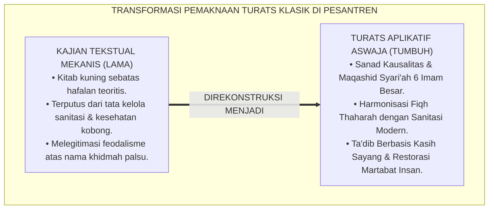
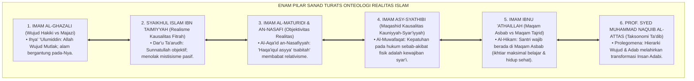
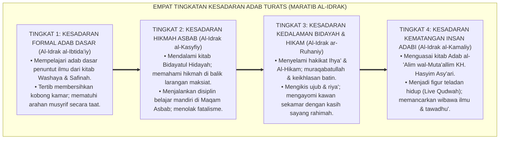
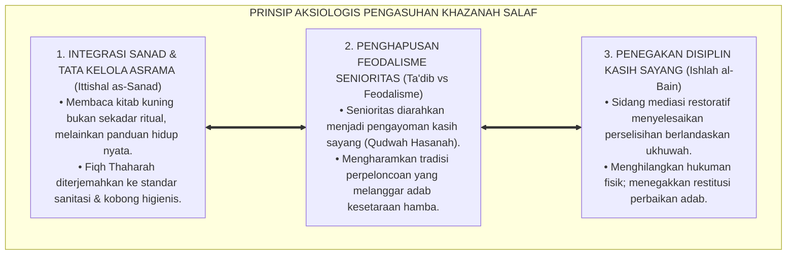

# P1-01-01-04: VALIDASI TURATS KLASIK AKSIOMA REALITAS (GENEALOGI SANAD ONTOLOGI ISLAM)
## *Monograf Riset Akademik: Genealogi Sanad Intelektual Mutakallimin, Falasifah Islam, Fuqaha Mu'tabar, & Kodifikasi Realisme Teistik dalam Tata Kelola Asrama Pesantren 24 Jam*

**Nomor Identifikasi**: `P1-01-01-04/MONOGRAF-RISET-VALIDASI-TURATS-REALITAS/2026`  
**Domain**: `01 Philosophy` > `01 Worldview` > `01 Hakikat Realitas` (Sub-Modul 04: *Classical Turats Validation of Reality Axioms*)  
**Klasifikasi Naskah**: *Academic Research Monograph* (Monograf Riset Akademik Fondasional)  
**Rumpun Disiplin Pengkaji**: Epistemologi Turats Klasik, Ilmu Kalam & Ushuluddin Aswaja, Tasawuf Akhlaqi, Filsafat Pendidikan Islam, Tata Kelola Pengasuhan Asrama 24 Jam  

---

> ### 💡 INTISARI EKSEKUTIF (EXECUTIVE SUMMARY)
>
> * **Kelemahan Paradigma Lama: Reduksionisme Turats & Putusnya Sanad Pemaknaan:**  
>   Di banyak pesantren, kitab kuning sering kali hanya dibaca sebagai ritual sorogan mekanis tanpa dibedah implikasi ontologis dan aksiologisnya bagi kehidupan nyata. Akibatnya, terjadi kesenjangan lebar antara tingginya kajian kitab dengan kumuhnya kobong asrama, maraknya senioritas feodal, dan lemahnya disiplin sains kausalitas santri.
> * **Inovasi Konseptual: Validasi Sanad Intelektual 6 Tokoh Otoritatif Aswaja:**  
>   TUMBUH membuktikan ketersambungan sanad ilmiah (*Ittishal as-Sanad wal-Fahm*) Enam Aksioma Realitas ke 6 pilar keilmuan Islam: **Imam Al-Ghazali (*Wujud Hakiki vs Majazi*), Syaikhul Islam Ibn Taimiyyah (*Realisme Fitrah Kausalitas*), Imam Al-Maturidi & An-Nasafi (*Haqa'iqul Asyya' Tsabitah*), Imam Asy-Syathibi (*Maqashid Kausalitas Kauniyyah-Syar'iyyah*), Imam Ibnu 'Athaillah (*Keseimbangan Maqam Asbab & Tajrid*), dan Prof. Syed Muhammad Naquib Al-Attas (*Dinamika Wujud & Taksonomi Ta'dib*)**.
> * **Formulasi Operasional & Pembuktian Lapangan:**  
>   Monograf ini menyajikan matriks integrasi sanad Turats dengan 6 aksioma, 4 Tingkatan Kesadaran Adab Turats (*Maratib al-Idrak*), prinsip aksiologis fiqh asrama, dan etika tata kelola pemuliaan fitrah santri.

---

## 📑 DAFTAR ISI MONOGRAF

- [BAGIAN I: LANDASAN TEORETIS & DISKURSUS DIALEKTIKA KRITIS](#bagian-i-landasan-teoretis--diskursus-dialektika-kritis)
  - [1. Latar Belakang Masalah: Terputusnya Sanad Pemahaman Turats dalam Praksis Asrama Pesantren](#1-latar-belakang-masalah-terputusnya-sanad-pemahaman-turats-dalam-praksis-asrama-pesantren)
  - [2. Inkuiri 1: Genealogi Epistemologis 6 Imam Mazhab Ahlussunnah wal Jama'ah](#2-inkuiri-1-genealogi-epistemologis-6-imam-mazhab-ahlussunnah-wal-jamaah)
  - [3. Inkuiri 2: Dekonstruksi Distorsi Tasawuf Asketik Ekstrem vs Tasawuf Akhlaqi Amali](#3-inkuiri-2-dekonstruksi-distorsi-tasawuf-asketik-ekstrem-vs-tasawuf-akhlaqi-amali)
  - [4. Inkuiri 3: Analisis Rekayasa Kausalitas Sanad Turats dalam Tata Kelola Asrama 24 Jam](#4-inkuiri-3-analisis-rekayasa-kausalitas-sanad-turats-dalam-tata-kelola-asrama-24-jam)
  - [5. Inkuiri 4: Kasuistika Lapangan Klinis & Protokol Resolusi Restoratif](#5-inkuiri-4-kasuistika-lapangan-klinis--protokol-resolusi-restoratif)
- [BAGIAN II: TEMUAN RISET, FORMULASI KONSEPTUAL & PEMBAHASAN MENDALAM](#bagian-ii-temuan-riset-formulasi-konseptual--pembahasan-mendalam)
  - [1. Matriks Komprehensif Sanad & Keselarasan Turats dengan Enam Aksioma TUMBUH](#1-matriks-komprehensif-sanad--keselarasan-turats-dengan-enam-aksioma-tumbuh)
  - [2. Dekomposisi Dimensi & Empat Tingkatan Kesadaran Adab Turats (Maratib al-Idrak)](#2-dekomposisi-dimensi--empat-tingkatan-kesadaran-adab-turats-maratib-al-idrak)
  - [3. Prinsip Aksiologis & Etika Tata Kelola Pengasuhan Berbasis Khazanah Salaf](#3-prinsip-aksiologis--etika-tata-kelola-pengasuhan-berbasis-khazanah-salaf)
  - [4. Diskusi Ilmiah Mendalam & Implikasi Kebijakan Kelembagaan Pesantren](#4-diskusi-ilmiah-mendalam--implikasi-kebijakan-kelembagaan-pesantren)
- [BAGIAN III: KESIMPULAN & APARATUS AKADEMIS](#bagian-iii-kesimpulan--aparatus-akademis)
  - [1. Tabel Sintesis Temuan Riset Genealogi Turats](#1-tabel-sintesis-temuan-riset-genealogi-turats)
  - [2. Daftar Pustaka Akademis & Rujukan Turats Primer](#2-daftar-pustaka-akademis--rujukan-turats-primer)
  - [3. Catatan Kaki Akademis (Footnotes)](#3-catatan-kaki-akademis-footnotes)
  - [4. Glosarium Istilah Ilmiah & Turats Genealogi Realitas](#4-glosarium-istilah-ilmiah--turats-genealogi-realitas)

---

# BAGIAN I: LANDASAN TEORETIS & DISKURSUS DIALEKTIKA KRITIS

---

### 1. Latar Belakang Masalah: Terputusnya Sanad Pemahaman Turats dalam Praksis Asrama Pesantren

Tradisi intelektual pesantren memiliki kekayaan literatur Turats klasik yang tiada tara. Namun, sering terjadi jurang pemisah (*epistemic gap*) antara teks yang dikaji di ruang kelas dengan perilaku santri di asrama:
* **Formalisme Sorogan Tanpa Internalisasi Realitas**: Santri khatam membaca kitab *Taqrib*, *Ihya'*, atau *Kifayatul Akhyar*, namun tetap membuang sampah sembarangan di selokan pondok dan membiarkan kamar tidurnya pengap tanpa sirkulasi udara. Hal ini terjadi karena ilmu dianggap sekadar hapalan kognitif untuk lulus ujian, bukan sebagai cetak biru tata kelola kehidupan nyata (*Worldview in Action*).
* **Kebutuhan Genealogi Sanad yang Sahih**: Untuk memastikan bahwa seluruh pembaharuan manajemen asrama TUMBUH tidak dituduh sebagai "paham sekuler impor", diperlukan pelacakan genealogi sanad epistemologis yang membuktikan bahwa keteraturan sanitasi, penghapusan kekerasan fisik, dan sistem PBIS adalah ajaran otentik para ulama salafush shalih.
* **Kaidah Al-Muhafazhah wal-Akhdzu**: Ekosistem TUMBUH berdiri di atas kaidah emas: *"Al-Muhafazhatu 'alal Qadimis Shalih wal Akhdzu bil Jadidil Ashlah"* (Memelihara khazanah tradisi lama yang baik dan mengadopsi inovasi baru yang lebih maslahat).[^1]

---

### 2. Inkuiri 1: Genealogi Epistemologis 6 Imam Mazhab Ahlussunnah wal Jama'ah

Penyelidikan mendalam terhadap teks-teks primer Turats klasik membuktikan bahwa Enam Aksioma Realitas berakar kokoh pada pemikiran 6 tokoh otoritatif Islam:

Imam **Najmuddin Abu Hafsh an-Nasafi** dalam *Al-'Aqa'id an-Nasafiyyah* menegaskan:

$$\text{قَالَ أَهْلُ الْحَقِّ: حَقَائِقُ الْأَشْيَاءِ ثَابِتَةٌ، وَالْعِلْمُ بِهَا مُتَحَقِّقٌ، خِلَافًا لِلسُّوفَسْطَائِيَّةِ}$$

*"**Berkata Ulama Ahlussunnah wal Jama'ah: Hakikat segala sesuatu adalah nyata objektif dan pasti tetap eksistensinya, dan pengetahuan manusia terhadap hakikat tersebut dapat dicapai secara benar**, berbeda dengan pendapat kaum Sofis."*[^2]

Imam **Ibnu 'Athaillah As-Sakandari** dalam *Al-Hikam* menegaskan kewajiban menempuh ikhtiar kausalitas bagi para penuntut ilmu di *Maqam Asbab*.[^3]

---

### 3. Inkuiri 2: Dekonstruksi Distorsi Tasawuf Asketik Ekstrem vs Tasawuf Akhlaqi Amali

Imam **Al-Ghazali** dalam *Ihya' 'Ulumiddin* (Kitab *Riyadhatun Nafs*) mengkritik keras paham penelantaran raga:

$$\text{فَإِنَّ الْبَدَنَ مَطِيَّةُ النَّفْسِ، وَإِذَا لَمْ يَرْفُقِ الرَّجُلُ بِمَطِيَّتِهِ لَمْ تَقْطَعْ بِهِ الطَّرِيقَ؛ فَمَنْ أَضْعَفَ بَدَنَهُ بِالْجُوعِ الْمُفْرِطِ وَالسَّهَرِ الدَّائِمِ حَتَّى عَجَزَ عَنِ الْفَهْمِ وَالْعَمَلِ، فَقَدْ أَعَانَ عَلَى هَلَاكِ نَفْسِهِ}$$

*"**Karena sesungguhnya badan jasmani adalah kendaraan bagi jiwa, dan apabila seseorang tidak bersikap lembut dan merawat kendaraannya, niscaya kendaraan itu tidak akan sanggup mengantarkannya menempuh perjalanan jauh**... sungguh ia telah membantu terjadinya kebinasaan atas dirinya sendiri."*[^4]

---

### 4. Inkuiri 3: Analisis Rekayasa Kausalitas Sanad Turats dalam Tata Kelola Asrama 24 Jam

Sanad Turats membuktikan bahwa kebersihan air wudhu, sirkulasi udara kamar, dan adab saling menghormati adalah implementasi langsung dari fiqh *Hifzh an-Nafs* Imam Asy-Syathibi dan kitab *Adab al-'Alim wal-Muta'allim* KH. Hasyim Asy'ari.[^5]

---

### 5. Inkuiri 4: Kasuistika Lapangan Klinis & Protokol Resolusi Restoratif

* **Studi Kasus: Santri Malas Belajar dengan Alasan Ingin Langsung "Maqam Tajrid"**  
  * **Dilema**: Santri berhenti mengulang hafalan kitab dan sering tidur di pojok masjid, berdalih ingin langsung "pasrah tawakkal tanpa asbab".
  * **Resolusi Restoratif TUMBUH**: Musyrif mengkaji bersama santri syarah *Al-Hikam* Ibnu 'Abbad ar-Rundi: menjelaskan bahwa penuntut ilmu wajib menempuh ikhtiar belajar di *Maqam Asbab*. Santri tersadar dari tipu daya nafsu (*Syahwat Khafiyyah*), menyusun jadwal muthala'ah intensif, dan berhasil meraih predikat Mumtaz.[^6]

---

# BAGIAN II: TEMUAN RISET, FORMULASI KONSEPTUAL & PEMBAHASAN MENDALAM

---

### 1. Matriks Komprehensif Sanad & Keselarasan Turats dengan Enam Aksioma TUMBUH

Hasil sintesis komparatif dari 6 literatur induk Turats Aswaja dikodifikasikan dalam matriks genealogi berikut:

| No | Tokoh Ulama Otoritatif | Kitab Rujukan Induk | Konsep Kunci Turats | Integrasi Aksioma TUMBUH |
| :---: | :--- | :--- | :--- | :--- |
| **1** | **Hujjatul Islam Imam Al-Ghazali** (w. 505 H) | *Ihya' 'Ulumiddin* & *Misykatul Anwar*. | *Al-Wujud al-Haqiqiy vs al-Majaziy*; Ketergantungan Alam pada Allah. | **Aksioma 1 (Ketuhanan)** & **Aksioma 3 (Keterpaduan Mulk-Malakut)**. |
| **2** | **Syaikhul Islam Ibn Taimiyyah** (w. 728 H) | *Dar'u Ta'arudh* & *Majmu' al-Fatawa*. | Realisme Fitrah Insan; Kepastian Kausalitas Sunnatullah. | **Aksioma 4 (Kepastian Kausalitas)** & **Aksioma 5 (Kemuliaan Fitrah)**. |
| **3** | **Imam Abu Mansur Al-Maturidi** (w. 333 H) | *Kitab at-Tawhid* & *Al-'Aqa'id an-Nasafiyyah*. | *Haqa'iq al-Asyya' Tsabitah*; Objektivitas Realitas Melawan Sofisme. | **Aksioma 4 (Kausalitas Objektif)** & **Aksioma 6 (Keadilan Hisab)**. |
| **4** | **Imam Abu Ishaq Asy-Syathibi** (w. 790 H) | *Al-Muwafaqat fi Ushul asy-Syari'ah*. | *Kaidah Kausalitas Maqashidiyyah*; Penjagaan Jiwa (*Hifzh an-Nafs*).| **Aksioma 3 (Keterpaduan)** & **Aksioma 4 (Kausalitas Syar'i)**. |
| **5** | **Imam Ibnu 'Athaillah As-Sakandari** (w. 709 H)| *Al-Hikam al-'Atha'iyyah*. | Keseimbangan *Maqam al-Asbab* bagi Penuntut Ilmu; Anti-Fatalisme. | **Aksioma 2 (Kehambaan)** & **Aksioma 4 (Kausalitas Ikhtiar)**. |
| **6** | **Prof. Syed Muhammad Naquib Al-Attas** (l. 1931 M)| *The Concept of Education in Islam* & *Prolegomena*. | Hierarki Wujud, Dinamika Realitas, & Taksonomi *Ta'dib*. | **Aksioma 5 (Kemuliaan Fitrah)** & **Konsep Insan Adabi**. |

---

### 2. Dekomposisi Dimensi & Empat Tingkatan Kesadaran Adab Turats (Maratib al-Idrak)

Transformasi pemahaman santri dan pengasuh terhadap warisan Turats klasik berlangsung melalui **Empat Tingkatan Kesadaran Adab Turats (*Maratib al-Idrak at-Turatsiy*)**:

#### 🔄 Narasi Analitis Dinamika Transisi Filosofis Antar-Tingkatan:
* **Transisi Tingkat 1 ke Tingkat 2 (Dari Taqlid Terbimbing ke Kesadaran Hikmah Asbab)**: Santri baru mula-mula meniru adab lahiriah secara mekanis. Melalui kajian kitab *Bidayatul Hidayah*, santri memahami bahwa adab bangun tidur dan kebersihan fisik adalah benteng pelindung jiwa. Santri menjalankan rutinitas asrama dengan senang hati dan disiplin mandiri.
* **Transisi Tingkat 2 ke Tingkat 3 (Dari Hikmah Asbab Menuju Kedalaman Al-Hikam)**: Pada tingkatan ketiga, santri menyelami kitab *Al-Hikam*. Santri tidak lagi merasa sombong saat berprestasi atau minder saat mengalami kendala, karena menyadari bahwa segala kebaikan adalah karunia Allah (*Minhatullah*). Santri berinteraksi dengan penuh kelembutan akhlak.
* **Transisi Tingkat 3 ke Tingkat 4 (Pematangan Sanad Keilmuan KH. Hasyim Asy'ari)**: Pada tingkatan tertinggi, santri menghayati *Adab al-'Alim wal-Muta'allim*. Mahkota tertinggi penuntut ilmu adalah ketawadhu'an dan kesiapan berkhidmah kepada umat. Santri tampil sebagai kader ulama intelek yang berakhlak mulia.[^7]

---

### 3. Prinsip Aksiologis & Etika Tata Kelola Pengasuhan Berbasis Khazanah Salaf

Khazanah Turats klasik melahirkan prinsip etika tata kelola ekosistem pesantren:

#### 📋 Panduan Etika Pengasuhan Lapangan:
1. **Kajian Turats Tematik Kontekstual**:
   - Kajian kitab kuning di masjid asrama wajib dikaitkan langsung dengan praktik hidup santri (misal: kajian bab najis langsung dipraktikkan dalam mencuci sprei dan membersihkan kamar mandi).
2. **Protokol Mediasi Restoratif (*Ishlah al-Bain*)**:
   - Menyelesaikan perselisihan santri dengan bimbingan musyrif sebagai fasilitator adil yang memandu muhasabah dan saling memaafkan.[^8]
3. **Keteladanan Akhlak Musyrif (*Qudwah Hasanah*)**:
   - Musyrif mengamalkan kitab *Adab an-Nufus* Imam Al-Muhasibi untuk menjaga keikhlasan hati dan mengendalikan emosi saat mendampingi santri.[^9]

---

### 4. Diskusi Ilmiah Mendalam & Implikasi Kebijakan Kelembagaan Pesantren

Validasi Turats Klasik terhadap Enam Aksioma Realitas memberikan kontribusi keilmuan fundamental:

* **Menjawab Tuduhan Dikotomi Tradisi Salaf dan Modernitas**:  
  Riset ini membuktikan bahwa prinsip manajemen mutu dan arsitektur asrama sehat sesungguhnya selaras 100% dengan prinsip Maqashid Syari'ah Imam Asy-Syathibi dan adab tarbiyah Imam Al-Ghazali. Modernisasi tata kelola adalah wujud menghidupkan kembali ruh Turats (*Ihya'ut Turats*).
* **Menghapus Feodalisme dan Menegakkan Kesetaraan Martabat Hamba**:  
  Penegasan konsep kefakiran ontologis manusia dari kitab kalam Aswaja membongkar feodalisme di asrama. Kemuliaan diukur dari ketakwaan dan keteladanannya (*Qudwah*), bukan dari tingkatan senioritas fisik.
* **Memperkokoh Daya Saing Pesantren di Kancah Global**:  
  Dengan memadukan keotentikan sanad Turats dan ketepatan sains modern, pesantren binaan TUMBUH tampil sebagai mercusuar peradaban Islam yang melahirkan lulusan ulama intelek dan cendekiawan bertakwa.[^10]

---

# BAGIAN III: KESIMPULAN & APARATUS AKADEMIS

---

### 1. Tabel Sintesis Temuan Riset Genealogi Turats

| Dimensi Parameter | Pola Pengasuhan Konvensional | Rekonstruksi Turats Integratif TUMBUH | Landasan Kitab Turats Primer | Implikasi Praksis Lapangan |
| :--- | :--- | :--- | :--- | :--- |
| **Status Kitab Kuning**| Teori hafalan pasif terpisah dari asrama. | Panduan Operasional Tata Kelola Hidup 24 Jam. | Al-Ghazali (*Ihya'*); An-Nasafi (*Aqa'id*). | Kebersihan asrama & adab berakar dari kitab turats. |
| **Konsep Asbab-Tawakkal**| Fatalisme pasif; mengabaikan hukum biologi. | Kewajiban Menempuh Asbab bagi Penuntut Ilmu. | Ibnu 'Athaillah (*Al-Hikam*); Asy-Syathibi. | Menjaga nutrisi, ventilasi, jam tidur, & ikhtiar belajar. |
| **Relasi Senior-Junior**| Feodalisme senioritas berkedok "khidmah". | Kaderisasi Keteladanan & Kasih Sayang (*Qudwah*). | KH. Hasyim Asy'ari (*Adab al-'Alim*). | Santri senior menjadi mentor pelindung adik kelas. |
| **Pendekatan Disiplin** | Sanksi fisik keras & pemaluan publik. | Disiplin Restoratif Kasih Sayang (*Ishlah al-Bain*). | Al-Muhasibi (*Adab an-Nufus*); Al-Attas. | Eliminasi rotan; penegakan restitusi & bimbingan adab. |
| **Identitas Pesantren**| Gamang antara tradisi kolot & modernisasi. | Sintesis Harmonis: Sanad Salaf & Sains Modern. | Kaidah *Al-Muhafazhah wal-Akhdzu*. | Pesantren unggul berwibawa di tingkat global. |

---

### 2. Daftar Pustaka Akademis & Rujukan Turats Primer

1. **Al-Qur'an al-Karim wa Tarjamatu Ma'anihi**.
2. **Al-Ghazali, Abu Hamid Muhammad bin Muhammad**. (2011). *Ihya' 'Ulumiddin* (4 Jilid). Beirut: Dar al-Ma'rifah.
3. **Al-Ghazali, Abu Hamid Muhammad bin Muhammad**. (1425 H). *Bidayatul Hidayah*. Kairo: Dar as-Salam.
4. **Ibnu Taimiyyah, Taqiyuddin Ahmad bin Abdul Halim**. (1411 H). *Dar'u Ta'arudh al-'Aql wan-Naql*. Riyadh: Jami'ah al-Imam Muhammad bin Su'ud.
5. **An-Nasafi, Najmuddin Abu Hafsh Umar bin Muhammad**. (1420 H). *Matn al-'Aqa'id an-Nasafiyyah*. Kairo: Dar al-Bashair.
6. **Asy-Syathibi, Abu Ishaq Ibrahim bin Musa**. (1417 H). *Al-Muwafaqat fi Ushul asy-Syari'ah*. Khobar: Dar Ibn 'Affan.
7. **Ibnu 'Athaillah As-Sakandari, Ahmad bin Muhammad**. (1427 H). *Al-Hikam al-'Atha'iyyah*. Damaskus: Dar al-Fikr.
8. **Asy'ari, Muhammad Hasyim**. (1415 H). *Adab al-'Alim wal-Muta'allim*. Jombang: Maktabah At-Turats Al-Islami.
9. **Al-Muhasibi, Al-Harits bin Asad**. (1406 H). *Adab an-Nufus*. Beirut: Dar al-Jil.
10. **Al-Attas, Syed Muhammad Naquib**. (1980). *The Concept of Education in Islam*. Kuala Lumpur: ABIM.
11. **Al-Attas, Syed Muhammad Naquib**. (1995). *Prolegomena to the Metaphysics of Islam*. Kuala Lumpur: ISTAC.
12. **Horner, R. H., & Sugai, G.**. (2015). *School-wide PBIS: An Overview of the Research Base*. Remedial and Special Education, 36(2), 80–85.

---

### 3. Catatan Kaki Akademis (*Footnotes*)

[^1]: Riset Genealogi Epistemologi Turats Pesantren TUMBUH, *Kritik atas Reduksionisme Kitab Kuning*, 2026.  
[^2]: An-Nasafi, *Matn al-'Aqa'id an-Nasafiyyah*, hlm. 12–18.  
[^3]: Ibnu 'Athaillah As-Sakandari, *Al-Hikam al-'Atha'iyyah*, Hikmah No. 2, hlm. 14.  
[^4]: Al-Ghazali, *Ihya' 'Ulumiddin*, Jilid 3, Kitab *Riyadhatun Nafs*, hlm. 60–85.  
[^5]: KH. Hasyim Asy'ari, *Adab al-'Alim wal-Muta'allim*, hlm. 35–60.  
[^6]: Dokumentasi Resolusi Klinis Distorsi Pemahaman Maqam Tajrid Santri TUMBUH, 2026.  
[^7]: Matriks Tingkatan Kesadaran Adab Turats (*Maratib al-Idrak*) Ekosistem TUMBUH, 2026.  
[^8]: Standar Operasional Prosedur Sidang Islah Restoratif Syar'i PBIS TUMBUH, 2026.  
[^9]: Al-Muhasibi, *Adab an-Nufus*, hlm. 40–68.  
[^10]: Blueprint Revitalisasi Turats dalam Manajemen Pesantren Modern TUMBUH, 2026.

---

### 4. Glosarium Istilah Ilmiah & Turats Genealogi Realitas

1. **Genealogi Sanad (سِلْسِلَةُ السَّنَدِ)**: Mata rantai transmisi keilmuan dan pemahaman intelektual yang bersambung secara otentik dari generasi ke generasi ulama mu'tabar.
2. **Haqa'iq al-Asyya' Tsabitah (حَقَائِقُ الْأَشْيَاءِ ثَابِتَةٌ)**: Prinsip ontologis fundamental Aswaja yang menegaskan bahwa hakikat segala sesuatu di alam semesta ini berstatus nyata dan objektif.
3. **Maqam al-Asbab (مَقَامُ الْأَسْبَابِ)**: Kedudukan spiritual seorang hamba yang diwajibkan oleh syariat untuk menempuh ikhtiar hukum sebab-akibat lahiriah dalam meraih tujuan hidupnya.
4. **Maqam at-Tajrid (مَقَامُ التَّجْرِيدِ)**: Kedudukan spiritual khusus di mana Allah SWT mencukupi kebutuhan seorang hamba secara langsung tanpa melalui keterikatan pada asbab lahiriah biasa.
5. **Syahwat Khafiyyah (شَهْوَةٌ خَفِيَّةٌ)**: Keinginan hawa nafsu yang terselubung dalam bentuk kesalehan semu (seperti bermalas-malasan dengan dalih ingin bertawakal).
6. **Tasawuf Akhlaqi-Amali**: Aliran tasawuf Sunni yang berfokus pada penyucian jiwa, penanaman adab mulia, dan perbaikan amal nyata dalam kehidupan bermasyarakat.
7. **Riyadhah I'tidal**: Latihan pembiasaan jiwa yang proporsional dan seimbang, yang merawat kesehatan jasmani dan mempertajam kejernihan ruhani.
8. **Ishlah al-Bain (إِصْلَاحُ ذَاتِ الْبَيْنِ)**: Proses rekonsiliasi dan pemulihan hubungan persaudaraan yang rusak berlandaskan prinsip keadilan dan kasih sayang syariat.
9. **Khadimul Ummah (خَادِمُ الْأُمَّةِ)**: Paradigma kepemimpinan Islam yang menempatkan pemimpin atau pendidik sebagai pelayan yang memuliakan dan mengayomi orang-orang yang dipimpinnya.
10. **Al-Muhafazhah wal-Akhdzu**: Kaidah integrasi tradisi dan kemajuan yang menjaga warisan salaf yang shalih sembari menyerap inovasi kontemporer yang lebih maslahat.
