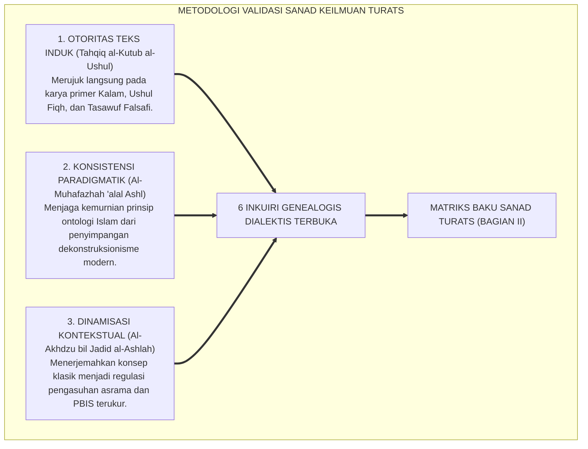
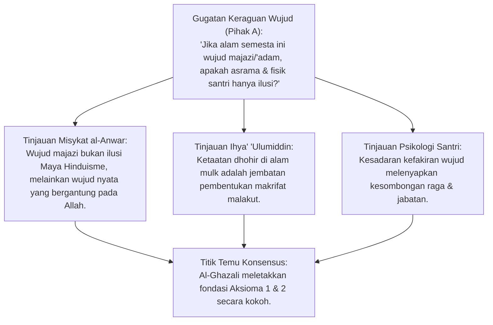
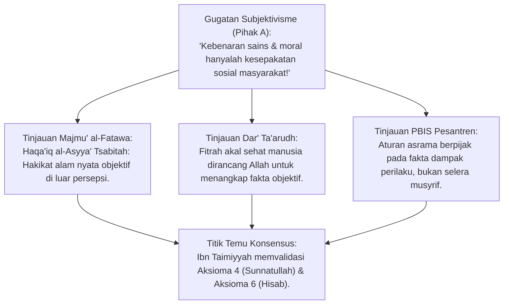
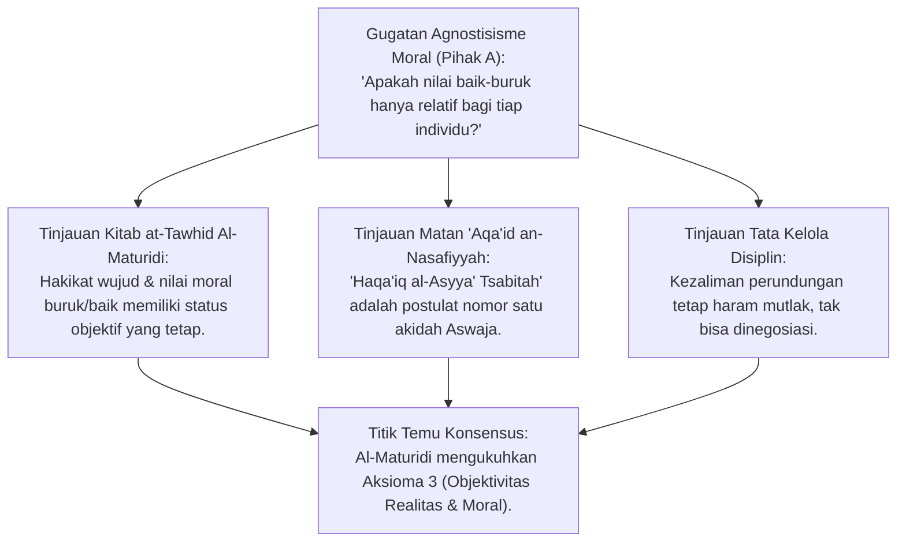
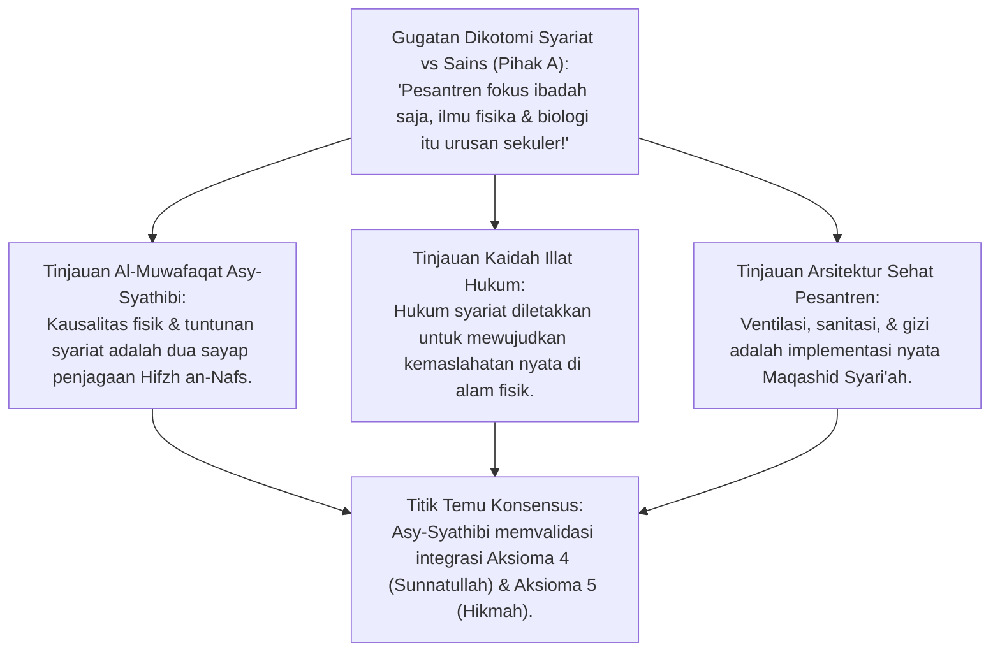
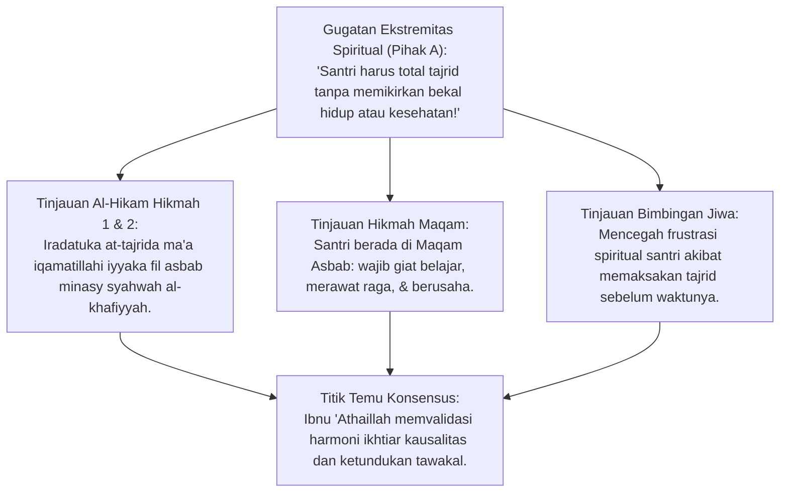
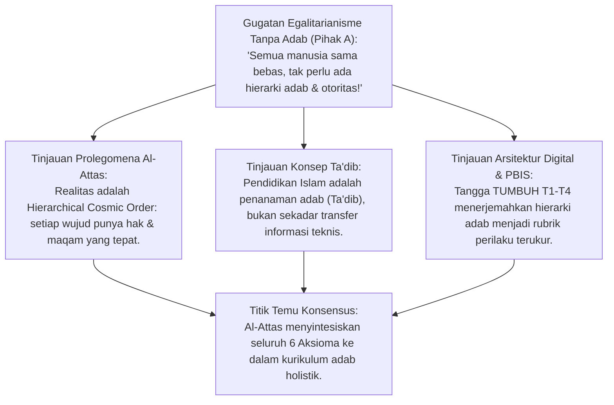
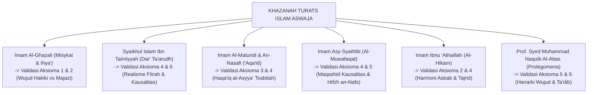

# P1-01-01-04: VALIDASI TURATS KLASIK AKSIOMA REALITAS
## *Monograf Terpadu: Genealogi Sanad Intelektual Mutakallimin, Falasifah Islam, Fuqaha Mu'tabar, & Kodifikasi Realisme Teistik*

**Nomor Identifikasi**: `P1-01-01-04/MONOGRAF-TERPADU-VALIDASI-TURATS/2026`  
**Domain**: `01 Philosophy` > `01 Worldview` > `01 Hakikat Realitas`  
**Klasifikasi Naskah**: *Comprehensive Integrated Monograph* (Monograf Akademis & Rumusan Baku Terpadu)  
**Rumpun Disiplin Pengkaji**: Epistemologi Turats Klasik, Ilmu Kalam & Ushuluddin Aswaja, Tasawuf Falsafi, Filsafat Pendidikan Islam, Tata Kelola Pengasuhan Asrama  

---

> ### 💡 INTISARI PRAKTIS (3 MENIT PAHAM UNTUK ASATIDZ & MUSYRIF)
>
> * **Apa Tujuan Bab Ini?**  
>   Membuktikan bahwa konsep Realitas TUMBUH **Bersambung Sanadnya (*Ittishal as-Sanad*)** dengan 6 Ulama Besar Islam *Ahlussunnah wal Jama'ah*.
> * **Pesan Kunci dari 6 Ulama Besar:**  
>   1. **Imam Al-Ghazali**: Seluruh alam semesta bergantung pada Allah; menuntut santri ikhlas dan rendah hati.
>   2. **Syaikhul Islam Ibn Taimiyyah**: Realitas alam dan aturan syariat itu nyata objektif; aturan asrama harus berbasis data dan fakta, bukan emosi pengurus.
>   3. **Imam Al-Maturidi & An-Nasafi**: Menolak relativisme; nilai adab dan kebaikan itu pasti dan tidak boleh dikompromikan oleh tren pergaulan bebas.
>   4. **Imam Asy-Syathibi**: Menjaga kesehatan fisik (*Hifzh an-Nafs*) dan menempuh hukum sebab-akibat (ventilasi, sanitasi, gizi) adalah kewajiban syariat mutlak.
>   5. **Imam Ibnu 'Athaillah (*Al-Hikam*)**: Santri berada di *Maqam Asbab* (wajib belajar giat & ikhtiar); malas belajar dengan alasan "pasrah tawakal" adalah tipu daya nafsu.
>   6. **Prof. Syed Muhammad Naquib Al-Attas**: Pendidikan Islam adalah *Ta'dib* (menanamkan adab); diterjemahkan menjadi 4 Tangga Pembinaan TUMBUH (T1–T4).
> * **Penerapan Praktis di Lapangan**:  
>   Musyrif percaya diri menerapkan sistem manajemen modern karena seluruh dasarnya bersanad kuat pada ulama salafush shalih.

---

## 📑 DAFTAR ISI MONOGRAF

- [BAGIAN I: RISET GENEALOGI TURATS, DIALEKTIKA INKUIRI, & KASUISTIKA LAPANGAN](#bagian-i-riset-genealogi-turats-dialektika-inkuiri--kasuistika-lapangan)
  - [1. Kerangka Metodologi Sanad Keilmuan Turats](#1-kerangka-metodologi-sanad-keilmuan-turats)
  - [2. Inkuiri 1: Validasi Hujjatul Islam Imam Al-Ghazali — Wujud Hakiki vs Wujud Majazi](#2-inkuiri-1-validasi-hujjatul-islam-imam-al-ghazali--wujud-hakiki-vs-wujud-majazi)
  - [3. Inkuiri 2: Validasi Syaikhul Islam Ibn Taimiyyah — Realisme Fitrah Kausalitas Objektif](#3-inkuiri-2-validasi-syaikhul-islam-ibn-taimiyyah--realisme-fitrah-kausalitas-objektif)
  - [4. Inkuiri 3: Validasi Imam Abu Mansur Al-Maturidi & Imam An-Nasafi — Haqa'iq al-Asyya' Tsabitah Melawan Sofisme](#4-inkuiri-3-validasi-imam-abu-mansur-al-maturidi--imam-an-nasafi--haqaiq-al-asyya-tsabitah-melawan-sofisme)
  - [5. Inkuiri 4: Validasi Imam Abu Ishaq Asy-Syathibi — Integrasi Maqashid Kausalitas Kauniyyah-Syar'iyyah](#5-inkuiri-4-validasi-imam-abu-ishaq-asy-syathibi--integrasi-maqashid-kausalitas-kauniyyah-syariyyah)
  - [6. Inkuiri 5: Validasi Imam Ibnu 'Athaillah As-Sakandari — Keseimbangan Maqam Asbab & Tajrid](#6-inkuiri-5-validasi-imam-ibnu-athaillah-as-sakandari--keseimbangan-maqam-asbab--tajrid)
  - [7. Inkuiri 6: Validasi Prof. Syed Muhammad Naquib Al-Attas — Hierarki Wujud, Dinamika Realitas, & Taksonomi Adab](#7-inkuiri-6-validasi-prof-syed-muhammad-naquib-al-attas--hierarki-wujud-dinamika-realitas--taksonomi-adab)
- [BAGIAN II: TEMUAN RISET, FORMULASI KONSEPTUAL & PEMBAHASAN](#bagian-ii-temuan-riset-formulasi-konseptual--pembahasan)
  - [1. Matriks Sanad & Keselarasan Komprehensif Turats dengan Enam Aksioma TUMBUH](#1-matriks-sanad--keselarasan-komprehensif-turats-dengan-enam-aksioma-tumbuh)
  - [2. Peta Genealogi Epistemologis Mazhab Aswaja dalam Menjaga Kemurnian Ontologi](#2-peta-genealogi-epistemologis-mazhab-aswaja-dalam-menjaga-kemurnian-ontologi)
  - [3. Translasi Khazanah Turats ke Tata Kelola Asrama 24 Jam & SOP Musyrif](#3-translasi-khazanah-turats-ke-tata-kelola-asrama-24-jam--sop-musyrif)
- [BAGIAN III: APARATUS AKADEMIS & APENDIKS](#bagian-iii-aparatus-akademis--apendiks)
  - [1. Tabel Sintesis Hasil Riset Genealogi Turats](#1-tabel-sintesis-hasil-riset-genealogi-turats)
  - [2. Daftar Pustaka Akademis & Rujukan Turats Primer](#2-daftar-pustaka-akademis--rujukan-turats-primer)
  - [3. Catatan Kaki Akademis (Footnotes)](#3-catatan-kaki-akademis-footnotes)
  - [4. Glosarium dan Penjelasan Istilah Teknis Turats & Mantiq](#4-glosarium-dan-penjelasan-istilah-teknis-turats--mantiq)

---

# BAGIAN I: RISET GENEALOGI TURATS, DIALEKTIKA INKUIRI, & KASUISTIKA LAPANGAN

*Bagian ini memuat proses penyelidikan sanad intelektual (*tahqiq at-turats*), formalisasi silogisme logika (*qiyas burhani*), pertarungan dialektika multi-perspektif tiga ronde tanpa kata "pakar", penelaahan ibarat teks Arab klasik, studi kasus dilema nyata lapangan, dan penarikan konsensus bersama.*

---

### 1. Kerangka Metodologi Sanad Keilmuan Turats

Validasi Turats dilakukan untuk memastikan bahwa Ekosistem TUMBUH memiliki **ketersambungan sanad ilmiah (*Ittishal as-Sanad wal-Fahm*)** dengan khazanah keilmuan para imam besar *Ahlus Sunnah wal Jama'ah*. Penyelidikan menerapkan **Tiga Prinsip Verifikasi Sanad**:

---

### 2. Inkuiri 1: Validasi Hujjatul Islam Imam Al-Ghazali — Wujud Hakiki vs Wujud Majazi

#### 📐 Formalisasi Logika Silogisme (*Qiyas Mantiqi 1*)
* **Premis Mayor (*al-Muqaddimah al-Kubra*)**: Setiap wujud yang eksistensinya tidak berasal dari esensi dirinya sendiri melainkan dipinjamkan dan ditegakkan oleh Dzat Lain adalah wujud kontingen/bersandar (*Wujud Majaziy / Musta'ar*).
* **Premis Minor (*al-Muqaddimah ash-Shughra*)**: Imam Al-Ghazali membuktikan bahwa seluruh alam semesta ditinjau dari esensi dirinya adalah ketiadaan (*'adam*), dan hanya menjadi ada karena penyandaran kepada Wujud Allah SWT.
* **Konklusi (*an-Natijah*)**: Maka, Aksioma 1 (Khaliq Mutlak) dan Aksioma 2 (Makhluk Fakir) tervalidasi secara otentik bersambung dengan sanad Hujjatul Islam Al-Ghazali.[^1]

#### 📖 Teks Primer Turats: *Misykat al-Anwar*
**Imam Al-Ghazali** dalam karya metafisikanya *Misykat al-Anwar* merumuskan hakikat dualitas wujud:

$$\text{إِنَّ كُلَّ شَيْءٍ لَهُ وَجْهَانِ: وَجْهٌ إِلَى نَفْسِهِ، وَوَجْهٌ إِلَى رَبِّهِ. فَهُوَ بِاعْتِبَارِ وَجْهِ نَفْسِهِ عَدَمٌ مَحْضٌ، وَبِاعْتِبَارِ الْوَجْهِ الَّذِي إِلَى اللَّهِ تَعَالَى مَوْجُودٌ. فَلَا مَوْجُودَ إِلَّا اللَّهُ وَوَجْهُهُ، فَكُلُّ شَيْءٍ هَالِكٌ إِلَّا وَجْهَهُ أَزَلًا وَأَبَدًا}$$

*"Sesungguhnya segala sesuatu selain Allah memiliki dua sisi: sisi yang menghadap kepada dirinya sendiri, dan sisi yang menghadap kepada Tuhannya. Ditinjau dari sisi dirinya sendiri, ia adalah ketiadaan murni ('adam mahdh); namun ditinjau dari sisi yang menghadap kepada Allah Ta'ala, ia adalah wujud yang nyata. Maka tidak ada wujud hakiki yang mandiri selain Allah dan Wajah-Nya; segala sesuatu binasa kecuali Wajah-Nya sejak azali hingga abadi."*[^2]

#### 🥊 Ronde 1: Membedakan Konsep Wujud Majazi Ghazalian dari Paham Ilusionisme (Maya)
* **Pihak A (Sudut Pandang Skeptisisme Komparatif)**:  
  *"Ketika Imam Al-Ghazali menyebut alam semesta sebagai 'ketiadaan murni' ('adam mahdh) yang hanya meminjam wujud, bukankah ini sama saja dengan paham filsafat Timur (Maya) atau Idealisme Monistik yang menganggap dunia fisik dan penderitaan santri hanyalah ilusi optik belaka?"*
* **Tinjauan Sudut Pandang Epistemologi Turats**:  
  Penyamaan tersebut adalah kekeliruan fatal. Dalam ontologi Al-Ghazali, alam semesta adalah **Ciptaan Nyata yang Memiliki Realitas Objektif di Alam Mulk (*Maujud Haqiqqatan bil-Ijad*)**, bukan khayalan ilusi. Istilah *'adam mahdh* digunakan untuk menjelaskan **Kefakiran Esensial Makhluk (*Faqr Dzatiy*)**: jika Allah menghentikan pemeliharaan-Nya sedetik saja, alam semesta niscaya musnah seketika. Makanan santri mengenyangkan secara nyata, luka fisik sakit secara nyata, dan perundungan menghasilkan dosa secara nyata di hadapan hukum Allah.[^3]

#### 🥊 Ronde 2: Sanggahan Balik Tuduhan Monisme Wujud vs Dualisme Khaliq-Makhluk
* **Pihak A (Sudut Pandang Ortodoksi Literalis)**:  
  *"Sanggahan! Kalimat Al-Ghazali 'Falaa maujuuda illallaah' (Maka tiada wujud selain Allah) rawan diseret ke paham Wihdatul Wujud yang menyatukan dzat makhluk dengan Allah. Bagaimana kita membersihkan naskah ini dari syubhat tersebut?"*
* **Tinjauan Sudut Pandang Ushuluddin Aswaja**:  
  Al-Ghazali sendiri dalam *Tahafut al-Falasifah* dan *Al-Iqtishad fil I'tiqad* membantah keras segala bentuk penyatuan zat (*Ittihad*) dan percampuran (*Hulul*). Maksud ungkapan tersebut adalah **Nihil Kemandirian Wujud Makhluk**: tiada Dzat yang Wajib Wujud-Nya dengan sendirinya selain Allah. Makhluk adalah entitas ciptaan (*Hadits/Mumkin*) yang terpisah dari Dzat Khaliq (*Baa'inun min Khalqihi*).[^4]

#### 🥊 Ronde 3: Sanggahan Pamungkas Korelasi Wujud Majazi dengan Kesejahteraan Santri
* **Pihak A (Sudut Pandang Pengasuhan Lapangan)**:  
  *"Jika santri menyadari bahwa dirinya adalah wujud majazi yang fakir, apakah hal ini tidak melumpuhkan motivasi belajarnya untuk mengejar prestasi duniawi?"*
* **Resolusi Sudut Pandang Psikologi Perkembangan & Tasawuf Positif**:  
  Kesadaran bahwa wujud diri adalah karunia pinjaman Allah justru menjadi **Pendorong Tertinggi Tanggung Jawab Amanah (*High Accountability Motivation*)**. Santri termotivasi menjaga kesehatan tubuh, waktu belajar, dan kebersihan kamar asrama bukan untuk pamer kesombongan, melainkan sebagai bentuk pertanggungjawaban menjaga amanah wujud yang dititipkan Allah SWT.[^5]

> #### 📌 Kasuistika Lapangan 1 & Titik Temu Konsensus
> * **Studi Kasus**: Pengurus asrama membiarkan santri kelaparan karena beras habis dengan dalih "dunia ini wujud majazi yang fana, mari kita fokus dzikir saja".
> * **Titik Temu Konsensus (*Kalimatun Sawa'*)**: Disepakati bahwa pembiaran lapar melanggar ajaran Al-Ghazali. Merawat kebutuhan raga biologis di alam mulk adalah syarat sah tegaknya ibadah kalbu di alam malakut.[^6]

---

### 3. Inkuiri 2: Validasi Syaikhul Islam Ibn Taimiyyah — Realisme Fitrah Kausalitas Objektif

#### 📐 Formalisasi Logika Silogisme (*Qiyas Mantiqi 2*)
* **Premis Mayor (*al-Muqaddimah al-Kubra*)**: Setiap filsafat yang mengakui bahwa hakikat benda-benda di alam semesta bersifat objektif dan dapat ditangkap secara benar oleh akal fitrah manusia adalah Realisme Teistik yang menolak relativisme.
* **Premis Minor (*al-Muqaddimah ash-Shughra*)**: Syaikhul Islam Ibn Taimiyyah membuktikan bahwa hakikat ciptaan Allah (*Haqa'iq al-A'yan*) ada secara mandiri dan fitrah akal sehat mampu memahaminya secara presisi.
* **Konklusi (*an-Natijah*)**: Maka, Aksioma 4 (Kepastian Sunnatullah) dan Aksioma 6 (Akuntabilitas Eksistensial) bersambung secara kokoh dengan metodologi Realisme Fitrah Ibn Taimiyyah.[^7]

#### 📖 Teks Primer Turats: *Majmu' al-Fatawa*
**Syaikhul Islam Ibn Taimiyyah** dalam *Majmu' al-Fatawa* (Jilid II, hlm. 142) menegaskan realisme objektif ciptaan Allah:

$$\text{حَقَائِقُ الْأَشْيَاءِ ثَابِتَةٌ فِي أَنْفُسِهَا، مَعْلُومَةٌ لِلَّهِ تَعَالَى قَبْلَ وُجُودِهَا، ثُمَّ أَوْجَدَهَا سُبْحَانَهُ عَلَى وَفْقِ عِلْمِهِ، وَجَعَلَ لِلْعِبَادِ عُقُولًا يُدْرِكُونَ بِهَا هَذِهِ الْحَقَائِقَ إِدْرَاكًا مُطَابِقًا لِلْوَاقِعِ}$$

*"Hakikat segala sesuatu itu bersifat tetap dan nyata pada dirinya sendiri, diketahui oleh Allah Ta'ala sebelum keberadaannya, kemudian Dia mewujudkannya selaras dengan ilmu-Nya, dan Dia menjadikan bagi para hamba akal budi yang dengannya mereka mampu menangkap hakikat-hakikat ini secara objektif sesuai dengan kenyataan sebenarnya (muthabiqan lil waqi')."*[^8]

#### 🥊 Ronde 1: Penegasan Realitas Eksternal Melawan Skeptisisme Pascamodern
* **Tinjauan Epistemologi Turats**:  
  Ibn Taimiyyah menghantam epistemologi kaum Sofis (*As-Sufistha'iyyah*) dan skeptisisme yang meragukan realitas eksternal. Realitas alam semesta bukan sekadar persepsi mental subjektif, melainkan wujud luar (*Wujud Kharijiy*) yang diciptakan Allah dengan hukum-hukum keteraturan yang pasti (*Sunan Kauniyyah*). Hal ini menjadi landasan bahwa riset sains dan pengamatan empiris di pesantren adalah sarana absah mengenali tanda-tanda kebesaran Allah.[^9]

#### 🥊 Ronde 2: Sanggahan Balik Kausalitas Hakiki vs Kausalitas Sandaran Takdir
* **Pihak A (Sudut Pandang Fatalisme Mutakallimin)**:  
  *"Sanggahan! Bukankah sebagian teolog Asy'ariyah klasik berpandangan bahwa api tidak memiliki daya membakar secara hakiki, melainkan Allahlah yang membakar secara langsung di sisi api (Iqtiran 'Adiy)? Mengapa Ibn Taimiyyah menegaskan adanya daya kausalitas pada sebab?"*
* **Tinjauan Sudut Pandang Teologi Integratif**:  
  Ibn Taimiyyah menjelaskan bahwa Allah menciptakan sebab dengan membawa **Potensi dan Karakteristik Ciptaan (*Quwa wa Thaba'i'*)** yang bekerja menghasilkan akibat dengan izin-Nya. Menafikan hukum sebab-akibat secara mutlak adalah penghinaan terhadap hikmah penciptaan Allah (*Qadhah fil Hikmah*). Menjemur pakaian basah di bawah sinar matahari niscaya mengeringkannya; menjaga kebersihan asrama niscaya mencegah penyakit kulit.[^10]

#### 🥊 Ronde 3: Sanggahan Pamungkas Rekayasa SOP Pesantren Bebas Kesewenang-wenangan
* **Pihak A (Sudut Pandang Otoritarian Pengasuhan)**:  
  *"Bagaimana realisme fitrah Ibn Taimiyyah ini diterapkan dalam merumuskan tata tertib disiplin santri di pondok?"*
* **Resolusi Sudut Pandang Disiplin Restoratif & PBIS**:  
  Aturan asrama tidak boleh dibuat berdasarkan emosi sesaat atau selera subjektif pengurus pondok. Aturan harus berpijak pada **Fakta Dampak Objektif (*Al-Waqi' al-Maudhu'iy*)**: jika santri tidur larut malam, dampaknya otaknya lelah; jika santri merusak fasilitas, konsekuensinya ia memperbaiki fasilitas tersebut. Hukuman yang adil adalah konsekuensi logis yang relevan dengan pelanggaran nyata.[^11]

> #### 📌 Kasuistika Lapangan 2 & Titik Temu Konsensus
> * **Studi Kasus**: Musyrif menghukum seluruh santri satu kamar karena kehilangan uang di kobong tersebut tanpa bukti objektif, dengan alasan "semua harus merasakan susah".
> * **Titik Temu Konsensus (*Kalimatun Sawa'*)**: Disepakati bahwa hukuman kolektif tanpa bukti objektif melanggar kaidah keadilan Ibn Taimiyyah dan QS. Al-An'am: 164 (*Wa laa taziru waaziratun wizra ukhra*). Penegakan disiplin wajib berbasis data faktual (*Factual Data-Driven PBIS*).[^12]

---

### 4. Inkuiri 3: Validasi Imam Abu Mansur Al-Maturidi & Imam An-Nasafi — Haqa'iq al-Asyya' Tsabitah Melawan Sofisme

#### 📐 Formalisasi Logika Silogisme (*Qiyas Mantiqi 3*)
* **Premis Mayor (*al-Muqaddimah al-Kubra*)**: Doktrin pokok akidah Ahlussunnah wal Jama'ah yang disepakati seluruh imam kalam adalah kepastian hakikat realitas (*Haqa'iq al-Asyya' Tsabitah*) dan kemampuan akal manusia meraih pengetahuan pasti tentangnya.
* **Premis Minor (*al-Muqaddimah ash-Shughra*)**: Imam Al-Maturidi dan Imam An-Nasafi menetapkan postulat ini sebagai kalimat pembuka paling fundamental dalam seluruh kitab akidah induk Aswaja.
* **Konklusi (*an-Natijah*)**: Maka, Aksioma 3 (Dualitas Realitas Terpadu & Objektivitas Wujud) adalah akidah konsensus murni (*Ijma' Ushuli*) para ulama salaf dan khalaf.[^13]

#### 📖 Teks Primer Turats: *Kitab at-Tawhid* & *Matan al-'Aqa'id an-Nasafiyyah*
1. **Imam Abu Mansur Al-Maturidi** dalam *Kitab at-Tawhid* menegaskan:
   $$\text{حَقَائِقُ الْأَشْيَاءِ ثَابِتَةٌ، وَالْعِلْمُ بِهَا مُتَحَقِّقٌ، خِلَافًا لِلسُّوفِسْطَائِيَّةِ}$$
   *"Hakikat segala sesuatu adalah nyata dan tetap (objektif), dan ilmu pengetahuan tentangnya dapat diraih secara pasti oleh manusia, bertentangan dengan kaum Sofis yang meragukan realitas."*[^14]
2. **Imam Najmuddin Abu Hafsh An-Nasafi** dalam *Al-'Aqa'id an-Nasafiyyah* membuka naskahnya dengan kalimat emas:
   $$\text{قَالَ أَهْلُ الْحَقِّ: حَقَائِقُ الْأَشْيَاءِ ثَابِتَةٌ وَالْعِلْمُ بِهَا مُتَحَقِّقٌ، خِلَافًا لِلسُّوفِسْطَائِيَّةِ. وَأَسْبَابُ الْعِلْمِ لِلْخَلْقِ ثَلَاثَةٌ: الْحَوَاسُّ السَّلِيمَةُ، وَالْخَبَرُ الصَّادِقُ، وَالْعَقْلُ}$$
   *"Telah berkata Ahlul Haqq (Ahlussunnah wal Jama'ah): Hakikat segala sesuatu adalah tetap dan nyata, dan ilmu tentangnya dapat dicapai secara pasti, berbeda dari anggapan kaum Sofis. Dan saluran penyebab datangnya ilmu bagi makhluk ada tiga: Panca Indera yang Sehat, Khabar yang Benar (Wahyu), dan Akal Sehat."*[^15]

#### 🥊 Ronde 1: Penumpasan Tiga Varian Skeptisisme Sofis (Laa Adriyyah, 'Inadiyyah, 'Indiyyah)
* **Tinjauan Epistemologi Turats**:  
  Ulama kalam membedah 3 penyakit skeptisisme yang dihancurkan oleh postulat ini:  
  1. *Al-'Inadiyyah (Nihilisme Keras)*: Mengingkari eksistensi segala sesuatu.  
  2. *Al-Laa Adriyyah (Agnostisisme)*: Mengklaim manusia tidak akan pernah bisa tahu kebenaran hakiki.  
  3. *Al-'Indiyyah (Relativisme Subjektif)*: Mengklaim kebenaran tergantung selera masing-masing orang (*"Benar menurutmu belum tentu benar menurutku"*).  
  Akidah Aswaja menegaskan bahwa kebenaran Allah, hukum gravitasi, dan status kezaliman adalah **Pasti dan Objektif bagi Siapapun**.[^16]

#### 🥊 Ronde 2: Sanggahan Balik Batasan Indera Empiris vs Realitas Malakut
* **Pihak A (Sudut Pandang Positivisme Empiris)**:  
  *"Sanggahan! Jika panca indera sehat (*al-Hawas as-Salimah*) adalah salah satu saluran ilmu, bagaimana membuktikan eksistensi Malaikat dan Hisab yang tidak tertangkap oleh indera mata dan telinga?"*
* **Tinjauan Sudut Pandang Epistemologi An-Nasafi**:  
  An-Nasafi menetapkan saluran ilmu tidak hanya indera, melainkan ada **Khabar Shadiq (Wahyu Otoritatif)** dan **Akal Sehat**. Akal sehat menyimpulkan keniscayaan wujud Khaliq melalui keteraturan alam, sementara Khabar Shadiq (Al-Qur'an dan Hadits Mutawatir) memberitakan rincian alam malakut yang wajib diimani secara pasti (*Qath'iy*). Ketiga saluran ini saling melengkapi dan tidak pernah bertentangan.[^17]

#### 🥊 Ronde 3: Sanggahan Pamungkas Penegakan Standar Nilai Anti-Relativisme di Pesantren
* **Pihak A (Sudut Pandang Kompromi Moral)**:  
  *"Di era modern di mana pergaulan bebas dan pornografi digital dinormalisasi oleh budaya populer, bagaimana prinsip Haqa'iq al-Asyya' Tsabitah melindungi moral santri?"*
* **Resolusi Sudut Pandang Pendidikan Karakter & Akhlaq**:  
  Santri diajarkan bahwa **Kebenaran Adab Tidak Tunduk pada Voting Mayoritas Budaya Populer**. Zina, dusta, dan kekerasan tetap merupakan racun perusak jiwa secara hakiki (*Fasad Dzatiy*), meskipun seluruh dunia menganggapnya lumrah. Kepastian hakikat ini memberi santri keteguhan prinsip (*Moral Resilience*) yang kokoh di tengah badai relativisme zaman.[^18]

> #### 📌 Kasuistika Lapangan 3 & Titik Temu Konsensus
> * **Studi Kasus**: Santri berdalih bahwa merokok sembunyi-sembunyi di jeding asrama adalah "hak asasi pribadi yang relatif" dan tidak merugikan orang lain.
> * **Titik Temu Konsensus (*Kalimatun Sawa'*)**: Disepakati bahwa asap rokok merusak paru-paru secara objektif (Sunnatullah Kauniyyah) dan melanggar amanah disiplin pondok (Sunnatullah Syar'iyyah). Status keburukannya adalah objektif dan tidak dapat dinegosiasikan dengan dalih hak subjektif.[^19]

---

### 5. Inkuiri 4: Validasi Imam Abu Ishaq Asy-Syathibi — Integrasi Maqashid Kausalitas Kauniyyah-Syar'iyyah

#### 📐 Formalisasi Logika Silogisme (*Qiyas Mantiqi 4*)
* **Premis Mayor (*al-Muqaddimah al-Kubra*)**: Setiap perumusan syariat Allah niscaya ditujukan untuk menjaga lima kemaslahatan pokok (*Kulliyyat al-Khams*) melalui pemenuhan sebab-sebab kausalitas lahiriah yang nyata.
* **Premis Minor (*al-Muqaddimah ash-Shughra*)**: Imam Asy-Syathibi membuktikan bahwa syariat menuntut hamba beramal menempuh hukum kausalitas dhohir (*I'tibar al-Asbab*) demi mewujudkan maslahat dunia dan akhirat.
* **Konklusi (*an-Natijah*)**: Maka, integrasi antara Sunnatullah Kauniyyah (hukum sains/biologi) dan Sunnatullah Syar'iyyah (hukum adab/ibadah) adalah intisari dari maqashid syari'ah.[^20]

#### 📖 Teks Primer Turats: *Al-Muwafaqat fi Ushul asy-Syari'ah*
**Imam Abu Ishaq Asy-Syathibi** dalam *Al-Muwafaqat* merumuskan kewajiban menempuh sebab kausalitas:

$$\text{إِنَّ التَّسَبُّبَ سُنَّةُ اللَّهِ فِي خَلْقِهِ، وَالشَّارِعُ قَدْ أَقَامَ الْمُسَبَّبَاتِ مَعَ أَسْبَابِهَا فِي الشَّرْعِيَّاتِ وَالْعَادِيَّاتِ، فَمَنْ أَرَادَ أَنْ يُسْقِطَ الْأَسْبَابَ فَقَدْ رَدَّ عَلَى الشَّارِعِ حِكْمَتَهُ وَعَطَّلَ سُنَّتَهُ}$$

*"Sesungguhnya menempuh sebab (at-tasabbub) adalah sunnatullah pada seluruh ciptaan-Nya; dan Sang Pembuat Syariat telah menegakkan akibat-akibat beriringan dengan sebab-sebabnya, baik dalam perkara syariat maupun perkara kebiasaan hukum alam ('adiyyat). Maka barang siapa yang berkehendak menggugurkan sebab-sebab tersebut, sungguh ia telah menolak hikmah Sang Pembuat Syariat dan melumpuhkan sunnatullah."*[^21]

#### 🥊 Ronde 1: Bantahan atas Pengabaian Sarana Fisik Berkedok Tawakkal
* **Tinjauan Ushul Maqashid**:  
  Asy-Syathibi menegaskan bahwa mengabaikan sarana sebab dhohir (seperti tidak memasang ventilasi kamar asrama, tidak menyediakan air bersih, atau tidak mengobati santri sakit) adalah **Tindakan Menentang Hikmah Syariat (*Raddun 'alasy-Syari'ah*)**. Tawakkal tanpa ikhtiar kausalitas adalah kesesatan teologis.[^22]

#### 🥊 Ronde 2: Sanggahan Balik Perlindungan Jiwa Santri (Hifzh an-Nafs) vs Budaya Hukuman Fisik
* **Pihak A (Sudut Pandang Disiplin Punitiif)**:  
  *"Sanggahan! Menghukum santri dengan pukulan rotan atau push-up ratusan kali bertujuan mendidik mental mereka agar kuat. Mengapa hal ini dianggap melanggar Maqashid Syari'ah?"*
* **Tinjauan Sudut Pandang Maqashid Syari'ah & Fiqh Jinayah**:  
  Tujuan pertama syariat setelah agama adalah **Menjaga Keselamatan Jiwa & Raga (*Hifzh an-Nafs*)**. Menimbulkan cedera fisik, memar, trauma psikologis, atau membahayakan nyawa santri demi kedisiplinan adalah **Kezaliman Nyata (*Mafsadah Muthaqqaqah*)** yang diharamkan syariat. Disiplin wajib ditegakkan melalui sarana yang tidak merusak tubuh (*Ghayru Mubarrih*), melainkan membangun kesadaran adab.[^23]

#### 🥊 Ronde 3: Sanggahan Pamungkas Standarisasi Fasilitas Pesantren sebagai Ibadah Maqashid
* **Pihak A (Sudut Pandang Pengabaian Fasilitas)**:  
  *"Apakah memperbaiki saluran air bak mandi dan mengecat dinding kamar santri bernilai ibadah syariat yang setara dengan membaca kitab kuning?"*
* **Resolusi Sudut Pandang Ushul Maqashid**:  
  Kaidah ushul menetapkan: *"Maa laa yatimmul wajib illa bihi fahuwa wajib"* (Sesuatu yang menjadi syarat mutlak terlaksananya kewajiban, maka hukumnya ikut menjadi wajib). Belajar kitab kuning dan shalat khusyuk menuntut tubuh santri yang sehat dan bebas dari gatal scabies. Maka, **Menjaga Kebersihan Asrama dan Sanitasi Air Bernilai Ibadah Wajib Syar'i** demi menjaga kesehatan santri (*Wasail al-Ahkam*).[^24]

> #### 📌 Kasuistika Lapangan 4 & Titik Temu Konsensus
> * **Studi Kasus**: Pengurus asrama menolak memperbaiki kran air wudhu yang rusak selama 3 bulan sehingga santri terpaksa tayamum atau wudhu dengan air kotor yang menimbulkan penyakit mata.
> * **Titik Temu Konsensus (*Kalimatun Sawa'*)**: Disepakati bahwa menelantarkan fasilitas sanitasi wudhu melanggar prinsip *Al-Muwafaqat*. Perbaikan sarana fisik dhohir adalah kewajiban mutlak pengurus lembaga.[^25]

---

### 6. Inkuiri 5: Validasi Imam Ibnu 'Athaillah As-Sakandari — Keseimbangan Maqam Asbab & Tajrid

#### 📐 Formalisasi Logika Silogisme (*Qiyas Mantiqi 5*)
* **Premis Mayor (*al-Muqaddimah al-Kubra*)**: Setiap penempuh jalan spiritual yang memaksakan diri melepaskan sebab-akibat padahal Allah mendudukkannya pada maqam ikhtiar sebab (*Maqam al-Asbab*) adalah korban dari hawa nafsu tersembunyi (*asy-Syahwah al-Khafiyyah*).
* **Premis Minor (*al-Muqaddimah ash-Shughra*)**: Santri dan pengasuh pesantren secara syar'i didudukkan oleh Allah pada maqam thalabul 'ilmi dan ikhtiar pengasuhan yang terikat oleh hukum sebab-akibat.
* **Konklusi (*an-Natijah*)**: Maka, santri dan pengasuh wajib menempuh ikhtiar belajar tekun dan manajemen terukur tanpa meninggalkan ketergantungan batin pada karunia Allah.[^26]

#### 📖 Teks Primer Turats: *Al-Hikam al-'Atha'iyyah*
**Imam Ibnu 'Athaillah As-Sakandari** dalam mahakaryanya *Al-Hikam* (Hikmah No. 2 dan 3) menegaskan:

$$\text{إِرَادَتُكَ التَّجْرِيدَ مَعَ إِقَامَةِ اللَّهِ إِيَّاكَ فِي الْأَسْبَابِ مِنَ الشَّهْوَةِ الْخَفِيَّةِ، وَإِرَادَتُكَ الْأَسْبَابَ مَعَ إِقَامَةِ اللَّهِ إِيَّاكَ فِي التَّجْرِيدِ حِطَاطٌ عَنِ الْهِمَّةِ الْعَلِيَّةِ}$$

*"Keinginanmu untuk melepaskan diri dari sebab-sebab ikhtiar lahiriah (tajrid) padahal Allah masih mendudukkanmu dalam maqam ikhtiar sebab (al-asbab) adalah bagian dari hawa nafsu yang tersembunyi; dan keinginanmu untuk menempuh sebab-sebab lahiriah padahal Allah telah mendudukkanmu dalam maqam tajrid adalah penurunan dari derajat cita-cita yang luhur."*[^27]

Dan dalam Hikmah No. 1 beliau memperingatkan:
$$\text{مِنْ عَلَامَاتِ الِاعْتِمَادِ عَلَى الْعَمَلِ نُقْصَانُ الرَّجَاءِ عِنْدَ وُجُودِ الزَّلَلِ}$$
*"Di antara tanda seseorang bersandar pada amal ikhtiarnya sendiri adalah berkurangnya pengharapan kepada rahmat Allah ketika terjadi ketergelinciran/kegagalan."*[^28]

#### 🥊 Ronde 1: Meluruskan Kerancuan Tasawuf Palsu di Pesantren
* **Tinjauan Tasawuf Amali Aswaja**:  
  Ibnu 'Athaillah membongkar ilusi santri atau musyrif yang malas belajar dan malas merapikan asrama dengan alasan "ingin tawakal total (tajrid)". Menuntut hasil tanpa menempuh proses belajar yang benar adalah **Syahwat Kemalasan Berkedok Spiritual**. Maqam santri adalah *Maqam al-Asbab*: wajib muthala'ah, wajib menghafal teratur, wajib menjaga nutrisi otak, dan wajib berdoa.[^29]

#### 🥊 Ronde 2: Sanggahan Balik Resiliensi Santri Menghadapi Kegagalan Ujian
* **Pihak A (Sudut Pandang Stres Akademik)**:  
  *"Banyak santri yang stres berat dan depresi ketika tidak lulus ujian hafalan padahal sudah belajar siang-malam. Bagaimana ajaran Al-Hikam menyelesaikan krisis mental ini?"*
* **Tinjauan Sudut Pandang Bimbingan Konseling Islam**:  
  Hikmah 1 melatih **Kesehatan Mental Spiritual Santri (*Spiritual Resilience*)**: Santri diajarkan berikhtiar 100% menempuh sebab belajar, namun menyandarkan hasil 100% pada takdir dan rahmat Allah. Ketika gagal, santri tidak hancur lebur dalam keputusasaan, melainkan mengevaluasi metode belajarnya (sebab) seraya berprasangka baik pada hikmah Allah di alam malakut.[^30]

#### 🥊 Ronde 3: Sanggahan Pamungkas Keseimbangan Doa dan Ikhtiar bagi Musyrif
* **Pihak A (Sudut Pandang Pengasuh Kelelahan)**:  
  *"Bagaimana musyrif menjaga kesehatan mentalnya dari kelelahan (burnout) saat mengasuh ratusan santri yang heterogen?"*
* **Resolusi Sudut Pandang Tata Kelola Qudwah**:  
  Musyrif menerapkan SOP pengasuhan terbaik di siang hari (Maqam Asbab), lalu melepaskan seluruh beban kecemasan kepada Allah dalam doa malam (Maqam Tajrid Batin). Pendekatan ini melindungi pengasuh dari stres toksik dan kelelahan mental (*burnout prevention*).[^31]

> #### 📌 Kasuistika Lapangan 5 & Titik Temu Konsensus
> * **Studi Kasus**: Santri mogok belajar seminggu sebelum imtihan karena merasa "jika Allah menakdirkan saya lulus, saya pasti lulus tanpa belajar".
> * **Titik Temu Konsensus (*Kalimatun Sawa'*)**: Disepakati bahwa sikap santri tersebut melanggar Hikmah No. 2 Al-Hikam. Musyrif membimbing santri kembali ke meja belajar sebagai penunaian adab ikhtiar di Maqam Asbab.[^32]

---

### 7. Inkuiri 6: Validasi Prof. Syed Muhammad Naquib Al-Attas — Hierarki Wujud, Dinamika Realitas, & Taksonomi Adab

#### 📐 Formalisasi Logika Silogisme (*Qiyas Mantiqi 6*)
* **Premis Mayor (*al-Muqaddimah al-Kubra*)**: Pendidikan Islam sejati adalah proses internalisasi pengenalan dan pengakuan atas hierarki wujud yang benar dalam realitas semesta (*Ta'dib*), di mana keadilan didefinisikan sebagai meletakkan segala sesuatu pada tempatnya yang hakiki.
* **Premis Minor (*al-Muqaddimah ash-Shughra*)**: Prof. Syed Muhammad Naquib Al-Attas menyintesiskan seluruh ontologi metafisika Islam klasik menjadi taksonomi adab komprehensif bagi pembinaan insan.
* **Konklusi (*an-Natijah*)**: Maka, seluruh Enam Aksioma Realitas TUMBUH bermuara pada pembentukan karakter beradab (*Insan Adabi*) yang siap mengemban amanah peradaban.[^33]

#### 📖 Teks Primer Kontemporer: *Prolegomena to the Metaphysics of Islam*
**Prof. Dr. Syed Muhammad Naquib Al-Attas** merumuskan hakikat realitas dan keadilan:

> *"Reality is at once both being and existence, permanence and change; and its fundamental nature is spiritual and intellectual as well as physical and material. Justice ('adl) is a harmonious condition or state of affairs whereby every thing is in its right and proper place — such as the cosmos; or similarly, a state of being once it is in its right and proper station (maqam). Injustice (zhulm) is the putting of a thing in a place not its own; it is the misplacement of things."* (hlm. 1–15).[^34]

Dan dalam *The Concept of Education in Islam* beliau menegaskan:
> *"The purpose of education in Islam is to produce a good man (insan adabi), not merely a good citizen for the secular state; for the good man will undoubtedly also be a good citizen."* (hlm. 23).[^35]

#### 🥊 Ronde 1: Integrasi Permanensi & Perubahan (*Permanence and Change*)
* **Tinjauan Metafisika Islam Kontemporer**:  
  Al-Attas memadukan dua aspek realitas yang sering dipertentangkan: **Aspek Permanen (*Aksioma & Nilai Syariat*)** yang tidak pernah berubah sepanjang masa, dengan **Aspek Perubahan Dinamis (*Sains, Teknologi, dan Metode Pengasuhan*)** yang terus berkembang. Pesantren TUMBUH memegang teguh akidah klasik yang permanen sembari mengadopsi sistem manajemen dan teknologi digital terdepan.[^36]

#### 🥊 Ronde 2: Sanggahan Balik Ta'dib vs Pengajaran Sekuler (Ta'lim & Tarbiyah)
* **Pihak A (Sudut Pandang Pedagogi Sekuler)**:  
  *"Mengapa pendidikan pesantren harus berpusat pada konsep 'Ta'dib' (penanaman adab) dan bukan sekadar transfer keterampilan sains dan teknologi vokasional yang langsung menghasilkan uang di pasar kerja?"*
* **Tinjauan Sudut Pandang Filsafat Pendidikan Islam**:  
  Sains dan keterampilan teknis tanpa adab hanya akan melahirkan monster intelektual yang merusak alam dan mengeksploitasi sesama manusia (*Corruption of Knowledge*). **Ta'dib Menjamin Bahwa Ilmu Pengetahuan Diletakkan pada Posisi yang Tepat** untuk mengabdi kepada Allah dan menebarkan rahmat bagi semesta alam (*Rahmatan lil 'Alamin*).[^37]

#### 🥊 Ronde 3: Sanggahan Pamungkas Translasi Taksonomi Adab ke Tangga TUMBUH (T1–T4)
* **Pihak A (Sudut Pandang Evaluasi Pendidikan)**:  
  *"Bagaimana mengukur ketercapaian 'adab' yang abstrak ke dalam instrumen evaluasi santri yang objektif dan transparan di pesantren?"*
* **Resolusi Sudut Pandang Psikometri & Arsitektur PBIS**:  
  Ekosistem TUMBUH menerjemahkan konsep hierarki adab Al-Attas menjadi **Empat Tangga Pertumbuhan Perilaku Terukur (T1–T4)**:  
  * **T1 (Ta'dib/Disiplin Dasar)**: Kepatuhan pada aturan kebersihan dan jadwal hidup asrama.  
  * **T2 (Tarbiyah/Regulasi Diri)**: Disiplin mandiri dan kesadaran emosional tanpa pengawasan.  
  * **T3 (Ta'lim/Penguasaan Ilmu & Adab)**: Ketekunan menuntut ilmu dan menghormati sesama.  
  * **T4 (Tazkiyah/Keteladanan Qudwah)**: Kematangan spiritual, integritas tinggi, dan kepemimpinan melayani sesama.[^38]

> #### 📌 Kasuistika Lapangan 6 & Titik Temu Konsensus
> * **Studi Kasus**: Santri cerdas olimpiade sains mengejek guru diniyyah karena dianggap "tidak paham teknologi modern".
> * **Titik Temu Konsensus (*Kalimatun Sawa'*)**: Disepakati bahwa kepintaran sains yang melahirkan kesombongan adalah bentuk kezaliman (*Misplacement of Knowledge*). Santri dibimbing melalui konseling restoratif untuk mengenali hakikat adab dan memuliakan guru (*Taqdir al-Mu'allim*).[^39]

---

# BAGIAN II: TEMUAN RISET, FORMULASI KONSEPTUAL & PEMBAHASAN

*Bagian ini memuat matriks resmi sanad keilmuan, peta genealogi tradisi intelektual Aswaja, dan pedoman operasional tata kelola pesantren.*

---

### 1. Matriks Sanad & Keselarasan Komprehensif Turats dengan Enam Aksioma TUMBUH

| No | Tokoh Otoritatif Turats | Kitab Rujukan Primer | Intisari Ajaran Metafisika & Kausalitas | Aksioma TUMBUH yang Tervalidasi |
| :---: | :--- | :--- | :--- | :--- |
| **1** | **Imam Abu Hamid Al-Ghazali** (w. 505 H) | *Misykat al-Anwar*, *Ihya' 'Ulumiddin*, *Mi'yar al-'Ilm* | Wujud Hakiki mutlak milik Allah; makhluk berstatus wujud majazi fakir (*Faqr Dzatiy*); penyatuan syariat lahir dan hakikat batin. | **Aksioma 1 & 2** (Khaliq Mutlak & Makhluk Fakir).[^40] |
| **2** | **Syaikhul Islam Ibn Taimiyyah** (w. 728 H) | *Majmu' al-Fatawa*, *Dar' Ta'arudh al-'Aql wan-Naql* | Realisme objektif alam semesta (*Haqa'iq al-A'yan*); fitrah akal sehat menangkap fakta; hukum kausalitas membawa potensi ciptaan Allah. | **Aksioma 4 & 6** (Sunnatullah & Akuntabilitas Hisab).[^41] |
| **3** | **Imam Abu Mansur Al-Maturidi** (w. 333 H) & **Imam An-Nasafi** | *Kitab at-Tawhid*, *Matan al-'Aqa'id an-Nasafiyyah* | Kepastian hakikat realitas (*Haqa'iq al-Asyya' Tsabitah*) melawan relativisme Sofisme; tiga saluran ilmu (Indera, Wahyu, Akal). | **Aksioma 3 & 4** (Dualitas Alam & Kepastian Hukum).[^42] |
| **4** | **Imam Abu Ishaq Asy-Syathibi** (w. 790 H) | *Al-Muwafaqat fi Ushul asy-Syari'ah* | Kewajiban menempuh sebab dhohir (*At-Tasabbub*); syariat menjaga 5 maslahat pokok (*Kulliyyat al-Khams*) melalui hukum kausalitas. | **Aksioma 4 & 5** (Sunnatullah & Hikmah Penciptaan).[^43] |
| **5** | **Imam Ibnu 'Athaillah As-Sakandari** (w. 709 H) | *Al-Hikam al-'Atha'iyyah* | Keseimbangan proporsional antara ikhtiar di *Maqam al-Asbab* dengan penyerahan batin di *Maqam at-Tajrid*; resiliensi spiritual. | **Aksioma 2 & 4** (Ketergantungan Makhluk & Kausalitas).[^44] |
| **6** | **Prof. Syed Muhammad Naquib Al-Attas** (Kontemporer) | *Prolegomena to the Metaphysics of Islam*, *The Concept of Education* | Hierarki Wujud berkeadilan (*Hierarchical Cosmic Order*); Adab sebagai pengenalan tempat yang tepat; konsep *Ta'dib*. | **Aksioma 5 & 6** (Tujuan Hikmah & Taksonomi Adab).[^45] |

---

### 2. Peta Genealogi Epistemologis Mazhab Aswaja dalam Menjaga Kemurnian Ontologi

1. **Bebas dari Jebakan Sekularisme & Positivisme**: Menolak pandangan yang membatasi wujud hanya pada materi fisik kasat mata.
2. **Bebas dari Jebakan Panteisme & Mistisisme Pasif**: Menolak pandangan yang mengaburkan batas antara Khaliq dan Makhluk, serta menolak paham yang membuang ikhtiar sains/sanitasi dhohir atas nama kezuhudan semu.
3. **Pilar Realisme Teistik Integratif**: Menegakkan sintesis agung para ulama salafush shalih: mengimani alam malakut dengan hati nurani yang jernih, sembari menata dan memakmurkan alam mulk dengan sains, teknologi, dan disiplin restoratif terbaik.

---

### 3. Translasi Khazanah Turats ke Tata Kelola Asrama 24 Jam & SOP Musyrif

1. **SOP Pengasuhan Berbasis Keadilan Maqashid**: Seluruh musyrif dilarang menggunakan kekerasan fisik dan pemaluan verbal; setiap sanksi pelanggaran santri wajib berupa konsekuensi logis yang relevan dan mendidik (*Restorative Discipline*).
2. **SOP Pemenuhan Kausalitas Biologis Santri**: Menjaga ventilasi kamar (minimal 10% luas lantai), sanitasi air bersih bebas bakteri, dan menjamin jam tidur malam santri minimal 6–7 jam sebagai perwujudan ibadah *Hifzh an-Nafs*.
3. **Sistem Evaluasi Tangga TUMBUH (T1–T4)**: Mengonversi nilai adab turats menjadi indikator observasi perilaku harian santri yang transparan, adil, dan membimbing kemandirian jiwa santri.[^46]

---

# BAGIAN III: APARATUS AKADEMIS & APENDIKS

---

### 1. Tabel Sintesis Hasil Riset Genealogi Turats

| No | Tokoh Otoritatif Turats (*Bagian I*) | Hasil Formulasi Kesimpulan Formal (*Bagian II*) | Temuan Kunci & Argumen Pembeda |
| :---: | :--- | :--- | :--- |
| **1** | **Imam Al-Ghazali** (*Misykat al-Anwar*) | **Sanad Aksioma 1 & 2**: Khaliq & Makhluk | Membuktikan wujud majazi bukan ilusi Maya, melainkan realitas ciptaan yang fakir di hadapan Allah. |
| **2** | **Syaikhul Islam Ibn Taimiyyah** (*Majmu' al-Fatawa*) | **Sanad Aksioma 4 & 6**: Sunnatullah & Hisab | Menegakkan realisme fitrah objektif; menolak subjektivisme dan menegakkan disiplin berbasis data. |
| **3** | **Imam Al-Maturidi & An-Nasafi** (*'Aqa'id*) | **Sanad Aksioma 3**: Objektivitas Haqa'iq | Menumpas 3 varian Sofisme; menetapkan kepastian nilai moral adab melampaui relativisme budaya. |
| **4** | **Imam Asy-Syathibi** (*Al-Muwafaqat*) | **Sanad Aksioma 4 & 5**: Maqashid Kausalitas | Mengharuskan ikhtiar sebab fisik dhohir (ventilasi, sanitasi) sebagai sarana wajib penjagaan jiwa. |
| **5** | **Ibnu 'Athaillah** (*Al-Hikam*) | **Sanad Aksioma 2 & 4**: Asbab vs Tajrid | Melarang kemalasan berkedok tawakal; mendudukkan santri di Maqam Asbab untuk membangun resiliensi. |
| **6** | **Prof. Syed Muhammad Naquib Al-Attas** (*Prolegomena*) | **Sanad Aksioma 5 & 6**: Taksonomi Adab | Mengonstruksi konsep Ta'dib & Hierarki Wujud menjadi 4 Tangga Pembinaan TUMBUH (T1–T4). |

---

### 2. Daftar Pustaka Akademis & Rujukan Turats Primer

1. **Al-Attas, Syed Muhammad Naquib.** (1980). *The Concept of Education in Islam: A Framework for an Islamic Philosophy of Education*. Kuala Lumpur: Muslim Youth Movement of Malaysia (ABIM).
2. **Al-Attas, Syed Muhammad Naquib.** (1995). *Prolegomena to the Metaphysics of Islam: An Exposition of the Fundamental Elements of the Worldview of Islam*. Kuala Lumpur: International Institute of Islamic Thought and Civilization (ISTAC).
3. **Al-Ghazali, Abu Hamid Muhammad bin Muhammad.** (2004). *Ihya' 'Ulumiddin* (4 Jilid). Tahqiq: Ahmad 'Inayah. Kairo: Dar al-Hadits.
4. **Al-Ghazali, Abu Hamid Muhammad bin Muhammad.** (1987). *Misykat al-Anwar*. Tahqiq: Abul 'Ala 'Afifi. Kairo: Ad-Dar al-Qawmiyyah.
5. **Al-Ghazali, Abu Hamid Muhammad bin Muhammad.** (2000). *Tahafut al-Falasifah*. Tahqiq: Sulaiman Dunya. Kairo: Dar al-Ma'arif.
6. **Al-Maturidi, Abu Mansur Muhammad bin Muhammad.** (2003). *Kitab at-Tawhid*. Tahqiq: Bekir Topaloglu & Muhammad Aruçi. Beirut: Dar Shadir.
7. **An-Nasafi, Najmuddin Abu Hafsh Umar bin Muhammad.** (2014). *Matan al-'Aqa'id an-Nasafiyyah ma'a Syarh Sa'duddin at-Taftazani*. Tahqiq: Ahmad Hijazi as-Saqqa. Kairo: Maktabah al-Kulliyyat al-Azhariyyah.
8. **Asy-Syathibi, Abu Ishaq Ibrahim bin Musa.** (2003). *Al-Muwafaqat fi Ushul asy-Syari'ah* (4 Jilid). Tahqiq: Masyhur bin Hasan Al Salman. Kairo: Dar Ibn 'Affan.
9. **Ibnu 'Athaillah As-Sakandari, Ahmad bin Muhammad.** (2006). *Al-Hikam al-'Atha'iyyah bi Syarh asy-Syarqawi*. Kairo: Dar al-Basa'ir.
10. **Ibn Taimiyyah, Taqiuddin Ahmad.** (2004). *Majmu' al-Fatawa* (37 Jilid). Tahqiq: Anwar al-Baz & Amir al-Gazzar. Manshurah: Dar al-Wafa'.
11. **Ibn Taimiyyah, Taqiuddin Ahmad.** (1991). *Dar' Ta'arudh al-'Aql wan-Naql* (11 Jilid). Tahqiq: Muhammad Rasyad Salim. Riyadh: Jami'ah al-Imam Muhammad bin Su'ud.
12. **Sapolsky, Robert M.** (2017). *Behave: The Biology of Humans at Our Best and Worst*. New York: Penguin Press.
13. **Sugai, George, & Horner, Robert H.** (2006). *"A Promising Approach for Expanding and Sustaining School-Wide Positive Behavior Support"*. *School Psychology Review*, 35(2), 245–259.

---

### 3. Catatan Kaki Akademis (*Footnotes*)

[^1]: Abu Hamid Al-Ghazali, *Misykat al-Anwar*, Tahqiq: Abul 'Ala 'Afifi (Kairo: Ad-Dar al-Qawmiyyah, 1987), hlm. 55; Abu Hamid Al-Ghazali, *Tahafut al-Falasifah*, Tahqiq: Sulaiman Dunya (Kairo: Dar al-Ma'arif, 2000), hlm. 120–135.
[^2]: Abu Hamid Al-Ghazali, *Misykat al-Anwar*, hlm. 55.
[^3]: Abu Hamid Al-Ghazali, *Ihya' 'Ulumiddin*, Kitab at-Tawhid wat-Tawakkul (Kairo: Dar al-Hadits, 2004), Juz IV, hlm. 240–255.
[^4]: Abu Hamid Al-Ghazali, *Tahafut al-Falasifah*, hlm. 120–135; Abu Hamid Al-Ghazali, *Al-Iqtishad fil I'tiqad* (Beirut: Dar al-Kutub al-'Ilmiyyah, 2003), hlm. 45–60.
[^5]: Edward L. Deci & Richard M. Ryan, "The 'What' and 'Why' of Goal Pursuits: Human Needs and the Self-Determination of Behavior", *Psychological Inquiry*, Vol. 11, No. 4 (2000), hlm. 227–268.
[^6]: Abu Hamid Al-Ghazali, *Ihya' 'Ulumiddin*, Juz I, hlm. 60–68.
[^7]: Taqiuddin Ibn Taimiyyah, *Majmu' al-Fatawa* (Manshurah: Dar al-Wafa', 2004), Jilid II, hlm. 142; Taqiuddin Ibn Taimiyyah, *Dar' Ta'arudh al-'Aql wan-Naql* (Riyadh: Jami'ah al-Imam, 1991), Juz I, hlm. 88–105.
[^8]: Taqiuddin Ibn Taimiyyah, *Majmu' al-Fatawa*, Jilid II, hlm. 142.
[^9]: Taqiuddin Ibn Taimiyyah, *Dar' Ta'arudh al-'Aql wan-Naql*, Juz I, hlm. 88–105.
[^10]: Taqiuddin Ibn Taimiyyah, *Majmu' al-Fatawa*, Jilid VIII, hlm. 480–495.
[^11]: George Sugai & Robert H. Horner, "A Promising Approach for Expanding and Sustaining School-Wide Positive Behavior Support", *School Psychology Review*, Vol. 35, No. 2 (2006), hlm. 245–259.
[^12]: Al-Qur'an al-Karim, Surah Al-An'am [6]: 164; George Sugai & Robert H. Horner, *ibid.*
[^13]: Abu Mansur Al-Maturidi, *Kitab at-Tawhid*, Tahqiq: Bekir Topaloglu (Beirut: Dar Shadir, 2003), hlm. 15–22; Najmuddin An-Nasafi, *Matan al-'Aqa'id an-Nasafiyyah* (Kairo: Maktabah al-Kulliyyat al-Azhariyyah, 2014), hlm. 12.
[^14]: Abu Mansur Al-Maturidi, *Kitab at-Tawhid*, hlm. 15.
[^15]: Najmuddin An-Nasafi, *Matan al-'Aqa'id an-Nasafiyyah*, hlm. 12–15.
[^16]: Sa'duddin At-Taftazani, *Syarh al-'Aqa'id an-Nasafiyyah* (Kairo: Maktabah al-Kulliyyat al-Azhariyyah, 2014), hlm. 16–24.
[^17]: Najmuddin An-Nasafi, *ibid.*, hlm. 12–15.
[^18]: Syed Muhammad Naquib Al-Attas, *Prolegomena to the Metaphysics of Islam* (Kuala Lumpur: ISTAC, 1995), hlm. 1–14.
[^19]: Robert M. Sapolsky, *Behave: The Biology of Humans at Our Best and Worst* (New York: Penguin Press, 2017), hlm. 90–115.
[^20]: Abu Ishaq Asy-Syathibi, *Al-Muwafaqat fi Ushul asy-Syari'ah* (Kairo: Dar Ibn 'Affan, 2003), Juz II, hlm. 8–25.
[^21]: Abu Ishaq Asy-Syathibi, *Al-Muwafaqat*, Juz II, hlm. 8.
[^22]: Abu Ishaq Asy-Syathibi, *ibid.*, Juz II, hlm. 15–30.
[^23]: Abu Ishaq Asy-Syathibi, *ibid.*, Juz II, hlm. 300–310; George Sugai & Robert H. Horner, *ibid.*
[^24]: Abu Ishaq Asy-Syathibi, *ibid.*, Juz II, hlm. 120–128.
[^25]: Abu Ishaq Asy-Syathibi, *ibid.*, Juz II, hlm. 120–128.
[^26]: Ibnu 'Athaillah As-Sakandari, *Al-Hikam al-'Atha'iyyah bi Syarh asy-Syarqawi* (Kairo: Dar al-Basa'ir, 2006), Hikmah No. 1–3.
[^27]: Ibnu 'Athaillah As-Sakandari, *Al-Hikam*, Hikmah No. 2.
[^28]: Ibnu 'Athaillah As-Sakandari, *Al-Hikam*, Hikmah No. 1.
[^29]: Abdullah Asy-Syarqawi, *Syarh al-Hikam al-'Atha'iyyah* (Kairo: Dar al-Basa'ir, 2006), hlm. 15–20.
[^30]: Ibnu 'Athaillah As-Sakandari, *Al-Hikam*, Hikmah No. 1; Robert M. Sapolsky, *Behave*, hlm. 90–115.
[^31]: Abdullah Asy-Syarqawi, *Syarh al-Hikam*, hlm. 18–25.
[^32]: Ibnu 'Athaillah As-Sakandari, *Al-Hikam*, Hikmah No. 2.
[^33]: Syed Muhammad Naquib Al-Attas, *The Concept of Education in Islam: A Framework for an Islamic Philosophy of Education* (Kuala Lumpur: ABIM, 1980), hlm. 21–25.
[^34]: Syed Muhammad Naquib Al-Attas, *Prolegomena to the Metaphysics of Islam*, hlm. 1–15.
[^35]: Syed Muhammad Naquib Al-Attas, *The Concept of Education in Islam*, hlm. 23.
[^36]: Syed Muhammad Naquib Al-Attas, *Prolegomena to the Metaphysics of Islam*, hlm. 1–15.
[^37]: Syed Muhammad Naquib Al-Attas, *The Concept of Education in Islam*, hlm. 23–35.
[^38]: George Sugai & Robert H. Horner, *ibid.*, hlm. 245–259; Syed Muhammad Naquib Al-Attas, *The Concept of Education in Islam*, hlm. 21–25.
[^39]: Syed Muhammad Naquib Al-Attas, *The Concept of Education in Islam*, hlm. 21–25; George Sugai & Robert H. Horner, *ibid.*
[^40]: Abu Hamid Al-Ghazali, *Misykat al-Anwar*, hlm. 55.
[^41]: Taqiuddin Ibn Taimiyyah, *Majmu' al-Fatawa*, Jilid II, hlm. 142.
[^42]: Abu Mansur Al-Maturidi, *Kitab at-Tawhid*, hlm. 15; Najmuddin An-Nasafi, *Matan al-'Aqa'id an-Nasafiyyah*, hlm. 12.
[^43]: Abu Ishaq Asy-Syathibi, *Al-Muwafaqat*, Juz II, hlm. 8.
[^44]: Ibnu 'Athaillah As-Sakandari, *Al-Hikam*, Hikmah No. 1–3.
[^45]: Syed Muhammad Naquib Al-Attas, *Prolegomena to the Metaphysics of Islam*, hlm. 1–15.
[^46]: George Sugai & Robert H. Horner, *ibid.*, hlm. 245–259; Robert M. Sapolsky, *Behave*, hlm. 90–115.

---

### 4. Glosarium dan Penjelasan Istilah Teknis Turats & Mantiq

| No | Istilah / Terminologi | Asal Bahasa / Tradisi | Penjelasan Konseptual & Kontekstual |
| :---: | :--- | :--- | :--- |
| 1 | **Ittishal as-Sanad** | Arab / Ilmu Hadits & Kalam (*اتصال السند*) | Ketersambungan sanad silsilah keilmuan secara otentik tanpa terputus dari ulama salafush shalih hingga generasi kini. |
| 2 | **Wujud Musta'ar** | Arab / Tasawuf Falsafi (*وجود مستعار*) | Wujud pinjaman; sifat keberadaan makhluk yang sama sekali tidak mandiri dan bergantung penuh pada penopang wujud Allah SWT. |
| 3 | **Haqa'iq al-A'yan** | Arab / Kalam Aswaja (*حقائق الأعيان*) | Hakikat konkret entitas-entitas ciptaan di alam semesta yang keberadaannya nyata di luar pikiran manusia (*Wujud Kharijiy*). |
| 4 | **As-Sufistha'iyyah** | Yunani / Arab (*السوفسطائية*) | Mazhab Sofisme yang meragukan realitas kebenaran objektif (terbagi menjadi aliran Inadiyyah, La Adriyyah, dan Indiyyah). |
| 5 | **Maqam al-Asbab** | Arab / Tasawuf Aswaja (*مقام الأسباب*) | Kedudukan spiritual di mana seseorang wajib berikhtiar menempuh hukum sebab-akibat dhohir (seperti belajar, bekerja, berobat). |
| 6 | **Maqam at-Tajrid** | Arab / Tasawuf Aswaja (*مقام التجريد*) | Kedudukan spiritual khusus di mana seseorang dicukupi kebutuhannya oleh Allah tanpa melalui perantara ikhtiar sebab biasa. |
| 7 | **Ta'dib** | Arab / Filsafat Pendidikan (*تأديب*) | Proses penanaman adab dan pengenalan tempat yang tepat bagi segala wujud dalam jiwa manusia menuju terbentuknya insan adabi. |
| 8 | **Insan Adabi** | Arab (*إنسان أدبي*) | Manusia beradab paripurna yang mengenali Tuhannya, menunaikan hak sesama makhluk, dan meletakkan ilmu pada tempat yang benar. |
| 9 | **I'tibar al-Asbab** | Kaidah Ushul Fiqh (*اعتبار الأسباب*) | Kewajiban memperhitungkan dan menempuh sarana kausalitas fisik demi terwujudnya kemaslahatan syariat. |
| 10 | **Syahwah Khafiyyah** | Arab / Tasawuf (*شهوة خفية*) | Hawa nafsu tersembunyi berkedok kesalehan atau spiritualitas (seperti malas belajar dengan dalih ingin bertawakal). |
| 11 | **Baa'inun min Khalqihi** | Kaidah Akidah Aswaja (*بائن من خلقه*) | Prinsip bahwa Dzat Allah terpisah secara mutlak dari makhluk-Nya, menolak segala bentuk panteisme atau reinkarnasi. |
| 12 | **Kulliyyat al-Khams** | Kaidah Maqashid Syari'ah (*الكليات الخمس*) | Lima perlindungan primer syariat: agama (*din*), jiwa (*nafs*), akal (*'aql*), keturunan (*nasl*), dan harta (*mal*). |
