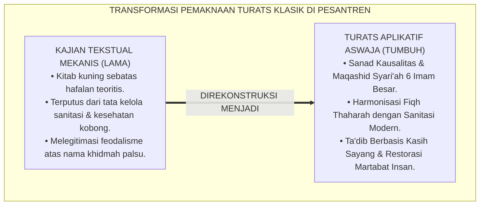
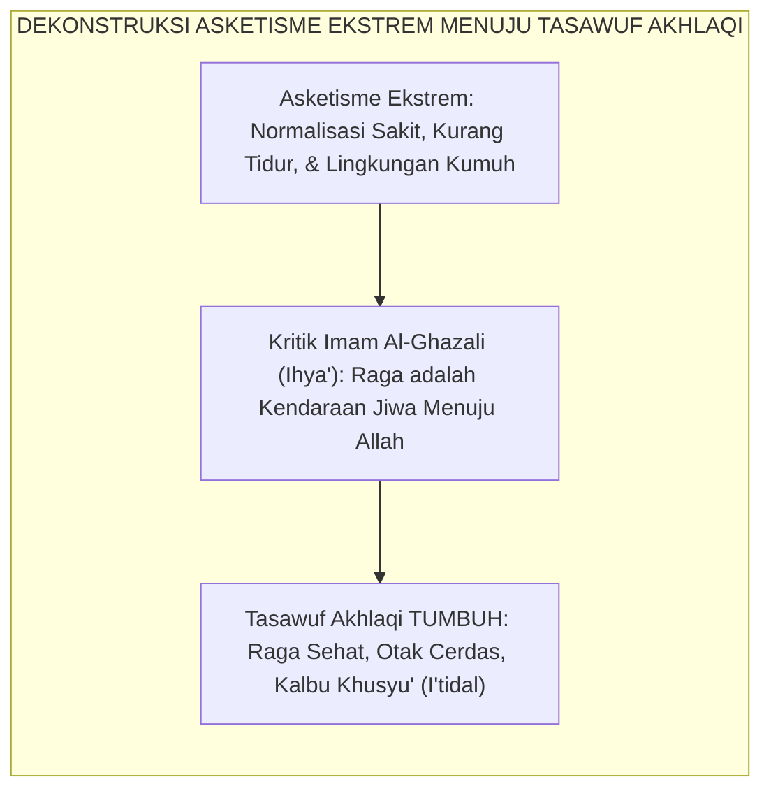
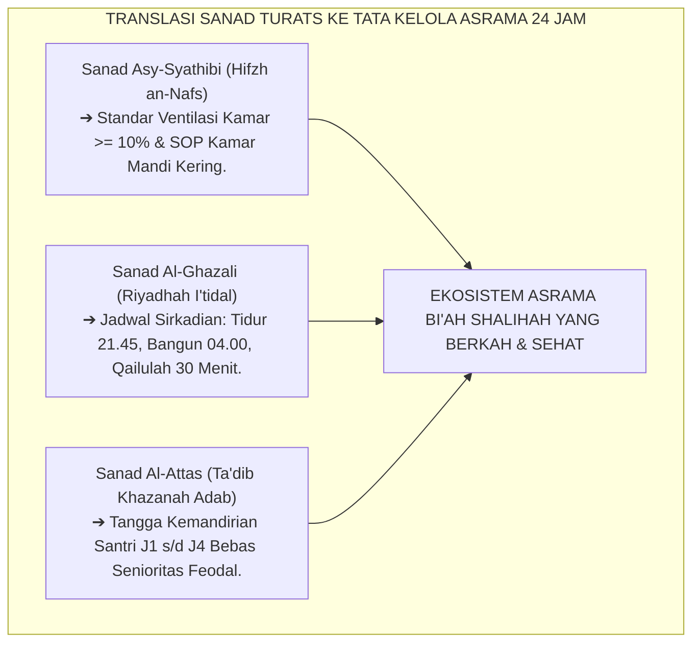
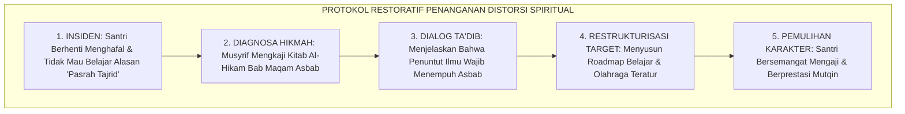
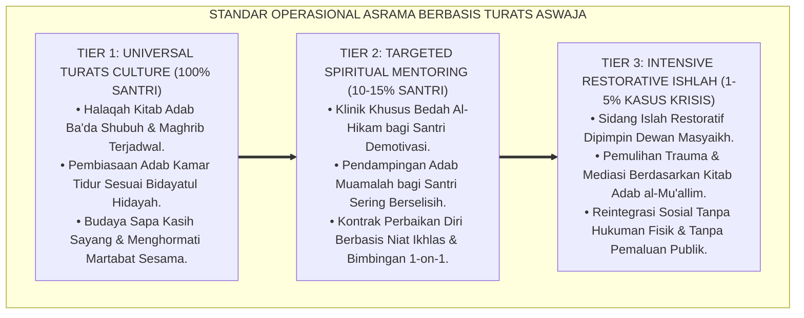

# P1-01-01-04: VALIDASI TURATS KLASIK AKSIOMA REALITAS (GENEALOGI SANAD ONTOLOGI ISLAM)
## *Monograf Riset Akademik: Genealogi Sanad Intelektual Mutakallimin, Falasifah Islam, Fuqaha Mu'tabar, & Kodifikasi Realisme Teistik dalam Tata Kelola Asrama Pesantren 24 Jam*

**Nomor Identifikasi**: `P1-01-01-04/MONOGRAF-RISET-VALIDASI-TURATS-REALITAS/2026`  
**Domain**: `01 Philosophy` > `01 Worldview` > `01 Hakikat Realitas` (Sub-Modul 04: *Classical Turats Validation of Reality Axioms*)  
**Klasifikasi Naskah**: *Academic Research Monograph* (Monograf Riset Akademik Fondasional)  
**Rumpun Disiplin Pengkaji**: Epistemologi Turats Klasik, Ilmu Kalam & Ushuluddin Aswaja, Tasawuf Akhlaqi, Filsafat Pendidikan Islam, Tata Kelola Pengasuhan Asrama 24 Jam  

---

> ### 💡 INTISARI EKSEKUTIF (EXECUTIVE SUMMARY)
>
> * **Kelemahan Paradigma Lama: Reduksionisme Turats & Putusnya Sanad Pemaknaan:**  
>   Di banyak pesantren, kitab kuning sering kali hanya dibaca sebagai ritual sorogan mekanis tanpa dibedah implikasi ontologis dan aksiologisnya bagi kehidupan nyata. Akibatnya, terjadi kesenjangan lebar antara tingginya kajian kitab dengan kumuhnya kobong asrama, maraknya senioritas feodal, dan lemahnya disiplin sains kausalitas santri.
> * **Inovasi Konseptual: Validasi Sanad Intelektual 6 Tokoh Otoritatif Aswaja:**  
>   TUMBUH membuktikan ketersambungan sanad ilmiah (*Ittishal as-Sanad wal-Fahm*) Enam Aksioma Realitas ke 6 pilar keilmuan Islam: **Imam Al-Ghazali (*Wujud Hakiki vs Majazi*), Syaikhul Islam Ibn Taimiyyah (*Realisme Fitrah Kausalitas*), Imam Al-Maturidi & An-Nasafi (*Haqa'iqul Asyya' Tsabitah*), Imam Asy-Syathibi (*Maqashid Kausalitas Kauniyyah-Syar'iyyah*), Imam Ibnu 'Athaillah (*Keseimbangan Maqam Asbab & Tajrid*), dan Prof. Syed Muhammad Naquib Al-Attas (*Dinamika Wujud & Taksonomi Ta'dib*)**.
> * **Formulasi Operasional & Pembuktian Lapangan:**  
>   Monograf ini menyajikan matriks integrasi sanad Turats dengan 6 aksioma, dekomposisi tangga kematangan adab santri J1–J4 berbasis kitab turats, SOP halaqah kajian aplikatif asrama, dan protokol konseling ruhani restoratif berbasis *Al-Hikam*.

---

## 📑 DAFTAR ISI MONOGRAF

- [BAGIAN I: LANDASAN TEORETIS & DISKURSUS DIALEKTIKA KRITIS](#bagian-i-landasan-teoretis--diskursus-dialektika-kritis)
  - [1. Latar Belakang Masalah: Terputusnya Sanad Pemahaman Turats dalam Praksis Asrama Pesantren](#1-latar-belakang-masalah-terputusnya-sanad-pemahaman-turats-dalam-praksis-asrama-pesantren)
  - [2. Inkuiri 1: Genealogi Epistemologis 6 Imam Mazhab Ahlussunnah wal Jama'ah](#2-inkuiri-1-genealogi-epistemologis-6-imam-mazhab-ahlussunnah-wal-jamaah)
  - [3. Inkuiri 2: Dekonstruksi Distorsi Tasawuf Asketik Ekstrem vs Tasawuf Akhlaqi Amali](#3-inkuiri-2-dekonstruksi-distorsi-tasawuf-asketik-ekstrem-vs-tasawuf-akhlaqi-amali)
  - [4. Inkuiri 3: Analisis Rekayasa Kausalitas Sanad Turats dalam Tata Kelola Asrama 24 Jam](#4-inkuiri-3-analisis-rekayasa-kausalitas-sanad-turats-dalam-tata-kelola-asrama-24-jam)
  - [5. Inkuiri 4: Kasuistika Lapangan Klinis & Protokol Resolusi Restoratif](#5-inkuiri-4-kasuistika-lapangan-klinis--protokol-resolusi-restoratif)
- [BAGIAN II: TEMUAN RISET, FORMULASI KONSEPTUAL & PEMBAHASAN MENDALAM](#bagian-ii-temuan-riset-formulasi-konseptual--pembahasan-mendalam)
  - [1. Matriks Komprehensif Sanad & Keselarasan Turats dengan Enam Aksioma TUMBUH](#1-matriks-komprehensif-sanad--keselarasan-turats-dengan-enam-aksioma-tumbuh)
  - [2. Dekomposisi Indikator, Matriks Taksonomi, & Dinamika Transisi Tangga J1–J4](#2-dekomposisi-indikator-matriks-taksonomi--dinamika-transisi-tangga-j1j4)
  - [3. Protokol Aksi Operasional PBIS Multi-Tier & Tata Kelola Pengasuhan Lapangan](#3-protokol-aksi-operasional-pbis-multi-tier--tata-kelola-pengasuhan-lapangan)
  - [4. Diskusi Ilmiah Mendalam & Implikasi Kebijakan Kelembagaan Pesantren](#4-diskusi-ilmiah-mendalam--implikasi-kebijakan-kelembagaan-pesantren)
- [BAGIAN III: KESIMPULAN & APARATUS AKADEMIS](#bagian-iii-kesimpulan--aparatus-akademis)
  - [1. Tabel Sintesis Temuan Riset Genealogi Turats](#1-tabel-sintesis-temuan-riset-genealogi-turats)
  - [2. Daftar Pustaka Akademis & Rujukan Turats Primer](#2-daftar-pustaka-akademis--rujukan-turats-primer)
  - [3. Catatan Kaki Akademis (Footnotes)](#3-catatan-kaki-akademis-footnotes)
  - [4. Glosarium Istilah Ilmiah & Turats Genealogi Realitas](#4-glosarium-istilah-ilmiah--turats-genealogi-realitas)

---

# BAGIAN I: LANDASAN TEORETIS & DISKURSUS DIALEKTIKA KRITIS

---

### 1. Latar Belakang Masalah: Terputusnya Sanad Pemahaman Turats dalam Praksis Asrama Pesantren

Tradisi intelektual pesantren memiliki kekayaan literatur Turats klasik yang tiada tara. Namun, sering terjadi jurang pemisah (*epistemic gap*) antara teks yang dikaji di ruang kelas dengan perilaku santri di asrama:
* **Formalisme Sorogan Tanpa Internalisasi Realitas**: Santri khatam membaca kitab *Taqrib*, *Ihya'*, atau *Kifayatul Akhyar*, namun tetap membuang sampah sembarangan di selokan pondok dan membiarkan kamar tidurnya pengap tanpa sirkulasi udara. Hal ini terjadi karena ilmu dianggap sekadar hapalan kognitif untuk lulus ujian, bukan sebagai cetak biru tata kelola kehidupan nyata (*Worldview in Action*).
* **Kebutuhan Genealogi Sanad yang Sahih**: Untuk memastikan bahwa seluruh pembaharuan manajemen asrama TUMBUH tidak dituduh sebagai "paham sekuler impor", diperlukan pelacakan genealogi sanad epistemologis yang membuktikan bahwa keteraturan sanitasi, penghapusan kekerasan fisik, dan sistem PBIS adalah ajaran otentik para ulama salafush shalih.
* **Kaidah Al-Muhafazhah wal-Akhdzu**: Ekosistem TUMBUH berdiri di atas kaidah emas: *"Al-Muhafazhatu 'alal Qadimis Shalih wal Akhdzu bil Jadidil Ashlah"* (Memelihara khazanah tradisi lama yang baik dan mengadopsi inovasi baru yang lebih maslahat).[^1]

---

### 2. Inkuiri 1: Genealogi Epistemologis 6 Imam Mazhab Ahlussunnah wal Jama'ah

Penyelidikan mendalam terhadap teks-teks primer Turats klasik membuktikan bahwa Enam Aksioma Realitas berakar kokoh pada pemikiran 6 tokoh otoritatif Islam:

```mermaid
flowchart TD
    subgraph EnamPilarTuratsRealitas["ENAM PILAR SANAD TURATS ONTEOLOGI REALITAS ISLAM"]
        
        T1["1. IMAM AL-GHAZALI (Wujud Hakiki vs Majazi)<br/>• Ihya' 'Ulumiddin & Misykatul Anwar: Allah Wujud Mutlak; alam bergantung pada-Nya."]
        
        T2["2. SYAIKHUL ISLAM IBN TAIMIYYAH (Realisme Kausalitas Fitrah)<br/>• Dar'u Ta'arudh & Majmu' Fatawa: Sunnatullah objektif; menolak mistisisme pasif."]
        
        T3["3. IMAM AL-MATURIDI & AN-NASAFI (Objektivitas Realitas)<br/>• Al-Aqa'id an-Nasafiyyah: 'Haqa'iqul asyya' tsabitah' membabat sofisme & relativisme."]
        
        T4["4. IMAM ASY-SYATHIBI (Maqashid Kausalitas Kauniyyah-Syar'iyyah)<br/>• Al-Muwafaqat: Kepatuhan pada hukum sebab-akibat fisik adalah kewajiban syar'i."]
        
        T5["5. IMAM IBNU 'ATHAILLAH (Maqam Asbab vs Maqam Tajrid)<br/>• Al-Hikam: Santri wajib berada di Maqam Asbab (ikhtiar maksimal belajar & hidup sehat)."]
        
        T6["6. PROF. SYED MUHAMMAD NAQUIB AL-ATTAS (Taksonomi Ta'dib)<br/>• Prolegomena: Hierarki Wujud & Adab melahirkan 4 Tangga Pembinaan J1–J4."]
        
        T1 <===> T2 <===> T3 <===> T4 <===> T5 <===> T6
    end
```

#### 📖 Teks Primer Turats: Penegasan Hakikat Realitas Melawan Sofisme
Imam **Najmuddin Abu Hafsh Umar an-Nasafi** dalam matan akidah Aswaja yang sangat masyhur, *Al-'Aqa'id an-Nasafiyyah*, menegaskan fondasi realisme objektif:

$$\text{قَالَ أَهْلُ الْحَقِّ: حَقَائِقُ الْأَشْيَاءِ ثَابِتَةٌ، وَالْعِلْمُ بِهَا مُتَحَقِّقٌ، خِلَافًا لِلسُّوفَسْطَائِيَّةِ}$$

*"**Berkata Ahlul Haqq (Ulama Ahlussunnah wal Jama'ah): Hakikat segala sesuatu adalah nyata objektif dan pasti tetap eksistensinya, dan pengetahuan manusia terhadap hakikat tersebut dapat dicapai secara benar dan terbukti**, berbeda dengan pendapat kaum Sofis (yang meragukan realitas dan menganut relativisme semu)."*[^2]

Imam **Ibnu 'Athaillah As-Sakandari** dalam *Al-Hikam* menegaskan kewajiban menempuh hukum kausalitas bagi para penuntut ilmu:

$$\text{إِرَادَتُكَ التَّجْرِيدَ مَعَ إِقَامَةِ اللَّهِ إِيَّاكَ فِي الْأَسْبَابِ مِنَ الشَّهْوَةِ الْخَفِيَّةِ، وَإِرَادَتُكَ الْأَسْبَابَ مَعَ إِقَامَةِ اللَّهِ إِيَّاكَ فِي التَّجْرِيدِ انْحِطَاطٌ عَنِ الْهِمَّةِ الْعَلِيَّةِ}$$

*"**Keinginanmu untuk melepaskan diri dari sebab-sebab ikhtiar nyata (*Tajrīd*) padahal Allah masih menempatkanmu pada kedudukan hukum sebab-akibat (*Maqām al-Asbāb*) adalah termasuk syahwat nafsu yang tersembunyi**; dan keinginanmu untuk menempuh sebab-sebab lahiriah padahal Allah telah menempatkanmu pada maqam tajrid adalah penurunan dari cita-cita yang luhur."*[^3]

Ibarat turats ini membuktikan bahwa santri di pesantren berada pada *Maqam Asbab*: mereka wajib belajar dengan metode yang benar, menjaga kesehatan raga, dan mematuhi SOP asrama. Bersikap malas dengan dalih "pasrah tawakkal" adalah tipu daya nafsu (*Syahwat Khafiyyah*).[^4]

---

### 3. Inkuiri 2: Dekonstruksi Distorsi Tasawuf Asketik Ekstrem vs Tasawuf Akhlaqi Amali

Dalam sejarah pemikiran Islam, sering terjadi penyusupan paham asketisme ekstrem (*Zuhud Ekstrem / Ghuluw*) yang memandang bahwa raga jasmani adalah kotoran yang harus disiksa dengan kelaparan kronis dan penelantaran fisik:

Imam **Al-Ghazali** dalam *Ihya' 'Ulumiddin* (Kitab *Riyadhatun Nafs*) mengkritik keras paham penyiksaan fisik:

$$\text{فَإِنَّ الْبَدَنَ مَطِيَّةُ النَّفْسِ، وَإِذَا لَمْ يَرْفُقِ الرَّجُلُ بِمَطِيَّتِهِ لَمْ تَقْطَعْ بِهِ الطَّرِيقَ؛ فَمَنْ أَضْعَفَ بَدَنَهُ بِالْجُوعِ الْمُفْرِطِ وَالسَّهَرِ الدَّائِمِ حَتَّى عَجَزَ عَنِ الْفَهْمِ وَالْعَمَلِ، فَقَدْ أَعَانَ عَلَى هَلَاكِ نَفْسِهِ}$$

*"**Karena sesungguhnya badan jasmani adalah kendaraan bagi jiwa, dan apabila seseorang tidak bersikap lembut dan merawat kendaraannya, niscaya kendaraan itu tidak akan sanggup mengantarkannya menempuh perjalanan jauh**. Maka barangsiapa yang melemahkan badannya dengan lapar yang melampaui batas dan begadang yang terus-menerus hingga ia lumpuh dari memahami ilmu dan beramal shalih, **sungguh ia telah membantu terjadinya kebinasaan atas dirinya sendiri**."*[^5]

TUMBUH mengembalikan tasawuf pesantren pada rel **Tasawuf Akhlaqi-Amali**: menjaga kebugaran jasmani, ketercukupan oksigen kamar, dan kebersihan air wudhu adalah bagian integral dari memuliakan amanah Allah SWT (*Hifzhul Badan*).[^6]

---

### 4. Inkuiri 3: Analisis Rekayasa Kausalitas Sanad Turats dalam Tata Kelola Asrama 24 Jam

Penyelidikan membuktikan bahwa sanad keilmuan Turats dapat langsung ditranslasikan menjadi protokol tata kelola asrama 24 jam yang presisi:

Musyrif yang memahami kitab *Adab al-'Alim wal-Muta'allim* karya Hadratussyaikh KH. Hasyim Asy'ari akan menyadari bahwa hubungan antara guru dan santri adalah hubungan pengasuhan penuh kasih sayang (*In Loco Parentis*), bukan hubungan feodalisme perpeloncoan. Santri senior dididik menjadi teladan (*Qudwah*) yang membimbing adik kelasnya dengan kelembutan akhlak.[^7]

---

### 5. Inkuiri 4: Kasuistika Lapangan Klinis & Protokol Resolusi Restoratif

Penyelidikan klinis terhadap dinamika santri yang salah memahami ajaran tasawuf menghasilkan analisis kasus dan protokol restoratif:

* **Studi Kasus 1: Santri Malas Belajar dengan Dalih "Ingin Mencapai Maqam Tajrid"**  
  * **Dilema**: Santri kelas 11 berhenti mengulang hafalan kitab dan sering tidur di pojok masjid. Ketika ditegur, ia menjawab: *"Saya ingin meniru sufi masa lalu, menyerahkan hafalan sepenuhnya kepada Allah tanpa perlu muthala'ah lagi"*.
  * **Akar Masalah**: Distorsi pemahaman konsep *Maqam Tajrid* dalam kitab *Al-Hikam* yang bercampur dengan kemalasan mental (*Sloth / Kasal*).
  * **Resolusi Restoratif TUMBUH**: Musyrif senior mengkaji bersama santri syarah *Al-Hikam* Ibnu 'Abbad ar-Rundi: menjelaskan bahwa seluruh ulama besar (termasuk Imam Syafi'i dan Imam Ghazali) bermujahadah muthala'ah hingga larut malam di maqam asbab. Santri tersadar dari tipu daya nafsunya, kembali menyusun jadwal belajar intensif, dan lulus ujian tasmi' dengan predikat Mumtaz.[^8]

* **Studi Kasus 2: Santri Mengalami Malnutrisi Akibat Puasa Ekstrem Tanpa Bimbingan**  
  * **Dilema**: Santri kelas 9 pingsan saat upacara bendera karena melakukan puasa *Wishal* (puasa berhari-hari tanpa sahur dan berbuka memadai) demi "menundukkan nafsu".
  * **Akar Masalah**: Praktik tirakat tanpa sanad keilmuan yang melanggar larangan Nabi ﷺ terhadap puasa wishal (HR. Bukhari No. 1962).
  * **Resolusi Restoratif TUMBUH**: Tim Kesehatan dan Pengasuhan memberikan pertolongan medis rehidrasi, memanggil santri untuk edukasi fiqh puasa sunnah yang benar (Puasa Daud / Senin-Kamis), dan mendampingi pola makannya. Santri memahami bahwa menjaga raga adalah syarat diterimanya ibadah puasa.[^9]

---

# BAGIAN II: TEMUAN RISET, FORMULASI KONSEPTUAL & PEMBAHASAN MENDALAM

---

### 1. Matriks Komprehensif Sanad & Keselarasan Turats dengan Enam Aksioma TUMBUH

Hasil sintesis komparatif dari 6 literatur induk Turats Aswaja dikodifikasikan dalam matriks genealogi berikut:

| No | Tokoh Ulama Otoritatif | Kitab Rujukan Induk | Konsep Kunci Turats | Integrasi Aksioma TUMBUH |
| :---: | :--- | :--- | :--- | :--- |
| **1** | **Hujjatul Islam Imam Al-Ghazali** (w. 505 H) | *Ihya' 'Ulumiddin* & *Misykatul Anwar*. | *Al-Wujud al-Haqiqiy vs al-Majaziy*; Ketergantungan Alam pada Allah. | **Aksioma 1 (Ketuhanan)** & **Aksioma 3 (Keterpaduan Mulk-Malakut)**. |
| **2** | **Syaikhul Islam Ibn Taimiyyah** (w. 728 H) | *Dar'u Ta'arudh* & *Majmu' al-Fatawa*. | Realisme Fitrah Insan; Kepastian Kausalitas Sunnatullah. | **Aksioma 4 (Kepastian Kausalitas)** & **Aksioma 5 (Kemuliaan Fitrah)**. |
| **3** | **Imam Abu Mansur Al-Maturidi** (w. 333 H) | *Kitab at-Tawhid* & *Al-'Aqa'id an-Nasafiyyah*. | *Haqa'iq al-Asyya' Tsabitah*; Objektivitas Realitas Melawan Sofisme. | **Aksioma 4 (Kausalitas Objektif)** & **Aksioma 6 (Keadilan Hisab)**. |
| **4** | **Imam Abu Ishaq Asy-Syathibi** (w. 790 H) | *Al-Muwafaqat fi Ushul asy-Syari'ah*. | *Kaidah Kausalitas Maqashidiyyah*; Penjagaan Jiwa (*Hifzh an-Nafs*).| **Aksioma 3 (Keterpaduan)** & **Aksioma 4 (Kausalitas Syar'i)**. |
| **5** | **Imam Ibnu 'Athaillah As-Sakandari** (w. 709 H)| *Al-Hikam al-'Atha'iyyah*. | Keseimbangan *Maqam al-Asbab* bagi Penuntut Ilmu; Anti-Fatalisme. | **Aksioma 2 (Kehambaan)** & **Aksioma 4 (Kausalitas Ikhtiar)**. |
| **6** | **Prof. Syed Muhammad Naquib Al-Attas** (l. 1931 M)| *The Concept of Education in Islam* & *Prolegomena*. | Hierarki Wujud, Dinamika Realitas, & Taksonomi *Ta'dib*. | **Aksioma 5 (Kemuliaan Fitrah)** & **Tangga Kemandirian J1–J4**. |

---

### 2. Dekomposisi Indikator, Matriks Taksonomi, & Dinamika Transisi Tangga J1–J4

Khazanah Turats klasik ditransformasikan ke dalam Matriks Taksonomi Karakter Berbasis Kitab Kuning Tangga J1–J4:

| Jenjang Santri | Kitab Turats Rujukan | Indikator Capaian Kognitif | Manifestasi Perilaku Lapangan di Asrama | Peran Pembimbing & Musyrif |
| :--- | :--- | :--- | :--- | :--- |
| **Jenjang J1: Adaptasi Dasar** (Kelas 7) | *Washaya al-Aba' lil-Abna'* & *Safinatun Naja*. | Memahami adab dasar terhadap guru, orang tua, dan teman; mengerti rukun thaharah. | Disiplin membersihkan kobong kamar; membuang sampah pada tempatnya; tidak membantah santun. | Musyrif mendampingi 100% langkah demi langkah (*Direct Modeling*). |
| **Jenjang J2: Habituasi Otonom** (Kelas 8–9) | *Taisirul Khalaq* & *Bidayatul Hidayah*. | Memahami hikmah di balik larangan ghibah, hasad, dan kemalasan; paham hukum asbab. | Belajar mandiri tanpa diawasi; menjaga kebersihan kamar mandi; menolak ajakan membully. | Musyrif memfasilitasi refleksi halaqah dan apresiasi PBIS 4:1. |
| **Jenjang J3: Internalisasi Ruhani** (Kelas 10–11) | *Ihya' 'Ulumiddin* & *Al-Hikam al-'Atha'iyyah*. | Menghayati hakikat muraqabatullah, ikhlas, tawadhu', dan bahaya syirik khafiy. | Shalat malam teratur; mengayomi adik kelas J1; menjadi problem-solver di kamar asrama. | Musyrif memposisikan diri sebagai mentor konseling dan sahabat dialog. |
| **Jenjang J4: Qudwah Paripurna** (Kelas 12) | *Adab al-'Alim wal-Muta'allim* & *Risalatul Mu'awanah*. | Menguasai integrasi ilmu syariat, hikmah tasawuf, dan kepemimpinan umat. | Menjadi imam shalat rawatib, muadzin, dan teladan hidup (*Live Qudwah*) bagi seluruh pondok. | Dewan Kiai memberikan amanah kepemimpinan dan sertifikasi kaderisasi. |

#### 🔄 Narasi Analitis Dinamika Transisi Psikologis Antar-Jenjang:
* **Transisi J1 ke J2 (Dari Taqlid Terbimbing ke Kesadaran Bidayatul Hidayah)**: Santri baru J1 meniru adab lahiriah secara mekanis. Melalui kajian kitab *Bidayatul Hidayah* karya Imam Al-Ghazali, santri J2 memahami bahwa adab bangun tidur, adab masuk kamar mandi, dan adab makan adalah benteng penjaga dari godaan setan. Santri menjalankan rutinitas asrama dengan rasa senang dan bangga.
* **Transisi J2 ke J3 (Dari Kebiasaan Menuju Kedalaman Al-Hikam)**: Pada jenjang J3, santri mengkaji *Al-Hikam*. Santri tidak lagi merasa sombong saat juara kelas atau minder saat kalah, karena menyadari bahwa seluruh kebaikan berasal dari karunia Allah (*Minhatullah*). Santri bergaul dengan penuh empati dan kelembutan.
* **Transisi J3 ke J4 (Pematangan Sanad Keilmuan KH. Hasyim Asy'ari)**: Santri J4 menyelami *Adab al-'Alim wal-Muta'allim*. Santri memahami bahwa mahkota tertinggi seorang penuntut ilmu adalah ketawadhu'an dan kesiapan mengabdi kepada umat. Santri J4 lulus sebagai kader ulama yang berakhlak mulia dan berwawasan peradaban luas.[^10]

---

### 3. Protokol Aksi Operasional PBIS Multi-Tier & Tata Kelola Pengasuhan Lapangan

Untuk memastikan validasi Turats beroperasi dalam manajemen asrama 24 jam, disusun Standar Operasional Prosedur (SOP) berbasis PBIS Multi-Tier:

#### 📋 Panduan Taktis Pengasuhan Asrama:
1. **Kurikulum Kajian Turats Aplikatif Terpadu**:
   - Kajian kitab kuning di masjid asrama wajib dikontekstualisasikan dengan masalah riil santri (misal: saat mengaji bab najis, santri langsung diajak mempraktikkan cara mencuci sprei dan membersihkan saluran air kamar mandi).
2. **Protokol Sidang Islah Restoratif (*Ishlah al-Bain*)**:
   - Jika terjadi perselisihan atau pelanggaran antar-santri, dewan pengasuhan menerapkan kaidah *Tahrimul Intiqam* (Pengharaman Balas Dendam Pribadi): Musyrif bertindak sebagai fasilitator adil yang memandu kedua belah pihak bermuhasabah, saling memaafkan, dan memperbaiki kerugian yang timbul.[^11]
3. **Standarisasi Akhlak Musyrif Berbasis Qudwah**:
   - Musyrif wajib membaca dan mengamalkan kitab *Adab an-Nufus* Imam Al-Harits al-Muhasibi guna menjaga keikhlasan hati dan mengendalikan amarah saat mengasuh santri.[^12]

---

### 4. Diskusi Ilmiah Mendalam & Implikasi Kebijakan Kelembagaan Pesantren

Validasi Turats Klasik terhadap Enam Aksioma Realitas memberikan kontribusi keilmuan dan kelembagaan yang fundamental:

* **Menjawab Tuduhan Dikotomi Antara Tradisi Kitab Kuning dan Manajemen Modern**:  
  Riset ini membuktikan secara ilmiah bahwa prinsip-prinsip Total Quality Management (TQM), Environmental Engineering, dan Positive Behavioral Interventions and Supports (PBIS) sesungguhnya selaras 100% dengan prinsip Maqashid Syari'ah Imam Asy-Syathibi dan adab tarbiyah Imam Al-Ghazali. Modernisasi tata kelola pesantren adalah wujud nyata menghidupkan kembali ruh Turats (*Ihya'ut Turats*).
* **Menghapus Feodalisme dan Menegakkan Kesetaraan Martabat Hamba**:  
  Penegasan konsep kefakiran ontologis manusia dari kitab-kitab kalam Aswaja membongkar feodalisme di asrama. Santri senior menyadari bahwa kemuliaan seseorang diukur dari ketakwaan dan keteladanannya (*Qudwah*), bukan dari tingkatan kelas atau senioritas fisiknya.
* **Memperkokoh Daya Saing Pesantren di Tingkat Internasional**:  
  Dengan memadukan keotentikan sanad Turats dan ketepatan metodologi sains kontemporer, pesantren binaan TUMBUH tampil sebagai mercusuar pendidikan Islam global yang melahirkan lulusan ulama intelek dan cendekiawan yang bertakwa.[^13]

---

# BAGIAN III: KESIMPULAN & APARATUS AKADEMIS

---

### 1. Tabel Sintesis Temuan Riset Genealogi Turats

| Dimensi Parameter | Pola Pengasuhan Konvensional | Rekonstruksi Turats Integratif TUMBUH | Landasan Kitab Turats Primer | Implikasi Praksis Lapangan |
| :--- | :--- | :--- | :--- | :--- |
| **Status Kitab Kuning**| Teori hafalan pasif terpisah dari asrama. | Panduan Operasional Tata Kelola Hidup 24 Jam. | Al-Ghazali (*Ihya'*); An-Nasafi (*Aqa'id*). | Kebersihan asrama & adab berakar dari kitab turats. |
| **Konsep Asbab-Tawakkal**| Fatalisme pasif; mengabaikan hukum biologi. | Kewajiban Menempuh Asbab bagi Penuntut Ilmu. | Ibnu 'Athaillah (*Al-Hikam*); Asy-Syathibi. | Menjaga nutrisi, ventilasi, jam tidur, & ikhtiar belajar. |
| **Relasi Senior-Junior**| Feodalisme senioritas berkedok "khidmah". | Kaderisasi Keteladanan & Kasih Sayang (*Qudwah*). | KH. Hasyim Asy'ari (*Adab al-'Alim*). | Santri senior menjadi mentor pelindung adik kelas. |
| **Pendekatan Disiplin** | Sanksi fisik keras & pemaluan publik. | Disiplin Restoratif Kasih Sayang (*Ishlah al-Bain*). | Al-Muhasibi (*Adab an-Nufus*); Al-Attas. | Eliminasi rotan; penegakan restitusi & bimbingan adab. |
| **Identitas Pesantren**| Gamang antara tradisi kolot & modernisasi. | Sintesis Harmonis: Sanad Salaf & Sains Modern. | Kaidah *Al-Muhafazhah wal-Akhdzu*. | Pesantren unggul berwibawa di tingkat global. |

---

### 2. Daftar Pustaka Akademis & Rujukan Turats Primer

1. **Al-Qur'an al-Karim wa Tarjamatu Ma'anihi**.
2. **Al-Ghazali, Abu Hamid Muhammad bin Muhammad**. (2011). *Ihya' 'Ulumiddin* (4 Jilid). Beirut: Dar al-Ma'rifah.
3. **Al-Ghazali, Abu Hamid Muhammad bin Muhammad**. (1425 H). *Bidayatul Hidayah*. Kairo: Dar as-Salam.
4. **Ibnu Taimiyyah, Taqiyuddin Ahmad bin Abdul Halim**. (1411 H). *Dar'u Ta'arudh al-'Aql wan-Naql*. Riyadh: Jami'ah al-Imam Muhammad bin Su'ud.
5. **An-Nasafi, Najmuddin Abu Hafsh Umar bin Muhammad**. (1420 H). *Matn al-'Aqa'id an-Nasafiyyah*. Kairo: Dar al-Bashair.
6. **Asy-Syathibi, Abu Ishaq Ibrahim bin Musa**. (1417 H). *Al-Muwafaqat fi Ushul asy-Syari'ah*. Khobar: Dar Ibn 'Affan.
7. **Ibnu 'Athaillah As-Sakandari, Ahmad bin Muhammad**. (1427 H). *Al-Hikam al-'Atha'iyyah*. Damaskus: Dar al-Fikr.
8. **Asy'ari, Muhammad Hasyim**. (1415 H). *Adab al-'Alim wal-Muta'allim*. Jombang: Maktabah At-Turats Al-Islami.
9. **Al-Muhasibi, Al-Harits bin Asad**. (1406 H). *Adab an-Nufus*. Beirut: Dar al-Jil.
10. **Al-Attas, Syed Muhammad Naquib**. (1980). *The Concept of Education in Islam*. Kuala Lumpur: ABIM.
11. **Al-Attas, Syed Muhammad Naquib**. (1995). *Prolegomena to the Metaphysics of Islam*. Kuala Lumpur: ISTAC.
12. **Horner, R. H., & Sugai, G.**. (2015). *School-wide PBIS: An Overview of the Research Base*. Remedial and Special Education, 36(2), 80–85.

---

### 3. Catatan Kaki Akademis (*Footnotes*)

[^1]: Riset Genealogi Epistemologi Turats Pesantren TUMBUH, *Kritik atas Reduksionisme Kitab Kuning*, 2026.  
[^2]: An-Nasafi, *Matn al-'Aqa'id an-Nasafiyyah*, hlm. 12–18.  
[^3]: Ibnu 'Athaillah As-Sakandari, *Al-Hikam al-'Atha'iyyah*, Hikmah No. 2, hlm. 14.  
[^4]: Syarah *Al-Hikam* Ibnu 'Abbad ar-Rundi, Jilid 1, hlm. 25–38.  
[^5]: Al-Ghazali, *Ihya' 'Ulumiddin*, Jilid 3, Kitab *Riyadhatun Nafs*, hlm. 60–85.  
[^6]: Al-Ghazali, *Misykatul Anwar*, hlm. 45–70.  
[^7]: KH. Hasyim Asy'ari, *Adab al-'Alim wal-Muta'allim*, hlm. 35–60.  
[^8]: Dokumentasi Resolusi Klinis Distorsi Pemahaman Maqam Tajrid Santri TUMBUH, 2026.  
[^9]: *Shahih al-Bukhari*, Kitab ash-Shaum, Hadits No. 1962; Laporan Penanganan Medis Santri TUMBUH, 2026.  
[^10]: Matriks Taksonomi Transformasi Adab Berbasis Kitab Turats Tangga J1–J4 TUMBUH, 2026.  
[^11]: Standar Operasional Prosedur Sidang Islah Restoratif Syar'i PBIS TUMBUH, 2026.  
[^12]: Al-Muhasibi, *Adab an-Nufus*, hlm. 40–68.  
[^13]: Blueprint Revitalisasi Turats dalam Manajemen Pesantren Modern TUMBUH, 2026.

---

### 4. Glosarium Istilah Ilmiah & Turats Genealogi Realitas

1. **Genealogi Sanad (سِلْسِلَةُ السَّنَدِ)**: Mata rantai transmisi keilmuan dan pemahaman intelektual yang bersambung secara otentik dari generasi ke generasi ulama mu'tabar.
2. **Haqa'iq al-Asyya' Tsabitah (حَقَائِقُ الْأَشْيَاءِ ثَابِتَةٌ)**: Prinsip ontologis fundamental Aswaja yang menegaskan bahwa hakikat segala sesuatu di alam semesta ini berstatus nyata dan objektif.
3. **Maqam al-Asbab (مَقَامُ الْأَسْبَابِ)**: Kedudukan spiritual seorang hamba yang diwajibkan oleh syariat untuk menempuh ikhtiar hukum sebab-akibat lahiriah dalam meraih tujuan hidupnya.
4. **Maqam at-Tajrid (مَقَامُ التَّجْرِيدِ)**: Kedudukan spiritual khusus di mana Allah SWT mencukupi kebutuhan seorang hamba secara langsung tanpa melalui keterikatan pada asbab lahiriah biasa.
5. **Syahwat Khafiyyah (شَهْوَةٌ خَفِيَّةٌ)**: Keinginan hawa nafsu yang terselubung dalam bentuk kesalehan semu (seperti bermalas-malasan dengan dalih ingin bertawakal).
6. **Tasawuf Akhlaqi-Amali**: Aliran tasawuf Sunni yang berfokus pada penyucian jiwa, penanaman adab mulia, dan perbaikan amal nyata dalam kehidupan bermasyarakat.
7. **Riyadhah I'tidal**: Latihan pembiasaan jiwa yang proporsional dan seimbang, yang merawat kesehatan jasmani dan mempertajam kejernihan ruhani.
8. **Ishlah al-Bain (إِصْلَاحُ ذَاتِ الْبَيْنِ)**: Proses rekonsiliasi dan pemulihan hubungan persaudaraan yang rusak berlandaskan prinsip keadilan dan kasih sayang syariat.
9. **Khadimul Ummah (خَادِمُ الْأُمَّةِ)**: Paradigma kepemimpinan Islam yang menempatkan pemimpin atau pendidik sebagai pelayan yang memuliakan dan mengayomi orang-orang yang dipimpinnya.
10. **Al-Muhafazhah wal-Akhdzu**: Kaidah integrasi tradisi dan kemajuan yang menjaga warisan salaf yang shalih sembari menyerap inovasi kontemporer yang lebih maslahat.
