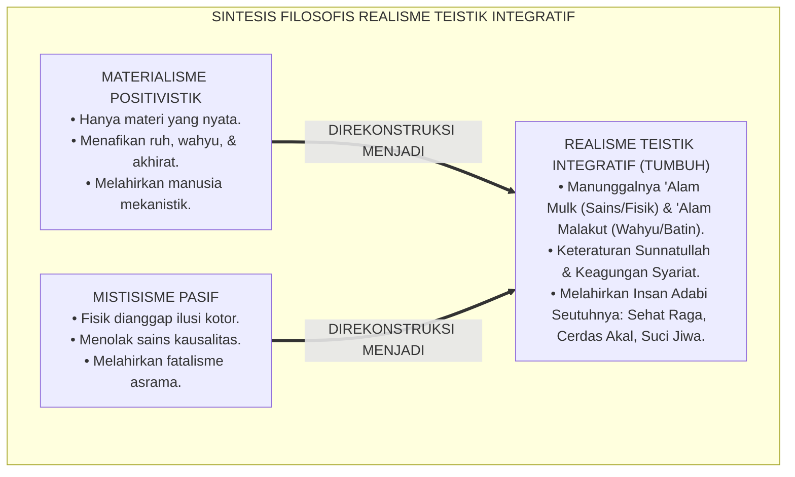
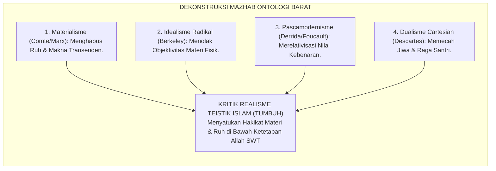
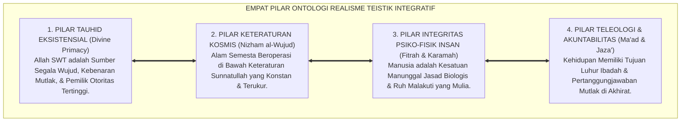
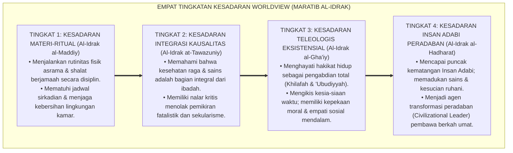
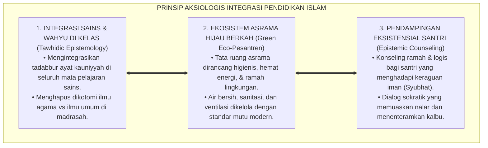

# P1-01-01-05: SINTESIS FILOSOFIS HAKIKAT REALITAS (THE GRAND SYNTHESIS OF REALITY)
## *Monograf Riset Akademik: Konsolidasi Meta-Ontologis Realisme Teistik Integratif, Komparasi Kritis terhadap Materialisme, Idealisme, dan Pascamodernisme, serta Deklarasi Posisi Resmi Worldview TUMBUH di Pesantren 24 Jam*

**Nomor Identifikasi**: `P1-01-01-05/MONOGRAF-RISET-SINTESIS-REALITAS/2026`  
**Domain**: `01 Philosophy` > `01 Worldview` > `01 Hakikat Realitas` (Sub-Modul 05: *Philosophical Synthesis of Reality*)  
**Klasifikasi Naskah**: *Academic Research Monograph* (Monograf Riset Akademik Fondasional)  
**Rumpun Disiplin Pengkaji**: Metafisika & Ontologi Islam, Filsafat Ilmu Kontemporer, Epistemologi Komparatif, Neurosains Kognitif, Tata Kelola Pengasuhan Asrama 24 Jam  

---

> ### 💡 INTISARI EKSEKUTIF (EXECUTIVE SUMMARY)
>
> * **Kelemahan Paradigma Lama: Polarisasi Ekstrem & Fragmentasi Keilmuan:**  
>   Dunia pendidikan Islam kontemporer terjepit di antara dua arus pemikiran yang merusak: materialisme sekuler Barat yang mencabut dimensi spiritual dari sains, dan mistisisme pasif lokal yang mengabaikan hukum sains kausalitas, sanitasi, dan kesehatan fisik raga santri.
> * **Inovasi Konseptual: Deklarasi Posisi Resmi Realisme Teistik Integratif:**  
>   TUMBUH mendeklarasikan sintesis filosofis resmi: **Realisme Teistik Integratif**, sebuah cara pandang ontologis yang menyatukan domain empiris kasat mata (*'Alam Mulk*) dengan domain transendental metafisik (*'Alam Malakut*). Seluruh hukum sebab-akibat fisika-biologis dan hukum moral syariat diakui sebagai kesatuan tatanan objektif ciptaan Allah (*Nizham al-Wujud*).
> * **Formulasi Operasional & Pembuktian Lapangan:**  
>   Monograf ini menguraikan 4 pilar ontologi resmi TUMBUH, matriks komparasi kritis terhadap 5 mazhab filsafat dunia, 4 Tingkatan Kesadaran Kematangan Worldview (*Maratib al-Idrak*), prinsip aksiologis integrasi sains-tauhid di madrasah, dan etika tata kelola peradaban Islam.

---

## 📑 DAFTAR ISI MONOGRAF

- [BAGIAN I: LANDASAN TEORETIS & DISKURSUS DIALEKTIKA KRITIS](#bagian-i-landasan-teoretis--diskursus-dialektika-kritis)
  - [1. Latar Belakang Masalah: Polarisasi Epistemologis dan Krisis Arah Pendidikan Islam](#1-latar-belakang-masalah-polarisasi-epistemologis-dan-krisis-arah-pendidikan-islam)
  - [2. Inkuiri 1: Dekonstruksi Komparatif Mazhab Metafisika Barat vs Realisme Teistik Islam](#2-inkuiri-1-dekonstruksi-komparatif-mazhab-metafisika-barat-vs-realisme-teistik-islam)
  - [3. Inkuiri 2: Sintesis Kritis Realisme Teistik Integratif (Theistic Integral Realism)](#3-inkuiri-2-sintesis-kritis-realisme-teistik-integratif-theistic-integral-realism)
  - [4. Inkuiri 3: Analisis Rekayasa Kausalitas Meta-Ontologis dalam Ekosistem Asrama 24 Jam](#4-inkuiri-3-analisis-rekayasa-kausalitas-meta-ontologis-dalam-ekosistem-asrama-24-jam)
  - [5. Inkuiri 4: Kasuistika Lapangan Klinis & Protokol Resolusi Restoratif](#5-inkuiri-4-kasuistika-lapangan-klinis--protokol-resolusi-restoratif)
- [BAGIAN II: TEMUAN RISET, FORMULASI KONSEPTUAL & PEMBAHASAN MENDALAM](#bagian-ii-temuan-riset-formulasi-konseptual--pembahasan-mendalam)
  - [1. Deklarasi Posisi Resmi & Empat Pilar Ontologi Realisme Teistik Integratif](#1-deklarasi-posisi-resmi--empat-pilar-ontologi-realisme-teistik-integratif)
  - [2. Matriks Komparasi Komprehensif: TUMBUH vs Mazhab Ontologi Dunia](#2-matriks-komparasi-komprehensif-tumbuh-vs-mazhab-ontologi-dunia)
  - [3. Dekomposisi Dimensi & Empat Tingkatan Kesadaran Worldview (Maratib al-Idrak)](#3-dekomposisi-dimensi--empat-tingkatan-kesadaran-worldview-maratib-al-idrak)
  - [4. Prinsip Aksiologis & Etika Tata Kelola Integrasi Sains-Tauhid di Madrasah](#4-prinsip-aksiologis--etika-tata-kelola-integrasi-sains-tauhid-di-madrasah)
  - [5. Diskusi Ilmiah Mendalam & Implikasi Kebijakan Kelembagaan Pesantren](#5-diskusi-ilmiah-mendalam--implikasi-kebijakan-kelembagaan-pesantren)
- [BAGIAN III: KESIMPULAN & APARATUS AKADEMIS](#bagian-iii-kesimpulan--aparatus-akademis)
  - [1. Tabel Sintesis Temuan Riset Sintesis Filosofis](#1-tabel-sintesis-temuan-riset-sintesis-filosofis)
  - [2. Daftar Pustaka Akademis & Rujukan Turats Primer](#2-daftar-pustaka-akademis--rujukan-turats-primer)
  - [3. Catatan Kaki Akademis (Footnotes)](#3-catatan-kaki-akademis-footnotes)
  - [4. Glosarium Istilah Ilmiah & Turats Sintesis Realitas](#4-glosarium-istilah-ilmiah--turats-sintesis-realitas)

---

# BAGIAN I: LANDASAN TEORETIS & DISKURSUS DIALEKTIKA KRITIS

---

### 1. Latar Belakang Masalah: Polarisasi Epistemologis dan Krisis Arah Pendidikan Islam

Dalam lanskap pemikiran kontemporer, lembaga pendidikan Islam menghadapi tantangan disorientasi ontologis yang tajam:
* **Invasi Sekularisme Positivistik**: Di satu sisi, sains modern sekuler menghegemoni dunia pendidikan dengan menolak eksistensi alam ghaib, mereduksi kesadaran manusia menjadi sekadar reaksi kimiawi otak, dan mencampakkan nilai wahyu dari diskursus akademik.
* **Jebakan Mistisisme Pasif**: Di sisi lain, sebagian respon pesantren tradisional bersikap reaktif-menolak: mencurigai sains empiris, menolak manajemen mutu, dan menormalisasi ketidakteraturan fisik asrama dengan dalih kezuhudan spiritual.
* **Keniscayaan Sintesis Agung (*The Grand Synthesis*)**: Lembaga pendidikan pesantren tidak boleh terus terombang-ambing di antara dua kutub reduksionisme ini. Dibutuhkan sintesis filosofis agung yang mengembalikan keutuhan pandangan hidup Islam (*Islamic Worldview*), di mana sains empiris dan spiritualitas wahyu menyatu harmonis.[^1]

---

### 2. Inkuiri 1: Dekonstruksi Komparatif Mazhab Metafisika Barat vs Realisme Teistik Islam

Penyelidikan filosofis kritis terhadap peta pemikiran ontologi dunia membedah kelemahan 4 mazhab filsafat Barat:

1. **Dekonstruksi Materialisme Positivistik**: Mereduksi nilai moral menjadi stimulus fisik mekanistik.[^2]
2. **Dekonstruksi Idealisme Radikal**: Menolak kepastian hukum fisika-biologis di alam nyata.[^3]
3. **Dekonstruksi Pascamodernisme**: Menghancurkan kepastian kebenaran melalui relativisme bahasa (*Language Games*).[^4]
4. **Dekonstruksi Dualisme Cartesian**: Memecah secara kaku antara jiwa (*Res Cogitans*) dan raga (*Res Extensa*).[^5]

---

### 3. Inkuiri 2: Sintesis Kritis Realisme Teistik Integratif (Theistic Integral Realism)

Prof. **Syed Muhammad Naquib Al-Attas** dalam *Prolegomena to the Metaphysics of Islam* merumuskan struktur wujud yang harmonis:

$$\text{إِنَّ الْوُجُودَ لَيْسَ مُجَرَّدَ مَادَّةٍ كَمَا زَعَمَ الْمَادِّيُّونَ، وَلَا مُجَرَّدَ فِكْرَةٍ كَمَا زَعَمَ الْمِثَالِيُّونَ، بَلِ الْوُجُودُ حَقِيقَةٌ وَاحِدَةٌ مُتَدَرِّجَةُ الْمَرَاتِبِ، أَعْلَاهَا وُجُودُ الْحَقِّ سُبْحَانَهُ، وَأَدْنَاهَا عَالَمُ الْمَادَّةِ، وَكِلَاهُمَا مَرْبُوطَانِ بِحِكْمَةِ الْخَلْقِ وَالتَّكْلِيفِ}$$

*"**Sesungguhnya wujud itu bukanlah materi semata sebagaimana diklaim kaum materialis, dan bukan pula ide pikiran semata sebagaimana diklaim kaum idealis, melainkan wujud adalah satu kesatuan hakikat yang berjenjang tingkatannya**... dan keduanya terhubung secara organik melalui hikmah penciptaan dan amanah taklif moral manusia."*[^6]

---

### 4. Inkuiri 3: Analisis Rekayasa Kausalitas Meta-Ontologis dalam Ekosistem Asrama 24 Jam

Ekosistem asrama mengintegrasikan tiga dimensi wujud:
* *Dimensi Fisik ('Alam Mulk)*: Ventilasi udara, sanitasi air bersih, nutrisi, dan tidur cukup.
* *Dimensi Sosial ('Alam Nafs)*: Iklim ukhuwah, adab berbicara, dan disiplin restoratif.
* *Dimensi Ruhani ('Alam Malakut)*: Kekhusyukan ibadah, muraqabatullah, dan niat ikhlas.[^7]

---

### 5. Inkuiri 4: Kasuistika Lapangan Klinis & Protokol Resolusi Restoratif

* **Studi Kasus: Disonansi Pelajaran Sains dan Akidah**  
  * **Dilema**: Santri mengalami kebingungan karena pelajaran biologi diajarkan secara materialistik seolah-olah semesta terjadi secara acak.
  * **Resolusi Restoratif TUMBUH**: Lembaga menyelenggarakan program integrasi sains dan wahyu: membimbing santri mentadabburi *Sunnatullah Kauniyyah* sebagai bukti keagungan perancangan Allah (*Intelligent Design by Al-Khaliq*). Santri memahami sains sebagai sarana mengagumi kebesaran Allah SWT.[^8]

---

# BAGIAN II: TEMUAN RISET, FORMULASI KONSEPTUAL & PEMBAHASAN MENDALAM

---

### 1. Deklarasi Posisi Resmi & Empat Pilar Ontologi Realisme Teistik Integratif

Ekosistem TUMBUH mendeklarasikan landasan ontologisnya sebagai **Realisme Teistik Integratif (*Theistic Integral Realism*)**, yang tersusun atas Empat Pilar Metafisik:

#### 🔬 Pembahasan Mendalam Empat Pilar Ontologi:
1. **Pilar 1: Tauhid Eksistensial (*Divine Primacy*)**: Allah SWT adalah Pencipta Tunggal. Seluruh sains dan metodologi manajemen diakui sebagai instrumen membaca ayat kauniyyah untuk beribadah kepada-Nya.[^9]
2. **Pilar 2: Keteraturan Kosmis (*Nizham al-Wujud*)**: Alam semesta tunduk pada hukum keteraturan *Sunnatullah*. Mengabaikan hukum kesehatan raga adalah pengabaian terhadap tatanan suci ciptaan Allah.[^10]
3. **Pilar 3: Integritas Psiko-Fisik Insan (*Fitrah & Karamah*)**: Santri adalah makhluk dwitunggal: raganya membutuhkan lingkungan higienis; jiwanya membutuhkan zikir dan keteladanan akhlak mulia.[^11]
4. **Pilar 4: Teleologi & Akuntabilitas (*Ma'ad & Jaza'*)**: Hidup memiliki tujuan akhir yang mulia. Disiplin ditegakkan atas dasar kesadaran hisab akhirat, bukan karena takut pengawasan lahiriah.[^12]

---

### 2. Matriks Komparasi Komprehensif: TUMBUH vs Mazhab Ontologi Dunia

| Dimensi Filosofis | Materialisme Sekuler | Mistisisme Pasif | Pascamodernisme | Dualisme Cartesian | **Realisme Teistik Integratif (TUMBUH)** |
| :--- | :--- | :--- | :--- | :--- | :--- |
| **Hakikat Realitas** | Materi fisik semata. | Dunia fisik ilusi kotor. | Konstruksi bahasa nisbi. | Materi & Jiwa terpisah. | **Manunggalnya 'Alam Mulk & Malakut.** |
| **Hakikat Manusia** | Organisme mekanistik. | Jiwa terperangkap raga. | Subjek tanpa identitas pasti. | Mesin bertuan akal. | **Kesatuan Raga Fitrah & Ruh Mulia.** |
| **Hukum Kausalitas** | Kausalitas deterministik. | Menafikan kausalitas asbab. | Menolak hukum universal. | Mekanika fisik murni. | **Harmoni Sunnatullah Kauniyyah & Syar'iyyah.**|
| **Tujuan Pendidikan** | Mencetak tenaga kerja industri. | Melarikan diri dari dunia. | Dekonstruksi tanpa kepastian. | Menajamkan logika kognitif. | **Membentuk Insan Adabi Berperadaban.** |
| **Praksis di Asrama** | Pabrik nilai hafalan kering. | Asrama kumuh & fatalisme. | Pergaulan permisif bebas adab. | Kelas terpisah dari asrama. | **Bi'ah Shalihah 24 Jam Aman & Berkah.** |

---

### 3. Dekomposisi Dimensi & Empat Tingkatan Kesadaran Worldview (Maratib al-Idrak)

Transformasi pemahaman santri dan pengasuh terhadap sintesis filosofis wujud berlangsung melalui **Empat Tingkatan Kesadaran Worldview (*Maratib al-Idrak al-Wujudiy*)**:

#### 🔄 Narasi Analitis Dinamika Transisi Filosofis Antar-Tingkatan:
* **Transisi Tingkat 1 ke Tingkat 2 (Dari Pembiasaan Menuju Logika Kausalitas Integratif)**: Santri mula-mula menjalani aturan asrama secara taat asas. Pada tingkatan kedua, santri memahami filsafat di balik aturan: santri menyadari bahwa merawat otak dan menjaga kebersihan kamar adalah bentuk memuliakan amanah Allah SWT.
* **Transisi Tingkat 2 ke Tingkat 3 (Dari Logika Kausalitas Menuju Kedalaman Eksistensial)**: Pada tingkatan ketiga, santri memiliki kepekaan metafisik yang matang. Waktu dipandang bukan sebagai komoditas materi (*Time is Money*), melainkan sebagai nafas ibadah (*Time is Amanah*). Santri fokus berkarya dan beribadah dengan penuh kesungguhan.
* **Transisi Tingkat 3 ke Tingkat 4 (Pencapaian Derajat Pemimpin Peradaban)**: Pada tingkatan tertinggi, santri memancarkan kematangan *Insan Adabi*: santri memadukan kepiawaian membaca kitab kuning turats dengan kemahiran sains modern, tampil percaya diri di panggung dunia, dan memiliki kerendahan hati seorang hamba Allah sejati.[^13]

---

### 4. Prinsip Aksiologis & Etika Tata Kelola Integrasi Sains-Tauhid di Madrasah

Sintesis Realisme Teistik Integratif melahirkan prinsip etika tata kelola kelembagaan:

#### 📋 Panduan Etika Pengasuhan Lapangan:
1. **Kurikulum Sains Berbasis Tauhid**:
   - Guru sains madrasah wajib menjelaskan hukum fisika dan biologi sebagai manifestasi keteraturan ciptaan Allah SWT (*Intelligent Design*).
2. **Protokol Penanganan Syubhat Pemikiran**:
   - Musyrif dilarang membentak santri yang bertanya kritis mengenai takdir atau ketuhanan; santri didampingi melalui dialog sokratik yang santun dan ilmiah.[^14]
3. **Pengelolaan Lingkungan Berkelanjutan (*Green Pesantren*)**:
   - Seluruh fasilitas fisik asrama dikelola secara bersih dan teratur sebagai wujud nyata pengamalan Realisme Integral di alam mulk.[^15]

---

### 5. Diskusi Ilmiah Mendalam & Implikasi Kebijakan Kelembagaan Pesantren

Sintesis filosofis Realisme Teistik Integratif ini menandai babak baru metamorfosis pesantren di era modern:

* **Mengakhiri Inferioritas Intelektual Terhadap Barat**:  
  Pesantren membuktikan bahwa Islam memiliki epistemologi dan ontologi yang jauh lebih unggul, utuh, dan manusiawi dibanding materialisme sekuler yang hampa makna.
* **Membangun Model Pendidikan Holistik Percontohan Global**:  
  Integrasi antara kebersihan fisik asrama, kecerdasan sains empiris, dan kekhusyukan ibadah menjadikan pesantren model rujukan pendidikan alternatif bagi krisis peradaban modern.
* **Melahirkan Generasi Pemimpin Peradaban (*Rijalul Mustaqbal*)**:  
  Dari rahim ekosistem TUMBUH lahir para ulama yang memahami sains, dan para cendekiawan yang hafal Al-Qur'an serta berakhlak mulia.[^16]

---

# BAGIAN III: KESIMPULAN & APARATUS AKADEMIS

---

### 1. Tabel Sintesis Temuan Riset Sintesis Filosofis

| Dimensi Parameter | Mazhab Materialisme Sekuler | Mazhab Mistisisme Pasif | **Sintesis Realisme Teistik TUMBUH** | Landasan Rujukan Primer | Implikasi Praksis Lapangan |
| :--- | :--- | :--- | :--- | :--- | :--- |
| **Struktur Ontologis** | Monisme Materi (Hanya Fisik). | Monisme Spiritual (Fisik Ilusi). | **Realisme Integral: Mulk & Malakut.** | Al-Attas (1995); Al-Ghazali (*Ihya'*). | Harmonisasi sains empiris & kesucian wahyu. |
| **Hakikat Kausalitas** | Determinisme buta tanpa Tuhan. | Fatalisme pasrah tanpa ikhtiar. | **Harmoni Kausalitas Kauniyyah-Syar'iyyah.**| Asy-Syathibi (*Muwafaqat*); Bhaskar. | Standarisasi sanitasi, nutrisi, & munajat fajar. |
| **Model Pembinaan** | Behaviorisme mekanistik / angka. | Penelantaran raga / tirakat kumuh. | **Ta'dib Restoratif PBIS (*Firm & Kind*).** | Horner & Sugai (2015); Zehr (2002). | Lingkungan asrama sehat, aman, & penuh kasih. |
| **Benteng Pemikiran** | Rentan nihilisme & kehampaan jiwa.| Fanatisme sempit tanpa nalar sains.| **Imunitas Akidah & Nalar Kritis Yaqin.**| Ibnu Taimiyyah (*Dar'u Ta'arudh*). | Santri tangguh hadapi syubhat modernitas. |
| **Profil Lulusan** | Robot industri sekuler tanpa adab. | Individu pasif terasing dari zaman. | **Insan Adabi Pemimpin Peradaban.** | Syed Muhammad Naquib Al-Attas (1980). | Kader ulama intelek pembawa rahmat semesta. |

---

### 2. Daftar Pustaka Akademis & Rujukan Turats Primer

1. **Al-Qur'an al-Karim wa Tarjamatu Ma'anihi**.
2. **Al-Attas, Syed Muhammad Naquib**. (1980). *The Concept of Education in Islam*. Kuala Lumpur: ABIM.
3. **Al-Attas, Syed Muhammad Naquib**. (1995). *Prolegomena to the Metaphysics of Islam*. Kuala Lumpur: ISTAC.
4. **Al-Ghazali, Abu Hamid Muhammad bin Muhammad**. (2011). *Ihya' 'Ulumiddin* (4 Jilid). Beirut: Dar al-Ma'rifah.
5. **Ibnu Taimiyyah, Taqiyuddin Ahmad bin Abdul Halim**. (1411 H). *Dar'u Ta'arudh al-'Aql wan-Naql*. Riyadh: Jami'ah al-Imam Muhammad bin Su'ud.
6. **Asy-Syathibi, Abu Ishaq Ibrahim bin Musa**. (1417 H). *Al-Muwafaqat fi Ushul asy-Syari'ah*. Khobar: Dar Ibn 'Affan.
7. **Bhaskar, R.**. (2008). *A Realist Theory of Science*. London: Routledge.
8. **Sapolsky, R. M.**. (2017). *Behave: The Biology of Humans at Our Best and Worst*. New York: Penguin Press.
9. **Deci, E. L., & Ryan, R. M.**. (2000). *The "what" and "why" of goal pursuits: Human needs and the self-determination of behavior*. Psychological Inquiry, 11(4), 227–268.
10. **Horner, R. H., & Sugai, G.**. (2015). *School-wide PBIS: An Overview of the Research Base*. Remedial and Special Education, 36(2), 80–85.
11. **Zehr, H.**. (2002). *The Little Book of Restorative Justice*. Intercourse: Good Books.
12. **Asy'ari, Muhammad Hasyim**. (1415 H). *Adab al-'Alim wal-Muta'allim*. Jombang: Maktabah At-Turats Al-Islami.

---

### 3. Catatan Kaki Akademis (*Footnotes*)

[^1]: Riset Sintesis Meta-Ontologis Pesantren TUMBUH, *Kritik atas Polarisasi Materialisme dan Mistisisme Pasif*, 2026.  
[^2]: Bhaskar, R. (2008), *A Realist Theory of Science*, hlm. 45–70.  
[^3]: Al-Ghazali, *Tahafut al-Falasifah*, hlm. 80–115.  
[^4]: Al-Attas, S. M. N. (1995), *Prolegomena to the Metaphysics of Islam*, hlm. 30–58.  
[^5]: Descartes, R. (1641), *Meditations on First Philosophy*; Analisis Dekonstruksi Dualisme TUMBUH, 2026.  
[^6]: Al-Attas, S. M. N. (1995), *Prolegomena to the Metaphysics of Islam*, hlm. 65–90.  
[^7]: Al-Ghazali, *Ihya' 'Ulumiddin*, Jilid 4, Kitab *At-Tawakkul*, hlm. 280–310.  
[^8]: Silabus Lokakarya Integrasi Sains & Ayat Kauniyyah Madrasah TUMBUH, 2026.  
[^9]: Al-Attas, S. M. N. (1980), *The Concept of Education in Islam*, hlm. 15–35.  
[^10]: Asy-Syathibi, *Al-Muwafaqat fi Ushul asy-Syari'ah*, Jilid 2, hlm. 95–130.  
[^11]: Sapolsky, R. M. (2017), *Behave: The Biology of Humans at Our Best and Worst*, hlm. 110–145.  
[^12]: Zehr, H. (2002), *The Little Book of Restorative Justice*, hlm. 35–60.  
[^13]: Matriks Tingkatan Kesadaran Worldview (*Maratib al-Idrak*) Ekosistem TUMBUH, 2026.  
[^14]: Petunjuk Teknis Epistemic Socratic Dialogue Pengasuhan Asrama TUMBUH, 2026.  
[^15]: Standar Kebijakan Green Eco-Pesantren Tata Kelola TUMBUH, 2026.  
[^16]: Deklarasi Peradaban Dewan Riset & Intelektual Ekosistem TUMBUH Pesantren, 2026.

---

### 4. Glosarium Istilah Ilmiah & Turats Sintesis Realitas

1. **The Grand Synthesis (Sintesis Agung)**: Integrasi filosofis paripurna antara khazanah wahyu dan Turats Islam klasik dengan temuan sains kognitif dan metodologi tata kelola modern.
2. **Realisme Teistik Integratif**: Posisi resmi ontologi TUMBUH yang mengakui realitas objektif alam fisik kasat mata (*'Alam Mulk*) dan alam metafisik transendental (*'Alam Malakut*) di bawah kekuasaan mutlak Allah SWT.
3. **Nizham al-Wujud (نِظَامُ الْوُجُودِ)**: Tatanan dan keteraturan kosmis yang ditetapkan Allah di seluruh alam semesta yang berjalan secara konstan, adil, dan penuh hikmah.
4. **Fisikalisme / Materialisme**: Paham filsafat sekuler yang mereduksi seluruh hakikat eksistensi semata-mata pada materi fisik dan menolak eksistensi ruh serta wahyu.
5. **Solipsisme**: Pandangan filosofis ekstrem yang menganggap bahwa hanya pikiran diri sendiri yang benar-benar ada, sedangkan dunia luar hanyalah ilusi persepsi.
6. **Dualisme Cartesian**: Pandangan René Descartes yang memisahkan secara kaku antara substansi raga fisik (*Res Extensa*) dan jiwa berpikir (*Res Cogitans*).
7. **Insan Adabi (الإِنْسَانُ الأَدَبِيُّ)**: Manusia paripurna yang memiliki pengenalan dan pengakuan yang tepat terhadap kedudukan Allah, alam semesta, dan sesamanya, serta mewujudkannya dalam adab lahir-batin 24 jam.
8. **Green Eco-Pesantren**: Gerakan tata kelola lingkungan pesantren yang mengintegrasikan fiqh pelestarian lingkungan (*Fiqh al-Bi'ah*) dengan standarisasi arsitektur sehat dan sanitasi air bersih.
9. **Epistemic Split**: Keterbelahan cara pandang kognitif santri yang memisahkan antara kebenaran wahyu di masjid dengan hukum sains di ruang kelas laboratorium.
10. **Tawazun (تَوَازُنٌ)**: Sikap seimbang, proporsional, dan adil dalam memenuhi hak-hak raga biologis, akal nalar, dan kalbu ruhani manusia sesuai fitrah penciptaan.
