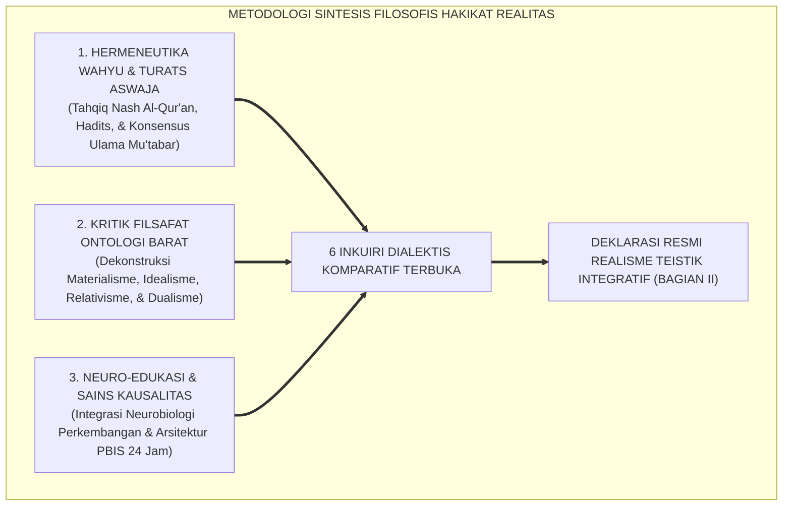
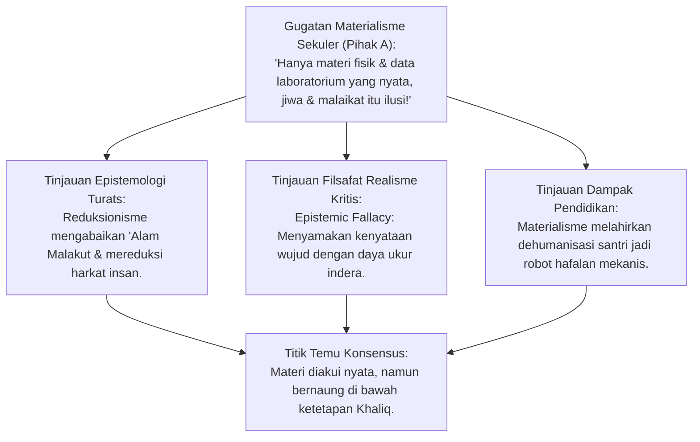
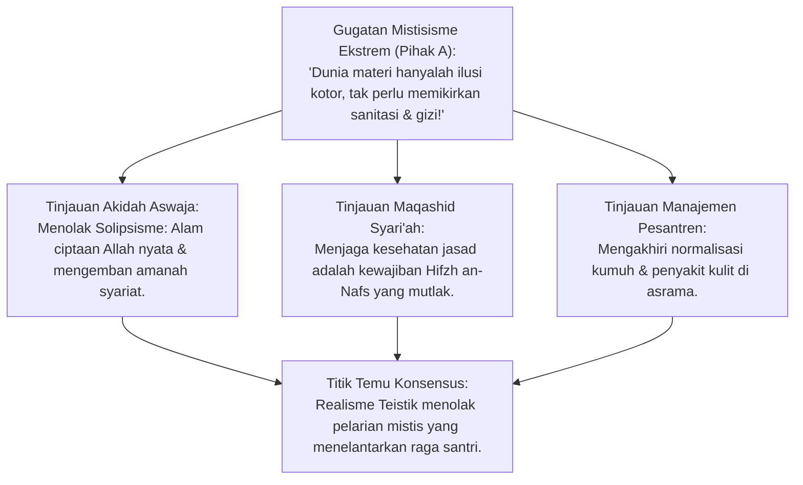
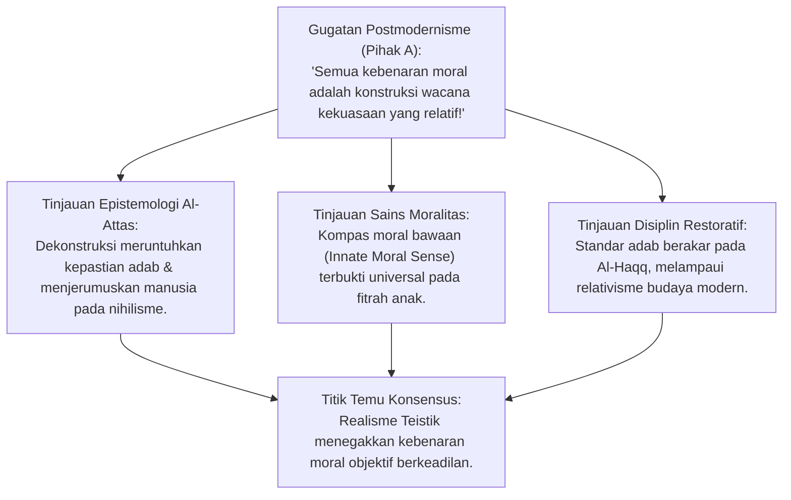
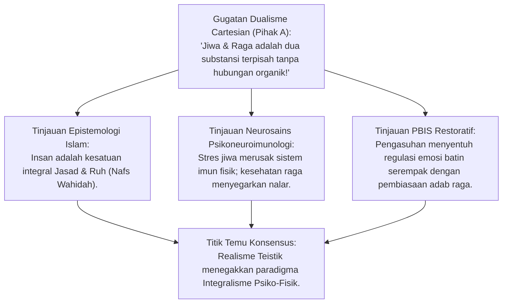
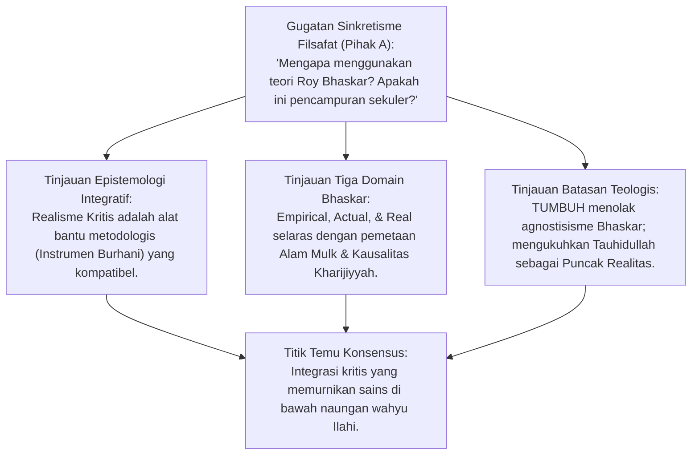
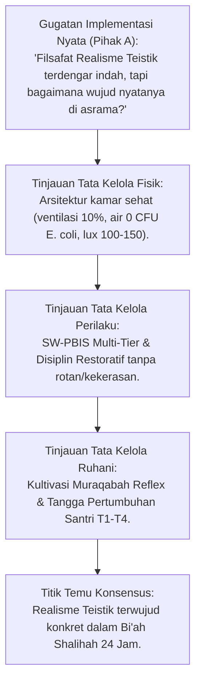
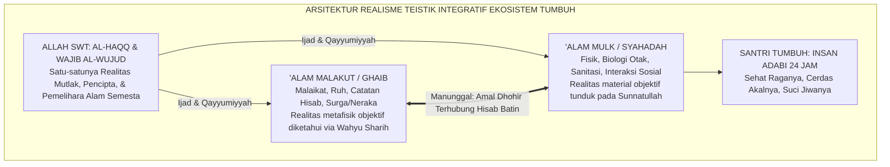

# P1-01-01-05: SINTESIS FILOSOFIS HAKIKAT REALITAS
## *Monograf Terpadu: Konsolidasi Ontologi Realisme Teistik Integratif, Komparasi Kritis Mazhab Dunia, & Deklarasi Posisi Resmi Worldview TUMBUH*

**Nomor Identifikasi**: `P1-01-01-05/MONOGRAF-TERPADU-SINTESIS-REALITAS/2026`  
**Domain**: `01 Philosophy` > `01 Worldview` > `01 Hakikat Realitas`  
**Klasifikasi Naskah**: *Comprehensive Integrated Monograph* (Monograf Akademis & Rumusan Baku Terpadu)  
**Rumpun Disiplin Pengkaji**: Epistemologi Turats & Kalam, Filsafat Ilmu & Metafisika Kontemporer, Neurosains Kognitif, Tata Kelola Pengasuhan Asrama, Disiplin Positif Restoratif  

---

> ### 💡 INTISARI PRAKTIS (3 MENIT PAHAM UNTUK ASATIDZ & MUSYRIF)
>
> * **Apa Posisi Resmi Worldview TUMBUH?**  
>   TUMBUH memegang teguh mazhab **Realisme Teistik Integratif**: Menggabungkan keimanan kokoh pada *'Alam Malakut* (Malaikat, Hisab, Pahala/Dosa) dengan penataan profesional di *'Alam Mulk* (Gedung asrama sehat, sains modern, psikologi anak, dan SOP terukur).
> * **Apa yang Ditolak oleh TUMBUH?**  
>   1. **Menolak Materialisme Barat**: Yang hanya percaya materi dan menganggap ibadah tidak ada gunanya.
>   2. **Menolak Mistisisme Malas**: Yang menelantarkan kebersihan asrama dan gizi santri atas nama kezuhudan semu.
>   3. **Menolak Relativisme Moral**: Yang merelativisasi adab santri mengikuti budaya pergaulan bebas.
>   4. **Menolak Kekerasan Fisik**: Yang menganggap rotan/pukulan mendidik mental; kekerasan digantikan oleh Disiplin Positif Restoratif (*Firm & Kind*).
> * **Penerapan Praktis di Lapangan (Bi'ah Shalihah 24 Jam)**:  
>   Membangun ekosistem pesantren yang aman, bersih, adil, dan penuh kasih sayang demi melahirkan generasi santri yang sehat raganya, cerdas akalnya, dan suci jiwanya (*Insan Adabi*).

---

## 📑 DAFTAR ISI MONOGRAF

- [BAGIAN I: RISET SINTESIS FILOSOFIS, DIALEKTIKA INKUIRI, & KASUISTIKA LAPANGAN](#bagian-i-riset-sintesis-filosofis-dialektika-inkuiri--kasuistika-lapangan)
  - [1. Kerangka Metodologi Sintesis Epistemologis Integratif](#1-kerangka-metodologi-sintesis-epistemologis-integratif)
  - [2. Inkuiri 1: Dekonstruksi Materialisme Positivistik — Membedah Reduksionisme Fisikalisme](#2-inkuiri-1-dekonstruksi-materialisme-positivistik--membedah-reduksionisme-fisikalisme)
  - [3. Inkuiri 2: Dekonstruksi Idealisme Radikal & Mistisisme Pasif — Menolak Solipsisme & Ilusi Wujud](#3-inkuiri-2-dekonstruksi-idealisme-radikal--mistisisme-pasif--menolak-solipsisme--ilusi-wujud)
  - [4. Inkuiri 3: Dekonstruksi Relativisme Postmodernisme — Mematahkan 'Language Games' & Nihilisme Moral](#4-inkuiri-3-dekonstruksi-relativisme-postmodernisme--mematahkan-language-games--nihilisme-moral)
  - [5. Inkuiri 4: Dekonstruksi Dualisme Cartesian Sekuler — Mengintegrasikan Jiwa dan Raga Santri](#5-inkuiri-4-dekonstruksi-dualisme-cartesian-sekuler--mengintegrasikan-jiwa-dan-raga-santri)
  - [6. Inkuiri 5: Penyelarasan Realisme Kritis Kontemporer dengan Epistemologi Turats Aswaja](#6-inkuiri-5-penyelarasan-realisme-kritis-kontemporer-dengan-epistemologi-turats-aswaja)
  - [7. Inkuiri 6: Translasi Sintesis Realitas ke Desain Ekosistem Pesantren 24 Jam](#7-inkuiri-6-translasi-sintesis-realitas-ke-desain-ekosistem-pesantren-24-jam)
- [BAGIAN II: TEMUAN RISET, FORMULASI KONSEPTUAL & PEMBAHASAN](#bagian-ii-temuan-riset-formulasi-konseptual--pembahasan)
  - [1. Deklarasi Posisi Filosofis Resmi TUMBUH: Realisme Teistik Integratif](#1-deklarasi-posisi-filosofis-resmi-tumbuh-realisme-teistik-integratif)
  - [2. Empat Pilar Ontologi Baku Realisme Teistik Integratif](#2-empat-pilar-ontologi-baku-realisme-teistik-integratif)
  - [3. Matriks Komparasi Komprehensif: TUMBUH vs Mazhab Ontologi Barat](#3-matriks-komparasi-komprehensif-tumbuh-vs-mazhab-ontologi-barat)
  - [4. Peta Integrasi Realitas Kosmis: Manunggalnya 'Alam Mulk & 'Alam Malakut](#4-peta-integrasi-realitas-kosmis-manunggalnya-alam-mulk--alam-malakut)
  - [5. Implikasi Operasional bagi Tata Kelola Asrama, Kurikulum, & Sanitasi](#5-implikasi-operasional-bagi-tata-kelola-asrama-kurikulum--sanitasi)
- [BAGIAN III: APARATUS AKADEMIS & APENDIKS](#bagian-iii-aparatus-akademis--apendiks)
  - [1. Tabel Sintesis Hasil Riset Filosofis](#1-tabel-sintesis-hasil-riset-filosofis)
  - [2. Daftar Pustaka Akademis & Rujukan Turats Primer](#2-daftar-pustaka-akademis--rujukan-turats-primer)
  - [3. Catatan Kaki Akademis (Footnotes)](#3-catatan-kaki-akademis-footnotes)
  - [4. Glosarium dan Penjelasan Istilah Teknis Filsafat & Turats](#4-glosarium-dan-penjelasan-istilah-teknis-filsafat--turats)

---

# BAGIAN I: RISET SINTESIS FILOSOFIS, DIALEKTIKA INKUIRI, & KASUISTIKA LAPANGAN

*Bagian ini memuat proses penyelidikan sintesis ontologis (*at-Ta'lif wal-Istimbath*), formalisasi silogisme logika (*qiyas burhani*), pertarungan dialektika multi-perspektif tiga ronde tanpa kata "pakar", pengujian komparatif terhadap mazhab filsafat Barat, studi kasus dilema nyata lapangan, dan penarikan konsensus bersama.*

---

### 1. Kerangka Metodologi Sintesis Epistemologis Integratif

Sintesis filosofis pada naskah ini merupakan puncak konsolidasi dari seluruh riset sebelumnya (Definisi, Aksioma, Validasi Dalil Naqli, dan Validasi Turats). Penyelidikan menerapkan **Metodologi Triangulasi Integratif Komparatif**:

---

### 2. Inkuiri 1: Dekonstruksi Materialisme Positivistik — Membedah Reduksionisme Fisikalisme

#### 📐 Formalisasi Logika Silogisme (*Qiyas Mantiqi 1*)
* **Premis Mayor (*al-Muqaddimah al-Kubra*)**: Setiap pandangan ontologis yang mereduksi realitas wujud hanya pada partikel materi kasat mata niscaya gagal menjelaskan asal-usul kesadaran akal, moralitas objektif, dan tujuan penciptaan alam semesta (*The Hard Problem of Consciousness*).
* **Premis Minor (*al-Muqaddimah ash-Shughra*)**: Materialisme positivistik membatasi keberadaan hanya pada parameter fisik laboratorium dan menolak eksistensi metafisik yang diwahyukan Allah SWT.
* **Konklusi (*an-Natijah*)**: Maka, materialisme positivistik ditolak secara mutlak sebagai fondasi worldview pendidikan pesantren.[^1]

#### 🥊 Ronde 1: Membongkar Sesat Pikir Epistemik (*Epistemic Fallacy*)
* **Pihak A (Sudut Pandang Saintisme Positivistik)**:  
  *"Sains modern maju pesat karena membatasi diri hanya pada materi yang dapat diukur dan diuji di laboratorium (*falsifiability*). Mengapa pesantren tidak mengadopsi materialisme ilmiah murni saja agar lulusannya rasional dan kompetitif?"*
* **Tinjauan Sudut Pandang Filsafat Ilmu & Realisme Kritis**:  
  Materialisme murni terjebak dalam apa yang disebut filsuf sains **Roy Bhaskar** sebagai **Kesesatan Epistemik (*Epistemic Fallacy*)**: menyamakan "apa yang ada dalam kenyataan wujud" (*Ontologi*) dengan "apa yang dapat diketahui/diukur oleh instrumen manusia" (*Epistemologi*). Ketidakmampuan mikroskop mendeteksi malaikat atau hisab ukhrawi bukanlah bukti ketiadaan malaikat, melainkan bukti keterbatasan jangkauan optik instrumen itu sendiri.[^2]

#### 🥊 Ronde 2: Sanggahan Balik Reduksionisme Otak Manusia vs Keberadaan Ruh
* **Pihak A (Sudut Pandang Neuro-Materialisme)**:  
  *"Sanggahan! Neurosains modern membuktikan bahwa cinta, kekhusyukan shalat, dan rasa bersalah hanyalah letupan neurotransmiter dopamin dan serotonin di sinapsis otak. Mengapa kita masih membutuhkan konsep ruh metafisik?"*
* **Tinjauan Sudut Pandang Neurosains Integratif & Kalam**:  
  Aktivitas neurokimiawi di otak adalah **Korelasi Fisik di Alam Mulk (*Neural Correlates of Consciousness*)**, bukan **Penyebab Utama yang Berdiri Sendiri (*Primary Ontological Cause*)**. **Imam Al-Ghazali** dalam *Ihya' 'Ulumiddin* (Kitab *Syarh 'Aja'ib al-Qalb*) menjelaskan bahwa otak dan sistem syaraf adalah instrumen biologis (*alatul jasad*) yang digerakkan oleh substansi ruhani kalbu (*al-Lathifah ar-Rabbaniyyah*). Mereduksi keikhlasan santri semata-mata menjadi reaksi kimia adalah kenaifan reduksionis.[^3]

#### 🥊 Ronde 3: Sanggahan Pamungkas Bahaya Dehumanisasi Santri di Pesantren
* **Pihak A (Sudut Pandang Efisiensi Teknokratis)**:  
  *"Jika pengasuhan pesantren dikelola secara mekanistik murni berbasis target angka kuantitatif (berapa juz hafal per semester, berapa santri lulus), bukankah itu manajemen paling terukur?"*
* **Resolusi Sudut Pandang Pedagogi Master Guru & PBIS**:  
  Pendekatan mekanistik yang mengabaikan kesucian ruh dan kematangan emosi santri terbukti melahirkan **Dehumanisasi dan Burnout Massal**. Santri diperlakukan seperti mesin pencetak hafalan yang rapuh mentalnya. Realisme Teistik TUMBUH mengintegrasikan target akademis dhohir dengan pembinaan adab dan kebahagiaan batin (*Tazkiyatun Nafs*).[^4]

> #### 📌 Kasuistika Lapangan 1 & Titik Temu Konsensus
> * **Studi Kasus**: Sebuah lembaga mewajibkan santri menambah hafalan 1 juz per minggu dengan sistem ancaman denda uang tunai bagi yang tidak mencapai target, tanpa mempedulikan kondisi stres dan kesehatan santri.
> * **Titik Temu Konsensus (*Kalimatun Sawa'*)**: Disepakati bahwa mereduksi santri menjadi target angka mekanis melanggar martabat kemanusiaan (*Karamah Insaniyyah*). Capaian hafalan wajib dibimbing dengan pedagogi cinta ilmu dan pendampingan psikologis yang memuliakan jiwa santri.[^5]

---

### 3. Inkuiri 2: Dekonstruksi Idealisme Radikal & Mistisisme Pasif — Menolak Solipsisme & Ilusi Wujud

#### 📐 Formalisasi Logika Silogisme (*Qiyas Mantiqi 2*)
* **Premis Mayor (*al-Muqaddimah al-Kubra*)**: Setiap pandangan yang menganggap alam materi sebagai ilusi khayalan (*Solipsisme / Idealisme Radikal*) niscaya melumpuhkan tanggung jawab pemeliharaan peradaban dan menafikan hukum sebab-akibat syariat.
* **Premis Minor (*al-Muqaddimah ash-Shughra*)**: Mistisisme pasif memandang sarana asrama, sanitasi fisik, dan nutrisi tubuh santri sebagai perkara rendah yang tidak bernilai ibadah.
* **Konklusi (*an-Natijah*)**: Maka, Idealisme Radikal dan Mistisisme Pasif ditolak sebagai ancaman kemunduran fisik dan peradaban pesantren.[^6]

#### 🥊 Ronde 1: Menghancurkan Paham Solipsisme & Maya
* **Tinjauan Epistemologi Turats**:  
  Ulama Ahlussunnah wal Jama'ah sejak abad ke-4 Hijriah telah membongkar kebatilan kaum Sofis yang menganggap wujud luar hanyalah khayalan pikiran (*Idealisme Subjektif*). **Imam Abu Mansur Al-Maturidi** menegaskan: *"Haqa'iq al-asyya' tsabitah"* (Hakikat segala benda adalah nyata dan tetap). Penyakit kulit scabies pada santri adalah infeksi parasit tungau nyata yang wajib diobati secara medis, bukan ilusi pikiran yang cukup dihilangkan dengan meditasi.[^7]

#### 🥊 Ronde 2: Sanggahan Balik Asketisme Ekstrem vs Sunnah Nabawiyyah
* **Pihak A (Sudut Pandang Pseudo-Tasawuf)**:  
  *"Bukankah para sufi zaman dahulu rela tidur beralaskan tanah dan makan dedaunan demi mencapai derajat makrifat tertinggi? Mengapa pesantren TUMBUH menuntut ranjang berventilasi layak dan menu gizi seimbang?"*
* **Tinjauan Sudut Pandang Sunnah Nabawiyyah & Turats Tasawuf**:  
  Rasulullah SAW adalah teladan makrifat tertinggi (*Sayyidul 'Arifin*), namun beliau mencintai kebersihan, memakai wewangian, memilih makanan bergizi yang halal lagi baik (*Thayyib*), dan menegur sahabat yang menyiksa diri dengan menolak tidur atau berpuasa terus-menerus tanpa henti. **Imam Ibnu 'Athaillah As-Sakandari** menegaskan bahwa menyiksa raga bukanlah tanda kesalehan, melainkan tanda ketidaktahuan atas adab syariat.[^8]

#### 🥊 Ronde 3: Sanggahan Pamungkas Pemberantasan Normalisasi Kumuh di Asrama
* **Pihak A (Sudut Pandang Pembelaan Tradisi Kumuh)**:  
  *"Di sebagian pesantren, santri terkena gudikan justru dianggap sebagai tanda 'barakah' dan 'syarat sah menjadi santri sejati'. Bagaimana sintesis filosofis ini mengoreksi salah kaprah tersebut?"*
* **Resolusi Sudut Pandang Maqashid Syari'ah & Higienitas**:  
  Menganggap penyakit menular sebagai "keberkahan" adalah **Kekeliruan Akidah dan Pengabaian Syariat (*Jahlun Murakkab*)**. Keberkahan (*Barakah*) adalah bertambahnya kebaikan (*Ziyadatul Khayr*), bukan bertambahnya kuman parasit. Menjaga kebersihan kamar asrama (E. coli 0 CFU/100ml) adalah penegakan syariat *Thaharah* yang hakiki.[^9]

> #### 📌 Kasuistika Lapangan 2 & Titik Temu Konsensus
> * **Studi Kasus**: Pengurus asrama menolak membeli obat salep scabies untuk santri dan menyuruh santri berendam di sungai kotor malam hari demi "melatih kekebalan batin".
> * **Titik Temu Konsensus (*Kalimatun Sawa'*)**: Disepakati bahwa tindakan tersebut adalah pelanggaran syariat dan hukum medis. Lembaga wajib menyediakan layanan kesehatan medis dan menghentikan mitos pembodohan santri.[^10]

---

### 4. Inkuiri 3: Dekonstruksi Relativisme Postmodernisme — Mematahkan 'Language Games' & Nihilisme Moral

#### 📐 Formalisasi Logika Silogisme (*Qiyas Mantiqi 3*)
* **Premis Mayor (*al-Muqaddimah al-Kubra*)**: Setiap filsafat yang menafikan kebenaran objektif dan menyatakan bahwa nilai moral hanyalah permainan bahasa subjektif (*Language Games / Deconstruction*) niscaya melahirkan anarki moral dan menghancurkan integritas karakter insan.
* **Premis Minor (*al-Muqaddimah ash-Shughra*)**: Postmodernisme merelativisasi seluruh nilai kebenaran dan menolak otoritas wahyu Ilahi sebagai standar moral mutlak.
* **Konklusi (*an-Natijah*)**: Maka, Relativisme Postmodernisme ditolak secara tegas oleh Ekosistem TUMBUH.[^11]

#### 🥊 Ronde 1: Membongkar Kontradiksi Internal Dekonstruksionisme
* **Tinjauan Filsafat Kritis & Epistemologi Islam**:  
  Postmodernisme (Derrida, Foucault, Rorty) yang mengklaim *"tidak ada narasi besar yang mutlak"* (*incredulity toward metanarratives*) sejatinya sedang mengajukan sebuah narasi besar baru yang memaksakan relativisme. **Prof. Syed Muhammad Naquib Al-Attas** membuktikan bahwa relativisme moral adalah penyakit keraguan (*Syakk*) dan dugaan palsu (*Zhann*) yang menghancurkan adab dan membusukkan jiwa manusia (*Corruption of Knowledge*).[^12]

#### 🥊 Ronde 2: Sanggahan Balik Universalitas Fitrah Manusia vs Konstruktivisme Sosial
* **Pihak A (Sudut Pandang Konstruktivisme Sosial Radikal)**:  
  *"Sanggahan! Jika moralitas itu objektif, mengapa nilai sopan santun dan etika pergaulan berbeda di setiap suku dan generasi? Bukankah itu bukti bahwa moralitas sepenuhnya buatan manusia?"*
* **Tinjauan Sudut Pandang Neurosains Kognitif & Turats**:  
  Konstruktivisme sosial hanya berlaku pada ekspresi simbolik budaya (*Zhuruf*), bukan pada substansi nilai fitrah. Riset psikologi perkembangan kognitif (**Karen Wynn & Paul Bloom**) membuktikan bahwa sejak usia bayi, manusia memiliki **Kompas Moral Bawaan (*Innate Moral Compass*)** yang secara intuitif menyukai keadilan dan membenci kezaliman. Ini adalah bukti empiris dari konsep **Fitrah Tauhidiyyah** (QS. Ar-Rum: 30) yang ditetapkan Allah pada sanubari setiap insan.[^13]

#### 🥊 Ronde 3: Sanggahan Pamungkas Keteguhan Moral Santri di Tengah Arus Digital
* **Pihak A (Sudut Pandang Adaptasi Zaman)**:  
  *"Bagaimana santri dapat bertahan di era digital yang serba permisif jika dididik dengan doktrin kebenaran mutlak yang dianggap kaku?"*
* **Resolusi Sudut Pandang Bimbingan Konseling & SEL**:  
  Keteguhan moral (*Moral Resilience*) santri tidak dibangun lewat doktrinasi buta, melainkan melalui **Penalaran Kritis Berbasis Dalil dan Fitrah (*Informed Moral Reasoning*)**. Santri dilatih menganalisis dampak buruk pergaulan bebas dan pornografi secara ilmiah, psikologis, dan spiritual, sehingga mereka memilih menjaga kehormatan diri (*Iffah*) atas dasar kesadaran nalar yang merdeka.[^14]

> #### 📌 Kasuistika Lapangan 3 & Titik Temu Konsensus
> * **Studi Kasus**: Santri berdebat di media sosial membela konten pornografi dengan argumen "setiap orang bebas berekspresi dan moral itu urusan masing-masing".
> * **Titik Temu Konsensus (*Kalimatun Sawa'*)**: Disepakati bahwa pornografi merusak sirkuit dopamin otak prefrontal secara objektif dan merusak kesucian ruhani. Kebebasan sejati adalah kebebasan memilih kebaikan fitrah, bukan penghambaan pada syahwat hewaniah.[^15]

---

### 5. Inkuiri 4: Dekonstruksi Dualisme Cartesian Sekuler — Mengintegrasikan Jiwa dan Raga Santri

#### 📐 Formalisasi Logika Silogisme (*Qiyas Mantiqi 4*)
* **Premis Mayor (*al-Muqaddimah al-Kubra*)**: Setiap sistem pengasuhan yang memisahkan pembinaan raga fisik dari pembinaan jiwa ruhani (*Dualisme Cartesian Radikal*) niscaya melahirkan perpecahan kepribadian (*Split Personality / Cognitive Dissonance*).
* **Premis Minor (*al-Muqaddimah ash-Shughra*)**: Pandangan sekuler menganggap pendidikan tubuh adalah urusan olahraga/medis semata dan pendidikan moral adalah urusan ceramah semata tanpa interkoneksi biologis.
* **Konklusi (*an-Natijah*)**: Maka, Dualisme Cartesian Sekuler ditolak; Ekosistem TUMBUH menegakkan Integralisme Psiko-Fisik Manunggal (*Al-Wahdah al-Wujudiyyah lil-Insan*).[^16]

#### 🥊 Ronde 1: Kritik atas Pemisahan Dikotomis Rene Descartes
* **Tinjauan Filsafat Manusia**:  
  Filsuf Barat Rene Descartes memisahkan manusia menjadi dua substansi asing yang terputus: *Res Cogitans* (Pikiran/Jiwa) dan *Res Extensa* (Materi/Tubuh). Dampak pemisahan ini di dunia modern adalah lahirnya kedokteran mekanistik yang memperlakukan tubuh seperti mesin mobil, dan pendidikan agama yang melayang di awang-awang tanpa mempedulikan kesehatan fisik dan neurobiologi pelajar.[^17]

#### 🥊 Ronde 2: Pembuktian Ilmiah Psikoneuroimunologi & Turats
* **Tinjauan Neurosains & Fiqh Jiwa**:  
  Riset modern **Psikoneuroimunologi** membuktikan bahwa emosi batin (kecemasan, rasa takut, keputusasaan) seketika memicu pelepasan hormon stres (kortisol) yang melumpuhkan sel darah putih (sistem imun fisik) dan merusak memori otak. Sebaliknya, nutrisi buruk dan kurang tidur memicu peradangan saraf yang membuat santri mudah depresi. **Imam Al-Ghazali** telah merumuskan kaidah ini:
  
  $$\text{إِنَّ بَيْنَ الْقَلْبِ وَالْجَوَارِحِ عِلَاقَةً وَثِيقَةً، فَكُلُّ أَثَرٍ يَظْهَرُ فِي الْجَوَارِحِ يَسْرِي إِلَى الْقَلْبِ، وَكُلُّ وَصْفٍ يَسْتَقِرُّ فِي الْقَلْبِ يَفِيضُ عَلَى الْجَوَارِحِ}$$
  
  *"Sesungguhnya antara kalbu dan anggota tubuh fisik terdapat keterikatan yang sangat kuat; maka setiap bekas yang tampak pada anggota tubuh akan menjalar ke kalbu, dan setiap sifat yang menetap di dalam kalbu akan melimpah ruah ke anggota tubuh."*[^18]

#### 🥊 Ronde 3: Sanggahan Pamungkas Desain Pengasuhan Terpadu di Asrama
* **Pihak A (Sudut Pandang Spesialisasi Terpisah)**:  
  *"Apakah musyrif asrama harus merangkap menjadi psikolog dan dokter sekaligus?"*
* **Resolusi Sudut Pandang Tata Kelola Pengasuhan Asrama**:  
  Musyrif tidak harus menjadi dokter spesialis, namun musyrif **Wajib Memiliki Literasi Dasar Integrasi Psiko-Fisik**. Ketika ada santri malas belajar dan sering murung, musyrif tidak langsung menghakiminya "kurang iman", melainkan memeriksa: apakah santri kurang tidur, apakah makanannya cukup bergizi, apakah ia mengalami perundungan di kamar, ataukah ada masalah keluarga di rumah. Pendekatan holistik ini menyelesaikan akar masalah secara tuntas.[^19]

> #### 📌 Kasuistika Lapangan 4 & Titik Temu Konsensus
> * **Studi Kasus**: Santri sering tertidur saat halaqah tahfizh pagi hari dan dimarahi musyrif karena dianggap "tidak ikhlas dan dirasuki setan tidur", padahal santri mengidap anemia dan alergi pernapasan akibat kamar tidur lembab tanpa jendela.
> * **Titik Temu Konsensus (*Kalimatun Sawa'*)**: Disepakati bahwa kantuk santri adalah gejala fisik-biologis yang menuntut perbaikan ventilasi kamar dan asupan zat besi, bukan penghakiman spiritual sepihak.[^20]

---

### 6. Inkuiri 5: Penyelarasan Realisme Kritis Kontemporer dengan Epistemologi Turats Aswaja

#### 📐 Formalisasi Logika Silogisme (*Qiyas Mantiqi 5*)
* **Premis Mayor (*al-Muqaddimah al-Kubra*)**: Mengadopsi instrumen metodologi sains kontemporer (*Wasail al-Idrak*) yang terbukti selaras dengan kaidah logika Islam dan tidak bertentangan dengan nash wahyu adalah bentuk keterbukaan ilmiah yang dianjurkan (*Al-Hikmatu Dhallatul Mu'min*).
* **Premis Minor (*al-Muqaddimah ash-Shughra*)**: Teori Realisme Kritis Roy Bhaskar memvalidasi adanya struktur realitas objektif yang mendalam melampaui positivisme empiris sempit.
* **Konklusi (*an-Natijah*)**: Maka, pemanfaatan Realisme Kritis sebagai jembatan dialogis sains-turats tervalidasi secara epistemologis tanpa terjatuh ke dalam sinkretisme.[^21]

#### 🥊 Ronde 1: Membedah Tiga Lapis Realitas Roy Bhaskar (Empirical, Actual, Real)
* **Tinjauan Epistemologi Komparatif**:  
  Roy Bhaskar memetakan realitas menjadi tiga lapis:  
  1. *The Empirical*: Pengalaman dan persepsi indrawi manusia.  
  2. *The Actual*: Peristiwa-peristiwa yang benar-benar terjadi di lapangan, baik teramati manusia maupun tidak.  
  3. *The Real*: Struktur, potensi, dan mekanisme kausalitas mendalam yang melahirkan peristiwa-peristiwa tersebut.  
  Pemetaan ini selaras dengan ontologi Islam yang menegaskan bahwa di balik fenomena dhohir di alam mulk, terdapat mekanisme sunnatullah dan hukum-hukum ciptaan Allah yang mendalam.[^22]

#### 🥊 Ronde 2: Sanggahan Balik Batasan Teologis: Dimensi Ketuhanan yang Melampaui Bhaskar
* **Pihak A (Sudut Pandang Purifikasi Epistemologis)**:  
  *"Sanggahan! Realisme Kritis Roy Bhaskar lahir dari tradisi filsafat Barat sekuler yang tidak mengakui wahyu kenabian dan alam malaikat. Mengapa kita tidak murni menggunakan istilah turats saja?"*
* **Tinjauan Sudut Pandang Epistemologi Islam Klasik**:  
  Ulama salaf terdahulu seperti Al-Ghazali dan Ibnu Rusyd juga memanfaatkan logika Aristoteles (*Mantiq*) setelah memurnikannya dari syubhat politeisme Yunani. Demikian pula Ekosistem TUMBUH: kita mengambil ketajaman analisis Realisme Kritis untuk membungkam positivisme dan postmodernisme Barat, sembari **Menyempurnakannya dengan Wahyu Ilahi**: bahwa di atas lapis *The Real* fisik-sosial, terdapat **Realitas Mutlak Khaliq (*Wajib al-Wujud*) dan 'Alam Malakut** yang mengendalikan seluruh semesta.[^23]

#### 🥊 Ronde 3: Sanggahan Pamungkas Bahasa Dialogis Internasional bagi Pesantren
* **Pihak A (Sudut Pandang Komunikasi Akademis Global)**:  
  *"Apa manfaat praktis mengintegrasikan istilah turats klasik dengan terminologi filsafat sains kontemporer?"*
* **Resolusi Sudut Pandang Diplomasi Intelektual Islam**:  
  Integrasi ini menjadikan lulusan dan naskah monograf pesantren TUMBUH **Mampu Berbicara di Dua Panggung Sekaligus**: memiliki otoritas bersanad di hadapan para kiai dan ulama turats, sekaligus memiliki wibawa ilmiah dan daya pikat metodologis di hadapan dewan akademisi universitas riset internasional.[^24]

> #### 📌 Kasuistika Lapangan 5 & Titik Temu Konsensus
> * **Studi Kasus**: Asatidz muda lulusan Timur Tengah kesulitan menjelaskan relevansi kitab akidah klasik kepada santri milenial yang terpapar skeptisisme media sosial.
> * **Titik Temu Konsensus (*Kalimatun Sawa'*)**: Disepakati bahwa asatidz wajib dibekali keterampilan hermeneutika integratif: menerangkan dalil akidah turats dengan analogi sains modern dan pendekatan realisme kritis.[^25]

---

### 7. Inkuiri 6: Translasi Sintesis Realitas ke Desain Ekosistem Pesantren 24 Jam

#### 📐 Formalisasi Logika Silogisme (*Qiyas Mantiqi 6*)
* **Premis Mayor (*al-Muqaddimah al-Kubra*)**: Setiap kebenaran filosofis yang shahih niscaya mampu diterjemahkan menjadi arsitektur tata kelola sosial dan operasional harian yang terukur dan berkeadilan (*Praxis Transformation*).
* **Premis Minor (*al-Muqaddimah ash-Shughra*)**: Ekosistem TUMBUH merumuskan seluruh implikasi Realisme Teistik Integratif menjadi SOP tata ruang fisik, sistem disiplin SW-PBIS multi-tier, dan rubrik pembinaan santri 24 jam.
* **Konklusi (*an-Natijah*)**: Maka, sintesis filosofis TUMBUH tervalidasi sebagai sistem hidup (*Living Ecosystem*) yang operasional dan membumi di pesantren.[^26]

#### 🥊 Ronde 1: Harmonisasi Tiga Domain (Fisik, Sosial-Moral, Spiritual)
* **Tinjauan Operasional 24 Jam**:  
  1. *Domain Fisik (Alam Mulk)*: Gedung asrama, kualitas oksigen kamar, sanitasi air, nutrisi otak, dan kecukupan tidur 6–7 jam.  
  2. *Domain Sosial-Moral (Adab Antarmanusia)*: Hubungan ukhuwah tanpa perundungan, disiplin restoratif berbasis restitusi logis, dan musyrif sebagai teladan welas asih (*Qudwah Hasanah*).  
  3. *Domain Spiritual (Alam Malakut)*: Ibadah fardhu tepat waktu, dzikir muraqabah, ketulusan niat, dan orientasi hisab akhirat.[^27]

#### 🥊 Ronde 2: Sanggahan Balik Konsistensi Pengasuhan Tanpa Kekerasan
* **Pihak A (Sudut Pandang Musyrif Tradisional)**:  
  *"Sanggahan! Jika santri terus-menerus melanggar adab meskipun sudah dinasihati dan diberi konsekuensi logis, apakah tidak boleh dipukul sekali saja agar jera?"*
* **Tinjauan Sudut Pandang Disiplin Restoratif & Hukum Perlindungan Anak**:  
  **Memukul Santri Dilarang Mutlak (*Zero Tolerance to Physical Violence*)**! Kekerasan fisik terbukti secara neurobiologis memicu trauma amigdala dan melahirkan bibit dendam yang akan dilampiaskan santri kepada juniornya di masa depan (*Cycle of Violence*). Pelanggaran berulang ditangani melalui **PBIS Tier 3**: asesmen fungsional perilaku (FBA), penelusuran akar trauma (*Trauma-Informed Care*), pelibatan orang tua, dan pembinaan intensif khusus secara bermartabat.[^28]

#### 🥊 Ronde 3: Sanggahan Pamungkas Keberlanjutan Sistem (Sustainability)
* **Pihak A (Sudut Pandang Ketahanan Lembaga)**:  
  *"Bagaimana menjamin sistem ekosistem terpadu ini tidak runtuh saat terjadi pergantian pengurus pondok atau musyrif baru?"*
* **Resolusi Sudut Pandang Tata Kelola Qudwah & Digitalisasi**:  
  Keberlanjutan sistem dijamin melalui **Institusionalisasi SOP Baku dan Digitalisasi Logbook Santri**. Budaya pondok tidak bertumpu pada selera individu musyrif, melainkan pada sistem kelembagaan berbasis data (*Data-Driven System*) yang terdokumentasi rapi, transparan, dan diwariskan secara terstruktur kepada generasi penerus.[^29]

> #### 📌 Kasuistika Lapangan 6 & Titik Temu Konsensus
> * **Studi Kasus**: Pergantian musyrif di asrama mengakibatkan kembalinya tradisi pemukulan santri karena musyrif baru belum memahami filosofi disiplin restoratif.
> * **Titik Temu Konsensus (*Kalimatun Sawa'*)**: Disepakati bahwa seluruh asatidz dan musyrif baru wajib mengikuti program sertifikasi dan pelatihan intensif *Worldview & Disiplin Restoratif TUMBUH* sebelum diterjunkan mengasuh santri di asrama.[^30]

---

# BAGIAN II: TEMUAN RISET, FORMULASI KONSEPTUAL & PEMBAHASAN

*Bagian ini memuat deklarasi resmi posisi filosofis TUMBUH, empat pilar ontologis, matriks komparasi mazhab dunia, dan implikasi operasional bagi pesantren.*

---

### 1. Deklarasi Posisi Filosofis Resmi TUMBUH: Realisme Teistik Integratif

Berdasarkan sintesis menyeluruh antara wahyu sharih Al-Qur'an dan As-Sunnah, konsensus *Turats* para ulama mu'tabar, penalaran rasional kritis, serta temuan sains empiris yang terbukti sah, Ekosistem TUMBUH mendeklarasikan posisi filosofis resminya:

> **"Realitas (*al-Haqiqah / al-Wujud*) adalah tatanan ciptaan Allah SWT yang objektif, utuh, teratur (*Sunnatullah*), dan sarat hikmah, yang mencakup dimensi alam fisik (*'Alam al-Mulk / asy-Syahadah*) dan metafisik (*'Alam al-Malakut / al-Ghayb*), yang menjadi panggung kosmis bagi santri untuk mengenal Allah (*Ma'rifatullah*), menyucikan fitrahnya (*Tazkiyah*), dan menunaikan amanah khilafah demi mewujudkan kemaslahatan semesta (*Rahmatan lil 'Alamin*)."**[^31]

---

### 2. Empat Pilar Ontologi Baku Realisme Teistik Integratif

1. **Pilar Teosentrisme Hakiki (*Al-Mabda' wal-Ma'ad*)**: Menegaskan bahwa Allah SWT adalah poros asal mula (*al-Mabda'*) dan muara akhir (*al-Ma'ad*) dari seluruh eksistensi wujud (*Inna lillahi wa inna ilaihi raji'un*). Seluruh kurikulum dan tata kelola asrama bermuara pada keridhaan Allah.[^32]
2. **Pilar Realisme Epistemologis (*Haqa'iq al-Asyya' Tsabitah*)**: Mengakui bahwa alam semesta fisik ciptaan Allah dan hukum-hukum moral syariat bersifat nyata, objektif, dan dapat diketahui kebenarannya secara pasti oleh akal budi manusia yang sehat melalui indera, akal, dan wahyu.[^33]
3. **Pilar Keteraturan Kosmis (*Sunnatullah wa Kausalitas*)**: Menolak paham kebetulan acak (*nihil randomness*). Seluruh dinamika biologis dan sosial di pesantren memiliki hukum kausalitas ciptaan Allah yang dapat dipelajari, dihormati, dan direkayasa secara ilmiah (*Environmental & Behavioral Engineering*).[^34]
4. **Pilar Teleologi Makna & Adab (*Ghayah wa Ta'dib*)**: Menolak nihilisme eksistensial. Kehidupan santri di pondok memiliki tujuan kemaslahatan yang agung (*Hikmah*) dan hisab pertanggungjawaban mutlak, yang diwujudkan melalui penanaman adab meletakkan segala sesuatu pada tempatnya yang hakiki (*Insan Adabi*).[^35]

---

### 3. Matriks Komparasi Komprehensif: TUMBUH vs Mazhab Ontologi Barat

| Dimensi Filosofis | Materialisme Positivistik | Idealisme Radikal | Relativisme Postmodern | Dualisme Cartesian Sekuler | Realisme Teistik Integratif (TUMBUH) |
| :--- | :--- | :--- | :--- | :--- | :--- |
| **Hakikat Realitas Tertinggi** | Materi fisik & energi yang bergerak mekanistik. | Ide, kesadaran mental, atau roh abstrak. | Nihil wujud objektif; wacana bahasa (*language games*). | Dua substansi terpisah: Jiwa (*Mind*) & Materi (*Body*). | **Allah SWT (*Wajib al-Wujud*) Sang Pencipta Tunggal semesta.** |
| **Status Alam Ghaib / Metafisik** | Ilusi tak bermakna; ditolak total. | Spekulasi abstrak tanpa kepastian wahyu. | Didekonstruksi sebagai dongeng mitos kekuasaan. | Diasingkan ke ranah privat spekulatif. | **Realitas objektif ('Alam Malakut) yang diimani via Wahyu Sharih.** |
| **Status Alam Fisik Kasat Mata** | Satu-satunya realitas mutlak yang ada. | Bayang-bayang ilusi (*Maya / Shadow*). | Konstruksi sosial yang cair dan relatif. | Mesin biologis tanpa nilai spiritual. | **Ciptaan nyata ('Alam Mulk) yang tunduk pada Sunnatullah.** |
| **Tujuan Akhir Pendidikan** | Menghasilkan tenaga kerja mekanis pasar. | Olah pikir abstrak tanpa aksi lapangan. | Dekonstruksi nilai tanpa standar moral pasti. | Pemisahan ilmu sains dari nilai etika moral. | **Membentuk Insan Adabi: Sehat raga, tajam nalar, suci jiwa 24 jam.** |
| **Dampak Tata Kelola Pesantren** | Santri jadi robot hafalan; burnout massal. | Asrama kumuh, sanitasi buruk, pasif mistis. | Anarki moral, hilangnya rasa hormat pada guru. | Dikotomi sains vs agama; hipokrisi moral. | **Ekosistem Bi'ah Shalihah sehat, adil, aman, & penuh berkah.** |

---

### 4. Peta Integrasi Realitas Kosmis: Manunggalnya 'Alam Mulk & 'Alam Malakut

Dalam arsitektur filosofis TUMBUH, kedua alam ini tidak pernah dipisahkan:

* **Di 'Alam Mulk (Dhohir)**: Santri membersihkan kamar mandi, tidur teratur 6–7 jam, makan gizi seimbang, menghafal Al-Qur'an dengan metode konsolidasi memori hipokampus, dan menyelesaikan konflik asrama lewat mediasi restoratif.
* **Di 'Alam Malakut (Batin)**: Setiap tetes keringat membersihkan kamar mandi bernilai sedekah penyuci dosa; setiap ayat yang dihafal dengan ikhlas memancarkan cahaya ruhani; dan perdamaian antarsantri mendatangkan rahmat dan ridha Allah SWT.[^36]

---

### 5. Implikasi Operasional bagi Tata Kelola Asrama, Kurikulum, & Sanitasi

1. **SOP Tata Ruang Fisik Berbasis Sunnatullah Biologis**:
   * Ventilasi kamar tidur minimal 10% luas lantai (saturasi oksigen otak > 98%).
   * Standar sanitasi air bersih (E. coli 0 CFU/100ml) memutus parasit scabies.
   * Pencahayaan belajar 100–150 lux melindungi saraf mata dari kelelahan.
2. **Sistem Perilaku Positif Multi-Tier (SW-PBIS Restoratif)**:
   * **Tier 1 (Universal)**: Pembiasaan adab harian, keteladanan musyrif (*Qudwah*), dan apresiasi perilaku positif (rasio 4:1).
   * **Tier 2 (Targeted)**: Bimbingan kelompok kecil dan pendampingan santri berisiko adaptasi.
   * **Tier 3 (Intensive)**: Penanganan kasus khusus lewat asesmen fungsional perilaku (FBA) dan pemulihan relasi (*Ishlah al-Bain*) tanpa hukuman fisik.
3. **Penyelarasan Kurikulum Tauhidul Haqiqah**: Seluruh mata pelajaran umum (matematika, biologi, fisika, sosial) diintegrasikan dengan nilai tadabbur ayat kauniyyah dan pengagungan Sang Pencipta.[^37]

---

# BAGIAN III: APARATUS AKADEMIS & APENDIKS

---

### 1. Tabel Sintesis Hasil Riset Filosofis

| No | Babak Inkuiri Riset (*Bagian I*) | Hasil Formulasi Baku (*Bagian II*) | Temuan Kunci & Argumen Pembeda |
| :---: | :--- | :--- | :--- |
| **1** | **Inkuiri 1**: Dekonstruksi Materialisme | **Pilar 1**: Teosentrisme Hakiki | Membuktikan kegagalan fisikalisme dalam menjelaskan ruh & moralitas objektif. |
| **2** | **Inkuiri 2**: Dekonstruksi Idealisme & Mistisisme | **Pilar 2**: Realisme Epistemologis | Menolak solipsisme; mewajibkan pengobatan medis dan higienitas sanitasi fisik. |
| **3** | **Inkuiri 3**: Dekonstruksi Postmodernisme | **Pilar 4**: Teleologi Makna & Adab | Menegaskan kebenaran moral objektif berakar pada fitrah dan wahyu Al-Haqq. |
| **4** | **Inkuiri 4**: Dekonstruksi Dualisme Cartesian | **Peta Kosmis**: Manunggal Mulk-Malakut | Memadukan psikoneuroimunologi sains dengan kaidah fiqh jiwa Al-Ghazali. |
| **5** | **Inkuiri 5**: Integrasi Realisme Kritis Bhaskar | **Matriks Komparasi Ontologis**: TUMBUH | Mengadopsi instrumen lapis realitas Bhaskar di bawah naungan tauhid Ilahi. |
| **6** | **Inkuiri 6**: Translasi ke Ekosistem Pesantren | **Mandat Operasional**: SOP 24 Jam | Menghasilkan SOP arsitektur sehat, PBIS multi-tier, dan Tangga TUMBUH T1–T4. |

---

### 2. Daftar Pustaka Akademis & Rujukan Turats Primer

1. **Al-Attas, Syed Muhammad Naquib.** (1980). *The Concept of Education in Islam: A Framework for an Islamic Philosophy of Education*. Kuala Lumpur: Muslim Youth Movement of Malaysia (ABIM).
2. **Al-Attas, Syed Muhammad Naquib.** (1995). *Prolegomena to the Metaphysics of Islam: An Exposition of the Fundamental Elements of the Worldview of Islam*. Kuala Lumpur: International Institute of Islamic Thought and Civilization (ISTAC).
3. **Al-Ghazali, Abu Hamid Muhammad bin Muhammad.** (2004). *Ihya' 'Ulumiddin* (4 Jilid). Tahqiq: Ahmad 'Inayah. Kairo: Dar al-Hadits.
4. **Al-Ghazali, Abu Hamid Muhammad bin Muhammad.** (2000). *Tahafut al-Falasifah*. Tahqiq: Sulaiman Dunya. Kairo: Dar al-Ma'arif.
5. **Al-Maturidi, Abu Mansur Muhammad bin Muhammad.** (2003). *Kitab at-Tawhid*. Tahqiq: Bekir Topaloglu & Muhammad Aruçi. Beirut: Dar Shadir.
6. **Asy-Syathibi, Abu Ishaq Ibrahim bin Musa.** (2003). *Al-Muwafaqat fi Ushul asy-Syari'ah* (4 Jilid). Tahqiq: Masyhur bin Hasan Al Salman. Kairo: Dar Ibn 'Affan.
7. **Bhaskar, Roy.** (2008). *A Realist Theory of Science* (2nd ed.). London & New York: Routledge.
8. **Deci, Edward L., & Ryan, Richard M.** (2000). *"The 'What' and 'Why' of Goal Pursuits: Human Needs and the Self-Determination of Behavior"*. *Psychological Inquiry*, 11(4), 227–268.
9. **Descartes, René.** (1996). *Meditations on First Philosophy* (J. Cottingham, Trans.). Cambridge: Cambridge University Press.
10. **Ibnu 'Athaillah As-Sakandari, Ahmad bin Muhammad.** (2006). *Al-Hikam al-'Atha'iyyah bi Syarh asy-Syarqawi*. Kairo: Dar al-Basa'ir.
11. **Ibn Taimiyyah, Taqiuddin Ahmad.** (1991). *Dar' Ta'arudh al-'Aql wan-Naql* (11 Jilid). Tahqiq: Muhammad Rasyad Salim. Riyadh: Jami'ah al-Imam Muhammad bin Su'ud.
12. **Sapolsky, Robert M.** (2017). *Behave: The Biology of Humans at Our Best and Worst*. New York: Penguin Press.
13. **Sugai, George, & Horner, Robert H.** (2006). *"A Promising Approach for Expanding and Sustaining School-Wide Positive Behavior Support"*. *School Psychology Review*, 35(2), 245–259.
14. **Wynn, Karen, & Bloom, Paul.** (2014). *"The Moral Baby"*. *Current Directions in Psychological Science*, 23(1), 32–38.

---

### 3. Catatan Kaki Akademis (*Footnotes*)

[^1]: Syed Muhammad Naquib Al-Attas, *Prolegomena to the Metaphysics of Islam* (Kuala Lumpur: ISTAC, 1995), hlm. 1–14; Roy Bhaskar, *A Realist Theory of Science*, 2nd ed. (London: Routledge, 2008), hlm. 21–35.
[^2]: Roy Bhaskar, *A Realist Theory of Science*, hlm. 36–42.
[^3]: Abu Hamid Al-Ghazali, *Ihya' 'Ulumiddin*, Kitab Syarh 'Aja'ib al-Qalb (Kairo: Dar al-Hadits, 2004), Juz III, hlm. 19–28; Robert M. Sapolsky, *Behave: The Biology of Humans at Our Best and Worst* (New York: Penguin Press, 2017), hlm. 90–115.
[^4]: George Sugai & Robert H. Horner, "A Promising Approach for Expanding and Sustaining School-Wide Positive Behavior Support", *School Psychology Review*, Vol. 35, No. 2 (2006), hlm. 245–259.
[^5]: Edward L. Deci & Richard M. Ryan, "The 'What' and 'Why' of Goal Pursuits: Human Needs and the Self-Determination of Behavior", *Psychological Inquiry*, Vol. 11, No. 4 (2000), hlm. 227–268.
[^6]: Abu Mansur Al-Maturidi, *Kitab at-Tawhid*, Tahqiq: Bekir Topaloglu (Beirut: Dar Shadir, 2003), hlm. 15–22.
[^7]: Abu Mansur Al-Maturidi, *Kitab at-Tawhid*, hlm. 15; Abu Hamid Al-Ghazali, *Tahafut al-Falasifah*, Tahqiq: Sulaiman Dunya (Kairo: Dar al-Ma'arif, 2000), hlm. 120–135.
[^8]: Ibnu 'Athaillah As-Sakandari, *Al-Hikam al-'Atha'iyyah bi Syarh asy-Syarqawi* (Kairo: Dar al-Basa'ir, 2006), Hikmah No. 1–3; Abu Hamid Al-Ghazali, *Ihya' 'Ulumiddin*, Juz IV, hlm. 240–255.
[^9]: Abu Ishaq Asy-Syathibi, *Al-Muwafaqat fi Ushul asy-Syari'ah* (Kairo: Dar Ibn 'Affan, 2003), Juz II, hlm. 8–15.
[^10]: Abu Ishaq Asy-Syathibi, *ibid.*, Juz II, hlm. 120–128.
[^11]: Syed Muhammad Naquib Al-Attas, *Prolegomena to the Metaphysics of Islam*, hlm. 25–45.
[^12]: Syed Muhammad Naquib Al-Attas, *The Concept of Education in Islam* (Kuala Lumpur: ABIM, 1980), hlm. 21–35.
[^13]: Karen Wynn & Paul Bloom, "The Moral Baby", *Current Directions in Psychological Science*, Vol. 23, No. 1 (2014), hlm. 34; Al-Qur'an al-Karim, Surah Ar-Rum [30]: 30.
[^14]: Edward L. Deci & Richard M. Ryan, *ibid.*, hlm. 238.
[^15]: Robert M. Sapolsky, *Behave*, hlm. 145–160; Abu Hamid Al-Ghazali, *Ihya' 'Ulumiddin*, Juz III, hlm. 55–65.
[^16]: René Descartes, *Meditations on First Philosophy* (Cambridge: Cambridge University Press, 1996), hlm. 50–62; Abu Hamid Al-Ghazali, *Ihya' 'Ulumiddin*, Juz III, hlm. 19–24.
[^17]: René Descartes, *ibid.*, hlm. 50–62.
[^18]: Abu Hamid Al-Ghazali, *Ihya' 'Ulumiddin*, Kitab Syarh 'Aja'ib al-Qalb, Juz III, hlm. 22; Robert M. Sapolsky, *Behave*, hlm. 90–115.
[^19]: George Sugai & Robert H. Horner, *ibid.*, hlm. 245–259.
[^20]: Robert M. Sapolsky, *ibid.*; Abu Ishaq Asy-Syathibi, *Al-Muwafaqat*, Juz II, hlm. 120–128.
[^21]: Roy Bhaskar, *A Realist Theory of Science*, hlm. 21–35; Taqiuddin Ibn Taimiyyah, *Dar' Ta'arudh al-'Aql wan-Naql* (Riyadh: Jami'ah al-Imam, 1991), Juz I, hlm. 88–105.
[^22]: Roy Bhaskar, *ibid.*, hlm. 56–70.
[^23]: Syed Muhammad Naquib Al-Attas, *Prolegomena to the Metaphysics of Islam*, hlm. 1–15; Abu Hamid Al-Ghazali, *Tahafut al-Falasifah*, hlm. 120–135.
[^24]: Syed Muhammad Naquib Al-Attas, *The Concept of Education in Islam*, hlm. 21–35.
[^25]: Taqiuddin Ibn Taimiyyah, *Dar' Ta'arudh al-'Aql wan-Naql*, Juz I, hlm. 88–105.
[^26]: George Sugai & Robert H. Horner, *ibid.*, hlm. 245–259.
[^27]: Abu Hamid Al-Ghazali, *Ihya' 'Ulumiddin*, Juz I, hlm. 35–42; George Sugai & Robert H. Horner, *ibid.*
[^28]: George Sugai & Robert H. Horner, *ibid.*; Robert M. Sapolsky, *Behave*, hlm. 102.
[^29]: George Sugai & Robert H. Horner, *ibid.*, hlm. 245–259.
[^30]: Syed Muhammad Naquib Al-Attas, *The Concept of Education in Islam*, hlm. 21–25.
[^31]: Syed Muhammad Naquib Al-Attas, *Prolegomena to the Metaphysics of Islam*, hlm. 1–14; Abu Hamid Al-Ghazali, *Al-Mustashfa min 'Ilm al-Ushul*, Juz I, hlm. 10–12.
[^32]: Abu Mansur Al-Maturidi, *Kitab at-Tawhid*, hlm. 120–125.
[^33]: Najmuddin An-Nasafi, *Matan al-'Aqa'id an-Nasafiyyah* (Kairo: Maktabah al-Kulliyyat al-Azhariyyah, 2014), hlm. 12.
[^34]: Abu Ishaq Asy-Syathibi, *Al-Muwafaqat*, Juz II, hlm. 8–15.
[^35]: Syed Muhammad Naquib Al-Attas, *The Concept of Education in Islam*, hlm. 21–25.
[^36]: Abu Hamid Al-Ghazali, *Ihya' 'Ulumiddin*, Juz I, hlm. 35–42.
[^37]: George Sugai & Robert H. Horner, *ibid.*, hlm. 245–259; Robert M. Sapolsky, *Behave*, hlm. 90–115.

---

### 4. Glosarium dan Penjelasan Istilah Teknis Filsafat & Turats

| No | Istilah / Terminologi | Asal Bahasa / Tradisi | Penjelasan Konseptual & Kontekstual |
| :---: | :--- | :--- | :--- |
| 1 | **Realisme Teistik Integratif** | Filsafat Islam Kontemporer | Pandangan ontologis resmi TUMBUH bahwa alam semesta fisik dan metafisik adalah ciptaan nyata objektif dari Allah SWT Yang Maha Esa. |
| 2 | **Epistemic Fallacy** | Inggris (Filsafat Sains) | Kesesatan epistemik di mana keberadaan realitas direduksi hanya sebatas apa yang dapat diketahui atau diukur oleh instrumen manusia. |
| 3 | **Solipsisme** | Latin (*Solus Ipse*) | Paham ekstrem yang menganggap bahwa hanya pikiran diri sendirilah yang benar-benar ada, sedangkan dunia luar hanyalah ilusi proyeksi mental. |
| 4 | **The Hard Problem of Consciousness** | Filsafat Pikiran (*Philosophy of Mind*) | Masalah ilmiah fundamental mengenai bagaimana materi fisik otak yang tak bernyawa mampu menghasilkan pengalaman batin kesadaran (*qualia*). |
| 5 | **Psikoneuroimunologi** | Sains Kedokteran Integratif | Cabang ilmu yang membuktikan hubungan timbal-balik organik antara kondisi psikologis batin, sistem syaraf otak, dan sistem kekebalan tubuh fisik. |
| 6 | **Deconstruction (Dekonstruksi)** | Filsafat Postmodernisme | Metode merelativisasi makna teks dan menghancurkan klaim kebenaran universal menjadi kepingan wacana kekuasaan yang cair. |
| 7 | **Innate Moral Sense** | Neurosains Perkembangan | Kompas moral fitrah bawaan sejak lahir yang memungkinkan manusia mengenali keadilan dan membenci kezaliman secara intuitif. |
| 8 | **Res Cogitans & Res Extensa** | Latin (Dualisme Descartes) | Pemisahan dikotomis antara substansi jiwa berpikir (*res cogitans*) dan substansi materi tubuh (*res extensa*) tanpa kesatuan organik. |
| 9 | **The Real, Actual, & Empirical** | Realisme Kritis (Roy Bhaskar) | Tiga lapis realitas: struktur kausalitas mendalam (*The Real*), peristiwa nyata (*The Actual*), dan pengalaman indrawi (*The Empirical*). |
| 10 | **Tazkiyatun Nafs** | Arab / Tasawuf Aswaja (*تزكية النفس*) | Proses penyucian jiwa dari kotoran syahwat hewani dan sifat tercela menuju ketenangan kalbu yang bercahaya (*Nafs Muthmainnah*). |
| 11 | **Al-Wahdah al-Wujudiyyah lil-Insan** | Filsafat Islam | Kesatuan integral tak terpisahkan antara raga biologis dan ruh spiritual manusia dalam mengemban amanah syariat. |
| 12 | **Living Ecosystem** | Sains Sistem Pendidikan | Ekosistem hidup terpadu di mana filosofi, tata ruang fisik, regulasi perilaku, dan pembinaan spiritual beroperasi selaras 24 jam. |
