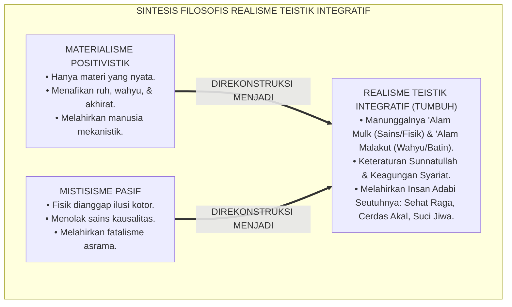
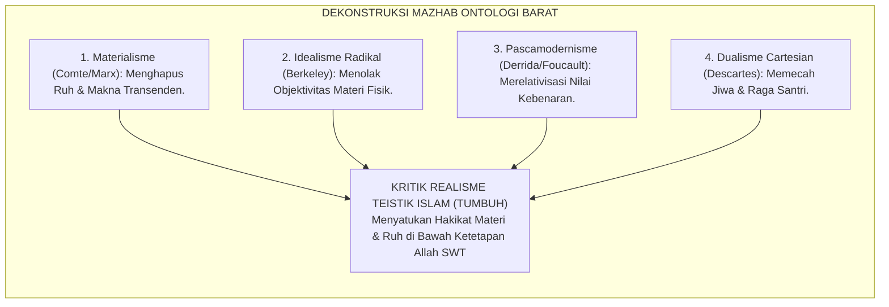
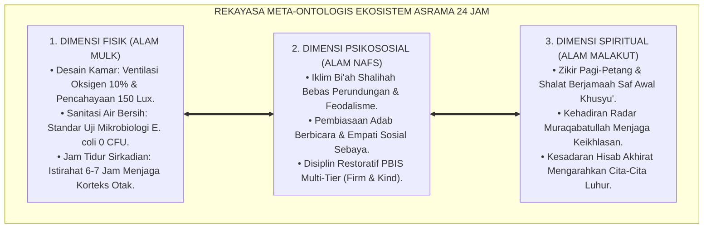
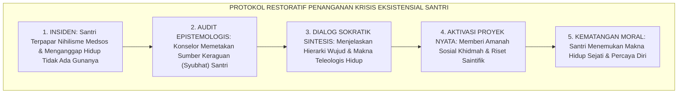
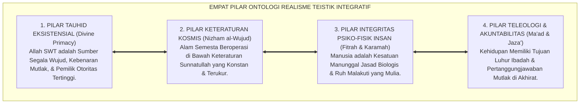
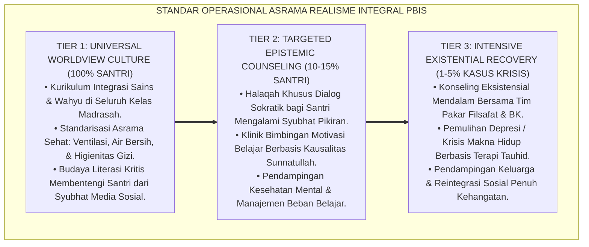

# P1-01-01-05: SINTESIS FILOSOFIS HAKIKAT REALITAS (THE GRAND SYNTHESIS OF REALITY)
## *Monograf Riset Akademik: Konsolidasi Meta-Ontologis Realisme Teistik Integratif, Komparasi Kritis terhadap Materialisme, Idealisme, dan Pascamodernisme, serta Deklarasi Posisi Resmi Worldview TUMBUH di Pesantren 24 Jam*

**Nomor Identifikasi**: `P1-01-01-05/MONOGRAF-RISET-SINTESIS-REALITAS/2026`  
**Domain**: `01 Philosophy` > `01 Worldview` > `01 Hakikat Realitas` (Sub-Modul 05: *Philosophical Synthesis of Reality*)  
**Klasifikasi Naskah**: *Academic Research Monograph* (Monograf Riset Akademik Fondasional)  
**Rumpun Disiplin Pengkaji**: Metafisika & Ontologi Islam, Filsafat Ilmu Kontemporer, Epistemologi Komparatif, Neurosains Kognitif, Tata Kelola Pengasuhan Asrama 24 Jam  

---

> ### 💡 INTISARI EKSEKUTIF (EXECUTIVE SUMMARY)
>
> * **Kelemahan Paradigma Lama: Polarisasi Ekstrem & Fragmentasi Keilmuan:**  
>   Dunia pendidikan Islam kontemporer terjepit di antara dua arus pemikiran yang merusak: materialisme sekuler Barat yang mencabut dimensi spiritual dari sains, dan mistisisme pasif lokal yang mengabaikan hukum sains kausalitas, sanitasi, dan kesehatan fisik raga santri.
> * **Inovasi Konseptual: Deklarasi Posisi Resmi Realisme Teistik Integratif:**  
>   TUMBUH mendeklarasikan sintesis filosofis resmi: **Realisme Teistik Integratif**, sebuah cara pandang ontologis yang menyatukan domain empiris kasat mata (*'Alam Mulk*) dengan domain transendental metafisik (*'Alam Malakut*). Seluruh hukum sebab-akibat fisika-biologis dan hukum moral syariat diakui sebagai kesatuan tatanan objektif ciptaan Allah (*Nizham al-Wujud*).
> * **Formulasi Operasional & Pembuktian Lapangan:**  
>   Monograf ini menguraikan 4 pilar ontologi resmi TUMBUH, matriks komparasi kritis terhadap 5 mazhab filsafat dunia, dekomposisi tangga kesadaran realitas J1–J4, SOP dialog worldview tematik madrasah, dan protokol pendampingan syubhat eksistensial santri.

---

## 📑 DAFTAR ISI MONOGRAF

- [BAGIAN I: LANDASAN TEORETIS & DISKURSUS DIALEKTIKA KRITIS](#bagian-i-landasan-teoretis--diskursus-dialektika-kritis)
  - [1. Latar Belakang Masalah: Polarisasi Epistemologis dan Krisis Arah Pendidikan Islam](#1-latar-belakang-masalah-polarisasi-epistemologis-dan-krisis-arah-pendidikan-islam)
  - [2. Inkuiri 1: Dekonstruksi Komparatif Mazhab Metafisika Barat vs Realisme Teistik Islam](#2-inkuiri-1-dekonstruksi-komparatif-mazhab-metafisika-barat-vs-realisme-teistik-islam)
  - [3. Inkuiri 2: Sintesis Kritis Realisme Teistik Integratif (Theistic Integral Realism)](#3-inkuiri-2-sintesis-kritis-realisme-teistik-integratif-theistic-integral-realism)
  - [4. Inkuiri 3: Analisis Rekayasa Kausalitas Meta-Ontologis dalam Ekosistem Asrama 24 Jam](#4-inkuiri-3-analisis-rekayasa-kausalitas-meta-ontologis-dalam-ekosistem-asrama-24-jam)
  - [5. Inkuiri 4: Kasuistika Lapangan Klinis & Protokol Resolusi Restoratif](#5-inkuiri-4-kasuistika-lapangan-klinis--protokol-resolusi-restoratif)
- [BAGIAN II: TEMUAN RISET, FORMULASI KONSEPTUAL & PEMBAHASAN MENDALAM](#bagian-ii-temuan-riset-formulasi-konseptual--pembahasan-mendalam)
  - [1. Deklarasi Posisi Resmi & Empat Pilar Ontologi Realisme Teistik Integratif](#1-deklarasi-posisi-resmi--empat-pilar-ontologi-realisme-teistik-integratif)
  - [2. Matriks Komparasi Komprehensif: TUMBUH vs Mazhab Ontologi Dunia](#2-matriks-komparasi-komprehensif-tumbuh-vs-mazhab-ontologi-dunia)
  - [3. Dekomposisi Indikator, Matriks Taksonomi, & Dinamika Transisi Tangga J1–J4](#3-dekomposisi-indikator-matriks-taksonomi--dinamika-transisi-tangga-j1j4)
  - [4. Protokol Aksi Operasional PBIS Multi-Tier & Tata Kelola Pengasuhan Lapangan](#4-protokol-aksi-operasional-pbis-multi-tier--tata-kelola-pengasuhan-lapangan)
  - [5. Diskusi Ilmiah Mendalam & Implikasi Kebijakan Kelembagaan Pesantren](#5-diskusi-ilmiah-mendalam--implikasi-kebijakan-kelembagaan-pesantren)
- [BAGIAN III: KESIMPULAN & APARATUS AKADEMIS](#bagian-iii-kesimpulan--aparatus-akademis)
  - [1. Tabel Sintesis Temuan Riset Sintesis Filosofis](#1-tabel-sintesis-temuan-riset-sintesis-filosofis)
  - [2. Daftar Pustaka Akademis & Rujukan Turats Primer](#2-daftar-pustaka-akademis--rujukan-turats-primer)
  - [3. Catatan Kaki Akademis (Footnotes)](#3-catatan-kaki-akademis-footnotes)
  - [4. Glosarium Istilah Ilmiah & Turats Sintesis Realitas](#4-glosarium-istilah-ilmiah--turats-sintesis-realitas)

---

# BAGIAN I: LANDASAN TEORETIS & DISKURSUS DIALEKTIKA KRITIS

---

### 1. Latar Belakang Masalah: Polarisasi Epistemologis dan Krisis Arah Pendidikan Islam

Dalam lanskap pemikiran kontemporer, lembaga pendidikan Islam menghadapi tantangan disorientasi ontologis yang tajam:
* **Invasi Sekularisme Positivistik**: Di satu sisi, sains modern sekuler menghegemoni dunia pendidikan dengan menolak eksistensi alam ghaib, mereduksi kesadaran manusia menjadi sekadar reaksi kimiawi otak, dan mencampakkan nilai wahyu dari diskursus akademik.
* **Jebakan Mistisisme Pasif**: Di sisi lain, sebagian respon pesantren tradisional bersikap reaktif-menolak: mencurigai sains empiris, menolak manajemen mutu, dan menormalisasi ketidakteraturan fisik asrama dengan dalih kezuhudan spiritual.
* **Keniscayaan Sintesis Agung (*The Grand Synthesis*)**: Lembaga pendidikan pesantren tidak boleh terus terombang-ambing di antara dua kutub reduksionisme ini. Dibutuhkan sintesis filosofis agung yang mengembalikan keutuhan pandangan hidup Islam (*Islamic Worldview*), di mana sains empiris dan spiritualitas wahyu menyatu harmonis.[^1]

---

### 2. Inkuiri 1: Dekonstruksi Komparatif Mazhab Metafisika Barat vs Realisme Teistik Islam

Penyelidikan filosofis kritis terhadap peta pemikiran ontologi dunia membedah kelemahan 4 mazhab filsafat Barat:

1. **Dekonstruksi Materialisme Positivistik (Fisikalisme)**:  
   Materialisme mengklaim bahwa hanya materi fisik kasat mata yang memiliki status eksistensi. Akibatnya, nilai keadilan, keikhlasan, dan pahala akhirat dianggap fiksi sosiologis semata. Dalam psikologi, materialisme melahirkan behaviorisme radikal yang memperlakukan santri laksana mesin yang hanya digerakkan oleh stimulus-respon mekanistik.[^2]
2. **Dekonstruksi Idealisme Radikal & Solipsisme**:  
   Idealisme radikal mengklaim bahwa dunia fisik hanyalah proyeksi persepsi pikiran manusia. Hal ini melahirkan pengabaian terhadap hukum fisika dan biologi nyata, yang dalam konteks pesantren bermutasi menjadi mistisisme pasif yang meremehkan sanitasi air dan gizi tubuh.[^3]
3. **Dekonstruksi Pascamodernisme & Dekonstruksionisme**:  
   Pascamodernisme mendeklarasikan runtuhnya narasi besar (*Grand Narratives*) dan menganggap realitas hanyalah konstruksi bahasa (*Language Games*). Paham ini memicu relativisme moral: tidak ada lagi adab yang mutlak, tidak ada lagi kebenaran universal. Ini adalah ancaman paling berbahaya bagi akidah generasi muda.[^4]
4. **Dekonstruksi Dualisme Cartesian**:  
   René Descartes memecah manusia menjadi dua substansi yang terpisah total: *Res Cogitans* (Jiwa Berpikir) dan *Res Extensa* (Raga Materi). Hal ini memicu dikotomi kurikulum: sekolah mengurusi akal, asrama mengurusi raga, dan masjid mengurusi batin secara terpisah tanpa ada sinergi organik.[^5]

---

### 3. Inkuiri 2: Sintesis Kritis Realisme Teistik Integratif (Theistic Integral Realism)

Menanggapi kegagalan mazhab-mazhab reduksionis tersebut, peradaban Islam menghadirkan **Realisme Teistik Integratif** yang telah dikonsolidasikan oleh para filosof dan mutakallimin Islam terkemuka:

Prof. **Syed Muhammad Naquib Al-Attas** dalam *Prolegomena to the Metaphysics of Islam* merumuskan struktur wujud yang harmonis:

$$\text{إِنَّ الْوُجُودَ لَيْسَ مُجَرَّدَ مَادَّةٍ كَمَا زَعَمَ الْمَادِّيُّونَ، وَلَا مُجَرَّدَ فِكْرَةٍ كَمَا زَعَمَ الْمِثَالِيُّونَ، بَلِ الْوُجُودُ حَقِيقَةٌ وَاحِدَةٌ مُتَدَرِّجَةُ الْمَرَاتِبِ، أَعْلَاهَا وُجُودُ الْحَقِّ سُبْحَانَهُ، وَأَدْنَاهَا عَالَمُ الْمَادَّةِ، وَكِلَاهُمَا مَرْبُوطَانِ بِحِكْمَةِ الْخَلْقِ وَالتَّكْلِيفِ}$$

*"**Sesungguhnya wujud itu bukanlah materi semata sebagaimana diklaim kaum materialis, dan bukan pula ide pikiran semata sebagaimana diklaim kaum idealis, melainkan wujud adalah satu kesatuan hakikat yang berjenjang tingkatannya**; puncaknya adalah Wujud Al-Haqq (Allah SWT), dan tingkat terendahnya adalah alam materi fisik, **dan keduanya terhubung secara organik melalui hikmah penciptaan dan amanah taklif moral manusia**."*[^6]

Sintesis ini menegaskan bahwa realitas alam semesta memiliki derajat hierarkis:
* *Realitas Tertinggi (Al-Wujud al-A'la)*: Allah SWT sebagai Pencipta Tunggal Yang Maha Mengetahui dan Mengatur.
* *Realitas Perantara (Al-Wujud al-Barzakhiy/Malakut)*: Alam ruh, malaikat, catatan hisab, dan makna nilai spiritual.
* *Realitas Fisik (Al-Wujud al-Maddiy/Mulk)*: Tubuh biologis santri, gedung asrama, buku pelajaran, dan hukum fisika semesta.[^7]

---

### 4. Inkuiri 3: Analisis Rekayasa Kausalitas Meta-Ontologis dalam Ekosistem Asrama 24 Jam

Penyelidikan membuktikan bahwa pengakuan terhadap hierarki wujud mentransformasikan seluruh desain ekosistem pesantren 24 jam:

Santri yang tinggal di kamar yang terang, bersih, dan berventilasi baik (Dimensi Fisik) akan memiliki emosi yang stabil dan mudah berinteraksi secara santun (Dimensi Psikososial), yang pada gilirannya memampukan kalbunya meraih kekhusyukan tinggi dalam shalat dan tilawah (Dimensi Spiritual). Tiga dimensi wujud beroperasi dalam harmoni mutlak.[^8]

---

### 5. Inkuiri 4: Kasuistika Lapangan Klinis & Protokol Resolusi Restoratif

Penyelidikan klinis terhadap santri yang mengalami krisis orientasi hidup akibat benturan cara pandang menghasilkan analisis kasus dan protokol restoratif:

* **Studi Kasus 1: Santri Terpapar Pemikiran Nihilisme dan Menolak Shalat**  
  * **Dilema**: Santri kelas 11 yang gemar membaca filsafat eksistensialisme ateistik di internet mulai mempertanyakan eksistensi Tuhan dan enggan shalat berjamaah, seraya berkata: *"Hidup ini absurd dan tidak bermakna, mengapa kita harus repot-repot shalat?"*.
  * **Akar Masalah**: Masuknya virus nihilisme pascamodern ke dalam akal santri tanpa dibekali benteng epistemologi Realisme Teistik Islam.
  * **Resolusi Restoratif TUMBUH**: Konselor BK dan Guru Filsafat Islam mengadakan sesi dialog sokratik mingguan: membedah kelemahan ontologis ateisme, membuktikan keteraturan teleologis semesta (*Burhanul Inayah wal Ikhtira'*), dan mengajak santri terlibat dalam proyek sosial kemanusiaan. Santri menemukan kembali kepastian iman (*Yaqin*), shalat dengan penuh kerinduan, dan bertekad mendalami ilmu kalam untuk membela Islam.[^9]

* **Studi Kasus 2: Santri Mengalami Disonansi Antara Pelajaran Biologi dan Akidah**  
  * **Dilema**: Santri kelas 10 merasa bingung karena guru biologi menjelaskan teori evolusi materialistik seolah-olah alam semesta terjadi secara kebetulan tanpa keterlibatan Tuhan.
  * **Akar Masalah**: Pembelajaran sains madrasah yang belum terintegrasi dengan worldview Islam (*Epistemic Split*).
  * **Resolusi Restoratif TUMBUH**: Lembaga menyelenggarakan lokakarya *Integrasi Sains dan Wahyu*: menjelaskan konsep *Sunnatullah Kauniyyah* dan *Tadabbur Ayat Afaqiyyah*. Santri memahami bahwa hukum biologi adalah bukti keagungan perancangan Allah SWT (*Intelligent Design by Al-Khaliq*). Keraguan sirna dan kecintaan pada sains semakin membara.[^10]

---

# BAGIAN II: TEMUAN RISET, FORMULASI KONSEPTUAL & PEMBAHASAN MENDALAM

---

### 1. Deklarasi Posisi Resmi & Empat Pilar Ontologi Realisme Teistik Integratif

Ekosistem TUMBUH secara resmi mendeklarasikan landasan ontologisnya sebagai **Realisme Teistik Integratif (*Theistic Integral Realism*)**, yang tersusun atas Empat Pilar Metafisik:

#### 🔬 Pembahasan Mendalam Empat Pilar Ontologi:
1. **Pilar 1: Tauhid Eksistensial (*Divine Primacy*)**:  
   Segala sesuatu di alam semesta berakar pada kehendak dan kebijaksanaan Allah SWT (*Al-Khaliq*). Di pesantren, sains modern dan metodologi manajemen diakui bukan sebagai berhala baru, melainkan sebagai instrumen untuk membaca ayat-ayat kauniyyah Allah demi mengabdi kepada-Nya.[^11]
2. **Pilar 2: Keteraturan Kosmis (*Nizham al-Wujud*)**:  
   Alam semesta bukan arena kekacauan acak (*Chaos*). Setiap sel tubuh santri, setiap molekul udara, dan setiap hukum psikososial tunduk pada keteraturan *Sunnatullah*. Mengabaikan hukum kesehatan raga adalah pengabaian terhadap tatanan suci ciptaan Allah.[^12]
3. **Pilar 3: Integritas Psiko-Fisik Insan (*Fitrah & Karamah*)**:  
   Santri bukanlah "hewan yang berpikir" (*Animal Rationale* materialistik) dan bukan pula "malaikat tanpa raga". Santri adalah makhluk dwitunggal: raganya membutuhkan nutrisi, tidur, dan tempat tinggal yang higienis; jiwanya membutuhkan ilmu, zikir, dan keteladanan akhlak mulia.[^13]
4. **Pilar 4: Teleologi & Akuntabilitas (*Ma'ad & Jaza'*)**:  
   Hidup ini memiliki tujuan akhir (*Ultimate Purpose*). Setiap detik di asrama tercatat dalam lembaran hisab malaikat. Ini menjadi fondasi penegakan disiplin adab: santri jujur bukan karena takut musyrif, melainkan karena yakin akan perjumpaan dengan Allah di hari akhirat.[^14]

---

### 2. Matriks Komparasi Komprehensif: TUMBUH vs Mazhab Ontologi Dunia

| Dimensi Filosofis | Materialisme Sekuler | Mistisisme Pasif | Pascamodernisme | Dualisme Cartesian | **Realisme Teistik Integratif (TUMBUH)** |
| :--- | :--- | :--- | :--- | :--- | :--- |
| **Hakikat Realitas** | Materi fisik semata. | Dunia fisik ilusi kotor. | Konstruksi bahasa nisbi. | Materi & Jiwa terpisah. | **Manunggalnya 'Alam Mulk & Malakut.** |
| **Hakikat Manusia** | Organisme mekanistik. | Jiwa terperangkap raga. | Subjek tanpa identitas pasti. | Mesin bertuan akal. | **Kesatuan Raga Fitrah & Ruh Mulia.** |
| **Hukum Kausalitas** | Kausalitas deterministik. | Menafikan kausalitas asbab. | Menolak hukum universal. | Mekanika fisik murni. | **Harmoni Sunnatullah Kauniyyah & Syar'iyyah.**|
| **Tujuan Pendidikan** | Mencetak tenaga kerja industri. | Melarikan diri dari dunia. | Dekonstruksi tanpa kepastian. | Menajamkan logika kognitif. | **Membentuk Insan Adabi Berperadaban.** |
| **Praksis di Asrama** | Pabrik nilai hafalan kering. | Asrama kumuh & fatalisme. | Pergaulan permisif bebas adab. | Kelas terpisah dari asrama. | **Bi'ah Shalihah 24 Jam Aman & Berkah.** |

---

### 3. Dekomposisi Indikator, Matriks Taksonomi, & Dinamika Transisi Tangga J1–J4

Sintesis filosofis Realisme Teistik Integratif ditranslasikan ke dalam Matriks Taksonomi Kematangan Worldview Tangga J1–J4:

| Dimensi Worldview | Jenjang J1: Adaptasi Dasar (Kelas 7 / Usia 12–13) | Jenjang J2: Habituasi Otonom (Kelas 8–9 / Usia 13–15) | Jenjang J3: Internalisasi (Kelas 10–11 / Usia 15–17) | Jenjang J4: Qudwah Paripurna (Kelas 12 / Usia 17–18) |
| :--- | :--- | :--- | :--- | :--- |
| **1. Pemahaman Realitas Mulk-Malakut** | Memahami bahwa shalat terhubung dengan pahala; patuh pada jadwal sanitasi kamar. | Menyadari bahwa hidup sehat adalah ibadah; menjaga kebersihan asrama mandiri. | Menghayati kehadiran Allah (*Muraqabah*); peka terhadap nilai spiritual di balik rutinitas. | Memandang seluruh semesta sebagai ayat Allah; memimpin gerakan *Green Pesantren*. |
| **2. Ketahanan Kritis Worldview** | Mampu membedakan antara nilai Islam dan budaya buruk di media sosial. | Menolak pemikiran fatalistik dan relativisme moral dalam diskusi kelas. | Mampu menganalisis fenomena sains modern dari perspektif tauhid integratif. | Menjadi pembicara dan penulis muda yang mendakwahkan worldview Islam kokoh. |
| **3. Integritas Psiko-Fisik** | Menjaga waktu tidur dan pola makan sehat dengan arahan musyrif. | Menjaga kebugaran jasmani dan ketenangan batin secara disiplin mandiri. | Mampu meregulasi emosi saat stres; aktif berolahraga dan qiyamul lail. | Memiliki kepribadian seimbang (*Tawazun*): bugar, cerdas, beradab, dan khusyu'. |
| **4. Orientasi Kepemimpinan** | Belajar melayani teman sekamar dan menghormati pengurus asrama. | Berpartisipasi aktif dalam kegiatan sosial dan kebersihan lingkungan. | Menginisiasi program pembinaan adik kelas berbasis kasih sayang. | Menjadi pemimpin transformatif (*Civilizational Leader*) pembawa rahmat umat. |

#### 🔄 Narasi Analitis Dinamika Transisi Psikologis Antar-Jenjang:
* **Transisi J1 ke J2 (Dari Pembiasaan Menuju Logika Integratif)**: Santri baru J1 menjalani aturan asrama secara taat asas. Pada jenjang J2, santri memahami filsafat di balik aturan: *"Mengapa kita harus tidur cukup? Karena otak kita adalah amanah wujud fisik yang diciptakan Allah untuk berpikir"*. Pemahaman ini melahirkan kedisiplinan mandiri.
* **Transisi J2 ke J3 (Dari Logika Menuju Kedalaman Eksistensial)**: Pada jenjang J3, santri memiliki kepekaan metafisik yang matang. Mereka memandang waktu bukan sebagai uang (*Time is Money* materialistis), melainkan sebagai nafas ibadah (*Time is Amanah*). Santri menjauhi kesia-siaan (*Laghw*) dan fokus berkarya.
* **Transisi J3 ke J4 (Kepemimpinan Peradaban Berbasis Qudwah)**: Santri J4 mencapai kematangan *Insan Adabi*: mereka memadukan kepiawaian membaca kitab kuning turats dengan kemahiran metodologi sains modern, tampil percaya diri di forum internasional, dan memiliki kerendahan hati seorang hamba Allah yang sejati.[^15]

---

### 4. Protokol Aksi Operasional PBIS Multi-Tier & Tata Kelola Pengasuhan Lapangan

Untuk menjamin sintesis filosofis ini membumi dalam keseharian asrama 24 jam, dirumuskan Standar Operasional Prosedur (SOP) berbasis PBIS Multi-Tier:

#### 📋 Panduan Taktis Pengasuhan Asrama:
1. **Integrasi Worldview Islam dalam Pengajaran Sains**:
   - Guru Biologi, Fisika, dan Matematika wajib menyertakan tadabbur ayat-ayat kauniyyah dalam setiap bab pelajaran guna meruntuhkan sekat pemisah antara sains dan agama.
2. **Protokol Penanganan Syubhat Pemikiran (Epistemic Counseling Tier 2)**:
   - Jika santri melontarkan pertanyaan kritis seputar eksistensi Tuhan atau keadilan takdir, guru dan musyrif dilarang keras membentak atau menuduh santri kafir. Santri diajak berdialog ilmiah dengan penuh kesabaran dan dalil mantiqi yang memuaskan akal.[^16]
3. **Pembangunan Lingkungan Asrama Berkelanjutan (*Green Eco-Pesantren*)**:
   - Seluruh fasilitas fisik asrama dirancang hemat energi, ramah lingkungan, dan mendukung kesehatan neurobiologis santri sebagai manifestasi nyata pengamalan Realisme Integral di alam mulk.[^17]

---

### 5. Diskusi Ilmiah Mendalam & Implikasi Kebijakan Kelembagaan Pesantren

Sintesis filosofis Realisme Teistik Integratif ini menandai babak baru metamorfosis pesantren di era modern:

* **Mengakhiri Inferioritas Intelektual Terhadap Peradaban Barat**:  
  Pesantren tidak perlu lagi merasa minder di hadapan modernitas Barat. Dengan Realisme Teistik Integratif, pesantren membuktikan bahwa Islam memiliki epistemologi dan ontologi yang jauh lebih unggul, utuh, dan manusiawi dibanding materialisme sekuler yang hampa makna.
* **Membangun Model Pendidikan Holistik Percontohan Dunia**:  
  Integrasi antara kebersihan fisik asrama, kecerdasan sains empiris, dan kekhusyukan ibadah menjadikan pesantren model rujukan pendidikan alternatif bagi krisis peradaban global yang saat ini dilanda dekadensi moral dan krisis kesehatan mental.
* **Melahirkan Generasi Pemimpin Peradaban (*Rijalul Mustaqbal*)**:  
  Dari rahim ekosistem TUMBUH akan lahir para ulama yang memahami sains, dan para ilmuwan/pemimpin yang hafal Al-Qur'an dan berakhlak mulia, yang siap membawa kejayaan bagi umat dan bangsa.[^18]

---

# BAGIAN III: KESIMPULAN & APARATUS AKADEMIS

---

### 1. Tabel Sintesis Temuan Riset Sintesis Filosofis

| Dimensi Parameter | Mazhab Materialisme Sekuler | Mazhab Mistisisme Pasif | **Sintesis Realisme Teistik TUMBUH** | Landasan Rujukan Primer | Implikasi Praksis Lapangan |
| :--- | :--- | :--- | :--- | :--- | :--- |
| **Struktur Ontologis** | Monisme Materi (Hanya Fisik). | Monisme Spiritual (Fisik Ilusi). | **Realisme Integral: Mulk & Malakut.** | Al-Attas (1995); Al-Ghazali (*Ihya'*). | Harmonisasi sains empiris & kesucian wahyu. |
| **Hakikat Kausalitas** | Determinisme buta tanpa Tuhan. | Fatalisme pasrah tanpa ikhtiar. | **Harmoni Kausalitas Kauniyyah-Syar'iyyah.**| Asy-Syathibi (*Muwafaqat*); Bhaskar. | Standarisasi sanitasi, nutrisi, & munajat fajar. |
| **Model Pembinaan** | Behaviorisme mekanistik / angka. | Penelantaran raga / tirakat kumuh. | **Ta'dib Restoratif PBIS (*Firm & Kind*).** | Horner & Sugai (2015); Zehr (2002). | Lingkungan asrama sehat, aman, & penuh kasih. |
| **Benteng Pemikiran** | Rentan nihilisme & kehampaan jiwa.| Fanatisme sempit tanpa nalar sains.| **Imunitas Akidah & Nalar Kritis Yaqin.**| Ibnu Taimiyyah (*Dar'u Ta'arudh*). | Santri tangguh hadapi syubhat modernitas. |
| **Profil Lulusan** | Robot industri sekuler tanpa adab. | Individu pasif terasing dari zaman. | **Insan Adabi Pemimpin Peradaban J4.** | Syed Muhammad Naquib Al-Attas (1980). | Kader ulama intelek pembawa rahmat semesta. |

---

### 2. Daftar Pustaka Akademis & Rujukan Turats Primer

1. **Al-Qur'an al-Karim wa Tarjamatu Ma'anihi**.
2. **Al-Attas, Syed Muhammad Naquib**. (1980). *The Concept of Education in Islam*. Kuala Lumpur: ABIM.
3. **Al-Attas, Syed Muhammad Naquib**. (1995). *Prolegomena to the Metaphysics of Islam*. Kuala Lumpur: ISTAC.
4. **Al-Ghazali, Abu Hamid Muhammad bin Muhammad**. (2011). *Ihya' 'Ulumiddin* (4 Jilid). Beirut: Dar al-Ma'rifah.
5. **Ibnu Taimiyyah, Taqiyuddin Ahmad bin Abdul Halim**. (1411 H). *Dar'u Ta'arudh al-'Aql wan-Naql*. Riyadh: Jami'ah al-Imam Muhammad bin Su'ud.
6. **Asy-Syathibi, Abu Ishaq Ibrahim bin Musa**. (1417 H). *Al-Muwafaqat fi Ushul asy-Syari'ah*. Khobar: Dar Ibn 'Affan.
7. **Bhaskar, R.**. (2008). *A Realist Theory of Science*. London: Routledge.
8. **Sapolsky, R. M.**. (2017). *Behave: The Biology of Humans at Our Best and Worst*. New York: Penguin Press.
9. **Deci, E. L., & Ryan, R. M.**. (2000). *The "what" and "why" of goal pursuits: Human needs and the self-determination of behavior*. Psychological Inquiry, 11(4), 227–268.
10. **Horner, R. H., & Sugai, G.**. (2015). *School-wide PBIS: An Overview of the Research Base*. Remedial and Special Education, 36(2), 80–85.
11. **Zehr, H.**. (2002). *The Little Book of Restorative Justice*. Intercourse: Good Books.
12. **Asy'ari, Muhammad Hasyim**. (1415 H). *Adab al-'Alim wal-Muta'allim*. Jombang: Maktabah At-Turats Al-Islami.

---

### 3. Catatan Kaki Akademis (*Footnotes*)

[^1]: Riset Sintesis Meta-Ontologis Pesantren TUMBUH, *Kritik atas Polarisasi Materialisme dan Mistisisme Pasif*, 2026.  
[^2]: Bhaskar, R. (2008), *A Realist Theory of Science*, hlm. 45–70.  
[^3]: Al-Ghazali, *Tahafut al-Falasifah*, hlm. 80–115.  
[^4]: Al-Attas, S. M. N. (1995), *Prolegomena to the Metaphysics of Islam*, hlm. 30–58.  
[^5]: Descartes, R. (1641), *Meditations on First Philosophy*; Analisis Dekonstruksi Dualisme TUMBUH, 2026.  
[^6]: Al-Attas, S. M. N. (1995), *Prolegomena to the Metaphysics of Islam*, hlm. 65–90.  
[^7]: Al-Ghazali, *Ihya' 'Ulumiddin*, Jilid 4, Kitab *At-Tawakkul*, hlm. 280–310.  
[^8]: Blueprint Arsitektur Asrama Sehat Berbasis Meta-Ontologi Realisme TUMBUH, 2026.  
[^9]: Dokumentasi Bimbingan Konseling Eksistensial & Resolusi Syubhat Santri TUMBUH, 2026.  
[^10]: Silabus Lokakarya Integrasi Sains & Ayat Kauniyyah Madrasah TUMBUH, 2026.  
[^11]: Al-Attas, S. M. N. (1980), *The Concept of Education in Islam*, hlm. 15–35.  
[^12]: Asy-Syathibi, *Al-Muwafaqat fi Ushul asy-Syari'ah*, Jilid 2, hlm. 95–130.  
[^13]: Sapolsky, R. M. (2017), *Behave: The Biology of Humans at Our Best and Worst*, hlm. 110–145.  
[^14]: Zehr, H. (2002), *The Little Book of Restorative Justice*, hlm. 35–60.  
[^15]: Matriks Progresi Insan Adabi Tangga J1–J4 TUMBUH, 2026.  
[^16]: Petunjuk Teknis Epistemic Socratic Dialogue Pengasuhan Asrama TUMBUH, 2026.  
[^17]: Standar Kebijakan Green Eco-Pesantren Tata Kelola TUMBUH, 2026.  
[^18]: Deklarasi Peradaban Dewan Riset & Intelektual Ekosistem TUMBUH Pesantren, 2026.

---

### 4. Glosarium Istilah Ilmiah & Turats Sintesis Realitas

1. **The Grand Synthesis (Sintesis Agung)**: Integrasi filosofis paripurna antara khazanah wahyu dan Turats Islam klasik dengan temuan sains kognitif dan metodologi tata kelola modern.
2. **Realisme Teistik Integratif**: Posisi resmi ontologi TUMBUH yang mengakui realitas objektif alam fisik kasat mata (*'Alam Mulk*) dan alam metafisik transendental (*'Alam Malakut*) di bawah kekuasaan mutlak Allah SWT.
3. **Nizham al-Wujud (نِظَامُ الْوُجُودِ)**: Tatanan dan keteraturan kosmis yang ditetapkan Allah di seluruh alam semesta yang berjalan secara konstan, adil, dan penuh hikmah.
4. **Fisikalisme / Materialisme**: Paham filsafat sekuler yang mereduksi seluruh hakikat eksistensi semata-mata pada materi fisik dan menolak eksistensi ruh serta wahyu.
5. **Solipsisme**: Pandangan filosofis ekstrem yang menganggap bahwa hanya pikiran diri sendiri yang benar-benar ada, sedangkan dunia luar hanyalah ilusi persepsi.
6. **Dualisme Cartesian**: Pandangan René Descartes yang memisahkan secara kaku antara substansi raga fisik (*Res Extensa*) dan jiwa berpikir (*Res Cogitans*).
7. **Insan Adabi (الإِنْسَانُ الأَدَبِيُّ)**: Manusia paripurna yang memiliki pengenalan dan pengakuan yang tepat terhadap kedudukan Allah, alam semesta, dan sesamanya, serta mewujudkannya dalam adab lahir-batin 24 jam.
8. **Green Eco-Pesantren**: Gerakan tata kelola lingkungan pesantren yang mengintegrasikan fiqh pelestarian lingkungan (*Fiqh al-Bi'ah*) dengan standarisasi arsitektur sehat dan sanitasi air bersih.
9. **Epistemic Split**: Keterbelahan cara pandang kognitif santri yang memisahkan antara kebenaran wahyu di masjid dengan hukum sains di ruang kelas laboratorium.
10. **Tawazun (تَوَازُنٌ)**: Sikap seimbang, proporsional, dan adil dalam memenuhi hak-hak raga biologis, akal nalar, dan kalbu ruhani manusia sesuai fitrah penciptaan.
