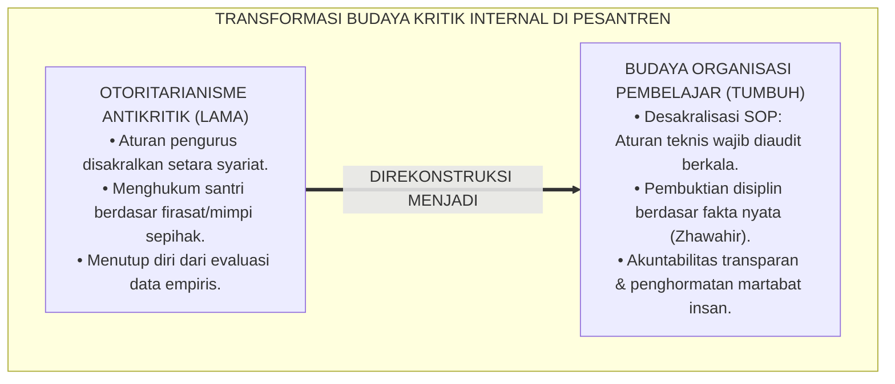
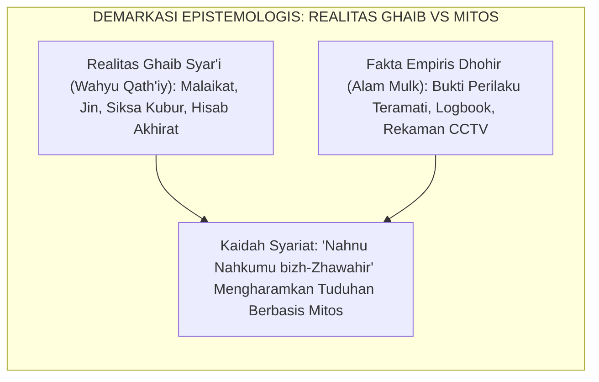
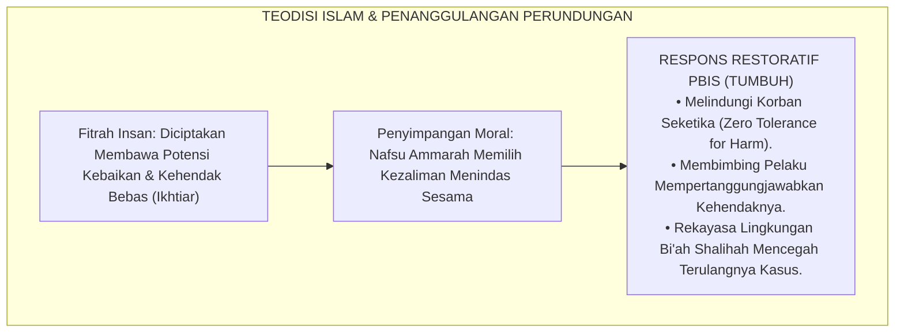
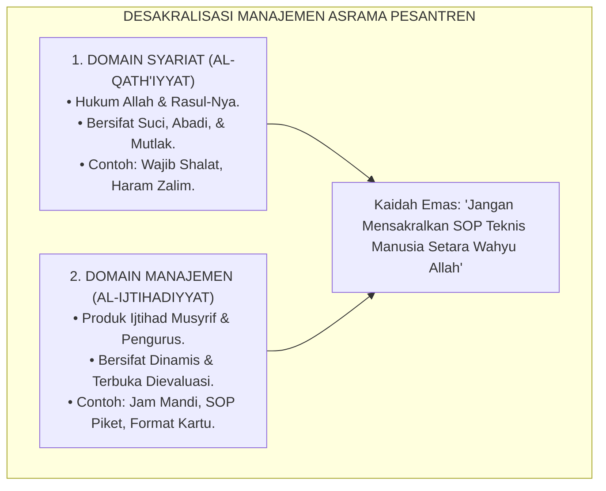
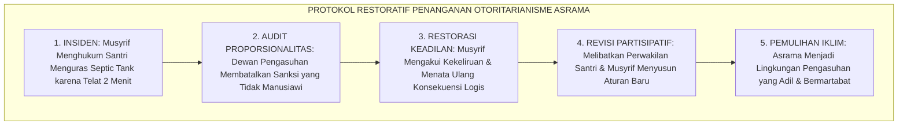
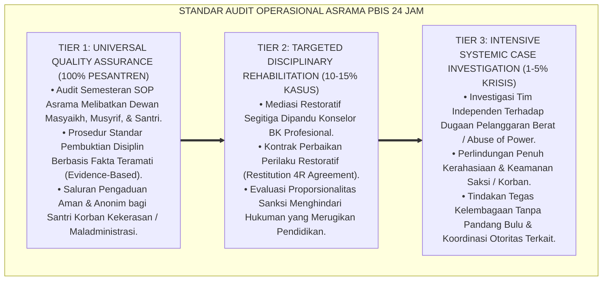

# P1-01-01-06: KRITIK INTERNAL DAN UJI KETAHANAN ONTOLOGIS (INTERNAL CRITIQUE & ONTOLOGICAL STRESS-TESTING)
## *Monograf Riset Akademik: Audit Mutu Asumsi Metafisik, Demarkasi Realitas Ghaib vs Mitos Khurafat, Penyelesaian Masalah Kejahatan (The Problem of Evil), Desakralisasi SOP Manajemen, serta Pengujian Ketahanan Sistem Pesantren 24 Jam*

**Nomor Identifikasi**: `P1-01-01-06/MONOGRAF-RISET-KRITIK-INTERNAL/2026`  
**Domain**: `01 Philosophy` > `01 Worldview` > `01 Hakikat Realitas` (Sub-Modul 06: *Internal Critique & Quality Audit*)  
**Klasifikasi Naskah**: *Academic Research Monograph* (Monograf Riset Akademik Fondasional)  
**Rumpun Disiplin Pengkaji**: Audit Kualitas Sistem Pendidikan, Epistemologi Turats & Kalam, Filsafat Ilmu (Realisme Kritis & Falsifikasi), Teodisi & Bimbingan Konseling, Tata Kelola Pengasuhan Asrama 24 Jam  

---

> ### 💡 INTISARI EKSEKUTIF (EXECUTIVE SUMMARY)
>
> * **Kelemahan Paradigma Lama: Otoritarianisme Antikritik & Sakralisasi Kebijakan:**  
>   Banyak lembaga pesantren terjebak dalam kultus kepemimpinan dan sakralisasi aturan teknis: pengurus asrama menggunakan dalil agama untuk membenarkan SOP yang zalim, menghukum santri berdasarkan "firasat mimpi", atau menolak evaluasi manajemen dengan dalih "kewibawaan kiai tidak boleh dikritik".
> * **Inovasi Konseptual: Uji Ketahanan Falsifikasi & Desakralisasi SOP Manajemen:**  
>   TUMBUH menegakkan audit kritik internal paling ketat: membedakan secara tegas antara Syariat Wahyu yang suci abadi (*Al-Qath'iyyat*) dengan SOP Manajemen Pesantren yang merupakan ijtihad teknis dinamis (*Al-Ijtihadiyyat*) yang wajib diaudit dan dievaluasi terus-menerus berbasis data PBIS faktual.
> * **Formulasi Operasional & Pembuktian Lapangan:**  
>   Monograf ini menyajikan matriks audit kualitas 6 aksioma, dekomposisi tangga pencegahan egosentrisme spiritual J1–J4, standar pembuktian disiplin berbasis fakta teramati (*Evidence-Based Protocol*), dan mekanisme evaluasi kebijakan partisipatif semesteran.

---

## 📑 DAFTAR ISI MONOGRAF

- [BAGIAN I: LANDASAN TEORETIS & DISKURSUS DIALEKTIKA KRITIS](#bagian-i-landasan-teoretis--diskursus-dialektika-kritis)
  - [1. Latar Belakang Masalah: Bahaya Dogmatisme Antikritik dan Tyranny of Policy di Pesantren](#1-latar-belakang-masalah-bahaya-dogmatisme-antikritik-dan-tyranny-of-policy-di-pesantren)
  - [2. Inkuiri 1: Uji Demarkasi Realitas Ghaib vs Mitos Khurafat & Firasat Sepihak Pengurus](#2-inkuiri-1-uji-demarkasi-realitas-ghaib-vs-mitos-khurafat--firasat-sepihak-pengurus)
  - [3. Inkuiri 2: Uji Masalah Kejahatan (The Problem of Evil) & Perundungan Asrama](#3-inkuiri-2-uji-masalah-kejahatan-the-problem-of-evil--perundungan-asrama)
  - [4. Inkuiri 3: Uji Determinisme Fatalistik vs Pertanggungjawaban Ikhtiar (Kasb)](#4-inkuiri-3-uji-determinisme-fatalistik-vs-pertanggungjawaban-ikhtiar-kasb)
  - [5. Inkuiri 4: Uji Desakralisasi Manajemen Asrama — Mencegah Tyranny of Policy](#5-inkuiri-4-uji-desakralisasi-manajemen-asrama--mencegah-tyranny-of-policy)
  - [6. Inkuiri 5: Kasuistika Lapangan Klinis & Protokol Resolusi Restoratif](#6-inkuiri-5-kasuistika-lapangan-klinis--protokol-resolusi-restoratif)
- [BAGIAN II: TEMUAN RISET, FORMULASI KONSEPTUAL & PEMBAHASAN MENDALAM](#bagian-ii-temuan-riset-formulasi-konseptual--pembahasan-mendalam)
  - [1. Matriks Hasil Audit Kualitas & Uji Stres Enam Aksioma Ontologis TUMBUH](#1-matriks-hasil-audit-kualitas--uji-stres-enam-aksioma-ontologis-tumbuh)
  - [2. Dekomposisi Indikator, Matriks Taksonomi, & Dinamika Transisi Tangga J1–J4](#2-dekomposisi-indikator-matriks-taksonomi--dinamika-transisi-tangga-j1j4)
  - [3. Protokol Aksi Operasional PBIS Multi-Tier & Tata Kelola Pengasuhan Lapangan](#3-protokol-aksi-operasional-pbis-multi-tier--tata-kelola-pengasuhan-lapangan)
  - [4. Diskusi Ilmiah Mendalam & Implikasi Kebijakan Kelembagaan Pesantren](#4-diskusi-ilmiah-mendalam--implikasi-kebijakan-kelembagaan-pesantren)
- [BAGIAN III: KESIMPULAN & APARATUS AKADEMIS](#bagian-iii-kesimpulan--aparatus-akademis)
  - [1. Tabel Sintesis Temuan Riset Kritik Internal](#1-tabel-sintesis-temuan-riset-kritik-internal)
  - [2. Daftar Pustaka Akademis & Rujukan Turats Primer](#2-daftar-pustaka-akademis--rujukan-turats-primer)
  - [3. Catatan Kaki Akademis (Footnotes)](#3-catatan-kaki-akademis-footnotes)
  - [4. Glosarium Istilah Ilmiah & Turats Kritik Internal](#4-glosarium-istilah-ilmiah--turats-kritik-internal)

---

# BAGIAN I: LANDASAN TEORETIS & DISKURSUS DIALEKTIKA KRITIS

---

### 1. Latar Belakang Masalah: Bahaya Dogmatisme Antikritik dan Tyranny of Policy di Pesantren

Dalam ekosistem pendidikan berbasis agama, terdapat risiko sosiologis yang sangat nyata: penyalahgunaan otoritas sakral untuk memutlakkan kebijakan manusiawi:
* **Sakralisasi SOP Teknis (*Sacralization of Technical Policies*)**: Sering kali peraturan tata tertib asrama yang dibuat oleh pengurus (seperti jam mandi 3 menit, larangan membawa obat pribadi, atau sanksi botak massal) dianggap sebagai "hukum agama yang tidak boleh diubah". Ketika santri atau wali santri mempertanyakan keadilan aturan tersebut, mereka dituduh "kurang adab dan su'ul adab kepada guru".
* **Kebutuhan Uji Falsifikasi Ilmiah**: Dalam tradisi filsafat ilmu (Karl Popper, Roy Bhaskar) dan kaidah ushul fiqh (*Al-Ijtihadu Yanqudhu bil-Ijtihad*), setiap sistem sosial buatan manusia harus memiliki mekanisme koreksi diri (*Self-Correcting Mechanism*). Sebuah teori atau SOP hanya terbukti kokoh jika ia mampu bertahan dari pengujian stres (*Stress Testing*) dan audit kritik internal yang paling keras.
* **Prinsip Kejernihan Epistemologis**: Ekosistem TUMBUH memisahkan secara tegas antara kemutlakan wahyu Allah dengan kenisbian kebijakan manusiawi. Seluruh SOP asrama TUMBUH terbuka untuk dikritik, diuji, dan diperbarui berdasarkan bukti data faktual (*Evidence-Based PBIS*).[^1]

---

### 2. Inkuiri 1: Uji Demarkasi Realitas Ghaib vs Mitos Khurafat & Firasat Sepihak Pengurus

Dalam tata kelola asrama, sering terjadi pencampuradukan antara keimanan kepada yang ghaib (*Al-Ghaybiyyat*) dengan mitos takhayul dan firasat subjektif:

Kaidah fiqh agung yang disepakati ulama menegaskan batasan penegakan hukum dan disiplin:

$$\text{نَحْنُ نَحْكُمُ بِالظَّوَاهِرِ، وَاللَّهُ يَتَوَلَّى السَّرَائِرَ}$$

*"**Kita menetapkan hukum berdasarkan bukti-bukti nyata yang tampak lahiriah (*Zhawahir*), sedangkan Allah SWT semata yang berhak mengadili apa yang tersembunyi di dalam batin/rahasia kalbu**."*[^2]

Penerapan kaidah ini di asrama TUMBUH secara mutlak melarang:
1. Musyrif menuduh santri mencuri hanya atas dasar "firasat batin" atau "petunjuk mimpi".
2. Menghukum santri yang pingsan atau mengalami gangguan emosi dengan tuduhan "kesurupan karena berdosa", tanpa melakukan pemeriksaan medis dan psikologis klinis terlebih dahulu. Seluruh penanganan kasus wajib berbasis bukti fakta objektif (*Evidence-Based Verification*).[^3]

---

### 3. Inkuiri 2: Uji Masalah Kejahatan (The Problem of Evil) & Perundungan Asrama

Tantangan teologis terdalam dalam ontologi adalah teodisi: *Jika Allah Maha Pengasih dan menciptakan alam dengan fitrah kebaikan, mengapa terjadi perundungan (*bullying*) dan kekerasan di asrama pesantren?*

Imam **Al-Ghazali** dalam *Ihya' 'Ulumiddin* (Kitab *At-Tawhid wal-Inqiyad*) menguraikan bahwa kejahatan moral (*Asy-Syarr al-Ikhlaqiy*) tidak dinisbatkan kepada Allah sebagai keburukan esensial, melainkan merupakan konsekuensi dari penyalahgunaan kehendak bebas (*Al-Ikhtiar al-Insaniy*) yang menentang syariat.[^4]

Di pesantren, perundungan terjadi bukan karena "sudah takdir asrama", melainkan karena adanya kelemahan sistem pengawasan, titik rawan (*Hotspots*), dan kegagalan pendampingan moral. Penanggulangan perundungan adalah kewajiban syar'i (*Fardhu 'Ain*) yang menuntut intervensi sistemik PBIS Multi-Tier, bukan pembiaran fatalistik.[^5]

---

### 4. Inkuiri 3: Uji Determinisme Fatalistik vs Pertanggungjawaban Ikhtiar (Kasb)

Santri yang melakukan pelanggaran sering kali bersembunyi di balik dalih takdir (*Fatalistic Rationalization*): *"Ustadz, saya merokok karena sudah ditakdirkan Allah menjadi anak nakal"*.

Paham *Jabariyah* (Determinisme Fatalistik) ini didekonstruksi secara telak oleh doktrin Ahlussunnah wal Jama'ah melalui konsep **Kasb (Usaha/Pilihan Tindakan)** yang dirumuskan Imam Abu al-Hasan al-Asy'ari dan Imam Abu Mansur al-Maturidi:

$$\text{إِنَّ لِلْعَبْدِ كَسْبًا وَاخْتِيَارًا يَتَعَلَّقُ بِهِ الثَّوَابُ وَالْعِقَابُ، وَلَيْسَ مَجْبُورًا كَالرِّيشَةِ فِي مَهَبِّ الرِّيحِ؛ فَاحْتِجَاجُ الْعَاصِي بِالْقَدَرِ بَاطِلٌ بِإِجْمَاعِ الْأُمَّةِ}$$

*"**Sesungguhnya seorang hamba memiliki Kasb (ikhtiar usaha) dan kehendak memilih yang kepadanya digantungkan pahala dan sanksi hisab, dan manusia sama sekali bukanlah makhluk yang terpaksa seperti sehelai bulu di hembusan angin**; maka tindakan pelaku maksiat yang beralasan dengan takdir atas dosanya adalah batil menurut konsensus ijma' umat Islam."*[^6]

Santri bertanggung jawab penuh atas setiap perilakunya di asrama. Musyrif membimbing santri untuk tidak meratapi masa lalu, melainkan menggunakan daya *Kasb*-nya hari ini untuk memperbaiki kesalahan melalui amal shaleh dan disiplin restoratif.[^7]

---

### 5. Inkuiri 4: Uji Desakralisasi Manajemen Asrama — Mencegah Tyranny of Policy

Penyelidikan audit kualitas menegakkan pemisahan tegas antara dua domain hukum di pesantren:
* **Domain Syariat Suci (*Al-Qath'iyyat / Ash-Shari'ah*)**: Rukun shalat 5 waktu, keharaman mencuri, larangan berzina, kewajiban menutup aurat, dan akhlak birrul walidain. Domain ini bersifat abadi, sakral, dan tidak boleh diubah oleh siapapun.
* **Domain Manajemen Teknis (*Al-Ijtihadiyyat / As-Siyasah at-Tarbawiyyah*)**: Jam bangun tidur, sistem antrean mandi, format kartu mutaba'ah, denah ranjang kamar, dan prosedur izin keluar pondok. Domain ini adalah produk akal ijtihadi manusia yang bersifat dinamis, tidak sakral, dan wajib dievaluasi secara berkala berdasarkan kemaslahatan nyata santri.[^8]

---

### 6. Inkuiri 5: Kasuistika Lapangan Klinis & Protokol Resolusi Restoratif

Penyelidikan klinis terhadap kasus-kasus otoritarianisme pengasuhan menghasilkan analisis kasus dan protokol perbaikan:

* **Studi Kasus 1: Sanksi Fisik Ekstrem Menguras Septic Tank Tanpa Alat Pelindung Diri**  
  * **Dilema**: Musyrif menghukum santri yang terlambat apel pagi 2 menit dengan menyuruh menguras saluran septic tank tanpa sarung tangan dan sepatu bot. Musyrif berdalih: *"Ini aturan pesantren, santri harus taat tanpa bantah!"*.
  * **Akar Masalah**: *Tyranny of Policy* (kesewenang-wenangan manajemen) yang mengabaikan keselamatan biologis santri (*Hifzh an-Nafs*) dan melanggar prinsip keadilan proporsional.
  * **Resolusi Restoratif TUMBUH**: Dewan Pimpinan Pesantren membatalkan sanksi tersebut seketika; musyrif ditegur keras dan mengikuti pelatihan etika pengasuhan; santri diperiksa kesehatannya di klinik. Aturan konsekuensi keterlambatan direvisi menjadi tugas edukatif (seperti merapikan perpustakaan atau membuat resume kitab adab).[^9]

* **Studi Kasus 2: Tuduhan Santri Menggunakan Sihir Akibat Prestasi Menghafal Sangat Cepat**  
  * **Dilema**: Seorang santri kelas 7 mampu menghafal 1 halaman Al-Qur'an dalam 10 menit. Teman-teman sekamarnya menyebarkan fitnah bahwa ia "memakai jimat dan bantuan jin", sehingga santri tersebut dikucilkan.
  * **Akar Masalah**: Rendahnya literasi demarkasi ghaib vs mitos; kegagalan memahami keberagaman bakat kognitif (*Neurodiversity*).
  * **Resolusi Restoratif TUMBUH**: Konselor BK dan Asatidz Tahfizh menggelar halaqah edukasi: mendemonstrasikan metode menghafal visual berbasis sains (*Photographic Memory & Spaced Repetition*), membantah fitnah khurafat, dan memulihkan nama baik santri. Rekan-rekan sekamarnya meminta maaf dan belajar metode menghafal cepat dari santri tersebut.[^10]

---

# BAGIAN II: TEMUAN RISET, FORMULASI KONSEPTUAL & PEMBAHASAN MENDALAM

---

### 1. Matriks Hasil Audit Kualitas & Uji Stres Enam Aksioma Ontologis TUMBUH

Hasil audit pengujian stres (*Stress-Testing*) terhadap Enam Aksioma Realitas dikodifikasikan dalam matriks evaluasi ketahanan berikut:

| No | Aksioma Ontologis TUMBUH | Potensi Bias / Salah Guna Lapangan | Uji Falsifikasi & Stres-Test | Protokol Pengendalian & Mitigasi Risiko |
| :---: | :--- | :--- | :--- | :--- |
| **1** | **Aksioma Ketuhanan** | Menghakimi keikhlasan niat orang lain secara sepihak (*Tafsyir an-Niyyat*). | Keikhlasan adalah domain batin Allah; manusia hanya menilai bukti lahiriah dhohir. | Musyrif dilarang mencap santri "kamu tidak ikhlas"; evaluasi fokus pada perilaku faktual teramati. |
| **2** | **Aksioma Kehambaan** | Sikap minder ekstrem (*Inferiority Complex*) dan pasif tidak mau berprestasi. | Menjadi hamba Allah melahirkan keberanian moral tertinggi di hadapan makhluk. | Edukasi bahwa kehambaan di hadapan Allah membebaskan manusia dari perbudakan sesama makhluk. |
| **3** | **Aksioma Keterpaduan** | Mengultuskan benda fisik asrama seolah-olah memiliki kekuatan magis. | Fisik dihormati sebagai sarana ibadah (*Wasilah*), bukan sesembahan (*Ghayah*). | Standarisasi sanitasi dan ventilasi murni berlandaskan sains dan fiqh *Hifzh an-Nafs*. |
| **4** | **Aksioma Kausalitas** | Terjebak materialisme murni; melupakan doa dan keajaiban pertolongan Allah. | Hukum sebab-akibat diciptakan Allah; Allah Mahakuasa menolong hamba-Nya yang berdoa. | Menjaga keseimbangan 100% Ikhtiar Kauniyyah dan 100% Kepasrahan Doa Syar'iyyah. |
| **5** | **Aksioma Fitrah** | Sikap permisif/lembek; membiarkan pelanggaran berat tanpa konsekuensi. | Fitrah luhur wajib dilindungi dengan menegakkan batasan syariat secara tegas (*Firm*). | Disiplin Restoratif Multi-Tier: Tegas melindungi korban, membimbing pemulihan pelaku. |
| **6** | **Aksioma Hisab** | Munculnya budaya saling mengintai, memata-matai (*Tajassus*), dan menghakimi sesama. | Larangan mutlak tajassus dalam Al-Qur'an (QS. Al-Hujurat: 12). | Sistem logbook PBIS bersifat tertutup privat, terenkripsi, dan berfokus pada rasio apresiasi 4:1. |

---

### 2. Dekomposisi Indikator, Matriks Taksonomi, & Dinamika Transisi Tangga J1–J4

Kapasitas bernalar kritis dan pencegahan egosentrisme spiritual dipetakan ke dalam Matriks Taksonomi Tangga J1–J4:

| Dimensi Audit Nalar | Jenjang J1: Adaptasi Dasar (Kelas 7 / Usia 12–13) | Jenjang J2: Habituasi Otonom (Kelas 8–9 / Usia 13–15) | Jenjang J3: Internalisasi (Kelas 10–11 / Usia 15–17) | Jenjang J4: Qudwah Paripurna (Kelas 12 / Usia 17–18) |
| :--- | :--- | :--- | :--- | :--- |
| **1. Kematangan Nalar Kritis** | Belajar membedakan fakta nyata dan rumor/takhayul di kamar asrama. | Mampu menolak hoaks dan fitnah; terbiasa tabayyun sebelum mengambil kesimpulan. | Memiliki nalar kritis epistemologis; mampu menguji argumen secara logis. | Menjadi pembimbing nalar sebaya; menyelesaikan sengketa berdasarkan bukti objektif. |
| **2. Kerendahan Hati Intelektual** | Menerima masukan musyrif dengan sopan tanpa membantah kasar. | Terbiasa berterima kasih atas koreksi kesalahan; mengakui kekeliruan secara terbuka. | Terbebas dari keangkuhan spiritual (*Ujub*); menghargai perbedaan pandangan ijtihadi. | Memancarkan ketawadhu'an sejati; terbuka terhadap kritik dari santri junior sekalipun. |
| **3. Partisipasi Evaluasi SOP** | Mematuhi SOP asrama dengan tertib dan melaporkan kerusakan fasilitas. | Memberikan usulan perbaikan kebersihan kamar melalui forum musyawarah asrama. | Terlibat aktif dalam tim penjaminan mutu santri (*Santri Quality Council*). | Memimpin musyawarah penyusunan tata tertib santri yang adil, humanis, dan partisipatif. |
| **4. Penegakan Keadilan Restoratif** | Mampu memaafkan teman yang tidak sengaja merugikan barangnya. | Bersedia melakukan restitusi ganti rugi jika melakukan kesalahan secara kesatria. | Menjadi penengah yang adil dalam konflik kamar; menolak tradisi hukuman fisik. | Menjadi fasilitator mediasi restoratif resmi pesantren; merawat kohesi ukhuwah pondok. |

#### 🔄 Narasi Analitis Dinamika Transisi Psikologis Antar-Jenjang:
* **Transisi J1 ke J2 (Dari Kepasifan Menuju Literasi Tabayyun)**: Santri baru J1 mudah terpengaruh cerita seram atau rumor takhayul di asrama. Melalui pendampingan di jenjang J2, santri mengaktifkan kaidah tabayyun (QS. Al-Hujurat: 6): santri memverifikasi setiap kabar, menolak gosip, dan menilai masalah berdasarkan bukti dhohir.
* **Transisi J2 ke J3 (Dari Tabayyun Menuju Kebebasan dari Egosentrisme Spiritual)**: Pada jenjang J3, santri terbebas dari bahaya *Spiritual Bypass* (merasa diri paling suci karena rajin tahajjud). Santri menyadari bahwa kesalehan sejati diukur dari kemampuannya berbuat adil, menyayangi sesama, dan menjaga lisan dari menyakiti orang lain.
* **Transisi J3 ke J4 (Kepemimpinan Bersih Berbasis Transparansi & Akuntabilitas)**: Santri J4 memimpin organisasi santri dengan paradigma *Servant Leadership*: mereka tidak antikritik, membuka kotak saran pengaduan transparan, dan secara berkala mengevaluasi efektivitas program bersama seluruh warga asrama.[^11]

---

### 3. Protokol Aksi Operasional PBIS Multi-Tier & Tata Kelola Pengasuhan Lapangan

Untuk memastikan desakralisasi manajemen dan audit kualitas berjalan sistematis di asrama 24 jam, ditetapkan Standar Operasional Prosedur (SOP) berbasis PBIS Multi-Tier:

#### 📋 Panduan Taktis Pengasuhan Asrama:
1. **Penyelenggaraan Musyawarah Akbar Evaluasi SOP Semesteran**:
   - Setiap akhir semester, manajemen pesantren menggelar sidang tinjauan manajemen (*Management Review Meeting*): mengaudit seluruh poin peraturan asrama berdasarkan data frekuensi pelanggaran di logbook PBIS. Aturan yang terbukti tidak efektif atau menimbulkan mafsadat langsung direvisi.
2. **Standar Penegakan Disiplin Berbasis Bukti Nyata (*Evidence-Based Protocol*)**:
   - Musyrif dilarang menjatuhkan konsekuensi apapun tanpa adanya bukti faktual (minimal kesaksian 2 orang saksi adil, rekaman CCTV, atau pengakuan sadar pelaku).
3. **Penyediaan Kotak Pengaduan Suara Santri (*Whistleblower System*)**:
   - Pesantren menyediakan kanal pengaduan langsung kepada Pengasuh Utama (Kiai) yang terjamin kerahasiaannya untuk melaporkan segala bentuk intimidasi, pemerasan, atau kekerasan yang dilakukan oleh oknum pengurus.[^12]

---

### 4. Diskusi Ilmiah Mendalam & Implikasi Kebijakan Kelembagaan Pesantren

Penerapan kritik internal dan uji ketahanan ontologis ini mengukuhkan keunggulan peradaban pesantren di era modern:

* **Mencegah Kemunduran Menjadi Lembaga Otoriter Tertutup (*Total Institution*)**:  
  Sosiolog Erving Goffman (1961) mendefinisikan *Total Institution* sebagai lembaga tertutup yang membatasi hak asasi penghuninya dan menuntut kepatuhan buta. Dengan mengadopsi kritik internal dan desakralisasi SOP, pesantren TUMBUH bertransformasi menjadi **Komunitas Pendidikan yang Hidup, Humanis, dan Berkeadilan Tinggi (*Vibrant Learning Community*)**.[^13]
* **Membangun Budaya Integritas dan Transparansi Moral**:  
  Ketika santri melihat bahwa asatidz dan pengurus bersedia meminta maaf saat keliru dan terbuka terhadap evaluasi, santri menyerap pelajaran adab tertinggi: bahwa kebenaran berada di atas kekuasaan (*Al-Haqqu Ya'lu wala Yu'la 'Alaih*). Integritas moral menjadi napas hidup seluruh warga pondok.
* **Menjamin Keberlanjutan Keberkahan Kelembagaan Melintasi Abad**:  
  Sistem yang antikritik akan rapuh dan runtuh oleh perubahan zaman. Sebaliknya, sistem pesantren yang berakar pada dalil wahyu yang suci sembari membuka diri terhadap audit kualitas saintifik akan terus bertumbuh relevan, kokoh, dan melahirkan para pemimpin peradaban sepanjang masa.[^14]

---

# BAGIAN III: KESIMPULAN & APARATUS AKADEMIS

---

### 1. Tabel Sintesis Temuan Riset Kritik Internal

| Dimensi Parameter | Pola Pengasuhan Konvensional | Rekonstruksi Kritik Internal TUMBUH | Landasan Rujukan Primer | Implikasi Praksis Lapangan |
| :--- | :--- | :--- | :--- | :--- |
| **Status Kebijakan** | Sakralisasi SOP teknis setara wahyu. | Desakralisasi SOP: Ijtihad dinamis wajib diaudit. | Asy-Syathibi (*Muwafaqat*); Popper (1959). | Evaluasi semesteran SOP berbasis data PBIS. |
| **Metode Pembuktian**| Menghukum atas firasat/mimpi sepihak. | Standar Bukti Lahiriah Faktual (*Zhawahir*). | Kaidah Syariat; Al-Ghazali (*Mustashfa*). | Bukti teramati, saksi adil, & rekaman objektif. |
| **Penyikapan Takdir** | Fatalisme pasif (*Jabariyah* pemalas). | Tanggung Jawab Ikhtiar Nyata (*Kasb Asy'ari*). | Al-Asy'ari (*Al-Ibanah*); Al-Maturidi. | Santri bertanggung jawab penuh atas perilakunya. |
| **Kultur Manajemen** | Otoritarianisme antikritik & feudal. | Organisasi Pembelajar (*Learning Organization*). | Goffman (1961); Senge (1990); Horner (2015). | Kotak saran transparan & dewan mutu santri. |
| **Sikap Spiritual** | *Spiritual Bypass* & keangkuhan moral. | Tawadhu' Hakiki, Introspeksi, & Empati. | Al-Ghazali (*Ihya'*); Al-Attas (1980). | Santri rendah hati, adil, & anti-bullying. |

---

### 2. Daftar Pustaka Akademis & Rujukan Turats Primer

1. **Al-Qur'an al-Karim wa Tarjamatu Ma'anihi**.
2. **Al-Ghazali, Abu Hamid Muhammad bin Muhammad**. (2011). *Ihya' 'Ulumiddin* (Kitab at-Tawhid wal-Inqiyad & Kitab al-Kibr wal-Ujub). Beirut: Dar al-Ma'rifah.
3. **Al-Ghazali, Abu Hamid Muhammad bin Muhammad**. (1413 H). *Al-Mustashfa min 'Ilmil Ushul*. Beirut: Dar al-Kutub al-'Ilmiyyah.
4. **Al-Asy'ari, Abu al-Hasan Ali bin Isma'il**. (1410 H). *Al-Ibanah 'an Ushul ad-Diyanah*. Riyadh: Dar ar-Rayah.
5. **Al-Maturidi, Abu Mansur Muhammad bin Muhammad**. (2005). *Kitab at-Tawhid*. Beirut: Dar ash-Shadir.
6. **Asy-Syathibi, Abu Ishaq Ibrahim bin Musa**. (1417 H). *Al-Muwafaqat fi Ushul asy-Syari'ah*. Khobar: Dar Ibn 'Affan.
7. **Popper, K. R.**. (1959). *The Logic of Scientific Discovery*. London: Routledge.
8. **Bhaskar, R.**. (2008). *A Realist Theory of Science*. London: Routledge.
9. **Goffman, E.**. (1961). *Asylums: Essays on the Social Situation of Mental Patients and Other Inmates*. New York: Anchor Books.
10. **Senge, P. M.**. (1990). *The Fifth Discipline: The Art and Practice of the Learning Organization*. New York: Doubleday.
11. **Horner, R. H., & Sugai, G.**. (2015). *School-wide PBIS: An Overview of the Research Base*. Remedial and Special Education, 36(2), 80–85.
12. **Zehr, H.**. (2002). *The Little Book of Restorative Justice*. Intercourse: Good Books.

---

### 3. Catatan Kaki Akademis (*Footnotes*)

[^1]: Riset Audit Kualitas Epistemologis Pesantren TUMBUH, *Kritik atas Sakralisasi Kebijakan dan Otoritarianisme*, 2026.  
[^2]: Kaidah Ushul Fiqh Konsensus Ahlussunnah, *Al-Hukmu bizh-Zhawahir*; Al-Ghazali, *Al-Mustashfa*, Jilid 1, hlm. 95–120.  
[^3]: Pedoman Pembuktian Pelanggaran Berbasis Fakta Teramati PBIS TUMBUH, 2026.  
[^4]: Al-Ghazali, *Ihya' 'Ulumiddin*, Jilid 4, Kitab *At-Tawhid*, hlm. 240–275.  
[^5]: Horner, R. H., & Sugai, G. (2015), *Remedial and Special Education*, hlm. 80–85.  
[^6]: Al-Asy'ari, *Al-Ibanah 'an Ushul ad-Diyanah*, hlm. 55–80; Al-Maturidi, *Kitab at-Tawhid*, hlm. 110–145.  
[^7]: Zehr, H. (2002), *The Little Book of Restorative Justice*, hlm. 40–65.  
[^8]: Asy-Syathibi, *Al-Muwafaqat fi Ushul asy-Syari'ah*, Jilid 2, hlm. 150–185.  
[^9]: Dokumentasi Kasus Resolusi Kebijakan Disiplin Tidak Proporsional Asrama TUMBUH, 2026.  
[^10]: Dokumentasi Klinis Penanganan Fitnah Khurafat Menghafal Al-Qur'an Santri TUMBUH, 2026.  
[^11]: Matriks Progresi Karakter Nalar Kritis & Kerendahan Hati Tangga J1–J4 TUMBUH, 2026.  
[^12]: Piagam Desakralisasi SOP & Sistem Whistleblower Perlindungan Santri TUMBUH, 2026.  
[^13]: Goffman, E. (1961), *Asylums*, hlm. 15–48; Senge, P. (1990), *The Fifth Discipline*, hlm. 65–95.  
[^14]: Blueprint Tata Kelola Kelembagaan Pesantren Berkelanjutan TUMBUH, 2026.

---

### 4. Glosarium Istilah Ilmiah & Turats Kritik Internal

1. **Desakralisasi Manajemen**: Pemisahan yang jelas antara hukum syariat wahyu yang suci abadi dengan peraturan teknis operasional asrama yang merupakan produk pemikiran manusia yang dapat diperbarui.
2. **Nahnu Nahkumu bizh-Zhawahir (نَحْنُ نَحْكُمُ بِالظَّوَاهِرِ)**: Kaidah hukum Islam bahwa penilaian dan penindakan disiplin wajib didasarkan pada bukti lahiriah yang nyata teramati, bukan pada dugaan batin atau firasat.
3. **Kasb (الْكَسْبُ)**: Doktrin akidah Aswaja mengenai kapasitas ikhtiar usaha dan pilihan tindakan manusia yang menjadi dasar pertanggungjawaban moral dan hisab di hadapan Allah.
4. **Stress-Testing (Uji Stres Ontologis)**: Metodologi pengujian ketahanan suatu teori atau sistem terhadap skenario terburuk dan kritik internal paling keras guna memastikan keandalannya.
5. **Tyranny of Policy**: Kesewenang-wenangan otoritas dalam memberlakukan aturan kaku yang menindas martabat manusia dengan mencatut legitimasi agama.
6. **Total Institution**: Istilah sosiologi Erving Goffman untuk lembaga tertutup yang mengisolasi warganya dari dunia luar dan menerapkan kontrol otoriter tanpa mekanisme keberatan yang adil.
7. **Learning Organization (Organisasi Pembelajar)**: Konsep manajemen Peter Senge tentang institusi yang senantiasa belajar dari data, terbuka terhadap evaluasi, dan terus memperbaiki diri secara berkelanjutan.
8. **Spiritual Bypass**: Kecenderungan psikologis menggunakan praktik keagamaan untuk menghindari tanggung jawab emosional, masalah sosial, atau kritik moral diri sendiri.
9. **Tajassus (التَّجَسُّسُ)**: Perbuatan mencari-cari kesalahan, aib, atau memata-matai privasi orang lain yang diharamkan secara tegas dalam syariat Islam.
10. **Evidence-Based Protocol**: Standar operasional prosedur yang seluruh keputusannya didasarkan pada data empiris faktual, bukan pada asumsi subjektif atau praduga.
