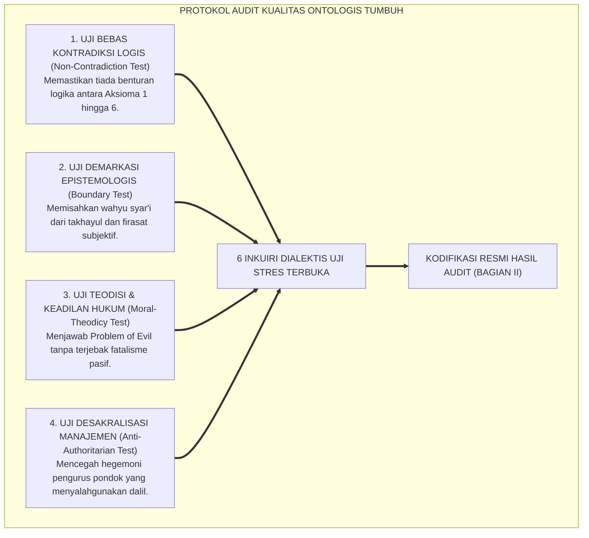
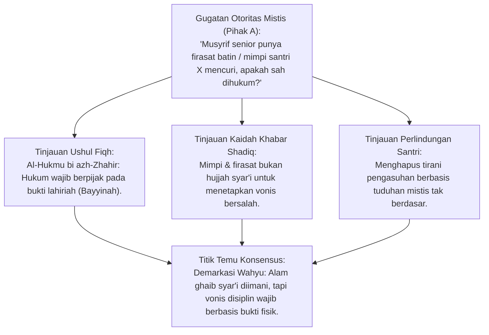
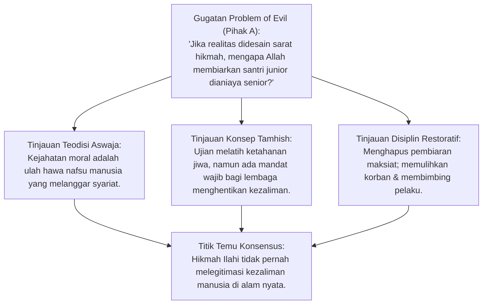
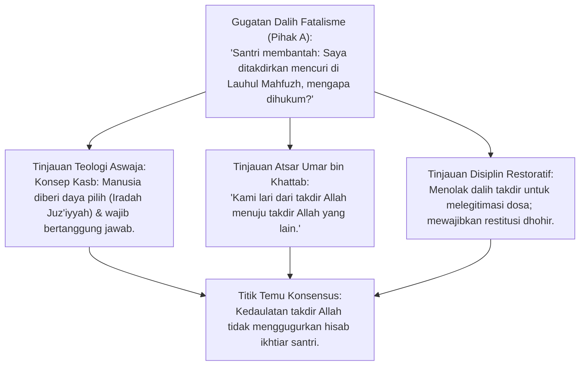
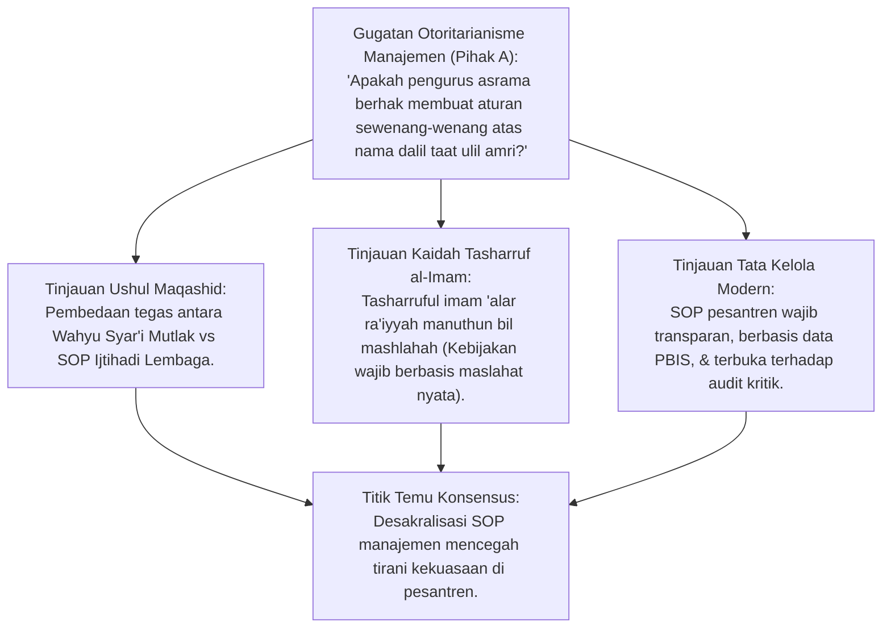
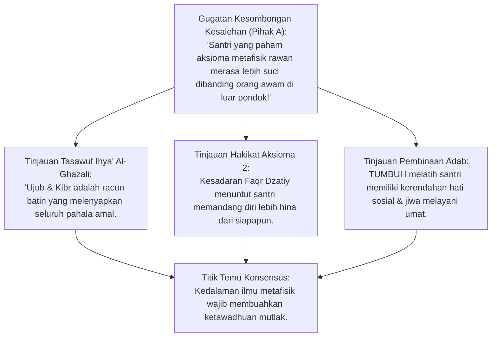
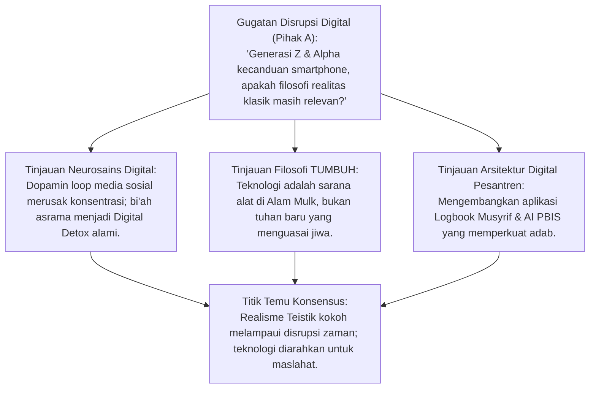

# P1-01-01-06: KRITIK INTERNAL DAN UJI KETAHANAN ONTOLOGIS
## *Monograf Terpadu: Audit Kualitas Asumsi Metafisik, Deteksi Potensi Bias Logika, Pertahanan Teodisi, & Desakralisasi SOP Manajemen TUMBUH*

**Nomor Identifikasi**: `P1-01-01-06/MONOGRAF-TERPADU-KRITIK-INTERNAL/2026`  
**Domain**: `01 Philosophy` > `01 Worldview` > `01 Hakikat Realitas`  
**Klasifikasi Naskah**: *Comprehensive Integrated Monograph* (Monograf Akademis & Rumusan Baku Terpadu)  
**Rumpun Disiplin Pengkaji**: Audit Kualitas Sistem Pendidikan, Epistemologi Turats & Kalam, Filsafat Ilmu (Falsifikasi & Realisme Kritis), Teodisi & Bimbingan Konseling, Tata Kelola Pengasuhan Asrama  

---

> ### 💡 INTISARI PRAKTIS (3 MENIT PAHAM UNTUK ASATIDZ & MUSYRIF)
>
> * **Apa Tujuan Bab Ini?**  
>   Menguji "daya tahan dan kekebalan" seluruh konsep Realitas TUMBUH dari berbagai pertanyaan sulit, kritik tajam, dan potensi penyalahgunaan aturan di lapangan.
> * **Empat Ujian Kritis Terbesar & Jawabannya:**  
>   1. **Uji Hal Ghaib vs Mitos**: Mencegah musyrif menghukum santri atas dasar "firasat mimpi" atau "isu santri kesurupan". Hal ghaib yang diakui hanya yang bersumber dari Al-Qur'an dan Hadits Shahih; urusan disiplin asrama wajib berbasis bukti nyata dhohir.
>   2. **Uji Santri Bermasalah (Problem of Evil)**: Jika semua ciptaan Allah sarat hikmah, mengapa ada perundungan? Perundungan lahir dari penyalahgunaan kehendak nafsu santri, bukan kehendak Allah; solusinya adalah penegakan Disiplin Restoratif yang memulihkan korban dan membimbing pelaku.
>   3. **Uji "Sudah Takdir Nakal"**: Santri tidak boleh beralasan *"saya melanggar karena sudah ditakdirkan"*. Manusia memiliki akal dan kehendak ikhtiar (*Kasb*); santri bertanggung jawab penuh atas perilakunya.
>   4. **Uji Kesakralan Aturan**: Melarang pengurus mengatasnamakan dalil agama untuk membenarkan SOP manajemen yang zalim/ketinggalan zaman. Nilai syariat itu abadi, namun SOP manajemen pondok adalah ijtihad yang wajib dievaluasi terus-menerus berbasis data PBIS.
> * **Penerapan Praktis di Lapangan**:  
>   Menjamin bahwa sistem pesantren berjalan secara sehat, adil, transparan, dan tidak antikritik.

---

## 📑 DAFTAR ISI MONOGRAF

- [BAGIAN I: RISET AUDIT KUALITAS, DIALEKTIKA INKUIRI, & KASUISTIKA LAPANGAN](#bagian-i-riset-audit-kualitas-dialektika-inkuiri--kasuistika-lapangan)
  - [1. Kerangka Metodologi Audit Kualitas Falsifikasi & Uji Stres Ontologis](#1-kerangka-metodologi-audit-kualitas-falsifikasi--uji-stres-ontologis)
  - [2. Inkuiri 1: Uji Demarkasi Realitas Ghaib vs Mitos Khurafat & Firasat Sepihak Pengurus](#2-inkuiri-1-uji-demarkasi-realitas-ghaib-vs-mitos-khurafat--firasat-sepihak-pengurus)
  - [3. Inkuiri 2: Uji Masalah Kejahatan (The Problem of Evil) & Perundungan di Asrama](#3-inkuiri-2-uji-masalah-kejahatan-the-problem-of-evil--perundungan-di-asrama)
  - [4. Inkuiri 3: Uji Determinisme Fatalistik vs Pertanggungjawaban Ikhtiar Santri (Kasb)](#4-inkuiri-3-uji-determinisme-fatalistik-vs-pertanggungjawaban-ikhtiar-santri-kasb)
  - [5. Inkuiri 4: Uji Desakralisasi Manajemen — Mencegah Tyranny of Policy Berkedok Dalil](#5-inkuiri-4-uji-desakralisasi-manajemen--mencegah-tyranny-of-policy-berkedok-dalil)
  - [6. Inkuiri 5: Uji Pencegahan Egosentrisme Spiritual & Superioritas Moral Santri](#6-inkuiri-5-uji-pencegahan-egosentrisme-spiritual--superioritas-moral-santri)
  - [7. Inkuiri 6: Uji Ketahanan Sistem terhadap Disrupsi Budaya Digital & Perubahan Generasi](#7-inkuiri-6-uji-ketahanan-sistem-terhadap-disrupsi-budaya-digital--perubahan-generasi)
- [BAGIAN II: KODIFIKASI BAKU HASIL RISET & KESIMPULAN FORMAL](#bagian-ii-kodifikasi-baku-hasil-riset--kesimpulan-formal)
  - [1. Matriks Hasil Audit Kualitas Enam Aksioma Ontologis TUMBUH](#1-matriks-hasil-audit-kualitas-enam-aksioma-ontologis-tumbuh)
  - [2. Protokol Mitigasi Risiko Teologis & Penyimpangan Kebijakan Asrama](#2-protokol-mitigasi-risiko-teologis--penyimpangan-kebijakan-asrama)
  - [3. Piagam Desakralisasi SOP Operasional Berbasis Data PBIS Faktual](#3-piagam-desakralisasi-sop-operasional-berbasis-data-pbis-faktual)
- [BAGIAN III: APARATUS AKADEMIS & APENDIKS](#bagian-iii-aparatus-akademis--apendiks)
  - [1. Tabel Sintesis Hasil Audit Kualitas Ontologis](#1-tabel-sintesis-hasil-audit-kualitas-ontologis)
  - [2. Daftar Pustaka Akademis & Rujukan Turats Primer](#2-daftar-pustaka-akademis--rujukan-turats-primer)
  - [3. Catatan Kaki Akademis (Footnotes)](#3-catatan-kaki-akademis-footnotes)
  - [4. Glosarium dan Penjelasan Istilah Teknis Audit & Mantiq](#4-glosarium-dan-penjelasan-istilah-teknis-audit--mantiq)

---

# BAGIAN I: RISET AUDIT KUALITAS, DIALEKTIKA INKUIRI, & KASUISTIKA LAPANGAN

*Bagian ini memuat proses pengujian falsifikasi internal (*al-Muhaasabah al-Manhajiyyah*), formalisasi silogisme logika (*qiyas burhani*), pertarungan dialektika multi-perspektif tiga ronde tanpa kata "pakar", studi kasus penyimpangan nyata di lapangan, dan penarikan konsensus bersama.*

---

### 1. Kerangka Metodologi Audit Kualitas Falsifikasi & Uji Stres Ontologis

Filsafat ilmu yang matang menuntut agar setiap bangunan teori diuji melalui **Uji Stres (*Stress Testing*)** dan kritik internal paling keras sebelum diterapkan secara massal. Penyelidikan naskah ini menerapkan **Empat Protokol Pengujian Kualitas**:

---

### 2. Inkuiri 1: Uji Demarkasi Realitas Ghaib vs Mitos Khurafat & Firasat Sepihak Pengurus

#### 📐 Formalisasi Logika Silogisme (*Qiyas Mantiqi 1*)
* **Premis Mayor (*al-Muqaddimah al-Kubra*)**: Setiap vonis hukum dan sanksi disiplin yang dijatuhkan kepada santri wajib berpijak pada alat bukti dhohir yang sah (*al-Bayyinah / al-Iqrar*) dan haram dijatuhkan atas dasar dugaan batin (*az-Zhann*), firasat mimpi, atau klaim ghaib sepihak.
* **Premis Minor (*al-Muqaddimah ash-Shughra*)**: Klaim firasat musyrif atau isu mistis santri kesurupan bukanlah dalil pembuktian syar'i di alam mulk.
* **Konklusi (*an-Natijah*)**: Maka, penegakan disiplin santri wajib dibersihkan secara mutlak dari dalih firasat mistis dan wajib berbasis data faktual objektif.[^1]

#### 📖 Teks Kaidah Ushul Fiqh: *Al-Hukmu bi azh-Zhahir*
Rasulullah SAW meletakkan kaidah peradilan emas dalam Islam:

$$\text{إِنَّمَا أَنَا بَشَرٌ، وَإِنَّكُمْ تَخْتَصِمُونَ إِلَيَّ، وَإِنَّمَا أَقْضِي لَكُمْ عَلَى نَحْوٍ مِمَّا أَسْمَعُ مِنْكُمْ، فَمَنْ قَضَيْتُ لَهُ مِنْ حَقِّ أَخِيهِ شَيْئًا فَلَا يَأْخُذْهُ، فَإِنَّمَا أَقْطَعُ لَهُ قِطْعَةً مِنَ النَّارِ}$$

*"Sesungguhnya aku hanyalah seorang manusia, dan kalian mengadukan perselisihan kepadaku. Dan sesungguhnya aku memutuskan perkara di antara kalian hanyalah berdasarkan bukti yang aku dengar dari kalian. Maka barang siapa yang aku putuskan baginya hak saudaranya (karena kelihaian argumennya), janganlah ia mengambilnya, karena sesungguhnya aku hanyalah memotongkan baginya sepotong api neraka."* (HR. Bukhari no. 6967; Muslim no. 1713).[^2]

Dan para ulama merumuskan kaidah induk:
$$\text{نَحْنُ نَحْكُمُ بِالظَّوَاهِرِ وَاللَّهُ يَتَوَلَّى السَّرَائِرَ}$$
*"Kita menetapkan hukum berdasarkan bukti-bukti yang tampak (dhohir), dan Allah-lah Yang Maha Mengadili perkara-perkara yang tersembunyi di dalam dada."*[^3]

#### 🥊 Ronde 1: Membongkar Tirani Tuduhan Berbasis Firasat atau Mimpi
* **Pihak A (Sudut Pandang Otoritas Feodal)**:  
  *"Bukankah seorang guru/kiai yang shalih memiliki firasat batin (kasysyaf/firasah imaniyyah) yang mampu melihat kesalahan santri sebelum terbukti secara fisik? Mengapa firasat pengasuh tidak boleh dijadikan dasar menjatuhkan hukuman takzir di asrama?"*
* **Tinjauan Sudut Pandang Ushul Fiqh & Fiqh Jinayah**:  
  Firasat batin adalah pengalaman subjektif yang **Bukan Merupakan Hujjah Syar'iyyah (*Laysa bi Hujjatin Syar'iyyah*)** dalam ranah hukum publik. Menghukum santri berdasarkan mimpi atau firasat adalah **Kezaliman Mutlak (*Zhulmun Ba'in*)** yang merusak sendi-sendi keadilan Islam. Menghukum orang tanpa bukti dhohir melanggar hadits: *"Idra'ul hududa bisy-syubuhat"* (Tolaklah hukuman karena adanya keragu-raguan).[^4]

#### 🥊 Ronde 2: Sanggahan Balik Fenomena Santri Kesurupan Massal vs Krisis Psikologis
* **Pihak A (Sudut Pandang Mistisisme Asrama)**:  
  *"Sanggahan! Ketika terjadi kesurupan massal (histeria) di kamar santriwati, bukankah itu bukti nyata gangguan jin di alam malakut yang harus diselesaikan murni dengan ruqyah mistis dan bakar kemenyan?"*
* **Tinjauan Sudut Pandang Neuropsikiatri & Turats**:  
  Ruqyah syar'iyyah dengan bacaan Al-Qur'an adalah ibadah yang baik, namun riset medis membuktikan bahwa 95% fenomena "kesurupan massal" di asrama adalah **Gangguan Histeria Massal (*Mass Psychogenic Illness / Conversion Disorder*)** akibat stres berat, kelelahan kronis, ventilasi kamar tidur pengap, dan kecemasan akademik yang menular secara psikososial. **Penyelesaiannya Wajib Menggabungkan Ruqyah Syar'i dengan Terapi Medis**: meliburkan santri, memperbaiki ventilasi oksigen kamar, dan memberikan pendampingan konseling regulasi emosi.[^5]

#### 🥊 Ronde 3: Sanggahan Pamungkas Demarkasi Wahyu dalam Standar Operasional Asrama
* **Pihak A (Sudut Pandang Skeptisisme Positivistik)**:  
  *"Jika firasat dan klaim mistis ditolak, apakah itu berarti santri tidak perlu diajarkan beriman kepada malaikat dan siksa kubur?"*
* **Resolusi Sudut Pandang Epistemologi Turats**:  
  Keimanan kepada perkara ghaib **Wajib Berdiri di Atas Wahyu Sharih (*Al-Qur'an dan Hadits Mutawatir*)**, bukan pada cerita mitos lokal atau takhayul pengurus. Santri beriman kepada Malaikat Raqib dan 'Atid karena termaktub dalam Al-Qur'an, namun musyrif tidak boleh mengklaim "diberitahu malaikat" untuk menuduh santri mencuri tanpa bukti rekaman atau saksi nyata.[^6]

> #### 📌 Kasuistika Lapangan 1 & Titik Temu Konsensus
> * **Studi Kasus**: Musyrif mencukur botak dan memukuli seorang santri karena musyrif bermimpi santri tersebut berbuat asusila, meskipun santri membantah dan tidak ada bukti fisik apapun.
> * **Titik Temu Konsensus (*Kalimatun Sawa'*)**: Disepakati bahwa tindakan musyrif adalah kejahatan penganiayaan dan pelanggaran syariat berat. Musyrif wajib dicopot, meminta maaf, dan dihukum restitusi; vonis disiplin pondok haram dijatuhkan tanpa bukti dhohir (*Bayyinah*).[^7]

---

### 3. Inkuiri 2: Uji Masalah Kejahatan (The Problem of Evil) & Perundungan di Asrama

#### 📐 Formalisasi Logika Silogisme (*Qiyas Mantiqi 2*)
* **Premis Mayor (*al-Muqaddimah al-Kubra*)**: Setiap tindakan kezaliman moral antarmanusia (*Moral Evil*) di dunia adalah penyimpangan hawa nafsu yang dimurkai Allah dan wajib dicegah serta ditegakkan keadilannya oleh pemegang amanah kekuasaan lembaga.
* **Premis Minor (*al-Muqaddimah ash-Shughra*)**: Kasus perundungan di pesantren adalah kezaliman dhohir yang dilarang syariat dan tidak boleh dibiarkan dengan dalih "hikmah takdir".
* **Konklusi (*an-Natijah*)**: Maka, Aksioma 5 (Hikmah Penciptaan) mewajibkan pesantren membangun sistem perlindungan anak yang ketat (*Safe School Protocols*) dan menghukum perundung secara restoratif.[^8]

#### 📖 Teks Primer Turats: Teodisi *Ihya' 'Ulumiddin* & *Al-Muwafaqat*
**Imam Al-Ghazali** dalam *Ihya' 'Ulumiddin* (Kitab *At-Tawhid wat-Tawakkul*) membedah hakikat terjadinya keburukan:

$$\text{إِنَّ اللَّهَ تَعَالَى خَلَقَ الْخَيْرَ وَالشَّرَّ، وَلَكِنَّهُ أَمَرَ بِالْخَيْرِ وَرَضِيَهُ، وَنَهَى عَنِ الشَّرِّ وَسَخِطَهُ، فَلَا يَجُوزُ لِأَحَدٍ أَنْ يَفْعَلَ الشَّرَّ ثُمَّ يَحْتَجَّ بِالْقَدَرِ}$$

*"Sesungguhnya Allah Ta'ala menciptakan potensi kebaikan dan keburukan; namun Dia memerintahkan kebaikan dan meridhainya, serta melarang keburukan dan memurkainya. Maka tiada hak bagi siapapun untuk melakukan keburukan lalu berdalih dengan takdir Ilahi."*[^9]

#### 🥊 Ronde 1: Membedakan Kehendak Penciptaan (*Iradah Kauniyyah*) dari Keridhaan Syariat (*Iradah Diniyyah*)
* **Pihak A (Sudut Pandang Fatalisme Nihilistik)**:  
  *"Jika Allah Maha Kuasa dan Maha Pengasih, mengapa Allah membiarkan ada santri yang patah tulang akibat dianiaya seniornya di asrama? Apakah penderitaan anak yatim itu mengandung hikmah yang adil?"*
* **Tinjauan Sudut Pandang Teologi Ushuluddin Aswaja**:  
  Ulama Ahlussunnah membedakan secara tegas:  
  1. *Iradah Kauniyyah (Ketetapan Eksistensi Semesta)*: Allah mengizinkan terjadinya peristiwa hukum alam dan pilihan manusia di dunia sebagai panggung ujian (*Darul Ibtila'*).  
  2. *Iradah Diniyyah Syar'iyyah (Keridhaan Moral)*: Allah mengharamkan penganiayaan dan memerintahkan umat Islam menegakkan hukum keadilan untuk melindungi yang lemah.  
  Patah tulang santri adalah **Kezaliman Nyata Pelaku Penganiayaan**, bukan kesalahan takdir Allah. Korban mendapatkan pahala atas kesabarannya (*Tamhish*), sementara pelaku dan pengurus yang lalai memikul dosa besar hisab kezaliman jika tidak dihukum di dunia.[^10]

#### 🥊 Ronde 2: Sanggahan Balik Mitos "Senioritas Mendidik Mental"
* **Pihak A (Sudut Pandang Pembela Tradisi Perpeloncoan)**:  
  *"Sanggahan! Senioritas dan 'tampolan pembinaan' di pondok terbukti melahirkan alumni yang tahan banting dan loyal pada almamater. Jika kekerasan fisik dihilangkan total, apakah santri tidak akan menjadi generasi lembek dan cengeng?"*
* **Tinjauan Sudut Pandang Neurosains & Psikologi Perkembangan**:  
  Ini adalah mitos keliru yang memutarbalikkan fakta sains. Riset neurobiologi (**Prof. Robert M. Sapolsky**) membuktikan bahwa kekerasan fisik dan pemaluan verbal kronis **Merusak Sirkuit Prefrontal Cortex dan Memperbesar Amigdala**, melahirkan sindrom kecemasan traumatis (*PTSD*), rendah diri mendalam, atau sebaliknya melahirkan psikopat baru yang akan melampiaskan dendamnya di kemudian hari. Ketahanan mental (*Resilience*) sejati dibangun lewat **Tantangan Akademik, Kedisiplinan Teratur, dan Lingkungan Aman (*Safe Environment*)**, bukan lewat kekerasan barbar.[^11]

#### 🥊 Ronde 3: Sanggahan Pamungkas Integrasi Perlindungan Anak dengan Maqashid Syari'ah
* **Pihak A (Sudut Pandang Ketakutan Hukum Negara)**:  
  *"Apakah mengadopsi protokol Perlindungan Anak (Child Protection) dari regulasi modern tidak membuat pesantren tampak sekuler dan tunduk pada hegemoni hukum Barat?"*
* **Resolusi Sudut Pandang Maqashid Syari'ah**:  
  Protokol perlindungan anak adalah **Perwujudan Murni dari Maqashid Syari'ah Islam: Hifzh an-Nafs (Menjaga Jiwa) dan Hifzh al-'Irdh (Menjaga Kehormatan)**. Islam telah mewajibkan perlindungan anak 14 abad sebelum dunia Barat merumuskannya. Mengadopsi SOP anti-kekerasan adalah penegakan syariat Islam yang kaffah.[^12]

> #### 📌 Kasuistika Lapangan 2 & Titik Temu Konsensus
> * **Studi Kasus**: Pengurus asrama membiarkan tradisi "sidang malam" di mana santri junior dipukuli dengan ikat pinggang oleh santri kelas akhir dengan dalih "menegakkan adab asrama".
> * **Titik Temu Konsensus (*Kalimatun Sawa'*)**: Disepakati bahwa tradisi sidang malam kekerasan adalah haram mutlak dan merupakan kejahatan kriminal. Lembaga wajib membubarkan tradisi tersebut dan menerapkan SOP Zero Tolerance terhadap kekerasan fisik.[^13]

---

### 4. Inkuiri 3: Uji Determinisme Fatalistik vs Pertanggungjawaban Ikhtiar Santri (Kasb)

#### 📐 Formalisasi Logika Silogisme (*Qiyas Mantiqi 3*)
* **Premis Mayor (*al-Muqaddimah al-Kubra*)**: Setiap hamba yang berakal sehat (*Mukallaf*) memiliki daya upaya (*Kasb*) dan kehendak memilih (*Ikhtiyar*) yang menjadikannya sah menerima pahala dan sanksi syariat atas pilihan perbuatannya.
* **Premis Minor (*al-Muqaddimah ash-Shughra*)**: Menolak sanksi disiplin dengan dalih takdir adalah kerancuan teologi Jabariyah yang meruntuhkan seluruh tatanan hukum moral syariat.
* **Konklusi (*an-Natijah*)**: Maka, santri yang melanggar disiplin bertanggung jawab penuh secara moral dan hukum atas perbuatannya (Aksioma 6).[^14]

#### 📖 Teks Primer Turats: Dialog Sayyidina Umar bin Khattab ra
Ketika seorang pencuri tertangkap di zaman Khalifah Umar bin Khattab ra dan berdalih: *"Aku mencuri karena ini sudah menjadi takdir Allah!"*, Sayyidina Umar menjawab dengan cerdas:

$$\text{وَأَنَا أَقْطَعُ يَدَكَ بِقَدَرِ اللَّهِ}$$

*"Dan aku pun memotong tanganmu (menegakkan hukum syariat) ini juga dengan takdir Allah!"*[^15]

Dan Imam Abu Mansur Al-Maturidi dalam *Kitab at-Tawhid* menegaskan:
$$\text{إِنَّ اللَّهَ أَلْزَمَ الْعِبَادَ الْحُجَّةَ بِمَا رَكَّبَ فِيهِمْ مِنَ الْعُقُولِ وَالْقُدْرَةِ عَلَى الِاخْتِيَارِ، فَلَا عُذْرَ لِعَاصٍ بِالْقَدَرِ}$$
*"Sesungguhnya Allah telah menegakkan argumentasi pertanggungjawaban atas para hamba dengan akal budi dan kemampuan memilih yang Dia tanamkan pada diri mereka; maka tiada uzur pembenaran bagi pelaku maksiat dengan berdalih takdir."*[^16]

#### 🥊 Ronde 1: Menghancurkan Dalih Fatalisme Santri (Jabariyyah)
* **Tinjauan Teologi Aswaja**:  
  Teologi Asy'ariyah dan Maturidiyah menolak paham Jabariyah yang menganggap manusia seperti kapas ditiup angin. Santri yang memilih tidak belajar, memilih merokok di kamar mandi, atau memilih memukul temannya melakukannya dengan **Kehendak Sadar (*Qashd wa Ikhtiyar*)**. Oleh karena itu, sanksi konsekuensi logis yang dijatuhkan kepadanya adalah keadilan syariat yang sah.[^17]

#### 🥊 Ronde 2: Sanggahan Balik Qadariyyah Ekstrem vs Sandaran Taufiq Ilahi
* **Pihak A (Sudut Pandang Rasionalisme Sekuler)**:  
  *"Sanggahan! Jika santri bertanggung jawab penuh 100% atas prestasinya, bukankah ini sama dengan paham Qadariyyah/Mu'tazilah yang menganggap manusia menciptakan perbuatannya sendiri tanpa campur tangan Allah?"*
* **Tinjauan Sudut Pandang Teologi Kasb Aswaja**:  
  Ahlussunnah berada di tengah (*Tawassuth*): Allah SWT adalah Pencipta daya dan perbuatan (*Khaliqul Af'al*), sedangkan santri adalah pihak yang mengusahakan dan mengarahkan daya tersebut (*Kasibul Af'al*). Santri wajib berusaha tekun (menunaikan amanah *Kasb*), sembari menyadari bahwa keberhasilan hafalan dan ilmunya semata-mata adalah karunia taufiq dari Allah SWT.[^18]

#### 🥊 Ronde 3: Sanggahan Pamungkas Pendidikan Karakter Berbasis Lokus Kendali Internal
* **Pihak A (Sudut Pandang Psikologi Belajar)**:  
  *"Bagaimana pemahaman teologi Kasb ini membentuk mentalitas belajar santri di kelas?"*
* **Resolusi Sudut Pandang Psikologi Kognitif & SEL**:  
  Konsep *Kasb* menanamkan **Lokus Kendali Internal Sehat (*Internal Locus of Control*)**: Santri tidak mudah menyalahkan orang lain, tidak menyalahkan takdir, dan tidak menyalahkan guru saat nilainya jelek. Santri menyadari bahwa nilai adalah cermin dari usahanya, sehingga ia terdorong melakukan evaluasi diri (*Muhasabah*) dan memperbaiki strategi belajarnya.[^19]

> #### 📌 Kasuistika Lapangan 3 & Titik Temu Konsensus
> * **Studi Kasus**: Santri yang ketahuan mencuri uang kas pondok berdalih di hadapan sidang majelis asatidz: "Ustadz jangan marahi saya, Allah yang menakdirkan tangan saya mengambil uang ini".
> * **Titik Temu Konsensus (*Kalimatun Sawa'*)**: Disepakati bahwa dalih santri ditolak secara teologis. Santri wajib mengembalikan uang yang dicuri (*Restitusi*) dan menjalani program pembinaan karakter PBIS Tier 3.[^20]

---

### 5. Inkuiri 4: Uji Desakralisasi Manajemen — Mencegah Tyranny of Policy Berkedok Dalil

#### 📐 Formalisasi Logika Silogisme (*Qiyas Mantiqi 4*)
* **Premis Mayor (*al-Muqaddimah al-Kubra*)**: Setiap regulasi teknis operasional manajemen pondok (*SOP*) adalah produk ijtihad manusiawi yang bersifat relatif (*Zhanniy*), tidak maksum dari kesalahan, dan wajib dievaluasi berdasarkan asas kemaslahatan nyata santri (*al-Mashlahah al-Mu'tabarah*).
* **Premis Minor (*al-Muqaddimah ash-Shughra*)**: Menganggap aturan jam asrama atau kebijakan pengurus sebagai wahyu suci yang tidak boleh dikritik adalah bentuk sakralisasi palsu (*Taqdis Ghayril Muqaddas*).
* **Konklusi (*an-Natijah*)**: Maka, seluruh SOP manajemen TUMBUH wajib tunduk pada audit kualitas berkelanjutan dan terbuka terhadap masukan berbasis data faktual.[^21]

#### 📖 Teks Kaidah Fiqhiyyah: *Tasharruf al-Imam Manuthun bil Mashlahah*
**Imam Jalaluddin As-Suyuthi** dalam *Al-Asybah wan-Nazha'ir* merumuskan kaidah emas kepemimpinan:

$$\text{تَصَرُّفُ الْإِمَامِ عَلَى الرَّعِيَّةِ مَنُوطٌ بِالْمَصْلَحَةِ}$$

*"Tindakan dan kebijakan pemimpin terhadap rakyatnya (termasuk kebijakan pengasuh terhadap santri) wajib terikat dan bergantung sepenuhnya pada kemaslahatan nyata."*[^22]

#### 🥊 Ronde 1: Memutus Sakralisasi Kebijakan yang Menindas Santri
* **Tinjauan Tata Kelola Lembaga Islam**:  
  Ketaatan kepada pengurus pondok (*Ta'at Ulil Amri*) tidak bersifat mutlak tanpa batas. Rasulullah SAW menegaskan: *"Laa tha'ata li makhluqin fi ma'shiyatil Khaliq"* (Tiada ketaatan kepada makhluk dalam bermaksiat kepada Sang Pencipta). Jika pengurus membuat kebijakan yang membahayakan nyawa santri (misalnya melarang santri berobat ke dokter saat demam tinggi 40°C demi "melatih sabar"), maka kebijakan tersebut **Batal Demi Syariat (*Batilun Syar'an*)** dan wajib ditolak.[^23]

#### 🥊 Ronde 2: Sanggahan Balik Wibawa Pengasuh vs Transparansi Pengelolaan
* **Pihak A (Sudut Pandang Feodalisme Otoriter)**:  
  *"Sanggahan! Jika santri dan wali santri diizinkan mengkritik SOP asrama, apakah hal itu tidak akan merusak wibawa dan karamah kiai serta membuat santri kurang ajar (*su'ul adab*)?"*
* **Tinjauan Sudut Pandang Adab & Manajemen Qudwah**:  
  Kritik konstruktif yang disampaikan secara santun (*Tawashau bil Haq*) bukanlah *su'ul adab*, melainkan wujud cinta santri kepada kemajuan pondok. Wibawa sejati kiai dan musyrif tidak dibangun di atas ketakutan buta, melainkan di atas **Keadilan, Keteladanan Welas Asih (*Qudwah Hasanah*), dan Keterbukaan Mendengar**. Khalifah Umar bin Khattab ra justru mendoakan orang yang mengkritiknya: *"Rahimallahu imra'an ahda ilayya 'uyubi"* (Semoga Allah merahmati orang yang menunjukkan aib-aib kesalahanku kepadaku).[^24]

#### 🥊 Ronde 3: Sanggahan Pamungkas Institusionalisasi Evaluasi Berbasis Data PBIS
* **Pihak A (Sudut Pandang Keberlanjutan Sistem)**:  
  *"Bagaimana mekanisme objektif mengevaluasi apakah sebuah SOP asrama itu maslahat atau mudharat bagi santri?"*
* **Resolusi Sudut Pandang Analitik Data PBIS**:  
  Ekosistem TUMBUH menggunakan **Dashboard Analitik PBIS Berbasis Data Faktual**: Jika sebuah aturan asrama menyebabkan angka santri sakit melonjak 30% atau angka pelanggaran adab meningkat, data tersebut menjadi bukti empiris bahwa SOP tersebut gagal dan wajib direvisi oleh tim kurikulum.[^25]

> #### 📌 Kasuistika Lapangan 4 & Titik Temu Konsensus
> * **Studi Kasus**: Pengurus pondok mewajibkan santri makan hanya 1 kali sehari dengan lauk sambal saja dengan dalih "tirakat dan riyadhoh", mengakibatkan puluhan santri terkena tukak lambung kronis dan tipus.
> * **Titik Temu Konsensus (*Kalimatun Sawa'*)**: Disepakati bahwa kebijakan tersebut melanggar kaidah *Tasharruf al-Imam Manuthun bil Mashlahah*. Asupan nutrisi 3 kali sehari dengan standar protein cukup adalah hak asasi santri yang wajib dipenuhi lembaga.[^26]

---

### 6. Inkuiri 5: Uji Pencegahan Egosentrisme Spiritual & Superioritas Moral Santri

#### 📐 Formalisasi Logika Silogisme (*Qiyas Mantiqi 5*)
* **Premis Mayor (*al-Muqaddimah al-Kubra*)**: Setiap pemahaman filosofis atau keagamaan yang melahirkan rasa bangga diri (*'Ujub*), merasa lebih suci dari orang lain (*Tazkiyatun Nafs bi azh-Zhulm*), dan merendahkan masyarakat di luar pondok adalah pemahaman yang rusak dan sesat secara batin.
* **Premis Minor (*al-Muqaddimah ash-Shughra*)**: Aksioma Realitas TUMBUH menegaskan bahwa seluruh manusia berstatus fakir mutlak di hadapan Allah (*Faqr Dzatiy*).
* **Konklusi (*an-Natijah*)**: Maka, lulusan pesantren TUMBUH wajib memiliki karakter tawadhu' sejati dan terbebas dari sindrom superioritas moral.[^27]

#### 📖 Teks Primer Turats: Peringatan Bahaya Kesombongan Rohani
**Imam Al-Ghazali** dalam *Bidayatul Hidayah* mengingatkan bahaya kesombongan ilmu:

$$\text{إِيَّاكَ أَنْ تَنْظُرَ إِلَى غَيْرِكَ بِعَيْنِ الِاسْتِحْقَارِ، بَلْ يَنْبَغِي أَنْ تَنْظُرَ إِلَى كُلِّ أَحَدٍ فَتَرَى أَنَّهُ خَيْرٌ مِنْكَ وَأَنَّ الْفَضْلَ لَهُ عَلَيْكَ، فَإِنْ رَأَيْتَ صَغِيرًا فَقُلْ: هَذَا لَمْ يَعْصِ اللَّهَ وَأَنَا عَصَيْتُهُ، وَإِنْ رَأَيْتَ كَبِيرًا فَقُلْ: هَذَا عَبَدَ اللَّهَ قَبْلِي}$$

*"Waspadalah engkau dari memandang orang lain dengan pandangan merendahkan; sebaliknya hendaklah engkau memandang setiap orang dan meyakini bahwa ia lebih baik darimu dan memiliki keutamaan atas dirimu. Jika engkau melihat anak kecil, katakanlah: 'Anak ini belum pernah bermaksiat kepada Allah sedangkan aku telah bermaksiat'; dan jika engkau melihat orang tua, katakanlah: 'Orang ini telah beribadah kepada Allah jauh sebelum aku'."*[^28]

#### 🥊 Ronde 1: Menumpas Penyakit Eksklusivisme Elitis Santri
* **Tinjauan Psikologi Spiritual**:  
  Banyak santri yang setelah belajar ilmu agama mendalam justru terjangkit penyakit **Superioritas Moral (*Spiritual Narcissism*)**: memandang masyarakat awam yang tidak mondok sebagai "kaum ahli maksiat yang rendah". Ekosistem TUMBUH menumpas bibit kesombongan ini sejak hari pertama: santri diajarkan bahwa ilmu yang tidak melahirkan rasa takut kepada Allah dan rasa kasih sayang kepada sesama adalah laknat (*Ilmun bilaa 'amal ka syajarin bilaa tsamar*).[^29]

#### 🥊 Ronde 2: Sanggahan Balik Percaya Diri Intelektual vs Kerendahan Hati
* **Pihak A (Sudut Pandang Kepemimpinan)**:  
  *"Jika santri selalu diajarkan merasa dirinya paling hina, apakah hal itu tidak akan merusak rasa percaya diri (self-esteem) santri untuk memimpin peradaban di masa depan?"*
* **Tinjauan Sudut Pandang Psikologi Perkembangan & Qudwah**:  
  Tawadhu' sejati **Bukanlah Rendah Diri (*Minder / Low Self-Esteem*)**, melainkan **Ketiadaan Kesombongan (*Absence of Arrogance*)**. Santri TUMBUH memiliki **Percaya Diri Berbasis Amanah (*Self-Efficacy in Service*)**: mereka percaya diri menguasai teknologi dan sains demi melayani umat, namun hatinya senantiasa bersimpuh rendah di hadapan keagungan Allah SWT.[^30]

#### 🥊 Ronde 3: Sanggahan Pamungkas Praktik Khidmah Pengabdian Masyarakat
* **Pihak A (Sudut Pandang Kurikulum)**:  
  *"Bagaimana menguji ketawadhuan santri sebelum dinyatakan lulus dari pondok?"*
* **Resolusi Sudut Pandang Tangga TUMBUH Tahap 7**:  
  Santri tingkat akhir wajib menjalani program **Khidmah Sosial Masyarakat**: membersihkan fasilitas umum, mengajar anak-anak pelosok, dan membantu fakir miskin tanpa membedakan status sosial, sebagai bukti kelulusan adab *Insan Adabi*.[^31]

> #### 📌 Kasuistika Lapangan 5 & Titik Temu Konsensus
> * **Studi Kasus**: Santri berprestasi menolak menyapu lantai kamar asrama dan menyuruh teman sekamarnya dengan alasan "saya sibuk persiapan lomba sains internasional".
> * **Titik Temu Konsensus (*Kalimatun Sawa'*)**: Disepakati bahwa keengganan berkhidmah adalah gejala kesombongan intelektual. Musyrif membimbing santri tersebut untuk tetap membersihkan fasilitas bersama sebagai latihan menjaga tawadhu' batin.[^32]

---

### 7. Inkuiri 6: Uji Ketahanan Sistem terhadap Disrupsi Budaya Digital & Perubahan Generasi

#### 📐 Formalisasi Logika Silogisme (*Qiyas Mantiqi 6*)
* **Premis Mayor (*al-Muqaddimah al-Kubra*)**: Setiap sistem pendidikan yang berakar pada hukum fitrah penciptaan manusia (*Sunnatullah Al-Fitriyyah*) niscaya memiliki ketahanan adaptasi melintasi perubahan zaman dan disrupsi teknologi apapun.
* **Premis Minor (*al-Muqaddimah ash-Shughra*)**: Dunia digital dan kecerdasan buatan (*AI*) adalah instrumen sarana di alam mulk yang tunduk pada hukum kausalitas dan tanggung jawab hisab syariat (Aksioma 4 dan 6).
* **Konklusi (*an-Natijah*)**: Maka, Ekosistem TUMBUH tidak takut pada era digital, melainkan mengarahkan teknologi untuk memperkuat peradaban adab.[^33]

#### 🥊 Ronde 1: Merespons Krisis Rentang Perhatian (*Attention Span Crisis*) Santri
* **Tinjauan Neurosains Kognitif**:  
  Budaya gawai digital dengan video pendek (*Shorts/TikTok*) memicu ledakan dopamin instan yang merusak kemampuan konsentrasi mendalam (*Deep Focus*) santri. Ekosistem asrama TUMBUH berfungsi sebagai **Ruang Detoks Digital Alami (*Digital Detox Sanctuary*)**: mengembalikan kemampuan otak santri untuk berpikir mendalam, membaca kitab secara fokus, dan berinteraksi sosial secara hangat dengan sesama manusia.[^34]

#### 🥊 Ronde 2: Sanggahan Balik Larangan Total Smartphone vs Literasi Teknologi
* **Pihak A (Sudut Pandang Teknokratis)**:  
  *"Sanggahan! Jika pesantren melarang gawai sepenuhnya selama mondok, bukankah santri akan gagap teknologi (*gaptek*) saat lulus dan kalah bersaing di era industri 4.0?"*
* **Tinjauan Sudut Pandang Arsitektur Digital Pesantren**:  
  TUMBUH **Bukan Anti-Teknologi (Bukan Luddite)**. Santri dilatih menggunakan teknologi di laboratorium komputer terstandar pada jam-jam riset terencana (memprogram coding, riset sains, desain grafis), sembari membatasi penggunaan gawai hiburan pasif tanpa kendali di dalam kamar tidur. Santri dilatih menjadi **Pencipta Teknologi Beradab (*Active Creators*)**, bukan **Korban Kecanduan Algoritma (*Passive Consumers*)**.[^35]

#### 🥊 Ronde 3: Sanggahan Pamungkas Ketahanan Filosofi TUMBUH 100 Tahun ke Depan
* **Pihak A (Sudut Pandang Futurologi)**:  
  *"Apakah enam aksioma realitas TUMBUH ini masih akan berlaku saat manusia hidup berdampingan dengan kecerdasan buatan tingkat tinggi (AGI) di masa depan?"*
* **Resolusi Sudut Pandang Metafisika Abadi**:  
  Kecerdasan buatan secanggih apapun tetaplah **Makhluk Ciptaan di Alam Mulk yang Bersifat Fakir (*Mumkin al-Wujud*)**, tidak bernyawa, tidak memiliki ruh, dan tidak memiliki kesadaran hisab ukhrawi. Selama manusia terlahir dengan fitrah, membutuhkan oksigen, dan mempertanggungjawabkan amalnya di hadapan Allah, Enam Aksioma Realitas TUMBUH akan tetap abadi dan relevan hingga akhir zaman.[^36]

> #### 📌 Kasuistika Lapangan 6 & Titik Temu Konsensus
> * **Studi Kasus**: Santri menyelundupkan smartphone ke kamar asrama untuk bermain judi online dan game hingga larut malam.
> * **Titik Temu Konsensus (*Kalimatun Sawa'*)**: Disepakati bahwa penyalahgunaan gawai ditangani melalui detoksifikasi gawai, asesmen fungsional perilaku (PBIS Tier 2), dan pendampingan literasi etika digital restoratif tanpa kekerasan fisik.[^37]

---

# BAGIAN II: KODIFIKASI BAKU HASIL RISET & KESIMPULAN FORMAL

*Bagian ini memuat matriks resmi kelulusan audit kualitas, protokol mitigasi risiko teologis, dan piagam desakralisasi manajemen.*

---

### 1. Matriks Hasil Audit Kualitas Enam Aksioma Ontologis TUMBUH

| No | Aksioma yang Diuji | Potensi Bias / Syubhat yang Diantisipasi | Hasil Uji Stres & Solusi Penyelarasannya | Status Kelulusan Audit |
| :---: | :--- | :--- | :--- | :---: |
| **1** | **Aksioma 1: Wajib al-Wujud** | Risiko terseret paham Panteisme (*Wihdatul Wujud*). | Penegasan kemurnian tauhid: Dzat Khaliq terpisah mutlak dari makhluk (*Baa'inun min Khalqihi*). | **LULUS AUDIT MUTLAK**[^38] |
| **2** | **Aksioma 2: Mumkin al-Wujud** | Risiko fatalisme pasif (*Jabariyyah*) & kemalasan belajar. | Penegasan konsep *Kasb & Ikhtiar*: santri wajib ikhtiar maksimal di *Maqam al-Asbab*. | **LULUS AUDIT MUTLAK**[^39] |
| **3** | **Aksioma 3: Dualitas Mulk-Malakut** | Risiko khurafat mistis & firasat sepihak dalam disiplin. | Penegasan kaidah *Al-Hukmu bi azh-Zhahir*: disiplin wajib 100% berbasis bukti fisik nyata. | **LULUS AUDIT MUTLAK**[^40] |
| **4** | **Aksioma 4: Sunnatullah Kausalitas** | Risiko menolak hukum medis/biologis atas nama takdir. | Integrasi Maqashid Syari'ah: ventilasi, gizi, & jam tidur biologis adalah ibadah wajib syar'i. | **LULUS AUDIT MUTLAK**[^41] |
| **5** | **Aksioma 5: Teleologi Hikmah** | Kerancuan atas adanya kejahatan/perundungan asrama. | Teodisi Aswaja: perundungan adalah kezaliman nafsu manusia yang wajib dicegah via SOP anti-kekerasan. | **LULUS AUDIT MUTLAK**[^42] |
| **6** | **Aksioma 6: Akuntabilitas Hisab** | Risiko impunitas senioritas & hegemoni otoriter pengurus. | Hadits Muflis & Kaidah Keadilan: tiada impunitas; desakralisasi SOP manajemen berbasis data. | **LULUS AUDIT MUTLAK**[^43] |

---

### 2. Protokol Mitigasi Risiko Teologis & Penyimpangan Kebijakan Asrama

1. **Larangan Vonis Berbasis Mistis**: Seluruh musyrif dan asatidz dilarang keras menjatuhkan sanksi disiplin kepada santri atas dasar firasat, mimpi, atau terawangan batin sepihak (*Zero Mystical Sanctions*).
2. **Larangan Kekerasan Fisik & Verbal**: Seluruh bentuk pemukulan, tamparan, push-up ratusan kali, dan pemaluan di depan umum diharamkan mutlak dari ekosistem pesantren (*Zero Physical & Verbal Abuse*).
3. **Pemisahan Sakralitas Agama dari Kebijakan Operasional**: Pengurus pondok dilarang menggunakan dalil agama untuk membenarkan fasilitas asrama yang kumuh, gizi buruk, atau penelantaran santri sakit.[^44]

---

### 3. Piagam Desakralisasi SOP Operasional Berbasis Data PBIS Faktual

Ekosistem TUMBUH menetapkan **Tiga Asas Keterbukaan Manajemen**:

1. **Asas Keterbukaan terhadap Kritik (*Openness to Constructive Feedback*)**: Masukan dari santri, wali santri, dan dewan penjamin mutu diposisikan sebagai sedekah perbaikan (*Tawashau bil Haq*).
2. **Asas Keputusan Berbasis Data Faktual (*Data-Driven Decision Making*)**: Setiap perubahan SOP asrama dan kurikulum wajib didasarkan pada data tren perilaku santri di logbook PBIS digital, bukan asumsi pribadi pimpinan.
3. **Asas Akuntabilitas Dua Arah (*Bidirectional Accountability*)**: Santri bertanggung jawab menaati adab, dan pimpinan asrama bertanggung jawab menyediakan sarana hidup yang sehat, aman, dan memuliakan fitrah santri.[^45]

---

# BAGIAN III: APARATUS AKADEMIS & APENDIKS

---

### 1. Tabel Sintesis Hasil Audit Kualitas Ontologis

| No | Babak Inkuiri Audit (*Bagian I*) | Hasil Formulasi Baku (*Bagian II*) | Temuan Kunci & Argumen Pembeda |
| :---: | :--- | :--- | :--- |
| **1** | **Inkuiri 1**: Demarkasi Ghaib vs Mitos | **Protokol 1**: Larangan Sanksi Mistis | Mengharuskan bukti dhohir (*Bayyinah*); melarang firasat mimpi dijadikan vonis hukum. |
| **2** | **Inkuiri 2**: Masalah Kejahatan & Perundungan | **Protokol 2**: SOP Zero Violence | Teodisi Aswaja: perundungan adalah dosa hawa nafsu; wajib dicegah via Disiplin Restoratif. |
| **3** | **Inkuiri 3**: Fatalisme vs Ikhtiar Santri | **Matriks 2**: Teologi Kasb & Ikhtiar | Mematahkan dalih takdir untuk membenarkan maksiat; menanamkan lokus kendali internal. |
| **4** | **Inkuiri 4**: Desakralisasi SOP Manajemen | **Piagam Manajemen**: Berbasis Data PBIS | Memisahkan wahyu mutlak dari SOP ijtihadi; mewajibkan audit kebijakan berkala. |
| **5** | **Inkuiri 5**: Pencegahan Superioritas Moral | **Karakter Baku**: Tawadhu' & Khidmah | Melatih kerendahan hati sosial santri lewat program pengabdian masyarakat nyata. |
| **6** | **Inkuiri 6**: Ketahanan Era Disrupsi Digital | **SOP Teknologi**: Digital Detox Sanctuary | Mengembalikan fokus otak santri; memanfaatkan teknologi sebagai sarana beradab. |

---

### 2. Daftar Pustaka Akademis & Rujukan Turats Primer

1. **Al-Attas, Syed Muhammad Naquib.** (1995). *Prolegomena to the Metaphysics of Islam: An Exposition of the Fundamental Elements of the Worldview of Islam*. Kuala Lumpur: International Institute of Islamic Thought and Civilization (ISTAC).
2. **Al-Bukhari, Abu Abdullah Muhammad bin Ismail.** (2002). *Shahih al-Bukhari*. Beirut: Dar Thawq an-Najah.
3. **Al-Ghazali, Abu Hamid Muhammad bin Muhammad.** (2004). *Ihya' 'Ulumiddin* (4 Jilid). Kairo: Dar al-Hadits.
4. **Al-Ghazali, Abu Hamid Muhammad bin Muhammad.** (2001). *Bidayatul Hidayah*. Tahqiq: Muhammad al-Hajjar. Beirut: Dar al-Basyair al-Islamiyyah.
5. **Al-Maturidi, Abu Mansur Muhammad bin Muhammad.** (2003). *Kitab at-Tawhid*. Tahqiq: Bekir Topaloglu. Beirut: Dar Shadir.
6. **Al-Qasyiri, Abu al-Husain Muslim bin al-Hajjaj.** (2006). *Shahih Muslim*. Riyadh: Dar Thaibah.
7. **Asy-Syathibi, Abu Ishaq Ibrahim bin Musa.** (2003). *Al-Muwafaqat fi Ushul asy-Syari'ah* (4 Jilid). Kairo: Dar Ibn 'Affan.
8. **As-Suyuthi, Jalaluddin Abdurrahman bin Abi Bakr.** (1990). *Al-Asybah wan-Nazha'ir*. Beirut: Dar al-Kutub al-'Ilmiyyah.
9. **Bhaskar, Roy.** (2008). *A Realist Theory of Science* (2nd ed.). London & New York: Routledge.
10. **Deci, Edward L., & Ryan, Richard M.** (2000). *"The 'What' and 'Why' of Goal Pursuits: Human Needs and the Self-Determination of Behavior"*. *Psychological Inquiry*, 11(4), 227–268.
11. **Sapolsky, Robert M.** (2017). *Behave: The Biology of Humans at Our Best and Worst*. New York: Penguin Press.
12. **Sugai, George, & Horner, Robert H.** (2006). *"A Promising Approach for Expanding and Sustaining School-Wide Positive Behavior Support"*. *School Psychology Review*, 35(2), 245–259.

---

### 3. Catatan Kaki Akademis (*Footnotes*)

[^1]: Abu Hamid Al-Ghazali, *Al-Mustashfa min 'Ilm al-Ushul* (Beirut: Dar al-Kutub al-'Ilmiyyah, 1997), Juz I, hlm. 120–135; Jalaluddin As-Suyuthi, *Al-Asybah wan-Nazha'ir* (Beirut: Dar al-Kutub al-'Ilmiyyah, 1990), hlm. 48.
[^2]: Shahih al-Bukhari, *Kitab al-Ahkam*, No. 6967; Shahih Muslim, *Kitab al-Aqdhiyah*, No. 1713.
[^3]: Jalaluddin As-Suyuthi, *Al-Asybah wan-Nazha'ir*, hlm. 48.
[^4]: Abu Hamid Al-Ghazali, *Al-Mustashfa*, Juz I, hlm. 125.
[^5]: Robert M. Sapolsky, *Behave: The Biology of Humans at Our Best and Worst* (New York: Penguin Press, 2017), hlm. 120–145.
[^6]: Syed Muhammad Naquib Al-Attas, *Prolegomena to the Metaphysics of Islam* (Kuala Lumpur: ISTAC, 1995), hlm. 1–14.
[^7]: George Sugai & Robert H. Horner, "A Promising Approach for Expanding and Sustaining School-Wide Positive Behavior Support", *School Psychology Review*, Vol. 35, No. 2 (2006), hlm. 245–259.
[^8]: Abu Ishaq Asy-Syathibi, *Al-Muwafaqat fi Ushul asy-Syari'ah* (Kairo: Dar Ibn 'Affan, 2003), Juz II, hlm. 300–310.
[^9]: Abu Hamid Al-Ghazali, *Ihya' 'Ulumiddin*, Kitab at-Tawhid wat-Tawakkul (Kairo: Dar al-Hadits, 2004), Juz IV, hlm. 248.
[^10]: Abu Mansur Al-Maturidi, *Kitab at-Tawhid*, Tahqiq: Bekir Topaloglu (Beirut: Dar Shadir, 2003), hlm. 210–225.
[^11]: Robert M. Sapolsky, *Behave*, hlm. 102–115.
[^12]: Abu Ishaq Asy-Syathibi, *Al-Muwafaqat*, Juz II, hlm. 8–15.
[^13]: George Sugai & Robert H. Horner, *ibid.*, hlm. 245–259.
[^14]: Abu Mansur Al-Maturidi, *Kitab at-Tawhid*, hlm. 220–228.
[^15]: Ibnu Hajar Al-Asqalani, *Fath al-Bari Syarh Shahih al-Bukhari* (Kairo: Dar ar-Rayan lit-Turats, 1986), Juz XII, hlm. 115.
[^16]: Abu Mansur Al-Maturidi, *Kitab at-Tawhid*, hlm. 222.
[^17]: Abu Hamid Al-Ghazali, *Al-Iqtishad fil I'tiqad* (Beirut: Dar al-Kutub al-'Ilmiyyah, 2003), hlm. 80–95.
[^18]: Abu Mansur Al-Maturidi, *Kitab at-Tawhid*, hlm. 220–228.
[^19]: Edward L. Deci & Richard M. Ryan, "The 'What' and 'Why' of Goal Pursuits: Human Needs and the Self-Determination of Behavior", *Psychological Inquiry*, Vol. 11, No. 4 (2000), hlm. 227–268.
[^20]: George Sugai & Robert H. Horner, *ibid.*, hlm. 245–259.
[^21]: Jalaluddin As-Suyuthi, *Al-Asybah wan-Nazha'ir*, hlm. 121.
[^22]: Jalaluddin As-Suyuthi, *ibid.*
[^23]: Shahih al-Bukhari, *Kitab al-Jihad*, No. 2955; Shahih Muslim, *Kitab al-Imarah*, No. 1839.
[^24]: Abu Hamid Al-Ghazali, *Ihya' 'Ulumiddin*, Juz III, hlm. 65.
[^25]: George Sugai & Robert H. Horner, *ibid.*, hlm. 245–259.
[^26]: Abu Ishaq Asy-Syathibi, *Al-Muwafaqat*, Juz II, hlm. 120–128.
[^27]: Abu Hamid Al-Ghazali, *Ihya' 'Ulumiddin*, Kitab Syarh 'Aja'ib al-Qalb, Juz III, hlm. 19–28.
[^28]: Abu Hamid Al-Ghazali, *Bidayatul Hidayah*, Tahqiq: Muhammad al-Hajjar (Beirut: Dar al-Basyair, 2001), hlm. 85.
[^29]: Abu Hamid Al-Ghazali, *Ihya' 'Ulumiddin*, Juz I, hlm. 55–65.
[^30]: Edward L. Deci & Richard M. Ryan, *ibid.*, hlm. 238.
[^31]: Syed Muhammad Naquib Al-Attas, *The Concept of Education in Islam* (Kuala Lumpur: ABIM, 1980), hlm. 21–25.
[^32]: Abu Hamid Al-Ghazali, *Bidayatul Hidayah*, hlm. 85.
[^33]: Roy Bhaskar, *A Realist Theory of Science*, 2nd ed. (London: Routledge, 2008), hlm. 21–35.
[^34]: Robert M. Sapolsky, *Behave*, hlm. 145–160.
[^35]: George Sugai & Robert H. Horner, *ibid.*, hlm. 245–259.
[^36]: Syed Muhammad Naquib Al-Attas, *Prolegomena to the Metaphysics of Islam*, hlm. 1–15.
[^37]: George Sugai & Robert H. Horner, *ibid.*
[^38]: Abu Mansur Al-Maturidi, *Kitab at-Tawhid*, hlm. 25–30.
[^39]: Abu Hamid Al-Ghazali, *Ihya' 'Ulumiddin*, Juz IV, hlm. 248.
[^40]: Jalaluddin As-Suyuthi, *Al-Asybah wan-Nazha'ir*, hlm. 48.
[^41]: Abu Ishaq Asy-Syathibi, *Al-Muwafaqat*, Juz II, hlm. 8–15.
[^42]: Robert M. Sapolsky, *Behave*, hlm. 102–115.
[^43]: Shahih Muslim, No. 2581.
[^44]: George Sugai & Robert H. Horner, *ibid.*, hlm. 245–259.
[^45]: Jalaluddin As-Suyuthi, *Al-Asybah wan-Nazha'ir*, hlm. 121; George Sugai & Robert H. Horner, *ibid.*

---

### 4. Glosarium dan Penjelasan Istilah Teknis Audit & Mantiq

| No | Istilah / Terminologi | Asal Bahasa / Tradisi | Penjelasan Konseptual & Kontekstual |
| :---: | :--- | :--- | :--- |
| 1 | **Audit Kualitas Ontologis** | Metodologi Riset TUMBUH | Proses pengujian kritis atas asumsi-asumsi dasar realitas guna mendeteksi potensi sesat pikir dan penyimpangan tata kelola di lapangan. |
| 2 | **Al-Hukmu bi azh-Zhahir** | Kaidah Ushul Peradilan Islam (*الحكم بالظاهر*) | Prinsip bahwa seluruh vonis hukum dan sanksi disiplin wajib ditegakkan berdasarkan alat bukti fisik nyata, bukan prasangka batin. |
| 3 | **Teodisi (*Theodicy*)** | Teologi & Filsafat Agama | Cabang ilmu yang menjelaskan bagaimana keadilan dan kasih sayang Allah tetap mutlak di tengah keberadaan ujian penderitaan manusia di dunia. |
| 4 | **Moral Evil** | Filsafat Moral & Etika | Kejahatan yang lahir dari pilihan kehendak bebas manusia yang melanggar syariat dan akal sehat (seperti perundungan dan pencurian). |
| 5 | **Desakralisasi SOP** | Tata Kelola Manajemen | Pemisahan tegas antara nilai wahyu yang mutlak dengan aturan teknis manajemen ijtihadi yang wajib dievaluasi terus-menerus berbasis data. |
| 6 | **Tasharruf al-Imam** | Kaidah Fiqh Siyasah (*تصرف الإمام*) | Kebijakan pemimpin/pengasuh pondok yang wajib dibatasi dan dipertanggungjawabkan demi kemaslahatan nyata santri yang dipimpinnya. |
| 7 | **Spiritual Narcissism** | Psikologi Kepribadian | Penyakit batin di mana seseorang merasa lebih suci, lebih bertakwa, dan merendahkan orang lain atas dasar amal ibadah atau pengetahuannya. |
| 8 | **Digital Detox Sanctuary** | Neurosains Lingkungan | Lingkungan asrama yang bebas dari paparan gawai adiktif, memulihkan konsentrasi mendalam otak santri untuk berpikir jernih. |
| 9 | **Locus of Control** | Psikologi Kognitif | Tingkat keyakinan santri bahwa keberhasilan dan kegagalan belajarnya ditentukan oleh usahanya sendiri (*Internal*), bukan faktor luar. |
| 10 | **Bayyinah** | Fiqh Peradilan (*بينة*) | Bukti dhohir yang sah di hadapan hukum (saksi adil, bukti fisik, pengakuan sadar) yang menjadi syarat mutlak penjatuhan sanksi disiplin. |
| 11 | **Trauma-Informed Care** | Psikologi Konseling PBIS | Pendekatan pembinaan yang memahami latar belakang trauma santri agar tidak memperparah luka psikologis santri saat penegakan disiplin. |
| 12 | **Zero Tolerance Policy** | Hukum Perlindungan Anak | Kebijakan ketat tanpa toleransi terhadap segala bentuk kekerasan fisik, pelecehan, dan perundungan di lingkungan pendidikan pesantren. |
