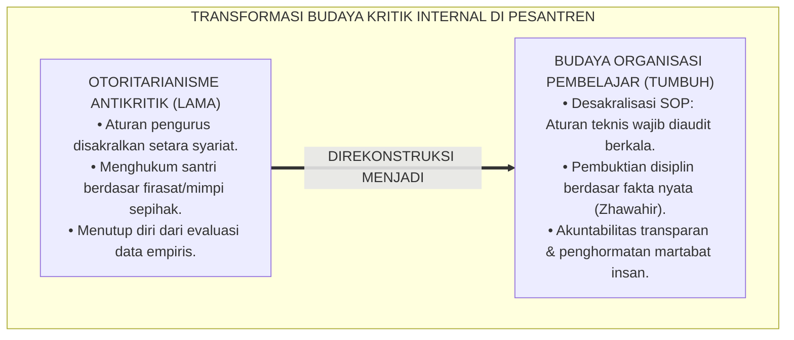
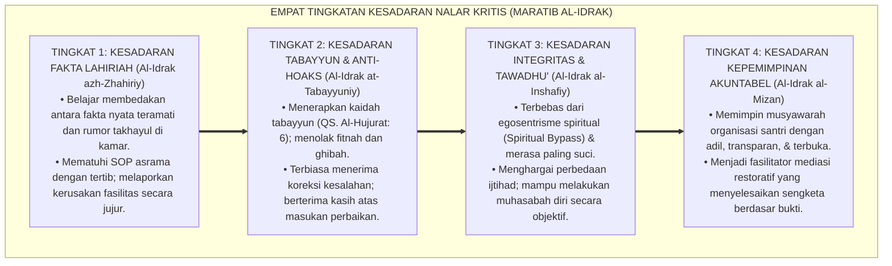
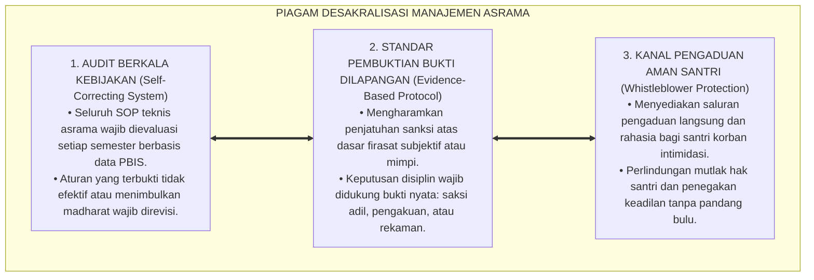

# P1-01-01-06: KRITIK INTERNAL DAN UJI KETAHANAN ONTOLOGIS (INTERNAL CRITIQUE & ONTOLOGICAL STRESS-TESTING)
## *Monograf Riset Akademik: Audit Mutu Asumsi Metafisik, Demarkasi Realitas Ghaib vs Mitos Khurafat, Penyelesaian Masalah Kejahatan (The Problem of Evil), Desakralisasi SOP Manajemen, serta Pengujian Ketahanan Sistem Pesantren 24 Jam*

**Nomor Identifikasi**: `P1-01-01-06/MONOGRAF-RISET-KRITIK-INTERNAL/2026`  
**Domain**: `01 Philosophy` > `01 Worldview` > `01 Hakikat Realitas` (Sub-Modul 06: *Internal Critique & Quality Audit*)  
**Klasifikasi Naskah**: *Academic Research Monograph* (Monograf Riset Akademik Fondasional)  
**Rumpun Disiplin Pengkaji**: Audit Kualitas Sistem Pendidikan, Epistemologi Turats & Kalam, Filsafat Ilmu (Realisme Kritis & Falsifikasi), Teodisi & Bimbingan Konseling, Tata Kelola Pengasuhan Asrama 24 Jam  

---

> ### 💡 INTISARI EKSEKUTIF (EXECUTIVE SUMMARY)
>
> * **Kelemahan Paradigma Lama: Otoritarianisme Antikritik & Sakralisasi Kebijakan:**  
>   Banyak lembaga pesantren terjebak dalam kultus kepemimpinan dan sakralisasi aturan teknis: pengurus asrama menggunakan dalil agama untuk membenarkan SOP yang zalim, menghukum santri berdasarkan "firasat mimpi", atau menolak evaluasi manajemen dengan dalih "kewibawaan kiai tidak boleh dikritik".
> * **Inovasi Konseptual: Uji Ketahanan Falsifikasi & Desakralisasi SOP Manajemen:**  
>   TUMBUH menegakkan audit kritik internal paling ketat: membedakan secara tegas antara Syariat Wahyu yang suci abadi (*Al-Qath'iyyat*) dengan SOP Manajemen Pesantren yang merupakan ijtihad teknis dinamis (*Al-Ijtihadiyyat*) yang wajib diaudit dan dievaluasi terus-menerus berbasis data PBIS faktual.
> * **Formulasi Operasional & Pembuktian Lapangan:**  
>   Monograf ini menyajikan matriks audit kualitas 6 aksioma, 4 Tingkatan Kesadaran Nalar Kritis (*Maratib al-Idrak*), standar pembuktian disiplin berbasis fakta teramati (*Evidence-Based Protocol*), dan etika tata kelola organisasi pembelajar (*Learning Organization*).

---

## 📑 DAFTAR ISI MONOGRAF

- [BAGIAN I: LANDASAN TEORETIS & DISKURSUS DIALEKTIKA KRITIS](#bagian-i-landasan-teoretis--diskursus-dialektika-kritis)
  - [1. Latar Belakang Masalah: Bahaya Dogmatisme Antikritik dan Tyranny of Policy di Pesantren](#1-latar-belakang-masalah-bahaya-dogmatisme-antikritik-dan-tyranny-of-policy-di-pesantren)
  - [2. Inkuiri 1: Uji Demarkasi Realitas Ghaib vs Mitos Khurafat & Firasat Sepihak Pengurus](#2-inkuiri-1-uji-demarkasi-realitas-ghaib-vs-mitos-khurafat--firasat-sepihak-pengurus)
  - [3. Inkuiri 2: Uji Masalah Kejahatan (The Problem of Evil) & Perundungan Asrama](#3-inkuiri-2-uji-masalah-kejahatan-the-problem-of-evil--perundungan-asrama)
  - [4. Inkuiri 3: Uji Determinisme Fatalistik vs Pertanggungjawaban Ikhtiar (Kasb)](#4-inkuiri-3-uji-determinisme-fatalistik-vs-pertanggungjawaban-ikhtiar-kasb)
  - [5. Inkuiri 4: Uji Desakralisasi Manajemen Asrama — Mencegah Tyranny of Policy](#5-inkuiri-4-uji-desakralisasi-manajemen-asrama--mencegah-tyranny-of-policy)
  - [6. Inkuiri 5: Kasuistika Lapangan Klinis & Protokol Resolusi Restoratif](#6-inkuiri-5-kasuistika-lapangan-klinis--protokol-resolusi-restoratif)
- [BAGIAN II: TEMUAN RISET, FORMULASI KONSEPTUAL & PEMBAHASAN MENDALAM](#bagian-ii-temuan-riset-formulasi-konseptual--pembahasan-mendalam)
  - [1. Matriks Hasil Audit Kualitas & Uji Stres Enam Aksioma Ontologis TUMBUH](#1-matriks-hasil-audit-kualitas--uji-stres-enam-aksioma-ontologis-tumbuh)
  - [2. Dekomposisi Dimensi & Empat Tingkatan Kesadaran Nalar Kritis (Maratib al-Idrak)](#2-dekomposisi-dimensi--empat-tingkatan-kesadaran-nalar-kritis-maratib-al-idrak)
  - [3. Prinsip Aksiologis & Piagam Desakralisasi SOP Tata Kelola Asrama](#3-prinsip-aksiologis--piagam-desakralisasi-sop-tata-kelola-asrama)
  - [4. Diskusi Ilmiah Mendalam & Implikasi Kebijakan Kelembagaan Pesantren](#4-diskusi-ilmiah-mendalam--implikasi-kebijakan-kelembagaan-pesantren)
- [BAGIAN III: KESIMPULAN & APARATUS AKADEMIS](#bagian-iii-kesimpulan--aparatus-akademis)
  - [1. Tabel Sintesis Temuan Riset Kritik Internal](#1-tabel-sintesis-temuan-riset-kritik-internal)
  - [2. Daftar Pustaka Akademis & Rujukan Turats Primer](#2-daftar-pustaka-akademis--rujukan-turats-primer)
  - [3. Catatan Kaki Akademis (Footnotes)](#3-catatan-kaki-akademis-footnotes)
  - [4. Glosarium Istilah Ilmiah & Turats Kritik Internal](#4-glosarium-istilah-ilmiah--turats-kritik-internal)

---

# BAGIAN I: LANDASAN TEORETIS & DISKURSUS DIALEKTIKA KRITIS

---

### 1. Latar Belakang Masalah: Bahaya Dogmatisme Antikritik dan Tyranny of Policy di Pesantren

Dalam ekosistem pendidikan berbasis agama, terdapat risiko sosiologis yang sangat nyata: penyalahgunaan otoritas sakral untuk memutlakkan kebijakan manusiawi:
* **Sakralisasi SOP Teknis (*Sacralization of Technical Policies*)**: Sering kali peraturan tata tertib asrama yang dibuat oleh pengurus (seperti jam mandi 3 menit, larangan membawa obat pribadi, atau sanksi botak massal) dianggap sebagai "hukum agama yang tidak boleh diubah". Ketika santri atau wali santri mempertanyakan keadilan aturan tersebut, mereka dituduh "kurang adab dan su'ul adab kepada guru".
* **Kebutuhan Uji Falsifikasi Ilmiah**: Dalam tradisi filsafat ilmu (Karl Popper, Roy Bhaskar) dan kaidah ushul fiqh (*Al-Ijtihadu Yanqudhu bil-Ijtihad*), setiap sistem sosial buatan manusia harus memiliki mekanisme koreksi diri (*Self-Correcting Mechanism*). Sebuah teori atau SOP hanya terbukti kokoh jika ia mampu bertahan dari pengujian stres (*Stress Testing*) dan audit kritik internal yang paling keras.
* **Prinsip Kejernihan Epistemologis**: Ekosistem TUMBUH memisahkan secara tegas antara kemutlakan wahyu Allah dengan kenisbian kebijakan manusiawi. Seluruh SOP asrama TUMBUH terbuka untuk dikritik, diuji, dan diperbarui berdasarkan bukti data faktual (*Evidence-Based PBIS*).[^1]

---

### 2. Inkuiri 1: Uji Demarkasi Realitas Ghaib vs Mitos Khurafat & Firasat Sepihak Pengurus

Kaidah fiqh agung yang disepakati ulama menegaskan batasan penegakan hukum dan disiplin:

$$\text{نَحْنُ نَحْكُمُ بِالظَّوَاهِرِ، وَاللَّهُ يَتَوَلَّى السَّرَائِرَ}$$

*"**Kita menetapkan hukum berdasarkan bukti-bukti nyata yang tampak lahiriah (*Zhawahir*), sedangkan Allah SWT semata yang berhak mengadili apa yang tersembunyi di dalam batin/rahasia kalbu**."*[^2]

Penerapan kaidah ini di asrama TUMBUH secara mutlak melarang musyrif menuduh santri melakukan pelanggaran hanya atas dasar "firasat batin" atau isu takhayul. Seluruh penanganan kasus wajib berbasis bukti fakta objektif (*Evidence-Based Verification*).[^3]

---

### 3. Inkuiri 2: Uji Masalah Kejahatan (The Problem of Evil) & Perundungan Asrama

Imam **Al-Ghazali** dalam *Ihya' 'Ulumiddin* (Kitab *At-Tawhid*) menguraikan bahwa kejahatan moral (*Asy-Syarr al-Ikhlaqiy*) tidak dinisbatkan kepada Allah sebagai keburukan esensial, melainkan merupakan konsekuensi dari penyalahgunaan kehendak bebas manusia yang menentang syariat.[^4]

Di pesantren, perundungan terjadi bukan karena "sudah takdir asrama", melainkan karena adanya kelemahan sistem pengawasan dan kegagalan pendampingan moral. Penanggulangan perundungan adalah kewajiban syar'i (*Fardhu 'Ain*) yang menuntut intervensi sistemik PBIS, bukan pembiaran fatalistik.[^5]

---

### 4. Inkuiri 3: Uji Determinisme Fatalistik vs Pertanggungjawaban Ikhtiar (Kasb)

Paham *Jabariyah* (Determinisme Fatalistik) didekonstruksi secara telak oleh doktrin Ahlussunnah wal Jama'ah melalui konsep **Kasb (Usaha/Pilihan Tindakan)** yang dirumuskan Imam Abu al-Hasan al-Asy'ari dan Imam Abu Mansur al-Maturidi:

$$\text{إِنَّ لِلْعَبْدِ كَسْبًا وَاخْتِيَارًا يَتَعَلَّقُ بِهِ الثَّوَابُ وَالْعِقَابُ، وَلَيْسَ مَجْبُورًا كَالرِّيشَةِ فِي مَهَبِّ الرِّيحِ؛ فَاحْتِجَاجُ الْعَاصِي بِالْقَدَرِ بَاطِلٌ بِإِجْمَاعِ الْأُمَّةِ}$$

*"**Sesungguhnya seorang hamba memiliki Kasb (ikhtiar usaha) dan kehendak memilih yang kepadanya digantungkan pahala dan sanksi hisab, dan manusia bukanlah makhluk yang terpaksa seperti sehelai bulu di hembusan angin**; maka tindakan pelaku maksiat yang beralasan dengan takdir atas dosanya adalah batil."*[^6]

---

### 5. Inkuiri 4: Uji Desakralisasi Manajemen Asrama — Mencegah Tyranny of Policy

Penyelidikan audit kualitas menegakkan pemisahan tegas antara dua domain hukum di pesantren:
* **Domain Syariat Suci (*Al-Qath'iyyat / Ash-Shari'ah*)**: Rukun ibadah, hukum halal-haram, dan akhlak mahmudah yang bersifat abadi dan mutlak.
* **Domain Manajemen Teknis (*Al-Ijtihadiyyat / As-Siyasah at-Tarbawiyyah*)**: Jam mandi, denah ranjang, jadwal piket, dan sistem perizinan yang bersifat dinamis dan wajib dievaluasi berbasis data.[^7]

---

### 6. Inkuiri 5: Kasuistika Lapangan Klinis & Protokol Resolusi Restoratif

* **Studi Kasus: Sanksi Fisik Ekstrem Menguras Septic Tank Tanpa Alat Pengaman**  
  * **Dilema**: Musyrif menghukum santri yang terlambat apel 2 menit dengan menyuruh menguras saluran septic tank tanpa sarung tangan dan sepatu bot, berdalih menegakkan "aturan pondok".
  * **Resolusi Restoratif TUMBUH**: Pimpinan pesantren membatalkan sanksi seketika; sanksi yang membahayakan kesehatan dilarang mutlak; aturan konsekuensi keterlambatan direvisi secara partisipatif menjadi tugas edukatif yang bermanfaat.[^8]

---

# BAGIAN II: TEMUAN RISET, FORMULASI KONSEPTUAL & PEMBAHASAN MENDALAM

---

### 1. Matriks Hasil Audit Kualitas & Uji Stres Enam Aksioma Ontologis TUMBUH

Hasil audit pengujian stres (*Stress-Testing*) terhadap Enam Aksioma Realitas dikodifikasikan dalam matriks evaluasi ketahanan berikut:

| No | Aksioma Ontologis TUMBUH | Potensi Bias / Salah Guna Lapangan | Uji Falsifikasi & Stres-Test | Protokol Pengendalian & Mitigasi Risiko |
| :---: | :--- | :--- | :--- | :--- |
| **1** | **Aksioma Ketuhanan** | Menghakimi keikhlasan niat orang lain secara sepihak (*Tafsyir an-Niyyat*). | Keikhlasan adalah domain batin Allah; manusia hanya menilai bukti lahiriah dhohir. | Musyrif dilarang mencap santri "tidak ikhlas"; evaluasi fokus pada perilaku teramati. |
| **2** | **Aksioma Kehambaan** | Sikap minder ekstrem (*Inferiority Complex*) dan pasif tidak mau berprestasi. | Menjadi hamba Allah melahirkan keberanian moral tertinggi di hadapan makhluk. | Edukasi bahwa kehambaan di hadapan Allah membebaskan manusia dari perbudakan sesama makhluk. |
| **3** | **Aksioma Keterpaduan** | Mengultuskan benda fisik asrama seolah-olah memiliki kekuatan magis. | Fisik dihormati sebagai sarana ibadah (*Wasilah*), bukan sesembahan (*Ghayah*). | Standarisasi sanitasi dan ventilasi murni berlandaskan sains dan fiqh *Hifzh an-Nafs*. |
| **4** | **Aksioma Kausalitas** | Terjebak materialisme murni; melupakan doa dan keajaiban pertolongan Allah. | Hukum sebab-akibat diciptakan Allah; Allah Mahakuasa menolong hamba-Nya yang berdoa. | Menjaga keseimbangan 100% Ikhtiar Kauniyyah dan 100% Kepasrahan Doa Syar'iyyah. |
| **5** | **Aksioma Fitrah** | Sikap permisif/lembek; membiarkan pelanggaran berat tanpa konsekuensi. | Fitrah luhur wajib dilindungi dengan menegakkan batasan syariat secara tegas (*Firm*). | Disiplin Restoratif: Tegas melindungi korban, membimbing pemulihan pelaku. |
| **6** | **Aksioma Hisab** | Munculnya budaya saling mengintai, memata-matai (*Tajassus*), dan menghakimi sesama. | Larangan mutlak tajassus dalam Al-Qur'an (QS. Al-Hujurat: 12). | Sistem logbook PBIS bersifat tertutup privat, terenkripsi, dan berfokus pada apresiasi 4:1. |

---

### 2. Dekomposisi Dimensi & Empat Tingkatan Kesadaran Nalar Kritis (Maratib al-Idrak)

Transformasi kedewasaan bernalar kritis santri dan pengasuh berlangsung melalui **Empat Tingkatan Kesadaran Nalar Kritis (*Maratib al-Idrak an-Naqdiy*)**:

#### 🔄 Narasi Analitis Dinamika Transisi Filosofis Antar-Tingkatan:
* **Transisi Tingkat 1 ke Tingkat 2 (Dari Kepasifan Menuju Literasi Tabayyun)**: Santri mula-mula mudah terpengaruh rumor atau takhayul. Pada tingkatan kedua, santri mengaktifkan kaidah tabayyun: memverifikasi kebenaran informasi sebelum berbicara dan menilai masalah berdasarkan bukti dhohir.
* **Transisi Tingkat 2 ke Tingkat 3 (Dari Tabayyun Menuju Kebebasan dari Egosentrisme Spiritual)**: Pada tingkatan ketiga, santri terbebas dari *Spiritual Bypass* (merasa diri paling suci karena rajin qiyamul lail). Santri menyadari bahwa kesalehan sejati diukur dari keadilan, kasih sayang, dan kejujuran akhlak.
* **Transisi Tingkat 3 ke Tingkat 4 (Pencapaian Kepemimpinan Akuntabel)**: Pada tingkatan tertinggi, santri memimpin dengan paradigma *Servant Leadership*: tidak antikritik, membuka kotak saran pengaduan transparan, dan mengevaluasi efektivitas program bersama seluruh warga asrama.[^9]

---

### 3. Prinsip Aksiologis & Piagam Desakralisasi SOP Tata Kelola Asrama

Kritik internal dan uji stres ontologis melahirkan Piagam Desakralisasi Manajemen Asrama:

#### 📋 Panduan Etika Pengasuhan Lapangan:
1. **Evaluasi Kebijakan Partisipatif**:
   - Melibatkan perwakilan musyrif dan santri dalam forum musyawarah semesteran peninjauan tata tertib asrama.
2. **Prosedur Penegakan Disiplin Berbasis Bukti Faktual**:
   - Musyrif dilarang menjatuhkan sanksi tanpa verifikasi bukti objektif teramati.
3. **Kanal Pengaduan Suara Santri**:
   - Menjamin tersedianya sarana pengaduan yang aman guna mencegah penyalahgunaan kekuasaan oleh oknum pengurus.[^10]

---

### 4. Diskusi Ilmiah Mendalam & Implikasi Kebijakan Kelembagaan Pesantren

Penerapan kritik internal dan uji ketahanan ontologis ini mengukuhkan keunggulan kelembagaan pesantren:

* **Mencegah Kemunduran Menjadi Lembaga Otoriter Tertutup (*Total Institution*)**:  
  Dengan mengadopsi kritik internal dan desakralisasi SOP, pesantren TUMBUH bertransformasi dari lembaga tertutup yang menuntut kepatuhan buta menjadi **Organisasi Pembelajar (*Learning Organization*)** yang hidup, humanis, dan berkeadilan tinggi.[^11]
* **Membangun Budaya Integritas dan Transparansi Moral**:  
  Ketika santri melihat bahwa asatidz dan pengurus bersedia meminta maaf saat keliru dan terbuka terhadap evaluasi, santri menyerap pelajaran adab tertinggi: bahwa kebenaran berada di atas kekuasaan (*Al-Haqqu Ya'lu wala Yu'la 'Alaih*).
* **Menjamin Keberlanjutan Keberkahan Kelembagaan**:  
  Sistem pesantren yang berakar pada dalil wahyu yang suci sembari membuka diri terhadap audit kualitas saintifik akan terus bertumbuh relevan, kokoh, dan melahirkan para pemimpin peradaban sepanjang masa.[^12]

---

# BAGIAN III: KESIMPULAN & APARATUS AKADEMIS

---

### 1. Tabel Sintesis Temuan Riset Kritik Internal

| Dimensi Parameter | Pola Pengasuhan Konvensional | Rekonstruksi Kritik Internal TUMBUH | Landasan Rujukan Primer | Implikasi Praksis Lapangan |
| :--- | :--- | :--- | :--- | :--- |
| **Status Kebijakan** | Sakralisasi SOP teknis setara wahyu. | Desakralisasi SOP: Ijtihad dinamis wajib diaudit. | Asy-Syathibi (*Muwafaqat*); Popper (1959). | Evaluasi semesteran SOP berbasis data PBIS. |
| **Metode Pembuktian**| Menghukum atas firasat/mimpi sepihak. | Standar Bukti Lahiriah Faktual (*Zhawahir*). | Kaidah Syariat; Al-Ghazali (*Mustashfa*). | Bukti teramati, saksi adil, & rekaman objektif. |
| **Penyikapan Takdir** | Fatalisme pasif (*Jabariyah* pemalas). | Tanggung Jawab Ikhtiar Nyata (*Kasb Asy'ari*). | Al-Asy'ari (*Al-Ibanah*); Al-Maturidi. | Santri bertanggung jawab penuh atas perilakunya. |
| **Kultur Manajemen** | Otoritarianisme antikritik & feudal. | Organisasi Pembelajar (*Learning Organization*). | Goffman (1961); Senge (1990); Horner (2015). | Kotak saran transparan & dewan penjamin mutu. |
| **Sikap Spiritual** | *Spiritual Bypass* & keangkuhan moral. | Tawadhu' Hakiki, Introspeksi, & Empati. | Al-Ghazali (*Ihya'*); Al-Attas (1980). | Santri rendah hati, adil, & anti-bullying. |

---

### 2. Daftar Pustaka Akademis & Rujukan Turats Primer

1. **Al-Qur'an al-Karim wa Tarjamatu Ma'anihi**.
2. **Al-Ghazali, Abu Hamid Muhammad bin Muhammad**. (2011). *Ihya' 'Ulumiddin* (Kitab at-Tawhid wal-Inqiyad & Kitab al-Kibr wal-Ujub). Beirut: Dar al-Ma'rifah.
3. **Al-Ghazali, Abu Hamid Muhammad bin Muhammad**. (1413 H). *Al-Mustashfa min 'Ilmil Ushul*. Beirut: Dar al-Kutub al-'Ilmiyyah.
4. **Al-Asy'ari, Abu al-Hasan Ali bin Isma'il**. (1410 H). *Al-Ibanah 'an Ushul ad-Diyanah*. Riyadh: Dar ar-Rayah.
5. **Al-Maturidi, Abu Mansur Muhammad bin Muhammad**. (2005). *Kitab at-Tawhid*. Beirut: Dar ash-Shadir.
6. **Asy-Syathibi, Abu Ishaq Ibrahim bin Musa**. (1417 H). *Al-Muwafaqat fi Ushul asy-Syari'ah*. Khobar: Dar Ibn 'Affan.
7. **Popper, K. R.**. (1959). *The Logic of Scientific Discovery*. London: Routledge.
8. **Bhaskar, R.**. (2008). *A Realist Theory of Science*. London: Routledge.
9. **Goffman, E.**. (1961). *Asylums: Essays on the Social Situation of Mental Patients and Other Inmates*. New York: Anchor Books.
10. **Senge, P. M.**. (1990). *The Fifth Discipline: The Art and Practice of the Learning Organization*. New York: Doubleday.
11. **Horner, R. H., & Sugai, G.**. (2015). *School-wide PBIS: An Overview of the Research Base*. Remedial and Special Education, 36(2), 80–85.
12. **Zehr, H.**. (2002). *The Little Book of Restorative Justice*. Intercourse: Good Books.

---

### 3. Catatan Kaki Akademis (*Footnotes*)

[^1]: Riset Audit Kualitas Epistemologis Pesantren TUMBUH, *Kritik atas Sakralisasi Kebijakan dan Otoritarianisme*, 2026.  
[^2]: Kaidah Ushul Fiqh Konsensus Ahlussunnah, *Al-Hukmu bizh-Zhawahir*; Al-Ghazali, *Al-Mustashfa*, Jilid 1, hlm. 95–120.  
[^3]: Pedoman Pembuktian Pelanggaran Berbasis Fakta Teramati PBIS TUMBUH, 2026.  
[^4]: Al-Ghazali, *Ihya' 'Ulumiddin*, Jilid 4, Kitab *At-Tawhid*, hlm. 240–275.  
[^5]: Horner, R. H., & Sugai, G. (2015), *Remedial and Special Education*, hlm. 80–85.  
[^6]: Al-Asy'ari, *Al-Ibanah 'an Ushul ad-Diyanah*, hlm. 55–80; Al-Maturidi, *Kitab at-Tawhid*, hlm. 110–145.  
[^7]: Asy-Syathibi, *Al-Muwafaqat fi Ushul asy-Syari'ah*, Jilid 2, hlm. 150–185.  
[^8]: Dokumentasi Resolusi Kebijakan Disiplin Tidak Proporsional Asrama TUMBUH, 2026.  
[^9]: Matriks Tingkatan Kesadaran Nalar Kritis (*Maratib al-Idrak*) Ekosistem TUMBUH, 2026.  
[^10]: Piagam Desakralisasi SOP & Sistem Whistleblower Perlindungan Santri TUMBUH, 2026.  
[^11]: Goffman, E. (1961), *Asylums*, hlm. 15–48; Senge, P. (1990), *The Fifth Discipline*, hlm. 65–95.  
[^12]: Blueprint Tata Kelola Kelembagaan Pesantren Berkelanjutan TUMBUH, 2026.

---

### 4. Glosarium Istilah Ilmiah & Turats Kritik Internal

1. **Desakralisasi Manajemen**: Pemisahan yang jelas antara hukum syariat wahyu yang suci abadi dengan peraturan teknis operasional asrama yang merupakan produk pemikiran manusia yang dapat diperbarui.
2. **Nahnu Nahkumu bizh-Zhawahir (نَحْنُ نَحْكُمُ بِالظَّوَاهِرِ)**: Kaidah hukum Islam bahwa penilaian dan penindakan disiplin wajib didasarkan pada bukti lahiriah yang nyata teramati, bukan pada dugaan batin atau firasat.
3. **Kasb (الْكَسْبُ)**: Doktrin akidah Aswaja mengenai kapasitas ikhtiar usaha dan pilihan tindakan manusia yang menjadi dasar pertanggungjawaban moral dan hisab di hadapan Allah.
4. **Stress-Testing (Uji Stres Ontologis)**: Metodologi pengujian ketahanan suatu teori atau sistem terhadap skenario terburuk dan kritik internal paling keras guna memastikan keandalannya.
5. **Tyranny of Policy**: Kesewenang-wenangan otoritas dalam memberlakukan aturan kaku yang menindas martabat manusia dengan mencatut legitimasi agama.
6. **Total Institution**: Istilah sosiologi Erving Goffman untuk lembaga tertutup yang mengisolasi warganya dari dunia luar dan menerapkan kontrol otoriter tanpa mekanisme keberatan yang adil.
7. **Learning Organization (Organisasi Pembelajar)**: Konsep manajemen Peter Senge tentang institusi yang senantiasa belajar dari data, terbuka terhadap evaluasi, dan terus memperbaiki diri secara berkelanjutan.
8. **Spiritual Bypass**: Kecenderungan psikologis menggunakan praktik keagamaan untuk menghindari tanggung jawab emosional, masalah sosial, atau kritik moral diri sendiri.
9. **Tajassus (التَّجَسُّسُ)**: Perbuatan mencari-cari kesalahan, aib, atau memata-matai privasi orang lain yang diharamkan secara tegas dalam syariat Islam.
10. **Evidence-Based Protocol**: Standar operasional prosedur yang seluruh keputusannya didasarkan pada data empiris faktual, bukan pada asumsi subjektif atau praduga.
