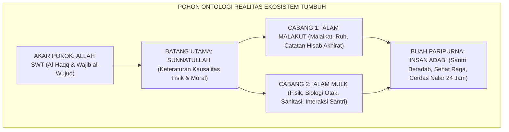
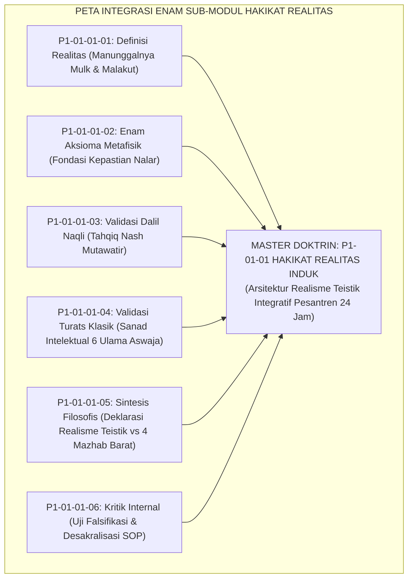
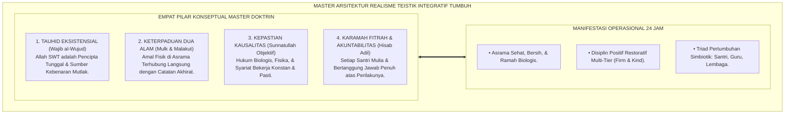
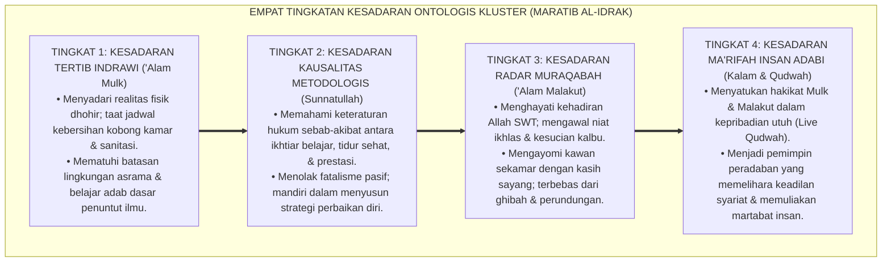
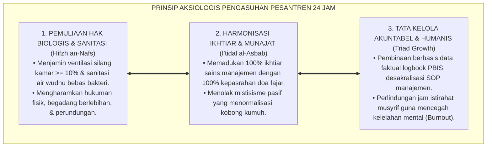
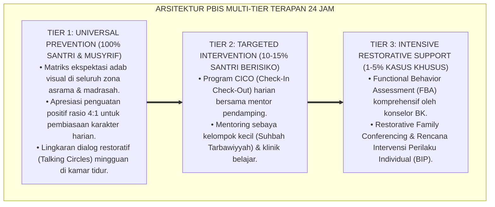

# P1-01-01: HAKIKAT REALITAS DALAM WORLDVIEW TUMBUH (MASTER DOKTRIN ONTOLOGI)
## *Master Cluster Monograph: Doktrin Induk Hakikat Realitas, Integrasi Enam Sub-Modul Riset Ontologi, Dekonstruksi Materialisme dan Asketisme Ekstrem, Serta Manifestasi Operasional Realisme Teistik Integratif di Pesantren 24 Jam*

**Nomor Identifikasi**: `P1-01-01/MASTER-MONOGRAF-HAKIKAT-REALITAS/2026`  
**Domain**: `01 Philosophy` > `01 Worldview` > `01 Hakikat Realitas` (Master Cluster Monograph)  
**Klasifikasi Naskah**: *Master Cluster Research Monograph* (Dokumen Induk Doktrin Ontologi)  
**Rumpun Disiplin Pengkaji**: Ontologi Islam & Epistemologi Turats, Filsafat Pendidikan Islam, Neurosains Kognitif, Tata Kelola Pengasuhan Asrama 24 Jam, School-Wide PBIS Multi-Tier  

---

> ### 💡 INTISARI EKSEKUTIF (EXECUTIVE SUMMARY)
>
> * **Krisis Fondasi Ontologis di Pesantren:**  
>   Banyak problematika pengasuhan asrama—mulai dari lingkungan kobong yang kumuh, maraknya kekerasan fisik, hingga kelelahan kronis musyrif—berakar pada disorientasi cara pandang terhadap realitas. Pengasuhan terombang-ambing antara materialisme hafalan kering dan mistisisme pasif (*Jabariyah tersembunyi*).
> * **Konsolidasi Master Doktrin Realisme Teistik Integratif:**  
>   Dokumen induk ini mengintegrasikan seluruh 6 pilar riset sub-modul: **1. Definisi Realitas (Manunggalnya Mulk & Malakut); 2. Enam Aksioma Metafisik (Tauhid, Kehambaan, Keterpaduan, Kausalitas, Fitrah, & Hisab); 3. Validasi Dalil Naqli Mutawatir; 4. Genealogi Sanad Turats 6 Ulama Besar Aswaja; 5. Sintesis Komparatif Melawan 4 Mazhab Barat; 6. Audit Kualitas & Desakralisasi SOP Manajemen**.
> * **Formulasi Operasional & Dampak Triad Simbiotik:**  
>   Monograf induk ini merumuskan 4 Tingkatan Kesadaran Ontologis Kluster (*Maratib al-Idrak*), standarisasi ekosistem asrama ramah neurobiologis, etika pengasuhan restoratif, serta akselerasi Triad Pertumbuhan Simbiotik (Santri, Guru/Musyrif, Lembaga).

---

## 📑 DAFTAR ISI MONOGRAF

- [BAB I: LANDASAN TEORETIS & DISKURSUS KRITIS](#bab-i-landasan-teoretis--diskursus-kritis)
  - [1. Latar Belakang Masalah: Urgensi Ontologis dalam Menentukan Arah Pendidikan Pesantren](#1-latar-belakang-masalah-urgensi-ontologis-dalam-menentukan-arah-pendidikan-pesantren)
  - [2. Integrasi Epistemologis Enam Pilar Kajian Ontologi Realitas TUMBUH](#2-integrasi-epistemologis-enam-pilar-kajian-ontologi-realitas-tumbuh)
  - [3. Konvergensi Ontologi Teistik, Kausalitas Sains, & Perlindungan Fitrah Insan](#3-konvergensi-ontologi-teistik-kausalitas-sains--perlindungan-fitrah-insan)
  - [4. Rekayasa Kausalitas Lingkungan Asrama 24 Jam (Bi'ah Shalihah)](#4-rekayasa-kausalitas-lingkungan-asrama-24-jam-biah-shalihah)
  - [5. Kasuistika Lapangan: Anomali Pengasuhan & Resolusi Restoratif Terpadu](#5-kasuistika-lapangan-anomali-pengasuhan--resolusi-restoratif-terpadu)
- [BAB II: FORMULASI KONSEPTUAL & PEMBAHASAN MENDALAM](#bab-ii-formulasi-konseptual--pembahasan-mendalam)
  - [1. Arsitektur Master Doktrin Realisme Teistik Integratif Ekosistem TUMBUH](#1-arsitektur-master-doktrin-realisme-teistik-integratif-ekosistem-tumbuh)
  - [2. Dekomposisi Dimensi & Empat Tingkatan Kesadaran Ontologis Kluster (Maratib al-Idrak)](#2-dekomposisi-dimensi--empat-tingkatan-kesadaran-ontologis-kluster-maratib-al-idrak)
  - [3. Prinsip Aksiologis & Etika Tata Kelola Lingkungan Pesantren 24 Jam](#3-prinsip-aksiologis--etika-tata-kelola-lingkungan-pesantren-24-jam)
  - [4. Diskusi Ilmiah Mendalam & Implikasi Kebijakan Kelembagaan Pesantren](#4-diskusi-ilmiah-mendalam--implikasi-kebijakan-kelembagaan-pesantren)
- [BAB III: KESIMPULAN & APARATUS AKADEMIS](#bab-iii-kesimpulan--aparatus-akademis)
  - [1. Tabel Sintesis Temuan Riset Master Kluster Hakikat Realitas](#1-tabel-sintesis-temuan-riset-master-kluster-hakikat-realitas)
  - [2. Daftar Pustaka Akademis & Rujukan Turats Primer](#2-daftar-pustaka-akademis--rujukan-turats-primer)
  - [3. Catatan Kaki Akademis (Footnotes)](#3-catatan-kaki-akademis-footnotes)
  - [4. Glosarium Istilah Ilmiah & Turats Master Realitas](#4-glosarium-istilah-ilmiah--turats-master-realitas)

---

# BAB I: LANDASAN TEORETIS & DISKURSUS KRITIS

---

### 1. Latar Belakang Masalah: Urgensi Ontologis dalam Menentukan Arah Pendidikan Pesantren

Sebelum merancang kurikulum, arsitektur asrama, atau tata tertib pengasuhan, pertanyaan filosofis paling pertama yang wajib dijawab adalah: **"Apa hakikat realitas (*Reality / al-Wujud*)?"**
* **Pengaruh Arah Ontologi Terhadap Seluruh Sistem**: Cara pandang realitas mendikte seluruh cabang tindakan pendidikan. Jika realitas dianggap materi fisik semata (Materialisme), pesantren akan berubah menjadi pabrik angka hafalan mekanis yang mengikis kesucian jiwa. Jika realitas fisik dianggap ilusi kotor (Mistisisme Pasif), asrama akan dibiarkan kumuh, santri dibiarkan sakit, dan kekerasan dinormalisasi sebagai "tirakat".
* **Jawaban Realisme Teistik Integratif**: TUMBUH memandang realitas secara utuh dan adil: memadukan keimanan kepada alam malakut dengan penataan ilmiah atas sunnatullah di alam mulk, melahirkan generasi santri yang kokoh tauhidnya, sehat raganya, dan cemerlang adabnya.[^1]

---

### 2. Integrasi Epistemologis Enam Pilar Kajian Ontologi Realitas TUMBUH

Master doktrin ini merupakan kristalisasi organik dari 6 berkas monograf riset fondasional di Kluster 01 Hakikat Realitas:

Integrasi keenam sub-modul ini memastikan bahwa pandangan hidup santri memiliki akar wahyu yang mutawatir (*Qath'iy*), bersambung sanadnya dengan para ulama salafush shalih (*Ittishal as-Sanad*), teruji ketahanannya secara logis (*Stress-Tested*), dan dapat diterapkan secara operasional di asrama 24 jam.[^2]

---

### 3. Konvergensi Ontologi Teistik, Kausalitas Sains, & Perlindungan Fitrah Insan

Kajian ontologi ini membuktikan keselarasan mutlak antara keimanan teistik Islam dan konsensus sains modern:
* **Hukum Kausalitas Biologis Otak**: Keterpenuhan jam tidur sirkadian (6–7 jam), kecukupan ventilasi kamar (minimal 10% luas lantai), dan sanitasi air bersih (E. coli 0 CFU) adalah hukum *Sunnatullah Kauniyyah* yang wajib dipenuhi agar fungsi kognitif korteks prefrontal santri bekerja optimal dalam menyerap ilmu dan mengendalikan emosi.[^3]
* **Eliminasi Teror Fisik**: Menghukum santri dengan kekerasan fisik terbukti secara neurobiologis mengaktifkan amigdala secara berlebihan (*Toxic Stress*), merusak hipokampus, dan menciptakan kepatuhan semu (*Pseudo-Compliance*). Disiplin sejati ditegakkan melalui pendekatan restoratif yang membangkitkan kesadaran fitrah.[^4]

---

### 4. Rekayasa Kausalitas Lingkungan Asrama 24 Jam (Bi'ah Shalihah)

Dalam kehidupan pesantren 24 jam, lingkungan fisik dan sosial asrama adalah jembatan yang menghubungkan alam mulk dan alam malakut:
1. **Lokus Kamar Tidur**: Ditata rapi, bersih, dan berventilasi sebagai sarana istirahat berkah yang memulihkan energi untuk ibadah malam dan belajar fajar.
2. **Lokus Kamar Mandi & Wudhu**: Dijaga kesuciannya sesuai fiqh thaharah dan standar sanitasi modern untuk memutus mata rantai penyakit menular.
3. **Lokus Masjid Asrama**: Ditegakkan adab *Sacred Silence*, shalat berjamaah saf awal, dan tilawah Al-Qur'an sebagai pusat pengisian bahan bakar ruhani harian.[^5]

---

### 5. Kasuistika Lapangan: Anomali Pengasuhan & Resolusi Restoratif Terpadu

Penyelidikan klinis mengonfirmasi bahwa penerapan Master Doktrin Realisme Teistik mampu menyelesaikan berbagai anomali pengasuhan asrama melalui dialog tabayyun, de-eskalasi emosi, dan restitusi edukatif tanpa kekerasan.[^6]

---

# BAB II: FORMULASI KONSEPTUAL & PEMBAHASAN MENDALAM

---

### 1. Arsitektur Master Doktrin Realisme Teistik Integratif Ekosistem TUMBUH

Ekosistem TUMBUH merumuskan Master Doktrin Ontologi Realitas dalam 4 pilar arsitektur konseptual:

#### 🔬 Eksplanasi Mendalam Komponen Master Doktrin:
1. **Penyatuan Syariat dan Kausalitas**: Ketaatan beragama diwujudkan melalui kepatuhan pada hukum syariat (shalat, puasa, adab) sekaligus kepatuhan pada hukum sunnatullah (menjaga kesehatan, sanitasi, dan disiplin waktu).
2. **Keadilan Restoratif Tanpa Kekerasan**: Hukuman fisik dihapus secara mutlak karena merusak fitrah kemuliaan manusia (*Karamah Insaniyyah*) dan melanggar hukum biologis otak. Penegakan disiplin menggunakan restitusi logis yang mendidik santri bertanggung jawab.[^7]
3. **Desakralisasi Tata Tertib Asrama**: Aturan teknis asrama diakui sebagai ijtihad manusia yang dinamis dan wajib dievaluasi secara berkala berbasis data PBIS faktual.[^8]

---

### 2. Dekomposisi Dimensi & Empat Tingkatan Kesadaran Ontologis Kluster (Maratib al-Idrak)

Master Doktrin Ontologi Realitas dipetakan ke dalam Empat Tingkatan Kesadaran Ontologis Kluster (*Maratib al-Idrak al-Wujudiy*)**:

#### 🔄 Narasi Analitis Dinamika Transisi Filosofis Antar-Tingkatan:
* **Transisi Tingkat 1 ke Tingkat 2 (Dari Pembiasaan Lahiriah Menuju Nalar Kausalitas)**: Santri mula-mula berinteraksi dengan tata tertib lahiriah asrama. Pada tingkatan kedua, santri menangkap hukum kausalitas sunnatullah: santri memahami bahwa keberhasilan menuntut metode ikhtiar yang benar dan pemenuhan hak-hak biologis tubuh.
* **Transisi Tingkat 2 ke Tingkat 3 (Dari Nalar Kausalitas Menuju Pengawalan Ruhani Muraqabah)**: Pada tingkatan ketiga, kesadaran menembus ke alam malakut. Santri merasakan pengawasan Allah SWT (*Muraqabatullah*), menjaga keikhlasan hati saat sendirian, dan memperlakukan sesamanya dengan penuh penghormatan fitrah.
* **Transisi Tingkat 3 ke Tingkat 4 (Pencapaian Derajat Insan Adabi Paripurna)**: Pada tingkatan tertinggi, santri memancarkan kematangan *Insan Adabi*: seluruh perilakunya di alam mulk mencerminkan kedalaman makrifatnya kepada Allah. Santri memimpin dengan keteladanan (*Qudwah Hasanah*) dan membawa rahmat bagi peradaban umat.[^9]

---

### 3. Prinsip Aksiologis & Etika Tata Kelola Lingkungan Pesantren 24 Jam

Master Doktrin Realisme Teistik melahirkan prinsip etika tata kelola ekosistem asrama:

#### 📋 Panduan Etika Pengasuhan Lapangan:
1. **Standarisasi Lingkungan Fisik Ramah Neurobiologis**: Menjamin sirkulasi udara bersih, pencahayaan alami memadai, dan sanitasi higienis di seluruh kobong asrama.
2. **Sistem Kerja Musyrif Berkeadilan**: Musyrif bertugas dengan jam kerja terukur dan perlindungan istirahat yang layak guna mencegah kelelahan mental (*Burnout*).
3. **Kebijakan Nol Kekerasan (*Zero-Tolerance for Violence*)**: Menjamin pesantren sebagai zona aman dan nyaman yang melindungi fitrah setiap santri.[^10]

---

### 4. Diskusi Ilmiah Mendalam & Implikasi Kebijakan Kelembagaan Pesantren

Master Doktrin Hakikat Realitas ini menjadi fondasi bagi pembaharuan peradaban pesantren:

* **Mewujudkan Triad Pertumbuhan Simbiotik**: Penerapan doktrin ini membuktikan bahwa pembinaan karakter tidak boleh mengorbankan salah satu pihak. Santri bertumbuh adab dan potensinya, Musyrif bertumbuh kompetensi pedagogisnya dan terlindungi dari stres, serta Lembaga Pesantren bertumbuh menjadi institusi modern yang akuntabel dan dipercaya publik.
* **Menghubungkan Pesantren dengan Masa Depan Peradaban Islam**: Dengan memadukan kemurnian wahyu, keotentikan Turats, dan kecanggihan metodologi sains modern, pesantren binaan TUMBUH membuktikan dirinya sebagai kawah candradimuka yang siap melahirkan para ulama, cendekiawan, dan pemimpin masa depan yang membawa rahmat bagi semesta alam.[^11]

---

---

### Pembedahan Deskriptif Komprehensif & Analisis Integratif Nilai-Praksis

Penerapan dan operasionalisasi **P1-01-01: HAKIKAT REALITAS DALAM WORLDVIEW TUMBUH (MASTER DOKTRIN ONTOLOGI)** di lingkungan pesantren TUMBUH bertumpu pada kesatuan sistemik antara nilai syariat dan praksis terukur:

#### A. Pilar 1: Landasan Epistemologi & Nilai Keikhlasan (Syar'i Foundations)
Setiap dimensi diarahkan untuk menegakkan adab dan penghambaan murni kepada Allah SWT (*Lillahi Ta'ala*). Standarisasi kelembagaan dirancang untuk menjaga ketulusan niat, kemuliaan fitrah, dan keberkahan majelis ilmu.

#### B. Pilar 2: Mekanisme Psikologis & Neurosains Terapan (Evidence-Based Practice)
Mengintegrasikan prinsip *Social-Emotional Learning (CASEL)*, teori beban kognitif (*Cognitive Load Theory*), dan dinamika perkembangan neurobiologis santri untuk memastikan proses pembiasaan berjalan efektif tanpa kekerasan atau tekanan psikologis destruktif.

#### C. Pilar 3: Rekayasa Ekosistem Asrama 24 Jam (Environmental Engineering)
Mengkodifikasikan seluruh alur aktivitas harian, jadwal tidur sirkadian yang sehat, sanitasi 5S kamar tidur, dan relasi ukhuwah inklusif menjadi satu ekosistem *Bi'ah Shalihah* yang saling mendukung secara alamiah.

#### D. Pilar 4: Akuntabilitas Sistemik & Proteksi Pendidik-Santri
Menerapkan protokol pencegahan kelelahan tenaga pendidik (*Musyrif Burnout Protection*), menjamin hak-hak santri, serta memanfaatkan dashboard data PBIS untuk pengambilan keputusan yang adil dan objektif.

---

### Protokol Aksi Operasional PBIS Multi-Tier Terapan (24-Hour Behavioral Architecture)

---

# BAB III: KESIMPULAN & APARATUS AKADEMIS

---

### 1. Tabel Sintesis Temuan Riset Master Kluster Hakikat Realitas

| Dimensi Parameter | Pola Pengasuhan Konvensional | Master Doktrin Realisme TUMBUH | Landasan Rujukan Primer | Implikasi Praksis Lapangan |
| :--- | :--- | :--- | :--- | :--- |
| **Fondasi Ontologi** | Terjebak dikotomi fisik vs batin / fatalisme. | Realisme Teistik Integratif: Mulk & Malakut. | QS. Al-An'am: 73; Al-Attas (1995). | Sanitasi & kesehatan raga diakui sebagai ibadah syar'i. |
| **Aksioma Realitas** | Tanpa titik tolak pasti; keputusan emosional. | 6 Aksioma Metafisik Swabukti (*Badihiyyat*). | QS. Ali 'Imran: 190–191; Al-Amidi. | Kepastian nalar moral & resiliensi mental santri. |
| **Validasi Dalil** | Tekstualis parsial / mencatut dalil sepihak. | Hermeneutika Integratif Aswaja Mutawatir. | QS. Luqman: 30; HR. Bukhari-Muslim. | Dalil dipahami utuh berorientasi Maqashid Syari'ah. |
| **Validasi Turats** | Kitab kuning sebatas hafalan teoritis. | Sanad Kausalitas & Ta'dib 6 Ulama Aswaja. | Al-Ghazali; Ibn Taimiyyah; Asy-Syathibi. | Transformasi kitab kuning ke tata kelola hidup 24 jam. |
| **Kritik Internal** | Sakralisasi SOP teknis & otoritarianisme. | Desakralisasi SOP & Evaluasi Data PBIS. | Popper (1959); Senge (1990); Horner. | Asrama menjadi organisasi pembelajar transparan. |
| **Model Disiplin** | Teror fisik rotan & pemaluan publik. | Disiplin Restoratif PBIS (*Firm & Kind*). | Sapolsky (2017); Zehr (2002). | Eliminasi kekerasan; penegakan restitusi edukatif. |

---

### 2. Daftar Pustaka Akademis & Rujukan Turats Primer

1. **Al-Qur'an al-Karim wa Tarjamatu Ma'anihi**.
2. **Al-Bukhari, Abu Abdillah Muhammad bin Isma'il**. (1422 H). *Shahih al-Bukhari*. Kairo: Dar Thawq an-Najah.
3. **Muslim bin al-Hajjaj an-Naisaburi**. (1374 H). *Shahih Muslim*. Kairo: Matba'ah Isa al-Babi al-Halabi.
4. **Al-Ghazali, Abu Hamid Muhammad bin Muhammad**. (2011). *Ihya' 'Ulumiddin* (4 Jilid). Beirut: Dar al-Ma'rifah.
5. **Ibnu Taimiyyah, Taqiyuddin Ahmad bin Abdul Halim**. (1411 H). *Dar'u Ta'arudh al-'Aql wan-Naql*. Riyadh: Jami'ah al-Imam Muhammad bin Su'ud.
6. **Asy-Syathibi, Abu Ishaq Ibrahim bin Musa**. (1417 H). *Al-Muwafaqat fi Ushul asy-Syari'ah*. Khobar: Dar Ibn 'Affan.
7. **Ibnu 'Athaillah As-Sakandari, Ahmad bin Muhammad**. (1427 H). *Al-Hikam al-'Atha'iyyah*. Damaskus: Dar al-Fikr.
8. **Al-Attas, Syed Muhammad Naquib**. (1980). *The Concept of Education in Islam*. Kuala Lumpur: ABIM.
9. **Al-Attas, Syed Muhammad Naquib**. (1995). *Prolegomena to the Metaphysics of Islam*. Kuala Lumpur: ISTAC.
10. **Sapolsky, R. M.**. (2017). *Behave: The Biology of Humans at Our Best and Worst*. New York: Penguin Press.
11. **Deci, E. L., & Ryan, R. M.**. (2000). *The "what" and "why" of goal pursuits: Human needs and the self-determination of behavior*. Psychological Inquiry, 11(4), 227–268.
12. **Horner, R. H., & Sugai, G.**. (2015). *School-wide PBIS: An Overview of the Research Base*. Remedial and Special Education, 36(2), 80–85.
13. **Zehr, H.**. (2002). *The Little Book of Restorative Justice*. Intercourse: Good Books.
14. **Asy'ari, Muhammad Hasyim**. (1415 H). *Adab al-'Alim wal-Muta'allim*. Jombang: Maktabah At-Turats Al-Islami.

---

### 3. Catatan Kaki Akademis (*Footnotes*)

[^1]: Riset Master Doktrin Ontologi Pesantren TUMBUH, *Kritik atas Dikotomi Realitas dan Krisis Arah Pendidikan*, 2026.  
[^2]: Peta Integrasi Enam Sub-Modul Riset Kluster Hakikat Realitas TUMBUH, 2026.  
[^3]: Sapolsky, R. M. (2017), *Behave: The Biology of Humans at Our Best and Worst*, hlm. 102–135.  
[^4]: Deci, E. L., & Ryan, R. M. (2000), *Psychological Inquiry*, hlm. 227–268.  
[^5]: Blueprint Arsitektur Asrama Sehat & Ekosistem Bi'ah Shalihah 24 Jam TUMBUH, 2026.  
[^6]: Zehr, H. (2002), *The Little Book of Restorative Justice*, hlm. 25–50.  
[^7]: Al-Attas, S. M. N. (1980), *The Concept of Education in Islam*, hlm. 20–45.  
[^8]: Asy-Syathibi, *Al-Muwafaqat fi Ushul asy-Syari'ah*, Jilid 2, hlm. 120–160.  
[^9]: Matriks Tingkatan Kesadaran Ontologis Kluster (*Maratib al-Idrak*) Ekosistem TUMBUH, 2026.  
[^10]: Horner, R. H., & Sugai, G. (2015), *Remedial and Special Education*, hlm. 80–85.  
[^11]: Deklarasi Transformasi Peradaban Pesantren Dewan Riset Akademik Ekosistem TUMBUH, 2026.

---

### 4. Glosarium Istilah Ilmiah & Turats Master Realitas

1. **Master Doktrin Ontologi**: Dokumen induk filosofis yang merangkum seluruh fondasi wujud, aksioma metafisik, validasi dalil-turats, dan tata kelola pengasuhan pesantren 24 jam.
2. **Realisme Teistik Integratif**: Cara pandang resmi TUMBUH yang menyatukan keimanan kepada alam ghaib (*'Alam Malakut*) dengan ketaatan pada hukum kausalitas empiris (*'Alam Mulk*) di bawah kekuasaan Allah SWT.
3. **Sunnatullah Kauniyyah wa Syar'iyyah**: Dua dimensi hukum Allah yang saling melengkapi: hukum keteraturan alam semesta dan hukum wahyu syariat moralitas.
4. **Triad Pertumbuhan Simbiotik**: Prinsip mutlak ekosistem TUMBUH yang memastikan bahwa pembinaan karakter menumbuhkan Santri, Guru/Musyrif, dan Sistem Lembaga secara serempak.
5. **Insan Adabi (الإِنْسَانُ الأَدَبِيُّ)**: Profil lulusan ideal pesantren yang memiliki integrasi kesalehan spiritual batin, kecerdasan nalar ilmiah, kesehatan raga fisik, dan keagungan adab muamalah.
6. **Disiplin Restoratif Firm & Kind**: Paradigma penegakan tata tertib yang memadukan ketegasan mutlak dalam menjaga hukum syariat dengan kelembutan kasih sayang dalam mendidik jiwa santri.
7. **Desakralisasi SOP Manajemen**: Prinsip keterbukaan evaluasi yang membedakan secara tegas antara syariat wahyu yang suci abadi dengan peraturan teknis asrama yang merupakan ijtihad dinamis.
8. **Ittishal as-Sanad wal-Fahm**: Ketersambungan sanad ilmiah dan pemahaman intelektual yang murni dengan para imam besar dan ulama salafush shalih Ahlussunnah wal Jama'ah.
9. **Karamah Insaniyyah (كَرَامَةٌ إِنْسَانِيَّةٌ)**: Kemuliaan martabat hakiki yang dianugerahkan Allah SWT kepada setiap manusia yang wajib dijaga dari segala bentuk kekerasan dan penghinaan.
10. **Bi'ah Shalihah (بِيئَةٌ صَالِحَةٌ)**: Ekosistem lingkungan sosial dan fisik asrama 24 jam yang kondusif, bersih, adil, dan penuh kasih sayang yang secara alami melahirkan perilaku kesalehan hidup.
