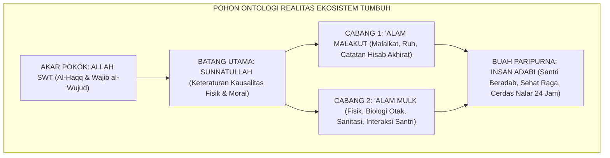

# P1-01-01: HAKIKAT REALITAS DALAM WORLDVIEW TUMBUH
## *Monograf Induk Ontologi: Definisi, Enam Aksioma Metafisik, Validasi Dalil-Turats, Sintesis Realisme Teistik, & Audit Ketahanan Sistem*

**Nomor Identifikasi**: `P1-01-01/HAKIKAT-REALITAS-INDUK/2026`  
**Domain**: `01 Philosophy` > `01 Worldview` > `01 Hakikat Realitas`  
**Klasifikasi Naskah**: *Master Cluster Monograph* (Monograf Induk Kluster Ontologi)  
**Rumpun Disiplin Pengkaji**: Epistemologi Turats & Kalam, Filsafat Pendidikan Islam, Neurosains Kognitif & Perkembangan, Tata Kelola Pengasuhan Asrama, Disiplin Positif Restoratif  

---

> ### 💡 INTISARI PRAKTIS (3 MENIT PAHAM UNTUK ASATIDZ & MUSYRIF)
>
> * **Apa Masalah Paling Mendasar di Pesantren?**  
>   Banyak pengasuhan pesantren terjebak di antara dua kutub ekstrem:  
>   1. *Kutub Sekularisme Kering*: Mengelola santri hanya seperti sekolah umum tanpa ruh ibadah dan muraqabah.  
>   2. *Kutub Mistisisme Pasif*: Menelantarkan gizi, jam tidur, dan kebersihan kamar mandi santri atas nama "kesalehan batin & tirakat".
> * **Apa Solusi Ontologi Realitas TUMBUH?**  
>   TUMBUH menegakkan mazhab **Realisme Teistik Integratif**: Menyatukan keimanan kepada *'Alam Malakut* (Malaikat, Hisab, Niat Ikhlas) dengan penataan ilmiah di *'Alam Mulk* (Gedung asrama sehat, sains nutrisi, jam tidur biologis, dan SOP disiplin restoratif tanpa kekerasan).
> * **Enam Modul Monograf Terpadu di Bawah Kluster Ini:**  
>   * [`P1-01-01-01 (Definisi Realitas)`](./P1-01-01-01-Definisi-Realitas.md): Membedah arti wujud nyata, keteraturan sunnatullah, dan manunggalnya fisik-batin.  
>   * [`P1-01-01-02 (Aksioma Realitas)`](./P1-01-01-02-Aksioma-Realitas.md): Enam prinsip baku tak terbantahkan (Khaliq Mutlak hingga Akuntabilitas Hisab).  
>   * [`P1-01-01-03 (Validasi Dalil)`](./P1-01-03-Validasi-Dalil.md): Pembuktian nash sharih Al-Qur'an dan Hadits Shahih Bukhari-Muslim.  
>   * [`P1-01-01-04 (Validasi Turats)`](./P1-01-01-04-Validasi-Turats.md): Ketersambungan sanad ilmiah dengan Al-Ghazali, Ibn Taimiyyah, Al-Maturidi, Asy-Syathibi, Ibnu 'Athaillah, dan Al-Attas.  
>   * [`P1-01-01-05 (Sintesis Filosofis)`](./P1-01-01-05-Sintesis-Filosofis.md): Deklarasi posisi resmi TUMBUH membedah 4 mazhab filsafat Barat.  
>   * [`P1-01-01-06 (Kritik Internal)`](./P1-01-01-06-Kritik-Internal.md): Uji stres teodisi (problem of evil), larangan sanksi mistis, dan desakralisasi SOP manajemen.

---

## 📑 DAFTAR ISI ANALITIS

1. [1. Urgensi Penegasan Hakikat Realitas bagi Pendidikan Pesantren](#1-urgensi-penegasan-hakikat-realitas-bagi-pendidikan-pesantren)
2. [2. Peta Modular Enam Berkas Kajian Hakikat Realitas](#2-peta-modular-enam-berkas-kajian-hakikat-realitas)
3. [3. Intisari Enam Aksioma Ontologis Ekosistem TUMBUH](#3-intisari-enam-aksioma-ontologis-ekosistem-tumbuh)
4. [4. Rangkuman Matriks Validasi Dalil, Turats, & Sains](#4-rangkuman-matriks-validasi-dalil-turats--sains)
5. [5. Implikasi Ontologis bagi Rekayasa Ekosistem Asrama 24 Jam](#5-implikasi-ontologis-bagi-rekayasa-ekosistem-asrama-24-jam)

---

### 1. Urgensi Penegasan Hakikat Realitas

Sebelum merancang kurikulum adab, rubrik asesmen perilaku, atau SOP musyrif, pertanyaan filosofis paling pertama yang wajib dijawab adalah: **"Apa hakikat realitas (*Reality / al-Wujud*)?"**

Cara kita memandang realitas akan mendikte seluruh cabang sistem pendidikan kita:
* Pandangan realitas yang **Materialistik-Sekuler** melahirkan pendidikan yang hanya mementingkan aspek keterampilan fisik mekanis dan pasar kerja, mengikis kesucian jiwa santri.
* Pandangan realitas yang **Mistik-Pasif** melahirkan pengasuhan yang menyepelekan hukum sebab-akibat, membiarkan asrama kumuh, dan menormalisasi penyakit kulit sebagai "keberkahan semu".
* **Pandangan Realisme Teistik Integratif TUMBUH** memandang realitas secara utuh: memadukan keimanan kepada alam malakut dengan penataan ilmiah atas sunnatullah di alam mulk, melahirkan generasi santri yang kokoh tauhidnya, sehat raganya, dan cemerlang adabnya.

---

### 2. Peta Modular Enam Berkas Kajian Hakikat Realitas

Kluster `01 Hakikat Realitas` dibedah secara tuntas melintasi enam berkas monograf terpadu yang saling mengunci:

| Kode Berkas | Judul Naskah Monograf | Intisari Pembahasan & Dokumen Terkait |
| :---: | :--- | :--- |
| **P1-01-01-01** | [**`Definisi Realitas`**](./P1-01-01-01-Definisi-Realitas.md) | Definisi operasional wujud objektif, 3 unsur keberadaan, dialektika 6 inkuiri, dan peta manunggalnya Mulk-Malakut. |
| **P1-01-01-02** | [**`Aksioma Realitas`**](./P1-01-01-02-Aksioma-Realitas.md) | Enam aksioma metafisik baku: Khaliq Mutlak, Makhluk Fakir, Dualitas Mulk-Malakut, Sunnatullah, Hikmah, & Hisab. |
| **P1-01-01-03** | [**`Validasi Dalil`**](./P1-01-01-03-Validasi-Dalil.md) | Uji hermeneutika nash sharih Al-Qur'an (QS. 31:30, 35:15, 33:62) dan Hadits Shahih Bukhari-Muslim. |
| **P1-01-01-04** | [**`Validasi Turats`**](./P1-01-01-04-Validasi-Turats.md) | Ketersambungan sanad ilmiah dengan Imam Al-Ghazali, Ibn Taimiyyah, Al-Maturidi, Asy-Syathibi, Ibnu 'Athaillah, & Al-Attas. |
| **P1-01-01-05** | [**`Sintesis Filosofis`**](./P1-01-01-05-Sintesis-Filosofis.md) | Deklarasi posisi resmi Realisme Teistik Integratif, 4 pilar ontologi, dan komparasi dengan 4 mazhab filsafat Barat. |
| **P1-01-01-06** | [**`Kritik Internal`**](./P1-01-01-06-Kritik-Internal.md) | Audit kualitas, demarkasi wahyu vs mitos firasat, teodisi kejahatan asrama, kebebasan ikhtiar (*Kasb*), & desakralisasi SOP. |

---

### 3. Intisari Enam Aksioma Ontologis Ekosistem TUMBUH

1. **Aksioma 1 (Keberadaan Mutlak Khaliq)**: Allah SWT adalah satu-satunya *Al-Haqq* dan *Wajib al-Wujud*, asal mula dan pemelihara mandiri seluruh alam semesta (QS. Luqman: 30).
2. **Aksioma 2 (Ketergantungan Total Makhluk)**: Seluruh alam semesta dan santri bersifat kontingen (*Mumkin al-Wujud*) dan fakir secara ontologis (*Faqr Dzatiy*) kepada rahmat Allah (QS. Fathir: 15).
3. **Aksioma 3 (Dualitas Realitas Terpadu)**: Realitas mencakup integrasi manunggal antara *'Alam al-Malakut* (batin) dan *'Alam al-Mulk* (dhohir) (QS. Al-Hasyr: 22).
4. **Aksioma 4 (Kepastian Hukum Sunnatullah)**: Allah menetapkan hukum kausalitas yang presisi dan ajek pada materi fisik, biologi otak, dan dinamika sosial-moral (QS. Al-Ahzab: 62).
5. **Aksioma 5 (Tujuan Luhur Penciptaan)**: Segala ciptaan memiliki tujuan hikmah (*Ghayah wa Hikmah*); tiada santri yang diciptakan sia-sia sebagai produk rusak (QS. Ali 'Imran: 191).
6. **Aksioma 6 (Akuntabilitas Eksistensial)**: Setiap perbuatan lahiriah memiliki konsekuensi hisab yang nyata di hadapan Mahkamah Keadilan Ilahi (QS. Az-Zalzalah: 7–8).

---

### 4. Rangkuman Matriks Validasi Dalil, Turats, & Sains

Seluruh enam aksioma ontologis di atas telah teruji secara mutawatir dan selaras 100% dengan:
* **Dalil Wahyu Sharih**: Berstatus *Qath'iyuts Tsubut wa Qath'iyud Dilalah*.
* **Khazanah Turats Induk**: Bersanad pada *Ihya' 'Ulumiddin*, *Dar' Ta'arudh*, *Kitab at-Tawhid*, *Al-Muwafaqat*, *Al-Hikam*, dan *Prolegomena*.
* **Konsensus Sains Kontemporer**: Selaras dengan neurobiologi perkembangan, psikoneuroimunologi, dan sistem School-Wide PBIS multi-tier.

---

### 5. Implikasi Ontologis bagi Rekayasa Ekosistem Asrama 24 Jam

1. **Budaya Muraqabah 24 Jam**: Santri menjaga integritas adab bukan karena takut rotan musyrif, melainkan karena kesadaran penuh akan Pengawasan Khaliq dan Kepastian Hisab.
2. **Kepatuhan pada Kausalitas Biologis**: Manajemen asrama memandang pemenuhan ventilasi kamar (10%), air bersih (0 CFU E. coli), dan jam tidur biologis santri (6–7 jam) sebagai bagian dari ketaatan syariat *Hifzh an-Nafs*.
3. **Disiplin Restoratif Tanpa Kekerasan**: Menghapus seluruh bentuk hukuman fisik dan perpeloncoan feodal, menggantikannya dengan konsekuensi logis yang mendidik fitrah santri (*Firm & Kind*).
