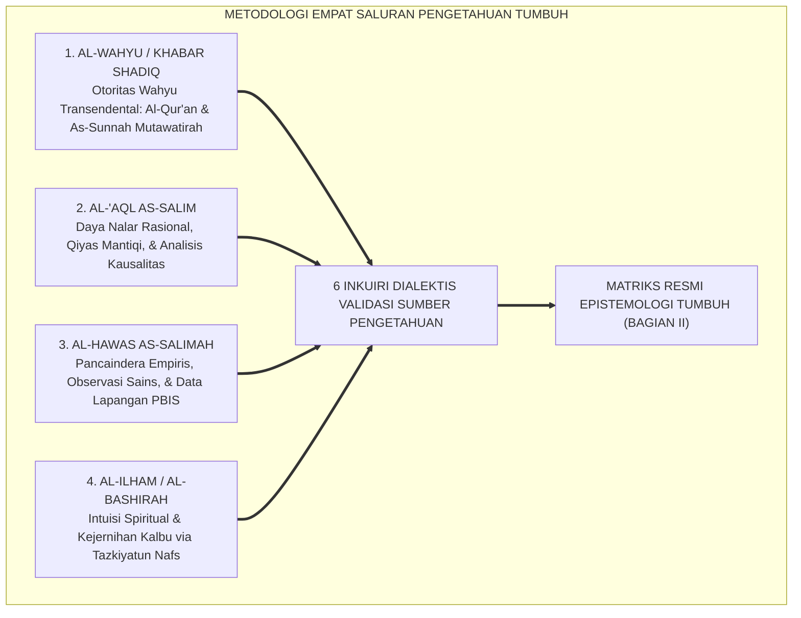
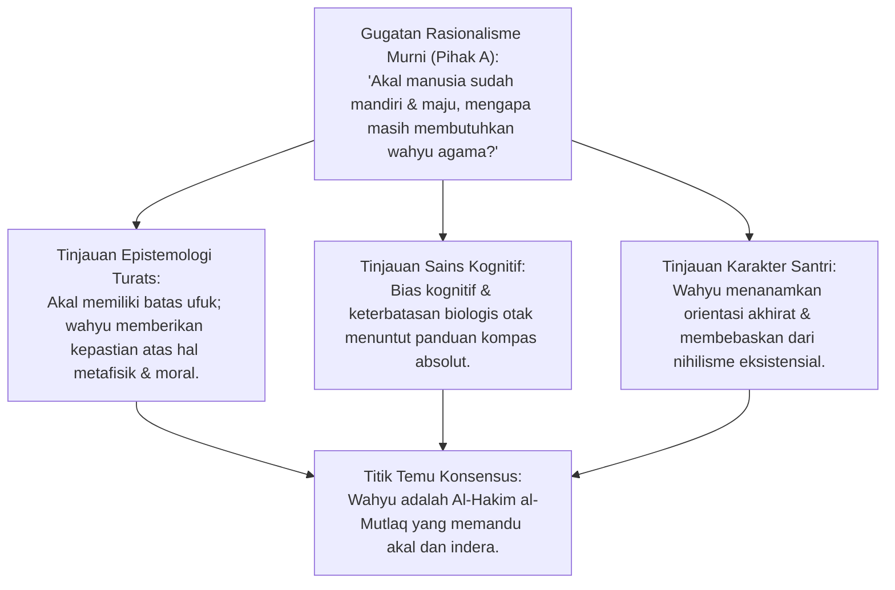
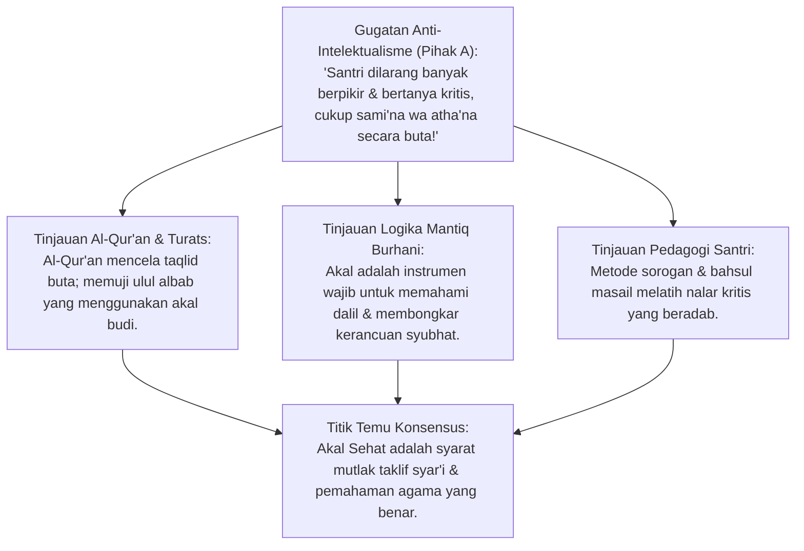
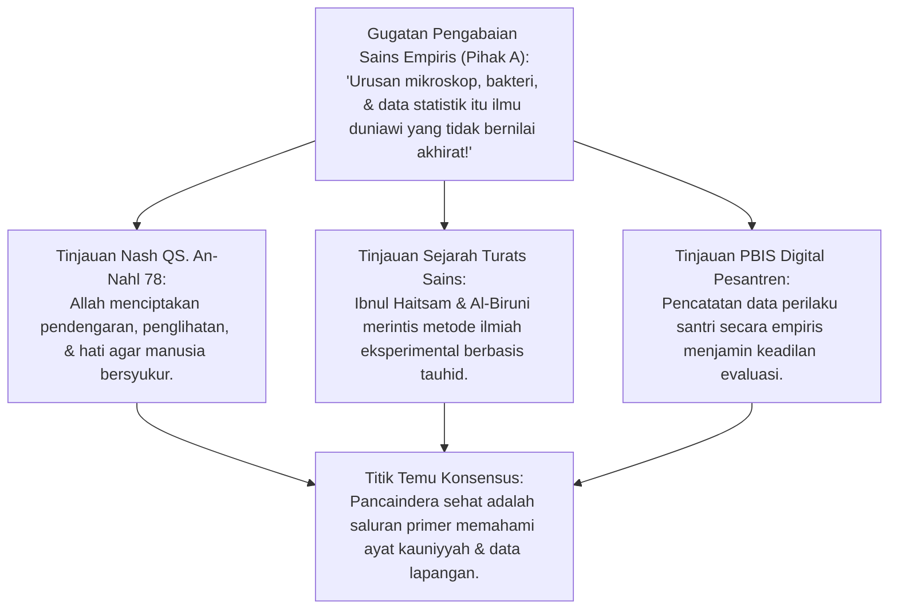
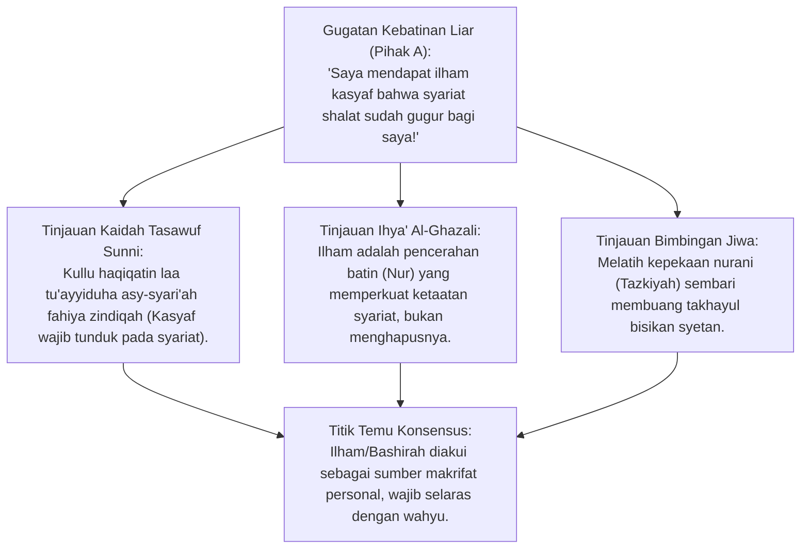
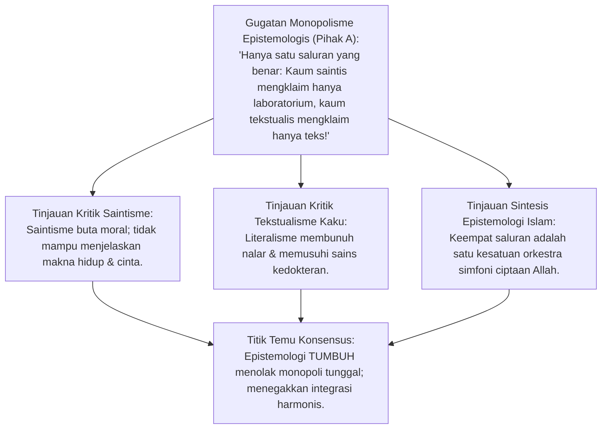
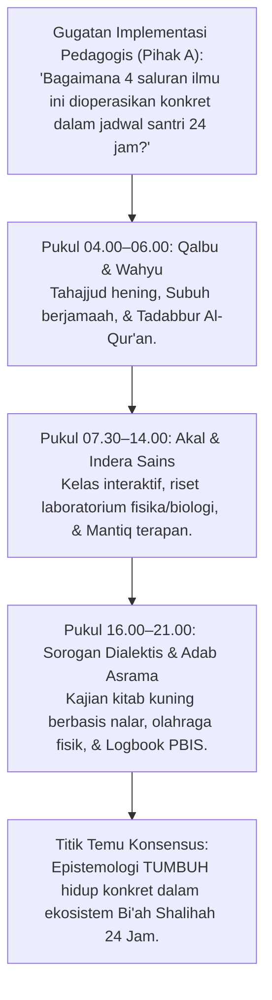
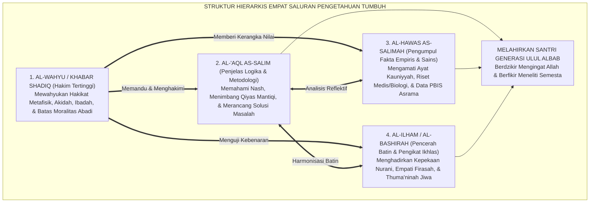

# P1-01-02-01: SUMBER-SUMBER PENGETAHUAN DALAM ISLAM
## *Monograf Terpadu: Struktur Hierarkis Empat Saluran Epistemologis (Wahyu, Akal Sehat, Indera Empiris, & Intuisi Qalbu), Dialektika Sains-Turats, & Implikasi Pedagogi Pesantren*

**Nomor Identifikasi**: `P1-01-02-01/MONOGRAF-TERPADU-SUMBER-ILMU/2026`  
**Domain**: `01 Philosophy` > `01 Worldview` > `02 Epistemologi TUMBUH`  
**Klasifikasi Naskah**: *Comprehensive Integrated Monograph* (Monograf Akademis & Rumusan Baku Terpadu)  
**Rumpun Disiplin Pengkaji**: Epistemologi Turats & Ushul Fiqh, Filsafat Ilmu & Rasionalisme Kritis, Neurosains Kognitif & Persepsi Sensorik, Tasawuf Sunni & Psikologi Ruhani, Pedagogi Master Guru  

---

> ### 💡 INTISARI PRAKTIS (3 MENIT PAHAM UNTUK ASATIDZ & MUSYRIF)
>
> * **Apa Masalah Utama dalam Cara Santri Memperoleh Ilmu?**  
>   Banyak santri dan pendidik bingung mendudukkan mana yang harus didahulukan antara: ayat Al-Qur'an, logika akal, data ilmiah laboratorium, dan firasat hati. Jika salah mendudukkan, santri bisa menjadi *tekstualis kaku yang anti-sains*, atau sebaliknya menjadi *sekuler yang meragukan agama*.
> * **Empat Saluran Ilmu yang Sah dalam Islam:**  
>   1. **Wahyu Ilahi (*Al-Khabar ash-Shadiq*)**: Sumber tertinggi dan pemandu mutlak; memberitahu kita hal-hal ghaib (surga, neraka, pahala, adab syariat) yang tidak bisa dilihat mata.
>   2. **Akal Sehat (*Al-'Aql as-Salim*)**: Alat memahami wahyu, menyusun argumen logika, menganalisis sebab-akibat, dan menolak kebohongan.
>   3. **Pancaindera yang Sehat (*Al-Hawas as-Salimah*)**: Mata, telinga, dan indera untuk meneliti alam semesta, sains biologi, dan data perilaku santri di asrama.
>   4. **Cahaya Kalbu (*Al-Ilham / Al-Bashirah*)**: Kejernihan batin yang dianugerahkan Allah kepada hamba yang rajin berdzikir dan ikhlas, melahirkan ketenangan dan kepekaan nurani (*firasat mukmin*).
> * **Aturan Emas Penerapannya di Pesantren:**  
>   Wahyu sebagai *Hakim Tertinggi*, Akal sebagai *Penjelas Logika*, Indera sebagai *Pengumpul Data Faktual*, dan Kalbu sebagai *Pengikat Keikhlasan Niat*.

---

## 📑 DAFTAR ISI MONOGRAF

- [BAGIAN I: RISET EPISTEMOLOGI TURATS, DIALEKTIKA INKUIRI, & KASUISTIKA LAPANGAN](#bagian-i-riset-epistemologi-turats-dialektika-inkuiri--kasuistika-lapangan)
  - [1. Kerangka Metodologi Epistemologi Integratif (Tawazun al-Madarik)](#1-kerangka-metodologi-epistemologi-integratif-tawazun-al-madarik)
  - [2. Inkuiri 1: Investigasi Otoritas Wahyu (Al-Khabar ash-Shadiq) — Pemandu Tertinggi Melampaui Spekulasi Rasio](#2-inkuiri-1-investigasi-otoritas-wahyu-al-khabar-ash-shadiq--pemandu-tertinggi-melampaui-spekulasi-rasio)
  - [3. Inkuiri 2: Investigasi Akal Sehat (Al-'Aql as-Salim) — Menolak Anti-Intelektualisme & Menetapkan Batas Nalar](#3-inkuiri-2-investigasi-akal-sehat-al-aql-as-salim--menolak-anti-intelektualisme--menetapkan-batas-nalar)
  - [4. Inkuiri 3: Investigasi Pancaindera Empiris (Al-Hawas as-Salimah) — Observasi Sains sebagai Ibadah Tadabbur](#4-inkuiri-3-investigasi-pancaindera-empiris-al-hawas-as-salimah--observasi-sains-sebagai-ibadah-tadabbur)
  - [5. Inkuiri 4: Investigasi Intuisi Batin & Cahaya Qalbu (Al-Ilham / Al-Bashirah) — Demarkasi Kasyaf vs Halusinasi](#5-inkuiri-4-investigasi-intuisi-batin--cahaya-qalbu-al-ilham--al-bashirah--demarkasi-kasyaf-vs-halusinasi)
  - [6. Inkuiri 5: Investigasi Bahaya Reduksionisme Sepihak — Kritik atas Saintisme, Rasionalisme, & Tekstualisme](#6-inkuiri-5-investigasi-bahaya-reduksionisme-sepihak--kritik-atas-saintisme-rasionalisme--tekstualisme)
  - [7. Inkuiri 6: Translasi Empat Saluran Epistemologi ke Desain Pembelajaran & Asrama 24 Jam](#7-inkuiri-6-translasi-empat-saluran-epistemologi-ke-desain-pembelajaran--asrama-24-jam)
- [BAGIAN II: TEMUAN RISET, FORMULASI KONSEPTUAL & PEMBAHASAN](#bagian-ii-temuan-riset-formulasi-konseptual--pembahasan)
  - [1. Struktur Hierarkis Empat Saluran Epistemologis Islam](#1-struktur-hierarkis-empat-saluran-epistemologis-islam)
  - [2. Matriks Komparasi Komprehensif: TUMBUH vs Mazhab Epistemologi Barat](#2-matriks-komparasi-komprehensif-tumbuh-vs-mazhab-epistemologi-barat)
  - [3. Kaidah Penyelarasan Antarsumber: Integrasi Wahyu, Nalar, Indera, & Qalbu](#3-kaidah-penyelarasan-antarsumber-integrasi-wahyu-nalar-indera--qalbu)
  - [4. Implikasi Pedagogis: Kurikulum Berpikir Kritis, Sorogan Dialogis, & Analitik PBIS](#4-implikasi-pedagogis-kurikulum-berpikir-kritis-sorogan-dialogis--analitik-pbis)
- [BAGIAN III: APARATUS AKADEMIS & APENDIKS](#bagian-iii-aparatus-akademis--apendiks)
  - [1. Tabel Sintesis Hasil Riset Epistemologis](#1-tabel-sintesis-hasil-riset-epistemologis)
  - [2. Daftar Pustaka Akademis & Rujukan Turats Primer](#2-daftar-pustaka-akademis--rujukan-turats-primer)
  - [3. Catatan Kaki Akademis (Footnotes)](#3-catatan-kaki-akademis-footnotes)
  - [4. Glosarium dan Penjelasan Istilah Teknis Epistemologi & Turats](#4-glosarium-dan-penjelasan-istilah-teknis-epistemologi--turats)

---

# BAGIAN I: RISET EPISTEMOLOGI TURATS, DIALEKTIKA INKUIRI, & KASUISTIKA LAPANGAN

*Bagian ini memuat proses penyelidikan saluran-saluran pengetahuan (*mashaadir al-ma'rifah*), formalisasi silogisme logika (*qiyas burhani*), pertarungan dialektika multi-perspektif tiga ronde tanpa kata "pakar", pengujian teks turats klasik dan neurosains, studi kasus pembelajaran di pesantren, dan penarikan konsensus bersama.*

---

### 1. Kerangka Metodologi Epistemologi Integratif (Tawazun al-Madarik)

Epistemologi adalah cabang filsafat yang menyelidiki: *Dari mana pengetahuan berasal? Bagaimana manusia mengetahui bahwa sesuatu itu benar? Dan apa batasan daya jangkau akal manusia?*

Ekosistem TUMBUH menolak segala bentuk reduksionisme epistemologis (seperti saintisme yang menolak wahyu atau literalisme kaku yang mematikan akal). Riset menerapkan **Metodologi Keseimbangan Saluran Persepsi (*Tawazun al-Madarik al-Ma'rifiyyah*)**:

---

### 2. Inkuiri 1: Investigasi Otoritas Wahyu (Al-Khabar ash-Shadiq) — Pemandu Tertinggi Melampaui Spekulasi Rasio

#### 📐 Formalisasi Logika Silogisme (*Qiyas Mantiqi 1*)
* **Premis Mayor (*al-Muqaddimah al-Kubra*)**: Setiap entitas yang pengetahuannya terbatas oleh ruang, waktu, dan bias biologis niscaya membutuhkan bimbingan dari Sumber Pengetahuan Yang Maha Mengetahui segalanya (*Al-'Alim al-Khabir*) agar tidak tersesat dalam menentukan hakikat kebenaran metafisik dan hukum moral universal.
* **Premis Minor (*al-Muqaddimah ash-Shughra*)**: Akal dan indera manusia memiliki keterbatasan bawaan (*Mahdudiyyah*) dan tidak mampu menembus hakikat alam malakut tanpa kabar wahyu.
* **Konklusi (*an-Natijah*)**: Maka, Wahyu Ilahi (*Al-Khabar ash-Shadiq*) adalah sumber pengetahuan tertinggi yang mutlak benar (*Ma'shum*) dan menjadi pemandu utama bagi seluruh aktivitas keilmuan di pesantren.[^1]

#### 📖 Teks Primer Turats: *Tahafut al-Falasifah* & *Matan al-'Aqa'id*
**Imam Al-Ghazali** dalam *Tahafut al-Falasifah* menguraikan keterbatasan akal murni di hadapan wahyu:

$$\text{إِنَّ الْعَقْلَ كَالْبَصَرِ، وَالشَّرْعَ كَالنُّورِ، وَلَنْ يُغْنِيَ الْبَصَرُ عَنِ النُّورِ كَمَا لَا يُغْنِي النُّورُ عَنِ الْبَصَرِ، فَالْعَقْلُ مَعَ الشَّرْعِ نُورٌ عَلَى نُورٍ}$$

*"Sesungguhnya akal itu laksana indera penglihatan mata, dan wahyu syariat itu laksana cahaya terang. Penglihatan mata tidak akan pernah cukup tanpa adanya cahaya terang, sebagaimana cahaya tidak berguna tanpa adanya mata. Maka perpaduan akal yang sehat bersama wahyu syariat adalah cahaya di atas cahaya (nurun 'ala nur)."*[^2]

Dan **Imam An-Nasafi** menegaskan bahwa kabar yang benar (*Al-Khabar ash-Shadiq*) terbagi dua:
1. *Khabar Mutawatir*: Berita generasi ke generasi yang mustahil sepakat berdusta (menghasilkan ilmu yang pasti/dharuriy).
2. *Khabar ar-Rasul al-Mu'ayyad bil-Mu'jizah*: Sabda Rasulullah SAW yang dikuatkan oleh mukjizat (menghasilkan ilmu istidlali yang yakin).[^3]

#### 🥊 Ronde 1: Membongkar Klaim Kemandirian Mutlak Rasio Manusia
* **Pihak A (Sudut Pandang Rasionalisme Sekuler)**:  
  *"Kaum rasionalis murni (seperti Spinoza dan Kant) berpendapat bahwa akal budi manusia cukup untuk merumuskan hukum moral universal tanpa perlu wahyu agama. Mengapa epistemologi Islam menempatkan wahyu di atas akal?"*
* **Tinjauan Sudut Pandang Epistemologi Turats & Filsafat Moral**:  
  Sejarah peradaban membuktikan bahwa akal manusia yang dilepaskan dari wahyu selalu terjatuh ke dalam **Relativisme dan Kepentingan Subjektif Kelompok**. Di satu zaman akal membenarkan perbudakan, di zaman lain akal membenarkan imperialisme, dan di zaman modern akal sekuler membenarkan aborsi bebas dan pergaulan sesama jenis. **Wahyu Berfungsi Sebagai Jangkar Moral Mutlak (*Absolute Moral Anchor*)** yang menjaga martabat fitrah manusia dari penyimpangan nafsu.[^4]

#### 🥊 Ronde 2: Sanggahan Balik Masalah Tafsir Teks vs Keaslian Wahyu
* **Pihak A (Sudut Pandang Hermeneutika Kritis)**:  
  *"Sanggahan! Meskipun teks Al-Qur'an itu suci, manusia yang menafsirkannya memiliki akal yang tidak suci dan berbeda-beda madzhab. Bukankah pada akhirnya yang berlaku tetaplah 'akal manusia penafsir', bukan wahyu murni?"*
* **Tinjauan Sudut Pandang Ushul Fiqh Aswaja**:  
  Terdapat pembedaan tegas antara **Teks Pokok yang Pasti (*Qath'iyuts Tsubut wa Dilalah*)** dengan **Penafsiran Rincian Ijtihadi (*Zhanniy*)**. Pada perkara-perkara fundamental (rukun iman, haramnya dusta dan kezaliman, kewajiban shalat), seluruh ulama sepakat tanpa perselisihan (*Ijma'*). Sementara dalam ranah furu'iyah ijtihadi, perbedaan penafsiran diatur oleh kaidah ushul mantiq yang ketat, bukan spekulasi liar.[^5]

#### 🥊 Ronde 3: Sanggahan Pamungkas Integrasi Wahyu dalam Pembelajaran Sains
* **Pihak A (Sudut Pandang Pemisahan Kurikulum)**:  
  *"Bagaimana wahyu diterapkan saat guru mengajarkan rumus kimia atau fisika kuantum di laboratorium pesantren?"*
* **Resolusi Sudut Pandang Pedagogi Master Guru**:  
  Wahyu tidak menggantikan eksperimen laboratorium, melainkan **Memberikan Kerangka Filosofis Makna (*Meaning Framework*)**: bahwa molekul dan gaya gravitasi yang diteliti adalah ciptaan Allah yang tunduk pada hukum-Nya (*Ayat Kauniyyah*). Belajar sains bukan sekadar mencari nilai rapor, melainkan sarana bertafakkur dan mengagungkan Dzat Sang Pencipta (*Ma'rifatullah*).[^6]

> #### 📌 Kasuistika Lapangan 1 & Titik Temu Konsensus
> * **Studi Kasus**: Santri kelas MA menganggap pelajaran tafsir Al-Qur'an "tidak berguna untuk masa depan" dibanding pelajaran coding komputer dan matematika.
> * **Titik Temu Konsensus (*Kalimatun Sawa'*)**: Disepakati bahwa coding komputer memberi santri keahlian teknis di alam mulk, sementara wahyu Al-Qur'an memberi santri kompas moral dan tujuan hidup abadi di alam malakut. Keduanya saling mengokohkan.[^7]

---

### 3. Inkuiri 2: Investigasi Akal Sehat (Al-'Aql as-Salim) — Menolak Anti-Intelektualisme & Menetapkan Batas Nalar

#### 📐 Formalisasi Logika Silogisme (*Qiyas Mantiqi 2*)
* **Premis Mayor (*al-Muqaddimah al-Kubra*)**: Setiap agama yang memposisikan akal budi sebagai syarat sah pembebanan syariat (*Manath at-Taklif*) niscaya mewajibkan pendayagunaan akal sehat dan mengharamkan taklid buta yang membodohi umat.
* **Premis Minor (*al-Muqaddimah ash-Shughra*)**: Islam menetapkan bahwa tiada taklif hukum bagi orang yang hilang akalnya (*Laa dina liman laa 'aqla lahu*).
* **Konklusi (*an-Natijah*)**: Maka, pendayagunaan nalar kritis dan logika formal (*Al-'Aql as-Salim*) adalah kewajiban epistemologis dalam pendidikan santri di pesantren.[^8]

#### 📖 Teks Primer Turats: *Dar' Ta'arudh al-'Aql wan-Naql*
**Syaikhul Islam Ibn Taimiyyah** dalam *Dar' Ta'arudh* menegaskan kedudukan akal sebagai alat pembuktian:

$$\text{إِنَّ الْعَقْلَ شَرْطٌ فِي مَعْرِفَةِ الْعُلُومِ، وَكَمَالِ صَلَاحِ الْأَعْمَالِ، وَبِهِ يَكْمُلُ الدِّينُ، وَلَكِنَّهُ لَيْسَ مُسْتَقِلًّا بِالْإِحَاطَةِ بِكُلِّ شَيْءٍ، وَالْعَقْلُ الصَّرِيحُ لَا يُعَارِضُ النَّقْلَ الصَّحِيحَ أَبَدًا}$$

*"Sesungguhnya akal budi adalah syarat mutlak dalam mengetahui ilmu-ilmu, dan syarat bagi kesempurnaan kesalehan amal perbuatan; dengannya agama menjadi sempurna. Akan tetapi akal tidak mampu berdiri sendiri meliput segala hakikat wujud; dan akal yang sehat dan murni (ash-sharih) tidak akan pernah bertentangan dengan wahyu yang sahih (an-naql ash-shahih) selama-lamanya."*[^9]

#### 🥊 Ronde 1: Menumpas Budaya Doktrinasi Pasif & Taqlid Buta
* **Pihak A (Sudut Pandang Feodalisme Kepatuhan)**:  
  *"Bukankah santri terbaik adalah santri yang diam dan tidak pernah mendebat perintah gurunya? Mengapa pesantren TUMBUH mendorong santri berpikir kritis dan bertanya analitis?"*
* **Tinjauan Sudut Pandang Epistemologi Islam & Al-Qur'an**:  
  Al-Qur'an secara keras mencela kaum musyrikin yang bertaklid buta pada tradisi nenek moyang tanpa menggunakan akalnya: *"Inna wajadna aaba'ana 'ala ummatin"* (QS. Az-Zukhruf: 22). **Kepatuhan Sejati (*Tha'ah*) Lahir dari Keyakinan Berbasis Ilmu dan Nalar (*'Ilmul Yaqin*)**, bukan dari ketakutan buta. Tradisi *Bahsul Masail* dan *Munazharah* di pesantren salaf adalah bukti bahwa akal kritis yang beradab adalah mahkota tradisi keilmuan Islam.[^10]

#### 🥊 Ronde 2: Sanggahan Balik Bahaya Rasionalisme Liar (Mu'tazilah Baru)
* **Pihak A (Sudut Pandang Kekhawatiran Ortodoksi)**:  
  *"Sanggahan! Jika akal diberi kebebasan menalar, bagaimana mencegah santri menjadi liberal yang menolak hadits-hadits sahih hanya karena 'tidak masuk akal' bagi otaknya yang terbatas?"*
* **Tinjauan Sudut Pandang Ushuluddin Aswaja**:  
  Akal yang diajarkan adalah **Al-'Aql as-Salim (Akal Sehat yang Beradab)**, bukan akal yang arogan. Santri diajarkan membedakan antara:  
  1. *Mustahil 'Aqliy (Kemustahilan Logika Hakiki)*: Seperti pernyataan "lingkaran bersegi empat" atau "makhluk menciptakan dirinya sendiri dari ketiadaan" (ini mustahil).  
  2. *Ja'iz 'Aqliy tapi Mustaghrab (Hal yang Mungkin Terjadi tapi Melampaui Pengalaman Sehari-hari)*: Seperti Isra' Mi'raj, mukjizat nabi, dan kehidupan alam kubur.  
  Akal sehat mengakui bahwa Dzat Yang Maha Kuasa menciptakan alam semesta tentu berkuasa melakukan hal-hal yang melampaui kebiasaan hukum alam (*Kharqul 'Adah*).[^11]

#### 🥊 Ronde 3: Sanggahan Pamungkas Pelatihan Logika Mantiq bagi Santri
* **Pihak A (Sudut Pandang Praktis Kurikulum)**:  
  *"Bagaimana melatih nalar akal santri secara konkret dalam pembelajaran harian?"*
* **Resolusi Sudut Pandang Pedagogi Master Guru**:  
  Santri dibekali pembelajaran **Ilmu Mantiq Terapan (*Applied Logic*)**: Santri dilatih menyusun premis mayor dan minor, mendeteksi 15 jenis sesat pikir logika (*logical fallacies*), dan membedakan fakta objektif dari opini emosional dalam membaca kitab kuning maupun menyikapi berita media sosial.[^12]

> #### 📌 Kasuistika Lapangan 2 & Titik Temu Konsensus
> * **Studi Kasus**: Santri senior mendoktrin junior: "Kalau ustadz menyuruh melompat dari lantai dua, kalian harus lompat tanpa mikir demi mendapatkan berkah".
> * **Titik Temu Konsensus (*Kalimatun Sawa'*)**: Disepakati bahwa doktrin tersebut adalah kebodohan dan kesesatan yang merusak akal. Ketaatan pada guru dibatasi oleh koridor syariat dan keselamatan jiwa (*Hifzh an-Nafs*).[^13]

---

### 4. Inkuiri 3: Investigasi Pancaindera Empiris (Al-Hawas as-Salimah) — Observasi Sains sebagai Ibadah Tadabbur

#### 📐 Formalisasi Logika Silogisme (*Qiyas Mantiqi 3*)
* **Premis Mayor (*al-Muqaddimah al-Kubra*)**: Setiap saluran persepsi yang diciptakan Allah dan diperintahkan dalam Al-Qur'an untuk mengamati keteraturan alam semesta (*Ayat Kauniyyah*) adalah sarana keilmuan yang sah dan bernilai ibadah syar'i.
* **Premis Minor (*al-Muqaddimah ash-Shughra*)**: Pancaindera yang sehat (*Al-Hawas as-Salimah*) adalah instrumen pengamatan empiris atas fenomena fisik, biologis, dan data perilaku santri di asrama.
* **Konklusi (*an-Natijah*)**: Maka, riset sains empiris dan pengelolaan pesantren berbasis data observasi faktual (*Evidence-Based Management*) adalah perwujudan ketaatan epistemologis Islam.[^14]

#### 📖 Teks Primer Al-Qur'an: Mandat Observasi Sensorik
Allah SWT berfirman mengenai tiga anugerah epistemologis manusia:

$$\text{وَاللَّهُ أَخْرَجَكُم مِّن بُطُونِ أُمَّهَاتِكُمْ لَا تَعْلَمُونَ شَيْئًا وَجَعَلَ لَكُمُ السَّمْعَ وَالْأَبْصَارَ وَالْأَفْئِدَةَ ۙ لَعَلَّكُمْ تَشْكُرُونَ}$$

*"Dan Allah mengeluarkan kamu dari perut ibumu dalam keadaan tidak mengetahui sesuatu pun, dan Dia memberi kamu pendengaran (*as-sam'*), penglihatan (*al-abshar*), dan hati nurani (*al-af'idah*), agar kamu bersyukur."* (QS. An-Nahl [16]: 78).[^15]

Dan bapak optik modern Islam **Al-Hasan Ibnu al-Haitsam** dalam *Kitab al-Manazhir* merumuskan metode ilmiah empiris:
$$\text{الشَّوْقُ إِلَى الْحَقِّ يَقْتَضِي أَنْ نَجْعَلَ الْحِسَّ وَالتَّجْرِبَةَ مِيزَانًا فِي طَلَبِ حَقَائِقِ الْأَشْيَاءِ، مَعَ صِيَانَةِ الْعَقْلِ عَنِ الْهَوَى}$$
*"Kecintaan kepada kebenaran menuntut kita untuk menjadikan pengamatan indrawi (al-hiss) dan eksperimen laboratorium (at-tajribah) sebagai timbangan dalam mencari hakikat kenyataan benda-benda, sembari menjaga akal dari hawa nafsu subjektif."*[^16]

#### 🥊 Ronde 1: Menolak Pandangan Dikotomis Ilmu Agama vs Ilmu Umum
* **Tinjauan Filsafat Pendidikan Islam**:  
  Pemisahan ilmu menjadi "Ilmu Agama yang Berpahala" dan "Ilmu Sains/Dunia yang Sia-sia" adalah **Racun Sekularisme yang Merusak Kejayaan Islam**. Ibnu al-Haitsam, Al-Biruni, Ibnu Sina, dan Jabir bin Hayyan meneliti optik, astronomi, kedokteran, dan kimia dengan niat ibadah meneliti ciptaan Allah. Mempelajari mikrobiologi untuk memberantas bakteri kolera di asrama santri bernilai pahala jihad peradaban (*Fardhu Kifayah*).[^17]

#### 🥊 Ronde 2: Sanggahan Balik Keterbatasan Indera Empiris (Ilusi Sensorik)
* **Pihak A (Sudut Pandang Skeptisisme Sensorik)**:  
  *"Sanggahan! Indera manusia sering menipu: tongkat lurus tampak bengkok di dalam air, dan matahari tampak bergerak mengelilingi bumi padahal bumilah yang berputar. Mengapa indera dijadikan sumber ilmu yang sah?"*
* **Tinjauan Sudut Pandang Integrasi Indera dan Akal**:  
  Itulah sebabnya Islam mensyaratkan **Al-Hawas as-Salimah (Indera yang Sehat) yang Dibimbing oleh Akal Sehat (*Al-'Aql as-Salim*)**. Indera mengumpulkan data persepsi mentah, lalu akal menganalisis hukum pembiasan cahaya (*refraksi*) untuk meluruskan ilusi tersebut. Tanpa data indera, akal tidak memiliki bahan untuk berpikir; tanpa akal, data indera menjadi kacau tanpa makna.[^18]

#### 🥊 Ronde 3: Sanggahan Pamungkas Pemanfaatan Data Empiris dalam Pengasuhan Asrama
* **Pihak A (Sudut Pandang Manajemen Asal-Asalan)**:  
  *"Mengapa pengurus asrama harus repot mencatat jam tidur dan berat badan santri jika pengasuhan bisa berjalan lancar hanya dengan mengalir apa adanya?"*
* **Resolusi Sudut Pandang Manajemen PBIS Berbasis Bukti**:  
  Pengasuhan modern menuntut **Data Empiris Faktual (*Data-Driven PBIS*)**: Mencatat suhu kamar, kelembaban udara (40–60%), asupan kalori gizi, dan grafik pelanggaran santri memungkinkan musyrif mendeteksi masalah lebih dini (*Preventive Intervention*) sebelum menjadi krisis asrama massal.[^19]

> #### 📌 Kasuistika Lapangan 3 & Titik Temu Konsensus
> * **Studi Kasus**: Musyrif menuduh santri berbohong saat mengeluh sakit perut dan menyuruhnya tetap ikut lari pagi, hingga santri pingsan karena mengalami radang usus buntu akut (*apendisitis*).
> * **Titik Temu Konsensus (*Kalimatun Sawa'*)**: Disepakati bahwa pengabaian tanda-tanda medis empiris adalah kelalaian fatal. Musyrif wajib memeriksa kondisi fisik santri secara medis dan menghentikan prasangka buruk tak berdasar.[^20]

---

### 5. Inkuiri 4: Investigasi Intuisi Batin & Cahaya Qalbu (Al-Ilham / Al-Bashirah) — Demarkasi Kasyaf vs Halusinasi

#### 📐 Formalisasi Logika Silogisme (*Qiyas Mantiqi 4*)
* **Premis Mayor (*al-Muqaddimah al-Kubra*)**: Setiap pencerahan intuisi batin (*Al-Ilham / Al-Bashirah*) yang shahih dari Allah SWT niscaya memperkokoh ketundukan syariat lahiriah dan mustahil bertentangan dengan hukum halal-haram wahyu Al-Qur'an dan As-Sunnah.
* **Premis Minor (*al-Muqaddimah ash-Shughra*)**: Klaim kasyaf atau bisikan batin yang melanggar syariat adalah tipu daya setan (*Was-was asy-Syaithan*) dan ilusi hawa nafsu.
* **Konklusi (*an-Natijah*)**: Maka, Ilham/Bashirah diakui sebagai sumber pengetahuan spiritual personal (*Dzuq / Ma'rifah*) yang wajib ditimbang di bawah neraca syariat wahyu.[^21]

#### 📖 Teks Primer Turats: *Qawa'id at-Tashawwuf* & *Ihya' 'Ulumiddin*
Sayyiduth Tha'ifah **Imam Al-Junaid al-Baghdadi** menetapkan kaidah emas tasawuf sunni:

$$\text{عِلْمُنَا هَذَا مُشَيَّدٌ بِالْكِتَابِ وَالسُّنَّةِ، فَمَنْ لَمْ يَحْفَظِ الْقُرْآنَ، وَلَمْ يَكْتُبِ الْحَدِيثَ، وَلَمْ يَتَفَقَّهْ، لَا يُقْتَدَى بِهِ فِي عِلْمِنَا}$$

*"Ilmu batin tasawuf kita ini terikat kokoh dengan Al-Qur'an dan As-Sunnah; maka barang siapa yang tidak menghafal Al-Qur'an, tidak mempelajari hadits, dan tidak memahami fiqh syariat, maka ia sama sekali tidak boleh diikuti dalam ilmu ini."*[^22]

Dan **Imam Al-Ghazali** dalam *Ihya' 'Ulumiddin* menguraikan hakikat ilham:
$$\text{الْإِلْهَامُ هُوَ أَنْ يَقَعَ فِي الْقَلْبِ نُورٌ يَنْكَشِفُ بِهِ الْحَقُّ مِنْ غَيْرِ اسْتِدْلَالٍ، وَلَكِنَّهُ لَا يَكُونُ حُجَّةً عَلَى الْغَيْرِ، وَلَا يَجُوزُ أَنْ يُخَالِفَ قَوَاعِدَ الشَّرْعِ}$$
*"Ilham adalah jatuhnya seberkas cahaya ke dalam kalbu yang dengannya hakikat kebenaran tersingkap tanpa melalui proses penalaran silogisme panjang; akan tetapi ilham tersebut tidak boleh dijadikan dalil hukum yang mengikat orang lain, dan tidak boleh sedikit pun menyalahi kaidah-kaidah syariat."*[^23]

#### 🥊 Ronde 1: Demarkasi Tegas Antara Ilham Rahmaniy vs Was-Was Syaithaniy
* **Tinjauan Epistemologi Tasawuf Aswaja**:  
  Ulama membedakan 4 lintasan hati (*Khawathir*):  
  1. *Khatir Rahmaniy (Ilham Ilahi)*: Mengajak pada keikhlasan, ketaatan syariat, dan kerendahan hati.  
  2. *Khatir Malakiy (Bisikan Malaikat)*: Mengajak pada amal kebajikan sosial.  
  3. *Khatir Nafsaniy (Bisikan Hawa Nafsu)*: Mengajak pada kenikmatan syahwat duniawi.  
  4. *Khatir Syaithaniy (Tipu Daya Iblis)*: Mengajak pada maksiat, kesombongan spiritual, atau menggugurkan kewajiban syariat.  
  Setiap lintasan hati **Wajib Diuji dengan Timbangan Syariat (*Mizan asy-Syari'ah*)**: jika selaras dengan Al-Qur'an maka diterima; jika bertentangan maka wajib dibuang.[^24]

#### 🥊 Ronde 2: Sanggahan Balik Subjektivitas Ilham vs Kepastian Hukum Publik
* **Pihak A (Sudut Pandang Kepastian Hukum)**:  
  *"Sanggahan! Jika ilham hanya berlaku untuk diri sendiri dan tidak boleh menjadi dalil hukum bagi orang lain (*Laysa bi Hujjatin 'alal Ghayr*), mengapa ia tetap dimasukkan sebagai sumber pengetahuan yang sah?"*
* **Tinjauan Sudut Pandang Psikologi Ruhani & Etika**:  
  Karena ilham dan ketajaman bashirah sangat krusial dalam **Dimensi Keikhlasan Niat, Kepekaan Empati Sosial, dan Pengambilan Keputusan Etis Pribadi**. Seorang musyrif yang bersih hatinya akan memiliki kepekaan (*Intuitive Empathy / Firasah*) untuk merasakan kesedihan santri yang sedang tertekan meskipun santri tersebut tersenyum dhohir. Pencerahan batin ini menyempurnakan pendekatan rasional dan empiris.[^25]

#### 🥊 Ronde 3: Sanggahan Pamungkas Pelatihan Hati Nurani Santri Melalui Tazkiyatun Nafs
* **Pihak A (Sudut Pandang Kurikulum Teknis)**:  
  *"Bagaimana kurikulum pesantren melatih kecerdasan qalbu santri agar terhindar dari kekeringan spiritual?"*
* **Resolusi Sudut Pandang Tazkiyatun Nafs & SEL**:  
  Pesantren merancang ekosistem **Tazkiyah Harian**: Shalat berjamaah awal waktu, tahajjud hening di sepertiga malam, wirid ma'tsurat, majelis muhasabah diri, dan puasa sunnah. Amalan-amalan ini membersihkan kalbu santri dari karat dosa, menumbuhkan ketenangan jiwa (*Thuma'ninah*), dan menajamkan mata batin (*Bashirah*).[^26]

> #### 📌 Kasuistika Lapangan 4 & Titik Temu Konsensus
> * **Studi Kasus**: Seorang santri senior mengaku "mendapat ilham mimpi bertemu wali" yang memerintahkannya mengambil uang santri lain tanpa izin untuk biaya ziarah.
> * **Titik Temu Konsensus (*Kalimatun Sawa'*)**: Disepakati bahwa klaim santri tersebut adalah tipu daya setan (*Khatir Syaithaniy*) yang haram. Mengambil harta orang lain tanpa izin (*Ghashab/Pencurian*) dilarang keras oleh syariat wahyu, dan klaim mimpi tidak memiliki kekuatan hukum sedikit pun.[^27]

---

### 6. Inkuiri 5: Investigasi Bahaya Reduksionisme Sepihak — Kritik atas Saintisme, Rasionalisme, & Tekstualisme

#### 📐 Formalisasi Logika Silogisme (*Qiyas Mantiqi 5*)
* **Premis Mayor (*al-Muqaddimah al-Kubra*)**: Setiap filsafat yang memutlakkan satu saluran pengetahuan sembari mematikan saluran lainnya niscaya menghasilkan kebutaan intelektual (*Epistemic Blindness*) dan kelumpuhan peradaban.
* **Premis Minor (*al-Muqaddimah ash-Shughra*)**: Saintisme menolak wahyu, rasionalisme murni menolak intuisi, dan tekstualisme kaku menolak sains empiris.
* **Konklusi (*an-Natijah*)**: Maka, Epistemologi TUMBUH menolak seluruh varian reduksionisme dan menegakkan **Integrasi Empat Saluran Berkeadilan**.[^28]

#### 🥊 Ronde 1: Membedah Tiga Penyakit Reduksionisme Epistemologis
* **Tinjauan Filsafat Kritis Komparatif**:  
  1. *Saintisme / Positivisme*: Mengklaim sains empiris adalah satu-satunya kebenaran. Akibatnya: kehampaan makna hidup dan hilangnya kompas moral ketuhanan.  
  2. *Rasionalisme Murni*: Mendewakan rasio otak. Akibatnya: terjebak dalam spekulasi abstrak yang terputus dari kenyataan lapangan dan wahyu.  
  3. *Tekstualisme Kaku (Literalisme)*: Mengharamkan nalar dan sains. Akibatnya: kejumudan berpikir, anti-kemajuan medis, dan mudah mengkafirkan sesama muslim.[^29]

#### 🥊 Ronde 2: Sanggahan Balik Harmoni Triad Pertumbuhan Simbiotik
* **Pihak A (Sudut Pandang Kesulitan Lapangan)**:  
  *"Bukankah menggabungkan keempat saluran ini sangat rumit dan membuat musyrif bingung menentukan prioritas saat menangani santri bermasalah?"*
* **Tinjauan Sudut Pandang Arsitektur PBIS Terpadu**:  
  Integrasi ini justru **Mempermudah dan Menuntaskan Masalah Secara Akurat**. Contoh: Menangani santri yang kecanduan game online:  
  * *Indera*: Mengumpulkan data logbook berapa jam santri bermain gawai.  
  * *Akal*: Menganalisis pemicu kecanduan (kurang teman/stres akademik) dan merancang jadwal aktivitas pengganti.  
  * *Wahyu*: Mengingatkan amanah waktu dan hisab pertanggungjawaban di hadapan Allah.  
  * *Qalbu*: Musyrif mendoakan santri dengan tulus di sepertiga malam dan membimbingnya bertaubat.[^30]

#### 🥊 Ronde 3: Sanggahan Pamungkas Lulusan Berkarakter Ulul Albab
* **Pihak A (Sudut Pandang Profil Lulusan)**:  
  *"Apa profil akhir santri yang dididik dengan epistemologi integratif ini?"*
* **Resolusi Sudut Pandang Al-Qur'an**:  
  Lulusan berkarakter **Ulul Albab** (QS. Ali 'Imran: 190–191): Insan yang senantiasa **Berdzikir Mengingat Allah (Wahyu & Qalbu)** dalam setiap keadaan, sembari **Berfikir Mendalam Meneliti Ciptaan Langit dan Bumi (Akal & Indera Sains)**, melahirkan kesimpulan: *"Rabbana ma khalaqta hadza bathila"* (Ya Tuhan kami, tiadalah Engkau menciptakan semua ini sia-sia).[^31]

> #### 📌 Kasuistika Lapangan 5 & Titik Temu Konsensus
> * **Studi Kasus**: Pengurus asrama menolak memasang penangkal petir di kubah masjid pesantren karena menganggap "petir adalah urusan malaikat, memasang penangkal petir tanda tidak tawakal".
> * **Titik Temu Konsensus (*Kalimatun Sawa'*)**: Disepakati bahwa memasang penangkal petir adalah ikhtiar sains empiris (Sunnatullah Fisik) yang wajib dilakukan demi melindungi keselamatan jiwa jamaah shalat, selaras dengan perintah syariat menjaga keselamatan (*Hifzh an-Nafs*).[^32]

---

### 7. Inkuiri 6: Translasi Empat Saluran Epistemologi ke Desain Pembelajaran & Asrama 24 Jam

#### 📐 Formalisasi Logika Silogisme (*Qiyas Mantiqi 6*)
* **Premis Mayor (*al-Muqaddimah al-Kubra*)**: Setiap model epistemologi yang benar niscaya termanifestasi secara seimbang dalam kurikulum harian, metode didaktik pengajaran guru, dan ritme kehidupan asrama santri 24 jam.
* **Premis Minor (*al-Muqaddimah ash-Shughra*)**: Ekosistem TUMBUH membagi jadwal harian santri untuk mengasah keempat saluran ilmu secara proporsional dan terencana.
* **Konklusi (*an-Natijah*)**: Maka, proses belajar-mengajar di pesantren TUMBUH melahirkan pertumbuhan kognitif, emosional, fisik, dan spiritual secara serempak (*Holistic Growth*).[^33]

#### 🥊 Ronde 1: Metode Sorogan Kitab yang Interaktif dan Kritis
* **Tinjauan Pedagogi Master Guru**:  
  Tradisi sorogan kitab kuning direvitalisasi menjadi **Sorogan Interaktif Sokratik**: Guru tidak hanya membacakan makna harfiah, tetapi memfasilitasi santri bertanya: *"Mengapa mualif memilih ibarat ini? Bagaimana illat hukumnya? Dan bagaimana penerapannya pada masalah kontemporer hari ini?"* Metode ini melatih akal kritis santri di bawah bimbingan teks wahyu dan turats.[^34]

#### 🥊 Ronde 2: Sanggahan Balik Manajemen Asrama Berbasis Bukti Digital
* **Pihak A (Sudut Pandang Praktisi Tradisional)**:  
  *"Apakah penggunaan aplikasi Logbook Digital Musyrif tidak menghilangkan sentuhan kasih sayang dan ketulusan batin pengasuh?"*
* **Tinjauan Sudut Pandang Tata Kelola Digital Pesantren**:  
  Logbook digital adalah **Instrumen Indera Empiris (*Observation Tool*)** yang membantu musyrif merekam fakta perkembangan santri secara adil dan transparan. Ketulusan batin (*Qalbu*) tetap menjadi ruh pengasuhan. Data logbook justru memastikan tidak ada santri pendiam yang terabaikan (*no child left behind*).[^35]

#### 🥊 Ronde 3: Sanggahan Pamungkas Integrasi Rutinitas Ibadah dan Kesehatan Otak
* **Pihak A (Sudut Pandang Kelelahan Santri)**:  
  *"Bagaimana mengatur jadwal agar santri bisa menghidupkan malam dengan ibadah tanpa mengorbankan kesehatan otak dan jam tidur biologis?"*
* **Resolusi Sudut Pandang Ritme Sirkadian & Sunnah**:  
  Jadwal dirancang selaras dengan **Sunnah Nabawiyyah dan Neurosains Tidur**: Santri tidur awal pada pukul 21.30 (segera setelah Isya dan muthala'ah) dan bangun pukul 04.00, ditambah istirahat tidur siang sejenak (*Qailulah* 20–30 menit). Jadwal ini memenuhi hak tidur biologis otak (6,5–7 jam) sekaligus menghidupkan qiyamullail dengan bugar.[^36]

> #### 📌 Kasuistika Lapangan 6 & Titik Temu Konsensus
> * **Studi Kasus**: Guru mengajar kelas matematika dengan metode ceramah membosankan, lalu memarahi dan memukul meja santri yang mengantuk.
> * **Titik Temu Konsensus (*Kalimatun Sawa'*)**: Disepakati bahwa guru wajib mengevaluasi didaktik mengajarnya (*Pedagogi Interaktif*) dan memastikan santri cukup tidur, bukan melampiaskan kemarahan emosional yang melanggar adab keguruan.[^37]

---

# BAGIAN II: TEMUAN RISET, FORMULASI KONSEPTUAL & PEMBAHASAN

*Bagian ini memuat struktur resmi hierarki empat saluran epistemologi, matriks komparasi mazhab dunia, kaidah integrasi, dan implikasi operasional bagi kurikulum dan pengasuhan.*

---

### 1. Struktur Hierarkis Empat Saluran Epistemologis Islam

Ekosistem TUMBUH menetapkan **Empat Saluran Pengetahuan yang Sah (*Mashaadir al-Ma'rifah al-Mu'tabarah*)**:

1. **Wahyu Ilahi (*Al-Khabar ash-Shadiq*)**: Berkedudukan sebagai **Hakim Tertinggi (*Al-Hakim al-Mutlaq*)** yang bebas dari kesalahan (*Ma'shum*), memberikan kepastian atas hal-hal ghaib di 'Alam Malakut dan menetapkan standar moralitas mutlak (QS. Al-'Alaq: 5).[^38]
2. **Akal Sehat (*Al-'Aql as-Salim*)**: Berkedudukan sebagai **Instrumen Pembuktian dan Penjelas (*Al-Mubayyin wal Burhan*)**, bertugas menalar hubungan kausalitas, menyusun argumentasi ilmiah, dan menerapkan prinsip wahyu secara kontekstual (QS. Al-Baqarah: 44).[^39]
3. **Pancaindera yang Sehat (*Al-Hawas as-Salimah*)**: Berkedudukan sebagai **Pengumpul Fakta Lapangan (*Al-Mustaqri' lil Waqi'*)**, bertugas mengamati fenomena fisik materiil, melaksanakan eksperimen sains, dan merekam data perilaku santri di asrama (QS. An-Nahl: 78).[^40]
4. **Intuisi Batin & Cahaya Qalbu (*Al-Ilham / Al-Bashirah*)**: Berkedudukan sebagai **Pengikat Keikhlasan dan Pencerah Spiritual (*Al-Muharrik lil Ikhlas*)**, menghadirkan ketenangan jiwa (*Thuma'ninah*) dan kepekaan nurani bagi insan yang menyucikan jiwanya (*Tazkiyatun Nafs*) (QS. Asy-Syams: 8–9).[^41]

---

### 2. Matriks Komparasi Komprehensif: TUMBUH vs Mazhab Epistemologi Barat

| Dimensi Epistemologis | Rasionalisme Barat (Descartes, Spinoza) | Empirisisme & Positivisme (Locke, Hume, Comte) | Tekstualisme Literalis (Kaku) | Epistemologi Integratif Islam (TUMBUH) |
| :--- | :--- | :--- | :--- | :--- |
| **Sumber Utama Pengetahuan** | Akal rasional (*Ratio*) murni semata. | Pengamatan indera empiris laboratorium semata. | Teks wahyu secara harfiah tanpa akal nalar. | **Integrasi harmonis: Wahyu + Akal + Indera + Qalbu.** |
| **Status Wahyu Agama** | Dianggap spekulasi dogmatis yang meragukan. | Ditolak total karena tidak terdeteksi laboratorium. | Satu-satunya sumber; akal dianggap musuh. | **Hakim Tertinggi pemandu akal dan indera sains.** |
| **Status Sains & Pengamatan Fisik** | Nomor dua setelah olah pikir abstrak rasio. | Satu-satunya tolak ukur kebenaran mutlak. | Dipandang skeptis sebagai ilmu duniawi sekuler. | **Ibadah tadabbur ayat kauniyyah Allah SWT.** |
| **Status Hati Nurani / Intuisi** | Ditolak sebagai emosi subjektif tanpa logika. | Ditolak sebagai ilusi psikologis non-materi. | Dipandang curiga rawan bid'ah/khurafat. | **Diakui via Tazkiyah, wajib tunduk pada syariat.** |
| **Dampak Karakter Santri / Pelajar** | Intelektual angkuh; krisis spiritualitas. | Ateisme / sekularisme; krisis makna moral. | Kejumudan berpikir; mudah menyesatkan orang. | **Insan Ulul Albab: Berdzikir, berfikir, & beradab.** |

---

### 3. Kaidah Penyelarasan Antarsumber: Integrasi Wahyu, Nalar, Indera, & Qalbu

1. **Prinsip Non-Kontradiksi Murni (*Ashlut Tawafuq*)**: Wahyu yang shahih (*Naql ash-Shahih*), akal yang sehat (*'Aql ash-Sharih*), dan fakta sains yang terbukti pasti (*Waqi' at-Tajribiy*) mustahil bertentangan dalam realitas objektif karena semuanya bersumber dari Allah SWT Yang Maha Benar.[^42]
2. **Kaidah Pengujian Ilham (*Mizan asy-Syari'ah lil-Ilham*)**: Setiap pengalaman batin, firasat, atau mimpi wajib ditimbang dengan neraca hukum syariat wahyu. Jika bertentangan dengan syariat, maka klaim ilham tersebut batal dan wajib ditinggalkan.[^43]
3. **Kaidah Riset Sains Berbasis Tauhid**: Hasil observasi indera laboratorium dibimbing oleh nilai wahyu agar sains digunakan untuk kemaslahatan umat (*Rahmatan lil 'Alamin*), bukan untuk merusak lingkungan atau menindas manusia.[^44]

---

### 4. Implikasi Pedagogis: Kurikulum Berpikir Kritis, Sorogan Dialogis, & Analitik PBIS

1. **Kurikulum Berpikir Kritis Beradab (*Adab-Driven Critical Thinking*)**: Santri dilatih mengajukan pertanyaan kritis berbasis dalil dan logika formal (*Qiyas Burhani*), membantah sesat pikir tanpa mencela pribadi guru atau teman (*Firm on Logic, Kind in Adab*).
2. **Metode Sorogan Dialogis Sokratik**: Pengajian kitab kuning di kelas dan halaqah bertransformasi menjadi ruang dialektika yang hidup, di mana santri mengaitkan matan kitab klasik dengan fakta sosial kekinian.
3. **Manajemen Asrama Berbasis Bukti (*Evidence-Based Dormitory Life*)**: Pengurus asrama mengombinasikan doa malam yang tulus (*Qalbu*) dengan pencatatan logbook digital PBIS terukur (*Indera & Akal*) dalam memantau pertumbuhan adab santri 24 jam.[^45]

---

# BAGIAN III: APARATUS AKADEMIS & APENDIKS

---

### 1. Tabel Sintesis Hasil Riset Epistemologis

| No | Babak Inkuiri Riset (*Bagian I*) | Hasil Formulasi Baku (*Bagian II*) | Temuan Kunci & Argumen Pembeda |
| :---: | :--- | :--- | :--- |
| **1** | **Inkuiri 1**: Otoritas Wahyu Shadiq | **Saluran 1**: Al-Hakim al-Mutlaq | Membuktikan wahyu sebagai kompas absolut penangkal relativisme moral dan dekonstruksi. |
| **2** | **Inkuiri 2**: Akal Sehat & Mantiq | **Saluran 2**: Al-Mubayyin wal Burhan | Menolak anti-intelektualisme; melatih logika mantiq dan membedakan *mustahil* vs *ja'iz 'aqliy*. |
| **3** | **Inkuiri 3**: Indera Empiris & Sains | **Saluran 3**: Al-Mustaqri' lil Waqi' | Menyatukan sains dan agama; mewajibkan tata kelola asrama berbasis data empiris (*PBIS*). |
| **4** | **Inkuiri 4**: Intuisi Qalbu & Ilham | **Saluran 4**: Al-Muharrik lil Ikhlas | Menetapkan demarkasi kasyaf sunni vs was-was setan; mewajibkan timbangan syariat atas rasa batin. |
| **5** | **Inkuiri 5**: Bahaya Reduksionisme | **Matriks Komparasi Ontologis** | Menolak saintisme, rasionalisme murni, dan tekstualisme kaku; menegakkan integrasi harmonis. |
| **6** | **Inkuiri 6**: Translasi Kurikulum 24 Jam | **Implementasi Terpadu**: Ulul Albab | Mengintegrasikan sorogan kritis, jadwal sirkadian sehat (6,5–7 jam tidur), dan logbook digital. |

---

### 2. Daftar Pustaka Akademis & Rujukan Turats Primer

1. **Al-Attas, Syed Muhammad Naquib.** (1995). *Prolegomena to the Metaphysics of Islam: An Exposition of the Fundamental Elements of the Worldview of Islam*. Kuala Lumpur: International Institute of Islamic Thought and Civilization (ISTAC).
2. **Al-Bukhari, Abu Abdullah Muhammad bin Ismail.** (2002). *Shahih al-Bukhari*. Beirut: Dar Thawq an-Najah.
3. **Al-Ghazali, Abu Hamid Muhammad bin Muhammad.** (1997). *Al-Mustashfa min 'Ilm al-Ushul*. Tahqiq: Muhammad Abdul Salam. Beirut: Dar al-Kutub al-'Ilmiyyah.
4. **Al-Ghazali, Abu Hamid Muhammad bin Muhammad.** (2004). *Ihya' 'Ulumiddin* (4 Jilid). Kairo: Dar al-Hadits.
5. **Al-Ghazali, Abu Hamid Muhammad bin Muhammad.** (2000). *Tahafut al-Falasifah*. Tahqiq: Sulaiman Dunya. Kairo: Dar al-Ma'arif.
6. **Al-Junaid al-Baghdadi, Abul Qasim.** (2005). *Rasa'il al-Imam al-Junaid*. Tahqiq: Ali Hasan Abdul Qadir. Kairo: Dar ash-Shadir.
7. **An-Nasafi, Najmuddin Abu Hafsh Umar bin Muhammad.** (2014). *Matan al-'Aqa'id an-Nasafiyyah ma'a Syarh at-Taftazani*. Kairo: Maktabah al-Kulliyyat al-Azhariyyah.
8. **Asy-Syathibi, Abu Ishaq Ibrahim bin Musa.** (2003). *Al-Muwafaqat fi Ushul asy-Syari'ah* (4 Jilid). Kairo: Dar Ibn 'Affan.
9. **Descartes, René.** (1996). *Meditations on First Philosophy*. Cambridge: Cambridge University Press.
10. **Ibnu al-Haitsam, Al-Hasan bin Al-Hasan.** (1989). *Kitab al-Manazhir* (3 Jilid). Tahqiq: A.I. Sabra. Kuwait: Al-Majlis al-Watani lith-Thaqafah.
11. **Ibnu 'Athaillah As-Sakandari, Ahmad bin Muhammad.** (2006). *Al-Hikam al-'Atha'iyyah bi Syarh asy-Syarqawi*. Kairo: Dar al-Basa'ir.
12. **Ibn Taimiyyah, Taqiuddin Ahmad.** (1991). *Dar' Ta'arudh al-'Aql wan-Naql* (11 Jilid). Riyadh: Jami'ah al-Imam Muhammad bin Su'ud.
13. **Sapolsky, Robert M.** (2017). *Behave: The Biology of Humans at Our Best and Worst*. New York: Penguin Press.
14. **Sugai, George, & Horner, Robert H.** (2006). *"A Promising Approach for Expanding and Sustaining School-Wide Positive Behavior Support"*. *School Psychology Review*, 35(2), 245–259.

---

### 3. Catatan Kaki Akademis (*Footnotes*)

[^1]: Abu Hamid Al-Ghazali, *Al-Mustashfa min 'Ilm al-Ushul* (Beirut: Dar al-Kutub al-'Ilmiyyah, 1997), Juz I, hlm. 10–18; Syed Muhammad Naquib Al-Attas, *Prolegomena to the Metaphysics of Islam* (Kuala Lumpur: ISTAC, 1995), hlm. 1–15.
[^2]: Abu Hamid Al-Ghazali, *Mizan al-'Amal*, Tahqiq: Sulaiman Dunya (Kairo: Dar al-Ma'arif, 1964), hlm. 182.
[^3]: Najmuddin An-Nasafi, *Matan al-'Aqa'id an-Nasafiyyah* (Kairo: Maktabah al-Kulliyyat al-Azhariyyah, 2014), hlm. 12–15.
[^4]: Syed Muhammad Naquib Al-Attas, *Prolegomena to the Metaphysics of Islam*, hlm. 25–45.
[^5]: Abu Hamid Al-Ghazali, *Al-Mustashfa*, Juz I, hlm. 55–65.
[^6]: Seyyed Hossein Nasr, *Science and Civilization in Islam* (Cambridge: Harvard University Press, 1968), hlm. 21–35.
[^7]: Syed Muhammad Naquib Al-Attas, *The Concept of Education in Islam* (Kuala Lumpur: ABIM, 1980), hlm. 21–25.
[^8]: Abu Hamid Al-Ghazali, *Ihya' 'Ulumiddin*, Kitab al-'Ilm (Kairo: Dar al-Hadits, 2004), Juz I, hlm. 85–95; Najmuddin An-Nasafi, *ibid.*, hlm. 12.
[^9]: Taqiuddin Ibn Taimiyyah, *Dar' Ta'arudh al-'Aql wan-Naql* (Riyadh: Jami'ah al-Imam, 1991), Juz I, hlm. 88–92.
[^10]: Al-Qur'an al-Karim, Surah Az-Zukhruf [43]: 22; Abu Hamid Al-Ghazali, *Ihya' 'Ulumiddin*, Juz I, hlm. 60–70.
[^11]: Abu Hamid Al-Ghazali, *Al-Iqtishad fil I'tiqad* (Beirut: Dar al-Kutub al-'Ilmiyyah, 2003), hlm. 45–60.
[^12]: Abu Hamid Al-Ghazali, *Mi'yar al-'Ilm fi Fann al-Mantiq* (Beirut: Dar al-Kutub al-'Ilmiyyah, 1993), hlm. 40–55.
[^13]: Abu Ishaq Asy-Syathibi, *Al-Muwafaqat fi Ushul asy-Syari'ah* (Kairo: Dar Ibn 'Affan, 2003), Juz II, hlm. 300–310.
[^14]: Al-Hasan Ibnu al-Haitsam, *Kitab al-Manazhir*, Tahqiq: A.I. Sabra (Kuwait: Al-Majlis al-Watani, 1989), Juz I, hlm. 15–25.
[^15]: Al-Qur'an al-Karim, Surah An-Nahl [16]: 78.
[^16]: Al-Hasan Ibnu al-Haitsam, *Kitab al-Manazhir*, Juz I, hlm. 18.
[^17]: Seyyed Hossein Nasr, *Science and Civilization in Islam*, hlm. 45–60; Abu Ishaq Asy-Syathibi, *Al-Muwafaqat*, Juz II, hlm. 8–15.
[^18]: Abu Hamid Al-Ghazali, *Al-Munqidz min adh-Dhalal*, Tahqiq: Jamil Shaliba (Beirut: Dar al-Andalus, 1981), hlm. 30–38.
[^19]: George Sugai & Robert H. Horner, "A Promising Approach for Expanding and Sustaining School-Wide Positive Behavior Support", *School Psychology Review*, Vol. 35, No. 2 (2006), hlm. 245–259.
[^20]: Robert M. Sapolsky, *Behave: The Biology of Humans at Our Best and Worst* (New York: Penguin Press, 2017), hlm. 90–115.
[^21]: Abul Qasim Al-Junaid al-Baghdadi, *Rasa'il al-Imam al-Junaid* (Kairo: Dar ash-Shadir, 2005), hlm. 45–50; Abu Hamid Al-Ghazali, *Ihya' 'Ulumiddin*, Juz III, hlm. 19–28.
[^22]: Abul Qasim Al-Junaid al-Baghdadi, *ibid.*, hlm. 48.
[^23]: Abu Hamid Al-Ghazali, *Ihya' 'Ulumiddin*, Kitab Syarh 'Aja'ib al-Qalb, Juz III, hlm. 24.
[^24]: Al-Harits Al-Muhasibi, *Ar-Ri'ayah li Huquqillah*, Tahqiq: Abdul Qadir Ahmad 'Atha (Kairo: Dar al-Kutub al-Haditsah, 1970), hlm. 60–75.
[^25]: Edward L. Deci & Richard M. Ryan, "The 'What' and 'Why' of Goal Pursuits: Human Needs and the Self-Determination of Behavior", *Psychological Inquiry*, Vol. 11, No. 4 (2000), hlm. 227–268.
[^26]: Abu Hamid Al-Ghazali, *Ihya' 'Ulumiddin*, Juz III, hlm. 55–70.
[^27]: Abu Ishaq Asy-Syathibi, *Al-Muwafaqat*, Juz II, hlm. 120–128.
[^28]: Syed Muhammad Naquib Al-Attas, *Prolegomena to the Metaphysics of Islam*, hlm. 1–15.
[^29]: Roy Bhaskar, *A Realist Theory of Science*, 2nd ed. (London: Routledge, 2008), hlm. 21–35; Abu Hamid Al-Ghazali, *Tahafut al-Falasifah*, hlm. 120–135.
[^30]: George Sugai & Robert H. Horner, *ibid.*, hlm. 245–259.
[^31]: Al-Qur'an al-Karim, Surah Ali 'Imran [3]: 190–191.
[^32]: Abu Ishaq Asy-Syathibi, *Al-Muwafaqat*, Juz II, hlm. 8–15.
[^33]: George Sugai & Robert H. Horner, *ibid.*
[^34]: Syed Muhammad Naquib Al-Attas, *The Concept of Education in Islam*, hlm. 21–35.
[^35]: George Sugai & Robert H. Horner, *ibid.*
[^36]: Robert M. Sapolsky, *Behave*, hlm. 145–160.
[^37]: George Sugai & Robert H. Horner, *ibid.*
[^38]: Al-Qur'an al-Karim, Surah Al-'Alaq [96]: 5; Najmuddin An-Nasafi, *Matan al-'Aqa'id an-Nasafiyyah*, hlm. 12.
[^39]: Taqiuddin Ibn Taimiyyah, *Dar' Ta'arudh al-'Aql wan-Naql*, Juz I, hlm. 88–95.
[^40]: Al-Hasan Ibnu al-Haitsam, *Kitab al-Manazhir*, Juz I, hlm. 18.
[^41]: Abu Hamid Al-Ghazali, *Ihya' 'Ulumiddin*, Juz III, hlm. 24.
[^42]: Taqiuddin Ibn Taimiyyah, *Dar' Ta'arudh*, Juz I, hlm. 88–105.
[^43]: Abul Qasim Al-Junaid al-Baghdadi, *Rasa'il al-Imam al-Junaid*, hlm. 48.
[^44]: Seyyed Hossein Nasr, *Science and Civilization in Islam*, hlm. 21–35.
[^45]: George Sugai & Robert H. Horner, *ibid.*, hlm. 245–259; Syed Muhammad Naquib Al-Attas, *The Concept of Education in Islam*, hlm. 21–25.

---

### 4. Glosarium dan Penjelasan Istilah Teknis Epistemologi & Turats

| No | Istilah / Terminologi | Asal Bahasa / Tradisi | Penjelasan Konseptual & Kontekstual |
| :---: | :--- | :--- | :--- |
| 1 | **Tawazun al-Madarik** | Arab / Epistemologi Islam (*توازن المدارك*) | Keseimbangan harmonis dalam mendudukkan empat saluran persepsi ilmu (Wahyu, Akal, Indera, dan Qalbu) secara proporsional. |
| 2 | **Al-Khabar ash-Shadiq** | Arab / Ilmu Kalam (*الخبر الصادق*) | Berita yang pasti benar dan terjaga dari dusta, mencakup wahyu Al-Qur'an dan Sunnah Rasulullah SAW yang mutawatir. |
| 3 | **Khabar Mutawatir** | Arab / Ilmu Hadits (*خبر متواتر*) | Berita yang diriwayatkan oleh orang banyak dalam setiap generasi yang secara logika mustahil bersepakat untuk berdusta. |
| 4 | **Al-'Aql as-Salim** | Arab / Filsafat Islam (*العقل السليم*) | Akal budi yang sehat, objektif, dan terbebas dari hawa nafsu yang mampu mencerna prinsip logika burhani dan memahami wahyu. |
| 5 | **Al-Hawas as-Salimah** | Arab / Epistemologi Aswaja (*الحواس السليمة*) | Pancaindera fisik yang berfungsi secara normal sebagai instrumen observasi empiris atas fenomena alam ciptaan Allah. |
| 6 | **Al-Bashirah** | Arab / Tasawuf Sunni (*البصيرة*) | Mata batin atau ketajaman nurani yang mampu menangkap hakikat hikmah spiritual melalui proses penyucian jiwa (*Tazkiyah*). |
| 7 | **Epistemic Blindness** | Inggris (Filsafat Ilmu) | Kebutaan pemahaman yang dialami seseorang akibat hanya meyakini satu saluran ilmu saja dan menolak saluran kebenaran lainnya. |
| 8 | **Ulul Albab** | Terminologi Qur'ani (*أولو الألباب*) | Generasi insan beradab yang memadukan dzikir mengingat Allah secara spiritual dengan fikir mendalam meneliti fenomena alam semesta. |
| 9 | **Sorogan Sokratik** | Pedagogi Islam Modern | Metode pembelajaran sorogan kitab di mana guru melatih santri berpikir kritis melalui pertanyaan reflektif dan pemecahan masalah kontekstual. |
| 10 | **Khawathir** | Tasawuf Aswaja (*خواطر*) | Lintasan-lintasan pikiran yang muncul di dalam kalbu manusia (terbagi menjadi lintasan Rahmaniy, Malakiy, Nafsaniy, dan Syaithaniy). |
| 11 | **Kharqul 'Adah** | Kalam Aswaja (*خرق العادة*) | Peristiwa luar biasa yang menyimpang dari kebiasaan hukum alam (mukjizat nabi atau karamah wali) sebagai bukti kekuasaan mutlak Allah. |
| 12 | **Evidence-Based PBIS** | Manajemen Perilaku Sekolah | Sistem penataan disiplin positif yang seluruh keputusannya didasarkan pada data faktual observasi perilaku santri yang terdokumentasi rapi. |
