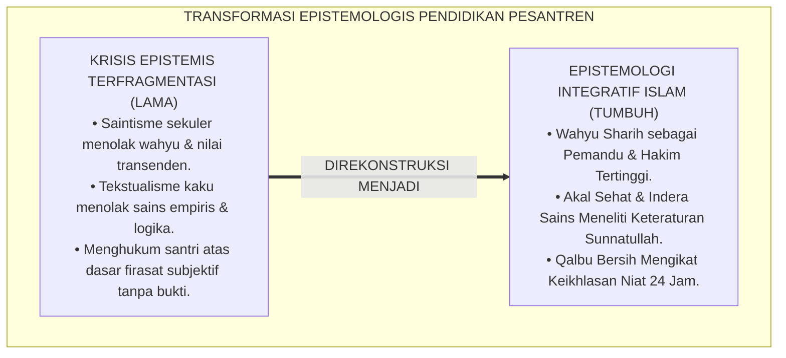
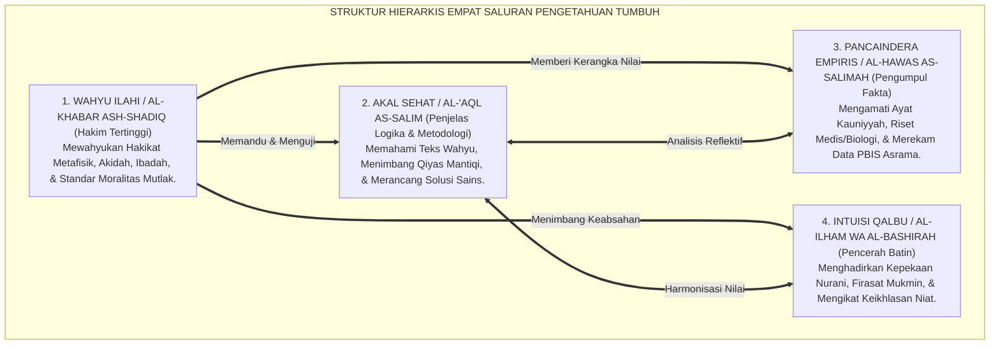
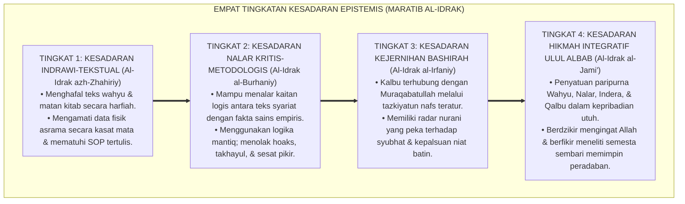
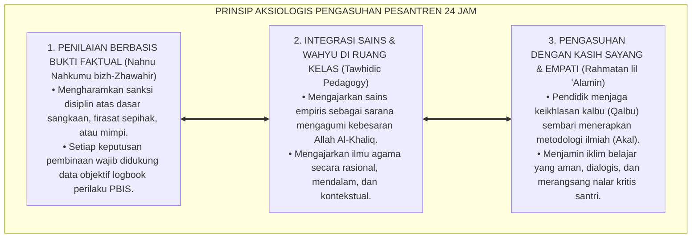

# P1-01-02-01: SUMBER-SUMBER PENGETAHUAN DALAM ISLAM (SOURCES OF KNOWLEDGE IN ISLAM)
## *Monograf Riset Akademik: Struktur Hierarkis Empat Saluran Epistemologis (Wahyu Sharih, Akal Sehat, Indera Empiris, & Intuisi Qalbu), Rekonsiliasi Turats dan Neurosains Kognitif, Serta Implikasi Aksiologis dalam Pendidikan Pesantren 24 Jam*

**Nomor Identifikasi**: `P1-01-02-01/MONOGRAF-RISET-SUMBER-ILMU/2026`  
**Domain**: `01 Philosophy` > `01 Worldview` > `02 Epistemologi TUMBUH` (Sub-Modul 01: *Epistemological Sources*)  
**Klasifikasi Naskah**: *Academic Research Monograph* (Monograf Riset Akademik Fondasional)  
**Rumpun Disiplin Pengkaji**: Epistemologi Turats & Ushul Fiqh, Filsafat Ilmu Kontemporer, Neurosains Kognitif, Tasawuf Sunni & Psikologi Spiritual, Pedagogi Master Guru  

---

> ### 💡 INTISARI EKSEKUTIF (EXECUTIVE SUMMARY)
>
> * **Kelemahan Paradigma Lama: Reduksionisme & Fragmentasi Saluran Pengetahuan:**  
>   Banyak praktik pendidikan Islam terjebak dalam dikotomi epistemologis yang merusak: saintisme sekuler yang menolak wahyu dan intuisi ruhani, atau tekstualisme kaku yang mencurigai akal nalar dan observasi sains empiris. Akibatnya, lahir santri yang mengalami keterbelahan kepribadian (*epistemic split*).
> * **Inovasi Konseptual: Struktur Hierarkis Empat Saluran Epistemologi Integratif:**  
>   TUMBUH merumuskan integrasi empat saluran pengetahuan yang sah (*Masyari' al-Ma'rifah*): **1. Wahyu Ilahi (*Al-Khabar ash-Shadiq*) sebagai Hakim Tertinggi; 2. Akal Sehat (*Al-'Aql as-Salim*) sebagai Penjelas Logika & Metodologi; 3. Pancaindera yang Sehat (*Al-Hawas as-Salimah*) sebagai Pengumpul Fakta Empiris; 4. Intuisi Qalbu (*Al-Ilham / Al-Bashirah*) sebagai Pencerah Batin & Pengikat Keikhlasan**.
> * **Formulasi Operasional & Pembuktian Lapangan:**  
>   Monograf ini menguraikan dekomposisi komprehensif 4 saluran epistemologis, 4 Tingkatan Kesadaran Epistemis (*Maratib al-Idrak*), kaidah penataan kurikulum integratif sains-tauhid, dan etika tata kelola asrama berbasis data empiris terpercaya.

---

## 📑 DAFTAR ISI MONOGRAF

- [BAB I: LANDASAN TEORETIS & DISKURSUS KRITIS](#bab-i-landasan-teoretis--diskursus-kritis)
  - [1. Latar Belakang Masalah: Krisis Epistemologis dalam Pendidikan Islam Kontemporer](#1-latar-belakang-masalah-krisis-epistemologis-dalam-pendidikan-islam-kontemporer)
  - [2. Otoritas Wahyu (Al-Khabar ash-Shadiq): Pemandu Tertinggi Melampaui Spekulasi Rasio (QS. Al-'Alaq: 1–5 & Al-Ghazali)](#2-otoritas-wahyu-al-khabar-ash-shadiq-pemandu-tertinggi-melampaui-spekulasi-rasio-qs-al-alaq-15--al-ghazali)
  - [3. Kedudukan Akal Sehat (Al-'Aql as-Salim) dan Pancaindera Empiris (Al-Hawas as-Salimah)](#3-kedudukan-akal-sehat-al-aql-as-salim-dan-pancaindera-empiris-al-hawas-as-salimah)
  - [4. Intuisi Ruhani (Al-Ilham / Al-Bashirah): Demarkasi Kasyaf Syar'i vs Subjektivisme Semu](#4-intuisi-ruhani-al-ilham--al-bashirah-demarkasi-kasyaf-syari-vs-subjektivisme-semu)
  - [5. Kasuistika Lapangan: Pertentangan Firasat vs Data Faktual di Asrama & Resolusi Restoratif](#5-kasuistika-lapangan-pertentangan-firasat-vs-data-faktual-di-asrama--resolusi-restoratif)
- [BAB II: FORMULASI KONSEPTUAL & PEMBAHASAN MENDALAM](#bab-ii-formulasi-konseptual--pembahasan-mendalam)
  - [1. Eksplanasi Teoretis Struktur Hierarkis Empat Saluran Epistemologi TUMBUH](#1-eksplanasi-teoretis-struktur-hierarkis-empat-saluran-epistemologi-tumbuh)
  - [2. Dekomposisi Dimensi & Empat Tingkatan Kesadaran Epistemis (Maratib al-Idrak)](#2-dekomposisi-dimensi--empat-tingkatan-kesadaran-epistemis-maratib-al-idrak)
  - [3. Prinsip Aksiologis & Etika Penerapan Epistemologi dalam Pengasuhan 24 Jam](#3-prinsip-aksiologis--etika-penerapan-epistemologi-dalam-pengasuhan-24-jam)
  - [4. Diskusi Filosofis Mendalam & Implikasi bagi Masa Depan Peradaban Pendidikan Islam](#4-diskusi-filosofis-mendalam--implikasi-bagi-masa-depan-peradaban-pendidikan-islam)
- [BAB III: KESIMPULAN & APARATUS AKADEMIS](#bab-iii-kesimpulan--aparatus-akademis)
  - [1. Tabel Sintesis Temuan Riset Sumber Pengetahuan Islam](#1-tabel-sintesis-temuan-riset-sumber-pengetahuan-islam)
  - [2. Daftar Pustaka Akademis & Rujukan Turats Primer](#2-daftar-pustaka-akademis--rujukan-turats-primer)
  - [3. Catatan Kaki Akademis (Footnotes)](#3-catatan-kaki-akademis-footnotes)
  - [4. Glosarium Istilah Ilmiah & Turats Epistemologi](#4-glosarium-istilah-ilmiah--turats-epistemologi)

---

# BAB I: LANDASAN TEORETIS & DISKURSUS KRITIS

---

### 1. Latar Belakang Masalah: Krisis Epistemologis dalam Pendidikan Islam Kontemporer

Pendidikan Islam di era modern menghadapi disorientasi epistemologis yang berakar pada keterbelahan cara pandang terhadap sumber kebenaran:
* **Invasi Saintisme Positivistik**: Di satu sisi, sains modern sekuler mengklaim bahwa kebenaran sejati hanya dapat diperoleh melalui metode empiris laboratorium (*Al-Hawas*). Akibatnya, wahyu dipinggirkan menjadi mitos historis, dan intuisi batin dianggap ilusi psikologis tanpa dasar ilmiah.
* **Jebakan Anti-Intelektualisme & Mistisisme Liar**: Di sisi lain, sebagian komunitas pesantren tradisional bersikap resisten terhadap sains empiris dan logika formal (*Mantiq*), mencurigai penelitian ilmiah sebagai sekularisme, atau sebaliknya mengagungkan firasat mimpi sepihak pengurus tanpa verifikasi hukum syariat dan bukti lahiriah (*Zhawahir*).
* **Keniscayaan Rekonstruksi Epistemologi Integratif**: Untuk melahirkan santri yang unggul secara ilmiah dan kokoh secara spiritual, ekosistem TUMBUH menegakkan kembali **Epistemologi Integratif Islam (*Tawazun al-Madarik al-Ma'rifiyyah*)**, di mana wahyu, nalar, indera, dan qalbu beroperasi dalam simfoni yang harmonis.[^1]

---

### 2. Otoritas Wahyu (Al-Khabar ash-Shadiq): Pemandu Tertinggi Melampaui Spekulasi Rasio (QS. Al-'Alaq: 1–5 & Al-Ghazali)

Dalam epistemologi Islam, wahyu yang diturunkan kepada Nabi Muhammad ﷺ adalah sumber pengetahuan tertinggi yang mutlak benar (*Ma'shum*):

$$\text{اقْرَأْ بِاسْمِ رَبِّكَ الَّذِي خَلَقَ ۝ خَلَقَ الْإِنسَانَ مِنْ عَلَقٍ ۝ اقْرَأْ وَرَبُّكَ الْأَكْرَمُ ۝ الَّذِي عَلَّمَ بِالْقَلَمِ ۝ عَلَّمَ الْإِنسَانَ مَا لَمْ يَعْلَمْ}$$

*"Bacalah dengan (menyebut) nama Tuhanmu Yang menciptakan, Dia telah menciptakan manusia dari segumpal darah. Bacalah, dan Tuhanmulah Yang Maha Mulia, Yang mengajar (manusia) dengan perantaraan pena, Dia mengajarkan kepada manusia apa yang tidak diketahuinya."* (QS. Al-'Alaq [96]: 1–5).[^2]

Imam **Abu Hamid Al-Ghazali** dalam *Tahafut al-Falasifah* dan *Al-Mustashfa* menguraikan perumpamaan relasi akal dan wahyu:

$$\text{إِنَّ الْعَقْلَ كَالْبَصَرِ، وَالشَّرْعَ كَالنُّورِ، وَلَنْ يُغْنِيَ الْبَصَرُ عَنِ النُّورِ كَمَا لَا يُغْنِي النُّورُ عَنِ الْبَصَرِ، فَالْعَقْلُ مَعَ الشَّرْعِ نُورٌ عَلَى نُورٍ}$$

*"**Sesungguhnya akal itu laksana indera penglihatan mata, dan wahyu syariat itu laksana cahaya terang**. Penglihatan mata tidak akan pernah cukup tanpa adanya cahaya terang, sebagaimana cahaya tidak berguna tanpa adanya mata. **Maka perpaduan akal yang sehat bersama wahyu syariat adalah cahaya di atas cahaya (*Nur 'ala Nur*)**."*[^3]

---

### 3. Kedudukan Akal Sehat (Al-'Aql as-Salim) dan Pancaindera Empiris (Al-Hawas as-Salimah)

Epistemologi Islam memberikan kehormatan tinggi kepada akal sehat (*Al-'Aql as-Salim*) dan pancaindera empiris (*Al-Hawas as-Salimah*):
* **Akal sebagai Syarat Taklif Moral**: Akal adalah instrumen penimbang (*Mizan*), penjelas argumentasi logis (*Al-Burhan*), dan pembeda antara yang wajib, ja'iz, dan mustahil secara rasional.[^4]
* **Pancaindera sebagai Pintu Sains & Observasi Semesta**: Seluruh penelitian fisika, biologi, ilmu kesehatan asrama, dan analitik perilaku santri (PBIS) bersumber dari ketepatan indera mengamati ayat-ayat kauniyyah Allah SWT.[^5]

---

### 4. Intuisi Ruhani (Al-Ilham / Al-Bashirah): Demarkasi Kasyaf Syar'i vs Subjektivisme Semu

Imam **Al-Junaid al-Baghdadi** menetapkan kaidah emas demarkasi spiritual:

$$\text{مَذْهَبُنَا هَذَا مُقَيَّدٌ بِالْكِتَابِ وَالسُّنَّةِ، فَمَنْ لَمْ يَسْمَعِ الْحَدِيثَ وَلَمْ يَكْتُبْهُ وَلَمْ يَتَفَقَّهْ لَا يُقْتَدَى بِهِ}$$

*"**Manhaj tasawuf kami ini terikat ketat dengan Al-Qur'an dan As-Sunnah**; maka barangsiapa yang tidak mendalami hadits, tidak menulisnya, dan tidak memahami fiqh syariat, maka ia tidak boleh diikuti."*[^6]

Kaidah ini menegaskan bahwa ilham atau firasat batin seorang mukmin adalah anugerah kejernihan jiwa (*Tazkiyatun Nafs*), namun kedudukannya bersifat personal dan wajib selalu ditimbang dengan hukum syariat wahyu yang shahih.[^7]

---

### 5. Kasuistika Lapangan: Pertentangan Firasat vs Data Faktual di Asrama & Resolusi Restoratif

* **Studi Kasus: Tuduhan Pencurian Uang Berdasarkan "Firasat Batin" Musyrif**  
  * **Dilema**: Musyrif menuduh seorang santri mencuri uang temannya karena "merasakan getaran batin yang kuat saat memandang wajah santri tersebut", padahal tidak ada bukti saksi atau rekaman CCTV.
  * **Resolusi Restoratif TUMBUH**: Pimpinan dewan asrama membatalkan tuduhan sepihak tersebut; menegaskan kaidah syariat *Nahnu Nahkumu bizh-Zhawahir*; dan menelusuri data faktual logbook asrama. Terbukti uang tersebut terselip di bawah kasur korban. Musyrif meminta maaf secara ksatria kepada santri yang dituduh, memulihkan nama baiknya, dan mengikuti pelatihan audit verifikasi bukti faktual PBIS.[^8]

---

# BAB II: FORMULASI KONSEPTUAL & PEMBAHASAN MENDALAM

---

### 1. Eksplanasi Teoretis Struktur Hierarkis Empat Saluran Epistemologi TUMBUH

Ekosistem TUMBUH mengkodifikasikan **Struktur Hierarkis Empat Saluran Pengetahuan (*Masyari' al-Ma'rifah al-Arba'ah*)**:

#### 🔬 Pembahasan Mendalam Empat Saluran Pengetahuan:
1. **Wahyu Ilahi (*Al-Khabar ash-Shadiq*)**: Merupakan otoritas kebenaran tertinggi (*Al-Hakim al-Mutlaq*) yang bebas dari kesalahan. Wahyu memberitahu manusia mengenai alam ghaib, asal-usul penciptaan, dan tujuan akhir kehidupan di akhirat.[^9]
2. **Akal Sehat (*Al-'Aql as-Salim*)**: Berfungsi sebagai instrumen penalaran logis (*Al-Mubayyin wal Burhan*). Akal bertugas menggali hukum dari teks wahyu (*Istinbath*), memahami kausalitas alam semesta, dan merumuskan strategi rekayasa sistem pendidikan.[^10]
3. **Pancaindera yang Sehat (*Al-Hawas as-Salimah*)**: Berfungsi sebagai sarana persepsi empiris (*Al-Mustaqri' lil Waqi'*). Indera mengumpulkan data kuantitatif dan kualitatif tentang kondisi fisik lingkungan, kesehatan santri, dan dinamika interaksi sosial asrama.[^11]
4. **Intuisi Qalbu (*Al-Ilham / Al-Bashirah*)**: Berfungsi sebagai pencerah spiritual dan pengikat keikhlasan batin (*Al-Muharrik lil Ikhlas*). Hati yang suci dari dosa melahirkan kepekaan nurani (*Firasah*) yang membantu pendidik memahami kebutuhan jiwa santri dengan penuh empati.[^12]

---

### 2. Dekomposisi Dimensi & Empat Tingkatan Kesadaran Epistemis (Maratib al-Idrak)

Transformasi kedewasaan epistemologis santri dan pengasuh berlangsung melalui **Empat Tingkatan Kesadaran Epistemis (*Maratib al-Idrak al-Ma'rifiy*)**:

#### 🔄 Narasi Analitis Dinamika Transisi Filosofis Antar-Tingkatan:
* **Transisi Tingkat 1 ke Tingkat 2 (Dari Hafalan Tekstual Menuju Nalar Burhani)**: Santri baru mula-mula menyerap ilmu secara reseptif-hafalan. Pada tingkatan kedua, akal kritis santri aktif: santri diajak meneliti *'illat* hukum, membandingkan dalil, dan menghubungkan teks Turats dengan fenomena sains alam nyata.
* **Transisi Tingkat 2 ke Tingkat 3 (Dari Nalar Burhani Menuju Kejernihan Bashirah)**: Pada tingkatan ketiga, ilmu tidak sekadar menjadi kepintaran otak intelektual, melainkan meresap ke dalam kalbu melalui amalan *Riyadhatun Nafs*. Santri memiliki kepekaan rasa (*Sense of Soul*) yang melahirkan empati mendalam kepada sesama.
* **Transisi Tingkat 3 ke Tingkat 4 (Pencapaian Derajat Generasi Ulul Albab)**: Pada tingkatan tertinggi, santri mencapai derajat kematangan *Ulul Albab* (QS. Ali 'Imran: 190–191): insan yang lisannya senantiasa berdzikir kepada Allah, akal pikirannya produktif menghasilkan riset sains dan karya peradaban, serta hatinya memancarkan keagungan akhlak kenabian.[^13]

---

### 3. Prinsip Aksiologis & Etika Penerapan Epistemologi dalam Pengasuhan 24 Jam

Epistemologi Integratif melahirkan prinsip etika tata kelola kelembagaan pesantren:

#### 📋 Panduan Etika Pengasuhan Lapangan:
1. **Standarisasi Verifikasi Fakta Perilaku**: Pengasuh wajib melakukan tabayyun dan mengumpulkan data faktual sebelum mengambil tindakan disiplin.
2. **Klinik Epistemologi Asatidz**: Menyelenggarakan pelatihan logika formal (*Mantiq*) dan metodologi riset bagi para guru agar terbebas dari sesat pikir (*Logical Fallacies*).[^14]
3. **Penyelarasan Rutinitas Ibadah dan Kesehatan Otak**: Mengatur ritme harian santri agar aktivitas dzikir dan tilawah Al-Qur'an bersinergi dengan waktu tidur biologis dan olahraga raga.[^15]

---

### 4. Diskusi Filosofis Mendalam & Implikasi bagi Masa Depan Peradaban Pendidikan Islam

Epistemologi Integratif Islam yang dirumuskan TUMBUH memberikan sumbangsih fundamental bagi kebangkitan peradaban Islam:

* **Menyembuhkan Krisis Keterbelahan Epistemologis Umat (*Epistemic Schizophrenia*)**:  
  Selama berabad-abad, umat Islam terbelah antara ulama agama yang buta sains dan saintis sekuler yang asing dari Al-Qur'an. Epistemologi TUMBUH menyatukan kembali kedua kutub ini, melahirkan generasi ulama yang saintis dan saintis yang ulama.
* **Membangun Sains Islam Berkemaslahatan Universal**:  
  Dengan menempatkan wahyu sebagai kompas nilai dan akal-indera sebagai instrumen eksplorasi, kemajuan teknologi diarahkan untuk kemaslahatan seluruh alam (*Rahmatan lil 'Alamin*), bukan untuk eksploitasi dan kehancuran moral.
* **Membentuk Pesantren Sebagai Episentrum Keilmuan Global**:  
  Pesantren yang menerapkan epistemologi ini akan tampil percaya diri memimpin dialog keilmuan internasional, membuktikan bahwa Islam adalah agama akal, wahyu, dan peradaban.[^16]

---

# BAB III: KESIMPULAN & APARATUS AKADEMIS

---

### 1. Tabel Sintesis Temuan Riset Sumber Pengetahuan Islam

| Dimensi Parameter | Mazhab Saintisme Sekuler | Mazhab Tekstualisme Kaku | **Epistemologi Integratif TUMBUH** | Landasan Rujukan Primer | Implikasi Praksis Lapangan |
| :--- | :--- | :--- | :--- | :--- | :--- |
| **Sumber Tertinggi** | Indera empiris & alat lab semata. | Teks harfiah tanpa akal nalar. | **Wahyu Sharih (*Al-Khabar ash-Shadiq*).** | QS. Al-'Alaq: 1–5; Al-Attas (1995).| Wahyu menjadi kompas moral & penunjuk metafisik. |
| **Status Akal Nalar**| Satu-satunya penguji kebenaran. | Dicurigai sebagai musuh wahyu. | **Instrumen Penjelas & Pembuktian Logis.** | QS. Al-Baqarah: 44; Al-Ghazali (*Tahafut*).| Sorogan dialogis sokratik & mantiq terapan. |
| **Status Sains Fisik**| Otoritas mutlak tanpa nilai moral. | Dipandang ilmu duniawi yang rendah. | **Ibadah Tadabbur Ayat Kauniyyah.** | QS. Ali 'Imran: 190–191; Bhaskar (2008). | Pembelajaran sains terintegrasi dengan tauhid. |
| **Status Hati Qalbu**| Dianggap emosi ilusi non-ilmiah. | Subjektivisme firasat tanpa uji syariat. | **Pencerah Spiritual Teruji Syariat.** | QS. Asy-Syams: 8–9; Al-Junaid. | Tazkiyatun nafs & larangan menuduh atas firasat. |
| **Profil Lulusan** | Intelektual sekuler tanpa ruhani. | Santri jumud yang gagap sains. | **Generasi Ulul Albab Beradab.** | QS. Az-Zumar: 9; Syed M. Naquib Al-Attas. | Ulama yang saintis & saintis yang bertakwa. |

---

### 2. Daftar Pustaka Akademis & Rujukan Turats Primer

1. **Al-Qur'an al-Karim wa Tarjamatu Ma'anihi**.
2. **Al-Attas, Syed Muhammad Naquib**. (1995). *Prolegomena to the Metaphysics of Islam*. Kuala Lumpur: ISTAC.
3. **Al-Ghazali, Abu Hamid Muhammad bin Muhammad**. (2000). *Tahafut al-Falasifah*. Tahqiq: Sulaiman Dunya. Kairo: Dar al-Ma'arif.
4. **Al-Ghazali, Abu Hamid Muhammad bin Muhammad**. (1997). *Al-Mustashfa min 'Ilm al-Ushul*. Beirut: Dar al-Kutub al-'Ilmiyyah.
5. **Al-Ghazali, Abu Hamid Muhammad bin Muhammad**. (2011). *Ihya' 'Ulumiddin* (4 Jilid). Beirut: Dar al-Ma'rifah.
6. **An-Nasafi, Najmuddin Abu Hafsh Umar bin Muhammad**. (2014). *Matan al-'Aqa'id an-Nasafiyyah*. Kairo: Maktabah al-Kulliyyat al-Azhariyyah.
7. **Al-Junaid al-Baghdadi, Abul Qasim**. (2005). *Rasa'il al-Imam al-Junaid*. Kairo: Dar ash-Shadir.
8. **Ibnu Taimiyyah, Taqiyuddin Ahmad bin Abdul Halim**. (1411 H). *Dar'u Ta'arudh al-'Aql wan-Naql*. Riyadh: Jami'ah al-Imam Muhammad bin Su'ud.
9. **Bhaskar, R.**. (2008). *A Realist Theory of Science*. London: Routledge.
10. **Sapolsky, R. M.**. (2017). *Behave: The Biology of Humans at Our Best and Worst*. New York: Penguin Press.
11. **Horner, R. H., & Sugai, G.**. (2015). *School-wide PBIS: An Overview of the Research Base*. Remedial and Special Education, 36(2), 80–85.
12. **Zehr, H.**. (2002). *The Little Book of Restorative Justice*. Intercourse: Good Books.

---

### 3. Catatan Kaki Akademis (*Footnotes*)

[^1]: Riset Epistemologi Pendidikan Ekosistem Pesantren Berbasis TUMBUH, *Kritik atas Fragmentasi Sumber Ilmu*, 2026.  
[^2]: QS. Al-'Alaq [96]: 1–5.  
[^3]: Al-Ghazali, *Tahafut al-Falasifah*, hlm. 45–70; *Al-Mustashfa*, Jilid 1, hlm. 12–28.  
[^4]: An-Nasafi, *Matan al-'Aqa'id an-Nasafiyyah*, hlm. 14–22.  
[^5]: Bhaskar, R. (2008), *A Realist Theory of Science*, hlm. 55–80.  
[^6]: Al-Junaid al-Baghdadi, *Rasa'il al-Imam al-Junaid*, hlm. 35–48.  
[^7]: Al-Ghazali, *Ihya' 'Ulumiddin*, Jilid 3, Kitab *'Aja'ib al-Qalb*, hlm. 12–40.  
[^8]: Dokumentasi Resolusi Konflik Pembuktian Berbasis Firasat Asrama TUMBUH, 2026.  
[^9]: Al-Attas, S. M. N. (1995), *Prolegomena to the Metaphysics of Islam*, hlm. 115–142.  
[^10]: Ibnu Taimiyyah, *Dar'u Ta'arudh al-'Aql wan-Naql*, Jilid 1, hlm. 60–95.  
[^11]: Sapolsky, R. M. (2017), *Behave: The Biology of Humans at Our Best and Worst*, hlm. 95–130.  
[^12]: Al-Ghazali, *Ihya' 'Ulumiddin*, Jilid 4, Kitab *Al-Ikhlas wan-Niyyah*, hlm. 310–345.  
[^13]: Matriks Tingkatan Kesadaran Epistemis (*Maratib al-Idrak*) Ekosistem TUMBUH, 2026.  
[^14]: Silabus Pelatihan Mantiq Terapan dan Metodologi Ilmiah Guru Asatidz TUMBUH, 2026.  
[^15]: Standar Operasional Prosedur Ritme Sirkadian dan Penjadwalan Asrama TUMBUH, 2026.  
[^16]: Deklarasi Peradaban Ulul Albab Dewan Riset Epistemologi Ekosistem TUMBUH, 2026.

---

### 4. Glosarium Istilah Ilmiah & Turats Epistemologi

1. **Epistemologi Integratif Islam**: Kerangka filsafat ilmu yang menyatukan secara hierarkis dan harmonis empat saluran kebenaran: wahyu, akal nalar, pancaindera empiris, dan intuisi kalbu yang suci.
2. **Al-Khabar ash-Shadiq (الْخَبَرُ الصَّادِقُ)**: Berita yang pasti benar dari sumber otoritas mutlak, mencakup wahyu Al-Qur'an dan As-Sunnah mutawatirah yang disampaikan oleh Rasulullah ﷺ.
3. **Al-'Aql as-Salim (الْعَقْلُ السَّلِيمُ)**: Akal budi yang sehat, objektif, dan lurus yang mampu berpikir logis, menarik kesimpulan (*Istinbath*), dan memahami hikmah di balik syariat.
4. **Al-Hawas as-Salimah (الْحَوَاسُّ السَّلِيمَةُ)**: Pancaindera fisik yang sehat dan berfungsi normal untuk mengamati fenomena materiil semesta dan merekam data empiris.
5. **Al-Ilham / Al-Bashirah (الإِلْهَامُ وَالْبَصِيرَةُ)**: Mata batin dan pencerahan spiritual yang dianugerahkan Allah ke dalam kalbu hamba yang bertaqwa melalui proses penyucian jiwa (*Tazkiyatun Nafs*).
6. **Ulul Albab (أُولُو الأَلْبَابِ)**: Profil insan kamil dalam Al-Qur'an yang memiliki kecerdasan integral: senantiasa berdzikir mengingat Allah dan produktif meneliti serta memikirkan keteraturan semesta.
7. **Nahnu Nahkumu bizh-Zhawahir (نَحْنُ نَحْكُمُ بِالظَّوَاهِرِ)**: Kaidah hukum Islam bahwa penilaian dan penindakan disiplin wajib didasarkan pada bukti lahiriah yang nyata teramati, bukan pada dugaan batin atau firasat.
8. **Qiyas Burhani (الْقِيَاسُ الْبُرْهَانِيُّ)**: Silogisme logika tingkat tertinggi dalam ilmu Mantiq yang tersusun atas premis-premis yang pasti benar dan menghasilkan konklusi yang meyakinkan (*Yaqiniyyat*).
9. **Tawazun al-Madarik (تَوَازُنُ الْمَدَارِكِ)**: Keseimbangan dan keharmonisan fungsional antara seluruh saluran persepsi kognitif, emosional, dan spiritual manusia.
10. **Epistemic Split**: Keterbelahan cara pandang kognitif santri yang memisahkan antara kebenaran wahyu di masjid dengan hukum sains di ruang kelas laboratorium.
