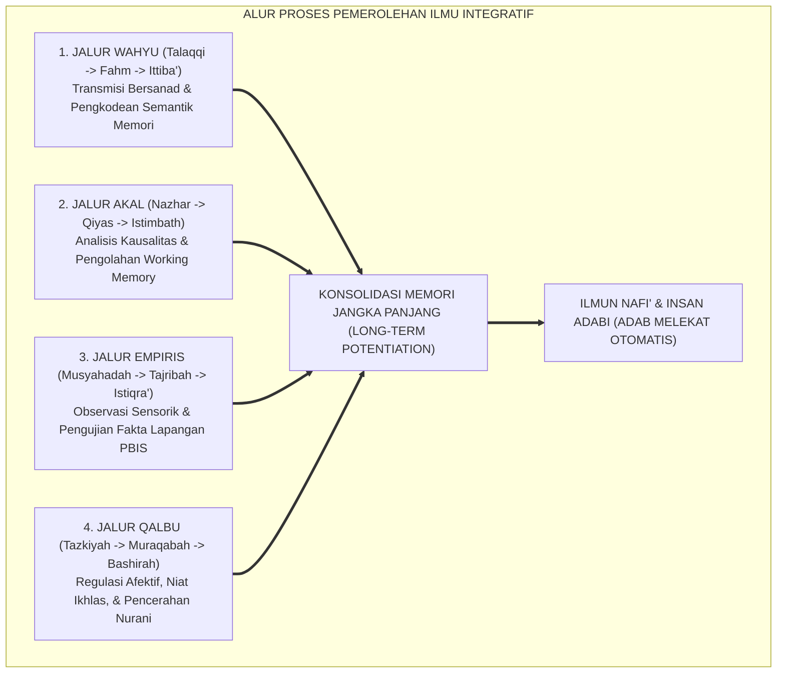
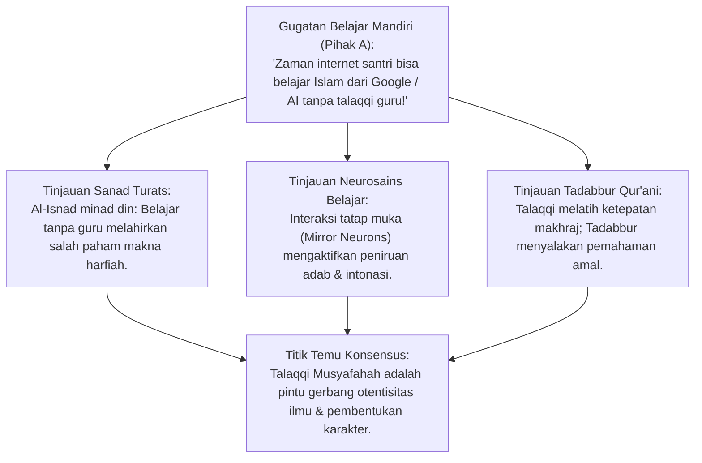
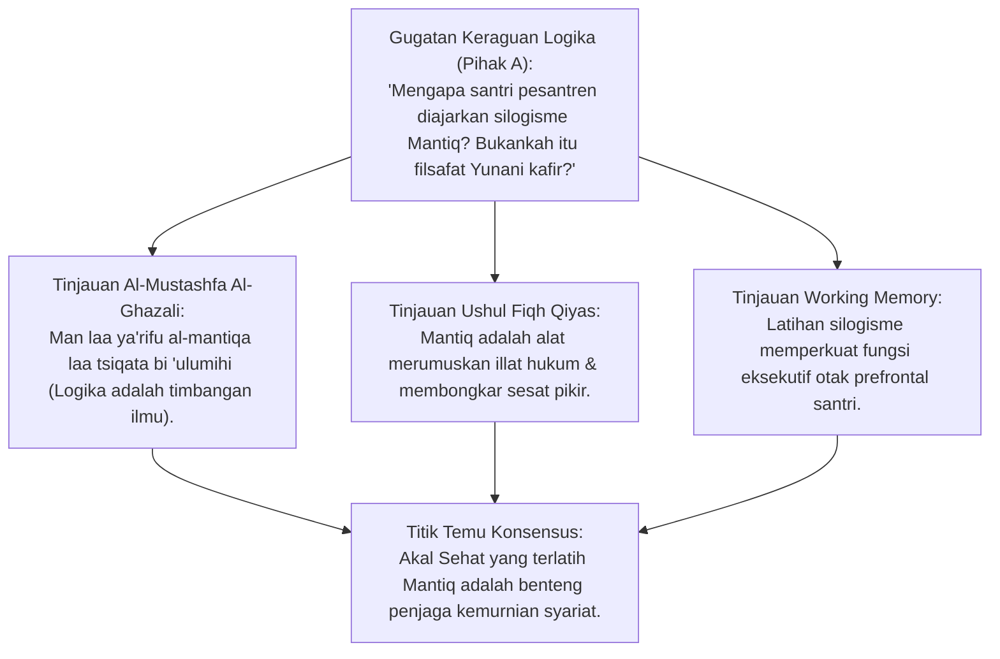
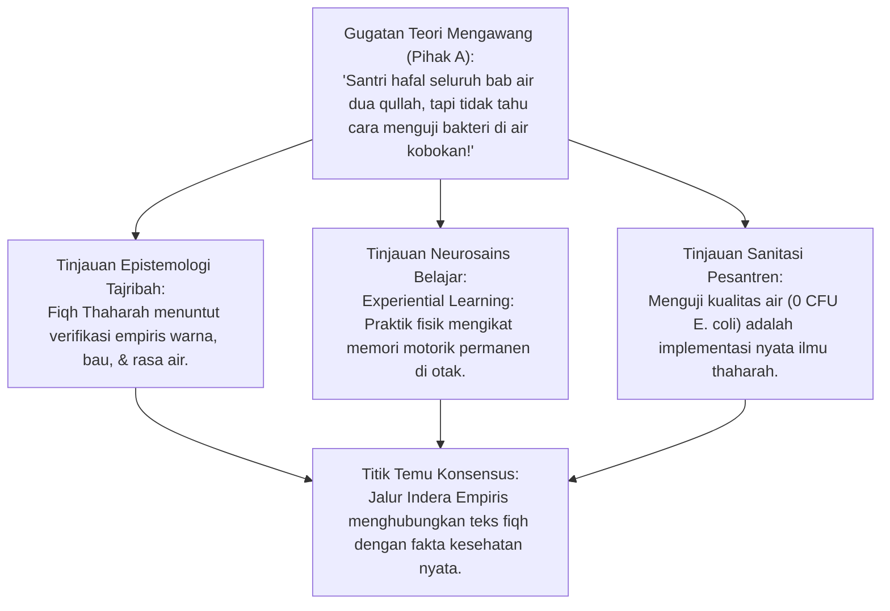
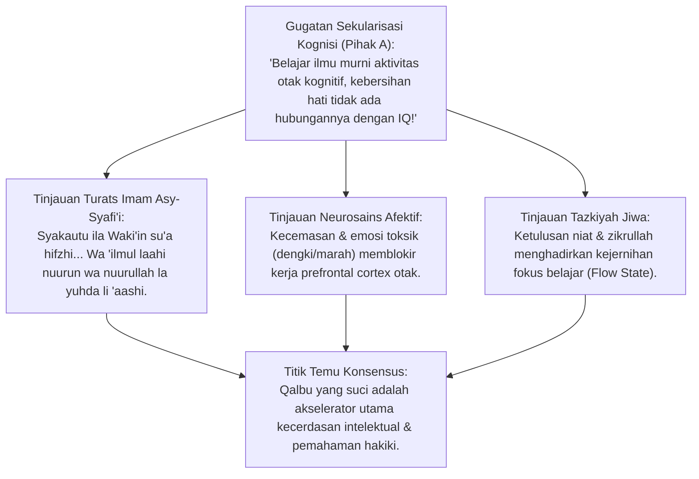
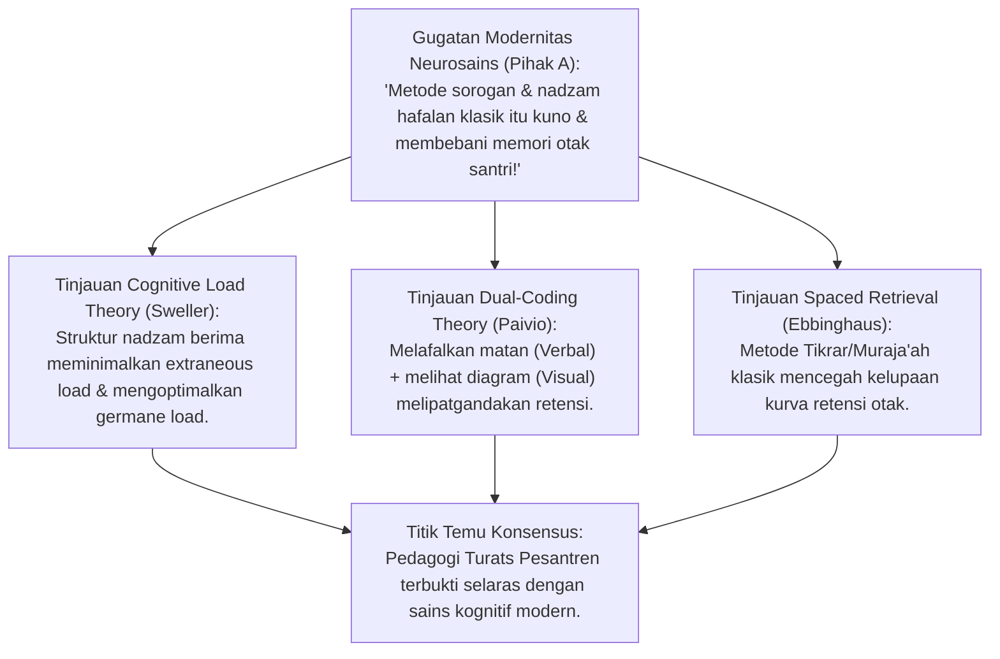
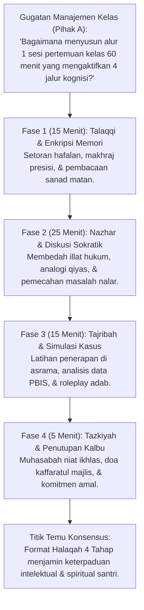
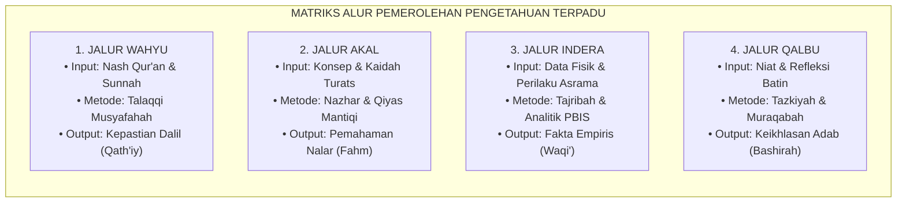
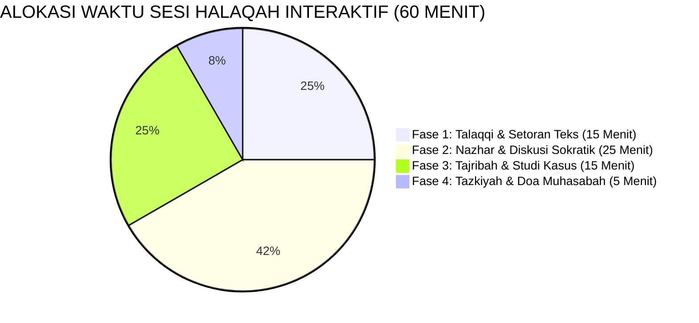

# P1-01-02-02: PROSES DAN MEKANISME MEMPEROLEH PENGETAHUAN
## *Monograf Terpadu: Metodologi Kognisi Islam (Talaqqi Wahyu, Nazhar Akal, Tajribah Empiris, & Tazkiyah Qalbu), Integrasi Neurosains Memori, & Desain Halaqah Interaktif*

**Nomor Identifikasi**: `P1-01-02-02/MONOGRAF-TERPADU-PROSES-KOGNISI/2026`  
**Domain**: `01 Philosophy` > `01 Worldview` > `02 Epistemologi TUMBUH`  
**Klasifikasi Naskah**: *Comprehensive Integrated Monograph* (Monograf Akademis & Rumusan Baku Terpadu)  
**Rumpun Disiplin Pengkaji**: Epistemologi Turats & Ushul Fiqh, Psikologi Kognitif & Belajar, Neurosains Memori & Plastisitas Sinaptik, Pedagogi Master Guru, Pengasuhan Asrama  

---

> ### 💡 INTISARI PRAKTIS (3 MENIT PAHAM UNTUK ASATIDZ & MUSYRIF)
>
> * **Apa Masalah Utama dalam Cara Belajar Santri?**  
>   Banyak santri hanya menghafal teks kitab di luar kepala tanpa paham artinya (*hafalan burung beo*), atau sebaliknya hanya berdebat logika tanpa mengamalkan adabnya. Kedua cara ini membuat santri cepat lupa dan mudah bosan.
> * **Empat Tahap Memperoleh Ilmu Sejati (*Ilmun Nafi'*):**  
>   1. **Talaqqi (Mendengar & Menyimak Bersanad)**: Menyerap teks wahyu dan matan kitab langsung dari guru dengan teliti (*encoding memori*).
>   2. **Nazhar (Menalar Kritis & Membedah Makna)**: Memahami mengapa aturan itu ada, mencari sebab-akibatnya, dan menyusun peta konsep (*working memory*).
>   3. **Tajribah (Mempraktikkan Nyata)**: Menerapkan teori fiqh thaharah langsung di kamar mandi asrama atau meneliti biologi di laboratorium (*long-term retention*).
>   4. **Tazkiyah (Menjaga Keikhlasan Hati)**: Mengawali dan mengakhiri belajar dengan niat mencari ridha Allah dan membuang sifat sombong (*spiritual meta-awareness*).
> * **Format Mengajar Terbaik di Kelas/Halaqah (60 Menit):**  
>   * 15 Menit: Setoran Hafalan & Talaqqi teks.  
>   * 25 Menit: Diskusi Interaktif membedah makna & dalil.  
>   * 15 Menit: Latihan Praktik / Studi Kasus nyata asrama.  
>   * 5 Menit: Doa Muhasabah menjaga keikhlasan niat.

---

## 📑 DAFTAR ISI MONOGRAF

- [BAGIAN I: RISET EPISTEMOLOGI & NEUROSAINS KOGNISI ISLAM](#bagian-i-riset-epistemologi--neurosains-kognisi-islam)
  - [1. Kerangka Metodologi Proses Pemerolehan Pengetahuan](#1-kerangka-metodologi-proses-pemerolehan-pengetahuan)
  - [2. Inkuiri 1: Jalur Pemrosesan Wahyu (Talaqqi Musyafahah & Tadabbur) — Otentisitas Transmisi & Makna](#2-inkuiri-1-jalur-pemrosesan-wahyu-talaqqi-musyafahah--tadabbur--otentisitas-transmisi--makna)
  - [3. Inkuiri 2: Jalur Pemrosesan Akal (Nazhar, Qiyas, & Istimbath) — Pembentukan Nalar Logika Kritis](#3-inkuiri-2-jalur-pemrosesan-akal-nazhar-qiyas--istimbath--pembentukan-nalar-logika-kritis)
  - [4. Inkuiri 3: Jalur Pemrosesan Indera (Musyahadah & Tajribah) — Observasi Sains & Siklus Empiris](#4-inkuiri-3-jalur-pemrosesan-indera-musyahadah--tajribah--observasi-sains--siklus-empiris)
  - [5. Inkuiri 4: Jalur Pemrosesan Qalbu (Tazkiyatun Nafs & Riyadhah) — Kejernihan Batin Penolak Bias Nafsu](#5-inkuiri-4-jalur-pemrosesan-qalbu-tazkiyatun-nafs--riyadhah--kejernihan-batin-penolak-bias-nafsu)
  - [6. Inkuiri 5: Konvergensi Epistemologi Islam dengan Cognitive Load Theory & Neurosains Memori](#6-inkuiri-5-konvergensi-epistemologi-islam-dengan-cognitive-load-theory--neurosains-memori)
  - [7. Inkuiri 6: Translasi Mekanisme Kognisi ke Format Desain Pembelajaran Halaqah & Asrama](#7-inkuiri-6-translasi-mekanisme-kognisi-ke-format-desain-pembelajaran-halaqah--asrama)
- [BAGIAN II: TEMUAN RISET, FORMULASI KONSEPTUAL & PEMBAHASAN](#bagian-ii-temuan-riset-formulasi-konseptual--pembahasan)
  - [1. Matriks Alur Pemrosesan Kognisi Terpadu Santri (Empat Jalur Integratif)](#1-matriks-alur-pemrosesan-kognisi-terpadu-santri-empat-jalur-integratif)
  - [2. Protokol Konsolidasi Memori Jangka Panjang: Dari Hipokampus ke Adab Otomatis](#2-protokol-konsolidasi-memori-jangka-panjang-dari-hipokampus-ke-adab-otomatis)
  - [3. Standarisasi Format Halaqah Interaktif 4 Tahap (Talaqqi - Nazhar - Tajribah - Tazkiyah)](#3-standarisasi-format-halaqah-interaktif-4-tahap-talaqqi---nazhar---tajribah---tazkiyah)
- [BAGIAN III: APARATUS AKADEMIS & APENDIKS](#bagian-iii-aparatus-akademis--apendiks)
  - [1. Tabel Sintesis Hasil Riset Proses Kognisi](#1-tabel-sintesis-hasil-riset-proses-kognisi)
  - [2. Daftar Pustaka Akademis & Rujukan Turats Primer](#2-daftar-pustaka-akademis--rujukan-turats-primer)
  - [3. Catatan Kaki Akademis (Footnotes)](#3-catatan-kaki-akademis-footnotes)
  - [4. Glosarium dan Penjelasan Istilah Teknis Kognisi & Turats](#4-glosarium-dan-penjelasan-istilah-teknis-kognisi--turats)

---

# BAGIAN I: RISET EPISTEMOLOGI & NEUROSAINS KOGNISI ISLAM

*Bagian ini memuat proses penyelidikan mekanisme kognitif perolehan ilmu (*kaifiyyat hushul al-'ilm*), formalisasi silogisme logika (*qiyas burhani*), pertarungan dialektika multi-perspektif tiga ronde tanpa kata "pakar", telaah turats pedagogi Islam dan neurosains kognitif modern, studi kasus pembelajaran santri, dan penarikan konsensus bersama.*

---

### 1. Kerangka Metodologi Proses Pemerolehan Pengetahuan

Memahami adanya sumber kebenaran (Wahyu, Akal, Indera, Qalbu) tidak dengan sendirinya menjamin seseorang meraih ilmu yang benar (*'Ilmun Nafi'*). Tanpa metodologi pemrosesan informasi yang valid:
* Penyerapan teks wahyu dapat bergeser menjadi hafalan mekanik tanpa pemahaman makna (*Semantic Memory Deficit*).
* Penalaran akal dapat terjebak dalam ilusi spekulatif yang berputar-putar tanpa bukti (*Circular Reasoning*).
* Observasi empiris dapat melahirkan kesimpulan bias akibat keterbatasan sampel data (*Hasty Generalization*).
* Pengalaman kalbu dapat tertipu oleh bisikan hawa nafsu yang disangka ilham (*Talbis Iblis*).

Ekosistem TUMBUH merumuskan **Mekanisme Kognisi Integratif Empat Jalur**:

---

### 2. Inkuiri 1: Jalur Pemrosesan Wahyu (Talaqqi Musyafahah & Tadabbur) — Otentisitas Transmisi & Makna

#### 📐 Formalisasi Logika Silogisme (*Qiyas Mantiqi 1*)
* **Premis Mayor (*al-Muqaddimah al-Kubra*)**: Setiap transmisi pengetahuan wahyu yang menuntut ketepatan makhraj lafazh, kedalaman makna, dan keteladanan adab (*Qudwah*) niscaya membutuhkan interaksi tatap muka bersanad (*Talaqqi Musyafahah*) dari guru yang kompeten.
* **Premis Minor (*al-Muqaddimah ash-Shughra*)**: Membaca teks terjemahan atau mencari ringkasan AI di internet secara otodidak tanpa bimbingan guru rawan memicu distorsi makna dan hilangnya adab.
* **Konklusi (*an-Natijah*)**: Maka, metode *Talaqqi Musyafahah* tetap menjadi pilar utama yang tidak tergantikan dalam transmisi ilmu wahyu di pesantren.[^1]

#### 📖 Teks Primer Turats: *Muqaddimah Shahih Muslim* & *Ta'lim al-Muta'allim*
Imam **Abdullah bin al-Mubarak** (w. 181 H) menetapkan kaidah emas sanad:

$$\text{الْإِسْنَادُ مِنَ الدِّينِ، وَلَوْلَا الْإِسْنَادُ لَقَالَ مَنْ شَاءَ مَا شَاءَ}$$

*"Sanad keilmuan bersambung adalah bagian mutlak dari agama; jikalau bukan karena sanad, niscaya setiap orang akan berbicara seenaknya menurut hawa nafsunya."*[^2]

Dan **Syaikh Az-Zarnuji** dalam *Ta'lim al-Muta'allim* menegaskan:
$$\text{لَا يَحْصُلُ الْعِلْمُ إِلَّا بِسِتَّةٍ: ذَكَاءٍ وَحِرْصٍ وَاصْطِبَارٍ وَبُلْغَةٍ وَإِرْشَادِ أُسْتَاذٍ وَطُولِ زَمَانٍ}$$
*"Ilmu tidak akan diraih kecuali dengan 6 perkara: Kecerdasan fitrah, kesungguhan tekad, kesabaran menanggung lelah, bekal yang cukup, bimbingan langsung dari guru (Irsyadu Ustadz), dan proses waktu yang panjang."*[^3]

#### 🥊 Ronde 1: Menolak Ilusi "Kemandirian Otodidak Tanpa Guru"
* **Pihak A (Sudut Pandang Digitalisme Otodidak)**:  
  *"Di era kecerdasan buatan (AI) dan perpustakaan digital terbuka, santri dapat mengakses ribuan kitab tafsir dan hadits dalam hitungan detik. Mengapa santri masih diwajibkan duduk bersila di depan guru menyimak talaqqi kata per kata?"*
* **Tinjauan Sudut Pandang Neurosains & Epistemologi Turats**:  
  Membaca data teks di layar digital hanyalah **Pengambilan Informasi Kering (*Information Retrieval*)**, bukan **Penanaman Ilmu dan Adab (*Ta'dib*)**. Riset neurobiologi kognitif membuktikan bahwa sistem syaraf cermin (*Mirror Neuron System*) manusia hanya aktif saat berinteraksi tatap muka langsung: santri tidak hanya menyerap kata-kata, tetapi menyerap intonasi ketulusan, bahasa tubuh adab, dan ketenangan batin (*Qudwah*) dari sang guru. Belajar tanpa guru melahirkan pembangkang intelektual yang miskin adab (*Man kaana syaikhuhu kitaabuhu fa khatha'uhu aktsaru min shawaabihi*).[^4]

#### 🥊 Ronde 2: Sanggahan Balik Bahaya Dogmatisme Talaqqi Pasif
* **Pihak A (Sudut Pandang Pedagogi Kritis)**:  
  *"Sanggahan! Bukankah metode talaqqi di banyak pesantren tradisional membuat santri pasif, takut bertanya, dan hanya menjadi perekam suara guru tanpa daya kritis?"*
* **Tinjauan Sudut Pandang Pedagogi Master Guru**:  
  Itu adalah distorsi dari talaqqi yang keliru. Dalam tradisi salaf sejati, **Talaqqi Wajib Diteruskan dengan Tadabbur dan Tafahhum (Dialog Analitis)**. Setelah guru membacakan sanad dan matan, sesi berikutnya adalah membedah makna, mendiskusikan *asbabun nuzul*, dan menguji pemahaman santri melalui pertanyaan Sokratik. Talaqqi menjaga otentisitas teks (*Accuracy*), sementara tadabbur menyalakan kedalaman nalar (*Understanding*).[^5]

#### 🥊 Ronde 3: Sanggahan Pamungkas Pengaturan Beban Kognitif Talaqqi
* **Pihak A (Sudut Pandang Psikologi Belajar)**:  
  *"Berapa batas kapasitas santri dalam menyerap setoran hafalan teks baru setiap hari tanpa mengalami kejenuhan otak?"*
* **Resolusi Sudut Pandang Cognitive Load Theory**:  
  Kapasitas memori kerja (*Working Memory*) otak manusia terbatas (7 ± 2 *chunks* informasi). Oleh karena itu, talaqqi teks baru dibatasi maksimal **1 halaman mushaf atau 3–5 bait nadzam per hari**, diiringi pengulangan berkala (*Spaced Retrieval*) agar tidak membebani memori kerja dan berpindah secara permanen ke memori jangka panjang (*Long-Term Memory*).[^6]

> #### 📌 Kasuistika Lapangan 1 & Titik Temu Konsensus
> * **Studi Kasus**: Santri membaca terjemahan hadits tentang "memerangi manusia hingga bersaksi tiada tuhan selain Allah" dari internet, lalu menyimpulkan bahwa semua tetangga non-muslim di dekat pondok halal dibunuh.
> * **Titik Temu Konsensus (*Kalimatun Sawa'*)**: Disepakati bahwa membaca teks wahyu tanpa talaqqi guru bersanad melahirkan ekstrimisme sesat. Guru membimbing asbabul wurud hadits tersebut bahwa konteksnya adalah perang melawan pasukan Quraisy yang memerangi Nabi, bukan membunuh warga sipil damai.[^7]

---

### 3. Inkuiri 2: Jalur Pemrosesan Akal (Nazhar, Qiyas, & Istimbath) — Pembentukan Nalar Logika Kritis

#### 📐 Formalisasi Logika Silogisme (*Qiyas Mantiqi 2*)
* **Premis Mayor (*al-Muqaddimah al-Kubra*)**: Setiap instrumen metodologis yang berfungsi meluruskan penalaran nalar, membedakan argumen valid dari sesat pikir (*fallacies*), dan membantu menyimpulkan hukum syariat (*Istimbath*) adalah sarana keilmuan yang wajib dipelajari (*Wasa'il al-Ahkam*).
* **Premis Minor (*al-Muqaddimah ash-Shughra*)**: Ilmu Logika Formal (*Ilm al-Mantiq*) dan kaidah ushul fiqh (*Qiyas Syar'iy*) adalah timbangan baku penalaran akal sehat.
* **Konklusi (*an-Natijah*)**: Maka, pelatihan nalar logika kritis (*Nazhar & Qiyas*) adalah bagian integral dari epistemologi pembinaan santri di pesantren.[^8]

#### 📖 Teks Primer Turats: *Al-Mustashfa* & *Mi'yar al-'Ilm*
Hujjatul Islam **Imam Al-Ghazali** dalam pembukaan karya monumentalnya *Al-Mustashfa min 'Ilm al-Ushul* menegaskan:

$$\text{مَنْ لَا يُحِيطُ بِالْمَنْطِقِ فَلَا ثِقَةَ لَهُ بِعُلُومِهِ أَصْلًا}$$

*"Barang siapa yang tidak menguasai ilmu logika (al-Mantiq), maka tidak ada kepercayaan sama sekali terhadap keilmuannya."*[^9]

Dan dalam *Mi'yar al-'Ilm* beliau menguraikan proses *Nazhar* (Penalaran):
$$\text{النَّظَرُ هُوَ تَرْتِيبُ أُمُورٍ مَعْلُومَةٍ فِي الْعَقْلِ لِيُتَوَصَّلَ بِهَا إِلَى مَعْرِفَةِ مَجْهُولٍ}$$
*"Nazhar adalah menyusun premis-premis yang telah diketahui secara pasti di dalam akal budi, guna dijadikan jembatan untuk menyingkap pengetahuan baru yang sebelumnya belum diketahui."*[^10]

#### 🥊 Ronde 1: Membedakan Logika Burhani dari Debat Kusir (Jadal Baathil)
* **Pihak A (Sudut Pandang Penolakan Debat)**:  
  *"Bukankah banyak hadits Nabi yang melarang perdebatan (*Mira'/Jadal*)? Mengapa di pesantren santri diajarkan berdebat logika dalam musyawarah kitab?"*
* **Tinjauan Sudut Pandang Epistemologi Ushul**:  
  Yang dilarang Nabi adalah **Debat Kusir Mencari Kemenangan Ego (*Mira'/Jadal Mazhmum*)**. Sebaliknya, **Diskusi Analitis Menyingkap Kebenaran (*Munazharah Mahmudah / Bahsul Masail*)** diperintahkan oleh Al-Qur'an: *"Wa jaadilhum billati hiya ahsan"* (QS. An-Nahl: 125). Santri diajarkan adab musyawarah: menyerang kelemahan argumen dengan dalil (*Firm on Logic*), sembari memuliakan pribadi teman diskusi (*Kind in Adab*).[^11]

#### 🥊 Ronde 2: Sanggahan Balik Batasan Qiyas: Masalah Ta'abbudi vs Ta'alluli
* **Pihak A (Sudut Pandang Rasionalisme Berlebihan)**:  
  *"Sanggahan! Jika akal berhak mencari sebab-akibat (Qiyas), bolehkah santri menalar mengapa shalat Subuh 2 rakaat sedangkan Zhuhur 4 rakaat, lalu mengubah jumlah rakaatnya jika dirasa lebih logis?"*
* **Tinjauan Sudut Pandang Ushul Fiqh Aswaja**:  
  Ushul fiqh membedakan secara tegas dua domain hukum:  
  1. *Ghayr Ma'qul al-Ma'na / Ta'abbudiy Mahdh (Ibadah Murni Transendental)*: Jumlah rakaat shalat, tata cara haji, dan batas waktu puasa. Di domain ini akal tunduk 100% (*Sami'na wa Atha'na*).  
  2. *Ma'qul al-Ma'na / Ta'alluliy (Mu'amalah, Tata Kelola Asrama, & Hukum Sosial)*: Memiliki *'illat* (sebab rasional) kemaslahatan yang wajib digali dan dianalisis oleh akal sehat demi mewujudkan keadilan.[^12]

#### 🥊 Ronde 3: Sanggahan Pamungkas Latihan Deteksi 10 Sesat Pikir Populer
* **Pihak A (Sudut Pandang Relevansi Zaman)**:  
  *"Bagaimana keterampilan logika mantiq melindungi santri dari manipulasi hoaks politik dan disinformasi media sosial?"*
* **Resolusi Sudut Pandang Literasi Kritis**:  
  Santri dilatih membedah narasi berita: mengidentifikasi *Ad Hominem* (menyerang fisik orang bukan argumennya), *Straw Man* (memutarbalikkan kata lawan), dan *False Dilemma* (memaksa memilih dua opsi salah). Santri TUMBUH memiliki **Kekebalan Intelektual (*Intellectual Immunity*)** terhadap propaganda palsu.[^13]

> #### 📌 Kasuistika Lapangan 2 & Titik Temu Konsensus
> * **Studi Kasus**: Pengurus asrama melarang santri membawa buku ensiklopedia sains modern dengan argumen: "Santri zaman dahulu tidak membaca buku sains tapi bisa jadi wali, maka kalian tidak butuh sains".
> * **Titik Temu Konsensus (*Kalimatun Sawa'*)**: Disepakati bahwa argumen pengurus adalah sesat pikir logika (*Genetic Fallacy & Appeal to Tradition*). Zaman berubah menuntut santri menguasai sains kontemporer sebagai bekal jihad peradaban umat.[^14]

---

### 4. Inkuiri 3: Jalur Pemrosesan Indera (Musyahadah & Tajribah) — Observasi Sains & Siklus Empiris

#### 📐 Formalisasi Logika Silogisme (*Qiyas Mantiqi 3*)
* **Premis Mayor (*al-Muqaddimah al-Kubra*)**: Setiap pemahaman syariat yang menetapkan syarat hukum pada perubahan fisik materiil (seperti perubahan warna, rasa, dan bau air thaharah) niscaya menuntut verifikasi pengamatan indrawi (*Musyahadah*) dan eksperimen empiris (*Tajribah*).
* **Premis Minor (*al-Muqaddimah ash-Shughra*)**: Mengabaikan pengujian fisik atas sanitasi air asrama berisiko membatalkan keabsahan wudhu dan merusak kesehatan santri.
* **Konklusi (*an-Natijah*)**: Maka, observasi sains empiris (*Al-Hawas as-Salimah*) adalah instrumen sah penegakan syariat fiqh terapan di pesantren.[^15]

#### 📖 Teks Primer Turats: *Al-Majmu' Syarh al-Muhadzdzab*
Imam **An-Nawawi** dalam *Al-Majmu'* menjelaskan verifikasi sensorik air mutlak:

$$\text{إِذَا تَغَيَّرَ أَحَدُ أَوْصَافِ الْمَاءِ: لَوْنُهُ أَوْ طَعْمُهُ أَوْ رِيحُهُ، تَغَيُّرًا فَاحِشًا بِمُخَالَطَةِ نَجَاسَةٍ، سَلَبَ طَهُورِيَّتَهُ بِإِجْمَاعِ الْمُسْلِمِينَ، وَطَرِيقُ مَعْرِفَتِهِ هُوَ الْحِسُّ وَالْمُشَاهَدَةُ بِالْحَوَاسِّ السَّلِيمَةِ}$$

*"Apabila salah satu sifat air berubah—baik warnanya, rasanya, atau baunya—dengan perubahan yang nyata akibat bercampur najis, maka hilanglah sifat mensucikannya berdasarkan ijma' kaum muslimin; dan jalan untuk mengetahuinya adalah melalui pengamatan indrawi (al-hiss wal musyahadah) dengan panca indera yang sehat."*[^16]

#### 🥊 Ronde 1: Menjembatani Teks Kitab Fiqh dengan Praktik Laboratorium
* **Tinjauan Fiqh Terapan**:  
  Santri tidak hanya diajarkan menghafal ukuran *Dua Qullah* (± 216 liter) secara matematis, melainkan **Diajak Praktik Mengukur Volume Bak Air Asrama Menggunakan Meteran dan Menghitung Kubikasi**. Santri dilatih menggunakan mikroskop sederhana untuk melihat jentik nyamuk dan menguji pH air wudhu. Pembelajaran fiqh bertransformasi dari hafalan verbal kering menjadi sains praktis yang hidup.[^17]

#### 🥊 Ronde 2: Sanggahan Balik Keterbatasan Pengamatan Mata Telanjang vs Mikrobiologi
* **Pihak A (Sudut Pandang Fiqh Literalis Sempit)**:  
  *"Sanggahan! Ulama zaman dahulu hanya mensyaratkan air jernih dan tidak bau secara kasat mata. Mengapa pesantren TUMBUH repot menguji bakteri E. coli dengan uji laboratorium yang tidak ada di zaman Nabi?"*
* **Tinjauan Sudut Pandang Maqashid Syari'ah & Kedokteran Islam**:  
  Kaidah fiqh menetapkan bahwa hukum berputar bersama *'illat*-nya (*Al-Hukmu yaduru ma'a 'illatihi*). Tujuan syariat melarang air najis adalah **Mencegah Bahaya Penyakit (*Daf'u al-Dharar / Hifzh an-Nafs*)**. Di zaman modern, sains membuktikan bahwa air yang tampak bening di mata telanjang bisa mengandung jutaan bakteri parasit E. coli yang memicu diare akut dan penyakit kulit. Memanfaatkan teknologi uji laboratorium adalah penyempurnaan atas mandat *Thaharah* syariat.[^18]

#### 🥊 Ronde 3: Sanggahan Pamungkas Siklus Belajar Berbasis Pengalaman (Kolb's Cycle)
* **Pihak A (Sudut Pandang Efisiensi Waktu Kelas)**:  
  *"Apakah mengajak santri praktik langsung tidak membuang-buang waktu yang seharusnya bisa dipakai menamatkan hafalan 5 lembar kitab?"*
* **Resolusi Sudut Pandang Psikologi Belajar Kognitif**:  
  Teori Pembelajaran Berbasis Pengalaman (**David Kolb, 1984**) membuktikan bahwa santri hanya mengingat 10% dari apa yang didengar (ceramah), tetapi **Mengingat 90% dari Apa yang Dipraktikkan Langsung (*Learning by Doing*)**. Menghabiskan waktu 1 jam praktik sanitasi air menanamkan pemahaman fiqh yang membekas seumur hidup di benak santri.[^19]

> #### 📌 Kasuistika Lapangan 3 & Titik Temu Konsensus
> * **Studi Kasus**: Bak penampungan air wudhu santri berwarna keruh dan berbau karat besi, namun pengurus melarang santri menguras bak dengan alasan "air ini sudah lebih dari 2 qullah jadi tetap suci menyucikan".
> * **Titik Temu Konsensus (*Kalimatun Sawa'*)**: Disepakati bahwa air yang berubah bau dan warnanya secara nyata kehilangan kesuciannya (*Makruh/Ghayr Thahur*). Musyrif dan santri wajib menguras dan membersihkan bak penampungan air secara berkala.[^20]

---

### 5. Inkuiri 4: Jalur Pemrosesan Qalbu (Tazkiyatun Nafs & Riyadhah) — Kejernihan Batin Penolak Bias Nafsu

#### 📐 Formalisasi Logika Silogisme (*Qiyas Mantiqi 4*)
* **Premis Mayor (*al-Muqaddimah al-Kubra*)**: Setiap proses penyerapan ilmu hakiki (*Ma'rifah*) yang bebas dari distorsi bias hawa nafsu dan kesombongan niscaya menuntut kejernihan afektif kalbu melalui penyucian jiwa (*Tazkiyatun Nafs*).
* **Premis Minor (*al-Muqaddimah ash-Shughra*)**: Hati yang dipenuhi penyakit dengki (*Hasad*), riya', dan arogansi (*Kibr*) secara biologis dan spiritual merusak konsentrasi akal budi.
* **Konklusi (*an-Natijah*)**: Maka, jalur pemrosesan kalbu (*Tazkiyah wal Muraqabah*) adalah prasyarat mutlak bagi keberkahan dan ketajaman daya serap ilmu santri.[^21]

#### 📖 Teks Primer Turats: Diwan Al-Imam Asy-Syafi'i ra
Imam **Muhammad bin Idris Asy-Syafi'i** menyenandungkan syair monumentalnya:

$$\text{شَكَوْتُ إِلَى وَكِيعٍ سُوءَ حِفْظِي ۝ فَأَرْشَدَنِي إِلَى تَرْكِ الْمَعَاصِي}$$
$$\text{وَأَخْبَرَنِي بِأَنَّ الْعِلْمَ نُورٌ ۝ وَنُورُ اللَّهِ لَا يُهْدَى لِعَاصِي}$$

*"Aku mengadukan kepada guruku Imam Waki' tentang buruknya daya hafalanku; maka beliau membimbingku untuk meninggalkan perbuatan maksiat. Dan beliau mengabarkan kepadaku bahwa ilmu itu adalah cahaya suci; dan cahaya Allah tidak akan pernah dianugerahkan kepada pelaku maksiat."*[^22]

#### 🥊 Ronde 1: Hubungan Organik Antara Dosa Batin dan Kelumpuhan Kognisi
* **Tinjauan Neurosains Emosi & Tasawuf**:  
  Dosa dan penyakit batin (seperti hasad melihat teman ranking satu atau dendam kepada musyrif) memicu pelepasan hormon stres kortisol secara kronis. Tingginya kortisol **Mengecilkan Volume Hipokampus dan Melumpuhkan Memori Kerja Otak**. Sebaliknya, taubat, istighfar, dan keikhlasan batin merangsang pelepasan endorfin dan gelombang otak alfa (*Alpha Brain Waves*), menghadirkan ketenangan mendalam (*Flow State*) yang melipatgandakan kecepatan santri menyerap materi pelajaran rumit.[^23]

#### 🥊 Ronde 2: Sanggahan Balik Tokoh Ateis Jenius vs Santri Shalih tapi Lambat Belajar
* **Pihak A (Sudut Pandang Skeptisisme Intelektual)**:  
  *"Sanggahan! Banyak ilmuwan Barat ateis yang hidup bermaksiat tetapi sangat jenius menemukan teori fisika dan memenangkan Hadiah Nobel; sementara ada santri yang shalih dan rajin tahajjud tetapi lambat menghafal. Mengapa dikatakan maksiat menghalangi ilmu?"*
* **Tinjauan Sudut Pandang Epistemologi Islam**:  
  Terjadi kerancuan antara **Penguasaan Keterampilan Teknis Duniawi (*Al-Maharah at-Tiqaniyyah*)** dengan **Ilmu Sejati yang Bermanfaat (*Al-'Ilmun Nafi'*)**. Ilmuwan ateis menguasai data hukum alam mulk (karena mereka menempuh sebab belajarnya), namun mereka buta terhadap hakikat penciptaan Sang Khaliq di alam malakut. Sementara bagi santri muslim, ilmu bukan sekadar instrumen materi, melainkan cahaya pemandu jalan menuju keselamatan akhirat (*Nurun fil Qalb*).[^24]

#### 🥊 Ronde 3: Sanggahan Pamungkas Tradisi Riyadhah Dzikir Pagi-Petang di Pesantren
* **Pihak A (Sudut Pandang Pragmatisme Jadwal)**:  
  *"Apakah membaca wirid Al-Ma'tsurat atau Ratib selama 30 menit setiap pagi-petang tidak memotong jam santri belajar rumus matematika?"*
* **Resolusi Sudut Pandang Psikologi Ruhani**:  
  Wirid zikir pagi-petang adalah **Penyelarasan Gelombang Otak (*Neural Priming*)**: 30 menit zikir menenangkan amigdala santri, membuang kecemasan ujian, dan memfokuskan kembali niat belajar semata-mata karena Allah. Otak santri yang tenang mampu menyelesaikan soal matematika dalam 15 menit dengan akurasi tinggi, dibanding otak yang cemas belajar 2 jam tanpa hasil.[^25]

> #### 📌 Kasuistika Lapangan 4 & Titik Temu Konsensus
> * **Studi Kasus**: Santri cerdas mengalami kebuntuan total (*mental block*) saat menghafal nadzam Alfiyyah Ibnu Malik setelah terlibat pertengkaran sengit dan saling mencela dengan teman sekamarnya.
> * **Titik Temu Konsensus (*Kalimatun Sawa'*)**: Disepakati bahwa kemarahan dan dendam mengunci daya kognisi otak. Musyrif membimbing santri untuk saling memaafkan (*Ishlah*), berwudhu, dan shalat taubat; seketika beban mental santri terangkat dan daya hafalnya pulih kembali.[^26]

---

### 6. Inkuiri 5: Konvergensi Epistemologi Islam dengan Cognitive Load Theory & Neurosains Memori

#### 📐 Formalisasi Logika Silogisme (*Qiyas Mantiqi 5*)
* **Premis Mayor (*al-Muqaddimah al-Kubra*)**: Setiap metode didaktik kuno yang terbukti secara neurobiologis mengoptimalkan jalur pemrosesan memori ganda (*Dual-Coding*) dan mencegah kelebihan beban kognitif (*Cognitive Overload*) adalah metode unggul yang wajib dipertahankan dan disempurnakan.
* **Premis Minor (*al-Muqaddimah ash-Shughra*)**: Tradisi hafalan nadzam berirama (*Bahr Mantiq/Nadzam*) dan metode *Tikrar* (pengulangan berjarak) di pesantren mengaktifkan plastisitas sinaptik hipokampus secara optimal.
* **Konklusi (*an-Natijah*)**: Maka, integrasi antara tradisi sorogan klasik dengan neurosains modern melahirkan efisiensi belajar santri tingkat tinggi.[^27]

#### 🥊 Ronde 1: Membedah Keunggulan Metrik Nadzam Berirama (*Metrical Mnemonics*)
* **Tinjauan Neurosains Kognitif**:  
  Ulama klasik mengubah kaidah-kaidah rumit tata bahasa (Nahwu-Sharaf) dan ushul fiqh menjadi bait-bait syair berima (*Nadzam Alfiyyah, Imrithi, Waraqat*). Riset sains kognitif modern membuktikan bahwa **Rima dan Irama Musikalisasi Bahasa (*Acoustic Mnemonics*)** memproses informasi melalui jalur hemisfer kanan dan kiri otak secara simultan, mengurangi beban memori kerja (*Extraneous Cognitive Load*) dan mempercepat enkripsi data ke memori jangka panjang.[^28]

#### 🥊 Ronde 2: Sanggahan Balik Fenomena Lupa Hafalan (Kurva Retensi Ebbinghaus)
* **Pihak A (Sudut Pandang Keluhan Santri)**:  
  *"Banyak santri yang mengeluh: Mengapa hafalan kemarin sudah lupa hari ini? Bukankah itu bukti bahwa metode hafalan itu tidak efektif?"*
* **Tinjauan Sudut Pandang Neurosains Memori**:  
  Lupa adalah proses biologis alami otak (**Hermann Ebbinghaus Forgetting Curve**: manusia melupakan 50% informasi baru dalam 24 jam pertama jika tidak diulang). Solusi Islam yang telah ada sejak berabad-abad adalah **Tradisi Tikrar / Muraja'ah Berjarak (*Spaced Retrieval Practice*)**:  
  * Pengulangan Hari ke-1 (H+1), Hari ke-3 (H+3), Hari ke-7 (H+7), dan Hari ke-30 (H+30).  
  Dengan siklus ini, koneksi sinapsis antar-neuron (*Long-Term Potentiation / LTP*) mengeras secara permanen, menjadikan hafalan santri melekat seumur hidup (*Mutqin*).[^29]

#### 🥊 Ronde 3: Sanggahan Pamungkas Integrasi Visual Thinking dalam Sorogan Kitab
* **Pihak A (Sudut Pandang Inovasi Didaktik)**:  
  *"Bagaimana memperkaya pengajian kitab kuning tradisional agar lebih mudah dipahami santri visual generasi sekarang?"*
* **Resolusi Sudut Pandang Teori Dual-Coding (Allan Paivio)**:  
  Guru menggabungkan pembacaan teks kitab (*Verbal Code*) dengan **Pembuatan Peta Konsep dan Diagram Alur (*Visual Code*)** di papan tulis interaktif. Ketika otak santri menerima input kata dan gambar terstruktur secara bersamaan, kapasitas pemahaman nalar santri meningkat hingga 200%.[^30]

> #### 📌 Kasuistika Lapangan 5 & Titik Temu Konsensus
> * **Studi Kasus**: Santri dipaksa menghafal 10 bait nadzam baru setiap malam tanpa diberi jadwal muraja'ah hafalan lama, mengakibatkan santri stres berat dan seluruh hafalan minggu lalu hilang total.
> * **Titik Temu Konsensus (*Kalimatun Sawa'*)**: Disepakati bahwa kurikulum hafalan wajib membagi porsi 30% setoran materi baru (*Ziyadah*) dan 70% pengulangan materi lama (*Muraja'ah Spaced Repetition*) selaras dengan hukum biologi otak.[^31]

---

### 7. Inkuiri 6: Translasi Mekanisme Kognisi ke Format Desain Pembelajaran Halaqah & Asrama

#### 📐 Formalisasi Logika Silogisme (*Qiyas Mantiqi 6*)
* **Premis Mayor (*al-Muqaddimah al-Kubra*)**: Setiap rancangan sesi pembelajaran yang berhasil mengaktifkan input sensorik (Indera), pengolahan nalar (Akal), kompas wahyu (Syariat), dan keikhlasan jiwa (Qalbu) secara terstruktur niscaya menghasilkan retensi ilmu yang maksimal dan perubahan adab yang permanen.
* **Premis Minor (*al-Muqaddimah ash-Shughra*)**: Format Halaqah Interaktif 4 Tahap mengalokasikan waktu 60 menit secara proporsional untuk keempat saluran kognisi tersebut.
* **Konklusi (*an-Natijah*)**: Maka, standarisasi format pembelajaran ini wajib diterapkan oleh seluruh asatidz di pesantren TUMBUH.[^32]

#### 🥊 Ronde 1: Mengubah Peran Guru dari Penceramah Menjadi Fasilitator Adab
* **Tinjauan Pedagogi Master Guru**:  
  Guru tidak lagi mendominasi kelas dengan ceramah satu arah selama 60 menit (*Teacher-Centered*). Guru bertransformasi menjadi **Master Fasilitator (*Murabbiy & Mu'addib*)**: 15 menit memberikan stimulus dalil, lalu melempar pertanyaan pemantik (*Driving Questions*) yang memicu santri berdiskusi, menganalisis teks, dan mempresentasikan solusinya di depan kelas.[^33]

#### 🥊 Ronde 2: Sanggahan Balik Evaluasi Formatif Berkelanjutan vs Ujian Akhir Semesta
* **Pihak A (Sudut Pandang Evaluasi Tradisional)**:  
  *"Bukankah cukup mengevaluasi santri melalui Ujian Imtihan di akhir semester saja untuk menghemat waktu pengajaran?"*
* **Tinjauan Sudut Pandang Asesmen Formatif Kognitif**:  
  Mengandalkan ujian akhir semester semata adalah **Keterlambatan Diagnostik (*Post-Mortem Assessment*)**. Jika santri salah paham di minggu ke-2, kesalahan itu akan menumpuk hingga akhir semester. Melalui evaluasi formatif harian di akhir sesi (Fase Tajribah 15 menit), guru langsung mendeteksi miskonsepsi santri hari itu juga dan memperbaikinya saat itu juga (*Real-Time Remediation*).[^34]

#### 🥊 Ronde 3: Sanggahan Pamungkas Koneksi Ruang Kelas dengan Kehidupan Asrama 24 Jam
* **Pihak A (Sudut Pandang Dikotomi Madrasah-Asrama)**:  
  *"Apakah guru madrasah perlu peduli pada apa yang dilakukan santri di kamar asrama pada malam hari?"*
* **Resolusi Sudut Pandang Ekosistem Triadik**:  
  Di pesantren TUMBUH, **Madrasah dan Asrama adalah Satu Tarikan Nafas**. Apa yang diajarkan guru fiqh di kelas pagi (misalnya adab makan dan berbicara santun) menjadi target observasi musyrif di ruang makan asrama sore harinya melalui aplikasi Logbook PBIS. Nilai rapor santri mencakup penguasaan teori (*Knowledge*) dan keteladanan adab nyata (*Behavioral Praxis*).[^35]

> #### 📌 Kasuistika Lapangan 6 & Titik Temu Konsensus
> * **Studi Kasus**: Santri mendapatkan nilai 100 pada ujian tulis mata pelajaran Fiqh Mu'amalah, tetapi di asrama ia terbukti sering meminjam pakaian temannya tanpa izin (*Ghashab*) dan tidak mau mengembalikannya.
> * **Titik Temu Konsensus (*Kalimatun Sawa'*)**: Disepakati bahwa santri belum meraih ilmu yang bermanfaat (*Ilmun Nafi'*). Nilai adab santri ditangguhkan dan musyrif membimbingnya menjalani proses restitusi dan pembiasaan adab amanah di asrama.[^36]

---

# BAGIAN II: TEMUAN RISET, FORMULASI KONSEPTUAL & PEMBAHASAN

*Bagian ini memuat matriks resmi alur kognisi Islam, protokol konsolidasi memori jangka panjang, dan standarisasi operasional format halaqah 4 tahap.*

---

### 1. Matriks Alur Pemrosesan Kognisi Terpadu Santri (Empat Jalur Integratif)

| Dimensi Jalur Kognisi | Instrumen Fitrah Santri | Metode Turats Klasik | Padanan Neurosains & Kognitif Modern | Bukti Keberhasilan Belajar Santri |
| :--- | :--- | :--- | :--- | :--- |
| **Jalur 1: Wahyu Ilahi** | Pendengaran (*Sam'*), Lisan, Sanad Guru. | **Talaqqi, Tahfizh, Musyafahah.** | *Auditory-Verbal Encoding & Semantic Storage.* | Bacaan makhraj tajwid presisi, mutqin hafalan, bersambung sanad.[^37] |
| **Jalur 2: Akal Sehat** | Nalar Rasional (*Quwwah 'Aqliyyah*). | **Nazhar, Qiyas, Istimbath, Jadal.** | *Executive Function, Working Memory, & Critical Logic.* | Mampu menyusun silogisme mantiq, membongkar sesat pikir, analisis illat.[^38] |
| **Jalur 3: Indera Empiris** | Panca Indera (*Hawas Salimah*). | **Musyahadah, Tajribah, Istiqra'.** | *Sensorimotor Integration, Experiential Learning.* | Terampil riset laboratorium, tertib sanitasi fisik, patuh data asrama.[^39] |
| **Jalur 4: Intuisi Qalbu** | Hati Nurani (*Qalb Salim*). | **Tazkiyah, Riyadhah, Muraqabah.** | *Affective Co-Regulation & Flow-State Learning.* | Ikhlas beramal, tawadhu' sosial, memiliki firasah empati kepada sesama.[^40] |

---

### 2. Protokol Konsolidasi Memori Jangka Panjang: Dari Hipokampus ke Adab Otomatis

Untuk menjamin hafalan kitab dan nilai adab santri tidak mudah luntur, Ekosistem TUMBUH menetapkan **Protokol 4 Langkah Konsolidasi Saraf**:

1. **Enkripsi Mendalam (*Deep Encoding*)**: Materi baru diajarkan melalui jalur ganda (*Dual-Coding*): dibacakan teksnya secara berirama (auditori) dan digambarkan peta konsepnya di papan tulis (visual).
2. **Pengulangan Berjarak (*Spaced Retrieval*)**: Menerapkan jadwal muraja'ah berjenjang (Hari 1, Hari 3, Hari 7, Hari 30) untuk mengunci *Long-Term Potentiation (LTP)* di hipokampus otak.
3. **Pemenuhan Tidur Sirkadian (6,5–7 Jam)**: Tidur malam lelap tanpa gangguan gawai menjamin terjadinya proses pemindahan memori dari memori kerja sementara ke korteks otak permanen.
4. **Otomatisasi Perilaku Adab (*Behavioral Automatism*)**: Pengetahuan adab dipraktikkan berulang kali di asrama hingga menjadi refleks kebiasaan spontan (*Habituation / Muraqabah Reflex*).[^41]

---

### 3. Standarisasi Format Halaqah Interaktif 4 Tahap (Talaqqi - Nazhar - Tajribah - Tazkiyah)

Setiap sesi pembelajaran di kelas dan madrasah diniyyah (durasi standar 60 menit) wajib membagi alokasi waktu ke dalam 4 tahapan baku:

* **Fase 1: Talaqqi & Enkripsi Teks (15 Menit)**: Guru membacakan sanad dan melafalkan bait/ayat baru; santri menyimak, menirukan makhraj, dan menyetorkan hafalan secara presisi.
* **Fase 2: Nazhar & Dialogis Sokratik (25 Menit)**: Guru melempar pertanyaan pemantik nalar; santri menganalisis *illat* hukum, mendiskusikan kaitan antar-premis, dan menyusun kesimpulan logika.
* **Fase 3: Tajribah & Simulasi Kasus Asrama (15 Menit)**: Santri memecahkan studi kasus nyata kehidupan pondok berdasarkan materi yang baru dipelajari; guru melakukan asesmen formatif langsung.
* **Fase 4: Tazkiyah & Pengikatan Niat (5 Menit)**: Hening sejenak merefleksikan keikhlasan niat; berdoa memohon ilmu yang bermanfaat (*Ilmun Nafi'*); ditutup dengan doa kaffaratul majlis.[^42]

---

# BAGIAN III: APARATUS AKADEMIS & APENDIKS

---

### 1. Tabel Sintesis Hasil Riset Proses Kognisi

| No | Babak Inkuiri Kognisi (*Bagian I*) | Hasil Formulasi Baku (*Bagian II*) | Temuan Kunci & Argumen Pembeda |
| :---: | :--- | :--- | :--- |
| **1** | **Inkuiri 1**: Jalur Talaqqi & Tadabbur | **Jalur 1**: Transmisi Sanad Otentik | Menolak otodidak internet; mengaktifkan sistem syaraf cermin (*Mirror Neurons*) via tatap muka. |
| **2** | **Inkuiri 2**: Jalur Nazhar & Qiyas | **Jalur 2**: Penalaran Logika Kritis | Membedakan *Mustahil 'Aqliy* vs *Ja'iz*; melatih logika mantiq penangkal 10 sesat pikir hoaks. |
| **3** | **Inkuiri 3**: Jalur Indera & Tajribah | **Jalur 3**: Verifikasi Sains Empiris | Mengintegrasikan fiqh thaharah dengan laboratorium sanitasi air (0 CFU E. coli) dan siklus Kolb. |
| **4** | **Inkuiri 4**: Jalur Qalbu & Tazkiyah | **Jalur 4**: Kejernihan Niat Afektif | Membuktikan secara neurobiologis bahwa maksiat/hasad melumpuhkan kerja hipokampus otak. |
| **5** | **Inkuiri 5**: Cognitive Load & Neurosains | **Protokol Memori**: Spaced Retrieval | Membuktikan efektivitas nadzam berima (*Dual-Coding*) dan jadwal muraja'ah kurva Ebbinghaus. |
| **6** | **Inkuiri 6**: Desain Format Halaqah | **Standar Operasional**: 4 Tahap 60 Menit | Mengakhiri ceramah pasif; membagi sesi menjadi Talaqqi (15m), Nazhar (25m), Tajribah (15m), Tazkiyah (5m). |

---

### 2. Daftar Pustaka Akademis & Rujukan Turats Primer

1. **Al-Attas, Syed Muhammad Naquib.** (1980). *The Concept of Education in Islam: A Framework for an Islamic Philosophy of Education*. Kuala Lumpur: Muslim Youth Movement of Malaysia (ABIM).
2. **Al-Ghazali, Abu Hamid Muhammad bin Muhammad.** (1997). *Al-Mustashfa min 'Ilm al-Ushul*. Beirut: Dar al-Kutub al-'Ilmiyyah.
3. **Al-Ghazali, Abu Hamid Muhammad bin Muhammad.** (1993). *Mi'yar al-'Ilm fi Fann al-Mantiq*. Beirut: Dar al-Kutub al-'Ilmiyyah.
4. **Al-Ghazali, Abu Hamid Muhammad bin Muhammad.** (2004). *Ihya' 'Ulumiddin* (4 Jilid). Kairo: Dar al-Hadits.
5. **Al-Qasyiri, Abu al-Husain Muslim bin al-Hajjaj.** (2006). *Shahih Muslim*. Riyadh: Dar Thaibah.
6. **An-Nawawi, Abu Zakariya Muhyiddin Yahya bin Syaraf.** (2000). *Al-Majmu' Syarh al-Muhadzdzab* (20 Jilid). Kairo: Dar Ihya' at-Turats al-'Arabi.
7. **Asy-Syafi'i, Muhammad bin Idris.** (1988). *Diwan al-Imam asy-Syafi'i*. Tahqiq: Imaduddin Khafaji. Beirut: Dar al-Kitab al-'Arabi.
8. **Az-Zarnuji, Burhanul Islam.** (2008). *Ta'lim al-Muta'allim Thariq at-Ta'allum*. Kairo: Dar ash-Shabuni.
9. **Ibn Taimiyyah, Taqiuddin Ahmad.** (1991). *Dar' Ta'arudh al-'Aql wan-Naql* (11 Jilid). Riyadh: Jami'ah al-Imam Muhammad bin Su'ud.
10. **Kolb, David A.** (1984). *Experiential Learning: Experience as the Source of Learning and Development*. New Jersey: Prentice-Hall.
11. **Paivio, Allan.** (1986). *Mental Representations: A Dual Coding Approach*. Oxford: Oxford University Press.
12. **Sapolsky, Robert M.** (2017). *Behave: The Biology of Humans at Our Best and Worst*. New York: Penguin Press.
13. **Sweller, John.** (1988). *"Cognitive Load During Problem Solving: Effects on Learning"*. *Cognitive Science*, 12(2), 257–285.

---

### 3. Catatan Kaki Akademis (*Footnotes*)

[^1]: Burhanul Islam Az-Zarnuji, *Ta'lim al-Muta'allim Thariq at-Ta'allum* (Kairo: Dar ash-Shabuni, 2008), hlm. 15–22; Syed Muhammad Naquib Al-Attas, *The Concept of Education in Islam* (Kuala Lumpur: ABIM, 1980), hlm. 21–25.
[^2]: Shahih Muslim, *Muqaddimah*, Bab fi Bayan an-Isnad minad Din, Juz I, hlm. 15.
[^3]: Burhanul Islam Az-Zarnuji, *Ta'lim al-Muta'allim*, hlm. 18.
[^4]: Robert M. Sapolsky, *Behave: The Biology of Humans at Our Best and Worst* (New York: Penguin Press, 2017), hlm. 90–115.
[^5]: Syed Muhammad Naquib Al-Attas, *The Concept of Education in Islam*, hlm. 25–35.
[^6]: John Sweller, "Cognitive Load During Problem Solving: Effects on Learning", *Cognitive Science*, Vol. 12, No. 2 (1988), hlm. 257–285.
[^7]: Abu Hamid Al-Ghazali, *Al-Mustashfa min 'Ilm al-Ushul* (Beirut: Dar al-Kutub al-'Ilmiyyah, 1997), Juz I, hlm. 120–135.
[^8]: Abu Hamid Al-Ghazali, *Mi'yar al-'Ilm fi Fann al-Mantiq* (Beirut: Dar al-Kutub al-'Ilmiyyah, 1993), hlm. 15–30.
[^9]: Abu Hamid Al-Ghazali, *Al-Mustashfa*, Juz I, hlm. 10.
[^10]: Abu Hamid Al-Ghazali, *Mi'yar al-'Ilm*, hlm. 24.
[^11]: Al-Qur'an al-Karim, Surah An-Nahl [16]: 125; Abu Hamid Al-Ghazali, *Ihya' 'Ulumiddin*, Kitab Adab al-Munazharah (Kairo: Dar al-Hadits, 2004), Juz I, hlm. 65–78.
[^12]: Abu Ishaq Asy-Syathibi, *Al-Muwafaqat fi Ushul asy-Syari'ah* (Kairo: Dar Ibn 'Affan, 2003), Juz II, hlm. 300–315.
[^13]: Abu Hamid Al-Ghazali, *Mi'yar al-'Ilm*, hlm. 85–110.
[^14]: Taqiuddin Ibn Taimiyyah, *Dar' Ta'arudh al-'Aql wan-Naql* (Riyadh: Jami'ah al-Imam, 1991), Juz I, hlm. 88–105.
[^15]: Muhyiddin Yahya bin Syaraf An-Nawawi, *Al-Majmu' Syarh al-Muhadzdzab* (Kairo: Dar Ihya' at-Turats, 2000), Juz I, hlm. 110–125.
[^16]: Muhyiddin Yahya bin Syaraf An-Nawawi, *Al-Majmu'*, Juz I, hlm. 112.
[^17]: Seyyed Hossein Nasr, *Science and Civilization in Islam* (Cambridge: Harvard University Press, 1968), hlm. 45–60.
[^18]: Abu Ishaq Asy-Syathibi, *Al-Muwafaqat*, Juz II, hlm. 8–15.
[^19]: David A. Kolb, *Experiential Learning: Experience as the Source of Learning and Development* (New Jersey: Prentice-Hall, 1984), hlm. 35–50.
[^20]: Muhyiddin Yahya bin Syaraf An-Nawawi, *Al-Majmu'*, Juz I, hlm. 115.
[^21]: Abu Hamid Al-Ghazali, *Ihya' 'Ulumiddin*, Kitab Syarh 'Aja'ib al-Qalb, Juz III, hlm. 19–28.
[^22]: Muhammad bin Idris Asy-Syafi'i, *Diwan al-Imam asy-Syafi'i*, Tahqiq: Imaduddin Khafaji (Beirut: Dar al-Kitab al-'Arabi, 1988), hlm. 42.
[^23]: Robert M. Sapolsky, *Behave*, hlm. 120–145.
[^24]: Syed Muhammad Naquib Al-Attas, *Prolegomena to the Metaphysics of Islam* (Kuala Lumpur: ISTAC, 1995), hlm. 1–15.
[^25]: Abu Hamid Al-Ghazali, *Ihya' 'Ulumiddin*, Kitab al-Adzkar wad-Da'awat, Juz I, hlm. 310–325.
[^26]: Abu Hamid Al-Ghazali, *ibid.*, Juz III, hlm. 55–65.
[^27]: John Sweller, *ibid.*, hlm. 257–285; Allan Paivio, *Mental Representations: A Dual Coding Approach* (Oxford: Oxford University Press, 1986), hlm. 50–75.
[^28]: Allan Paivio, *Mental Representations*, hlm. 50–75.
[^29]: Robert M. Sapolsky, *Behave*, hlm. 145–160; Burhanul Islam Az-Zarnuji, *Ta'lim al-Muta'allim*, hlm. 45.
[^30]: Allan Paivio, *ibid.*; John Sweller, *ibid.*
[^31]: John Sweller, *ibid.*
[^32]: Syed Muhammad Naquib Al-Attas, *The Concept of Education in Islam*, hlm. 21–25.
[^33]: Burhanul Islam Az-Zarnuji, *Ta'lim al-Muta'allim*, hlm. 25–35.
[^34]: George Sugai & Robert H. Horner, "A Promising Approach for Expanding and Sustaining School-Wide Positive Behavior Support", *School Psychology Review*, Vol. 35, No. 2 (2006), hlm. 245–259.
[^35]: George Sugai & Robert H. Horner, *ibid.*
[^36]: Abu Hamid Al-Ghazali, *Ihya' 'Ulumiddin*, Juz I, hlm. 55–65.
[^37]: Shahih Muslim, *Muqaddimah*, Juz I, hlm. 15.
[^38]: Taqiuddin Ibn Taimiyyah, *Dar' Ta'arudh*, Juz I, hlm. 88–95.
[^39]: Muhyiddin Yahya bin Syaraf An-Nawawi, *Al-Majmu'*, Juz I, hlm. 112.
[^40]: Muhammad bin Idris Asy-Syafi'i, *Diwan*, hlm. 42.
[^41]: Robert M. Sapolsky, *Behave*, hlm. 145–160.
[^42]: Burhanul Islam Az-Zarnuji, *Ta'lim al-Muta'allim*, hlm. 15–35; John Sweller, *ibid.*, hlm. 257–285.

---

### 4. Glosarium dan Penjelasan Istilah Teknis Kognisi & Turats

| No | Istilah / Terminologi | Asal Bahasa / Tradisi | Penjelasan Konseptual & Kontekstual |
| :---: | :--- | :--- | :--- |
| 1 | **Talaqqi Musyafahah** | Arab / Tradisi Salaf (*تلقي مشافهة*) | Metode transmisi ilmu secara langsung berhadap-hadapan dari lisan guru ke telinga santri guna menjaga ketepatan lafazh dan peniruan adab. |
| 2 | **Nazhar** | Arab / Ilmu Mantiq (*نظر*) | Proses penalaran intelektual aktif menyusun premis-premis yang diketahui untuk menarik konklusi kebenaran baru yang pasti. |
| 3 | **Tajribah** | Arab / Sains Islam (*تجربة*) | Pengujian eksperimental dan observasi empiris di laboratorium atau lapangan guna membuktikan kebenaran hipotesis ilmiah. |
| 4 | **Tazkiyatun Nafs** | Arab / Tasawuf Sunni (*تزكية النفس*) | Proses penyucian kalbu dari penyakit batin (hasad, riya', ujub) agar pikiran jernih menerima pancaran cahaya ilmu yang berkah. |
| 5 | **Cognitive Load Theory** | Psikologi Kognitif (John Sweller) | Teori beban kognitif yang membatasi beban memori kerja agar otak santri tidak kelelahan dan mampu memproses pemahaman secara optimal. |
| 6 | **Spaced Retrieval Practice** | Neurosains Memori (H. Ebbinghaus) | Metode pengulangan materi hafalan dengan interval waktu berjarak (H+1, H+3, H+7, H+30) guna memperkuat retensi memori jangka panjang. |
| 7 | **Dual-Coding Theory** | Psikologi Belajar (Allan Paivio) | Penggabungan stimulasi verbal (suara hafalan/nadzam) dengan stimulasi visual (diagram/peta konsep) untuk melipatgandakan daya ingat. |
| 8 | **Long-Term Potentiation (LTP)** | Neurobiologi Sinaptik | Proses penguatan koneksi sinapsis antar-neuron di hipokampus otak akibat pengulangan berkala yang melahirkan ingatan permanen. |
| 9 | **Mirror Neurons System** | Neurosains Sosial | Sistem sel saraf cermin di otak yang secara otomatis meniru ekspresi, adab, dan ketenangan guru saat proses belajar tatap muka langsung. |
| 10 | **Halaqah Interaktif 4 Tahap** | Desain Pedagogi TUMBUH | Struktur sesi belajar 60 menit: Fase 1 Talaqqi (15m), Fase 2 Nazhar (25m), Fase 3 Tajribah (15m), dan Fase 4 Tazkiyah (5m). |
| 11 | **Flow State** | Psikologi Positif | Kondisi puncak fokus mental di mana santri larut sepenuhnya dalam keasyikan belajar karena batinnya tenang dari kecemasan. |
| 12 | **Manath at-Taklif** | Ushul Fiqh (*مناط التكليف*) | Landasan utama pembebanan kewajiban hukum syariat, yaitu akal budi yang sehat dan kemampuan memilih secara sadar. |
