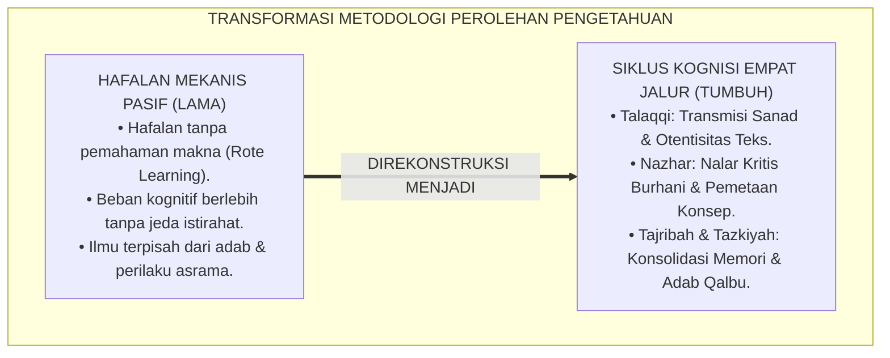
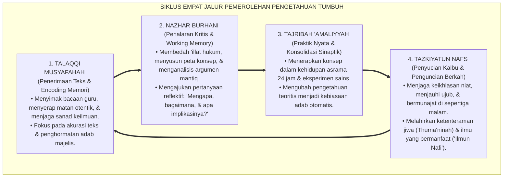
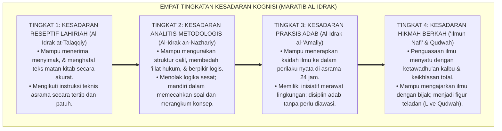
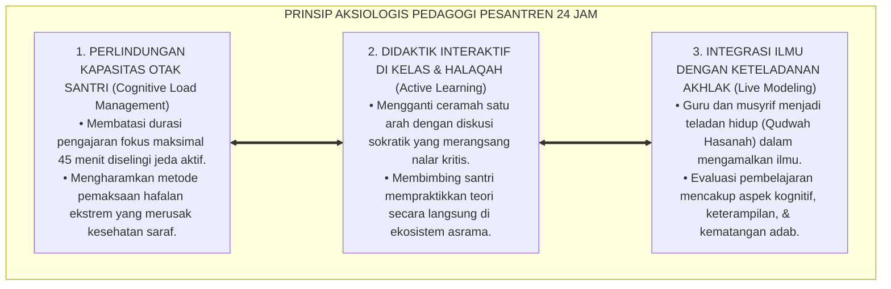
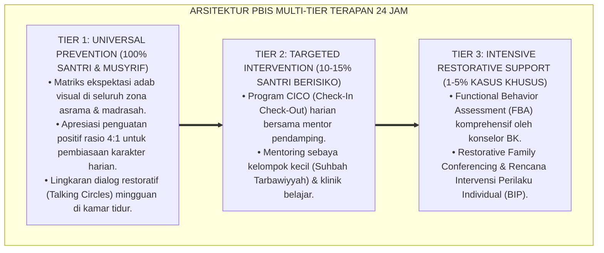

# P1-01-02-02: PROSES DAN MEKANISME MEMPEROLEH PENGETAHUAN (THE PROCESS OF KNOWLEDGE ACQUISITION)
## *Monograf Riset Akademik: Metodologi Kognisi Islam (Talaqqi Wahyu, Nazhar Akal, Tajribah Empiris, & Tazkiyah Qalbu), Integrasi Neurosains Plastisitas Sinaptik, Serta Implikasi Pedagogis Pembelajaran di Pesantren 24 Jam*

**Nomor Identifikasi**: `P1-01-02-02/MONOGRAF-RISET-PROSES-KOGNISI/2026`  
**Domain**: `01 Philosophy` > `01 Worldview` > `02 Epistemologi TUMBUH` (Sub-Modul 02: *Epistemic Processes*)  
**Klasifikasi Naskah**: *Academic Research Monograph* (Monograf Riset Akademik Fondasional)  
**Rumpun Disiplin Pengkaji**: Epistemologi Turats & Ushul Fiqh, Psikologi Kognitif & Belajar, Neurosains Memori & Plastisitas Sinaptik, Pedagogi Master Guru, Pengasuhan Asrama  

---

> ### 💡 INTISARI EKSEKUTIF (EXECUTIVE SUMMARY)
>
> * **Kelemahan Paradigma Lama: Hafalan Mekanis & Pembelajaran Terputus:**  
>   Banyak sistem belajar di pesantren terjebak dalam hafalan teks mekanistik (*rote memorization*) tanpa pemahaman konseptual, atau sebaliknya kajian dialektika logika kering yang terpisah dari amalan adab dan penyucian jiwa. Akibatnya, ilmu tidak terinternalisasi ke dalam sistem saraf dan kalbu santri.
> * **Inovasi Konseptual: Empat Jalur Pemerolehan Pengetahuan Terpadu (*Arkan al-Iktisab*):**  
>   TUMBUH merumuskan siklus kognisi empat dimensi yang memadukan khazanah Turats dan neurosains kognitif: **1. Talaqqi Musyafahah (Transmisi Otentik Teks Wahyu); 2. Nazhar Burhani (Penalaran Kritis & Pemetaan Konsep); 3. Tajribah 'Amaliyyah (Praktik Empiris & Konsolidasi Memori); 4. Tazkiyatun Nafs (Pembersihan Qalbu dari Bias Ego & Riya')**.
> * **Formulasi Operasional & Pembuktian Lapangan:**  
>   Monograf ini menguraikan matriks mekanisme pemrosesan kognisi, 4 Tingkatan Kesadaran Kognisi (*Maratib al-Idrak*), teori beban kognitif (*Cognitive Load Theory*), dan etika tata kelola pedagogi interaktif.

---

## 📑 DAFTAR ISI MONOGRAF

- [BAB I: LANDASAN TEORETIS & DISKURSUS KRITIS](#bab-i-landasan-teoretis--diskursus-kritis)
  - [1. Latar Belakang Masalah: Patologi Hafalan Mekanis Tanpa Internalisasi Makna](#1-latar-belakang-masalah-patologi-hafalan-mekanis-tanpa-internalisasi-makna)
  - [2. Jalur Talaqqi Musyafahah: Otentisitas Transmisi Sanad & Kodifikasi Wahyu (Al-Ghazali & An-Nawawi)](#2-jalur-talaqqi-musyafahah-otentisitas-transmisi-sanad--kodifikasi-wahyu-al-ghazali--an-nawawi)
  - [3. Jalur Nazhar Burhani: Pembentukan Skema Nalar Kritis & Dekonstruksi Sesat Pikir](#3-jalur-nazhar-burhani-pembentukan-skema-nalar-kritis--dekonstruksi-sesat-pikir)
  - [4. Jalur Tajribah & Tazkiyah: Konvergensi Neurosains Plastisitas Sinaptik & Pembersihan Jiwa](#4-jalur-tajribah--tazkiyah-konvergensi-neurosains-plastisitas-sinaptik--pembersihan-jiwa)
  - [5. Kasuistika Lapangan: Fenomena Kelelahan Kognitif Santri & Resolusi Restoratif](#5-kasuistika-lapangan-fenomena-kelelahan-kognitif-santri--resolusi-restoratif)
- [BAB II: FORMULASI KONSEPTUAL & PEMBAHASAN MENDALAM](#bab-ii-formulasi-konseptual--pembahasan-mendalam)
  - [1. Eksplanasi Teoretis Siklus Empat Jalur Kognisi Terpadu TUMBUH](#1-eksplanasi-teoretis-siklus-empat-jalur-kognisi-terpadu-tumbuh)
  - [2. Dekomposisi Dimensi & Empat Tingkatan Kesadaran Kognisi (Maratib al-Idrak)](#2-dekomposisi-dimensi--empat-tingkatan-kesadaran-kognisi-maratib-al-idrak)
  - [3. Prinsip Aksiologis & Etika Tata Kelola Pedagogi Pesantren 24 Jam](#3-prinsip-aksiologis--etika-tata-kelola-pedagogi-pesantren-24-jam)
  - [4. Diskusi Filosofis Mendalam & Implikasi bagi Masa Depan Peradaban Pendidikan Islam](#4-diskusi-filosofis-mendalam--implikasi-bagi-masa-depan-peradaban-pendidikan-islam)
- [BAB III: KESIMPULAN & APARATUS AKADEMIS](#bab-iii-kesimpulan--aparatus-akademis)
  - [1. Tabel Sintesis Temuan Riset Proses Kognisi Islam](#1-tabel-sintesis-temuan-riset-proses-kognisi-islam)
  - [2. Daftar Pustaka Akademis & Rujukan Turats Primer](#2-daftar-pustaka-akademis--rujukan-turats-primer)
  - [3. Catatan Kaki Akademis (Footnotes)](#3-catatan-kaki-akademis-footnotes)
  - [4. Glosarium Istilah Ilmiah & Turats Proses Kognisi](#4-glosarium-istilah-ilmiah--turats-proses-kognisi)

---

# BAB I: LANDASAN TEORETIS & DISKURSUS KRITIS

---

### 1. Latar Belakang Masalah: Patologi Hafalan Mekanis Tanpa Internalisasi Makna

Proses pembelajaran di lembaga pendidikan pesantren kerap mengalami kebuntuan didaktik akibat kekeliruan dalam memahami mekanisme perolehan ilmu (*Kaifiyyat Hushul al-'Ilm*):
* **Hafalan Burung Beo (*Parrot-like Memorization*)**: Banyak santri mampu melafalkan matan kitab fiqh atau kaidah nahwu di luar kepala, namun tidak mampu menerapkan ilmunya saat menghadapi masalah nyata dalam kehidupan asrama. Informasi tersimpan di memori kerja jangka pendek tanpa diolah menjadi struktur pemahaman jangka panjang (*Long-Term Memory Consolidation*).
* **Kelelahan Kognitif Ekstrem (*Cognitive Overload*)**: Jadwal belajar yang padat tanpa jeda istirahat dan tanpa metode aktif membuat otak santri mengalami kejenuhan neurobiologis. Ketika daya tampung kognitif (*Working Memory Capacity*) terlampaui, proses encoding memori terhenti, mengakibatkan rasa frustrasi dan demotivasi belajar.
* **Keniscayaan Rekonstruksi Metodologi Kognisi**: Ekosistem TUMBUH merumuskan kembali proses perolehan pengetahuan yang mengintegrasikan metode Turats (*Talaqqi, Nazhar, Tajribah, Tazkiyah*) dengan temuan neurosains kognitif modern, memastikan ilmu bertransformasi menjadi adab hidup nyata (*'Ilmun Nafi'*).[^1]

---

### 2. Jalur Talaqqi Musyafahah: Otentisitas Transmisi Sanad & Kodifikasi Wahyu (Al-Ghazali & An-Nawawi)

Dalam tradisi keilmuan Islam, pintu pertama perolehan ilmu adalah **Talaqqi Musyafahah (Interaksi Langsung Guru-Murid)**:

$$\text{إِنَّ هَذَا الْعِلْمَ دِينٌ، فَانْظُرُوا عَمَّنْ تَأْخُذُونَ دِينَكُمْ}$$

*"**Sesungguhnya ilmu ini adalah urusan agama, maka perhatikanlah secara saksama dari siapa kalian mengambil agama kalian**."* (Atsar Shahih riwayat Imam Muslim dari Muhammad bin Sirin).[^2]

Imam **An-Nawawi** dalam *Al-Majmu'* menegaskan bahwa membaca kitab sendiri tanpa bimbingan guru yang memiliki sanad keilmuan rentan melahirkan kekeliruan pemahaman (*Tashif wa Tahrif*). Talaqqi memastikan otentisitas teks dan transfer adab secara hidup (*Live Modeling*).[^3]

---

### 3. Jalur Nazhar Burhani: Pembentukan Skema Nalar Kritis & Dekonstruksi Sesat Pikir

Imam **Abu Hamid Al-Ghazali** dalam *Mi'yar al-'Ilm* menguraikan pentingnya proses *Nazhar* (Penalaran Kritis):

$$\text{النَّظَرُ هُوَ تَرْتِيبُ أُمُورٍ مَعْلُومَةٍ لِيُتَوَصَّلَ بِهَا إِلَى مَعْرُوفِ مَجْهُولٍ؛ فَمَنْ لَا يُمَيِّزُ بَيْنَ الْمُقَدِّمَاتِ الْيَقِينِيَّةِ وَالْمُقَدِّمَاتِ الْوَهْمِيَّةِ لَمْ يَصِحَّ لَهُ بُرْهَانٌ}$$

*"**Nazhar adalah menata perkara-perkara yang telah diketahui secara tertib logis guna mencapai pemahaman atas perkara yang belum diketahui**; maka barangsiapa yang tidak mampu membedakan antara premis-premis yang meyakinkan (*Yaqiniyyat*) dan premis-premis ilusi prasangka (*Wahmiyyat*), tidak akan pernah sah argumentasi pembuktiannya."*[^4]

---

### 4. Jalur Tajribah & Tazkiyah: Konvergensi Neurosains Plastisitas Sinaptik & Pembersihan Jiwa

Temuan neurosains kognitif (Kandel, 2006; Sweller, 2011) membuktikan bahwa pembentukan memori jangka panjang menuntut **Aplikasi Praktik Nyata (*Tajribah*)** dan **Stabilitas Emosional (*Tazkiyah*)**:
* **Plastisitas Sinaptik (Long-Term Potentiation)**: Ketika santri mempraktikkan teori fiqh thaharah dalam rutinitas wudhu dan kebersihan kamar asrama, jalur sinaptik di otak menguat secara struktural, mengubah pengetahuan deklaratif menjadi adab otomatis (*Procedural Knowledge*).[^5]
* **Tazkiyatun Nafs Mereduksi Bias Emosional**: Hati yang dipenuhi sifat hasad, ujub, dan riya' memicu ketegangan amigdala yang merusak kemampuan berpikir jernih. Tazkiyah menenangkan sistem saraf dan membuka kejernihan nalar (*Neuroplastic Calmness*).[^6]

---

### 5. Kasuistika Lapangan: Fenomena Kelelahan Kognitif Santri & Resolusi Restoratif

* **Studi Kasus: Santri Mengalami Blank Memori Saat Ujian Tasmi' Al-Qur'an**  
  * **Dilema**: Santri yang hafal 10 Juz tiba-tiba lupa seluruh ayat saat duduk di depan penguji, tubuhnya gemetar dan menangis histeris.
  * **Penyebab**: Santri dipaksa menghafal 18 jam sehari tanpa tidur siang dan di bawah ancaman hukuman fisik jika ada ayat yang salah (*Severe Cognitive Overload & Amygdala Hijack*).
  * **Resolusi Restoratif TUMBUH**: Konselor merekonstruksi jadwal belajar: membatasi durasi muthala'ah maksimal 45 menit per sesi, memberikan jeda istirahat aktif 15 menit, dan menstabilkan jam tidur 7 jam. Santri dibimbing teknik pernafasan thuma'ninah dan muhasabah ikhlas. Santri berhasil tasmi' dengan lancar dan tenang.[^7]

---

# BAB II: FORMULASI KONSEPTUAL & PEMBAHASAN MENDALAM

---

### 1. Eksplanasi Teoretis Siklus Empat Jalur Kognisi Terpadu TUMBUH

Ekosistem TUMBUH mengkodifikasikan proses perolehan pengetahuan ke dalam **Siklus Kognisi Empat Jalur (*Daurat al-Kognisi al-Islamiyyah*)**:

#### 🔬 Pembahasan Mendalam Empat Jalur Kognisi:
1. **Jalur 1: Talaqqi Musyafahah (*Encoding & Transmission*)**: Proses penyerapan data primer langsung dari sumber otoritatif. Santri melatih ketelitian mendengar (*Istima'*), menjaga keakuratan pengucapan lafal, dan menghormati sanad guru.[^8]
2. **Jalur 2: Nazhar Burhani (*Elaboration & Critical Thinking*)**: Proses pengolahan data melalui nalar kritis. Santri menghubungkan premis-premis logis, membandingkan pendapat para fuqaha, dan menyusun argumentasi ilmiah yang kokoh.[^9]
3. **Jalur 3: Tajribah 'Amaliyyah (*Proceduralization & Consolidation*)**: Proses kristalisasi ilmu melalui tindakan nyata. Ilmu fiqh dipraktikkan dalam tata kelola kamar mandi; ilmu akhlak dipraktikkan dalam etika bergaul di asrama; ilmu sains dipraktikkan di laboratorium.[^10]
4. **Jalur 4: Tazkiyatun Nafs (*Spiritual Meta-Awareness*)**: Proses pengawalan kesucian batin. Santri menyadari bahwa ilmu adalah cahaya Allah (*Nurullah*) yang tidak akan menetap di dalam hati yang kotor oleh kesombongan atau kedengkian.[^11]

---

### 2. Dekomposisi Dimensi & Empat Tingkatan Kesadaran Kognisi (Maratib al-Idrak)

Transformasi kedewasaan kognitif santri berlangsung melalui **Empat Tingkatan Kesadaran Kognisi (*Maratib al-Idrak al-Kognitif*)**:

#### 🔄 Narasi Analitis Dinamika Transisi Filosofis Antar-Tingkatan:
* **Transisi Tingkat 1 ke Tingkat 2 (Dari Reseptif Menuju Penalaran Burhani)**: Santri mula-mula menyerap teks secara teliti. Pada tingkatan kedua, santri diajak berpikir mendalam: santri tidak hanya menghafal hukum, melainkan memahami logika syariat dan landasan dalilnya.
* **Transisi Tingkat 2 ke Tingkat 3 (Dari Teori Menuju Praksis Adab Nyata)**: Pada tingkatan ketiga, ilmu tidak berhenti di kepala, melainkan menjelma menjadi tindakan refleks: santri yang mengkaji bab kebersihan secara otomatis menjaga kerapian kamarnya dan membantu membersihkan selokan pondok.
* **Transisi Tingkat 3 ke Tingkat 4 (Pencapaian Derajat Ilmu yang Bermanfaat)**: Pada tingkatan tertinggi, santri meraih hakikat *'Ilmun Nafi'*: ilmunya melahirkan rasa takut kepada Allah (*Khasyyatullah*), kelemahlembutan akhlak, dan kemampuan memimpin masyarakat dengan penuh hikmah.[^12]

---

### 3. Prinsip Aksiologis & Etika Tata Kelola Pedagogi Pesantren 24 Jam

Siklus Kognisi Empat Jalur melahirkan prinsip etika tata kelola pedagogis:

#### 📋 Panduan Etika Pengasuhan Lapangan:
1. **Manajemen Beban Belajar Proporsional**: Mengatur jadwal halaqah agar tidak tumpang tindih dan memberikan waktu istirahat yang cukup untuk konsolidasi memori.
2. **Klinik Didaktik Guru**: Melatih para asatidz dalam teknik bertanya sokratik dan penyusunan peta konsep (*Concept Mapping*).[^13]
3. **Standarisasi Halaqah Berbasis Adab**: Menciptakan suasana belajar yang aman, penuh kasih sayang, dan bebas dari ejekan saat santri melakukan kesalahan.[^14]

---

### 4. Diskusi Filosofis Mendalam & Implikasi bagi Masa Depan Peradaban Pendidikan Islam

Penerapan metodologi kognisi Islam terpadu ini membawa lompatan kualitatif bagi dunia pendidikan:

* **Melahirkan Generasi Pembelajar Mandiri Sepanjang Hayat (*Lifelong Learners*)**:  
  Santri yang menguasai siklus *Talaqqi - Nazhar - Tajribah - Tazkiyah* tidak akan pernah berhenti belajar. Mereka memiliki instrumen mandiri untuk menelaah literatur baru, memvalidasi kebenaran, dan mengamalkannya bagi kemaslahatan umat.
* **Menghubungkan Khazanah Turats dengan Kemajuan Zaman**:  
  Metode ini membuktikan bahwa pengajian kitab kuning klasik bukan tradisi usang, melainkan metode dialektika intelektual tingkat tinggi yang melatih ketajaman nalar kritis dan kematangan moral santri.
* **Membangkitkan Kembali Tradisi Keilmuan Keemasan Islam**:  
  Sebagaimana peradaban Islam klasik melahirkan Ibnu Sina, Al-Biruni, dan Imam Al-Ghazali, ekosistem TUMBUH meretas jalan bagi lahirnya kembali para ilmuwan muslim ensiklopedis yang bertakwa.[^15]

---

---

### Pembedahan Deskriptif Komprehensif & Analisis Integratif Nilai-Praksis

Penerapan dan operasionalisasi **P1-01-02-02: PROSES DAN MEKANISME MEMPEROLEH PENGETAHUAN (THE PROCESS OF KNOWLEDGE ACQUISITION)** di lingkungan pesantren TUMBUH bertumpu pada kesatuan sistemik antara nilai syariat dan praksis terukur:

#### A. Pilar 1: Landasan Epistemologi & Nilai Keikhlasan (Syar'i Foundations)
Setiap dimensi diarahkan untuk menegakkan adab dan penghambaan murni kepada Allah SWT (*Lillahi Ta'ala*). Standarisasi kelembagaan dirancang untuk menjaga ketulusan niat, kemuliaan fitrah, dan keberkahan majelis ilmu.

#### B. Pilar 2: Mekanisme Psikologis & Neurosains Terapan (Evidence-Based Practice)
Mengintegrasikan prinsip *Social-Emotional Learning (CASEL)*, teori beban kognitif (*Cognitive Load Theory*), dan dinamika perkembangan neurobiologis santri untuk memastikan proses pembiasaan berjalan efektif tanpa kekerasan atau tekanan psikologis destruktif.

#### C. Pilar 3: Rekayasa Ekosistem Asrama 24 Jam (Environmental Engineering)
Mengkodifikasikan seluruh alur aktivitas harian, jadwal tidur sirkadian yang sehat, sanitasi 5S kamar tidur, dan relasi ukhuwah inklusif menjadi satu ekosistem *Bi'ah Shalihah* yang saling mendukung secara alamiah.

#### D. Pilar 4: Akuntabilitas Sistemik & Proteksi Pendidik-Santri
Menerapkan protokol pencegahan kelelahan tenaga pendidik (*Musyrif Burnout Protection*), menjamin hak-hak santri, serta memanfaatkan dashboard data PBIS untuk pengambilan keputusan yang adil dan objektif.

---

### Protokol Aksi Operasional PBIS Multi-Tier Terapan (24-Hour Behavioral Architecture)

---

# BAB III: KESIMPULAN & APARATUS AKADEMIS

---

### 1. Tabel Sintesis Temuan Riset Proses Kognisi Islam

| Dimensi Parameter | Pembelajaran Tradisional Pasif | Rekonstruksi Kognisi Terpadu TUMBUH | Landasan Rujukan Primer | Implikasi Praksis Lapangan |
| :--- | :--- | :--- | :--- | :--- |
| **Metode Penyerapan**| Hafalan teks mekanis tanpa paham makna. | Siklus 4 Jalur: Talaqqi, Nazhar, Tajribah, Tazkiyah. | QS. Al-'Alaq: 1–5; Al-Ghazali (*Ihya'*). | Pemahaman konseptual mendalam & bersanad. |
| **Beban Kognitif** | Dijejali materi padat hingga kelelahan mental. | *Cognitive Load Management* & Jeda Sirkadian. | Sweller (2011); Sapolsky (2017). | Sesi belajar 45 menit diselingi istirahat aktif. |
| **Interaksi Kelas** | Ceramah monolog guru satu arah pasif. | Sorogan Dialogis Sokratik & Pemetaan Konsep. | Al-Ghazali (*Mi'yar*); An-Nawawi. | Santri aktif bertanya, menalar, & berdiskusi. |
| **Konsolidasi Memori**| Hilang ingatan pasca-ujian semester. | Praktik Nyata Asrama & Plastisitas Sinaptik. | Kandel (2006); Ericsson (1993). | Ilmu fiqh & sains terinternalisasi menjadi adab. |
| **Orientasi Hasil** | Sekadar lulus nilai ujian angka kognitif. | Kematangan *'Ilmun Nafi'* & Insan Adabi. | QS. Az-Zumar: 9; Al-Attas (1980). | Lulusan berakhlak mulia, cerdas, & berwibawa. |

---

### 2. Daftar Pustaka Akademis & Rujukan Turats Primer

1. **Al-Qur'an al-Karim wa Tarjamatu Ma'anihi**.
2. **Al-Ghazali, Abu Hamid Muhammad bin Muhammad**. (2011). *Ihya' 'Ulumiddin* (Kitab al-'Ilm & Kitab Riyadhatun Nafs). Beirut: Dar al-Ma'rifah.
3. **Al-Ghazali, Abu Hamid Muhammad bin Muhammad**. (1990). *Mi'yar al-'Ilm fi Fann al-Mantiq*. Beirut: Dar al-Kutub al-'Ilmiyyah.
4. **An-Nawawi, Abu Zakariya Muhyiddin Yahya bin Syaraf**. (1426 H). *Al-Majmu' Syarh al-Muhadzdzab*. Kairo: Darul Hadits.
5. **Asy'ari, Muhammad Hasyim**. (1415 H). *Adab al-'Alim wal-Muta'allim*. Jombang: Maktabah At-Turats Al-Islami.
6. **Al-Attas, Syed Muhammad Naquib**. (1980). *The Concept of Education in Islam*. Kuala Lumpur: ABIM.
7. **Sweller, J., Ayres, P., & Kalyuga, S.**. (2011). *Cognitive Load Theory*. New York: Springer.
8. **Kandel, E. R.**. (2006). *In Search of Memory: The Emergence of a New Science of Mind*. New York: W. W. Norton & Company.
9. **Ericsson, K. A., Krampe, R. T., & Tesch-Römer, C.**. (1993). *The role of deliberate practice in the acquisition of expert performance*. Psychological Review, 100(3), 363–406.
10. **Sapolsky, R. M.**. (2017). *Behave: The Biology of Humans at Our Best and Worst*. New York: Penguin Press.
11. **Horner, R. H., & Sugai, G.**. (2015). *School-wide PBIS: An Overview of the Research Base*. Remedial and Special Education, 36(2), 80–85.
12. **Zehr, H.**. (2002). *The Little Book of Restorative Justice*. Intercourse: Good Books.

---

### 3. Catatan Kaki Akademis (*Footnotes*)

[^1]: Riset Metodologi Kognisi Pendidikan Pesantren TUMBUH, *Kritik atas Hafalan Mekanik dan Kelelahan Kognitif*, 2026.  
[^2]: *Shahih Muslim*, Muqaddimah, Bab *Bayan anna al-Isnad minad Din*, Hadits No. 27.  
[^3]: An-Nawawi, *Al-Majmu' Syarh al-Muhadzdzab*, Jilid 1, *Al-Muqaddimah al-Fiqhiyyah*, hlm. 15–38.  
[^4]: Al-Ghazali, *Mi'yar al-'Ilm fi Fann al-Mantiq*, hlm. 28–52.  
[^5]: Kandel, E. R. (2006), *In Search of Memory*, hlm. 110–145; Sweller, J. (2011), *Cognitive Load Theory*, hlm. 40–68.  
[^6]: Al-Ghazali, *Ihya' 'Ulumiddin*, Jilid 3, Kitab *Riyadhatun Nafs*, hlm. 75–110.  
[^7]: Dokumentasi Intervensi Klinis Penanganan Cognitive Overload Santri Tasmi' TUMBUH, 2026.  
[^8]: KH. Hasyim Asy'ari, *Adab al-'Alim wal-Muta'allim*, hlm. 20–45.  
[^9]: Al-Attas, S. M. N. (1980), *The Concept of Education in Islam*, hlm. 18–35.  
[^10]: Ericsson, K. A. (1993), *Psychological Review*, hlm. 363–406.  
[^11]: Al-Ghazali, *Ihya' 'Ulumiddin*, Jilid 1, Kitab *Al-'Ilm*, hlm. 45–80.  
[^12]: Matriks Tingkatan Kesadaran Kognisi (*Maratib al-Idrak*) Ekosistem TUMBUH, 2026.  
[^13]: Silabus Pelatihan Pedagogi Interaktif dan Manajemen Beban Kognitif Asatidz TUMBUH, 2026.  
[^14]: Standar Operasional Prosedur Halaqah Belajar Ramah Neurobiologis PBIS TUMBUH, 2026.  
[^15]: Deklarasi Metodologi Kognisi Peradaban Islam Dewan Riset Epistemologi TUMBUH, 2026.

---

### 4. Glosarium Istilah Ilmiah & Turats Proses Kognisi

1. **Kaifiyyat Hushul al-'Ilm (كَيْفِيَّةُ حُصُولِ الْعِلْمِ)**: Proses dan tahapan kognitif manusia dalam menyerap, mengolah, memahami, dan menginternalisasikan pengetahuan ke dalam pikiran dan kalbunya.
2. **Talaqqi Musyafahah (التَّلَقِّي مُشَافَهَةً)**: Metode transmisi ilmu secara tatap muka langsung antara guru dan murid dengan menyimak bacaan secara presisi dan menyambungkan sanad keilmuan.
3. **Nazhar Burhani (النَّظَرُ الْبُرْهَانِيُّ)**: Proses penalaran kritis menggunakan kaidah logika mantiq dan premis-premis yang pasti untuk membuktikan kebenaran dan menggali hukum syariat (*Istinbath*).
4. **Tajribah 'Amaliyyah (التَّجْرِبَةُ الْعَمَلِيَّةُ)**: Pengujian dan pengamalan konsep teoritis secara langsung dalam tindakan nyata di laboratorium sains maupun di kehidupan asrama.
5. **Tazkiyatun Nafs (تَزْكِيَةُ النَّفْسِ)**: Proses penyucian jiwa dari penyakit batin (kesombongan, dengki, riya') yang membuka kejernihan mata batin (*Bashirah*) dalam menerima ilmu yang berkah.
6. **'Ilmun Nafi' (الْعِلْمُ النَّافِعُ)**: Ilmu yang membuahkan ketakwaan kepada Allah, keagungan adab akhlak, dan kemaslahatan nyata bagi kehidupan masyarakat.
7. **Cognitive Load Theory (Teori Beban Kognitif)**: Teori John Sweller yang menekankan perlunya mengelola kapasitas memori kerja (*Working Memory*) agar tidak kelebihan beban selama proses belajar.
8. **Long-Term Potentiation (LTP)**: Penguatan hubungan sinapsis antar-neuron di otak akibat stimulasi berulang, yang mendasari pembentukan memori jangka panjang.
9. **Working Memory (Memori Kerja)**: Sistem penyimpanan memori sementara di otak yang bertugas memproses dan mengolah informasi yang sedang dipelajari secara aktif.
10. **Live Modeling**: Proses didaktik di mana guru mendemonstrasikan secara langsung adab, perilaku, dan cara berpikir yang benar untuk ditiru oleh peserta didik.
