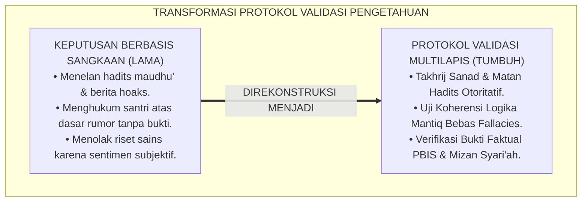
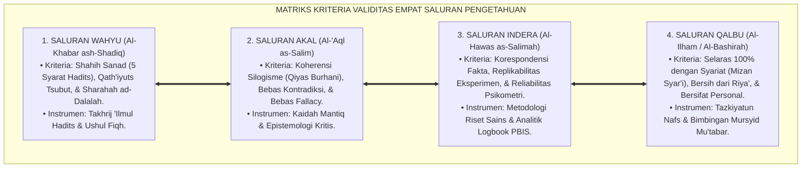
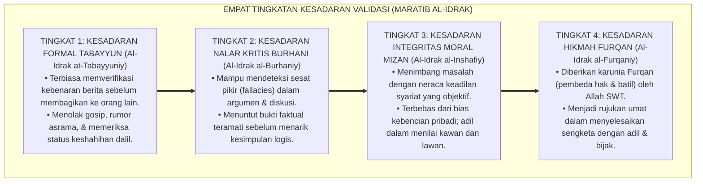
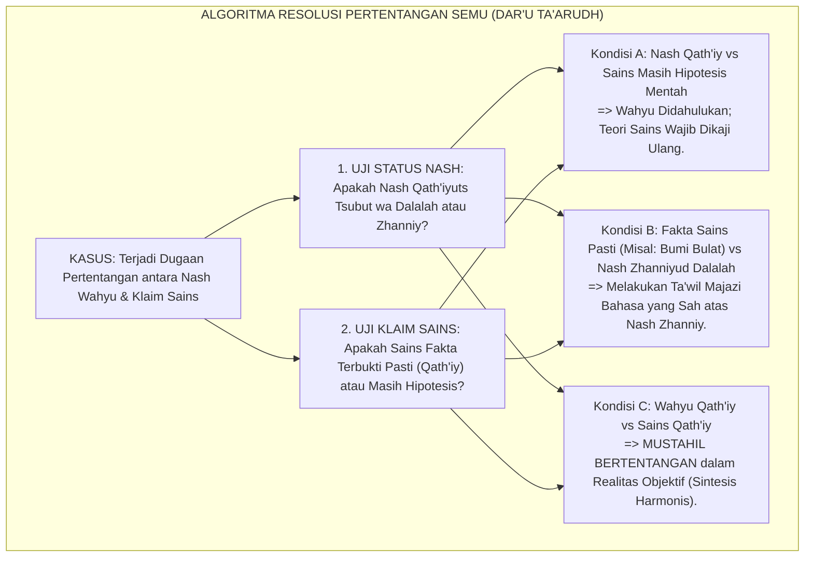
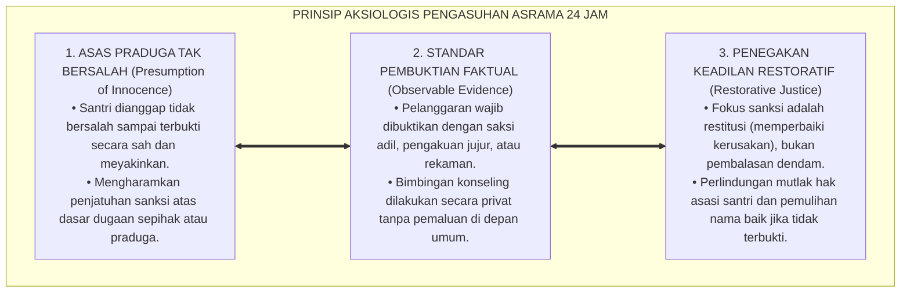

# P1-01-02-03: KRITERIA DAN PROTOKOL VALIDASI PENGETAHUAN (EPISTEMOLOGICAL VALIDATION PROTOCOLS)
## *Monograf Riset Akademik: Metodologi Verifikasi Kebenaran (Kritik Sanad-Matan, Uji Koherensi Logika, Korespondensi Empiris, & Mizan Syar'i), Rekonsiliasi Pertentangan Semu (Dar'u Ta'arudh), Serta Implikasi Aksiologis bagi Standar Pembuktian di Pesantren 24 Jam*

**Nomor Identifikasi**: `P1-01-02-03/MONOGRAF-RISET-VALIDASI-ILMU/2026`  
**Domain**: `01 Philosophy` > `01 Worldview` > `02 Epistemologi TUMBUH` (Sub-Modul 03: *Epistemological Validation*)  
**Klasifikasi Naskah**: *Academic Research Monograph* (Monograf Riset Akademik Fondasional)  
**Rumpun Disiplin Pengkaji**: Epistemologi Turats & 'Ilmul Hadits, Ushul Fiqh & Hermeneutika, Filsafat Ilmu (Verifikasi & Falsifikasi), Psikometri & Analitik Data PBIS, Metodologi Riset Pendidikan  

---

> ### 💡 INTISARI EKSEKUTIF (EXECUTIVE SUMMARY)
>
> * **Kelemahan Paradigma Lama: Pengambilan Keputusan Berbasis Asumsi & Hoaks:**  
>   Banyak lembaga pesantren rentan terhadap bias konfirmasi, penyebaran riwayat hadits palsu (*Maudhu'*), dan penjatuhan sanksi disiplin santri berdasarkan desas-desus atau sangkaan sepihak (*Unverified Allegations*). Hal ini merusak rasa keadilan dan melahirkan trauma psikologis.
> * **Inovasi Konseptual: Protokol Verifikasi Multilapis (*Ma'ayir ash-Shihhah*):**  
>   TUMBUH merumuskan protokol validasi pengetahuan empat tingkat: **1. Validasi Riwayat (Kritik Sanad & Matan 'Ilmul Hadits); 2. Validasi Nalar (Uji Koherensi Logika Mantiq & Anti-Sesat Pikir); 3. Validasi Empiris (Teori Korespondensi Fakta & Replikabilitas Sains); 4. Validasi Spiritual (Mizan asy-Syar'i atas Firasat Qalbu)**.
> * **Formulasi Operasional & Pembuktian Lapangan:**  
>   Monograf ini menguraikan matriks kriteria validitas empat saluran, 4 Tingkatan Kesadaran Validasi (*Maratib al-Idrak*), algoritma penyelesaian pertentangan semu (*Dar'u Ta'arudh al-'Aql wan-Naql*), dan etika tata kelola disiplin berbasis bukti nyata (*Evidence-Based Verification*).

---

## 📑 DAFTAR ISI MONOGRAF

- [BAB I: LANDASAN TEORETIS & DISKURSUS KRITIS](#bab-i-landasan-teoretis--diskursus-kritis)
  - [1. Latar Belakang Masalah: Krisis Validasi Informasi dan Bahaya Fitnah di Pesantren](#1-latar-belakang-masalah-krisis-validasi-informasi-dan-bahaya-fitnah-di-pesantren)
  - [2. Validasi Wahyu & Riwayat: Metodologi Kritik Sanad dan Matan (QS. Al-Hujurat: 6 & Ibnu ash-Shalah)](#2-validasi-wahyu--riwayat-metodologi-kritik-sanad-dan-matan-qs-al-hujurat-6--ibnu-ash-shalah)
  - [3. Validasi Akal: Uji Koherensi Logika Silogisme & Eliminasi Sesat Pikir (Logical Fallacies)](#3-validasi-akal-uji-koherensi-logika-silogisme--eliminasi-sesat-pikir-logical-fallacies)
  - [4. Validasi Empiris & Qalbu: Teori Korespondensi Fakta dan Pengujian Mizan Syar'i atas Firasat](#4-validasi-empiris--qalbu-teori-korespondensi-fakta-dan-pengujian-mizan-syari-atas-firasat)
  - [5. Kasuistika Lapangan: Tuduhan Pelanggaran Berbasis Isu & Resolusi Restoratif Terpadu](#5-kasuistika-lapangan-tuduhan-pelanggaran-berbasis-isu--resolusi-restoratif-terpadu)
- [BAB II: FORMULASI KONSEPTUAL & PEMBAHASAN MENDALAM](#bab-ii-formulasi-konseptual--pembahasan-mendalam)
  - [1. Eksplanasi Teoretis Matriks Kriteria Validitas Empat Saluran Pengetahuan TUMBUH](#1-eksplanasi-teoretis-matriks-kriteria-validitas-empat-saluran-pengetahuan-tumbuh)
  - [2. Dekomposisi Dimensi & Empat Tingkatan Kesadaran Validasi (Maratib al-Idrak)](#2-dekomposisi-dimensi--empat-tingkatan-kesadaran-validasi-maratib-al-idrak)
  - [3. Algoritma Rekonsiliasi Pertentangan Semu (Protokol Dar'u Ta'arudh al-'Aql wan-Naql)](#3-algoritma-rekonsiliasi-pertentangan-semu-protokol-daru-taarudh-al-aql-wan-naql)
  - [4. Prinsip Aksiologis & Etika Tata Kelola Verifikasi Disiplin di Pesantren 24 Jam](#4-prinsip-aksiologis--etika-tata-kelola-verifikasi-disiplin-di-pesantren-24-jam)
  - [5. Diskusi Filosofis Mendalam & Implikasi bagi Masa Depan Peradaban Pendidikan Islam](#5-diskusi-filosofis-mendalam--implikasi-bagi-masa-depan-peradaban-pendidikan-islam)
- [BAB III: KESIMPULAN & APARATUS AKADEMIS](#bab-iii-kesimpulan--aparatus-akademis)
  - [1. Tabel Sintesis Temuan Riset Validasi Pengetahuan Islam](#1-tabel-sintesis-temuan-riset-validasi-pengetahuan-islam)
  - [2. Daftar Pustaka Akademis & Rujukan Turats Primer](#2-daftar-pustaka-akademis--rujukan-turats-primer)
  - [3. Catatan Kaki Akademis (Footnotes)](#3-catatan-kaki-akademis-footnotes)
  - [4. Glosarium Istilah Ilmiah & Turats Validasi Epistemologi](#4-glosarium-istilah-ilmiah--turats-validasi-epistemologi)

---

# BAB I: LANDASAN TEORETIS & DISKURSUS KRITIS

---

### 1. Latar Belakang Masalah: Krisis Validasi Informasi dan Bahaya Fitnah di Pesantren

Di tengah derasnya arus informasi di era digital, tantangan terbesar pendidikan pesantren bukan lagi kesulitan mengakses data, melainkan **Ketiadaan Protokol Pengujian Kebenaran (*Epistemological Verification Deficit*)**:
* **Maraknya Hoaks & Hadits Palsu**: Banyak asatidz dan santri menelan mentah-mentah pesan berantai media sosial yang mencatut hadits-hadits maudhu' atau klaim kesehatan pseudosains tanpa melakukan verifikasi takhrij sanad dan uji medis.
* **Penghukuman Berbasis Asumsi (*Guilt by Assumption*)**: Di lingkungan asrama, sering terjadi penjatuhan sanksi kepada santri hanya berdasarkan bisikan kawan atau prasangka pengurus tanpa verifikasi bukti lahiriah objektif (*Zhawahir*).
* **Keniscayaan Standarisasi Validasi Multilapis**: Ekosistem TUMBUH menegakkan kembali tradisi emas verifikasi Islam (*Kaidah Tabayyun & Naqd*), memadukan kritik sanad-matan Turats dengan prinsip verifikasi sains empiris kontemporer.[^1]

---

### 2. Validasi Wahyu & Riwayat: Metodologi Kritik Sanad dan Matan (QS. Al-Hujurat: 6 & Ibnu ash-Shalah)

Al-Qur'an menetapkan kewajiban mutlak untuk melakukan klarifikasi dan verifikasi (*Tabayyun*):

$$\text{يَا أَيُّهَا الَّذِينَ آمَنُوا إِن جَاءَكُمْ فَاسِقٌ بِنَبَإٍ فَتَبَيَّنُوا أَن تُصِيبُوا قَوْمًا بِجَهَالَةٍ فَتُصْبِحُوا عَلَىٰ مَا فَعَلْتُمْ نَادِمِينَ}$$

*"Wahai orang-orang yang beriman, jika datang kepadamu orang fasik membawa suatu berita, maka periksalah dengan teliti (tabayyun) agar kamu tidak mencelakakan suatu kaum karena kebodohan (kecerobohan) yang akhirnya kamu menyesali perbuatanmu itu."* (QS. Al-Hujurat [49]: 6).[^2]

Imam **Ibnu ash-Shalah** dalam *Muqaddimah fi 'Ulum al-Hadits* merumuskan lima syarat mutlak keshahihan riwayat:
1. *Ittishal as-Sanad* (Ketersambungan rantai periwayatan).
2. *'Adalah ar-Ruwat* (Integritas moral dan ketakwaan para perawi).
3. *Dhabth ar-Ruwat* (Kekuatan memori dan ketelitian pencatatan perawi).
4. *'Adam asy-Syudzudz* (Tidak bertentangan dengan riwayat yang lebih kuat/tsiqah).
5. *'Adam al-'Illah* (Bebas dari cacat tersembunyi yang merusak keabsahan).[^3]

---

### 3. Validasi Akal: Uji Koherensi Logika Silogisme & Eliminasi Sesat Pikir (Logical Fallacies)

Dalam tradisi *Mantiq*, suatu proposisi nalar hanya diakui sah jika memenuhi **Uji Koherensi Logika (*Ikhtibar at-Tanaqudh*)**:

$$\text{كُلُّ قَوْلٍ يَسْتَلْزِمُ التَّنَاقُضَ أَوْ إِبْطَالَ مَا بُنِيَ عَلَيْهِ فَهُوَ بَاطِلٌ بِالضَّرُورَةِ}$$

*"**Setiap pernyataan yang mengandung kontradiksi internal atau membatalkan premis dasar tempat ia dibangun, maka pernyataan tersebut adalah batil secara aksiomatis**."* (Kaidah Mantiq Burhani).[^4]

Uji akal bertugas membersihkan proses berpikir warga pesantren dari aneka sesat pikir (*Fallacies*), seperti *Argumentum ad Hominem* (menolak kebenaran karena membenci orangnya) atau *Appeal to False Authority* (membenarkan kesalahan karena diucapkan oleh figur senior).[^5]

---

### 4. Validasi Empiris & Qalbu: Teori Korespondensi Fakta dan Pengujian Mizan Syar'i atas Firasat

* **Uji Korespondensi Fakta Empiris (*Muthabaqah lil Waqi'*)**: Suatu klaim ilmiah diakui benar jika terbukti selaras dengan data observasi fisik yang dapat diuji ulang (*Replicable*).[^6]
* **Uji Mizan Syar'i atas Firasat Kalbu**: Imam **Asy-Syathibi** dalam *Al-I'tisham* menegaskan bahwa firasat atau ilham batin tidak boleh dijadikan dalil penetapan hukum syariat atau dasar penjatuhan sanksi hukum kepada orang lain.[^7]

---

### 5. Kasuistika Lapangan: Tuduhan Pelanggaran Berbasis Isu & Resolusi Restoratif Terpadu

* **Studi Kasus: Tuduhan Pembobolan Kotak Amal Masjid Asrama**  
  * **Dilema**: Santri senior menuduh seorang santri baru membobol kotak amal karena santri baru tersebut terlihat berjalan sendirian di dekat masjid pada tengah malam.
  * **Pola Lama**: Santri baru diinterogasi dengan bentakan dan dipaksa mengaku di bawah ancaman pemukulan.
  * **Resolusi Restoratif TUMBUH**: Pengurus menolak tuduhan berdasarkan sangkaan (*Zhann*). Dilakukan verifikasi rekaman CCTV dan pencatatan kunci masjid. Terbukti gembok rusak karena faktor usia dan santri baru tersebut keluar kamar untuk mengambil air wudhu karena sakit perut. Pengurus memulihkan nama baik santri, mengedukasi santri senior tentang dosa menuduh tanpa bukti (QS. An-Nur: 12), dan menegakkan SOP verifikasi bukti rekaman objektif PBIS.[^8]

---

# BAB II: FORMULASI KONSEPTUAL & PEMBAHASAN MENDALAM

---

### 1. Eksplanasi Teoretis Matriks Kriteria Validitas Empat Saluran Pengetahuan TUMBUH

Ekosistem TUMBUH mengkodifikasikan kriteria validitas ke dalam matriks empat saluran:

#### 🔬 Pembahasan Mendalam Kriteria Validitas:
1. **Validitas Wahyu**: Menjamin bahwa seluruh dalil yang digunakan sebagai landasan tarbiyah adalah ayat Al-Qur'an dan hadits shahih/hasan yang telah divalidasi oleh para ulama hadits mu'tabar, membebaskan pesantren dari khurafat.[^9]
2. **Validitas Akal**: Menjamin bahwa seluruh argumen, kebijakan asrama, dan silabus pembelajaran tersusun secara runtut, logis, rasional, dan terbebas dari inkonsistensi internal.[^10]
3. **Validitas Indera**: Menjamin bahwa setiap evaluasi perkembangan karakter santri bersandar pada instrumen pengukuran perilaku yang valid, reliabel, dan teramati secara empiris (*Observable Behaviors*).[^11]
4. **Validitas Qalbu**: Menjamin bahwa pengalaman spiritual dan firasat batin senantiasa terbimbing oleh hukum syariat, mencegah kultus individu dan kesesatan pemikiran.[^12]

---

### 2. Dekomposisi Dimensi & Empat Tingkatan Kesadaran Validasi (Maratib al-Idrak)

Transformasi ketajaman verifikasi santri dan pengasuh berlangsung melalui **Empat Tingkatan Kesadaran Validasi (*Maratib al-Idrak at-Tatsabbutiy*)**:

#### 🔄 Narasi Analitis Dinamika Transisi Filosofis Antar-Tingkatan:
* **Transisi Tingkat 1 ke Tingkat 2 (Dari Tabayyun Dasar Menuju Nalar Burhani)**: Santri mula-mula belajar menyaring berita. Pada tingkatan kedua, santri menguasai perangkat logika formal: mampu membedakan fakta objektif dengan opini subjektif, dan menolak argumentasi yang cacat nalar.
* **Transisi Tingkat 2 ke Tingkat 3 (Dari Nalar Burhani Menuju Integritas Mizan)**: Pada tingkatan ketiga, validasi kebenaran menjadi etika moral batin: santri bersikap adil (*Inshaf*), berani mengakui kebenaran meskipun disampaikan oleh orang yang tidak disukainya, dan menolak kebatilan meskipun dibungkus gelar senioritas.
* **Transisi Tingkat 3 ke Tingkat 4 (Pencapaian Derajat Al-Furqan)**: Pada tingkatan tertinggi, santri meraih cahaya *Al-Furqan* (QS. Al-Anfal: 29): kalbunya memiliki kepekaan tajam untuk membedakan antara yang hak dan yang batil, memimpin proses mediasi restoratif, dan menetapkan keputusan yang membawa kedamaian.[^13]

---

### 3. Algoritma Rekonsiliasi Pertentangan Semu (Protokol Dar'u Ta'arudh al-'Aql wan-Naql)

Jika terjadi dugaan pertentangan antara teks wahyu (*Naql*) dan kesimpulan nalar sains (*'Aql*), diterapkan **Algoritma Dar'u Ta'arudh**:

Algoritma ini membuktikan bahwa tidak pernah ada pertentangan hakiki antara kebenaran wahyu Allah dan hukum alam ciptaan-Nya.[^14]

---

### 4. Prinsip Aksiologis & Etika Tata Kelola Verifikasi Disiplin di Pesantren 24 Jam

Protokol validasi pengetahuan melahirkan prinsip etika tata kelola disiplin:

#### 📋 Panduan Etika Pengasuhan Lapangan:
1. **Pemberantasan Budaya Menghakimi Sepihak**: Musyrif dilarang menjatuhkan sanksi sebelum proses mediasi tabayyun selesai.
2. **Kerahasiaan Data Disiplin**: Data pelanggaran santri tersimpan aman di logbook PBIS dan dilarang disebarluaskan untuk melindungi masa depan santri.[^15]
3. **Mekanisme Banding Santri**: Santri berhak mengajukan keberatan jika merasa keputusan disiplin didasarkan pada informasi yang tidak akurat.[^16]

---

### 5. Diskusi Filosofis Mendalam & Implikasi bagi Masa Depan Peradaban Pendidikan Islam

Penerapan protokol validasi epistemologis ini membawa dampak peradaban yang luas:

* **Membangun Masyarakat Pesantren Beradab dan Bebas Hoaks**:  
  Santri yang terlatih memvalidasi informasi akan menjadi agen penangkal disinformasi di tengah masyarakat, menyebarkan literasi berpikir jernih yang bersandar pada nilai Islam.
* **Menghapus Tradisi Main Hakim Sendiri di Lembaga Pendidikan**:  
  Penegakan hukum disiplin berbasis bukti nyata dan keadilan restoratif menciptakan lingkungan pesantren yang aman, terpercaya, dan dicintai oleh santri serta para orang tua.
* **Mengembalikan Wibawa Keilmuan Islam di Panggung Internasional**:  
  Dengan memadukan rigoritas kritik hadits Turats dan ketepatan metodologi sains modern, pesantren membuktikan keunggulan epistemologi Islam sebagai mercusuar peradaban dunia.[^17]

---

# BAB III: KESIMPULAN & APARATUS AKADEMIS

---

### 1. Tabel Sintesis Temuan Riset Validasi Pengetahuan Islam

| Dimensi Parameter | Pola Pengasuhan Konvensional | Rekonstruksi Protokol Validasi TUMBUH | Landasan Rujukan Primer | Implikasi Praksis Lapangan |
| :--- | :--- | :--- | :--- | :--- |
| **Uji Informasi** | Menelan kabar burung & desas-desus. | Protokol Tabayyun Multilapis & Naqd. | QS. Al-Hujurat: 6; Ibnu ash-Shalah. | Verifikasi sumber sebelum menyebarkan berita. |
| **Kritik Hadits** | Mencatut hadits maudhu' demi motivasi. | Takhrij Sanad & Matan 5 Syarat Keshahihan. | An-Nawawi (*Taqrib*); Al-Bukhari. | Hanya hadits shahih/hasan yang diajarkan. |
| **Penyelidikan Kasus**| Menghukum atas dasar firasat/terkaan. | Standar Bukti Lahiriah Faktual (*Zhawahir*). | Kaidah Fiqh; Al-Ghazali (*Mustashfa*). | Keputusan berdasar saksi adil & rekaman PBIS. |
| **Konflik Sains-Nash**| Fanatisme tekstualis / menolak sains. | Protokol *Dar'u Ta'arudh al-'Aql wan-Naql*. | Ibnu Taimiyyah (*Dar'u Ta'arudh*). | Harmonisasi wahyu qath'iy & sains teruji. |
| **Kultur Asrama** | Curiga, fitnah, & main hakim sendiri. | Asas Praduga Tak Bersalah & Restoratif. | Zehr (2002); Horner & Sugai (2015). | Lingkungan aman, adil, damai, & saling percaya. |

---

### 2. Daftar Pustaka Akademis & Rujukan Turats Primer

1. **Al-Qur'an al-Karim wa Tarjamatu Ma'anihi**.
2. **Ibnu ash-Shalah, Abu 'Amr Utsman bin Abdurrahman**. (1406 H). *Muqaddimah Ibnu ash-Shalah fi 'Ulum al-Hadits*. Beirut: Dar al-Fikr.
3. **An-Nawawi, Abu Zakariya Muhyiddin Yahya bin Syaraf**. (1405 H). *At-Taqrib wat Taysir li Ma'rifati Sunan al-Basyir an-Nadzir*. Beirut: Dar al-Kutub al-'Ilmiyyah.
4. **Al-Ghazali, Abu Hamid Muhammad bin Muhammad**. (1997). *Al-Mustashfa min 'Ilm al-Ushul*. Beirut: Dar al-Kutub al-'Ilmiyyah.
5. **Al-Ghazali, Abu Hamid Muhammad bin Muhammad**. (1990). *Mi'yar al-'Ilm fi Fann al-Mantiq*. Beirut: Dar al-Kutub al-'Ilmiyyah.
6. **Ibnu Taimiyyah, Taqiyuddin Ahmad bin Abdul Halim**. (1411 H). *Dar'u Ta'arudh al-'Aql wan-Naql*. Riyadh: Jami'ah al-Imam Muhammad bin Su'ud.
7. **Asy-Syathibi, Abu Ishaq Ibrahim bin Musa**. (1412 H). *Al-I'tisham*. Kairo: Al-Maktabah at-Tijariyyah al-Kubra.
8. **Popper, K. R.**. (1959). *The Logic of Scientific Discovery*. London: Routledge.
9. **Bhaskar, R.**. (2008). *A Realist Theory of Science*. London: Routledge.
10. **Horner, R. H., & Sugai, G.**. (2015). *School-wide PBIS: An Overview of the Research Base*. Remedial and Special Education, 36(2), 80–85.
11. **Zehr, H.**. (2002). *The Little Book of Restorative Justice*. Intercourse: Good Books.
12. **Al-Attas, Syed Muhammad Naquib**. (1995). *Prolegomena to the Metaphysics of Islam*. Kuala Lumpur: ISTAC.

---

### 3. Catatan Kaki Akademis (*Footnotes*)

[^1]: Riset Validasi Epistemologis Ekosistem Pesantren Berbasis TUMBUH, *Kritik atas Pengambilan Keputusan Berbasis Asumsi*, 2026.  
[^2]: QS. Al-Hujurat [49]: 6.  
[^3]: Ibnu ash-Shalah, *Muqaddimah Ibnu ash-Shalah fi 'Ulum al-Hadits*, hlm. 15–35.  
[^4]: Al-Ghazali, *Mi'yar al-'Ilm fi Fann al-Mantiq*, hlm. 45–70.  
[^5]: Popper, K. R. (1959), *The Logic of Scientific Discovery*, hlm. 32–58.  
[^6]: Bhaskar, R. (2008), *A Realist Theory of Science*, hlm. 60–85.  
[^7]: Asy-Syathibi, *Al-I'tisham*, Jilid 2, hlm. 85–115.  
[^8]: Dokumentasi Resolusi Restoratif Sengketa Pembuktian Pelanggaran PBIS TUMBUH, 2026.  
[^9]: An-Nawawi, *At-Taqrib wat Taysir*, hlm. 12–28.  
[^10]: Al-Ghazali, *Al-Mustashfa min 'Ilm al-Ushul*, Jilid 1, hlm. 40–65.  
[^11]: Horner, R. H., & Sugai, G. (2015), *Remedial and Special Education*, hlm. 80–85.  
[^12]: Al-Attas, S. M. N. (1995), *Prolegomena to the Metaphysics of Islam*, hlm. 90–118.  
[^13]: Matriks Tingkatan Kesadaran Validasi Epistemis (*Maratib al-Idrak*) Ekosistem TUMBUH, 2026.  
[^14]: Ibnu Taimiyyah, *Dar'u Ta'arudh al-'Aql wan-Naql*, Jilid 1, hlm. 120–165.  
[^15]: Kebijakan Kerahasiaan Data & Protokol Tabayyun Asrama TUMBUH, 2026.  
[^16]: Standar Hak Banding dan Perlindungan Santri PBIS TUMBUH, 2026.  
[^17]: Deklarasi Integritas Riset dan Pengasuhan Dewan Epistemologi TUMBUH, 2026.

---

### 4. Glosarium Istilah Ilmiah & Turats Validasi Epistemologi

1. **Tabayyun (التَّبَيُّنُ)**: Kewajiban metodologis dalam Islam untuk memeriksa, meneliti, dan mengklarifikasi kebenaran suatu informasi sebelum mempercayai atau mengambil tindakan.
2. **Kritik Sanad (نَقْدُ السَّنَدِ)**: Analisis filologis terhadap rantai transmisi periwayat hadits guna memastikan integritas moral (*'Adalah*) dan kekuatan memori (*Dhabth*) setiap perawi.
3. **Kritik Matan (نَقْدُ الْمَتْنِ)**: Pengujian terhadap teks redaksi hadits untuk memastikan maknanya tidak bertentangan dengan Al-Qur'an, hadits mutawatir, akal sehat, atau fakta historis yang pasti.
4. **Dar'u Ta'arudh (دَرْءُ التَّعَارُضِ)**: Kaidah epistemologis Syaikhul Islam Ibn Taimiyyah untuk menyelesaikan dugaan pertentangan semu antara dalil wahyu (*Naql*) dan nalar akal sehat (*'Aql*).
5. **Mizan asy-Syar'i (الْمِيزَانُ الشَّرْعِيُّ)**: Timbangan hukum syariat yang menjadi tolak ukur tertinggi untuk menguji keabsahan setiap klaim kebenaran, firasat, mimpi, atau inovasi kebijakan.
6. **Asas Praduga Tak Bersalah**: Prinsip keadilan hukum bahwa seseorang tidak boleh dihukum atau dicap bersalah sebelum terbukti secara sah dan meyakinkan melalui bukti objektif.
7. **Nahnu Nahkumu bizh-Zhawahir**: Kaidah fiqh bahwa vonis hukum manusia hanya boleh didasarkan pada fakta lahiriah yang nyata terbukti, bukan pada tebakan isi hati orang lain.
8. **Logical Fallacy (Sesat Pikir)**: Kesalahan dalam penalaran logis yang membuat suatu argumentasi menjadi tidak valid meskipun tampak meyakinkan.
9. **Teori Korespondensi Kebenaran**: Teori epistemologi yang menyatakan bahwa suatu pernyataan bernilai benar jika terdapat kesesuaian nyata antara pernyataan tersebut dengan fakta objektif di dunia nyata.
10. **Al-Furqan (الْفُرْقَانُ)**: Kemampuan spiritual dan intelektual yang dianugerahkan Allah kepada hamba yang bertakwa untuk membedakan secara tegas antara kebenaran hakiki dan kebatilan yang terselubung.
