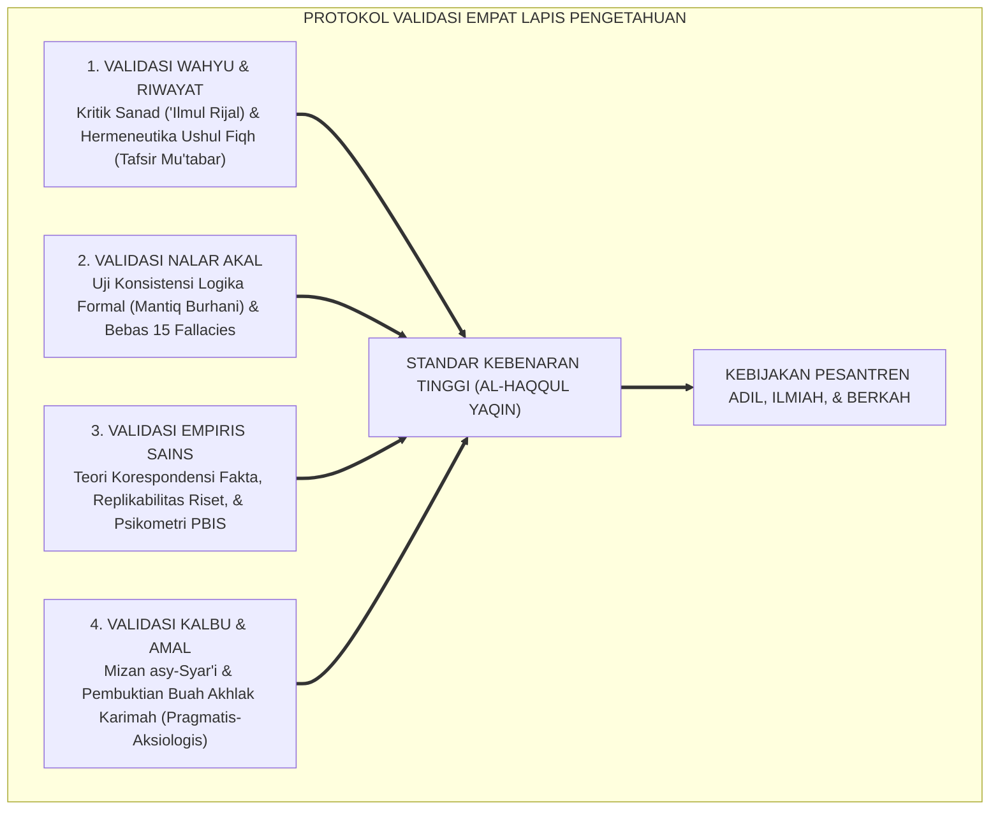
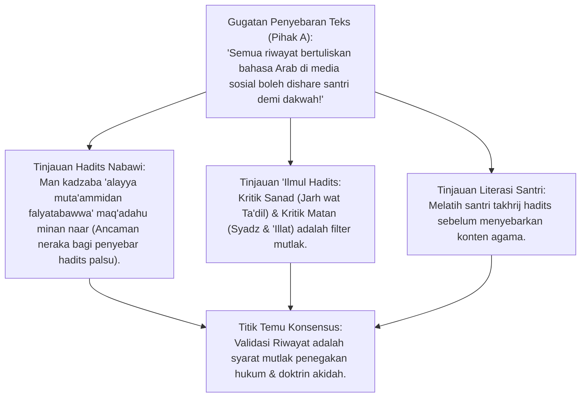
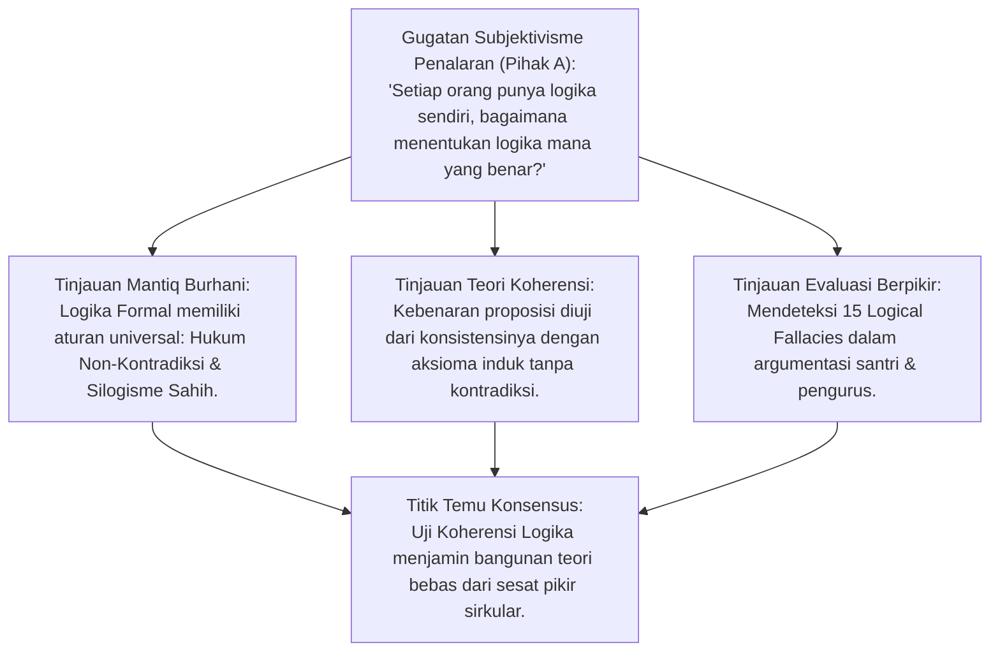
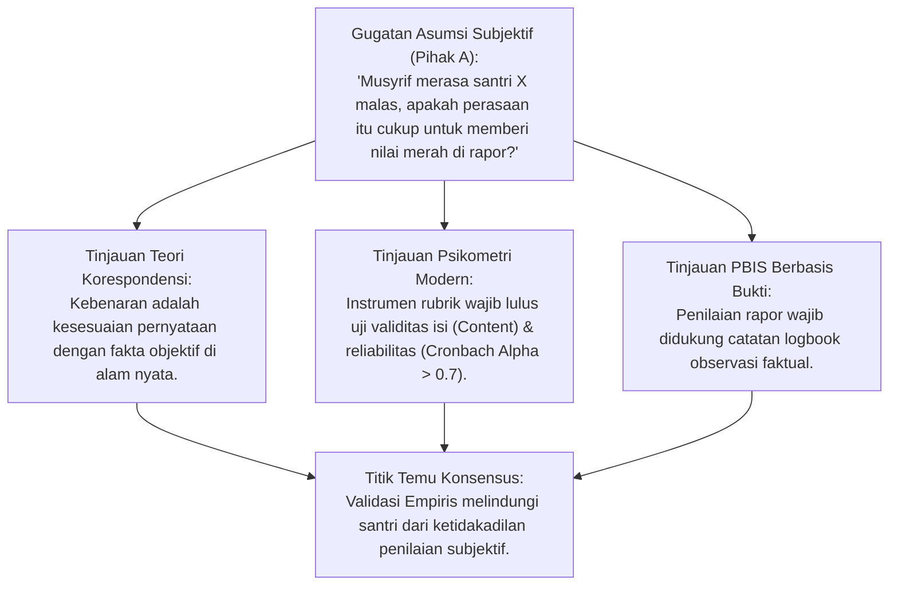
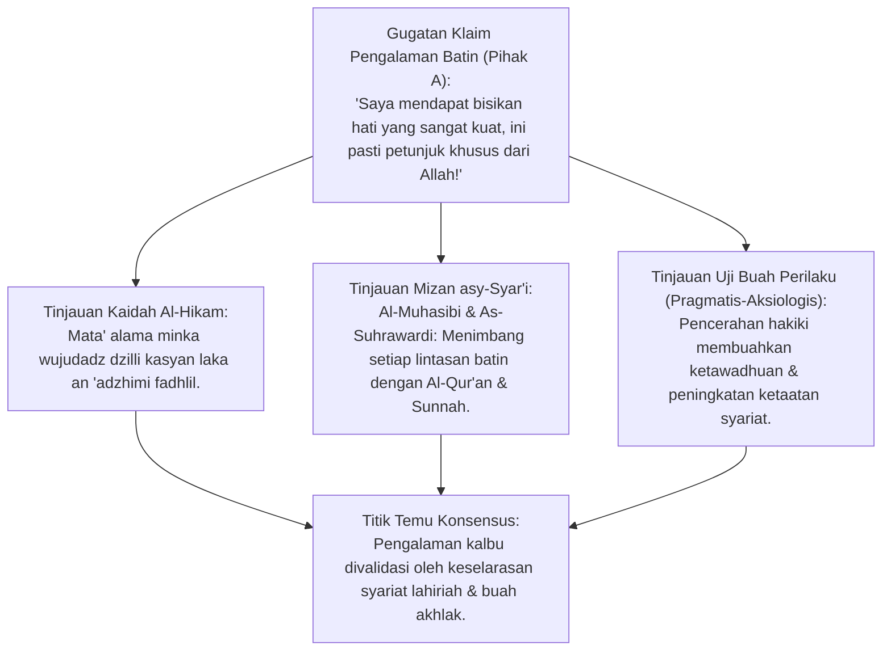
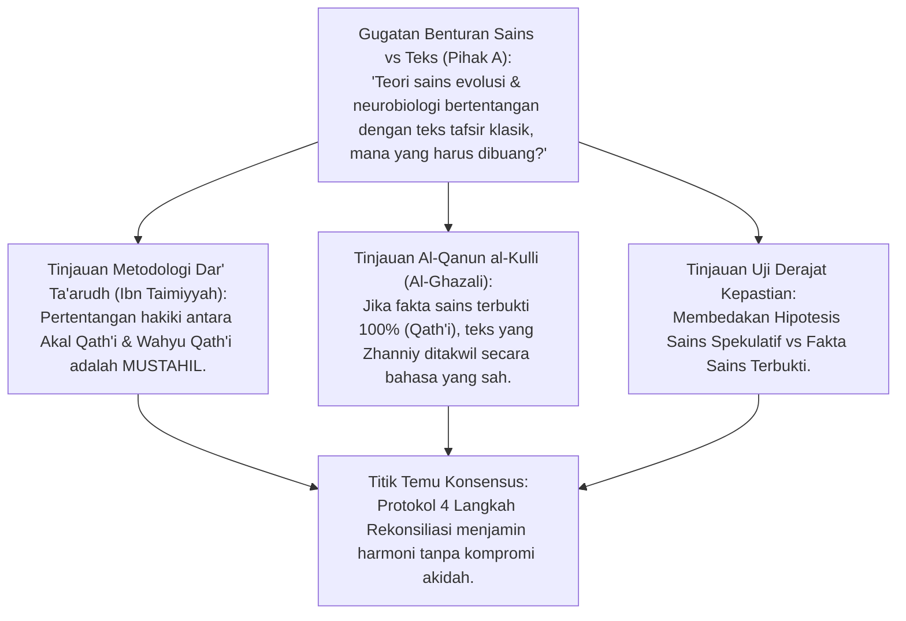
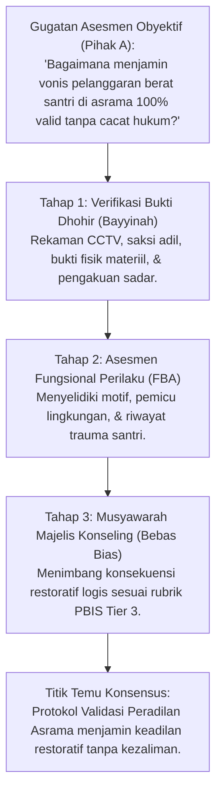
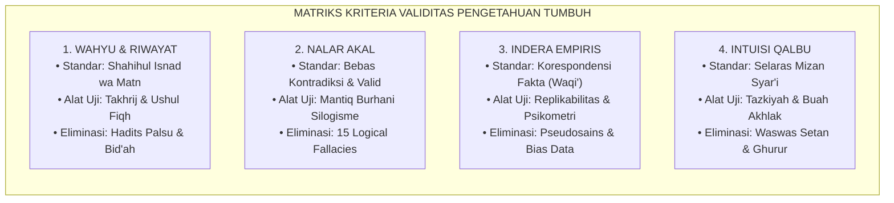
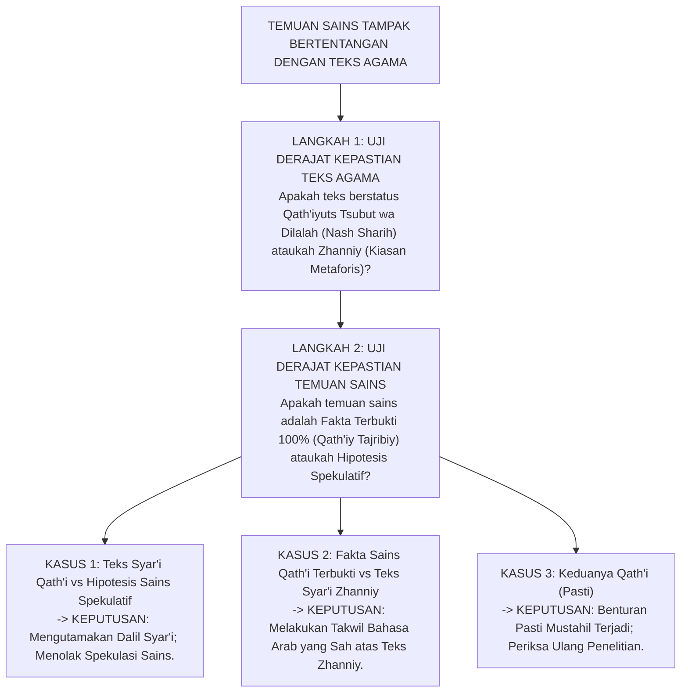

# P1-01-02-03: KRITERIA DAN PROTOKOL VALIDASI PENGETAHUAN
## *Monograf Terpadu: Metodologi Verifikasi Kebenaran (Kritik Sanad-Matan, Uji Koherensi Logika, Korespondensi Empiris, & Mizan Syar'i), Rekonsiliasi Pertentangan Semu (Dar' Ta'arudh), & Standarisasi Asesmen PBIS*

**Nomor Identifikasi**: `P1-01-02-03/MONOGRAF-TERPADU-VALIDASI-ILMU/2026`  
**Domain**: `01 Philosophy` > `01 Worldview` > `02 Epistemologi TUMBUH`  
**Klasifikasi Naskah**: *Comprehensive Integrated Monograph* (Monograf Akademis & Rumusan Baku Terpadu)  
**Rumpun Disiplin Pengkaji**: Epistemologi Turats & 'Ilmul Hadits, Ushul Fiqh & Hermeneutika, Filsafat Ilmu (Verifikasi & Falsifikasi), Psikometri & Analitik Data PBIS, Metodologi Riset Pendidikan  

---

> ### 💡 INTISARI PRAKTIS (3 MENIT PAHAM UNTUK ASATIDZ & MUSYRIF)
>
> * **Apa Masalah Utama dalam Pengambilan Keputusan di Pondok?**  
>   Sering kali musyrif menghukum santri atau menetapkan kebijakan pondok berdasarkan *isu burung, berita hoaks, hadits palsu, atau firasat sepihak*. Hal ini melahirkan kezaliman dan merusak nama baik lembaga.
> * **Empat Kriteria Menguji Kebenaran Suatu Informasi (*Filter Tabayyun*):**  
>   1. **Uji Hadits & Riwayat (Wahyu)**: Pastikan haditsnya shahih/hasan, bukan hadits palsu (*maudhu'*) yang sering beredar di broadcast WhatsApp.
>   2. **Uji Logika (Akal)**: Argumennya harus masuk akal, tidak bertentangan dengan dalil pokok, dan bebas dari sesat pikir (*fallacies*).
>   3. **Uji Bukti Lapangan (Indera Empiris)**: Tuduhan pelanggaran santri wajib dibuktikan dengan saksi nyata, rekaman objektif, atau bukti fisik (bukan terkaan).
>   4. **Uji Timbangan Syariat (Kalbu)**: Setiap firasat batin atau ide kebijakan wajib ditimbang dengan syariat; jika melanggar keadilan atau membahayakan santri, ide tersebut wajib ditolak.
> * **Bagaimana Jika Sains Tampak Bertentangan dengan Teks Agama?**  
>   Tidak mungkin ada pertentangan sejati antara wahyu shahih dengan fakta sains pasti. Jika tampak bertentangan: periksa apakah sainsnya masih berupa hipotesis mentah, ataukah penafsiran teks agamanya yang keliru memahami kiasan bahasa.

---

## 📑 DAFTAR ISI MONOGRAF

- [BAGIAN I: RISET EPISTEMOLOGI VALIDASI, DIALEKTIKA INKUIRI, & KASUISTIKA LAPANGAN](#bagian-i-riset-epistemologi-validasi-dialektika-inkuiri--kasuistika-lapangan)
  - [1. Kerangka Metodologi Validasi Kebenaran Integratif](#1-kerangka-metodologi-validasi-kebenaran-integratif)
  - [2. Inkuiri 1: Validasi Wahyu & Riwayat — Metodologi Kritik Sanad & Matan ('Ilmul Jarh wat Ta'dil)](#2-inkuiri-1-validasi-wahyu--riwayat--metodologi-kritik-sanad--matan-ilmul-jarh-wat-tadil)
  - [3. Inkuiri 2: Validasi Akal — Uji Koherensi Logika Silogisme & Eliminasi Sesat Pikir](#3-inkuiri-2-validasi-akal--uji-koherensi-logika-silogisme--eliminasi-sesat-pikir)
  - [4. Inkuiri 3: Validasi Empiris — Teori Korespondensi Fakta, Replikabilitas Sains, & Psikometri](#4-inkuiri-3-validasi-empiris--teori-korespondensi-fakta-replikabilitas-sains--psikometri)
  - [5. Inkuiri 4: Validasi Kalbu — Pengujian Mizan asy-Syar'i atas Firasat & Pengalaman Spiritual](#5-inkuiri-4-validasi-kalbu--pengujian-mizan-asy-syari-atas-firasat--pengalaman-spiritual)
  - [6. Inkuiri 5: Protokol Rekonsiliasi Pertentangan Semu (Dar' Ta'arudh al-'Aql wan-Naql)](#6-inkuiri-5-protokol-rekonsiliasi-pertentangan-semu-dar-taarudh-al-aql-wan-naql)
  - [7. Inkuiri 6: Translasi Validasi ke Sistem Asesmen Karakter & Pengambilan Keputusan PBIS](#7-inkuiri-6-translasi-validasi-ke-sistem-asesmen-karakter--pengambilan-keputusan-pbis)
- [BAGIAN II: TEMUAN RISET, FORMULASI KONSEPTUAL & PEMBAHASAN](#bagian-ii-temuan-riset-formulasi-konseptual--pembahasan)
  - [1. Matriks Kriteria Validitas Empat Saluran Pengetahuan TUMBUH](#1-matriks-kriteria-validitas-empat-saluran-pengetahuan-tumbuh)
  - [2. Tiga Teori Kebenaran Terpadu (Koherensi, Korespondensi, & Pragmatis-Aksiologis)](#2-tiga-teori-kebenaran-terpadu-koherensi-korespondensi--pragmatis-aksiologis)
  - [3. Algoritma Baku Resolusi Pertentangan Semu (Protokol Dar' Ta'arudh)](#3-algoritma-baku-resolusi-pertentangan-semu-protokol-dar-taarudh)
  - [4. Standarisasi Validitas Psikometrik Asesmen Santri PBIS](#4-standarisasi-validitas-psikometrik-asesmen-santri-pbis)
- [BAGIAN III: APARATUS AKADEMIS & APENDIKS](#bagian-iii-aparatus-akademis--apendiks)
  - [1. Tabel Sintesis Hasil Riset Validasi Epistemologis](#1-tabel-sintesis-hasil-riset-validasi-epistemologis)
  - [2. Daftar Pustaka Akademis & Rujukan Turats Primer](#2-daftar-pustaka-akademis--rujukan-turats-primer)
  - [3. Catatan Kaki Akademis (Footnotes)](#3-catatan-kaki-akademis-footnotes)
  - [4. Glosarium dan Penjelasan Istilah Teknis Validasi & Turats](#4-glosarium-dan-penjelasan-istilah-teknis-validasi--turats)

---

# BAGIAN I: RISET EPISTEMOLOGI VALIDASI, DIALEKTIKA INKUIRI, & KASUISTIKA LAPANGAN

*Bagian ini memuat proses penyelidikan kriteria pengujian kebenaran (*ma'ayir shihhat al-ma'rifah*), formalisasi silogisme logika (*qiyas burhani*), pertarungan dialektika multi-perspektif tiga ronde tanpa kata "pakar", penelaahan metodologi turats hadits/ushul dan filsafat sains kontemporer, studi kasus asesmen santri, dan penarikan konsensus bersama.*

---

### 1. Kerangka Metodologi Validasi Kebenaran Integratif

Di tengah banjir informasi di era digital, tantangan terbesar pendidikan bukanlah mencari informasi, melainkan **Menguji dan Memvalidasi Kebenaran Informasi (*Epistemological Verification / Tabayyun*)**. Klaim pengetahuan yang tidak melalui protokol validasi ketat melahirkan:
* **Pseudosains & Takhayul**: Mengadopsi metode pembinaan yang membahayakan santri atas nama tradisi yang tidak terbukti.
* **Fitnah & Kezaliman Hukum**: Menghukum santri atas dasar kabar burung tanpa pembuktian dhohir (*Unverified Allegations*).
* **Bias Ideologis**: Menolak temuan sains medis yang bermanfaat karena sentimen anti-Barat.

Ekosistem TUMBUH merumuskan **Protokol Validasi Empat Lapis**:

---

### 2. Inkuiri 1: Validasi Wahyu & Riwayat — Metodologi Kritik Sanad & Matan ('Ilmul Jarh wat Ta'dil)

#### 📐 Formalisasi Logika Silogisme (*Qiyas Mantiqi 1*)
* **Premis Mayor (*al-Muqaddimah al-Kubra*)**: Setiap klaim yang disandarkan kepada Allah dan Rasul-Nya tanpa melalui jalur periwayatan yang sahih (*Shahihul Isnad wa Matn*) adalah kedustaan yang diharamkan syariat dan tertolak sebagai sumber hukum.
* **Premis Minor (*al-Muqaddimah ash-Shughra*)**: Hadits palsu (*Maudhu'*) dan hadits lemah yang sangat parah (*Dha'if Jiddan*) beredar luas di tengah masyarakat tanpa verifikasi sanad.
* **Konklusi (*an-Natijah*)**: Maka, seluruh penetapan kurikulum akidah, ibadah, dan regulasi asrama TUMBUH wajib divalidasi melalui metodologi takhrij hadits bersanad sahih.[^1]

#### 📖 Teks Primer Turats: *Muqaddimah Ibnu ash-Shalah* & *Al-Kifayah fi 'Ilm ar-Riwayah*
Al-Hafizh **Ibnu ash-Shalah** (w. 643 H) dalam karya monumentalnya *'Ulum al-Hadits* mendefinisikan hadits sahih:

$$\text{أَمَّا الْحَدِيثُ الصَّحِيحُ: فَهُوَ الْحَدِيثُ الْمُسْنَدُ الَّذِي يَتَّصِلُ إِسْنَادُهُ بِنَقْلِ الْعَدْلِ الضَّابِطِ عَنِ الْعَدْلِ الضَّابِطِ إِلَى مُنْتَهَاهُ، وَلَا يَكُونُ شَاذًّا وَلَا مُعَلَّلًا}$$

*"Adapun hadits sahih adalah hadits yang bersambung sanadnya melalui periwayatan perawi yang adil dan kuat hafalannya (dhabith) dari perawi yang adil dan dhabith hingga akhir sanadnya, serta terbebas dari kejanggalan (syadz) dan cacat tersembunyi ('illat)."*[^2]

Dan Al-Khatib **Al-Baghdadi** dalam *Al-Kifayah* menegaskan:
$$\text{عَلَى النَّاقِدِ أَنْ يَنْظُرَ فِي عَدَالَةِ الرَّاوِي وَضَبْطِهِ، ثُمَّ يَنْظُرَ فِي الْمَتْنِ: هَلْ يُخَالِفُ صَرِيحَ الْقُرْآنِ أَوْ صَحِيحَ السُّنَّةِ أَوْ قَاطِعَ الْعَقْلِ}$$
*"Wajib bagi seorang kritikus hadits untuk meneliti keadilan perawi dan ketepatan hafalannya, kemudian meneliti matan teksnya: apakah matan tersebut menyalahi ketegasan Al-Qur'an, hadits sahih lainnya, atau kepastian akal sehat."*[^3]

#### 🥊 Ronde 1: Membendung Hadits Maudhu' Berkedok Keutamaan Amal (Fadha'il al-A'mal)
* **Pihak A (Sudut Pandang Permisif Hadits)**:  
  *"Bukankah sebagian ulama membolehkan meriwayatkan hadits lemah untuk motivasi ibadah (fadha'ilul a'mal)? Mengapa pesantren TUMBUH begitu ketat menyaring hadits hingga menguji derajat keshahihannya?"*
* **Tinjauan Sudut Pandang 'Ilmul Hadits Aswaja**:  
  Kebolehan meriwayatkan hadits dha'if menurut para imam hadits (seperti Ibnu Hajar dan An-Nawawi) memiliki **Tiga Syarat Ketat**: (1) Kelemahannya tidak parah (bukan pemalsu/pendusta), (2) Masuk di bawah dalil pokok yang sahih, dan (3) Tidak meyakini kepastian sabda Nabi. Menghukum santri atau membuat aturan asrama berdasarkan **Hadits Palsu (*Maudhu'*)** adalah dosa besar pemalsuan syariat yang diancam neraka oleh Nabi SAW (*HR. Bukhari no. 110*).[^4]

#### 🥊 Ronde 2: Sanggahan Balik Kritik Matan: Menghindari Penolakan Hadits Berdasarkan Selera
* **Pihak A (Sudut Pandang Rasionalisme Kritis Ekstrem)**:  
  *"Sanggahan! Jika matan hadits boleh diuji dengan akal, bukankah orang liberal bisa menolak hadits-hadits sahih tentang siksa kubur atau mukjizat hanya karena dianggap 'tidak masuk akal'?"*
* **Tinjauan Sudut Pandang Kaidah Kritik Matan Turats**:  
  Kritik matan (*Naqd al-Matn*) dalam tradisi hadits bukanlah penolakan berdasarkan selera akal subjektif, melainkan pengujian apakah teks tersebut **Bertentangan dengan Dalil Qur'ani yang Lebih Pasti (*Munafadhah lil-Qur'an*)** atau mengandung kontradiksi historis yang mustahil. Jika sanadnya mutawatir dan shahih, akal yang sehat wajib tunduk menerima hakikat ghaib tersebut.[^5]

#### 🥊 Ronde 3: Sanggahan Pamungkas Literasi Takhrij Digital bagi Santri
* **Pihak A (Sudut Pandang Kemudahan Praktis)**:  
  *"Bagaimana santri usia MTs/MA dapat memverifikasi hadits jika kitab-kitab induk hadits tebal dan sulit diakses?"*
* **Resolusi Sudut Pandang Arsitektur Digital Pesantren**:  
  Santri dilatih menggunakan aplikasi perpustakaan turats digital (*Maktabah Syamilah, Dorar Saniyyah*) di laboratorium komputer: santri diajarkan memasukkan kata kunci, memeriksa rawi, dan membaca hukum derajat hadits oleh para pakar hadits mu'tabar. Santri menjadi generasi digital yang memiliki **Filter Anti-Hoaks Syar'i**.[^6]

> #### 📌 Kasuistika Lapangan 1 & Titik Temu Konsensus
> * **Studi Kasus**: Musyrif menempelkan poster di asrama berisi hadits palsu: "Tidur setelah ashar menyebabkan gila", lalu menjatuhkan takzir membersihkan selokan kepada santri yang tidur siang setelah ashar.
> * **Titik Temu Konsensus (*Kalimatun Sawa'*)**: Disepakati bahwa riwayat tersebut berstatus palsu (*Maudhu'*). Menghukum santri atas dasar hadits palsu adalah kezaliman; poster wajib dicopot dan diganti dengan anjuran kesehatan berbasis sains tidur yang valid.[^7]

---

### 3. Inkuiri 2: Validasi Akal — Uji Koherensi Logika Silogisme & Eliminasi Sesat Pikir

#### 📐 Formalisasi Logika Silogisme (*Qiyas Mantiqi 2*)
* **Premis Mayor (*al-Muqaddimah al-Kubra*)**: Setiap bangunan argumentasi yang mengandung kontradiksi internal (*Tanaqudh*) atau tersusun dari premis-premis yang sesat pikir (*Fasaad at-Tarkib*) adalah argumen batil yang gugur secara logika formal.
* **Premis Minor (*al-Muqaddimah ash-Shughra*)**: Uji koherensi mantiq menguji apakah konklusi suatu kebijakan pesantren diturunkan secara niscaya dari premis-premis yang sahih.
* **Konklusi (*an-Natijah*)**: Maka, seluruh SOP pembinaan santri wajib lulus uji bebas kontradiksi dan bebas sesat pikir (*Logical Fallacy-Free*).[^8]

#### 📖 Teks Primer Turats: *Mi'yar al-'Ilm* & *Mahakk an-Nazhar*
**Imam Al-Ghazali** dalam *Mahakk an-Nazhar fil Mantiq* menetapkan syarat keshahihan silogisme (*Syuruth Shihhat al-Qiyas*):

$$\text{لَا يَكُونُ الْقِيَاسُ مُنْتِجًا لِلْيَقِينِ إِلَّا بِشَرْطَيْنِ: صِحَّةُ مَادَّتِهِ بِأَنْ تَكُونَ الْمُقَدِّمَاتُ يَقِينِيَّةً، وَصِحَّةُ صُورَتِهِ بِأَنْ يَكُونَ التَّرْكِيبُ عَلَى الْأَشْكَالِ الْمُنْتِجَةِ خَالِيًا مِنَ التَّنَاقُضِ}$$

*"Tidaklah silogisme logika (al-Qiyas) menghasilkan kepastian kebenaran (al-Yaqin) melainkan dengan dua syarat mutlak: Keshahihan materinya (yaitu premis-premisnya bersumber dari kebenaran yang pasti), dan Keshahihan bentuk susunannya (yaitu konstruksi silogisme mengikuti kaidah yang sah dan terbebas dari kontradiksi)."*[^9]

#### 🥊 Ronde 1: Menguji Konsistensi Internal SOP Asrama
* **Tinjauan Audit Logika Manajemen**:  
  Banyak peraturan asrama yang mengandung **Kontradiksi Internal (*Logical Inconsistency*)**: Di satu sisi pengurus mewajibkan santri menjaga kebersihan pakaian (Thaharah), tetapi di sisi lain pengurus melarang santri menjemur pakaian di bawah sinar matahari dan membatasi air wudhu hingga santri memakai pakaian lembab berjamur. Uji koherensi logika menyelaraskan seluruh regulasi agar saling mendukung dan tidak saling mematikan.[^10]

#### 🥊 Ronde 2: Sanggahan Balik Teori Koherensi Murni vs Kenyataan Lapangan
* **Pihak A (Sudut Pandang Filsafat Kritis)**:  
  *"Sanggahan! Sebuah novel fiksi atau sistem dongeng mitologi bisa saja tersusun sangat koheren dan konsisten logikanya dari awal sampai akhir, tetapi tetap merupakan kebohongan khayalan. Mengapa koherensi logika dijadikan standar kebenaran?"*
* **Tinjauan Sudut Pandang Epistemologi Islam**:  
  Itulah sebabnya Islam **Tidak Mencukupkan Diri Hanya pada Teori Koherensi Logika**, melainkan menggabungkannya dengan **Teori Korespondensi Fakta (*Muthabaqah lil-Waqi'*)**. Premis-premis logika diuji koherensinya dengan dalil wahyu dan diuji korespondensinya dengan fakta empiris di alam nyata. Jika logikanya runtuh, argumennya gugur; jika faktanya bertentangan, teorinya batal.[^11]

#### 🥊 Ronde 3: Sanggahan Pamungkas Eliminasi Bias Otoritas (Appeal to Authority)
* **Pihak A (Sudut Pandang Pembelaan Tokoh)**:  
  *"Jika seorang ustadz senior yang bergelar doktor mengeluarkan fatwa atau aturan asrama, apakah santri masih boleh menguji logika aturan tersebut?"*
* **Resolusi Sudut Pandang Epistemologi Ali bin Abi Thalib ra**:  
  Sayyidina Ali bin Abi Thalib ra meletakkan kaidah emas:
  
  $$\text{لَا تَعْرِفِ الْحَقَّ بِالرِّجَالِ، اعْرِفِ الْحَقَّ تَعْرِفْ أَهْلَهُ}$$
  
  *"Janganlah engkau mengenali kebenaran berdasarkan ketokohan figur orangnya; kenalilah hakikat kebenaran itu sendiri, niscaya engkau akan mengetahui siapa orang-orang yang berada di atas kebenaran."*[^12]  
  Wibawa ustadz dihormati dengan adab yang mulia, namun substansi aturan tetap wajib diuji keabsahan logikanya.[^13]

> #### 📌 Kasuistika Lapangan 2 & Titik Temu Konsensus
> * **Studi Kasus**: Pengurus melarang santri minum air putih saat belajar malam dengan argumen: "Banyak minum menyebabkan sering ke belakang, sering ke belakang tanda malas belajar".
> * **Titik Temu Konsensus (*Kalimatun Sawa'*)**: Disepakati bahwa argumen tersebut adalah sesat pikir logika (*Slippery Slope & False Cause*). Dehidrasi justru merusak konsentrasi otak santri secara biologis; pengurus wajib menyediakan air minum bersih di setiap ruang kelas.[^14]

---

### 4. Inkuiri 3: Validasi Empiris — Teori Korespondensi Fakta, Replikabilitas Sains, & Psikometri

#### 📐 Formalisasi Logika Silogisme (*Qiyas Mantiqi 3*)
* **Premis Mayor (*al-Muqaddimah al-Kubra*)**: Setiap klaim deskriptif mengenai perilaku, kesehatan, dan capaian akademik santri dinyatakan benar jika dan hanya jika klaim tersebut bersesuaian secara akurat dengan fakta kenyataan empiris yang terukur (*Muthabiqan lil-Waqi'*).
* **Premis Minor (*al-Muqaddimah ash-Shughra*)**: Penilaian perilaku santri tanpa instrumen observasi terstandar rentan terdistorsi oleh bias prasangka subjektif penilai (*Observer Bias / Halo Effect*).
* **Konklusi (*an-Natijah*)**: Maka, seluruh instrumen rubrik penilaian PBIS dan data asrama TUMBUH wajib lulus uji validitas psikometrik dan reliabilitas empiris.[^15]

#### 📖 Teks Primer Turats: *Tahafut at-Tahafut* & Metodologi Sains
Filsuf dan Faqih **Ibnu Rusyd** (Averroes) dalam *Tahafut at-Tahafut* menegaskan definisi kebenaran korespondensi:

$$\text{الصِّدْقُ وَالْحَقُّ هُوَ أَنْ يَكُونَ الْأَمْرُ فِي الذِّهْنِ مُطَابِقًا لِمَا هُوَ عَلَيْهِ فِي الْخَارِجِ، فَإِذَا قُلْنَا: إِنَّ الشَّيْءَ مَوْجُودٌ وَهُوَ مَوْجُودٌ بِالْفِعْلِ، فَقَدْ نَطَقْنَا بِالْحَقِّ}$$

*"Kebenaran dan kejujuran adalah kesesuaian antara apa yang ada di dalam pikiran/pernyataan dengan kenyataan yang ada di luar (alam nyata). Maka apabila kita menyatakan bahwa sesuatu itu ada dan kenyataannya ia memang benar-benar ada di alam nyata, sungguh kita telah berucap dengan kebenaran."*[^16]

#### 🥊 Ronde 1: Menguji Reliabilitas Antar-Penilai (Inter-Rater Reliability)
* **Tinjauan Psikometri Pendidikan**:  
  Sering terjadi ketidakadilan di mana Santri A dinilai "sangat sopan" oleh Ustadz X, tetapi dinilai "kurang ajar" oleh Ustadz Y untuk perilaku yang sama. Ekosistem TUMBUH memecahkan bias ini melalui **Standarisasi Rubrik Perilaku Operasional (PBIS Rubrics)**:  
  * Indikator adab dijabarkan menjadi perilaku konkret yang dapat diamati mata (misalnya: *"Mengucapkan salam saat berpapasan dan menundukkan pandangan"*).  
  * Instrumen diuji derajat kesepakatan antar-musyrif (*Inter-Rater Reliability Kappa Coefficient > 0.80*), sehingga penilaian rapor santri objektif dan bebas dari rasa suka/tidak suka (*Like/Dislike Bias*).[^17]

#### 🥊 Ronde 2: Sanggahan Balik Keterbatasan Data Kuantitatif vs Dimensi Keikhlasan Batin
* **Pihak A (Sudut Pandang Kualitatif Batin)**:  
  *"Sanggahan! Data statistik dan angka skor PBIS hanya bisa mencatat perilaku fisik luar, tetapi tidak bisa mengukur apakah santri ikhlas atau riya' di dalam hatinya. Mengapa data empiris dijadikan tolak ukur rapor?"*
* **Tinjauan Sudut Pandang Kaidah Fiqh Peradilan**:  
  Kaidah syariat menetapkan: *"Nahnu nahkumu bizh-zhawahir"* (Kita menilai berdasarkan bukti yang tampak di alam mulk). Musyrif tidak berhak menghakimi niat batin santri (*bukan tuhan yang mengadili hati*). Jika perilaku dhohir santri tertib dan santun, santri berhak mendapatkan nilai baik di rapor; sementara urusan keikhlasan batin dibimbing melalui majelis tazkiyah dan diserahkan kepada hisab Allah SWT.[^18]

#### 🥊 Ronde 3: Sanggahan Pamungkas Prinsip Replikabilitas dalam Riset Pendidikan Pesantren
* **Pihak A (Sudut Pandang Partikularisme Budaya)**:  
  *"Apakah program intervensi santri bermasalah yang sukses di satu pondok bisa diterapkan dan diulang di pondok pesantren lain?"*
* **Resolusi Sudut Pandang Metodologi Riset Ilmiah**:  
  Program intervensi TUMBUH disusun dengan **Protokol Replikabilitas Terstandar (*Standardized Implementation Fidelity*)**: Menggunakan panduan SOP FBA (Functional Behavior Assessment), pembagian multi-tier yang presisi, dan indikator keberhasilan terukur. Hal ini menjamin bahwa sistem TUMBUH dapat diterapkan secara konsisten di berbagai pondok pesantren di seluruh Nusantara dengan tingkat keberhasilan yang dapat diuji secara ilmiah.[^19]

> #### 📌 Kasuistika Lapangan 3 & Titik Temu Konsensus
> * **Studi Kasus**: Santri berprestasi diturunkan nilainya menjadi D pada mata pelajaran adab karena musyrif merasa santri tersebut "terlihat sombong dari cara berjalannya", tanpa ada bukti pelanggaran adab sedikit pun di logbook.
> * **Titik Temu Konsensus (*Kalimatun Sawa'*)**: Disepakati bahwa penilaian berbasis asumsi prasangka melanggar teori korespondensi dan QS. Al-Hujurat: 12 (*Inna ba'dha azh-zhanni itsm*). Nilai santri direvisi dan musyrif dibekali pelatihan rubrik observasi objektif.[^20]

---

### 5. Inkuiri 4: Validasi Kalbu — Pengujian Mizan asy-Syar'i atas Firasat & Pengalaman Spiritual

#### 📐 Formalisasi Logika Silogisme (*Qiyas Mantiqi 4*)
* **Premis Mayor (*al-Muqaddimah al-Kubra*)**: Setiap klaim pengalaman batin, firasat, atau ilham qalbu yang melahirkan pelanggaran syariat lahiriah atau memicu rasa ujub kesombongan adalah tipu daya nafsu (*Ghurur*) yang tertolak secara epistemologis.
* **Premis Minor (*al-Muqaddimah ash-Shughra*)**: Validasi kalbu menuntut pengujian keselarasan terhadap timbangan syariat (*Mizan asy-Syar'i*) dan pembuktian buah akhlak mulia (*Axiological Fruit*).
* **Konklusi (*an-Natijah*)**: Maka, ilham yang shahih wajib berbuah ketaatan syariat yang semakin kokoh dan kerendahan hati sosial yang tulus.[^21]

#### 📖 Teks Primer Turats: *'Awarif al-Ma'arif* & *Ar-Ri'ayah li Huquqillah*
Syaikhul Islam **Abu Hafsh Umar As-Suhrawardi** dalam *'Awarif al-Ma'arif* menetapkan kaidah validasi batin:

$$\text{كُلُّ وَارِدٍ قَلْبِيٍّ لَا يَشْهَدُ لَهُ ظَاهِرُ الشَّرِيعَةِ بِالصِّحَّةِ فَهُوَ مَرْدُودٌ، وَالْوَلِيُّ الْحَقِيقِيُّ هُوَ الَّذِي يَزْدَادُ بِكَشْفِهِ تَمَسُّكًا بِالسُّنَّةِ وَتَوَاضُعًا لِلْخَلْقِ}$$

*"Setiap lintasan rasa yang masuk ke dalam kalbu yang tidak disaksikan kebenarannya oleh syariat lahiriah, maka lintasan tersebut tertolak mentah-mentah; dan wali Allah yang sejati adalah orang yang dengan tersingkapnya tabir batinnya justru semakin bertambah kokoh berpegang teguh pada Sunnah Nabi dan semakin tawadhu' kepada sesama makhluk."*[^22]

#### 🥊 Ronde 1: Teori Kebenaran Pragmatis-Aksiologis Islam (Buah Pohon Ilmu)
* **Tinjauan Filsafat Aksiologi Islam**:  
  Bagaimana membedakan ilmu yang berkah (*'Ilmun Nafi'*) dari ilmu yang mandul (*'Ilmun Ghayru Nafi'*)? Islam menerapkan **Validasi Pragmatis-Aksiologis**: Rasulullah SAW mengajarkan doa: *"Allahumma inni a'udzubika min 'ilmin laa yanfa'"* (Ya Allah aku berlindung kepada-Mu dari ilmu yang tidak bermanfaat). Tolak ukur validitas keilmuan santri bukan pada berapa tebal kitab yang dihafal, melainkan **Apakah Ilmu Tersebut Membuahkan Adab Berbakti pada Orang Tua, Menjaga Lisan dari Ghibah, dan Bersemangat Menolong Sesama**.[^23]

#### 🥊 Ronde 2: Sanggahan Balik Fenomena "Ujub Intelektual" Santri Cerdas
* **Pihak A (Sudut Pandang Kesombongan Akademik)**:  
  *"Banyak santri yang juara debat ilmiah dan hafal ribuan matan nadzam, tetapi bicaranya kasar, merendahkan gurunya, dan enggan shalat berjamaah. Apakah ilmu santri tersebut valid?"*
* **Tinjauan Sudut Pandang Epistemologi Kalbu Al-Ghazali**:  
  Secara kognitif santri tersebut memiliki data ingatan, namun **Secara Epistemologis Ilmunya Cacat dan Tidak Bernilai (*Ilmun Maslubul Barakah*)**. **Imam Al-Ghazali** dalam *Bidayatul Hidayah* menegaskan bahwa ilmu yang melahirkan kesombongan adalah racun pembunuh jiwa (*Summun Qattal*). Pengetahuan yang valid adalah pengetahuan yang menggetarkan hati takut kepada Allah (*Innama yakhsyallaha min 'ibadihil 'ulama*).[^24]

#### 🥊 Ronde 3: Sanggahan Pamungkas Evaluasi Karakter Afektif di Pesantren
* **Pihak A (Sudut Pandang Manajemen Asrama)**:  
  *"Bagaimana menguji validitas keikhlasan batin santri sebelum diberikan amanah menjadi ketua asrama?"*
* **Resolusi Sudut Pandang Uji Integritas Lapangan**:  
  Santri diuji melalui **Amanah Khidmah Tanpa Panggung (Silent Service Tasks)**: Diberi tugas membersihkan kamar mandi asrama saat malam hari, melayani santri yang sakit, atau mengelola barang temuan (*luqathah*). Santri yang ikhlas akan melaksanakannya dengan riang gembira tanpa butuh pujian kamera, membuktikan validitas kebersihan jiwanya.[^25]

> #### 📌 Kasuistika Lapangan 4 & Titik Temu Konsensus
> * **Studi Kasus**: Santri mengaku mendapat ilham bahwa dirinya adalah calon wali agung, sehingga ia menolak ikut ronda malam dan menolak mencuci piringnya sendiri.
> * **Titik Temu Konsensus (*Kalimatun Sawa'*)**: Disepakati bahwa perilaku santri tersebut adalah tipu daya kesombongan batin (*Ghurur Nafsaniy*). Musyrif membimbingnya untuk kembali berkhidmah melayani sesama sebagai bukti ketundukan syariat.[^26]

---

### 6. Inkuiri 5: Protokol Rekonsiliasi Pertentangan Semu (Dar' Ta'arudh al-'Aql wan-Naql)

#### 📐 Formalisasi Logika Silogisme (*Qiyas Mantiqi 5*)
* **Premis Mayor (*al-Muqaddimah al-Kubra*)**: Kebenaran hakiki tidak akan pernah bertentangan dengan kebenaran hakiki lainnya (*Al-Haqqu laa yunaqidhu al-Haqq*); maka pertentangan antara dalil wahyu sharih dengan temuan sains pasti adalah pertentangan semu (*Ta'arudh Zhahiriy*) yang niscaya dapat direkonsiliasi.
* **Premis Minor (*al-Muqaddimah ash-Shughra*)**: Syaikhul Islam Ibn Taimiyyah dan Imam Al-Ghazali merumuskan protokol metodologis untuk menuntaskan seluruh benturan semu tersebut.
* **Konklusi (*an-Natijah*)**: Maka, Ekosistem TUMBUH memiliki protokol resmi penyelarasan sains-agama yang kokoh dan berwibawa.[^27]

#### 📖 Teks Primer Turats: *Dar' Ta'arudh al-'Aql wan-Naql*
**Syaikhul Islam Ibn Taimiyyah** menetapkan aksioma rekonsiliasi agung:

$$\text{إِذَا تَعَارَضَ الْعَقْلُ وَالنَّقْلُ، فَإِمَّا أَنْ يَكُونَا قَطْعِيَّيْنِ: وَهَذَا مُمْتَنِعٌ لَا وُجُودَ لَهُ، لِأَنَّ الدَّلِيلَيْنِ الْقَطْعِيَّيْنِ لَا يَتَعَارَضَانِ؛ وَإِمَّا أَنْ يَكُونَا ظَنِّيَّيْنِ، فَيُقَدَّمُ الرَّاجِحُ؛ وَإِمَّا أَنْ يَكُونَ أَحَدُهُمَا قَطْعِيًّا فَيُقَدَّمُ الْقَطْعِيُّ مُطْلَقًا سَوَاءً كَانَ عَقْلًا أَوْ نَقْلًا}$$

*"Apabila tampak bertentangan antara dalil akal dan dalil wahyu, maka kemungkinannya: (1) Keduanya bersifat pasti (qath'iy), dan hal ini mustahil terjadi dalam kenyataan karena dua dalil pasti tidak mungkin saling bertentangan; (2) Keduanya bersifat dugaan (zhanniy), maka dimenangkan dalil yang lebih kuat indikatornya; (3) Salah satunya pasti (qath'iy) dan yang lain dugaan (zhanniy), maka didahulukan dalil yang pasti secara mutlak, baik dalil pasti itu berupa wahyu maupun akal sehat."*[^28]

#### 🥊 Ronde 1: Membedakan Fakta Sains Pasti dari Teori Hipotesis Spekulatif
* **Tinjauan Filsafat Sains & Kalam**:  
  Ketika sebuah teori sains Barat bertentangan dengan teks Al-Qur'an (misalnya teori Materialisme yang menyatakan alam semesta ada dengan sendirinya tanpa Pencipta), kita mengujinya: Apakah klaim tersebut merupakan **Fakta Empiris Pasti (*Qath'iy Tajribiy*)** ataukah **Asumsi Filosofis Spekulatif Materialisme (*Philosophical Assumption*)**? Sains tidak pernah membuktikan ketiadaan Tuhan; klaim ketiadaan Tuhan adalah ideologi ateisme yang menumpang pada jubah sains. Maka dalil wahyu qath'i dimenangkan secara mutlak.[^29]

#### 🥊 Ronde 2: Sanggahan Balik Takwil Bahasa Arab yang Sah vs Takwil Liar
* **Pihak A (Sudut Pandang Literalisme Kaku)**:  
  *"Sanggahan! Jika fakta sains membuktikan bumi itu bulat berotasi mengelilingi matahari, bolehkah kita memahami ayat Al-Qur'an tentang 'membentangkan bumi' (*Suthihat*) sebagai kiasan kelapangan pandangan mata manusia?"*
* **Tinjauan Sudut Pandang Bahasa Arab & Mufassir Mu'tabar**:  
  Para ulama besar tafsir (seperti Fakhruddin Ar-Razi dan Ibnu Hazm) sejak abad ke-5 Hijriah telah menegaskan bahwa bumi itu bulat (*Kurawiyyah al-Ardh*). Kata *Suthihat* (dibentangkan) ditakwilkan secara sah selaras kaidah balaghah bahasa Arab: bahwa dari sudut pandang pandangan mata manusia di permukaan tanah, bumi terbentang lapang untuk dihuni. **Takwil yang Sah Selaras Kaidah Bahasa dan Sains Terbukti Diakui Sepenuhnya oleh Ulama Aswaja**.[^30]

#### 🥊 Ronde 3: Sanggahan Pamungkas Rekonsiliasi Jam Tidur Santri dengan Dalil Tahajjud
* **Pihak A (Sudut Pandang Pertentangan Ibadah vs Medis)**:  
  *"Bagaimana menyelesaikan pertentangan antara anjuran bangun tahajjud malam dengan temuan sains medis bahwa otak remaja butuh tidur 7 jam?"*
* **Resolusi Sudut Pandang Protokol Dar' Ta'arudh**:  
  Pertentangan ini adalah semu! Rasulullah SAW mencontohkan tidur segera setelah Isya (sekitar pukul 21.00) dan bangun pada sepertiga malam terakhir (pukul 03.30–04.00), ditambah tidur siang sejenak (*Qailulah*). Jika santri tidur jam 21.30 dan bangun jam 04.00, santri mendapatkan tidur 6,5 jam di malam hari + 30 menit qailulah di siang hari = **Total 7 Jam Tidur Sempurna**. Sunnah Nabawiyyah terbukti 100% selaras dengan sains sirkadian otak.[^31]

> #### 📌 Kasuistika Lapangan 5 & Titik Temu Konsensus
> * **Studi Kasus**: Ustadz melarang santri diimunisasi vaksin polio dengan alasan "penyakit datang dari Allah dan vaksin buatan orang kafir", mengakibatkan santri di asrama terkena wabah lumpuh layu.
> * **Titik Temu Konsensus (*Kalimatun Sawa'*)**: Disepakati bahwa vaksinasi adalah ikhtiar preventif sains empiris yang selaras dengan hadits berobat (*Tadaawaw 'ibaadallah*) dan kaidah Maqashid *Hifzh an-Nafs*. Vaksinasi halal dan aman wajib diberikan kepada seluruh santri.[^32]

---

### 7. Inkuiri 6: Translasi Validasi ke Sistem Asesmen Karakter & Pengambilan Keputusan PBIS

#### 📐 Formalisasi Logika Silogisme (*Qiyas Mantiqi 6*)
* **Premis Mayor (*al-Muqaddimah al-Kubra*)**: Setiap penjatuhan sanksi disiplin berat kepada santri yang berpotensi mengubah masa depan pendidikannya niscaya menuntut pembuktian derajat keyakinan tertinggi (*Al-Yaqin laa yazaalu bisy-Syakk*) dan verifikasi data multi-sumber (*Multi-Informant Triangulation*).
* **Premis Minor (*al-Muqaddimah ash-Shughra*)**: Sistem PBIS Restoratif TUMBUH mewajibkan audit investigasi objektif sebelum keputusan penanganan kasus khusus ditetapkan.
* **Konklusi (*an-Natijah*)**: Maka, tidak ada santri yang boleh diskors atau dikeluarkan dari pondok atas dasar dugaan sepihak tanpa melalui protokol validasi terpadu.[^33]

#### 🥊 Ronde 1: Kaidah Fiqh Peradilan: Al-Yaqin laa Yazaalu bisy-Syakk
* **Tinjauan Fiqh Jinayah Asrama**:  
  Kaidah ushul menetapkan: *"Keyakinan tidak dapat digugurkan oleh keragu-raguan"*. Status asal seorang santri adalah **Bebas dari Kesalahan (*Bara'ah adz-Dzimmah al-Ashliyyah*)**. Jika santri dituduh mencuri laptop temannya tetapi hanya ada 1 orang yang mengaku melihat sekilas dalam gelap, tuduhan tersebut berstatus *Syubhat* yang haram dijadikan dasar hukuman. Musyrif wajib mengumpulkan bukti rekaman CCTV dan sidik jari dhohir.[^34]

#### 🥊 Ronde 2: Sanggahan Balik Hak Membela Diri bagi Santri Pelaku
* **Pihak A (Sudut Pandang Disiplin Militeristik)**:  
  *"Bukankah memberi santri pelanggar hak membela diri akan membuat santri pintar berkelit dan tidak menghormati wibawa musyrif?"*
* **Tinjauan Sudut Pandang Keadilan Restoratif & HAM Islami**:  
  Memberi hak bicara (*Hear the Other Side / Audi Alteram Partem*) adalah **Perintah Keadilan Ilahi**. Allah SWT bahkan mendengarkan dialog Iblis saat menolak sujud sebelum menjatuhkan laknat-Nya. Mendengarkan penjelasan santri memungkinkan konselor membongkar akar masalah (apakah santri mencuri karena kelaparan tidak punya uang saku, atau karena diancam senior). Wibawa musyrif justru terpancar saat ia menegakkan keadilan dengan tenang dan adil.[^35]

#### 🥊 Ronde 3: Sanggahan Pamungkas Pelibatan Wali Santri Berbasis Transparansi Data
* **Pihak A (Sudut Pandang Eksklusivisme Pondok)**:  
  *"Apakah masalah pelanggaran santri di asrama perlu dilaporkan secara detail kepada wali santri?"*
* **Resolusi Sudut Pandang Kemitraan Triadik**:  
  Wali santri adalah **Mitra Utama Pendidikan (*In Loco Parentis Partnership*)**. Ketika terjadi kasus Tier 3, lembaga memaparkan data kronologi faktual, hasil asesmen konselor, dan rancangan rencana pemulihan adab santri (*Behavior Intervention Plan*). Wali santri merasa dihormati dan bekerja sama mendidik anaknya tanpa konflik hukum.[^36]

> #### 📌 Kasuistika Lapangan 6 & Titik Temu Konsensus
> * **Studi Kasus**: Pengurus asrama langsung mengeluarkan santri berprestasi dari pondok dalam waktu 1 jam karena dituduh berbuat asusila oleh seorang santri lain, padahal setelah diselidiki polisi 3 hari kemudian tuduhan tersebut adalah fitnah palsu bermotif cemburu.
> * **Titik Temu Konsensus (*Kalimatun Sawa'*)**: Disepakati bahwa keputusan tergesa-gesa tanpa validasi investigasi melanggar QS. Al-Hujurat: 6 (*Fatawayyanu*). Lembaga wajib merehabilitasi nama baik santri, meminta maaf secara terbuka, dan memberlakukan SOP investigasi peradilan asrama yang ketat.[^37]

---

# BAGIAN II: TEMUAN RISET, FORMULASI KONSEPTUAL & PEMBAHASAN

*Bagian ini memuat matriks resmi kriteria validitas empat saluran pengetahuan, tiga teori kebenaran terpadu, algoritma resolusi pertentangan semu, dan standarisasi asesmen PBIS.*

---

### 1. Matriks Kriteria Validitas Empat Saluran Pengetahuan TUMBUH

| Saluran Pengetahuan | Kriteria Validitas Mutlak | Instrumen Uji Verifikasi | Batas Toleransi Kesalahan | Dampak Langsung di Pesantren |
| :--- | :--- | :--- | :--- | :--- |
| **1. Wahyu Ilahi** | Otentisitas Sanad (*Tsubut*) & Ketegasan Makna (*Dilalah*). | **Takhrij Hadits, Kaidah Ushul Fiqh, Tafsir Mu'tabar.** | **0% Toleransi** pada Akidah & Halal-Haram Pokok.[^38] | Seluruh materi ajar bersanad sahih; bebas hadits maudhu'. |
| **2. Akal Sehat** | Konsistensi Silogisme & Ketiadaan Kontradiksi Internal. | **Logika Mantiq Formal, Analisis Premis Qiyas.** | **Bebas dari 15 Sesat Pikir** (*Fallacy-Free*).[^39] | Nalar santri kritis, terbiasa berargumen berbasis dalil logis. |
| **3. Indera Empiris** | Korespondensi Fakta & Keterulangan Riset (*Replicability*). | **Uji Statistik, Laboratorium Medis, Logbook PBIS.** | *Confidence Interval 95% (p < 0.05)*, *Kappa > 0.80*.[^40] | Kebijakan asrama berbasis data riil; sanitasi air teruji sehat. |
| **4. Intuisi Qalbu** | Keselarasan Syariat & Buah Ketawadhuan Akhlak Karimah. | **Mizan asy-Syar'i, Muhasabah, Uji Integritas Khidmah.** | **Wajib Tunduk 100%** pada Hukum Syariat Lahir.[^41] | Menghapus takhayul sanksi firasat; melahirkan keikhlasan amal. |

---

### 2. Tiga Teori Kebenaran Terpadu (Koherensi, Korespondensi, & Pragmatis-Aksiologis)

Ekosistem TUMBUH memadukan tiga teori kebenaran dunia ke dalam satu kesatuan epistemologi Islam yang utuh:

1. **Teori Koherensi Logika (*Logical Coherence*)**: Suatu kebijakan atau pemahaman dinyatakan benar jika ia konsisten dan tidak bertentangan dengan prinsip tauhid, Maqashid Syari'ah, dan premis-premis aksioma realitas TUMBUH.
2. **Teori Korespondensi Fakta (*Empirical Correspondence*)**: Suatu pernyataan evaluasi santri dinyatakan benar jika ia bersesuaian 100% dengan fakta perilaku yang benar-benar terjadi di lapangan (*Muthabiqan lil-Waqi'*).
3. **Teori Pragmatis-Aksiologis (*Axiological Fruit*)**: Suatu kurikulum dan metode pengasuhan dinyatakan sebagai ilmu yang benar (*'Ilmun Nafi'*) jika ia membuahkan kemaslahatan nyata: santri semakin taat shalat, sehat raganya, cemerlang sainsnya, dan luhur budi pekertinya.[^42]

---

### 3. Algoritma Baku Resolusi Pertentangan Semu (Protokol Dar' Ta'arudh)

Ketika terjadi benturan semu antara teks agama dengan temuan sains, asatidz wajib menerapkan **Algoritma 4 Langkah Resolusi**:

---

### 4. Standarisasi Validitas Psikometrik Asesmen Santri PBIS

1. **Validitas Isi (*Content Validity Ratio / CVR > 0.80*)**: Seluruh butir indikator adab pada Tangga TUMBUH (T1–T4) divalidasi oleh panel pakar ushuluddin dan psikologi pendidikan.
2. **Reliabilitas Antar-Rater (*Inter-Rater Agreement > 85%*)**: Dilakukan kalibrasi pemahaman musyrif setiap awal semester agar standar penilaian seragam.
3. **Audit Keadilan Asesmen (*Fairness & Bias Audit*)**: Menjamin rubrik tidak mendiskriminasi santri berdasarkan latar belakang suku, status ekonomi wali santri, atau perbedaan kecepatan belajar alami.[^43]

---

# BAGIAN III: APARATUS AKADEMIS & APENDIKS

---

### 1. Tabel Sintesis Hasil Riset Validasi Epistemologis

| No | Babak Inkuiri Validasi (*Bagian I*) | Hasil Formulasi Baku (*Bagian II*) | Temuan Kunci & Argumen Pembeda |
| :---: | :--- | :--- | :--- |
| **1** | **Inkuiri 1**: Kritik Sanad & Matan | **Kriteria 1**: Validitas Wahyu | Menolak hadits palsu motivasi ibadah; mewajibkan takhrij hadits digital bagi santri. |
| **2** | **Inkuiri 2**: Uji Koherensi Logika | **Kriteria 2**: Validitas Nalar Mantiq | Menyelaraskan SOP asrama dari kontradiksi internal; melatih deteksi 15 sesat pikir. |
| **3** | **Inkuiri 3**: Teori Korespondensi Fakta | **Kriteria 3**: Validitas Empiris Sains | Menetapkan standar psikometri rubrik PBIS (Kappa > 0.80) penangkal bias subjektif musyrif. |
| **4** | **Inkuiri 4**: Validasi Mizan Syar'i Batin | **Kriteria 4**: Validitas Qalbu & Buah Amal | Menguji firasat dengan hukum syariat lahir; tolak ukur ilmu adalah buah akhlak mulia. |
| **5** | **Inkuiri 5**: Protokol Dar' Ta'arudh | **Algoritma Resolusi Sains-Agama** | Membedakan fakta sains pasti vs hipotesis spekulatif; memadukan sunnah tidur & sirkadian. |
| **6** | **Inkuiri 6**: Translasi Peradilan Asrama | **SOP Peradilan Disiplin Terpadu** | Menerapkan kaidah *Al-Yaqin laa Yazaalu bisy-Syakk* dan hak membela diri bagi santri. |

---

### 2. Daftar Pustaka Akademis & Rujukan Turats Primer

1. **Al-Baghdadi, Al-Khatib Abu Bakr Ahmad bin Ali.** (2002). *Al-Kifayah fi 'Ilm ar-Riwayah*. Tahqiq: Abu Ishaq al-Huwaini. Kairo: Dar al-Huda.
2. **Al-Bukhari, Abu Abdullah Muhammad bin Ismail.** (2002). *Shahih al-Bukhari*. Beirut: Dar Thawq an-Najah.
3. **Al-Ghazali, Abu Hamid Muhammad bin Muhammad.** (1997). *Al-Mustashfa min 'Ilm al-Ushul*. Beirut: Dar al-Kutub al-'Ilmiyyah.
4. **Al-Ghazali, Abu Hamid Muhammad bin Muhammad.** (1993). *Mi'yar al-'Ilm fi Fann al-Mantiq*. Beirut: Dar al-Kutub al-'Ilmiyyah.
5. **Al-Ghazali, Abu Hamid Muhammad bin Muhammad.** (1994). *Mahakk an-Nazhar fil Mantiq*. Tahqiq: Abdul Majid Turki. Beirut: Dar al-Gharb al-Islami.
6. **As-Suhrawardi, Abu Hafsh Umar bin Muhammad.** (2006). *'Awarif al-Ma'arif*. Kairo: Dar al-Bashair.
7. **Asy-Syathibi, Abu Ishaq Ibrahim bin Musa.** (2003). *Al-Muwafaqat fi Ushul asy-Syari'ah* (4 Jilid). Kairo: Dar Ibn 'Affan.
8. **Ibnu ash-Shalah, Abu 'Amr Utsman bin Abdurrahman.** (1986). *'Ulum al-Hadits (Muqaddimah Ibnu ash-Shalah)*. Tahqiq: Nuruddin 'Itr. Damaskus: Dar al-Fikr.
9. **Ibnu Rusyd, Abu al-Walid Muhammad bin Ahmad.** (1998). *Tahafut at-Tahafut*. Tahqiq: Sulaiman Dunya. Kairo: Dar al-Ma'arif.
10. **Ibn Taimiyyah, Taqiuddin Ahmad.** (1991). *Dar' Ta'arudh al-'Aql wan-Naql* (11 Jilid). Riyadh: Jami'ah al-Imam Muhammad bin Su'ud.
11. **Sapolsky, Robert M.** (2017). *Behave: The Biology of Humans at Our Best and Worst*. New York: Penguin Press.
12. **Sugai, George, & Horner, Robert H.** (2006). *"A Promising Approach for Expanding and Sustaining School-Wide Positive Behavior Support"*. *School Psychology Review*, 35(2), 245–259.

---

### 3. Catatan Kaki Akademis (*Footnotes*)

[^1]: Abu 'Amr Utsman bin ash-Shalah, *'Ulum al-Hadits*, Tahqiq: Nuruddin 'Itr (Damaskus: Dar al-Fikr, 1986), hlm. 11–25; Abu Bakr Al-Khatib Al-Baghdadi, *Al-Kifayah fi 'Ilm ar-Riwayah* (Kairo: Dar al-Huda, 2002), hlm. 35–45.
[^2]: Ibnu ash-Shalah, *'Ulum al-Hadits*, hlm. 11.
[^3]: Al-Khatib Al-Baghdadi, *Al-Kifayah fi 'Ilm ar-Riwayah*, hlm. 38.
[^4]: Shahih al-Bukhari, *Kitab al-'Ilm*, No. 110; Muhyiddin Yahya bin Syaraf An-Nawawi, *At-Taqrib wat-Taysir li Ma'rifati Sunan al-Basyir an-Nadzir* (Beirut: Dar al-Kutub al-'Ilmiyyah, 1987), hlm. 48.
[^5]: Taqiuddin Ibn Taimiyyah, *Dar' Ta'arudh al-'Aql wan-Naql* (Riyadh: Jami'ah al-Imam, 1991), Juz I, hlm. 88–105.
[^6]: Seyyed Hossein Nasr, *Science and Civilization in Islam* (Cambridge: Harvard University Press, 1968), hlm. 21–35.
[^7]: Ibnu ash-Shalah, *'Ulum al-Hadits*, hlm. 95–102.
[^8]: Abu Hamid Al-Ghazali, *Mi'yar al-'Ilm fi Fann al-Mantiq* (Beirut: Dar al-Kutub al-'Ilmiyyah, 1993), hlm. 20–40.
[^9]: Abu Hamid Al-Ghazali, *Mahakk an-Nazhar fil Mantiq*, Tahqiq: Abdul Majid Turki (Beirut: Dar al-Gharb, 1994), hlm. 35.
[^10]: Abu Ishaq Asy-Syathibi, *Al-Muwafaqat fi Ushul asy-Syari'ah* (Kairo: Dar Ibn 'Affan, 2003), Juz II, hlm. 120–128.
[^11]: Abu al-Walid Ibnu Rusyd, *Tahafut at-Tahafut*, Tahqiq: Sulaiman Dunya (Kairo: Dar al-Ma'arif, 1998), hlm. 85–102.
[^12]: Abu Hamid Al-Ghazali, *Al-Munqidz min adh-Dhalal* (Beirut: Dar al-Andalus, 1981), hlm. 42.
[^13]: Abu Hamid Al-Ghazali, *ibid.*, hlm. 42–45.
[^14]: Robert M. Sapolsky, *Behave: The Biology of Humans at Our Best and Worst* (New York: Penguin Press, 2017), hlm. 90–115.
[^15]: George Sugai & Robert H. Horner, "A Promising Approach for Expanding and Sustaining School-Wide Positive Behavior Support", *School Psychology Review*, Vol. 35, No. 2 (2006), hlm. 245–259.
[^16]: Ibnu Rusyd, *Tahafut at-Tahafut*, hlm. 88.
[^17]: George Sugai & Robert H. Horner, *ibid.*, hlm. 248–252.
[^18]: Jalaluddin As-Suyuthi, *Al-Asybah wan-Nazha'ir* (Beirut: Dar al-Kutub al-'Ilmiyyah, 1990), hlm. 48.
[^19]: George Sugai & Robert H. Horner, *ibid.*, hlm. 255.
[^20]: Al-Qur'an al-Karim, Surah Al-Hujurat [49]: 12; Jalaluddin As-Suyuthi, *ibid.*
[^21]: Abu Hafsh Umar As-Suhrawardi, *'Awarif al-Ma'arif* (Kairo: Dar al-Bashair, 2006), hlm. 60–75.
[^22]: Abu Hafsh Umar As-Suhrawardi, *ibid.*, hlm. 62.
[^23]: Shahih Muslim, *Kitab adz-Dzikr wad-Du'a'*, No. 2722; Syed Muhammad Naquib Al-Attas, *The Concept of Education in Islam* (Kuala Lumpur: ABIM, 1980), hlm. 21–25.
[^24]: Abu Hamid Al-Ghazali, *Bidayatul Hidayah* (Beirut: Dar al-Basyair, 2001), hlm. 12–18; Al-Qur'an al-Karim, Surah Fathir [35]: 28.
[^25]: Abu Hamid Al-Ghazali, *Ihya' 'Ulumiddin*, Kitab al-Ikhlas wan-Niyyah (Kairo: Dar al-Hadits, 2004), Juz IV, hlm. 350–365.
[^26]: Abu Hamid Al-Ghazali, *ibid.*, Juz III, hlm. 19–28.
[^27]: Taqiuddin Ibn Taimiyyah, *Dar' Ta'arudh al-'Aql wan-Naql*, Juz I, hlm. 88–105.
[^28]: Taqiuddin Ibn Taimiyyah, *ibid.*, Juz I, hlm. 92.
[^29]: Roy Bhaskar, *A Realist Theory of Science*, 2nd ed. (London: Routledge, 2008), hlm. 21–35.
[^30]: Fakhruddin Ar-Razi, *Mafatih al-Ghaib* (Beirut: Dar al-Fikr, 1981), Juz XIV, hlm. 110–125.
[^31]: Robert M. Sapolsky, *Behave*, hlm. 145–160.
[^32]: Sunan Abi Dawud, *Kitab ath-Thibb*, No. 3855; Abu Ishaq Asy-Syathibi, *Al-Muwafaqat*, Juz II, hlm. 8–15.
[^33]: George Sugai & Robert H. Horner, *ibid.*, hlm. 245–259.
[^34]: Jalaluddin As-Suyuthi, *Al-Asybah wan-Nazha'ir*, hlm. 55.
[^35]: Abu Hamid Al-Ghazali, *Ihya' 'Ulumiddin*, Juz I, hlm. 65–78.
[^36]: George Sugai & Robert H. Horner, *ibid.*
[^37]: Al-Qur'an al-Karim, Surah Al-Hujurat [49]: 6; Jalaluddin As-Suyuthi, *ibid.*
[^38]: Ibnu ash-Shalah, *'Ulum al-Hadits*, hlm. 11–25.
[^39]: Abu Hamid Al-Ghazali, *Mi'yar al-'Ilm*, hlm. 20–40.
[^40]: George Sugai & Robert H. Horner, *ibid.*, hlm. 245–259.
[^41]: Abu Hafsh Umar As-Suhrawardi, *'Awarif al-Ma'arif*, hlm. 60–75.
[^42]: Syed Muhammad Naquib Al-Attas, *Prolegomena to the Metaphysics of Islam* (Kuala Lumpur: ISTAC, 1995), hlm. 1–15.
[^43]: George Sugai & Robert H. Horner, *ibid.*

---

### 4. Glosarium dan Penjelasan Istilah Teknis Validasi & Turats

| No | Istilah / Terminologi | Asal Bahasa / Tradisi | Penjelasan Konseptual & Kontekstual |
| :---: | :--- | :--- | :--- |
| 1 | **Tabayyun** | Arab / Terminologi Qur'ani (*تَبَيُّن*) | Proses verifikasi dan investigasi kritis atas setiap informasi sebelum mempercayai dan mengambil keputusan hukum. |
| 2 | **'Ilmul Jarh wat Ta'dil** | Arab / Ilmu Hadits (*علم الجرح والتعديل*) | Disiplin ilmu kritik periwayatan untuk meneliti integritas moral (*'Adalah*) dan kekuatan daya ingat (*Dhabth*) perawi hadits. |
| 3 | **Dar' Ta'arudh** | Arab / Metodologi Ibn Taimiyyah (*درء التعارض*) | Protokol penyelesaian pertentangan semu antara dalil akal dan dalil wahyu guna membuktikan keselarasan hakiki keduanya. |
| 4 | **Teori Koherensi** | Filsafat Epistemologi | Teori kebenaran di mana suatu pernyataan dinilai benar jika konsisten secara logis dengan keseluruhan sistem ajaran tanpa kontradiksi. |
| 5 | **Teori Korespondensi** | Filsafat Epistemologi | Teori kebenaran di mana suatu pernyataan faktual dinilai benar jika bersesuaian akurat dengan kenyataan fisik di alam nyata (*Muthabaqah lil-Waqi'*). |
| 6 | **Mizan asy-Syar'i** | Tasawuf Sunni (*ميزان الشرع*) | Neraca timbangan hukum syariat Al-Qur'an dan As-Sunnah yang wajib dijadikan tolak ukur pengujian seluruh pengalaman spiritual batin. |
| 7 | **Logical Fallacy** | Logika Mantiq (*مغالطة منطقية*) | Cacat atau sesat pikir dalam struktur argumentasi yang membuat kesimpulan logika menjadi tidak valid dan menyesatkan. |
| 8 | **Inter-Rater Reliability** | Psikometri Pendidikan | Derajat konsistensi dan kesepakatan penilaian antara dua atau lebih musyrif/penilai saat mengamati perilaku santri yang sama. |
| 9 | **FBA (Functional Behavior Assessment)** | Manajemen Perilaku PBIS | Proses asesmen berbasis data untuk menelusuri fungsi, pemicu lingkungan, dan penyebab utama dari perilaku menyimpang santri. |
| 10 | **Ilmun Nafi'** | Hadits Nabawi (*علم نافع*) | Ilmu yang membuahkan amal shalih, ketawadhuan batin, kebersihan akhlak, dan kemaslahatan nyata bagi umat manusia. |
| 11 | **Ghurur** | Tasawuf Aswaja (*غرور*) | Tipu daya nafsu dan ilusi batin di mana seseorang merasa dirinya telah mencapai derajat kesucian tinggi padahal tertipu syahwat. |
| 12 | **Bara'ah adz-Dzimmah al-Ashliyyah** | Kaidah Fiqh Peradilan (*براءة الذمة الأصلية*) | Asas praduga tak bersalah; prinsip bahwa setiap orang pada dasarnya bebas dari tanggungan kesalahan sebelum terbukti secara pasti. |
