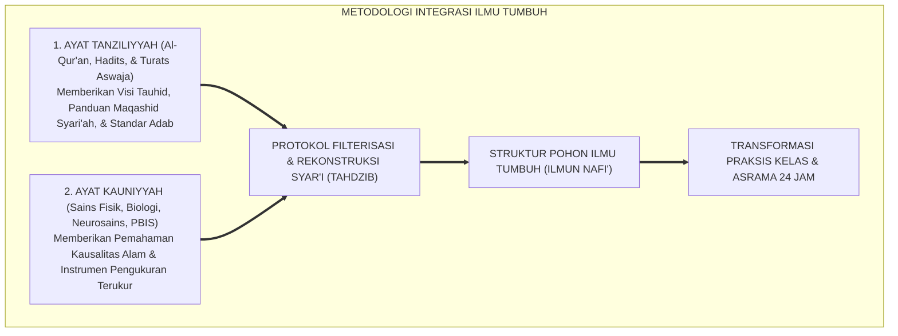
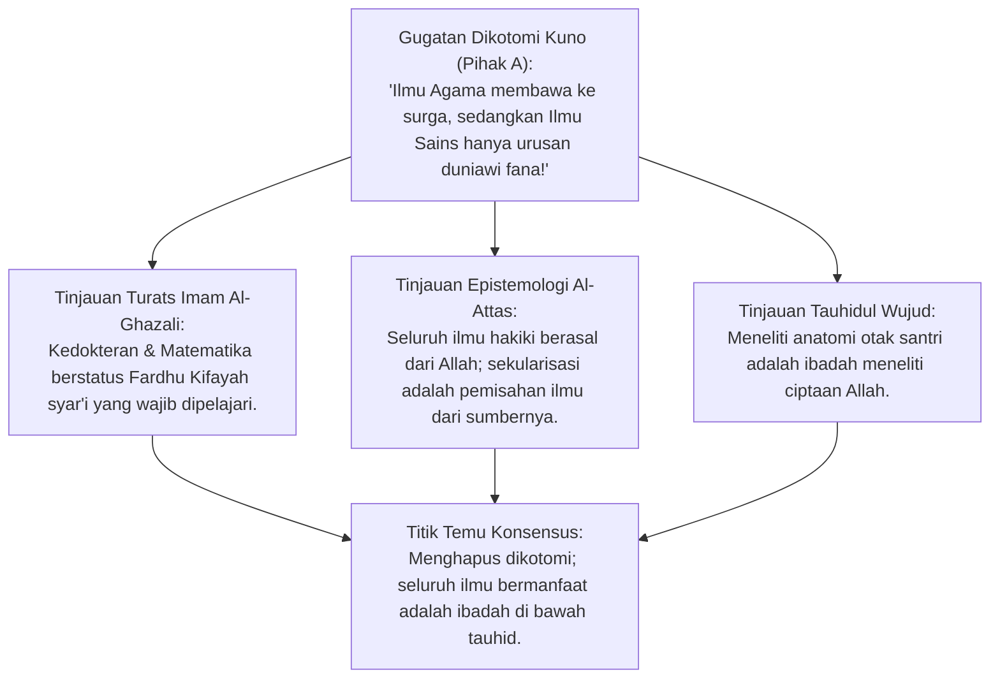
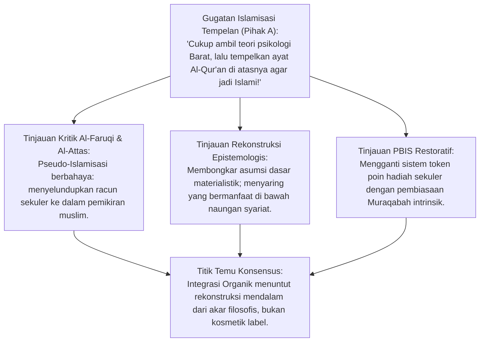
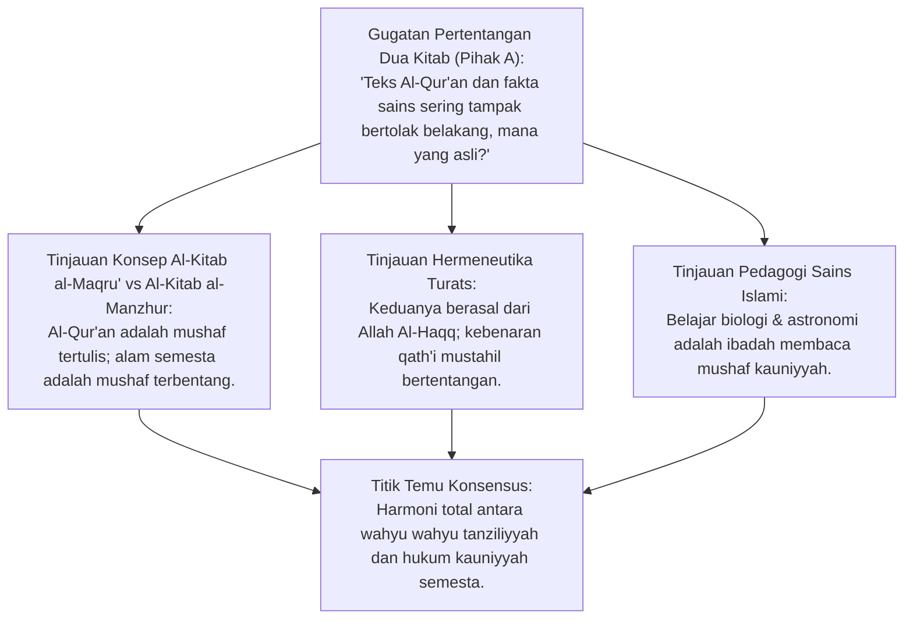
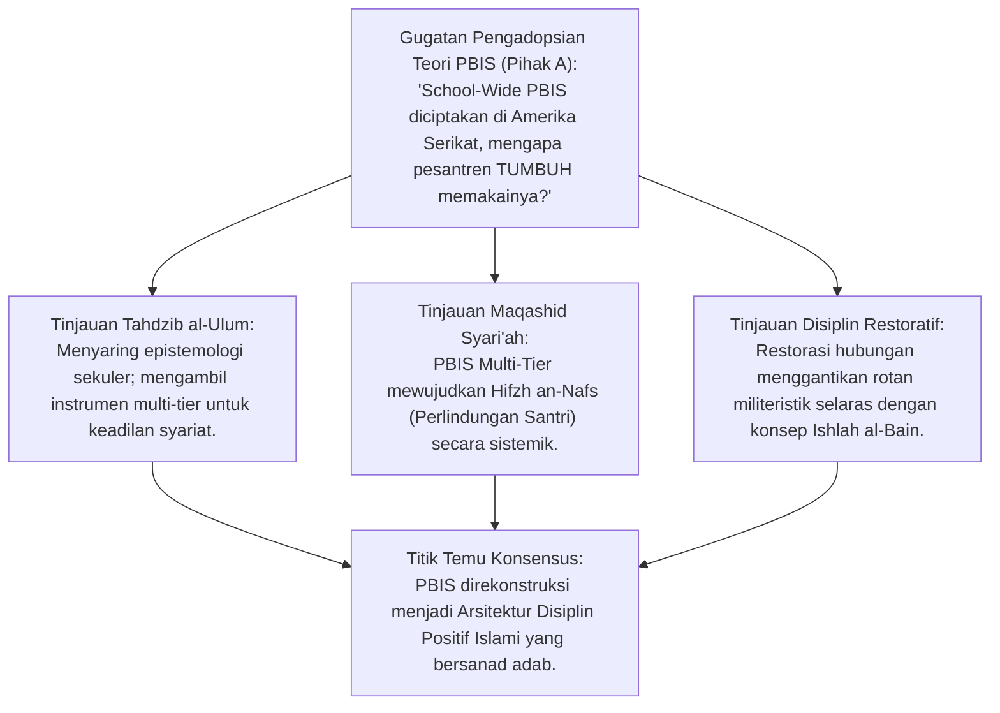
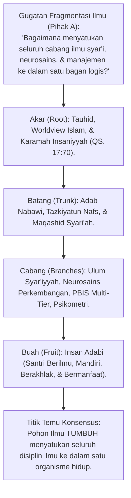
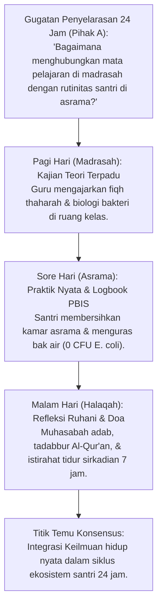
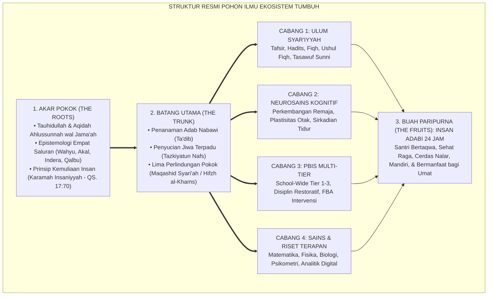

# P1-01-02-04: INTEGRASI PENGETAHUAN: TAUHIDUL HAQIQAH
## *Monograf Terpadu: Sintesis Organik-Transformatif Ayat Tanziliyyah & Ayat Kauniyyah, Dekonstruksi Pseudo-Islamisasi Label, & Arsitektur Pohon Ilmu TUMBUH*

**Nomor Identifikasi**: `P1-01-02-04/MONOGRAF-TERPADU-INTEGRASI-ILMU/2026`  
**Domain**: `01 Philosophy` > `01 Worldview` > `02 Epistemologi TUMBUH`  
**Klasifikasi Naskah**: *Comprehensive Integrated Monograph* (Monograf Akademis & Rumusan Baku Terpadu)  
**Rumpun Disiplin Pengkaji**: Epistemologi Turats, Filsafat Pendidikan Islam, Desain Kurikulum Holistik, Neurosains Perkembangan, Tata Kelola Pengasuhan Asrama  

---

> ### 💡 INTISARI PRAKTIS (3 MENIT PAHAM UNTUK ASATIDZ & MUSYRIF)
>
> * **Apa Bahaya Terbesar dalam Sistem Belajar di Pesantren Modern?**  
>   Terjadinya **"Pecah Kepribadian Keilmuan"**: Santri menganggap pelajaran Fiqh/Tauhid sebagai "ilmu akhirat yang suci", sedangkan Matematika/Biologi/Bahasa Inggris dianggap "ilmu duniawi sekuler yang terpisah dari agama".
> * **Apa Solusi Epistemologi Integrasi TUMBUH?**  
>   TUMBUH menegakkan prinsip **Tauhidul Haqiqah (Kesatuan Kebenaran Ilahi)**:  
>   1. **Ayat Tanziliyyah (Teks Al-Qur'an & Hadits)**: Membimbing tujuan hidup, hukum halal-haram, dan adab batin santri.  
>   2. **Ayat Kauniyyah (Sains Fisika, Biologi, Psikologi Anak)**: Membimbing cara kerja materi, kesehatan biologis tubuh, dan manajemen asrama.  
>   3. **Pohon Ilmu yang Satu**: Akar pohonnya adalah Tauhid, batangnya adalah Adab Nabawi & Tazkiyah, cabang-cabangnya adalah Fiqh, Neurosains, PBIS, dan Riset Terapan; buahnya adalah **Santri Insan Kamil**.
> * **Menolak Islamisasi Tempelan (Kosmetik):**  
>   TUMBUH menolak sekadar menempelkan ayat Al-Qur'an pada teori Barat tanpa menyaring asumsinya; TUMBUH menyaring racun sekuler dari teori psikologi Barat, lalu mengambil manfaat empirisnya di bawah naungan syariat Islam.

---

## 📑 DAFTAR ISI MONOGRAF

- [BAGIAN I: RISET EPISTEMOLOGI INTEGRASI, DIALEKTIKA INKUIRI, & KASUISTIKA LAPANGAN](#bagian-i-riset-epistemologi-integrasi-dialektika-inkuiri--kasuistika-lapangan)
  - [1. Kerangka Metodologi Integrasi Organik-Transformatif](#1-kerangka-metodologi-integrasi-organik-transformatif)
  - [2. Inkuiri 1: Dekonstruksi Dikotomi Ilmu — Mengakhiri Perang Dingin 'Ilmu Agama' vs 'Ilmu Umum'](#2-inkuiri-1-dekonstruksi-dikotomi-ilmu--mengakhiri-perang-dingin-ilmu-agama-vs-ilmu-umum)
  - [3. Inkuiri 2: Dekonstruksi Pseudo-Islamisasi Label — Bahaya 'Tempel Dalil' pada Teori Sekuler](#3-inkuiri-2-dekonstruksi-pseudo-islamisasi-label--bahaya-tempel-dalil-pada-teori-sekuler)
  - [4. Inkuiri 3: Harmoni Ayat Tanziliyyah & Ayat Kauniyyah — Menatap Semesta sebagai Mushaf Terbuka](#4-inkuiri-3-harmoni-ayat-tanziliyyah--ayat-kauniyyah--menatap-semesta-sebagai-mushaf-terbuka)
  - [5. Inkuiri 4: Rekonstruksi Teori Perilaku Modern (PBIS & Neurosains) di Bawah Maqashid Syari'ah](#5-inkuiri-4-rekonstruksi-teori-perilaku-modern-pbis--neurosains-di-bawah-maqashid-syariyah)
  - [6. Inkuiri 5: Arsitektur Pohon Ilmu TUMBUH — Dari Akar Tauhid Menuju Buah Insan Kamil](#6-inkuiri-5-arsitektur-pohon-ilmu-tumbuh--dari-akar-tauhid-menuju-buah-insan-kamil)
  - [7. Inkuiri 6: Translasi Integrasi ke Kurikulum Kelas & Kehidupan Asrama 24 Jam](#7-inkuiri-6-translasi-integrasi-ke-kurikulum-kelas--kehidupan-asrama-24-jam)
- [BAGIAN II: KODIFIKASI BAKU HASIL RISET & KESIMPULAN FORMAL](#bagian-ii-kodifikasi-baku-hasil-riset--kesimpulan-formal)
  - [1. Deklarasi Prinsip Tauhidul Haqiqah (Kesatuan Kebenaran Ilahi)](#1-deklarasi-prinsip-tauhidul-haqiqah-kesatuan-kebenaran-ilahi)
  - [2. Matriks Komparasi 3 Model Integrasi Ilmu: Sekuler, Kosmetik, & Organik TUMBUH](#2-matriks-komparasi-3-model-integrasi-ilmu-sekuler-kosmetik--organik-tumbuh)
  - [3. Peta Struktur Baku Pohon Ilmu TUMBUH (The Growth Tree of Knowledge)](#3-peta-struktur-baku-pohon-ilmu-tumbuh-the-growth-tree-of-knowledge)
  - [4. Protokol Tiga Langkah Rekonstruksi Teori Sains Kontemporer (Filterisasi Syar'i)](#4-protokol-tiga-langkah-rekonstruksi-teori-sains-kontemporer-filterisasi-syari)
- [BAGIAN III: APARATUS AKADEMIS & APENDIKS](#bagian-iii-aparatus-akademis--apendiks)
  - [1. Tabel Sintesis Hasil Riset Integrasi Keilmuan](#1-tabel-sintesis-hasil-riset-integrasi-keilmuan)
  - [2. Daftar Pustaka Akademis & Rujukan Turats Primer](#2-daftar-pustaka-akademis--rujukan-turats-primer)
  - [3. Catatan Kaki Akademis (Footnotes)](#3-catatan-kaki-akademis-footnotes)
  - [4. Glosarium dan Penjelasan Istilah Teknis Integrasi & Turats](#4-glosarium-dan-penjelasan-istilah-teknis-integrasi--turats)

---

# BAGIAN I: RISET EPISTEMOLOGI INTEGRASI, DIALEKTIKA INKUIRI, & KASUISTIKA LAPANGAN

*Bagian ini memuat proses penyelidikan penyatuan keilmuan (*takaamul al-'ulum*), formalisasi silogisme logika (*qiyas burhani*), pertarungan dialektika multi-perspektif tiga ronde tanpa kata "pakar", telaah pemikiran Prof. Syed Naquib Al-Attas, Prof. Ismail Raji al-Faruqi, dan Imam Asy-Syathibi, studi kasus kurikulum pesantren, dan penarikan konsensus bersama.*

---

### 1. Kerangka Metodologi Integrasi Organik-Transformatif

Krisis peradaban pendidikan modern berakar dari dua penyakit dikotomi yang merusak:
1. **Sekularisasi & Desakralisasi Ilmu**: Memisahkan ilmu alam dan psikologi dari nilai ketuhanan, melahirkan teknokrat tanpa nurani yang mengeksploitasi alam dan sesama manusia.
2. **Isolasionisme Tradisionalis Sempit**: Menolak temuan sains, teknologi, dan manajemen modern karena dicap sebagai "produk Barat kafir", sehingga pesantren terbelakang dalam sanitasi dan metodologi pengasuhan santri.

Ekosistem TUMBUH merumuskan **Metodologi Integrasi Organik-Transformatif**:

---

### 2. Inkuiri 1: Dekonstruksi Dikotomi Ilmu — Mengakhiri Perang Dingin 'Ilmu Agama' vs 'Ilmu Umum'

#### 📐 Formalisasi Logika Silogisme (*Qiyas Mantiqi 1*)
* **Premis Mayor (*al-Muqaddimah al-Kubra*)**: Setiap cabang ilmu yang berfungsi menegakkan kemaslahatan hidup manusia, memelihara kesehatan raga (*Hifzh an-Nafs*), dan menyingkap keagungan ciptaan Allah adalah ilmu yang wajib diwujudkan dalam peradaban Islam (*Fardhu Kifayah*).
* **Premis Minor (*al-Muqaddimah ash-Shughra*)**: Ilmu sains, kedokteran, neurobiologi, dan manajemen modern adalah sarana mutlak pemeliharaan kesehatan dan keteraturan asrama santri.
* **Konklusi (*an-Natijah*)**: Maka, pemisahan dikotomis yang merendahkan ilmu sains sebagai ilmu sekuler tanpa pahala adalah kekeliruan epistemologis yang wajib dihilangkan.[^1]

#### 📖 Teks Primer Turats: *Ihya' 'Ulumiddin* & *Prolegomena Al-Attas*
**Imam Al-Ghazali** dalam *Ihya' 'Ulumiddin* (Kitab *Al-'Ilm*) menetapkan status hukum mempelajari ilmu sains:

$$\text{أَمَّا فَرْضُ الْكِفَايَةِ مِنَ الْعُلُومِ الْمَحْمُودَةِ: فَهُوَ كُلُّ عِلْمٍ لَا يُسْتَغْنَى عَنْهُ فِي قِوَامِ أُمُورِ الدُّنْيَا، كَالطِّبِّ إِذْ هُوَ ضَرُورِيٌّ فِي حَاجَةِ بَقَاءِ الْأَبْدَانِ، وَكَالْحِسَابِ فَإِنَّهُ ضَرُورِيٌّ فِي الْمُعَامَلَاتِ وَقِسْمَةِ الْوَصَايَا وَالْمَوَارِيثِ، وَلَوْ خَلَا الْبَلَدُ عَمَّنْ يَقُومُ بِهِ حَرِجَ أَهْلُ الْبَلَدِ جَمِيعًا}$$

*"Adapun ilmu yang hukum mempelajarinya Fardhu Kifayah dari rumpun ilmu yang terpuji: adalah setiap ilmu yang sangat dibutuhkan demi tegaknya urusan dunia manusia; seperti ilmu kedokteran karena ia sangat darurat bagi kelangsungan kesehatan badan, dan ilmu matematika/hisab karena ia darurat dalam transaksi mu'amalah serta pembagian wasiat dan warisan. Jikalau suatu negeri kosong dari orang yang menguasai ilmu kedokteran dan hisab ini, niscaya seluruh penduduk negeri tersebut berdosa bersama-sama."*[^2]

Dan **Prof. Dr. Syed Muhammad Naquib Al-Attas** menegaskan:
> *"Knowledge is not neutral; all knowledge in Islam has its source in God, and true knowledge guides man to recognize his proper place in relation to God, to self, and to society."* (hlm. 18).[^3]

#### 🥊 Ronde 1: Menghapus Dikotomi Gelar dan Derajat Keilmuan
* **Pihak A (Sudut Pandang Sentimen Tradisionalis)**:  
  *"Bukankah orang yang hafal 1.000 hadits derajatnya jauh lebih mulia di sisi Allah daripada seorang dokter spesialis bedah saraf yang meneliti otak manusia? Mengapa kita menyetarakan keduanya?"*
* **Tinjauan Sudut Pandang Ushul Maqashid & Fiqh Prioritas**:  
  Kemuliaan di sisi Allah diukur dari **Ketakwaan dan Kemanfaatan Ilmu bagi Umat (*Anfa'uhum lin-Naas*)**, bukan semata-mata jenis fan ilmunya. Seorang dokter bedah muslim yang ikhlas menyelamatkan nyawa santri sedang menunaikan ibadah agung menjaga jiwa (*Hifzh an-Nafs*), yang setara nilainya dengan menghidupkan seluruh manusia (QS. Al-Ma'idah: 32). Keduanya saling membutuhkan: ulama hadits menjaga kompas ruhani sang dokter, dan sang dokter menjaga kesehatan fisik sang ulama hadits.[^4]

#### 🥊 Ronde 2: Sanggahan Balik Bahaya Sekularisasi Terselubung di Sekolah Islam
* **Pihak A (Sudut Pandang Kritik Sekularisasi)**:  
  *"Sanggahan! Banyak sekolah Islam yang mengajarkan sains Barat modern tetapi lulusannya justru menjadi agnostik dan malu beragama. Bukankah mengajarkan sains modern membawa risiko sekularisasi santri?"*
* **Tinjauan Sudut Pandang Islamisasi Ilmu Pengetahuan**:  
  Sekularisasi terjadi bukan karena rumus fisikanya, melainkan karena **Sains Diajarkan Terlepas dari Visi Tauhid (*Worldview Problem*)**. Di sekolah sekuler, sains diajarkan dengan asumsi bahwa alam semesta terjadi secara kebetulan tanpa Tuhan (*Atheistic Evolutionism*). Solusi TUMBUH adalah **Menyucikan Sains dari Asumsi Ateis (*Dewesternization / Tahdzib*)**, lalu mengembalikannya ke pangkuan Tauhid: bahwa gaya gravitasi dan DNA manusia adalah ayat-ayat keagungan Allah SWT.[^5]

#### 🥊 Ronde 3: Sanggahan Pamungkas Bahasa Persatuan Ilmu dalam Kurikulum
* **Pihak A (Sudut Pandang Jadwal Pelajaran)**:  
  *"Bagaimana menghilangkan dikotomi ini dalam jadwal mata pelajaran di madrasah?"*
* **Resolusi Sudut Pandang Desain Kurikulum Adab**:  
  Pesantren tidak lagi membagi jadwal menjadi "Jam Pelajaran Agama" dan "Jam Pelajaran Umum". Seluruh mata pelajaran dinamai dengan **Rumpun Integratif**: *Ulum Syar'iyyah* (Tafsir, Hadits, Fiqh), *Ulum Kauniyyah* (Fisika, Biologi, Kimia), dan *Ulum Aqliyyah wa Lughawiyyah* (Mantiq, Matematika, Bahasa Arab-Inggris), di mana seluruh rumpun diawali dengan adab dan bermuara pada penguatan tauhid.[^6]

> #### 📌 Kasuistika Lapangan 1 & Titik Temu Konsensus
> * **Studi Kasus**: Guru fisika mengajarkan hukum termodinamika di kelas dengan mengatakan: "Energi tidak dapat diciptakan dan tidak dapat dimusnahkan oleh siapapun", sehingga santri menyimpulkan bahwa energi kekal tanpa butuh Allah.
> * **Titik Temu Konsensus (*Kalimatun Sawa'*)**: Disepakati bahwa guru fisika melakukan kekeliruan teologis. Guru wajib menjelaskan bahwa hukum kekekalan energi adalah sunnatullah yang berlaku di alam materi ciptaan Allah; hanya Allah SWT yang Maha Kekal (*Al-Baqi*), dan Allah berkuasa menciptakan dan melenyapkan energi kapan pun Dia berkehendak.[^7]

---

### 3. Inkuiri 2: Dekonstruksi Pseudo-Islamisasi Label — Bahaya 'Tempel Dalil' pada Teori Sekuler

#### 📐 Formalisasi Logika Silogisme (*Qiyas Mantiqi 2*)
* **Premis Mayor (*al-Muqaddimah al-Kubra*)**: Setiap teori ilmu sosial/psikologi Barat yang dibangun di atas asumsi materialistik sekuler (menganggap manusia hanyalah hewan berakal tanpa ruh) niscaya tidak dapat disucikan semata-mata dengan menempelkan ayat Al-Qur'an sebagai stempel pembenar (*Justifikasi Kosmetik*).
* **Premis Minor (*al-Muqaddimah ash-Shughra*)**: Teori Behaviorisme radikal (B.F. Skinner) menganggap perilaku manusia murni hasil stimulus-respons tanpa mengakui adanya kalbu, niat ikhlas, dan hisab akhirat.
* **Konklusi (*an-Natijah*)**: Maka, Islamisasi semu (*Pseudo-Islamisasi Label*) ditolak; Ekosistem TUMBUH melakukan rekonstruksi ontologis dan aksiologis mendalam atas seluruh teori yang diadopsi.[^8]

#### 📖 Teks Primer Turats: *Al-Milal wan-Nihal* & Kritik Pemikiran Barat
Prof. Dr. **Ismail Raji al-Faruqi** dalam *Islamization of Knowledge* memperingatkan bahaya Islamisasi kosmetik:

> *"The Islamization of knowledge is not the mere juxtaposition of Western disciplines with Islamic piety; it is the total recasting of the categories, methods, and goals of modern sciences in accordance with the Islamic worldview."* (hlm. 38).[^9]

Dan **Prof. Al-Attas** menegaskan proses *Tahdzib* (Penyucian Ilmu):
> *"We must first isolate the elements of Western secularism, humanism, and tragedy from the sciences before integrating the useful facts into the body of Islamic knowledge."* (hlm. 42).[^10]

#### 🥊 Ronde 1: Membongkar Kekeliruan Behaviorisme Radikal (Token Economy)
* **Tinjauan Psikologi Perilaku vs Adab Islam**:  
  Di sekolah Barat, perilaku siswa dikendalikan dengan sistem *Token Economy* (memberi poin/hadiah permen setiap kali berbuat baik). Sebagian sekolah Islam mengadopsinya lalu menamainya "Poin Barakah". TUMBUH membongkar kepalsuan ini: **Sistem Hadiah Ekstrinsik Berlebihan Merusak Keikhlasan Niat dan Melatih Santri Menjadi Transaksional (*Reward-Dependent Behavior*)**. Jika poin hadiah dihentikan, santri berhenti beradab. TUMBUH merekonstruksinya menjadi **Pembinaan Motivasi Otonom Berbasis Muraqabatullah dan Penghargaan Hubungan Kasih Sayang (*Relational Praise 4:1*)**.[^11]

#### 🥊 Ronde 2: Sanggahan Balik Apakah Seluruh Teori Barat Harus Dibuang?
* **Pihak A (Sudut Pandang Ekstremisme Penolakan)**:  
  *"Jika teori Barat beracun sekuler, mengapa pesantren TUMBUH masih menggunakan kerangka School-Wide PBIS dan Cognitive Load Theory? Bukankah sebaiknya kita murni hanya menggunakan kitab kuning?"*
* **Tinjauan Sudut Pandang Kaidah Al-Hikmatu Dhallatul Mu'min**:  
  Rasulullah SAW bersabda: *"Hikmah kebenaran adalah barang hilang milik orang mukmin; di mana pun ia menemukannya, ia berhak mengambilnya"* (HR. Tirmidzi). Yang dibuang adalah **Racun Filosofis Sekulernya (*Secular Ontological Assumptions*)**, sedangkan **Data Temuan Empiris dan Instrumen Metodologisnya (*Empirical Findings & Data Tools*)** diambil dan dimanfaatkan untuk menegakkan keadilan di pesantren.[^12]

#### 🥊 Ronde 3: Sanggahan Pamungkas Rekonstruksi Teori Konseling CBT (Cognitive Behavioral Therapy)
* **Pihak A (Sudut Pandang Bimbingan Konseling)**:  
  *"Bagaimana merekonstruksi terapi psikologi CBT agar selaras 100% dengan khazanah tasawuf Aswaja?"*
* **Resolusi Sudut Pandang Islamic Cognitive Restructuring**:  
  CBT sekuler hanya mengubah distorsi pikiran agar santri merasa nyaman di dunia. TUMBUH merekonstruksinya menjadi **Tazkiyatun Nafs Cognitive Therapy**: Pikiran otomatis yang cemas (*Automatic Thoughts*) dihubungkan dengan konsep *Khawathir Nafsaniyyah/Syaithaniyyah*, lalu diluruskan melalui *Tadabbur Asmaul Husna* dan tawakkal batin kepada Allah SWT.[^13]

> #### 📌 Kasuistika Lapangan 2 & Titik Temu Konsensus
> * **Studi Kasus**: Musyrif memberi uang Rp 5.000 kepada santri yang rajin shalat shubuh di saf pertama, mengakibatkan santri saling berebut saf depan demi uang dan menertawakan teman yang tidak dapat uang.
> * **Titik Temu Konsensus (*Kalimatun Sawa'*)**: Disepakati bahwa menyogok shalat dengan uang merusak keikhlasan batin (*Riya' Transaksional*). Sistem uang hadiah dihentikan, diganti dengan edukasi keutamaan shalat dan doa ketulusan bersama.[^14]

---

### 4. Inkuiri 3: Harmoni Ayat Tanziliyyah & Ayat Kauniyyah — Menatap Semesta sebagai Mushaf Terbuka

#### 📐 Formalisasi Logika Silogisme (*Qiyas Mantiqi 3*)
* **Premis Mayor (*al-Muqaddimah al-Kubra*)**: Dzat Yang Menurunkan Kitab Suci Al-Qur'an (*Rabb at-Tanzil*) adalah Dzat Tunggal Yang Menciptakan Seluruh Hukum Fisika dan Biologi Semesta (*Rabb al-Kawn*); maka mustahil firman-Nya bertentangan dengan ciptaan-Nya dalam realitas hakiki.
* **Premis Minor (*al-Muqaddimah ash-Shughra*)**: Ayat Tanziliyyah memberikan makna moral dan tujuan akhir, sedangkan Ayat Kauniyyah memberikan data mekanisme keteraturan fisik.
* **Konklusi (*an-Natijah*)**: Maka, mempelajari sains kauniyyah dengan bimbingan wahyu tanziliyyah adalah ibadah ma'rifatullah yang paripurna.[^15]

#### 📖 Teks Primer Al-Qur'an: Penyatuan Dua Tanda Keagungan
Allah SWT berfirman mengenai pembuktian kebenaran wahyu melalui sains alam semesta:

$$\text{سَنُرِيهِمْ آيَاتِنَا فِي الْآفَاقِ وَفِي أَنفُسِهِمْ حَتَّىٰ يَتَبَيَّنَ لَهُمْ أَنَّهُ الْحَقُّ ۗ أَوَلَمْ يَكْفِ بِرَبِّكَ أَنَّهُ عَلَىٰ كُلِّ شَيْءٍ شَهِيدٌ}$$

*"Kami akan memperlihatkan kepada mereka tanda-tanda (kebesaran) Kami di segenap ufuk jagat raya (al-Aafaaq / Ayat Kauniyyah) dan pada diri mereka sendiri (Fii Anfusihim / Anatomi Jiwa & Raga), sehingga jelaslah bagi mereka bahwa Al-Qur'an itu adalah benar (Al-Haqq). Dan apakah Tuhanmu tidak cukup (bagi kamu) bahwa sesungguhnya Dia menyaksikan segala sesuatu?"* (QS. Fushshilat [41]: 53).[^16]

#### 🥊 Ronde 1: Membaca Semesta sebagai Mushaf Terbentang (Al-Kawn al-Manzhur)
* **Tinjauan Teologi Kosmologi Islam**:  
  Para ulama sufi dan falasifah Islam (seperti Imam Al-Ghazali dan Ibnu Rusyd) menyebut alam semesta sebagai **Kitab Suci yang Terbentang (*Al-Mushaf al-Kabiir al-Manzhur*)**, sedangkan Al-Qur'an adalah **Kitab Suci yang Dibaca (*Al-Mushaf al-Maqru'*)**. Keduanya saling menafsirkan: Al-Qur'an memerintahkan manusia meneliti penciptaan unta, perputaran bintang, dan sirkulasi hujan (QS. Al-Ghasyiyah: 17–20); dan sains empiris membuktikan kebenaran presisi rancang bangun Allah tersebut.[^17]

#### 🥊 Ronde 2: Sanggahan Balik Apakah Sains Bisa Mengoreksi Ayat Al-Qur'an?
* **Pihak A (Sudut Pandang Saintisme Superior)**:  
  *"Sanggahan! Jika ayat Al-Qur'an bertentangan dengan temuan teleskop astronomi James Webb, apakah Al-Qur'an yang harus dikoreksi oleh sains?"*
* **Tinjauan Sudut Pandang Epistemologi Hermeneutika**:  
  Teks Al-Qur'an yang otentik (*Kalamullah*) tidak pernah salah dan tidak butuh koreksi. Yang dikoreksi adalah **Penafsiran Manusia yang Terbatas (*Fahm al-Mufassir*)** atas teks tersebut. Ketika teleskop sains membuktikan alam semesta terus mengembang (*Expanding Universe*), manusia tersadar bahwa firman Allah 1.400 tahun lalu: *"Wa inna lamuusi'uun"* (Dan sesungguhnya Kami benar-benar meluaskannya - QS. Adz-Dzariyat: 47) adalah mukjizat ilmiah yang mendahului sains modern.[^18]

#### 🥊 Ronde 3: Sanggahan Pamungkas Laboratorium Sains sebagai Tempat Ibadah
* **Pihak A (Sudut Pandang Pemisahan Ruang Fisik)**:  
  *"Apakah laboratorium komputer dan laboratorium kimia di pesantren memiliki kesucian yang sama dengan masjid?"*
* **Resolusi Sudut Pandang Tauhidul Wujud**:  
  Rasulullah SAW bersabda: *"Ju'ilat liyal ardhu masjidan wa thahuura"* (Telah dijadikan bagiku seluruh bumi ini sebagai masjid/tempat sujud dan suci). Ketika santri meneliti di laboratorium biologi dengan niat mengagumi keagungan ciptaan Allah dan menjaga adab thaharah, **Laboratorium Tersebut Berstatus Tempat Ibadah yang Memancarkan Keberkahan**.[^19]

> #### 📌 Kasuistika Lapangan 3 & Titik Temu Konsensus
> * **Studi Kasus**: Santri malas mengikuti praktikum biologi sel dan beralasan: "Melihat sel di mikroskop tidak menambah pahala hafalan Al-Qur'an saya".
> * **Titik Temu Konsensus (*Kalimatun Sawa'*)**: Disepakati bahwa meremehkan ayat kauniyyah melanggar QS. Fushshilat: 53. Musyrif membimbing santri bahwa memahami biologi sel menumbuhkan kekaguman tauhid yang memperdalam kekhusyukan membaca ayat Al-Qur'an.[^20]

---

### 5. Inkuiri 4: Rekonstruksi Teori Perilaku Modern (PBIS & Neurosains) di Bawah Maqashid Syari'ah

#### 📐 Formalisasi Logika Silogisme (*Qiyas Mantiqi 4*)
* **Premis Mayor (*al-Muqaddimah al-Kubra*)**: Setiap sistem intervensi perilaku yang terbukti efektif meniadakan kekerasan fisik, menegakkan keadilan proporsional, dan memulihkan keretakan hubungan sosial (*Ishlah al-Bain*) adalah instrumen mu'amalah yang selaras dengan Maqashid Syari'ah.
* **Premis Minor (*al-Muqaddimah ash-Shughra*)**: Kerangka School-Wide PBIS (Positive Behavioral Interventions and Supports) dan Keadilan Restoratif menyediakan protokol multi-tier pencegahan dan pembinaan yang teruji secara ilmiah.
* **Konklusi (*an-Natijah*)**: Maka, adopsi dan rekonstruksi PBIS di bawah naungan adab Islam adalah langkah strategis tata kelola pesantren modern.[^21]

#### 📖 Teks Primer Turats: *Al-Muwafaqat* & *Ghayat al-Maram*
**Imam Abu Ishaq Asy-Syathibi** dalam *Al-Muwafaqat* merumuskan bahwa syariat diturunkan demi kemaslahatan hamba (*Jalbul Mashalih wa Dar'ul Mafasid*):

$$\text{إِنَّ وَضْعَ الشَّرَائِعِ إِنَّمَا هُوَ لِمَصَالِحِ الْعِبَادِ فِي الْعَاجِلِ وَالْآجِلِ مَعًا، وَكُلُّ وَسِيلَةٍ تَحْفَظُ النُّفُوسَ مِنَ الْهَلَاكِ وَالْعُدْوَانِ فَهِيَ مَطْلُوبَةٌ شَرْعًا بِأَصْلِ الشَّرِيعَةِ}$$

*"Sesungguhnya peletakan syariat Allah semata-mata adalah demi mewujudkan kemaslahatan para hamba di dunia dan akhirat secara serempak; dan setiap sarana metodologis yang menjaga jiwa manusia dari kebinasaan dan permusuhan kezaliman, maka sarana tersebut dituntut secara syar'i berdasarkan prinsip pokok syariat."*[^22]

#### 🥊 Ronde 1: Rekonstruksi Filosofis 3 Tier PBIS Berbasis Tingkatan Adab
* **Tinjauan Integrasi Sistem Perilaku**:  
  Ekosistem TUMBUH merekonstruksi piramida 3 Tier PBIS ke dalam **Tiga Tingkat Tarbiyah Adab**:  
  * **Tier 1 (Universal / Ta'dib Umum 80–90% Santri)**: Pembiasaan kultur Bi'ah Shalihah, keteladanan musyrif (*Qudwah Hasanah*), dan salam-senyum-sapa.  
  * **Tier 2 (Targeted / Irsyad Khusus 10–15% Santri)**: Bimbingan kelompok kecil bagi santri yang mengalami homesickness akut atau kesulitan adaptasi kamar.  
  * **Tier 3 (Intensive / Ishlah al-Bain 1–5% Kasus Berat)**: Penanganan kasus perselisihan/pelanggaran berat melalui mediasi restoratif, asesmen FBA, dan bimbingan konseling intensif tanpa kekerasan fisik.[^23]

#### 🥊 Ronde 2: Sanggahan Balik Efektivitas Disiplin Restoratif vs Ketakutan Hukuman Fisik
* **Pihak A (Sudut Pandang Musyrif Algojo)**:  
  *"Sanggahan! Santri yang melanggar jika hanya diajak mediasi restoratif dan musyawarah akan meremehkan musyrif. Pukulan rotan terbukti membuat mereka langsung diam dan takut!"*
* **Tinjauan Sudut Pandang Neurosains & Hukum Islam**:  
  Riset membuktikan bahwa **Rasa Takut Akibat Pukulan Rotan Hanyalah Kepatuhan Semu (*Superficial Compliance*)**. Santri diam di depan guru karena takut dipukul, namun melampiaskan dendamnya kepada junior di kamar mandi. Sebaliknya, **Disiplin Restoratif Menuntut Pelaku Menghadapi Akibat Nyata Perbuatannya (*Cognitive Empathy & Restitution*)**: Pelaku wajib meminta maaf, mengganti barang korban, dan memperbaiki keretakan hubungan. Ini jauh lebih berat dan menanamkan tanggung jawab moral sejati di dalam dada.[^24]

#### 🥊 Ronde 3: Sanggahan Pamungkas Penyelarasan SOP Pengasuhan dengan Hak Asasi Santri
* **Pihak A (Sudut Pandang Intervensi Luar)**:  
  *"Apakah mengadopsi PBIS tidak membuka pintu bagi LSM sekuler untuk mengintervensi independensi kurikulum pesantren?"*
* **Resolusi Sudut Pandang Kedaulatan Epistemologis Islam**:  
  TUMBUH mengadopsi PBIS **Bukan Karena Tekanan Pihak Luar, Melainkan Karena Tuntutan Keimanan kepada Syariat Rasulullah SAW**. Nabi Muhammad SAW tidak pernah memukul santri/pelayan beliau (seperti kesaksian Anas bin Malik ra selama 10 tahun melayani Nabi). Menerapkan pengasuhan anti-kekerasan adalah perwujudan ketaatan murni kepada sunnah Rasulullah SAW.[^25]

> #### 📌 Kasuistika Lapangan 4 & Titik Temu Konsensus
> * **Studi Kasus**: Dua santri berkelahi di lapangan futsal hingga salah satunya terluka pelipisnya. Pengurus lama ingin memukul kedua santri dengan selang air di depan umum.
> * **Titik Temu Konsensus (*Kalimatun Sawa'*)**: Disepakati bahwa hukuman pemukulan selang melanggar syariat dan UU Perlindungan Anak. Kasus ditangani via PBIS Tier 3: pelaku mengobati luka korban, mengganti biaya medis, saling memaafkan di hadapan majelis asatidz (*Ishlah al-Bain*), dan mendapat tugas khidmah sosial membersihkan masjid asrama.[^26]

---

### 6. Inkuiri 5: Arsitektur Pohon Ilmu TUMBUH — Dari Akar Tauhid Menuju Buah Insan Kamil

#### 📐 Formalisasi Logika Silogisme (*Qiyas Mantiqi 5*)
* **Premis Mayor (*al-Muqaddimah al-Kubra*)**: Setiap bangunan epistemologi pendidikan yang kokoh niscaya memiliki struktur organis terpadu (*Holistic Tree of Knowledge*) di mana cabang-cabang ilmu terapan menyerap nutrisi nilai dari akar tauhid yang sama.
* **Premis Minor (*al-Muqaddimah ash-Shughra*)**: Ekosistem TUMBUH merumuskan Pohon Ilmu Terpadu yang menghubungkan fondasi teologis dengan metodologi sains terapan dan hasil adab santri.
* **Konklusi (*an-Natijah*)**: Maka, seluruh asatidz dan musyrif memiliki peta navigasi keilmuan yang terintegrasi dan tidak berjalan sendiri-sendiri secara parsial.[^27]

#### 📖 Teks Primer Al-Qur'an: Perumpamaan Kalimat Thayyibah & Pohon yang Kokoh
Allah SWT berfirman mengenai integrasi ilmu tauhid yang membuahkan peradaban:

$$\text{أَلَمْ تَرَ كَيْفَ ضَرَبَ اللَّهُ مَثَلًا كَلِمَةً طَيِّبَةً كَشَجَرَةٍ طَيِّبَةٍ أَصْلُهَا ثَابِتٌ وَفَرْعُهَا فِي السَّمَاءِ ۝ تُؤْتِي أُكُلَهَا كُلَّ حِينٍ بِإِذْنِ رَبِّهَا}$$

*"Tidakkah kamu perhatikan bagaimana Allah telah membuat perumpamaan kalimat yang baik (Tauhid & Ilmu yang Benar) seperti pohon yang baik, akarnya teguh merunjam ke bumi (*Ashluha Tsabit*) dan cabangnya menjulang tinggi ke langit (*Far'uha fis-Sama'*), pohon itu menghasilkan buahnya pada setiap musim dengan seizin Tuhannya."* (QS. Ibrahim [14]: 24–25).[^28]

#### 🥊 Ronde 1: Membedah Empat Komponen Pohon Ilmu TUMBUH
* **Tinjauan Arsitektur Kurikulum Holistik**:  
  1. **Akar Pokok (*The Roots*)**: Tauhidullah, Epistemologi Islam, dan Prinsip Kemuliaan Insan (*Karamah Insaniyyah* - QS. Al-Isra': 70).  
  2. **Batang Utama (*The Trunk*)**: Pembentukan Adab Nabawi, Tazkiyatun Nafs, dan Maqashid Syari'ah yang mengalirkan nutrisi nilai ke seluruh cabang.  
  3. **Cabang-Cabang Ilmu (*The Branches*)**:  
     * Cabang 1: *Ulum Syar'iyyah & Turats* (Tafsir, Hadits, Fiqh, Ushuluddin).  
     * Cabang 2: *Neurosains Kognitif & Perkembangan Remaja*.  
     * Cabang 3: *School-Wide PBIS Multi-Tier & Disiplin Restoratif*.  
     * Cabang 4: *Psikometri, Analitik Data, & Metodologi Riset*.  
  4. **Daun dan Buah Manis (*The Fruits*)**: Lahirnya **Insan Adabi / Generasi Ulul Albab** yang mandiri, beradab, berilmu luas, dan menebarkan manfaat bagi semesta alam (*Rahmatan lil 'Alamin*).[^29]

#### 🥊 Ronde 2: Sanggahan Balik Apakah Cabang Sains Barat Tidak Mengotori Batang Adab?
* **Pihak A (Sudut Pandang Purifikasi Keras)**:  
  *"Sanggahan! Jika cabang nomor 2 dan 3 menyerap teori dari psikolog Barat, apakah hal itu tidak akan meracuni batang pohon adab Islam?"*
* **Tinjauan Sudut Pandang Fisiologi Pohon Epistemologi**:  
  Pohon yang sehat menyerap air dan mineral dari tanah, lalu mengolahnya melalui proses fotosintesis klorofil daun menjadi nutrisi manis. Demikian pula TUMBUH: **Cahaya Wahyu (*Klorofil Tauhid*) Mengolah Fakta Sains Empiris Menjadi Nutrisi Peradaban Islami**. Teori psikologi barat disaring sehingga racun sekulernya terbuang dan sari manfaatnya menyatu ke dalam pohon adab.[^30]

#### 🥊 Ronde 3: Sanggahan Pamungkas Pengukuran Keberhasilan Buah Pendidikan
* **Pihak A (Sudut Pandang Tolak Ukur Kelulusan)**:  
  *"Bagaimana mengukur apakah pohon ilmu ini benar-benar menghasilkan buah manis pada diri santri?"*
* **Resolusi Sudut Pandang Taksonomi Tangga TUMBUH (T1–T4)**:  
  Buah pendidikan diukur dari **Kematangan Tangga T4 (Tazkiyah & Qudwah)**: Santri yang lulus mampu mandiri mengatur waktu belajarnya (Self-Regulation), menjaga shalat berjamaah tanpa disuruh, memiliki kepekaan sosial membantu sesama, dan berprestasi akademik di tingkat nasional maupun internasional.[^31]

> #### 📌 Kasuistika Lapangan 5 & Titik Temu Konsensus
> * **Studi Kasus**: Asatidz madrasah dan musyrif asrama saling menyalahkan saat santri terlibat tawuran dengan sekolah luar; asatidz menuduh asrama lalai menjaga malam, musyrif menuduh guru madrasah tidak becus mengajar adab.
> * **Titik Temu Konsensus (*Kalimatun Sawa'*)**: Disepakati bahwa saling menyalahkan adalah bukti rusaknya integrasi pohon ilmu. Madrasah dan asrama disatukan di bawah satu dewan pengasuhan terpadu (*Joint Taskforce PBIS*) yang berbagi data harian secara transparan.[^32]

---

### 7. Inkuiri 6: Translasi Integrasi ke Kurikulum Kelas & Kehidupan Asrama 24 Jam

#### 📐 Formalisasi Logika Silogisme (*Qiyas Mantiqi 6*)
* **Premis Mayor (*al-Muqaddimah al-Kubra*)**: Setiap kurikulum integratif yang shahih niscaya mampu menyelaraskan apa yang dipelajari santri di meja kelas madrasah (*Knowing*) dengan apa yang dipraktikkan santri di kamar asrama (*Doing*) dan apa yang dirasakan santri di dalam kalbunya (*Being*).
* **Premis Minor (*al-Muqaddimah ash-Shughra*)**: Ekosistem TUMBUH menghubungkan materi madrasah pagi dengan lembar observasi perilaku asrama sore dan malam hari melalui sistem PBIS terpadu.
* **Konklusi (*an-Natijah*)**: Maka, tercipta ekosistem pendidikan 24 jam yang bebas dari kontradiksi dan kemunafikan perilaku.[^33]

#### 🥊 Ronde 1: Harmonisasi Jadwal Belajar dan Ritme Biologis Remaja
* **Tinjauan Manajemen Waktu Asrama**:  
  Jadwal 24 jam dirancang tidak membebani otak santri (*Cognitive Pacing*):  
  * Pukul 07.30–12.00: Pelajaran nalar kognitif tinggi (Matematika, Mantiq, Nahwu-Sharaf, Fisika/Kimia) saat otak prefrontal berada di puncak kewaspadaan.  
  * Pukul 13.30–15.00: Istirahat tidur siang (*Qailulah*) memulihkan neurotransmiter otak.  
  * Pukul 16.00–17.30: Aktivitas kinestetik, olahraga, sanitasi asrama, dan kajian fiqh terapan.  
  * Pukul 18.30–21.00: Talaqqi Al-Qur'an, halaqah adab, dan muthala'ah mandiri terarah.[^34]

#### 🥊 Ronde 2: Sanggahan Balik Evaluasi Terpadu Rapor Santri (Knowledge + Adab)
* **Pihak A (Sudut Pandang Rapor Akademis Murni)**:  
  *"Apakah nilai kepatuhan santri merapikan kasur di asrama boleh mempengaruhi nilai kelulusan madrasah santri?"*
* **Tinjauan Sudut Pandang Taksonomi Adab Al-Attas**:  
  Tujuan utama pendidikan Islam adalah melahirkan insan beradab (*Insan Adabi*). **Santri yang Cerdas Ujian Tulis tetapi Suka Merundung Teman atau Membiarkan Kamarnya Jorok Dinyatakan Belum Lulus Standar Adab T1**. Rapor TUMBUH mencantumkan dua komponen setara: Skor Kompetensi Keilmuan (*Academic Mastery*) dan Skor Tangga Adab PBIS (*Character Milestone T1–T4*).[^35]

#### 🥊 Ronde 3: Sanggahan Pamungkas Kemitraan Orang Tua dalam Ekosistem Integratif
* **Pihak A (Sudut Pandang Lepas Tangan Wali Santri)**:  
  *"Banyak wali santri yang menyerahkan anaknya ke pondok dengan prinsip 'terima bersih' dan tidak mau ikut campur dalam pendidikan adab. Bagaimana menyelesaikannya?"*
* **Resolusi Sudut Pandang Ekosistem Triad TUMBUH**:  
  Lembaga menyelenggarakan **Parenting Class Integratif & Laporan Logbook Digital Bulanan**: Wali santri menerima grafik perkembangan adab dan capaian hafalan anaknya via aplikasi gawai. Saat liburan semester di rumah, wali santri melanjutkan pembiasaan adab yang sama, memastikan kontinuitas pendidikan tanpa terputus.[^36]

> #### 📌 Kasuistika Lapangan 6 & Titik Temu Konsensus
> * **Studi Kasus**: Santri yang sangat sopan dan rajin shalat di pondok langsung berubah menjadi anak yang pemarah, membentak orang tua, dan kecanduan game online selama liburan di rumah.
> * **Titik Temu Konsensus (*Kalimatun Sawa'*)**: Disepakati bahwa ketidaksinkronan pola asuh rumah dan pondok memicu kepribadian ganda santri (*Split Behavioral Persona*). Lembaga merancang Panduan Adab Liburan Santri dan kontrak komitmen bersama wali santri.[^37]

---

# BAGIAN II: KODIFIKASI BAKU HASIL RISET & KESIMPULAN FORMAL

*Bagian ini memuat deklarasi resmi prinsip Tauhidul Haqiqah, matriks komparasi 3 model integrasi, peta resmi Pohon Ilmu TUMBUH, dan protokol rekonstruksi sains kontemporer.*

---

### 1. Deklarasi Prinsip Tauhidul Haqiqah (Kesatuan Kebenaran Ilahi)

Ekosistem TUMBUH menetapkan deklarasi resmi integrasi keilmuan:

> **"Kebenaran adalah satu kesatuan organik yang bersumber dari Allah SWT Yang Maha Benar (*Al-Haqq*). Tiada pertentangan hakiki antara Ayat-Ayat Tanziliyyah yang diwahyukan dalam Al-Qur'an dengan Ayat-Ayat Kauniyyah yang terbentang di alam semesta. Seluruh cabang sains empiris, neurobiologi, dan manajemen perilaku yang sahih adalah sarana pengabdian (*Wasail al-Ibadah*) yang menyatu di bawah naungan Tauhid demi mewujudkan kemaslahatan semesta (*Rahmatan lil 'Alamin*)."**[^38]

---

### 2. Matriks Komparasi 3 Model Integrasi Ilmu: Sekuler, Kosmetik, & Organik TUMBUH

| Dimensi Analisis | Model Dikotomi Sekuler (Ditolak) | Model Islamisasi Label Kosmetik (Ditolak) | Model Integrasi Organik-Transformatif TUMBUH (Diterapkan) |
| :--- | :--- | :--- | :--- |
| **Akar Ontologis** | Materialisme & Humanisme Sekuler (Ateis/Agnostik). | Mengambil ontologi Barat mentah-mentah lalu ditempeli dalil. | **Tauhidullah, Realisme Teistik, & Karamah Insaniyyah (QS. 17:70).** |
| **Posisi Wahyu** | Disingkirkan dari ranah sains dan kebijakan publik. | Sekadar stempel pembenar (*Justifikasi*) di akhir bab. | **Pemandu Tertinggi (*Al-Hakim al-Mutlaq*) sejak perancangan awal.** |
| **Penyikapan Sains Barat** | Menelan 100% fakta dan ideologi sekuler Barat. | Mengganti istilah asing dengan bahasa Arab tanpa menyaring isi. | **Filterisasi (*Tahdzib*): membuang racun sekuler, mengambil data ilmiahnya.** |
| **Pengelolaan Perilaku** | Behaviorisme transaksional (Token Poin Hadiah/Permen). | Menamai token hadiah dengan sebutan "Poin Barakah". | **Internalisasi Muraqabatullah & Penghargaan Relasional (Praise 4:1).** |
| **Profil Akhir Pelajar** | Teknokrat sekuler yang hampa makna moral. | Lulusan dengan kepribadian ganda dan apologetis. | **Generasi Ulul Albab: Berdzikir, berfikir mendalam, & beradab 24 jam.** |

---

### 3. Peta Struktur Baku Pohon Ilmu TUMBUH (The Growth Tree of Knowledge)

---

### 4. Protokol Tiga Langkah Rekonstruksi Teori Sains Kontemporer (Filterisasi Syar'i)

Setiap teori sains sosial, psikologi, atau manajemen modern yang akan diadopsi ke dalam kurikulum pesantren wajib melalui **Tiga Tahap Filterisasi (*Tahdzib wal Bina'*)**:

1. **Tahap 1: Dekonstruksi Asumsi Filosofis (*Isolating Secular Assumptions*)**: Membedah dan membuang asumsi dasar ateistik, materialistik, atau relativistik yang bertentangan dengan akidah Islam.
2. **Tahap 2: Ekstraksi Data Empiris & Metodologi (*Extracting Empirical Utilities*)**: Mengambil data eksperimen, grafik statistik, dan instrumen teknis yang terbukti bermanfaat bagi kemaslahatan santri.
3. **Tahap 3: Rekonstruksi di Bawah Nilai Tauhid (*Re-articulation under Tawhid*)**: Membingkai ulang metodologi tersebut di bawah naungan adab nabawi, niat lillahi ta'ala, dan Maqashid Syari'ah.[^39]

---

# BAGIAN III: APARATUS AKADEMIS & APENDIKS

---

### 1. Tabel Sintesis Hasil Riset Integrasi Keilmuan

| No | Babak Inkuiri Integrasi (*Bagian I*) | Hasil Formulasi Baku (*Bagian II*) | Temuan Kunci & Argumen Pembeda |
| :---: | :--- | :--- | :--- |
| **1** | **Inkuiri 1**: Dekonstruksi Dikotomi Ilmu | **Deklarasi Prinsip**: Tauhidul Haqiqah | Menetapkan sains sebagai Fardhu Kifayah syar'i; menghapus sekat ilmu agama vs umum. |
| **2** | **Inkuiri 2**: Kritik Pseudo-Islamisasi | **Matriks Komparasi**: 3 Model Integrasi | Membongkar bahaya behaviorisme token hadiah; menggantinya dengan Muraqabah otonom. |
| **3** | **Inkuiri 3**: Harmoni Dua Ayat | **Peta Epistemologi**: Tanziliyyah & Kauniyyah | Memposisikan semesta sebagai mushaf terbentang (*Al-Kawn al-Manzhur*) pelengkap Al-Qur'an. |
| **4** | **Inkuiri 4**: Rekonstruksi PBIS & Maqashid | **SOP Perilaku**: Multi-Tier Restoratif | Mentransformasikan PBIS menjadi instrumen penegakan *Hifzh an-Nafs* dan *Ishlah al-Bain*. |
| **5** | **Inkuiri 5**: Pohon Ilmu TUMBUH | **Bagan Resmi**: The Growth Tree of Knowledge | Menyusun arsitektur terpadu: Akar Tauhid $\to$ Batang Adab $\to$ 4 Cabang Sains $\to$ Buah Insan Kamil. |
| **6** | **Inkuiri 6**: Translasi 24 Jam | **Manajemen Siklus 24 Jam**: Madrasah-Asrama | Menyatukan teori kelas pagi dengan praktik asrama sore, didukung rapor ganda (Ilmu & Adab). |

---

### 2. Daftar Pustaka Akademis & Rujukan Turats Primer

1. **Al-Attas, Syed Muhammad Naquib.** (1980). *The Concept of Education in Islam: A Framework for an Islamic Philosophy of Education*. Kuala Lumpur: Muslim Youth Movement of Malaysia (ABIM).
2. **Al-Attas, Syed Muhammad Naquib.** (1995). *Prolegomena to the Metaphysics of Islam: An Exposition of the Fundamental Elements of the Worldview of Islam*. Kuala Lumpur: International Institute of Islamic Thought and Civilization (ISTAC).
3. **Al-Faruqi, Ismail Raji.** (1982). *Islamization of Knowledge: General Principles and Workplan*. Herndon: International Institute of Islamic Thought (IIAT).
4. **Al-Ghazali, Abu Hamid Muhammad bin Muhammad.** (2004). *Ihya' 'Ulumiddin* (4 Jilid). Kairo: Dar al-Hadits.
5. **Asy-Syathibi, Abu Ishaq Ibrahim bin Musa.** (2003). *Al-Muwafaqat fi Ushul asy-Syari'ah* (4 Jilid). Kairo: Dar Ibn 'Affan.
6. **Deci, Edward L., & Ryan, Richard M.** (2000). *"The 'What' and 'Why' of Goal Pursuits: Human Needs and the Self-Determination of Behavior"*. *Psychological Inquiry*, 11(4), 227–268.
7. **Nasr, Seyyed Hossein.** (1968). *Science and Civilization in Islam*. Cambridge: Harvard University Press.
8. **Sapolsky, Robert M.** (2017). *Behave: The Biology of Humans at Our Best and Worst*. New York: Penguin Press.
9. **Skinner, B. F.** (1953). *Science and Human Behavior*. New York: Macmillan.
10. **Sugai, George, & Horner, Robert H.** (2006). *"A Promising Approach for Expanding and Sustaining School-Wide Positive Behavior Support"*. *School Psychology Review*, 35(2), 245–259.

---

### 3. Catatan Kaki Akademis (*Footnotes*)

[^1]: Abu Hamid Al-Ghazali, *Ihya' 'Ulumiddin*, Kitab al-'Ilm (Kairo: Dar al-Hadits, 2004), Juz I, hlm. 25–35; Seyyed Hossein Nasr, *Science and Civilization in Islam* (Cambridge: Harvard University Press, 1968), hlm. 21–35.
[^2]: Abu Hamid Al-Ghazali, *Ihya' 'Ulumiddin*, Juz I, hlm. 28.
[^3]: Syed Muhammad Naquib Al-Attas, *Prolegomena to the Metaphysics of Islam* (Kuala Lumpur: ISTAC, 1995), hlm. 18.
[^4]: Abu Ishaq Asy-Syathibi, *Al-Muwafaqat fi Ushul asy-Syari'ah* (Kairo: Dar Ibn 'Affan, 2003), Juz II, hlm. 8–15; Al-Qur'an al-Karim, Surah Al-Ma'idah [5]: 32.
[^5]: Ismail Raji al-Faruqi, *Islamization of Knowledge: General Principles and Workplan* (Herndon: IIIT, 1982), hlm. 15–30.
[^6]: Syed Muhammad Naquib Al-Attas, *The Concept of Education in Islam* (Kuala Lumpur: ABIM, 1980), hlm. 21–35.
[^7]: Seyyed Hossein Nasr, *Science and Civilization in Islam*, hlm. 45–60.
[^8]: B. F. Skinner, *Science and Human Behavior* (New York: Macmillan, 1953), hlm. 45–60; Edward L. Deci & Richard M. Ryan, "The 'What' and 'Why' of Goal Pursuits: Human Needs and the Self-Determination of Behavior", *Psychological Inquiry*, Vol. 11, No. 4 (2000), hlm. 227–268.
[^9]: Ismail Raji al-Faruqi, *Islamization of Knowledge*, hlm. 38.
[^10]: Syed Muhammad Naquib Al-Attas, *Prolegomena to the Metaphysics of Islam*, hlm. 42.
[^11]: Edward L. Deci & Richard M. Ryan, *ibid.*, hlm. 238; George Sugai & Robert H. Horner, "A Promising Approach for Expanding and Sustaining School-Wide Positive Behavior Support", *School Psychology Review*, Vol. 35, No. 2 (2006), hlm. 245–259.
[^12]: Sunan at-Tirmidzi, *Kitab al-'Ilm*, No. 2687; Abu Hamid Al-Ghazali, *Al-Munqidz min adh-Dhalal* (Beirut: Dar al-Andalus, 1981), hlm. 42.
[^13]: Abu Hamid Al-Ghazali, *Ihya' 'Ulumiddin*, Kitab Syarh 'Aja'ib al-Qalb, Juz III, hlm. 19–28.
[^14]: Abu Hamid Al-Ghazali, *Ihya' 'Ulumiddin*, Kitab al-Ikhlas wan-Niyyah, Juz IV, hlm. 350–365.
[^15]: Seyyed Hossein Nasr, *ibid.*, hlm. 21–35.
[^16]: Al-Qur'an al-Karim, Surah Fushshilat [41]: 53.
[^17]: Abu Hamid Al-Ghazali, *Ihya' 'Ulumiddin*, Kitab at-Tafakkur, Juz IV, hlm. 420–435.
[^18]: Al-Qur'an al-Karim, Surah Adz-Dzariyat [51]: 47; Fakhruddin Ar-Razi, *Mafatih al-Ghaib* (Beirut: Dar al-Fikr, 1981), Juz XXVIII, hlm. 210.
[^19]: Shahih al-Bukhari, *Kitab ash-Shalah*, No. 438; Shahih Muslim, *Kitab al-Masajid*, No. 521.
[^20]: Al-Qur'an al-Karim, Surah Fushshilat [41]: 53.
[^21]: George Sugai & Robert H. Horner, *ibid.*, hlm. 245–259; Abu Ishaq Asy-Syathibi, *Al-Muwafaqat*, Juz II, hlm. 300–310.
[^22]: Abu Ishaq Asy-Syathibi, *Al-Muwafaqat*, Juz II, hlm. 8.
[^23]: George Sugai & Robert H. Horner, *ibid.*, hlm. 248–255.
[^24]: Robert M. Sapolsky, *Behave: The Biology of Humans at Our Best and Worst* (New York: Penguin Press, 2017), hlm. 102–115.
[^25]: Shahih Muslim, *Kitab al-Fadha'il*, Bab fi Husni Khuluqihi SAW, No. 2309.
[^26]: George Sugai & Robert H. Horner, *ibid.*; Abu Ishaq Asy-Syathibi, *Al-Muwafaqat*, Juz II, hlm. 120–128.
[^27]: Syed Muhammad Naquib Al-Attas, *The Concept of Education in Islam*, hlm. 21–25.
[^28]: Al-Qur'an al-Karim, Surah Ibrahim [14]: 24–25; Ibnu Katsir, *Tafsir al-Qur'an al-'Azhim*, Juz IV, hlm. 490.
[^29]: Syed Muhammad Naquib Al-Attas, *The Concept of Education in Islam*, hlm. 21–35.
[^30]: Ismail Raji al-Faruqi, *Islamization of Knowledge*, hlm. 35–45.
[^31]: George Sugai & Robert H. Horner, *ibid.*, hlm. 245–259.
[^32]: George Sugai & Robert H. Horner, *ibid.*
[^33]: Syed Muhammad Naquib Al-Attas, *The Concept of Education in Islam*, hlm. 21–25.
[^34]: Robert M. Sapolsky, *Behave*, hlm. 145–160.
[^35]: George Sugai & Robert H. Horner, *ibid.*, hlm. 245–259; Syed Muhammad Naquib Al-Attas, *ibid.*
[^36]: George Sugai & Robert H. Horner, *ibid.*
[^37]: George Sugai & Robert H. Horner, *ibid.*
[^38]: Syed Muhammad Naquib Al-Attas, *Prolegomena to the Metaphysics of Islam*, hlm. 1–15; Ismail Raji al-Faruqi, *Islamization of Knowledge*, hlm. 15–30.
[^39]: Syed Muhammad Naquib Al-Attas, *ibid.*, hlm. 42; Ismail Raji al-Faruqi, *ibid.*, hlm. 35–45.

---

### 4. Glosarium dan Penjelasan Istilah Teknis Integrasi & Turats

| No | Istilah / Terminologi | Asal Bahasa / Tradisi | Penjelasan Konseptual & Kontekstual |
| :---: | :--- | :--- | :--- |
| 1 | **Tauhidul Haqiqah** | Epistemologi Islam (*توحيد الحقيقة*) | Prinsip kesatuan kebenaran hakiki bahwa seluruh ilmu yang shahih bersumber dari Allah SWT Yang Maha Esa (*Al-Haqq*). |
| 2 | **Ayat Tanziliyyah** | Ulumul Qur'an (*آيات تنزيلية*) | Tanda-tanda kebesaran Allah yang diwahyukan secara tekstual dalam Al-Qur'an dan Sunnah (*Al-Khabar ash-Shadiq*). |
| 3 | **Ayat Kauniyyah** | Kosmologi Islam (*آيات كونية*) | Tanda-tanda kebesaran Allah yang terbentang pada hukum alam fisik, astronomi, biologi, dan sistem sosial semesta. |
| 4 | **Pseudo-Islamisasi** | Kritik Epistemologi | Praktik dangkal menempelkan dalil agama pada teori sekuler tanpa menyaring asumsi filosofis dasarnya (*Justifikasi Kosmetik*). |
| 5 | **Tahdzib al-'Ulum** | Filsafat Islam (*تهذيب العلوم*) | Proses penyaringan kritis dan penyucian cabang-cabang ilmu sains kontemporer dari racun ateisme dan sekularisme. |
| 6 | **Pohon Ilmu TUMBUH** | Model Kurikulum Holistik | Struktur kurikulum organik: Akar Tauhid $\to$ Batang Adab $\to$ Cabang Syar'i, Neurosains, PBIS, & Riset $\to$ Buah Insan Kamil. |
| 7 | **Fardhu Kifayah** | Kaidah Fiqh (*فرض كفاية*) | Kewajiban kolektif umat Islam di mana penguasaan sains medis, matematika, dan teknologi wajib dipenuhi oleh sebagian warga negeri. |
| 8 | **Al-Mushaf al-Manzhur** | Tasawuf Falsafi (*المصحف المنظور*) | Pandangan bahwa alam semesta adalah kitab suci terbuka yang wajib dibaca dan diteliti melalui observasi sains empiris. |
| 9 | **Relational Praise 4:1** | Pedagogi PBIS Islami | Rasio pengasuhan positif: memberikan minimal 4 kali apresiasi tulus atas perilaku adab santri untuk setiap 1 kali teguran korektif. |
| 10 | **Ishlah al-Bain** | Qur'ani & Disiplin Restoratif (*إصلاح البين*) | Proses pemulihan perdamaian dan keretakan hubungan antarsantri melalui musyawarah keadilan tanpa hukuman fisik. |
| 11 | **Karamah Insaniyyah** | Qur'ani (QS. Al-Isra': 70) | Martabat kemuliaan fitrah manusia yang wajib dihormati dan dilindungi dari segala bentuk penindasan dan kekerasan fisik. |
| 12 | **Insan Adabi** | Filsafat Pendidikan Islam | Profil lulusan ideal: manusia berilmu, sehat raga, suci jiwa, mandiri, dan meletakkan segala sesuatu pada tempatnya yang hakiki. |
