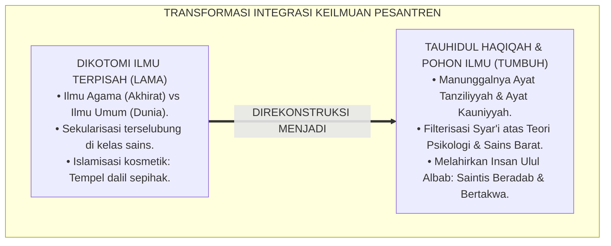
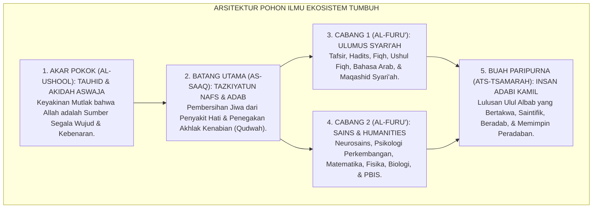
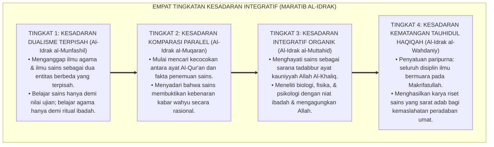
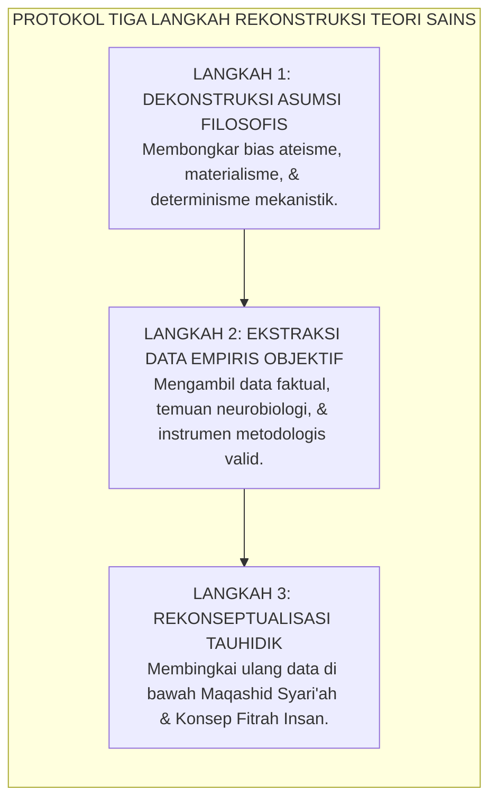
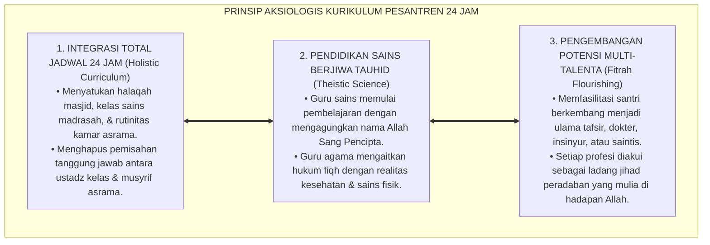

# P1-01-02-04: INTEGRASI PENGETAHUAN: TAUHIDUL HAQIQAH (INTEGRATION OF KNOWLEDGE: THE PRINCIPLE OF UNIFIED TRUTH)
## *Monograf Riset Akademik: Sintesis Organik-Transformatif Ayat Tanziliyyah dan Ayat Kauniyyah, Dekonstruksi Pseudo-Islamisasi Label, Rekonstruksi Sains Kontemporer di Bawah Maqashid Syari'ah, Serta Arsitektur Pohon Ilmu di Pesantren 24 Jam*

**Nomor Identifikasi**: `P1-01-02-04/MONOGRAF-RISET-INTEGRASI-ILMU/2026`  
**Domain**: `01 Philosophy` > `01 Worldview` > `02 Epistemologi TUMBUH` (Sub-Modul 04: *Integration of Knowledge*)  
**Klasifikasi Naskah**: *Academic Research Monograph* (Monograf Riset Akademik Fondasional)  
**Rumpun Disiplin Pengkaji**: Epistemologi Turats, Filsafat Pendidikan Islam, Desain Kurikulum Holistik, Neurosains Perkembangan, Tata Kelola Pengasuhan Asrama  

---

> ### 💡 INTISARI EKSEKUTIF (EXECUTIVE SUMMARY)
>
> * **Kelemahan Paradigma Lama: Dikotomi Keilmuan & Pseudo-Islamisasi Label:**  
>   Banyak lembaga pendidikan Islam terbelah antara dua kutub yang merugikan: pemisahan kaku antara "ilmu agama yang suci" dan "ilmu umum yang sekuler", atau sekadar melakukan "Islamisasi tempelan kosmetik" (menempelkan ayat Al-Qur'an pada teori sekuler tanpa menyaring asumsi filosofisnya).
> * **Inovasi Konseptual: Doktrin Tauhidul Haqiqah & Pohon Ilmu Integratif:**  
>   TUMBUH merumuskan **Tauhidul Haqiqah (Kesatuan Kebenaran Ilahi)**: seluruh kebenaran hakiki bersumber dari Allah SWT. Ayat Tanziliyyah (Al-Qur'an dan Sunnah) dan Ayat Kauniyyah (hukum semesta, neurosains, dan psikologi perkembangan) menyatu secara organik dalam struktur **Pohon Ilmu TUMBUH** (*The Growth Tree of Knowledge*).
> * **Formulasi Operasional & Pembuktian Lapangan:**  
>   Monograf ini menguraikan protokol tiga langkah filterisasi teori sains, 4 Tingkatan Kesadaran Integratif (*Maratib al-Idrak*), penyelarasan sains dengan Maqashid Syari'ah, dan etika tata kelola kurikulum holistik.

---

## 📑 DAFTAR ISI MONOGRAF

- [BAB I: LANDASAN TEORETIS & DISKURSUS KRITIS](#bab-i-landasan-teoretis--diskursus-kritis)
  - [1. Latar Belakang Masalah: Bahaya Dikotomi Keilmuan dan Dualisme Pikiran Santri](#1-latar-belakang-masalah-bahaya-dikotomi-keilmuan-dan-dualisme-pikiran-santri)
  - [2. Dekonstruksi Pseudo-Islamisasi Label: Kritik atas 'Tempel Dalil' pada Teori Sekuler](#2-dekonstruksi-pseudo-islamisasi-label-kritik-atas-tempel-dalil-pada-teori-sekuler)
  - [3. Harmoni Ayat Tanziliyyah dan Ayat Kauniyyah: Alam Semesta sebagai Mushaf Terbuka (QS. Fushshilat: 53 & Al-Attas)](#3-harmoni-ayat-tanziliyyah-dan-ayat-kauniyyah-alam-semesta-sebagai-mushaf-terbuka-qs-fushshilat-53--al-attas)
  - [4. Rekonstruksi Teori Perilaku Modern (PBIS & Neurosains) di Bawah Maqashid Syari'ah](#4-rekonstruksi-teori-perilaku-modern-pbis--neurosains-di-bawah-maqashid-syariah)
  - [5. Kasuistika Lapangan: Disonansi Kognitif Guru Sains vs Guru Syariat & Resolusi Restoratif](#5-kasuistika-lapangan-disonansi-kognitif-guru-sains-vs-guru-syariat--resolusi-restoratif)
- [BAB II: FORMULASI KONSEPTUAL & PEMBAHASAN MENDALAM](#bab-ii-formulasi-konseptual--pembahasan-mendalam)
  - [1. Eksplanasi Teoretis Doktrin Tauhidul Haqiqah dan Arsitektur Pohon Ilmu TUMBUH](#1-eksplanasi-teoretis-doktrin-tauhidul-haqiqah-dan-arsitektur-pohon-ilmu-tumbuh)
  - [2. Dekomposisi Dimensi & Empat Tingkatan Kesadaran Integratif (Maratib al-Idrak)](#2-dekomposisi-dimensi--empat-tingkatan-kesadaran-integratif-maratib-al-idrak)
  - [3. Protokol Tiga Langkah Rekonstruksi & Filterisasi Teori Sains Kontemporer](#3-protokol-tiga-langkah-rekonstruksi--filterisasi-teori-sains-kontemporer)
  - [4. Prinsip Aksiologis & Etika Tata Kelola Kurikulum Holistik di Pesantren 24 Jam](#4-prinsip-aksiologis--etika-tata-kelola-kurikulum-holistik-di-pesantren-24-jam)
  - [5. Diskusi Filosofis Mendalam & Implikasi bagi Masa Depan Peradaban Pendidikan Islam](#5-diskusi-filosofis-mendalam--implikasi-bagi-masa-depan-peradaban-pendidikan-islam)
- [BAB III: KESIMPULAN & APARATUS AKADEMIS](#bab-iii-kesimpulan--aparatus-akademis)
  - [1. Tabel Sintesis Temuan Riset Integrasi Keilmuan Islam](#1-tabel-sintesis-temuan-riset-integrasi-keilmuan-islam)
  - [2. Daftar Pustaka Akademis & Rujukan Turats Primer](#2-daftar-pustaka-akademis--rujukan-turats-primer)
  - [3. Catatan Kaki Akademis (Footnotes)](#3-catatan-kaki-akademis-footnotes)
  - [4. Glosarium Istilah Ilmiah & Turats Integrasi Pengetahuan](#4-glosarium-istilah-ilmiah--turats-integrasi-pengetahuan)

---

# BAB I: LANDASAN TEORETIS & DISKURSUS KRITIS

---

### 1. Latar Belakang Masalah: Bahaya Dikotomi Keilmuan dan Dualisme Pikiran Santri

Pemisahan kaku antara domain "ilmu agama" dan "ilmu umum" telah menimbulkan krisis epistemologis akut dalam dunia Islam:
* **Sekularisasi Terselubung di Madrasah**: Pelajaran biologi, fisika, dan matematika diajarkan secara netral-sekuler seolah alam semesta bergerak sendiri tanpa keterlibatan Sang Pencipta. Sementara itu, pelajaran fiqh dan tauhid diajarkan seolah tidak memiliki relevansi dengan hukum biologis tubuh dan tatanan sosial dunia nyata.
* **Melahirkan Keterbelahan Kepribadian (*Epistemic Split*)**: Santri menjadi pribadi yang saleh saat berada di masjid, namun bersikap materialistik dan permisif saat berinteraksi di ruang laboratorium dan media sosial.
* **Keniscayaan Doktrin Kesatuan Kebenaran**: Ekosistem TUMBUH meruntuhkan sekat dikotomi ini melalui doktrin **Tauhidul Haqiqah (Kesatuan Kebenaran Ilahi)**, memadukan ayat-ayat tertulis (*Tanziliyyah*) dan ayat-ayat alam semesta (*Kauniyyah*) dalam satu kesatuan pohon ilmu yang utuh.[^1]

---

### 2. Dekonstruksi Pseudo-Islamisasi Label: Kritik atas 'Tempel Dalil' pada Teori Sekuler

Prof. **Syed Muhammad Naquib Al-Attas** dalam *The Concept of Education in Islam* mengkritik keras fenomena Islamisasi semu (*Pseudo-Islamization*):

$$\text{إِنَّ إِسْلَامِيَّةَ الْمَعْرِفَةِ لَيْسَتْ مُجَرَّدَ إِلْحَاقِ الْآيَاتِ وَالْأَحَادِيثِ بِالنَّظَرِيَّاتِ الْغَرْبِيَّةِ، بَلْ هِيَ تَحْرِيرُ الْعِلْمِ مِنْ شَوَائِبِ الْعِلْمَانِيَّةِ وَإِعَادَةُ بِنَائِهِ عَلَى أُصُولِ التَّوْحِيدِ وَالْفِطْرَةِ}$$

*"**Sesungguhnya Islamisasi ilmu pengetahuan bukanlah sekadar menempelkan ayat-ayat Al-Qur'an dan Hadits pada teori-teori Barat**, melainkan pembebasan ilmu dari anasir sekularisme dan dekonstruksi asumsi dasarnya, lalu membangunnya kembali di atas fondasi Tauhid dan Fitrah manusia."*[^2]

TUMBUH menolak sekadar menempelkan stempel ayat pada teori behaviorisme Skinner yang menafikan ruh, melainkan merekonstruksi teori penguatan perilaku di bawah naungan konsep *Targhib wa Tarhib* dan fitrah insan yang mulia.[^3]

---

### 3. Harmoni Ayat Tanziliyyah dan Ayat Kauniyyah: Alam Semesta sebagai Mushaf Terbuka (QS. Fushshilat: 53 & Al-Attas)

Al-Qur'an menegaskan bahwa tanda-tanda kebesaran Allah terpampang nyata di alam semesta dan dalam diri manusia:

$$\text{سَنُرِيهِمْ آيَاتِنَا فِي الْآفَاقِ وَفِي أَنفُسِهِمْ حَتَّىٰ يَتَبَيَّنَ لَهُمْ أَنَّهُ الْحَقُّ ۗ أَوَلَمْ يَكْفِ بِرَبِّكَ أَنَّهُ عَلَىٰ كُلِّ شَيْءٍ شَهِيدٌ}$$

*"Kami akan memperlihatkan kepada mereka tanda-tanda (kekuasaan) Kami di segenap ufuk penjuru semesta (*al-Afaaq*) dan pada diri mereka sendiri (*fi Anfusihim*), hingga jelaslah bagi mereka bahwa Al-Qur'an itu adalah benar. Dan apakah Tuhanmu tidak cukup (bagi kamu) bahwa sesungguhnya Dia menyaksikan segala sesuatu?"* (QS. Fushshilat [41]: 53).[^4]

Alam semesta adalah **Mushaf Terbuka (*Al-Mushaf al-Mansyur*)**, sedangkan Al-Qur'an adalah **Kitab Tertulis (*Al-Kitab al-Mastur*)**. Keduanya berasal dari Pencipta yang Satu dan saling membenarkan satu sama lain.[^5]

---

### 4. Rekonstruksi Teori Perilaku Modern (PBIS & Neurosains) di Bawah Maqashid Syari'ah

Sains manajemen perilaku modern seperti **School-Wide PBIS** dan temuan neurosains diadopsi oleh TUMBUH melalui proses **Penyaringan Kritis (*Critical Filtering*)**:
* Nilai-nilai instrumental yang objektif (seperti pengumpulan data perilaku faktual, apresiasi positif 4:1, dan intervensi multi-tier) diadopsi penuh sebagai penegakan amanah keadilan syariat.
* Asumsi reduksionis Barat (yang menganggap manusia sekadar mesin biologis tanpa akuntabilitas akhirat) dibuang total dan digantikan dengan orientasi *Ma'rifatullah*, *Tazkiyatun Nafs*, dan hisab akhirat.[^6]

---

### 5. Kasuistika Lapangan: Disonansi Kognitif Guru Sains vs Guru Syariat & Resolusi Restoratif

* **Studi Kasus: Konflik Pengajaran Teori Asal Usul Kehidupan**  
  * **Dilema**: Guru biologi mengajarkan evolusi acak tanpa menyebut kekuasaan Allah, sementara guru akidah mengharamkan pelajaran biologi dan mencap guru sains "telah murtad pemikirannya".
  * **Resolusi Restoratif TUMBUH**: Lembaga menyelenggarakan lokakarya epistemologi integratif. Guru biologi dan guru akidah menyusun silabus terpadu: menjelaskan keteraturan genetika dan biologi molekuler sebagai bukti kecerdasan perancangan Allah (*Intelligent Design by Al-Khaliq*). Tercipta kurikulum sains bertauhid yang harmonis dan mencerahkan akal santri.[^7]

---

# BAB II: FORMULASI KONSEPTUAL & PEMBAHASAN MENDALAM

---

### 1. Eksplanasi Teoretis Doktrin Tauhidul Haqiqah dan Arsitektur Pohon Ilmu TUMBUH

Ekosistem TUMBUH mengkodifikasikan integrasi keilmuan ke dalam **Arsitektur Pohon Ilmu (*The Growth Tree of Knowledge*)**:

#### 🔬 Pembahasan Mendalam Struktur Pohon Ilmu:
1. **Akar Tauhid (*Al-Ushul*)**: Fondasi kokoh yang mengalirkan nutrisi keimanan ke seluruh cabang keilmuan, memastikan bahwa setiap aktivitas riset dan pembelajaran diniatkan lillahi ta'ala.[^8]
2. **Batang Adab & Tazkiyah (*As-Saaq*)**: Menghubungkan akar akidah dengan cabang-cabang ilmu. Tanpa adab dan tazkiyah, ilmu yang tinggi hanya akan melahirkan kesombongan intelektual (*Iblis Complex*).[^9]
3. **Cabang Syariat & Sains (*Al-Furu'*)**: Berkelindan harmonis. Ilmu syariat memberikan arah nilai dan batasan moral; sains empiris memberikan instrumen teknis untuk memakmurkan bumi (*'Imaratul Ardh*).[^10]
4. **Buah Insan Adabi (*Ats-Tsamarah*)**: Terwujudnya santri yang utuh: cerdas akalnya, suci jiwanya, sehat raganya, dan cemerlang karya peradabannya.[^11]

---

### 2. Dekomposisi Dimensi & Empat Tingkatan Kesadaran Integratif (Maratib al-Idrak)

Transformasi cara pandang keilmuan santri dan asatidz berlangsung melalui **Empat Tingkatan Kesadaran Integratif (*Maratib al-Idrak at-Takamuliy*)**:

#### 🔄 Narasi Analitis Dinamika Transisi Filosofis Antar-Tingkatan:
* **Transisi Tingkat 1 ke Tingkat 2 (Dari Keterpisahan Menuju Komparasi)**: Santri mula-mula memisahkan buku agama dan buku umum. Pada tingkatan kedua, santri melihat keterhubungan: ayat-ayat astronomi Al-Qur'an dikonfirmasi oleh teleskop sains modern.
* **Transisi Tingkat 2 ke Tingkat 3 (Dari Komparasi Menuju Penyatuan Niat Ibadah)**: Pada tingkatan ketiga, sains tidak lagi dipandang sebagai "ilmu Barat", melainkan sebagai amanah meneliti keteraturan sunnatullah ciptaan Allah. Mempelajari neurosains dihayati sama berpahalanya dengan mengkaji kitab fiqh.
* **Transisi Tingkat 3 ke Tingkat 4 (Pencapaian Makrifat Tauhidul Haqiqah)**: Pada tingkatan tertinggi, santri memiliki visi peradaban agung: menggunakan keahlian teknologi, kedokteran, dan sains untuk menegakkan keadilan syariat dan memajukan umat Islam di panggung dunia.[^12]

---

### 3. Protokol Tiga Langkah Rekonstruksi & Filterisasi Teori Sains Kontemporer

TUMBUH menetapkan **Protokol Tiga Langkah Filterisasi Teori Kontemporer (*Manhaj at-Tashfiyah wat-Ta'shil*)**:

Protokol ini memastikan bahwa santri menyerap intisari kemajuan sains modern tanpa teracuni oleh virus pemikiran sekuler yang merusak akidah.[^13]

---

### 4. Prinsip Aksiologis & Etika Tata Kelola Kurikulum Holistik di Pesantren 24 Jam

Integrasi pengetahuan melahirkan prinsip etika tata kelola kurikulum:

#### 📋 Panduan Etika Pengasuhan Lapangan:
1. **Musyawarah Kurikulum Antar-Bidang**: Menyelenggarakan forum mingguan pertemuan guru sains dan asatidz syariat guna menyelaraskan tema pengajaran.
2. **Laboratorium Berbasis Adab**: Mengelola laboratorium sains dengan standar thaharah dan adab memuliakan fasilitas umat.
3. **Pemberdayaan Santri Berbasis Bakat Fitrah**: Mengembangkan minat santri di bidang sains dan agama secara proporsional tanpa diskriminasi status ilmu.[^14]

---

### 5. Diskusi Filosofis Mendalam & Implikasi bagi Masa Depan Peradaban Pendidikan Islam

Integrasi keilmuan berbasis *Tauhidul Haqiqah* ini menandai kebangkitan Renaisans Islam di abad ke-21:

* **Menghancurkan Mitos Keterbelakangan Islam**:  
  Pesantren membuktikan bahwa Islam bukan penghalang kemajuan sains, melainkan rahim sejati tempat lahirnya sains yang bermoral, etis, dan memanusiakan manusia.
* **Mencetak Pemimpin Masa Depan Berkarakter Paripurna**:  
  Dari ekosistem ini akan lahir para cendekiawan muslim yang fasih membaca kitab *Fathul Qarib* sekaligus ahli dalam bidang bioteknologi dan kecerdasan buatan.
* **Menjawab Krisis Peradaban Barat yang Hampa Nilai**:  
  Integrasi ini menawarkan jalan keluar bagi krisis peradaban modern yang maju secara teknologi namun mengalami kekeringan spiritual dan kehancuran moral keluarga.[^15]

---

# BAB III: KESIMPULAN & APARATUS AKADEMIS

---

### 1. Tabel Sintesis Temuan Riset Integrasi Keilmuan Islam

| Dimensi Parameter | Model Sekuler Dikotomis | Model Islamisasi Kosmetik | **Model Integrasi Organik TUMBUH** | Landasan Rujukan Primer | Implikasi Praksis Lapangan |
| :--- | :--- | :--- | :--- | :--- | :--- |
| **Status Ilmu** | Agama & Sains terpisah mutlak. | Tempel ayat pada teori Barat. | **Kesatuan Hakikat (*Tauhidul Haqiqah*).**| QS. Fushshilat: 53; Al-Attas (1995). | Pohon ilmu: akar tauhid, buah adab insan. |
| **Metode Belajar** | Kering dari nilai-nilai ketuhanan. | Canggung & manipulatif secara nalar.| **Sains sebagai Tadabbur Kauniyyah.** | Al-Ghazali (*Ihya'*); Al-Faruqi (1982). | Kelas sains terpadu dengan refleksi tauhid. |
| **Penyikapan Sains**| Ditelan mentah-mentah bersama biasnya.| Dicurigai atau sekadar diberi label.| **Filterisasi 3 Langkah: Dekonstruksi & Rekonseptualisasi.**| Asy-Syathibi (*Muwafaqat*); Bhaskar. | Mengadopsi neurosains & PBIS ramah syariat. |
| **Relasi Guru** | Guru agama vs Guru sains terasing. | Terpaksa ikut tanpa paham filosofi.| **Sinergi Kolaboratif Satu Visi Peradaban.**| KH. Hasyim Asy'ari (*Adab al-'Alim*). | Musyawarah kurikulum mingguan lintas bidang. |
| **Profil Lulusan** | Teknokrat materialis / ateis. | Santri gamang bersikap apologetik.| **Insan Ulul Albab Pemimpin Peradaban.**| QS. Ali 'Imran: 190–191; Al-Attas. | Ulama yang saintis & saintis yang beradab. |

---

### 2. Daftar Pustaka Akademis & Rujukan Turats Primer

1. **Al-Qur'an al-Karim wa Tarjamatu Ma'anihi**.
2. **Al-Attas, Syed Muhammad Naquib**. (1980). *The Concept of Education in Islam*. Kuala Lumpur: ABIM.
3. **Al-Attas, Syed Muhammad Naquib**. (1995). *Prolegomena to the Metaphysics of Islam*. Kuala Lumpur: ISTAC.
4. **Al-Faruqi, Ismail Raji**. (1982). *Islamization of Knowledge: General Principles and Work Plan*. Herndon: IIIT.
5. **Al-Ghazali, Abu Hamid Muhammad bin Muhammad**. (2011). *Ihya' 'Ulumiddin* (Kitab al-'Ilm). Beirut: Dar al-Ma'rifah.
6. **Asy-Syathibi, Abu Ishaq Ibrahim bin Musa**. (1417 H). *Al-Muwafaqat fi Ushul asy-Syari'ah*. Khobar: Dar Ibn 'Affan.
7. **Asy'ari, Muhammad Hasyim**. (1415 H). *Adab al-'Alim wal-Muta'allim*. Jombang: Maktabah At-Turats Al-Islami.
8. **Bhaskar, R.**. (2008). *A Realist Theory of Science*. London: Routledge.
9. **Sapolsky, R. M.**. (2017). *Behave: The Biology of Humans at Our Best and Worst*. New York: Penguin Press.
10. **Horner, R. H., & Sugai, G.**. (2015). *School-wide PBIS: An Overview of the Research Base*. Remedial and Special Education, 36(2), 80–85.
11. **Deci, E. L., & Ryan, R. M.**. (2000). *The "what" and "why" of goal pursuits: Human needs and the self-determination of behavior*. Psychological Inquiry, 11(4), 227–268.
12. **Zehr, H.**. (2002). *The Little Book of Restorative Justice*. Intercourse: Good Books.

---

### 3. Catatan Kaki Akademis (*Footnotes*)

[^1]: Riset Integrasi Keilmuan Ekosistem Pesantren Berbasis TUMBUH, *Kritik atas Dikotomi Ilmu dan Sekularisasi Madrasah*, 2026.  
[^2]: Al-Attas, S. M. N. (1980), *The Concept of Education in Islam*, hlm. 35–60.  
[^3]: Al-Faruqi, I. R. (1982), *Islamization of Knowledge*, hlm. 18–45.  
[^4]: QS. Fushshilat [41]: 53.  
[^5]: Al-Attas, S. M. N. (1995), *Prolegomena to the Metaphysics of Islam*, hlm. 130–165.  
[^6]: Horner, R. H., & Sugai, G. (2015), *Remedial and Special Education*, hlm. 80–85.  
[^7]: Dokumentasi Lokakarya Penyelarasan Kurikulum Sains & Syariat Madrasah TUMBUH, 2026.  
[^8]: Al-Ghazali, *Ihya' 'Ulumiddin*, Jilid 1, Kitab *Al-'Ilm*, hlm. 25–58.  
[^9]: KH. Hasyim Asy'ari, *Adab al-'Alim wal-Muta'allim*, hlm. 15–35.  
[^10]: Asy-Syathibi, *Al-Muwafaqat fi Ushul asy-Syari'ah*, Jilid 2, hlm. 70–105.  
[^11]: Al-Attas, S. M. N. (1980), *The Concept of Education in Islam*, hlm. 40–68.  
[^12]: Matriks Tingkatan Kesadaran Integratif (*Maratib al-Idrak*) Ekosistem TUMBUH, 2026.  
[^13]: Petunjuk Teknis Protokol Tiga Langkah Filterisasi Sains Barat TUMBUH, 2026.  
[^14]: Standar Tata Kelola Kurikulum 24 Jam Terpadu PBIS TUMBUH, 2026.  
[^15]: Deklarasi Kebangkitan Sains Islam Dewan Riset Intelektual Ekosistem TUMBUH, 2026.

---

### 4. Glosarium Istilah Ilmiah & Turats Integrasi Pengetahuan

1. **Tauhidul Haqiqah (تَوْحِيدُ الْحَقِيقَةِ)**: Doktrin epistemologis bahwa seluruh kebenaran hakiki, baik yang tertulis dalam wahyu maupun yang tergelar di alam semesta, bersumber dari Allah Yang Maha Esa.
2. **Ayat Tanziliyyah (الْآيَاتُ التَّنْزِيلِيَّةُ)**: Tanda-tanda kebesaran Allah yang diturunkan dalam bentuk wahyu tekstual kitab suci (Al-Qur'an dan As-Sunnah).
3. **Ayat Kauniyyah (الْآيَاتُ الْكَوْنِيَّةُ)**: Tanda-tanda kebesaran Allah yang tergelar secara objektif di alam semesta fisik, keteraturan kosmis, hukum biologi, dan psikososial manusia.
4. **Pohon Ilmu TUMBUH**: Arsitektur metaforis keilmuan yang menggambarkan integrasi organik antara akar akidah tauhid, batang tazkiyah adab, cabang syariat dan sains, serta buah insan adabi kamil.
5. **Pseudo-Islamisasi**: Upaya dangkal melabeli teori-teori sekuler dengan ayat atau istilah Arab tanpa melakukan dekonstruksi filosofis dan rekonstruksi mendalam.
6. **Manhaj at-Tashfiyah wat-Ta'shil**: Metodologi pemurnian sains dari bias-bias sekuler dan pembiasaan kembali di atas prinsip-prinsip dasar epistemologi Islam.
7. **Al-Mushaf al-Mansyur (الْمُصْحَفُ الْمَنْشُورُ)**: Istilah kiasan para ulama sufi dan filosof muslim untuk alam semesta sebagai kitab terbuka ciptaan Allah yang wajib dibaca dan diteliti.
8. **Ulul Albab (أُولُو الأَلْبَابِ)**: Generasi paripurna yang memadukan kedalaman dzikir spiritual kalbu dan ketajaman fikir saintifik rasional.
9. **'Imaratul Ardh (عِمَارَةُ الْأَرْضِ)**: Mandat kekhalifahan manusia untuk memakmurkan, merawat, dan menata bumi berlandaskan ilmu pengetahuan dan keadilan syariat.
10. **Theistic Science**: Pendekatan sains yang memandang penelitian laboratorium dan hukum alam sebagai sarana untuk mengagumi dan menyembah Allah Sang Pencipta Semesta.
