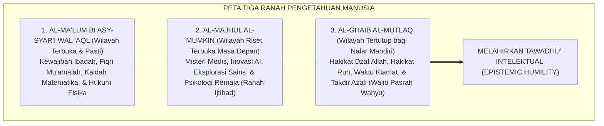
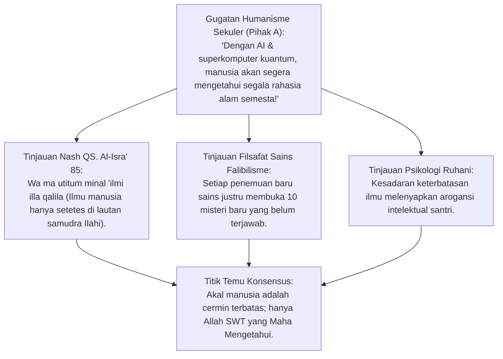
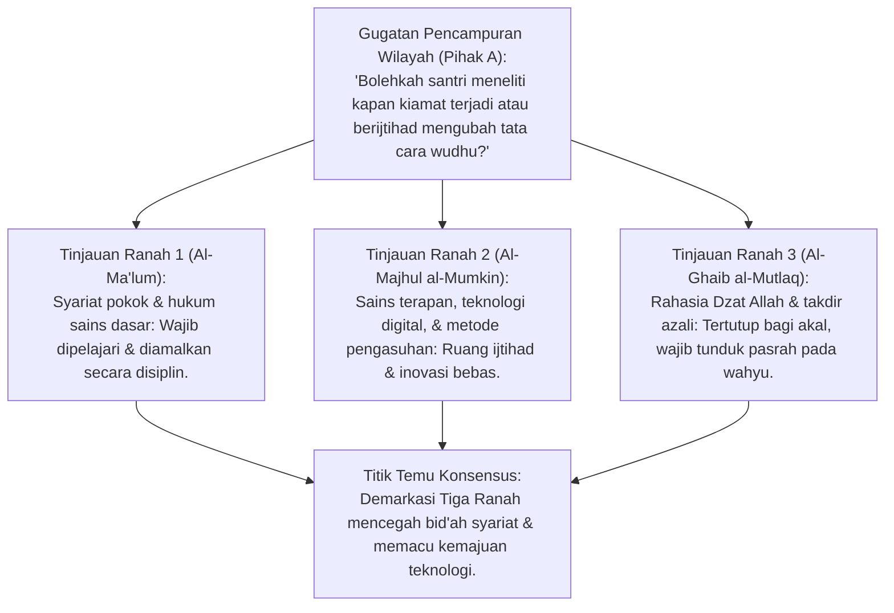
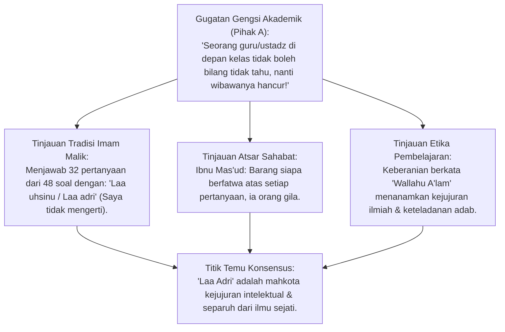
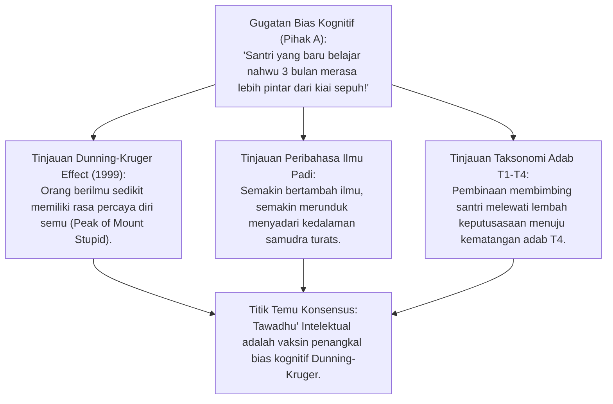
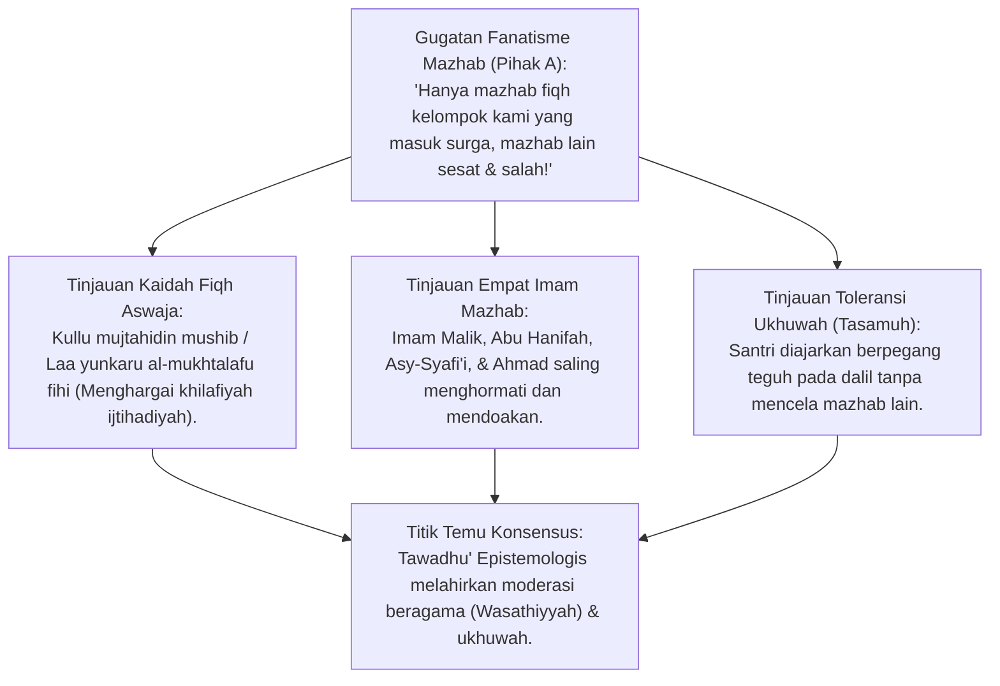
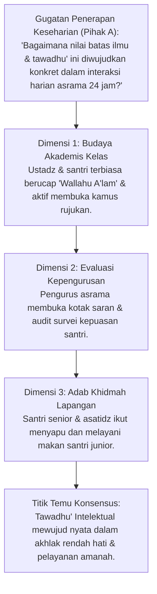
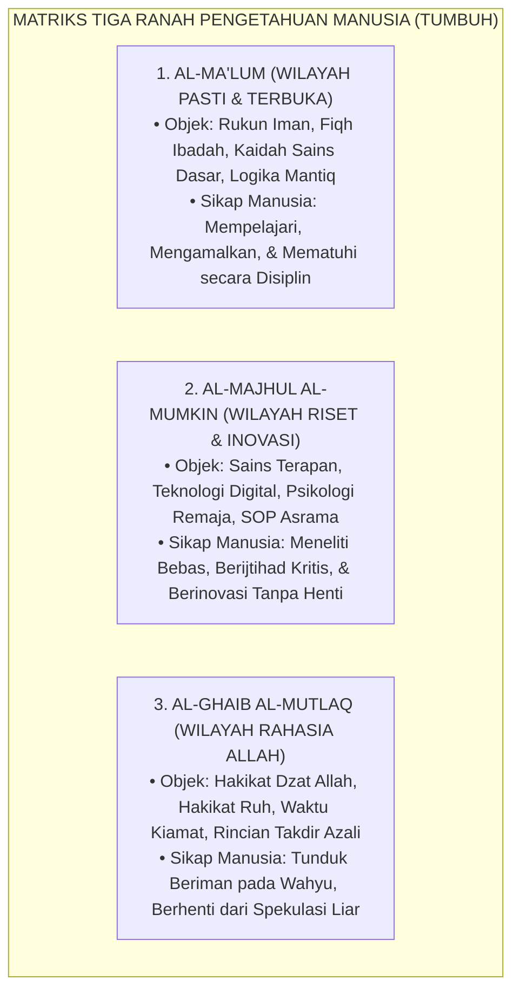

# P1-01-02-05: BATAS-BATAS PENGETAHUAN MANUSIA
## *Monograf Terpadu: Keterbatasan Epistemologis Insan (QS. Al-Isra': 85), Tawadhu' Intelektual (Epistemic Humility), Demarkasi Wilayah Ijtihad vs Dogma Syar'i, & Eliminasi Bias Overconfidence*

**Nomor Identifikasi**: `P1-01-02-05/MONOGRAF-TERPADU-BATAS-ILMU/2026`  
**Domain**: `01 Philosophy` > `01 Worldview` > `02 Epistemologi TUMBUH`  
**Klasifikasi Naskah**: *Comprehensive Integrated Monograph* (Monograf Akademis & Rumusan Baku Terpadu)  
**Rumpun Disiplin Pengkaji**: Epistemologi Turats & Ushuluddin, Filsafat Ilmu (Batas Kognisi & Falsifiabilitas), Psikologi Kognitif (Bias Dunning-Kruger), Etika Akademik & Adab Pesantren  

---

> ### 💡 INTISARI PRAKTIS (3 MENIT PAHAM UNTUK ASATIDZ & MUSYRIF)
>
> * **Apa Masalah Terbesar Saat Seseorang Merasa Terlalu Pintar?**  
>   Terjangkit **Kesombongan Intelektual (*Epistemic Arrogance*)**: Merasa tahu segalanya, menolak dikritik, malu mengakui ketidaktahuan, dan berani mengarang jawaban fatwa tanpa ilmu.
> * **Tiga Wilayah Ilmu Manusia:**  
>   1. **Wilayah yang Wajib Diketahui (*Al-Ma'lum*)**: Rukun iman, fiqh ibadah harian, dan keterampilan sains praktis hidup.  
>   2. **Wilayah yang Boleh Diteliti Bebas (*Al-Majhul al-Mumkin*)**: Riset teknologi baru, sains kedokteran, dan perbaikan metode mengajar (ruang ijtihad terbuka).  
>   3. **Wilayah Rahasia Mutlak Allah (*Al-Ghaib al-Mutlaq*)**: Hakikat Dzat Allah, kepastian waktu kiamat, hakikat ruh, dan rahasia takdir azali (wajib tunduk iman tanpa debat kusir).
> * **Kaidah Emas Ulama Besar:**  
>   Mengucapkan **"Laa Adri / Wallahu A'lam" (Saya belum tahu)** adalah separuh dari ilmu (*Nishful 'Ilm*). Guru dan santri yang hebat bukanlah yang pura-pura tahu segalanya, melainkan yang berani jujur saat belum tahu dan tekun meneliti kebenarannya.

---

## 📑 DAFTAR ISI MONOGRAF

- [BAGIAN I: RISET EPISTEMOLOGI BATAS NALAR, DIALEKTIKA INKUIRI, & KASUISTIKA LAPANGAN](#bagian-i-riset-epistemologi-batas-nalar-dialektika-inkuiri--kasuistika-lapangan)
  - [1. Kerangka Metodologi Keterbatasan Kognitif Insan](#1-kerangka-metodologi-keterbatasan-kognitif-insan)
  - [2. Inkuiri 1: Investigasi Aksioma 'Wa Ma Utitum Minal 'Ilmi Illa Qalila' — Membongkar Ilusi Omnisains Humanisme](#2-inkuiri-1-investigasi-aksioma-wa-ma-utitum-minal-ilmi-illa-qalila--membongkar-ilusi-omnisains-humanisme)
  - [3. Inkuiri 2: Tiga Ranah Epistemologis (Al-Ma'lum, Al-Majhul al-Mumkin, & Al-Ghaib al-Mutlaq)](#3-inkuiri-2-tiga-ranah-epistemologis-al-malum-al-majhul-al-mumkin--al-ghaib-al-mutlaq)
  - [4. Inkuiri 3: Investigasi 'Laa Adri Nishful 'Ilm' — Keberanian Mengakui Ketidaktahuan dalam Tradisi Salaf](#4-inkuiri-3-investigasi-laa-adri-nishful-ilm--keberanian-mengakui-ketidaktahuan-dalam-tradisi-salaf)
  - [5. Inkuiri 4: Konvergensi dengan Psikologi Kognitif: Mengatasi Efek Dunning-Kruger pada Santri](#5-inkuiri-4-konvergensi-dengan-psikologi-kognitif-mengatasi-efek-dunning-kruger-pada-santri)
  - [6. Inkuiri 5: Demarkasi Wilayah Ijtihad vs Dogma Syar'i — Mencegah Fanatisme Mazhab Sempit (Ta'ashshub)](#6-inkuiri-5-demarkasi-wilayah-ijtihad-vs-dogma-syari--mencegah-fanatisme-mazhab-sempit-taashshub)
  - [7. Inkuiri 6: Translasi Tawadhu' Intelektual ke Budaya Akademis & Tata Kelola Pesantren 24 Jam](#7-inkuiri-6-translasi-tawadhu-intelektual-ke-budaya-akademis--tata-kelola-pesantren-24-jam)
- [BAGIAN II: KODIFIKASI BAKU HASIL RISET & KESIMPULAN FORMAL](#bagian-ii-kodifikasi-baku-hasil-riset--kesimpulan-formal)
  - [1. Matriks Tiga Ranah Epistemologis Pengetahuan Manusia](#1-matriks-tiga-ranah-epistemologis-pengetahuan-manusia)
  - [2. Matriks Komparasi: Kesombongan Epistemis vs Tawadhu' Intelektual TUMBUH](#2-matriks-komparasi-kesombongan-epistemis-vs-tawadhu-intelektual-tumbuh)
  - [3. Protokol Pembinaan Sikap Ilmiah 'Khasyyah & Tabayyun' bagi Guru dan Santri](#3-protokol-pembinaan-sikap-ilmiah-khasyyah--tabayyun-bagi-guru-dan-santri)
- [BAGIAN III: APARATUS AKADEMIS & APENDIKS](#bagian-iii-aparatus-akademis--apendiks)
  - [1. Tabel Sintesis Hasil Riset Batas Pengetahuan](#1-tabel-sintesis-hasil-riset-batas-pengetahuan)
  - [2. Daftar Pustaka Akademis & Rujukan Turats Primer](#2-daftar-pustaka-akademis--rujukan-turats-primer)
  - [3. Catatan Kaki Akademis (Footnotes)](#3-catatan-kaki-akademis-footnotes)
  - [4. Glosarium dan Penjelasan Istilah Teknis Epistemologi & Turats](#4-glosarium-dan-penjelasan-istilah-teknis-epistemologi--turats)

---

# BAGIAN I: RISET EPISTEMOLOGI BATAS NALAR, DIALEKTIKA INKUIRI, & KASUISTIKA LAPANGAN

*Bagian ini memuat proses penyelidikan batasan akal budi (*hudud al-ma'rifah al-basyariyyah*), formalisasi silogisme logika (*qiyas burhani*), pertarungan dialektika multi-perspektif tiga ronde tanpa kata "pakar", telaah turats akidah-ushul dan psikologi kognitif modern, studi kasus arogansi akademik di pesantren, dan penarikan konsensus bersama.*

---

### 1. Kerangka Metodologi Keterbatasan Kognitif Insan

Salah satu pembeda paling radikal antara humanisme sekuler Barat dengan epistemologi Islam terletak pada pengakuan atas **Batas-Batas Daya Jangkau Pengetahuan Manusia (*Human Epistemic Limits*)**.
* Humanisme sekuler berilusi bahwa akal manusia adalah tolak ukur mutlak segala sesuatu (*Man is the measure of all things*), meyakini bahwa suatu hari nanti sains akan mampu memecahkan seluruh misteri alam tanpa butuh Tuhan.
* Sebaliknya, Islam mengajarkan bahwa sehebat apapun kecerdasan manusia, kapasitas otaknya dibatasi oleh kefakiran biologis, ruang, waktu, dan keterbatasan indera. Mengakui batas kognisi bukanlah kekalahan akal, melainkan **Puncak Kejujuran Intelektual (*Epistemic Humility / Tawadhu' Ilmiah*)** yang mengantarkan manusia pada makrifatullah.

---

### 2. Inkuiri 1: Investigasi Aksioma 'Wa Ma Utitum Minal 'Ilmi Illa Qalila' — Membongkar Ilusi Omnisains Humanisme

#### 📐 Formalisasi Logika Silogisme (*Qiyas Mantiqi 1*)
* **Premis Mayor (*al-Muqaddimah al-Kubra*)**: Setiap makhluk yang diciptakan dari ketiadaan dan dibatasi oleh dimensi biologis otak materiil niscaya memiliki batas ufuk kognitif yang terbatas dan mustahil mencapai pengetahuan mutlak yang meliputi segala hal (*Omniscience*).
* **Premis Minor (*al-Muqaddimah ash-Shughra*)**: Seluruh manusia, ilmuwan, kiai, dan pakar sains adalah makhluk kontingen yang hanya memiliki secuil ilmu yang diizinkan Allah (QS. Al-Isra': 85).
* **Konklusi (*an-Natijah*)**: Maka, pengakuan atas keterbatasan ilmu adalah fitrah mutlak manusia, dan klaim omnisains sekuler adalah ilusi kesombongan yang batil.[^1]

#### 📖 Teks Primer Al-Qur'an & Turats: Pengakuan Ketidaktahuan Para Ulama
Allah SWT menegaskan keterbatasan ilmu seluruh umat manusia:

$$\text{وَيَسْأَلُونَكَ عَنِ الرُّوحِ ۖ قُلِ الرُّوحُ مِنْ أَمْرِ رَبِّي وَمَا أُوتِيتُم مِّنَ الْعِلْمِ إِلَّا قَلِيلًا}$$

*"Dan mereka bertanya kepadamu tentang ruh. Katakanlah: 'Ruh itu termasuk urusan Tuhanku, dan tidaklah kamu diberi pengetahuan melainkan sedikit saja'."* (QS. Al-Isra' [17]: 85).[^2]

Dan Imam **Asy-Syafi'i** dalam Diwan syairnya mengungkapkan puncak ketawadhuan ulama sejati:
$$\text{كُلَّمَا أَدَّبَنِي الدَّهْرُ أَرَانِي نَقْصَ عَقْلِي ۝ وَإِذَا مَا ازْدَدْتُ عِلْمًا زَادَنِي عِلْمًا بِجَهْلِي}$$
*"Setiap kali zaman mendidik adabku, ia memperlihatkan kepadaku betapa banyaknya kekurangan pada akal budiku. Dan setiap kali bertambah ilmuku, niscaya bertambah pula pengetahuanku akan betapa besarnya kebodohanku!"*[^3]

#### 🥊 Ronde 1: Menghancurkan Ilusi Omnisains Sains Positivistik
* **Pihak A (Sudut Pandang Saintisme Arogan)**:  
  *"Sains modern telah mampu memetakan genom manusia dan melihat galaksi sejauh 13 miliar tahun cahaya. Bukankah tinggal masalah waktu hingga manusia mengetahui seluruh rahasia eksistensi tanpa butuh wahyu?"*
* **Tinjauan Sudut Pandang Filsafat Sains Kontemporer (Karl Popper & Kurt Gödel)**:  
  Matematika dan sains modern sendiri membuktikan adanya **Batas Kognitif Bawaan (*Gödel's Incompleteness Theorem & Heisenberg Uncertainty Principle*)**: Semakin dalam manusia meneliti kuantum, semakin tampak ketidakpastian posisinya; semakin luas alam semesta dipetakan, manusia tersadar bahwa 95% semesta tersusun dari *Dark Matter* dan *Dark Energy* yang sama sekali tidak diketahui hakikatnya oleh fisikawan. Sains yang jujur selalu berujung pada kekaguman akan kemahaluasan ilmu Allah SWT.[^4]

#### 🥊 Ronde 2: Sanggahan Balik Apakah Mengakui Batas Ilmu Melemahkan Semangat Riset?
* **Pihak A (Sudut Pandang Pragmatisme Belajar)**:  
  *"Sanggahan! Jika santri terus-menerus diingatkan bahwa 'ilmu manusia hanya sedikit', apakah hal itu tidak akan membuat santri malas belajar dan pasrah tidak mau melakukan riset sains tingkat tinggi?"*
* **Tinjauan Sudut Pandang Epistemologi Islam**:  
  Pengakuan keterbatasan ilmu **Bukan Keputusasaan, Melainkan Pemicu Rasa Ingin Tahu yang Tak Pernah Padam (*Perpetual Intellectual Curiosity*)**. Mengetahui bahwa samudra ilmu Allah tak bertepi membuat santri terus bersemangat meneliti ayat-ayat kauniyyah sepanjang hayat (*Minal Mahdi ilal Lahdi*), sembari menjaga hatinya dari kesombongan akademik.[^5]

#### 🥊 Ronde 3: Sanggahan Pamungkas Integrasi Rasa Takut kepada Allah dalam Riset
* **Pihak A (Sudut Pandang Netralitas Akademik)**:  
  *"Mengapa riset akademik di laboratorium pesantren harus dikaitkan dengan rasa takut kepada Allah (*Khasyyah*)?"*
* **Resolusi Sudut Pandang Al-Qur'an**:  
  Allah SWT berfirman: *"Innama yakhsyallaha min 'ibadihil 'ulama"* (Hanyalah yang takut kepada Allah di antara hamba-hamba-Nya adalah para ulama/ilmuwan - QS. Fathir: 28). **Ilmu Tanpa Khasyyah Melahirkan Bom Atom dan Kerusakan Ekologi**. Rasa takut kepada Allah memastikan bahwa ilmu nuklir dan bioteknologi hanya digunakan untuk kemakmuran dan pengobatan umat, bukan untuk penghancuran massal.[^6]

> #### 📌 Kasuistika Lapangan 1 & Titik Temu Konsensus
> * **Studi Kasus**: Santri juara olimpiade kimia meremehkan teman-temannya dan berkata: "Saya sudah menguasai seluruh rahasia alam materi, ustadz di pondok ini ilmunya kuno".
> * **Titik Temu Konsensus (*Kalimatun Sawa'*)**: Disepakati bahwa kesombongan santri adalah bukti kedangkalan ilmunya. Musyrif membimbing santri tersebut meneliti misteri partikel subatomik yang belum terpecahkan oleh sains dunia guna memulihkan ketawadhuan batinnya.[^7]

---

### 3. Inkuiri 2: Tiga Ranah Epistemologis (Al-Ma'lum, Al-Majhul al-Mumkin, & Al-Ghaib al-Mutlaq)

#### 📐 Formalisasi Logika Silogisme (*Qiyas Mantiqi 2*)
* **Premis Mayor (*al-Muqaddimah al-Kubra*)**: Setiap metodologi ilmu yang sehat niscaya membedakan secara tegas antara wilayah kepastian syariat (*Qath'iyyat*), wilayah inovasi ijtihad (*Majal al-Ijtihad*), dan wilayah rahasia mutlak ketuhanan (*Al-Ghaib al-Mahdh*).
* **Premis Minor (*al-Muqaddimah ash-Shughra*)**: Mencampuradukkan ketiga wilayah ini melahirkan bid'ah dalam agama atau kejumudan dalam urusan teknologi sains.
* **Konklusi (*an-Natijah*)**: Maka, Ekosistem TUMBUH menetapkan demarkasi tiga ranah epistemologis sebagai panduan kurikulum dan riset santri.[^8]

#### 📖 Teks Primer Turats: *Al-I'tisham* & *Al-Mustashfa*
**Imam Asy-Syathibi** dalam *Al-I'tisham* menetapkan batas ijtihad:

$$\text{إِنَّ مَجَالَ الِاجْتِهَادِ إِنَّمَا هُوَ فِيمَا لَا نَصَّ فِيهِ قَطْعِيًّا، أَوْ فِيمَا كَانَ النَّصُّ فِيهِ ظَنِّيَّ الدَّلَالَةِ، أَمَّا الْأُمُورُ التَّعَبُّدِيَّةُ الْمَحْضَةُ وَالْقَوَاطِعُ الشَّرْعِيَّةُ فَلَا مَدْخَلَ لِلرَّأْيِ فِيهَا بِتَغْيِيرٍ أَوْ تَبْدِيلٍ}$$

*"Sesungguhnya ruang berlakunya ijtihad nalar hanyalah pada perkara-perkara yang tidak terdapat nash dalil qath'i padanya, atau pada perkara yang penunjukan dalilnya bersifat zhanniy; adapun perkara-perkara ibadah murni (ta'abbudi mahdh) dan ketetapan syariat yang pasti, maka tidak ada jalan bagi opini akal untuk mengubah atau menggantinya."*[^9]

#### 🥊 Ronde 1: Membebaskan Nalar Inovasi di Ranah Mu'amalah & Teknologi
* **Tinjauan Fiqh Siyasah & Sains**:  
  Dalam urusan duniawi, sains, arsitektur gedung asrama, aplikasi digital logbook, dan sistem manajemen PBIS, berlaku kaidah Nabawiyyah: *"Antum a'lamu bi umuri dunyakum"* (Kalian lebih mengetahui urusan dunia kalian - HR. Muslim no. 2363). Di ranah ini, **Santri Diberi Kebebasan Penuh Berinovasi, Meneliti, Memprogram Robotika, dan Merancang SOP Modern** demi kemaslahatan pesantren.[^10]

#### 🥊 Ronde 2: Sanggahan Balik Larangan Debat Kusir di Ranah Ghaib Mutlak
* **Pihak A (Sudut Pandang Spekulasi Teologis)**:  
  *"Mengapa santri dilarang meneliti dan memperdebatkan bagaimana bentuk fisik Dzat Allah, atau menghitung secara pasti tanggal terjadinya kiamat?"*
* **Tinjauan Sudut Pandang Akidah Aswaja**:  
  Karena perkara tersebut berada di ranah **Al-Ghaib al-Mutlaq** yang sengaja ditutup oleh Allah dari jangkauan akal manusia (QS. Luqman: 34). Memperdebatkan hal yang tidak memiliki alat bukti fisik maupun dalil wahyu hanya akan melahirkan kesesatan khayalan antropomorfisme (*Tasybih*) atau kebatinan palsu. Akal sehat berhenti di batas wahyu (*Al-Waqfu 'indash-Shar'i*).[^11]

#### 🥊 Ronde 3: Sanggahan Pamungkas Menjaga Kemurnian Ibadah Mahdhah dari Bid'ah
* **Pihak A (Sudut Pandang Relativisme Ritual)**:  
  *"Jika inovasi sains dibolehkan, mengapa kita tidak boleh berinovasi mengubah shalat Maghrib menjadi 4 rakaat agar lebih lama berdzikir?"*
* **Resolusi Sudut Pandang Ushul Fiqh**:  
  Ibadah ritual adalah **Ta'abbudi Mahdh (Kewenangan Mutlak Pembuat Syariat)**. Kaidah fiqh menetapkan: *"Al-Ashlu fil 'ibadati al-buthlan hatta yadulla ad-dalilu 'alal amr"* (Hukum asal ibadah ritual adalah batal/terlarang hingga ada dalil shahih yang memerintahkannya). Menambah rakaat shalat adalah bid'ah yang merusak agama (*HR. Bukhari no. 2697*).[^12]

> #### 📌 Kasuistika Lapangan 2 & Titik Temu Konsensus
> * **Studi Kasus**: Sekelompok santri menyusun "tata cara wudhu baru" dengan menambahkan basuhan leher belakang 7 kali dan mengklaim mendapat pahala lebih besar.
> * **Titik Temu Konsensus (*Kalimatun Sawa'*)**: Disepakati bahwa menambah rukun ibadah ritual adalah bid'ah tertolak. Inovasi diarahkan pada perbaikan efisiensi kran air wudhu (Ranah Sains), bukan pada tata cara wudhunya (Ranah Syariat).[^13]

---

### 4. Inkuiri 3: Investigasi 'Laa Adri Nishful 'Ilm' — Keberanian Mengakui Ketidaktahuan dalam Tradisi Salaf

#### 📐 Formalisasi Logika Silogisme (*Qiyas Mantiqi 3*)
* **Premis Mayor (*al-Muqaddimah al-Kubra*)**: Setiap pendidik yang memaksakan diri menjawab pertanyaan agama atau sains di luar batas keilmuannya tanpa dalil pasti niscaya terjatuh ke dalam kedustaan ilmiah (*al-Qawl 'alallahi bilaa 'ilm*) yang diharamkan syariat (QS. Al-A'raf: 33).
* **Premis Minor (*al-Muqaddimah ash-Shughra*)**: Mengakui ketidaktahuan (*Laa Adri*) secara jujur adalah tradisi kematangan para ulama salafush shalih.
* **Konklusi (*an-Natijah*)**: Maka, budaya ilmiah "Laa Adri / Wallahu A'lam" wajib dihidupkan sebagai standar integritas asatidz dan santri di pesantren TUMBUH.[^14]

#### 📖 Teks Primer Turats: *Jami' Bayan al-'Ilm wa Fadhlihi*
Al-Imam **Ibnu Abdil Barr** meriwayatkan keteladanan Imam Daril Hijrah **Imam Malik bin Anas** ra:

$$\text{جَاءَ رَجُلٌ إِلَى مَالِكِ بْنِ أَنَسٍ مِنْ مَسِيرَةِ سِتَّةِ أَشْهُرٍ، فَسَأَلَهُ عَنْ ثَمَانِيَةٍ وَأَرْبَعِينَ مَسْأَلَةً، فَقَالَ مَالِكٌ فِي اثْنَتَيْنِ وَثَلَاثِينَ مِنْهَا: لَا أَدْرِي! فَقَالَ الرَّجُلُ: جِئْتُكَ مِنْ كَذَا وَكَذَا وَتَقُولُ لَا أَدْرِي؟! فَقَالَ مَالِكٌ: ارْكَبْ رَاحِلَتَكَ، وَارْجِعْ إِلَى بَلَدِكَ، وَقُلْ لِلنَّاسِ: سَأَلْتُ مَالِكًا فَقَالَ لَا أَدْرِي!}$$

*"Seorang lelaki datang menemui Imam Malik bin Anas setelah menempuh perjalanan jauh selama 6 bulan, lalu ia menanyakan 48 persoalan hukum. Maka Imam Malik menjawab pada 32 persoalan di antaranya dengan kalimat: 'Aku tidak tahu (Laa Adri)!' Lelaki itu terkejut dan berkata: 'Aku datang kepadamu dari tempat yang sangat jauh lalu engkau mengatakan tidak tahu?!' Maka Imam Malik menjawab dengan tenang: 'Naiklah ke kendaraanmu, kembalilah ke negerimu, dan umumkanlah kepada orang-orang di negerimu: Aku telah bertanya kepada Malik dan Malik menjawab: Aku tidak tahu!'."*[^15]

Dan para ulama menetapkan kaidah emas:
$$\text{قَوْلُ "لَا أَدْرِي" نِصْفُ الْعِلْمِ}$$
*"Ucapan 'Aku tidak tahu' adalah separuh dari ilmu pengetahuan."*[^16]

#### 🥊 Ronde 1: Menghapus Rasa Gengsi dan Malu Akademik Guru
* **Tinjauan Psikologi Pendidikan & Adab Keguruan**:  
  Banyak guru yang karena takut kehilangan wibawa di depan murid memaksakan diri mengarang jawaban (*Hasty Guessing*). Tindakan ini adalah **Kezaliman Pedagogis**: menyesatkan murid dan mencontohkan kemunafikan ilmiah. Ketika guru dengan tenang menjawab: *"Pertanyaanmu sangat bagus, ustadz belum mengetahui jawabannya secara pasti, mari kita riset dan buka kitab rujukannya bersama besok"*, guru sedang mencontohkan **Keteladanan Integritas Ilmiah (*Epistemic Integrity Qudwah*)** yang membekas di sanubari santri.[^17]

#### 🥊 Ronde 2: Sanggahan Balik Apakah Terlalu Sering Berkata "Tidak Tahu" Menunjukkan Guru Tidak Kompeten?
* **Pihak A (Sudut Pandang Standar Kompetensi Guru)**:  
  *"Sanggahan! Jika seorang guru setiap ditanya santri selalu menjawab 'tidak tahu', bukankah itu bukti bahwa guru tersebut bodoh dan tidak layak mengajar di pesantren?"*
* **Tinjauan Sudut Pandang Profesionalisme Guru**:  
  Guru wajib menguasai materi kurikulum pokok yang diajarkannya (*Subject Matter Mastery*). Ucapan *Laa Adri* berlaku untuk **Kasus-Kasus Baru yang Rumit (*Nawazil Mu'ashirah*), Rincian Fiqh Khilafiyah yang Dalam, atau Cabang Sains Khusus**. Guru yang kompeten tahu apa yang ia kuasai dan tahu batas apa yang belum ia kuasai (*Metacognitive Calibration*).[^18]

#### 🥊 Ronde 3: Sanggahan Pamungkas Latihan Mengakui Kesalahan bagi Santri
* **Pihak A (Sudut Pandang Debat Santri)**:  
  *"Bagaimana melatih santri agar tidak gengsi mengakui kesalahan saat kalah argumen dalam musyawarah bahsul masail?"*
* **Resolusi Sudut Pandang Adab Munazharah Imam Asy-Syafi'i**:  
  Santri diajarkan prinsip emas Imam Asy-Syafi'i: *"Maa naazhartu ahadan illa wa wadadtu an yazhhara al-haqqu 'ala lisaanihi"* (Tidaklah aku berdebat dengan seseorang melainkan aku berharap agar kebenaran tampak melalui lisannya). Santri yang sportif mengakui kebenaran dalil temannya dipuji di depan kelas sebagai pahlawan adab.[^19]

> #### 📌 Kasuistika Lapangan 3 & Titik Temu Konsensus
> * **Studi Kasus**: Santri bertanya kepada ustadz tentang hukum transaksi mata uang kripto (Bitcoin). Ustadz yang belum membaca riset kripto langsung memfatwakan "haram mutlak seperti judi" tanpa dasar kajian fiqh kontemporer yang mendalam.
> * **Titik Temu Konsensus (*Kalimatun Sawa'*)**: Disepakati bahwa ustadz melakukan kesalahan berfatwa tergesa-gesa. Ustadz mencabut fatwa lisannya, mengajak santri menelaah keputusan fatwa Majelis Tarjih/Bahtsul Masail ulama mu'tabar, dan menjelaskan rincian akadnya secara ilmiah.[^20]

---

### 5. Inkuiri 4: Konvergensi dengan Psikologi Kognitif: Mengatasi Efek Dunning-Kruger pada Santri

#### 📐 Formalisasi Logika Silogisme (*Qiyas Mantiqi 4*)
* **Premis Mayor (*al-Muqaddimah al-Kubra*)**: Setiap pelajar pemula yang baru menyerap sedikit ilmu rentan terjangkit bias kognitif merasa tahu segalanya (*The Dunning-Kruger Effect / Ghurur al-Mubtadi'*), yang hanya dapat disembuhkan melalui pembukaan cakrawala samudra keilmuan yang lebih luas.
* **Premis Minor (*al-Muqaddimah ash-Shughra*)**: Santri yang baru hafal sedikit matan kitab sering merasa dirinya mampu berfatwa dan meremehkan ulama terdahulu.
* **Konklusi (*an-Natijah*)**: Maka, kurikulum pesantren wajib merancang tahapan kurikuler yang membimbing santri melintasi ilusi kepintaran menuju kematangan tawadhu' sejati.[^21]

#### 📖 Teks Primer Psikologi Kognitif & Hikmah Salaf
Psikolog kognitif **David Dunning & Justin Kruger** (1999) dalam riset terkenalnya membuktikan:

> *"People with substantial cognitive deficits in a domain are doubly cursed: not only do they reach erroneous conclusions and make unfortunate choices, but their incompetence robs them of the metacognitive ability to realize it. They suffer from illusory superiority, rating their ability much higher than it actually is."* (hlm. 1121).[^22]

Dan para ulama salaf telah merumuskannya dalam perumpamaan **Tiga Jengkal Ilmu (*Salasatu Asybar lil-'Ilm*)**:
$$\text{الْعِلْمُ ثَلَاثَةُ أَشْبَارٍ: مَنْ دَخَلَ فِي الشِّبْرِ الْأَوَّلِ تَكَبَّرَ، وَمَنْ دَخَلَ فِي الشِّبْرِ الثَّانِي تَوَاضَعَ، وَمَنْ دَخَلَ فِي الشِّبْرِ الثَّالِثِ عَلِمَ أَنَّهُ لَا يَعْلَمُ شَيْئًا}$$
*"Ilmu pengetahuan itu memiliki tiga jengkal kedalaman: Barang siapa yang baru masuk ke jengkal pertama, ia akan sombong (merasa paling pintar); barang siapa yang masuk ke jengkal kedua, ia akan mulai tawadhu' (sadar luasnya ilmu); dan barang siapa yang masuk ke jengkal ketiga, ia tersadar bahwa dirinya sejatinya tidak tahu apa-apa!"*[^23]

#### 🥊 Ronde 1: Mendeteksi Gejala "Santri Jengkal Pertama" (Mount of Stupidity)
* **Tinjauan Psikologi Perkembangan Santri**:  
  Gejala jengkal pertama tampak saat santri baru menghafal kitab *Al-Ajurumiyyah* atau membaca 2 buku terjemahan, lalu berani mengoreksi bacaan kiai sepuh di masjid dan menyalahkan masyarakat kampung sebagai "ahli bid'ah". Kurikulum TUMBUH membimbing santri dengan **Membuka Samudra Kitab Kuning Berjilid-Jilid (*Exposure to Complex Turats*)**: Saat santri ditunjukkan kerumitan kitab *Mughni al-Labib* atau *Al-Umm*, kesombongan semunya runtuh seketika dan ia masuk ke jengkal kedua (Tawadhu').[^24]

#### 🥊 Ronde 2: Sanggahan Balik Melewati "Lembah Keputusasaan" (Valley of Despair)
* **Pihak A (Sudut Pandang Krisis Motivasi Belajar)**:  
  *"Saat santri tersadar bahwa ilmu agama dan sains itu sangat luas dan sulit, banyak yang mengalami krisis mental merasa dirinya bodoh dan ingin keluar dari pondok. Bagaimana musyrif menanganinya?"*
* **Tinjauan Sudut Pandang Mentoring & Co-Regulation**:  
  Musyrif mendampingi santri melintasi fase **Krisis Kognitif (*Valley of Despair*)**: Menjelaskan bahwa rasa "merasa bodoh" adalah tanda awal tumbuhnya kecerdasan sejati. Musyrif memberikan dorongan kasih sayang (*Growth Mindset*), memecah target hafalan menjadi langkah-langkah kecil (*Micro-Goals*), dan mengapresiasi setiap ikhtiar santri hingga santri mencapai **Lereng Pencerahan (*Slope of Enlightenment*)**.[^25]

#### 🥊 Ronde 3: Sanggahan Pamungkas Integrasi Budaya Menghormati Guru (Ta'zhim al-Ustadz)
* **Pihak A (Sudut Pandang Kritik Otoritas)**:  
  *"Apakah budaya tawadhu' ini tidak membuat santri mengkultuskan guru secara berlebihan (*Taqlid Buta*)?"*
* **Resolusi Sudut Pandang Adab Proporsional Islam**:  
  Tawadhu' kepada guru adalah **Penghormatan Adab (*Ihtiram*)**, bukan pengkultusan buta (*Taqdis*). Santri menghormati guru karena ilmu dan sanadnya, mendoakan kebaikannya, dan mendengarkan nasihatnya; namun jika terjadi perbedaan ijtihad ilmiah, santri menyampaikannya dengan tutur kata yang paling santun dan mulia.[^26]

> #### 📌 Kasuistika Lapangan 4 & Titik Temu Konsensus
> * **Studi Kasus**: Santri kelas 1 Aliyah berdebat dengan ustadz sepuh pengampu tafsir di depan kelas dan berkata dengan lantang: "Tafsir ustadz keliru, saya baca di artikel internet analisisnya berbeda".
> * **Titik Temu Konsensus (*Kalimatun Sawa'*)**: Disepakati bahwa santri terjangkit bias Dunning-Kruger dan su'ul adab. Ustadz tidak memukul santri, melainkan mengajaknya duduk di perpustakaan, membedah 5 kitab tafsir induk bersama, dan mengajarkan adab menyampaikan perbedaan pendapat secara berakhlak.[^27]

---

### 6. Inkuiri 5: Demarkasi Wilayah Ijtihad vs Dogma Syar'i — Mencegah Fanatisme Mazhab Sempit (Ta'ashshub)

#### 📐 Formalisasi Logika Silogisme (*Qiyas Mantiqi 5*)
* **Premis Mayor (*al-Muqaddimah al-Kubra*)**: Setiap perkara furu'iyah fiqhiyyah yang bersumber dari dalil zhanniy dan menjadi ajang ijtihad para imam mujtahid mu'tabar adalah ranah rahmat dan fleksibilitas hukum (*Sa'ah*) yang haram dijadikan alat permusuhan dan perpecahan umat.
* **Premis Minor (*al-Muqaddimah ash-Shughra*)**: Fanatisme mazhab sempit (*Ta'ashshub Mazhhabiy*) mengklaim kebenaran mutlak pada ranah ijtihad dan mengkafirkan sesama muslim.
* **Konklusi (*an-Natijah*)**: Maka, Ekosistem TUMBUH menolak keras fanatisme sempit dan menanamkan moderasi toleransi (*Tasamuh Wasathiy*) berbasis dalil.[^28]

#### 📖 Teks Primer Turats: *Al-Inshaf fi Bayan Asbab al-Ikhtilaf*
Al-Imam **Waliyullah Ad-Dahlawi** dalam *Al-Inshaf* menegaskan etika menyikapi ikhtilaf:

$$\text{إِنَّ اخْتِلَافَ الْفُقَهَاءِ فِي الْفُرُوعِ رَحْمَةٌ لِلْأُمَّةِ، وَلَمْ يَزَلِ الصَّحَابَةُ وَالتَّابِعُونَ يَخْتَلِفُونَ فِي الْفُرُوعِ وَيُصَلِّي بَعْضُهُمْ خَلْفَ بَعْضٍ مِنْ غَيْرِ نَكِيرٍ، وَالتَّعَصُّبُ لِمَذْهَبٍ مُعَيَّنٍ عَلَى أَنَّهُ الْحَقُّ الْمُطْلَقُ جَهْلٌ بِالسُّنَّةِ}$$

*"Sesungguhnya perbedaan pendapat para fuqaha dalam masalah cabang (furu') adalah rahmat bagi umat; dan senantiasa para sahabat Nabi dan tabi'in berbeda pendapat dalam masalah cabang namun mereka tetap shalat berjamaah di belakang satu sama lain tanpa saling mengingkari. Sikap fanatik buta pada satu mazhab tertentu dan menganggapnya sebagai kebenaran mutlak satu-satunya adalah kebodohan terhadap sunnah Rasulullah SAW."*[^29]

Dan para ulama ushul merumuskan kaidah:
$$\text{لَا يُنْكَرُ الْمُخْتَلَفُ فِيهِ، وَإِنَّمَا يُنْكَرُ الْمُجْمَعُ عَلَيْهِ}$$
*"Tidak boleh dilakukan pengingkaran (secara keras) pada masalah yang diperselisihkan secara ijtihadi; yang wajib diingkari adalah pelanggaran pada masalah yang telah disepakati ijma' keharamannya."*[^30]

#### 🥊 Ronde 1: Membedakan Prinsip Pokok Akidah vs Fleksibilitas Fiqh
* **Tinjauan Moderasi Fiqh (Wasathiyyah)**:  
  Santri diajarkan membedakan secara tegas:  
  * **Ushuluddin (Prinsip Pokok)**: Rukun Iman, Rukun Islam, haramnya zina, riba, dan dusta (Wajib bersatu 100% tanpa kompromi).  
  * **Furu'uddin (Cabang Masalah)**: Membaca qunut subuh, jumlah rakaat tarawih, posisi tangan saat sedekap shalat (Ruang ijtihad yang luas dan sah).  
  Santri TUMBUH mantap mengamalkan mazhabnya secara istiqamah, sembari berlapang dada menghormati mazhab saudaranya sesama muslim.[^31]

#### 🥊 Ronde 2: Sanggahan Balik Apakah Menghargai Perbedaan Berarti Tidak Punya Pendirian?
* **Pihak A (Sudut Pandang Fanatisme Garis Keras)**:  
  *"Sanggahan! Jika semua mazhab dianggap benar dan sah, bukankah santri akan menjadi plin-plan, suka memilih hukum yang paling gampang (Talfiq Batil), dan tidak memiliki prinsip yang tegas?"*
* **Tinjauan Sudut Pandang Metodologi Mazhab Tertib**:  
  TUMBUH mengajarkan **Bermazhab Secara Tertib (*Manhajiy*)**: Santri diajarkan mendalami satu mazhab fiqh (misalnya Mazhab Syafi'i) secara tuntas dari dasar hingga mahir (*Tafaqquh*), sehingga memiliki fondasi hukum yang kokoh. Menghargai mazhab lain lahir dari pemahaman dalil yang mendalam, bukan dari mencari-cari kemudahan syahwat (*Tatabbu' ar-Rukhash*).[^32]

#### 🥊 Ronde 3: Sanggahan Pamungkas Membangun Ukhuwah Islamiyah Lintas Pondok Pesantren
* **Pihak A (Sudut Pandang Persaingan Lembaga)**:  
  *"Bagaimana santri menyikapi santri dari pondok pesantren lain yang berbeda tradisi amaliyahnya?"*
* **Resolusi Sudut Pandang Ukhuwah Islamiyah**:  
  Santri dilatih memandang santri pondok lain sebagai **Saudara Seperjuangan Menegakkan Kalimatullah (*Ukhuwah Imaniyyah*)**, bukan musuh persaingan. Pesantren menyelenggarakan forum silaturahmi, debat ilmiah persahabatan, dan bakti sosial gabungan lintas ormas Islam.[^33]

> #### 📌 Kasuistika Lapangan 5 & Titik Temu Konsensus
> * **Studi Kasus**: Terjadi perdebatan sengit dan saling dorong antarsantri di musholla asrama karena ada santri yang tidak membaca doa Qunut Subuh.
> * **Titik Temu Konsensus (*Kalimatun Sawa'*)**: Disepakati bahwa pertengkaran masalah Qunut adalah keharaman, sedangkan membaca atau tidak membaca Qunut adalah sunnah ijtihadiyah. Musyrif membimbing santri saling merangkul dan shalat berjamaah dengan rukun.[^34]

---

### 7. Inkuiri 6: Translasi Tawadhu' Intelektual ke Budaya Akademis & Tata Kelola Pesantren 24 Jam

#### 📐 Formalisasi Logika Silogisme (*Qiyas Mantiqi 6*)
* **Premis Mayor (*al-Muqaddimah al-Kubra*)**: Setiap nilai epistemologi luhur yang terinternalisasi secara shahih niscaya melahirkan iklim budaya institusional yang terbuka terhadap kritik, ramah dialog, dan memuliakan keadilan sosial tanpa sekat feodalisme.
* **Premis Minor (*al-Muqaddimah ash-Shughra*)**: Ekosistem TUMBUH merumuskan indikator operasional tawadhu' intelektual ke dalam SOP keguruan, evaluasi pengurus asrama, dan rubrik adab santri.
* **Konklusi (*an-Natijah*)**: Maka, pesantren TUMBUH menjadi Bi'ah Shalihah yang memancarkan ketenangan spiritual dan keunggulan akademik yang bersahaja.[^35]

#### 🥊 Ronde 1: Kotak Suara Santri & Survei Evaluasi Mutu Layanan Asrama
* **Tinjauan Tata Kelola Kualitas Pendidikan**:  
  Sebagai wujud tawadhu' institusional, pimpinan pesantren tidak mengklaim manajemennya sempurna. Lembaga menyediakan **Kotak Aspirasi & Survei Digital Berkala**: Santri dapat memberikan masukan jujur mengenai menu makanan kantin, kebersihan kamar mandi, dan sikap musyrif tanpa takut diintimidasi. Pimpinan membaca masukan santri sebagai bahan perbaikan mutu (*Continuous Quality Improvement*).[^36]

#### 🥊 Ronde 2: Sanggahan Balik Keteladanan Qudwah: Pimpinan yang Melayani
* **Pihak A (Sudut Pandang Feodalisme Jabatan)**:  
  *"Apakah pimpinan pondok dan guru senior boleh ikut makan bersama santri di lantai dan mencuci piringnya sendiri?"*
* **Tinjauan Sudut Pandang Servant Leadership (Qudwah Hasanah)**:  
  Rasulullah SAW adalah pemimpin tertinggi umat yang menjahit sandalnya sendiri, memerah susu kambingnya sendiri, dan ikut menggali Parit Khandaq bersama para sahabat. Ketika kiai dan musyrif mencontohkan **Kepemimpinan Melayani (*Servant Leadership*)**, wibawa mereka justru memuncak di hati santri karena pancaran akhlak kenabian.[^37]

#### 🥊 Ronde 3: Sanggahan Pamungkas Penghapusan Gelar Feodal yang Menipu
* **Pihak A (Sudut Pandang Gelar Kehormatan)**:  
  *"Bagaimana santri diselamatkan dari penyakit gila gelar dan pujian manusia (*Hubb al-Jah*)?"*
* **Resolusi Sudut Pandang Tasawuf Aswaja**:  
  Santri diajarkan bahwa gelar akademik (Lc, MA, Dr, Prof) dan gelar keagamaan (Gus, Ustadz, Kiai) adalah **Beban Amanah Pertanggungjawaban di Hadapan Allah**, bukan tiket kesombongan sosial. Gelar tertinggi seorang mukmin di sisi Allah adalah gelar **'Abdullah (Hamba Allah yang Taat dan Bermanfaat)**.[^38]

> #### 📌 Kasuistika Lapangan 6 & Titik Temu Konsensus
> * **Studi Kasus**: Musyrif senior marah besar dan menghukum santri lari lapangan karena santri lupa menyematkan gelar "Ustadz Yang Mulia" saat memanggil musyrif tersebut.
> * **Titik Temu Konsensus (*Kalimatun Sawa'*)**: Disepakati bahwa kemarahan musyrif adalah gejala penyakit gila kehormatan (*Ghurur & Kibr*). Musyrif dibina oleh dewan kiai untuk membersihkan batinnya dan dilarang menuntut penghormatan feodal berlebihan.[^39]

---

# BAGIAN II: KODIFIKASI BAKU HASIL RISET & KESIMPULAN FORMAL

*Bagian ini memuat matriks resmi tiga ranah epistemologis, matriks komparasi sikap ilmiah, dan protokol operasional pembinaan adab ilmiah santri dan pendidik.*

---

### 1. Matriks Tiga Ranah Epistemologis Pengetahuan Manusia

| Ranah Epistemologis | Karakteristik Objek Ilmu | Sumber & Instrumen Uji | Sikap Epistemologis Santri | Larangan / Hal yang Dihindari |
| :--- | :--- | :--- | :--- | :--- |
| **1. Al-Ma'lum (Pasti)** | Syariat pokok, hukum halal-haram, aksioma sains dasar. | **Wahyu Sharih, Akal Sehat, Indera Empiris.** | *Sami'na wa Atha'na*, taat adab, mengamalkan ilmu dalam keseharian.[^40] | Menolak syariat atas nama kebebasan nalar liar. |
| **2. Al-Majhul al-Mumkin (Ijtihad)** | Teknologi digital, sains kedokteran, SOP asrama, fiqh kontemporer. | **Riset Eksperimental, Analitik Data PBIS, Qiyas Ushul.** | Meneliti tekun, berinovasi kreatif, musyawarah terbuka, menerima kritik.[^41] | Taklid buta, anti-kemajuan sains, menolak evaluasi data. |
| **3. Al-Ghaib al-Mutlaq (Rahasia)** | Hakikat Dzat Allah, hakikat ruh, waktu kiamat, takdir azali. | **Wahyu Sharih (*Al-Khabar ash-Shadiq*) semata.** | Pasrah beriman, bertawakkal, fokus pada amal persiapan akhirat.[^42] | Debat kusir spekulatif, ramalan klenik dukun, firasat palsu. |

---

### 2. Matriks Komparasi: Kesombongan Epistemis vs Tawadhu' Intelektual TUMBUH

| Parameter Sikap Ilmiah | Kesombongan Epistemis (Ditolak) | Tawadhu' Intelektual TUMBUH (Diterapkan) |
| :--- | :--- | :--- |
| **Pandangan atas Kapasitas Akal** | Menganggap akal manusia mampu memecahkan segala hal tanpa wahyu. | **Menyadari akal memiliki batas; selalu butuh bimbingan wahyu Al-Qur'an.** |
| **Respon saat Menghadapi Ketidaktahuan** | Gengsi mengakui tidak tahu; mengarang jawaban palsu dan memaksakan diri. | **Berani berucap *"Laa Adri / Wallahu A'lam"* sebagai separuh dari ilmu.** |
| **Penyikapan atas Perbedaan Pendapat** | Fanatik buta pada mazhab sendiri; menganggap kelompok lain sesat/masuk neraka. | **Toleran (*Tasamuh Wasathiy*); membedakan prinsip ushul dari furu' ijtihadiyah.** |
| **Tujuan Utama Menuntut Ilmu** | Mencari popularitas, panggung debat, dan meninggikan status sosial. | **Mencari ridha Allah, menyucikan jiwa, dan berkhidmah melayani umat.** |
| **Sikap terhadap Kritik & Evaluasi** | Marah, tersinggung, anti-kritik, dan membungkam suara santri. | **Membuka diri terhadap masukan berbasis data (*Continuous Improvement*).** |

---

### 3. Protokol Pembinaan Sikap Ilmiah 'Khasyyah & Tabayyun' bagi Guru dan Santri

1. **Pembiasaan Refleks "Wallahu A'lam"**: Setiap sesi pembelajaran diakhiri dengan penegasan bahwa kebenaran mutlak milik Allah SWT dan manusia hanya berusaha mendekati kebenaran.
2. **Kewajiban Tabayyun Informasi**: Seluruh musyrif dan santri dilarang menyebarkan berita atau menjatuhkan sanksi sebelum melakukan verifikasi multi-sumber (*Triangulasi Bukti*).
3. **Penyelarasan Nilai Prestasi dengan Adab Khidmah**: Santri peraih medali olimpiade sains atau hafiz 30 juz diwajibkan menjadi relawan pengajar sebaya bagi teman-temannya yang kesulitan belajar, menjaga hatinya dari bibit kesombongan.[^43]

---

# BAGIAN III: APARATUS AKADEMIS & APENDIKS

---

### 1. Tabel Sintesis Hasil Riset Batas Pengetahuan

| No | Babak Inkuiri Batas Ilmu (*Bagian I*) | Hasil Formulasi Baku (*Bagian II*) | Temuan Kunci & Argumen Pembeda |
| :---: | :--- | :--- | :--- |
| **1** | **Inkuiri 1**: Aksioma Keterbatasan Nalar | **Prinsip Dasar**: Epistemic Humility | Membedah QS. 17:85; sains modern membuktikan adanya batas kognisi fisika kuantum. |
| **2** | **Inkuiri 2**: Tiga Ranah Epistemologis | **Matriks 1**: Al-Ma'lum, Majhul, & Ghaib | Memisahkan ruang ijtihad sains yang bebas dari ruang ibadah mahdhah & takdir yang tertutup. |
| **3** | **Inkuiri 3**: Budaya Laa Adri Ulama | **Kaidah Emas**: Laa Adri Nishful 'Ilm | Meneladani Imam Malik (32 dari 48 soal dijawab Laa Adri); menghapus gengsi akademik guru. |
| **4** | **Inkuiri 4**: Penanganan Dunning-Kruger | **Protokol Pembinaan**: 3 Jengkal Ilmu | Mengobati arogansi santri pemula (*Mount of Stupidity*) via pendalaman kitab turats berjilid. |
| **5** | **Inkuiri 5**: Pencegahan Fanatisme Mazhab | **Sikap Baku**: Tasamuh Wasathiyyah | Menerapkan kaidah *La yunkaru al-mukhtalafu fihi*; membedakan ushul akidah vs furu' fiqh. |
| **6** | **Inkuiri 6**: Translasi Budaya Pesantren | **Tata Kelola**: Servant Leadership | Menerapkan kotak aspirasi santri, survei mutu layanan asrama, dan kiai yang melayani. |

---

### 2. Daftar Pustaka Akademis & Rujukan Turats Primer

1. **Ad-Dahlawi, Syah Waliyullah Ahmad bin Abdirrahim.** (1985). *Al-Inshaf fi Bayan Asbab al-Ikhtilaf*. Tahqiq: Abdul Fattah Abu Ghuddah. Beirut: Dar an-Nafa'is.
2. **Al-Attas, Syed Muhammad Naquib.** (1995). *Prolegomena to the Metaphysics of Islam: An Exposition of the Fundamental Elements of the Worldview of Islam*. Kuala Lumpur: International Institute of Islamic Thought and Civilization (ISTAC).
3. **Al-Ghazali, Abu Hamid Muhammad bin Muhammad.** (2004). *Ihya' 'Ulumiddin* (4 Jilid). Kairo: Dar al-Hadits.
4. **Al-Ghazali, Abu Hamid Muhammad bin Muhammad.** (2001). *Bidayatul Hidayah*. Tahqiq: Muhammad al-Hajjar. Beirut: Dar al-Basyair al-Islamiyyah.
5. **Al-Qasyiri, Abu al-Husain Muslim bin al-Hajjaj.** (2006). *Shahih Muslim*. Riyadh: Dar Thaibah.
6. **Asy-Syafi'i, Muhammad bin Idris.** (1988). *Diwan al-Imam asy-Syafi'i*. Beirut: Dar al-Kitab al-'Arabi.
7. **Asy-Syathibi, Abu Ishaq Ibrahim bin Musa.** (1997). *Al-I'tisham* (2 Jilid). Tahqiq: Salim bin 'Ied al-Hilali. Kairo: Dar Ibn 'Affan.
8. **Dunning, David, & Kruger, Justin.** (1999). *"Unskilled and Unaware of It: How Difficulties in Recognizing One's Own Incompetence Lead to Inflated Self-Assessments"*. *Journal of Personality and Social Psychology*, 77(6), 1121–1134.
9. **Ibnu Abdil Barr, Abu Umar Yusuf bin Abdillah.** (1994). *Jami' Bayan al-'Ilm wa Fadhlihi* (2 Jilid). Tahqiq: Abul Asybal az-Zuhairi. Riyadh: Dar Ibn al-Jawzi.
10. **Popper, Karl R.** (2002). *The Logic of Scientific Discovery*. London & New York: Routledge.
11. **Sapolsky, Robert M.** (2017). *Behave: The Biology of Humans at Our Best and Worst*. New York: Penguin Press.
12. **Sugai, George, & Horner, Robert H.** (2006). *"A Promising Approach for Expanding and Sustaining School-Wide Positive Behavior Support"*. *School Psychology Review*, 35(2), 245–259.

---

### 3. Catatan Kaki Akademis (*Footnotes*)

[^1]: Abu Hamid Al-Ghazali, *Ihya' 'Ulumiddin*, Kitab al-'Ilm (Kairo: Dar al-Hadits, 2004), Juz I, hlm. 35–48; Karl R. Popper, *The Logic of Scientific Discovery* (London: Routledge, 2002), hlm. 25–40.
[^2]: Al-Qur'an al-Karim, Surah Al-Isra' [17]: 85.
[^3]: Muhammad bin Idris Asy-Syafi'i, *Diwan al-Imam asy-Syafi'i*, Tahqiq: Imaduddin Khafaji (Beirut: Dar al-Kitab al-'Arabi, 1988), hlm. 92.
[^4]: Karl R. Popper, *The Logic of Scientific Discovery*, hlm. 45–60.
[^5]: Syed Muhammad Naquib Al-Attas, *Prolegomena to the Metaphysics of Islam* (Kuala Lumpur: ISTAC, 1995), hlm. 15–30.
[^6]: Al-Qur'an al-Karim, Surah Fathir [35]: 28; Abu Hamid Al-Ghazali, *Ihya' 'Ulumiddin*, Juz I, hlm. 55.
[^7]: Abu Hamid Al-Ghazali, *Bidayatul Hidayah* (Beirut: Dar al-Basyair, 2001), hlm. 45–55.
[^8]: Abu Ishaq Asy-Syathibi, *Al-I'tisham*, Tahqiq: Salim al-Hilali (Kairo: Dar Ibn 'Affan, 1997), Juz II, hlm. 845–860.
[^9]: Abu Ishaq Asy-Syathibi, *Al-I'tisham*, Juz II, hlm. 848.
[^10]: Shahih Muslim, *Kitab al-Fadha'il*, Bab Wujub Imtitsal ma Qalahu Syar'an, No. 2363.
[^11]: Al-Qur'an al-Karim, Surah Luqman [31]: 34; Abu Mansur Al-Maturidi, *Kitab at-Tawhid* (Beirut: Dar Shadir, 2003), hlm. 120–135.
[^12]: Shahih al-Bukhari, *Kitab ash-Shulh*, No. 2697; Shahih Muslim, *Kitab al-Aqdhiyah*, No. 1718.
[^13]: Abu Ishaq Asy-Syathibi, *Al-I'tisham*, Juz I, hlm. 120–135.
[^14]: Al-Qur'an al-Karim, Surah Al-A'raf [7]: 33; Abu Umar Ibnu Abdil Barr, *Jami' Bayan al-'Ilm wa Fadhlihi* (Riyadh: Dar Ibn al-Jawzi, 1994), Juz II, hlm. 835–845.
[^15]: Ibnu Abdil Barr, *Jami' Bayan al-'Ilm wa Fadhlihi*, Juz II, hlm. 838.
[^16]: Ibnu Abdil Barr, *ibid.*, Juz II, hlm. 840.
[^17]: Burhanul Islam Az-Zarnuji, *Ta'lim al-Muta'allim Thariq at-Ta'allum* (Kairo: Dar ash-Shabuni, 2008), hlm. 35–45.
[^18]: Edward L. Deci & Richard M. Ryan, "The 'What' and 'Why' of Goal Pursuits: Human Needs and the Self-Determination of Behavior", *Psychological Inquiry*, Vol. 11, No. 4 (2000), hlm. 227–268.
[^19]: Abu Hamid Al-Ghazali, *Ihya' 'Ulumiddin*, Kitab Adab al-Munazharah, Juz I, hlm. 65–78.
[^20]: Abu Hamid Al-Ghazali, *Al-Mustashfa min 'Ilm al-Ushul*, Juz I, hlm. 120–135.
[^21]: David Dunning & Justin Kruger, "Unskilled and Unaware of It: How Difficulties in Recognizing One's Own Incompetence Lead to Inflated Self-Assessments", *Journal of Personality and Social Psychology*, Vol. 77, No. 6 (1999), hlm. 1121–1134.
[^22]: David Dunning & Justin Kruger, *ibid.*, hlm. 1121.
[^23]: Ibnu Abdil Barr, *Jami' Bayan al-'Ilm wa Fadhlihi*, Juz I, hlm. 580.
[^24]: Burhanul Islam Az-Zarnuji, *Ta'lim al-Muta'allim*, hlm. 45–55.
[^25]: Robert M. Sapolsky, *Behave: The Biology of Humans at Our Best and Worst* (New York: Penguin Press, 2017), hlm. 145–160.
[^26]: Syed Muhammad Naquib Al-Attas, *The Concept of Education in Islam* (Kuala Lumpur: ABIM, 1980), hlm. 21–25.
[^27]: Abu Hamid Al-Ghazali, *Ihya' 'Ulumiddin*, Juz I, hlm. 65.
[^28]: Syah Waliyullah Ad-Dahlawi, *Al-Inshaf fi Bayan Asbab al-Ikhtilaf* (Beirut: Dar an-Nafa'is, 1985), hlm. 25–40.
[^29]: Syah Waliyullah Ad-Dahlawi, *ibid.*, hlm. 32.
[^30]: Jalaluddin As-Suyuthi, *Al-Asybah wan-Nazha'ir* (Beirut: Dar al-Kutub al-'Ilmiyyah, 1990), hlm. 158.
[^31]: Syah Waliyullah Ad-Dahlawi, *ibid.*, hlm. 45–60.
[^32]: Abu Ishaq Asy-Syathibi, *Al-Muwafaqat fi Ushul asy-Syari'ah* (Kairo: Dar Ibn 'Affan, 2003), Juz IV, hlm. 120–135.
[^33]: George Sugai & Robert H. Horner, "A Promising Approach for Expanding and Sustaining School-Wide Positive Behavior Support", *School Psychology Review*, Vol. 35, No. 2 (2006), hlm. 245–259.
[^34]: Syah Waliyullah Ad-Dahlawi, *ibid.*
[^35]: Syed Muhammad Naquib Al-Attas, *The Concept of Education in Islam*, hlm. 21–35.
[^36]: George Sugai & Robert H. Horner, *ibid.*
[^37]: Shahih al-Bukhari, *Kitab al-Adab*, No. 6039.
[^38]: Abu Hamid Al-Ghazali, *Ihya' 'Ulumiddin*, Kitab Dzamm al-Jah war-Riya', Juz III, hlm. 270–295.
[^39]: Abu Hamid Al-Ghazali, *ibid.*
[^40]: Abu Ishaq Asy-Syathibi, *Al-I'tisham*, Juz II, hlm. 845–860.
[^41]: Shahih Muslim, No. 2363.
[^42]: Al-Qur'an al-Karim, Surah Al-Isra' [17]: 85.
[^43]: George Sugai & Robert H. Horner, *ibid.*

---

### 4. Glosarium dan Penjelasan Istilah Teknis Epistemologi & Turats

| No | Istilah / Terminologi | Asal Bahasa / Tradisi | Penjelasan Konseptual & Kontekstual |
| :---: | :--- | :--- | :--- |
| 1 | **Epistemic Humility** | Filsafat Epistemologi | Sikap tawadhu' intelektual; pengakuan jujur atas keterbatasan daya kognisi akal manusia di hadapan kemahaluasan ilmu Allah. |
| 2 | **Dunning-Kruger Effect** | Psikologi Kognitif | Bias kognitif di mana seseorang yang berpengetahuan rendah memiliki rasa percaya diri berlebihan dan merasa paling pintar. |
| 3 | **Al-Ghaib al-Mutlaq** | Kalam & Tasawuf Aswaja (*الغيب المطلق*) | Realitas metafisik yang sengaja dirahasiakan Allah (seperti waktu kiamat dan hakikat ruh) yang tertutup bagi riset akal mandiri. |
| 4 | **Al-Majhul al-Mumkin** | Epistemologi Islam (*المجهول الممكن*) | Wilayah ketidaktahuan yang terbuka untuk diteliti dan dipecahkan melalui riset sains, eksperimen laboratorium, dan ijtihad nalar. |
| 5 | **Laa Adri Nishful 'Ilm** | Atsar Salafush Shalih (*لا أدري نصف العلم*) | Kaidah bahwa keberanian mengucapkan "Saya tidak tahu" adalah bukti kematangan adab dan separuh dari ilmu pengetahuan sejati. |
| 6 | **Ta'ashshub Mazhhabiy** | Fiqh & Sosiologi Islam (*تعصب مذهبي*) | Fanatisme buta pada satu mazhab atau golongan tertentu yang melahirkan kebencian dan perpecahan di tengah umat Islam. |
| 7 | **Ta'abbudi Mahdh** | Ushul Fiqh (*تعبدي محض*) | Perkara ibadah ritual murni yang tata caranya ditetapkan secara pasti oleh wahyu dan tidak boleh diubah-ubah oleh opini akal manusia. |
| 8 | **Khasyyah** | Qur'ani (*خشية*) | Rasa takut, tunduk, dan kagum yang mendalam kepada keagungan Allah yang lahir dari tingginya ilmu pengetahuan yang benar. |
| 9 | **Servant Leadership** | Psikologi Manajemen Islam | Kepemimpinan melayani; prinsip keteladanan di mana kiai dan musyrif memimpin dengan welas asih dan kerendahan hati melayani santri. |
| 10 | **Nawazil Mu'ashirah** | Fiqh Kontemporer (*نوازل معاصرة*) | Kasus-kasus hukum baru di era modern (seperti kripto, rekayasa genetika, AI) yang menuntut ijtihad kolektif para ulama mu'tabar. |
| 11 | **Mount of Stupidity** | Grafik Dunning-Kruger | Puncak rasa percaya diri semu yang dialami santri pemula yang baru belajar sedikit ilmu dan merasa dirinya telah menjadi pakar. |
| 12 | **Tasamuh Wasathiy** | Etika Sosial Islam (*تسامح وسطي*) | Sikap toleransi beragama yang moderat; berpegang teguh pada prinsip syariat sembari berlapang dada menghormati khilafiyah ijtihadiyah. |
