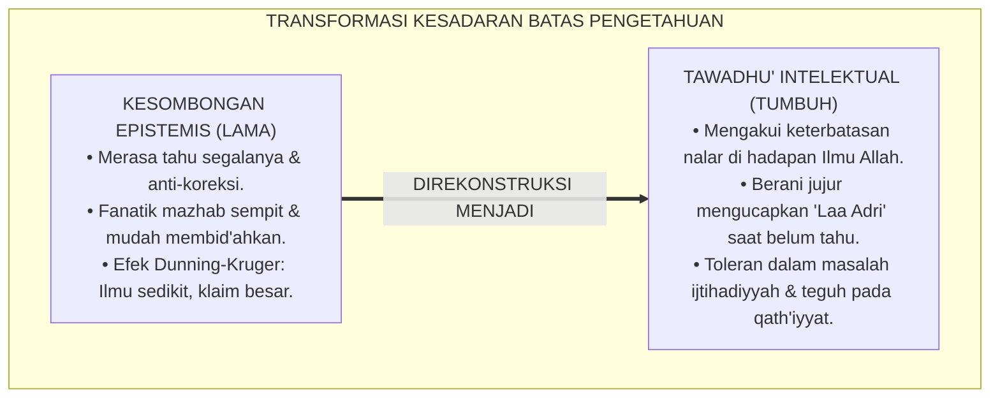
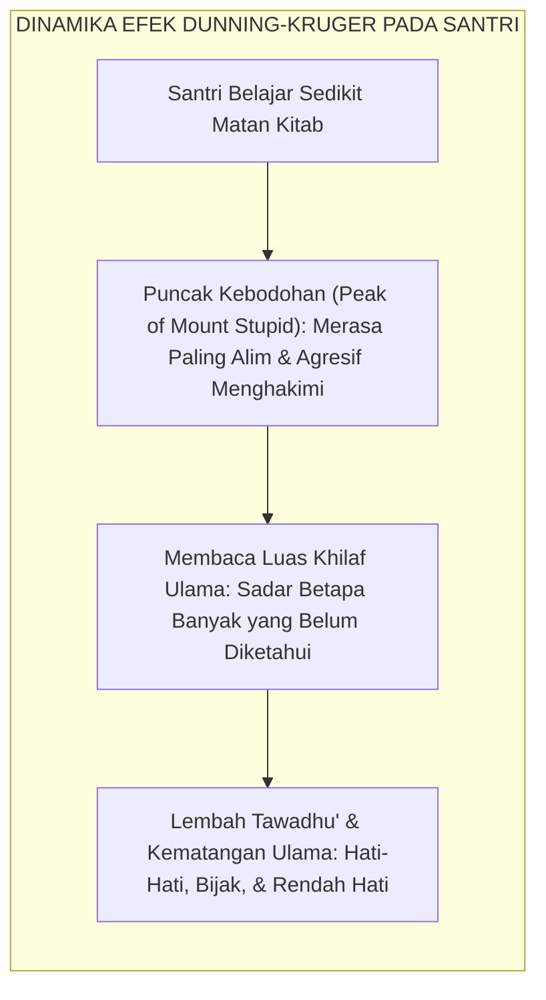
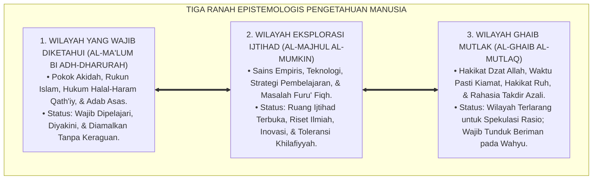
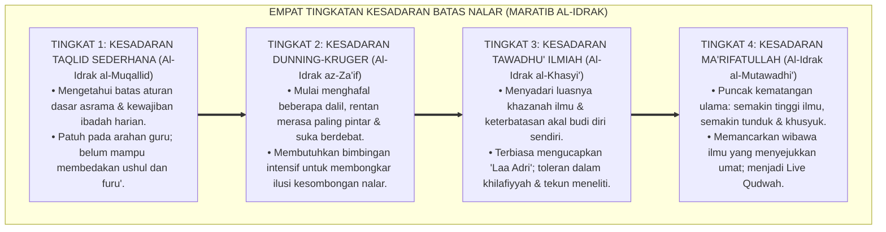
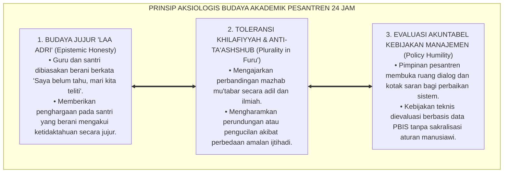

# P1-01-02-05: BATAS-BATAS PENGETAHUAN MANUSIA (THE LIMITS OF HUMAN KNOWLEDGE)
## *Monograf Riset Akademik: Keterbatasan Epistemologis Insan (QS. Al-Isra': 85), Tawadhu' Intelektual (Epistemic Humility), Demarkasi Wilayah Ijtihad vs Dogma Syar'i, Serta Mitigasi Bias Overconfidence di Pesantren 24 Jam*

**Nomor Identifikasi**: `P1-01-02-05/MONOGRAF-RISET-BATAS-ILMU/2026`  
**Domain**: `01 Philosophy` > `01 Worldview` > `02 Epistemologi TUMBUH` (Sub-Modul 05: *Limits of Knowledge*)  
**Klasifikasi Naskah**: *Academic Research Monograph* (Monograf Riset Akademik Fondasional)  
**Rumpun Disiplin Pengkaji**: Epistemologi Turats & Ushuluddin, Filsafat Ilmu (Batas Kognisi & Falsifiabilitas), Psikologi Kognitif (Efek Dunning-Kruger), Etika Akademik & Adab Pesantren  

---

> ### 💡 INTISARI EKSEKUTIF (EXECUTIVE SUMMARY)
>
> * **Kelemahan Paradigma Lama: Ilusi Kesempurnaan Akal & Arogansi Epistemis:**  
>   Banyak pelajar dan pendidik terjebak dalam kesombongan intelektual (*epistemic arrogance*): merasa tahu segalanya, malu mengakui ketidaktahuan (*Laa Adri*), berani berfatwa tanpa dasar ilmu, atau bersikap fanatik buta (*Ta'ashshub*) terhadap pendapat kelompoknya sendiri.
> * **Inovasi Konseptual: Tiga Ranah Epistemologis & Doktrin Tawadhu' Ilmiah:**  
>   TUMBUH membagi pengetahuan manusia ke dalam tiga ranah objektif: **1. Al-Ma'lum (Wilayah yang Wajib Diketahui & Terbukti Pasti); 2. Al-Majhul al-Mumkin (Wilayah Eksplorasi Sains & Ijtihad Terbuka); 3. Al-Ghaib al-Mutlaq (Wilayah Rahasia Mutlak Allah yang Wajib Diimani Tanpa Spekulasi)**. Mengakui batas akal adalah puncak kejujuran ilmiah (*Epistemic Humility*).
> * **Formulasi Operasional & Pembuktian Lapangan:**  
>   Monograf ini menguraikan matriks tiga ranah epistemologis, 4 Tingkatan Kesadaran Batas Nalar (*Maratib al-Idrak*), dekonstruksi efek Dunning-Kruger pada santri, dan etika tata kelola budaya akademik beradab.

---

## 📑 DAFTAR ISI MONOGRAF

- [BAB I: LANDASAN TEORETIS & DISKURSUS KRITIS](#bab-i-landasan-teoretis--diskursus-kritis)
  - [1. Latar Belakang Masalah: Bahaya Arogansi Epistemis dan Fanatisme Mazhab Sempit](#1-latar-belakang-masalah-bahaya-arogansi-epistemis-dan-fanatisme-mazhab-sempit)
  - [2. Fondasi Turats Keterbatasan Insan: Membongkar Ilusi Omnisains Humanisme (QS. Al-Isra': 85 & Al-Ghazali)](#2-fondasi-turats-keterbatasan-insan-membongkar-ilusi-omnisains-humanisme-qs-al-isra-85--al-ghazali)
  - [3. Keberanian Mengakui Ketidaktahuan: Doktrin 'Laa Adri Nishful 'Ilm' dalam Tradisi Salaf](#3-keberanian-mengakui-ketidaktahuan-doktrin-laa-adri-nishful-ilm-dalam-tradisi-salaf)
  - [4. Konvergensi dengan Psikologi Kognitif: Mitigasi Efek Dunning-Kruger pada Santri](#4-konvergensi-dengan-psikologi-kognitif-mitigasi-efek-dunning-kruger-pada-santri)
  - [5. Kasuistika Lapangan: Fenomena Fatwa Tanpa Ilmu & Resolusi Restoratif Terpadu](#5-kasuistika-lapangan-fenomena-fatwa-tanpa-ilmu--resolusi-restoratif-terpadu)
- [BAB II: FORMULASI KONSEPTUAL & PEMBAHASAN MENDALAM](#bab-ii-formulasi-konseptual--pembahasan-mendalam)
  - [1. Eksplanasi Teoretis Tiga Ranah Epistemologis Pengetahuan Manusia](#1-eksplanasi-teoretis-tiga-ranah-epistemologis-pengetahuan-manusia)
  - [2. Dekomposisi Dimensi & Empat Tingkatan Kesadaran Batas Nalar (Maratib al-Idrak)](#2-dekomposisi-dimensi--empat-tingkatan-kesadaran-batas-nalar-maratib-al-idrak)
  - [3. Demarkasi Wilayah Ijtihad Dinamis vs Dogma Syariat Qath'iyyah](#3-demarkasi-wilayah-ijtihad-dinamis-vs-dogma-syariat-qathiyyah)
  - [4. Prinsip Aksiologis & Etika Tata Kelola Budaya Akademik di Pesantren 24 Jam](#4-prinsip-aksiologis--etika-tata-kelola-budaya-akademik-di-pesantren-24-jam)
  - [5. Diskusi Filosofis Mendalam & Implikasi bagi Masa Depan Peradaban Pendidikan Islam](#5-diskusi-filosofis-mendalam--implikasi-bagi-masa-depan-peradaban-pendidikan-islam)
- [BAB III: KESIMPULAN & APARATUS AKADEMIS](#bab-iii-kesimpulan--aparatus-akademis)
  - [1. Tabel Sintesis Temuan Riset Batas Pengetahuan Manusia](#1-tabel-sintesis-temuan-riset-batas-pengetahuan-manusia)
  - [2. Daftar Pustaka Akademis & Rujukan Turats Primer](#2-daftar-pustaka-akademis--rujukan-turats-primer)
  - [3. Catatan Kaki Akademis (Footnotes)](#3-catatan-kaki-akademis-footnotes)
  - [4. Glosarium Istilah Ilmiah & Turats Batas Pengetahuan](#4-glosarium-istilah-ilmiah--turats-batas-pengetahuan)

---

# BAB I: LANDASAN TEORETIS & DISKURSUS KRITIS

---

### 1. Latar Belakang Masalah: Bahaya Arogansi Epistemis dan Fanatisme Mazhab Sempit

Dalam dinamika kehidupan pesantren, salah satu penyakit intelektual yang paling merusak ukhuwah dan produktivitas ilmiah adalah **Kesombongan Epistemis (*Epistemic Arrogance*)**:
* **Sindrom Sok Tahu & Fatwa Sembrono**: Santri yang baru membaca beberapa lembar kitab merasa telah setara dengan mujtahid mutlak, berani menyalahkan ulama besar, dan menghakimi sesama santri yang berbeda amalan furu'iyyah (*Ta'ashshub Mazhabi*).
* **Malu Mengakui Ketidaktahuan**: Guru atau pengurus merasa gengsi mengucapkan *"Saya belum tahu"* di depan santri, sehingga terdorong mengarang jawaban spekulatif yang menyesatkan nalar murid.
* **Keniscayaan Doktrin Tawadhu' Intelektual**: Epistemologi Islam mengajarkan bahwa puncak kematangan ilmu bukanlah merasa tahu segalanya, melainkan menyadari betapa luasnya samudera ilmu Allah yang belum terjangkau oleh akal (*Wa Ma Utitum Minal 'Ilmi Illa Qalila*).[^1]

---

### 2. Fondasi Turats Keterbatasan Insan: Membongkar Ilusi Omnisains Humanisme (QS. Al-Isra': 85 & Al-Ghazali)

Al-Qur'an menetapkan batas tegas kapasitas kognitif manusia di hadapan ilmu Allah:

$$\text{وَيَسْأَلُونَكَ عَنِ الرُّوحِ ۖ قُلِ الرُّوحُ مِنْ أَمْرِ رَبِّي وَمَا أُوتِيتُم مِّنَ الْعِلْمِ إِلَّا قَلِيلًا}$$

*"Dan mereka bertanya kepadamu tentang ruh. Katakanlah: 'Ruh itu termasuk urusan Tuhanku, dan tidaklah kamu diberi pengetahuan melainkan hanya sedikit'."* (QS. Al-Isra' [17]: 85).[^2]

Imam **Abu Hamid Al-Ghazali** dalam *Ihya' 'Ulumiddin* (Kitab *Al-'Ilm*) menegaskan bahwa ilmu manusia dibanding ilmu Allah laksana setetes air di ujung sayap burung yang dicelupkan ke samudera luas:

$$\text{إِنَّ كَمَالَ الْعَقْلِ فِي مَعْرِفَةِ عَجْزِهِ عَنْ دَرْكِ حَقَائِقِ الْغَيْبِ، فَمَنْ ظَنَّ أَنَّ عَقْلَهُ مُحِيطٌ بِكُلِّ مَوْجُودٍ فَقَدْ جَهِلَ نَفْسَهُ وَعَقْلَهُ}$$

*"**Sesungguhnya kesempurnaan akal itu terletak pada pengakuannya atas ketidakmampuannya menembus hakikat alam ghaib mutlak**; maka barangsiapa menyangka bahwa akalnya mampu meliputi segala wujud, sungguh ia telah bodoh terhadap hakikat dirinya sendiri dan bodoh terhadap batas akalnya."*[^3]

---

### 3. Keberanian Mengakui Ketidaktahuan: Doktrin 'Laa Adri Nishful 'Ilm' dalam Tradisi Salaf

Tradisi ulama salafush shalih mewariskan keteladanan agung dalam kejujuran intelektual:
* Imam **Malik bin Anas** saat ditanya 48 masalah oleh penanya yang datang jauh-jauh dari Andalusia, beliau menjawab 32 masalah di antaranya dengan ucapan: *"Laa Adri"* (Saya tidak tahu / belum tahu hukumnya).[^4]
* Para sahabat Rasulullah ﷺ dan tabi'in menanamkan kaidah: **"Ucapan 'Saya tidak tahu' adalah separuh dari ilmu (*Laa Adri Nishful 'Ilm*)"**, karena ia menyelamatkan manusia dari kebohongan dan memotivasi riset lebih lanjut.[^5]

---

### 4. Konvergensi dengan Psikologi Kognitif: Mitigasi Efek Dunning-Kruger pada Santri

Temuan psikologi kognitif modern memvalidasi bahaya kebodohan yang tidak disadari:

Riset **Justin Kruger & David Dunning** (1999) menunjukkan bahwa individu dengan kompetensi rendah cenderung melebih-lebihkan kemampuannya secara drastis (*Overconfidence Bias*). Penataan kurikulum TUMBUH membimbing santri melewati fase ilusi ini menuju kematangan *Epistemic Humility*.[^6]

---

### 5. Kasuistika Lapangan: Fenomena Fatwa Tanpa Ilmu & Resolusi Restoratif Terpadu

* **Studi Kasus: Santri Mengkafirkan Tradisi Ziarah Kubur di Asrama**  
  * **Dilema**: Santri kelas atas yang baru membaca risalah terjemahan membid'ahkan dan mengkafirkan tradisi ziarah kubur santri lain, memicu perpecahan ukhuwah sekamar.
  * **Resolusi Restoratif TUMBUH**: Asatidz senior memfasilitasi forum halaqah dialogis: membedah kitab *Al-Majmu'* Imam An-Nawawi dan *Madarijus Salikin* Ibnu Qayyim al-Jauziyyah yang menguraikan rincian fiqh ziarah kubur dan perbedaan pendapat fuqaha mu'tabar. Santri tersadar bahwa masalah tersebut adalah wilayah *Khilafiyyah Ijtihadiyyah* yang luas. Santri meminta maaf secara terbuka kepada kawan sekamarnya dan berkomitmen menjaga adab persaudaraan.[^7]

---

# BAB II: FORMULASI KONSEPTUAL & PEMBAHASAN MENDALAM

---

### 1. Eksplanasi Teoretis Tiga Ranah Epistemologis Pengetahuan Manusia

Ekosistem TUMBUH mengkodifikasikan batas pengetahuan ke dalam **Tiga Ranah Epistemologis (*Maratib al-Majalat al-Ma'rifiyyah*)**:

#### 🔬 Pembahasan Mendalam Tiga Ranah Pengetahuan:
1. **Ranah 1: Al-Ma'lum bi adh-Dharurah (*The Essential Realm*)**: Pengetahuan fundamental yang menjadi syarat sahnya iman dan amal ibadah. Seluruh santri wajib menguasainya dengan pasti tanpa keraguan.[^8]
2. **Ranah 2: Al-Majhul al-Mumkin (*The Exploratory & Ijtihad Realm*)**: Pengetahuan alam semesta dan masalah furu'iyyah yang dapat dijangkau oleh penelitian sains dan ijtihad akal. Pesantren mendorong eksplorasi riset seluas-luasnya di ranah ini.[^9]
3. **Ranah 3: Al-Ghaib al-Mutlaq (*The Transcendent Mystery Realm*)**: Pengetahuan yang sengaja dirahasiakan oleh Allah sebagai ujian keimanan (*Ibtila'*). Akal manusia diharamkan berspekulasi liar di ranah ini.[^10]

---

### 2. Dekomposisi Dimensi & Empat Tingkatan Kesadaran Batas Nalar (Maratib al-Idrak)

Transformasi kedewasaan epistemologis santri dan pengasuh berlangsung melalui **Empat Tingkatan Kesadaran Batas Nalar (*Maratib al-Idrak al-Haddiy*)**:

#### 🔄 Narasi Analitis Dinamika Transisi Filosofis Antar-Tingkatan:
* **Transisi Tingkat 1 ke Tingkat 2 (Dari Taqlid ke Godaan Dunning-Kruger)**: Santri yang mulai belajar nahwu atau fiqh sering kali terjerumus dalam euforia intelektual: merasa paling benar dan mudah menyalahkan orang lain.
* **Transisi Tingkat 2 ke Tingkat 3 (Dari Dunning-Kruger Menuju Tawadhu' Ilmiah)**: Melalui kajian perbandingan mazhab (*Fiqh Muqaran*) dan riset sains yang kompleks, santri tersadar betapa kerdilnya pengetahuan dirinya. Santri mulai memiliki rem batin untuk berhati-hati dalam berbicara.
* **Transisi Tingkat 3 ke Tingkat 4 (Pencapaian Derajat Khasyyatullah)**: Pada tingkatan tertinggi, santri meraih derajat ulama hakiki (QS. Fathir: 28): ilmunya tidak melahirkan kesombongan, melainkan rasa takut dan pengagungan yang mendalam kepada Allah SWT.[^11]

---

### 3. Demarkasi Wilayah Ijtihad Dinamis vs Dogma Syariat Qath'iyyah

TUMBUH menetapkan kaidah fiqh agung untuk mencegah fanatisme sempit:

$$\text{لَا يُنْكَرُ الْمُخْتَلَفُ فِيهِ، وَإِنَّمَا يُنْكَرُ الْمُجْمَعُ عَلَيْهِ}$$

*"**Tidak boleh diingkari (dihakimi secara mutlak) pendapat dalam perkara yang diperselisihkan ulama (Khilafiyyah Ijtihadiyyah), melainkan yang wajib diingkari adalah pelanggaran terhadap perkara yang telah disepakati mutlak oleh ijma' ulama (Qath'iyyat Syar'iyyah)**."* (Kaidah Fiqh Imam As-Suyuthi dalam *Al-Asybah wan-Nazha'ir*).[^12]

Kaidah ini menjamin iklim asrama yang sejuk: santri saling menghargai perbedaan amalan furu' (seperti qunut subuh atau jumlah rakaat tarawih) sembari bersatu kokoh dalam menjaga pokok akidah dan adab ukhuwah.[^13]

---

### 4. Prinsip Aksiologis & Etika Tata Kelola Budaya Akademik di Pesantren 24 Jam

Kesadaran batas pengetahuan melahirkan prinsip etika tata kelola kelembagaan:

#### 📋 Panduan Etika Pengasuhan Lapangan:
1. **Pemberian Teladan Kerendahan Hati oleh Asatidz**: Pengasuh tidak malu bertanya atau merujuk kembali ke kamus dan kitab saat menghadapi pertanyaan sulit santri.
2. **Kajian Fiqh Perbandingan Mazhab**: Membimbing santri memahami argumentasi dalil dari empat mazhab Ahlussunnah agar memiliki wawasan keagamaan yang luas dan toleran.[^14]
3. **Forum Musyawarah Terbuka Santri**: Memberikan ruang bagi santri untuk menyampaikan pandangan dan masukan perbaikan tata kelola asrama secara santun dan beradab.[^15]

---

### 5. Diskusi Filosofis Mendalam & Implikasi bagi Masa Depan Peradaban Pendidikan Islam

Pengakuan atas batas pengetahuan manusia membawa dampak transformatif bagi kebangkitan peradaban:

* **Mencegah Ekstremisme dan Fanatisme Buta (*Al-Ghuluw fid-Din*)**:  
  Sebagian besar paham radikal dan terorisme lahir dari kesombongan epistemis: menganggap pemahaman kelompoknya sebagai satu-satunya kebenaran mutlak dan mengkafirkan pihak lain. Tawadhu' intelektual TUMBUH adalah vaksin teologis paling ampuh melawan radikalisme.
* **Mendorong Riset Sains dan Inovasi Tanpa Henti**:  
  Kesadaran bahwa manusia hanya diberi sedikit ilmu justru memicu rasa ingin tahu ilmiah (*Scientific Curiosity*) yang membara untuk terus meneliti alam semesta dan menemukan teknologi baru yang maslahat.
* **Melahirkan Generasi Ulama-Cendekiawan yang Sejuk dan Diterima Umat**:  
  Lulusan pesantren yang memiliki *Epistemic Humility* akan tampil sebagai tokoh pemersatu umat yang bijak, mengayomi seluruh lapisan masyarakat, dan menjunjung tinggi ukhuwah Islamiyyah.[^16]

---

# BAB III: KESIMPULAN & APARATUS AKADEMIS

---

### 1. Tabel Sintesis Temuan Riset Batas Pengetahuan Manusia

| Dimensi Parameter | Mazhab Humanisme Sombong | Mazhab Fanatisme Sempit | **Epistemologi Tawadhu' TUMBUH** | Landasan Rujukan Primer | Implikasi Praksis Lapangan |
| :--- | :--- | :--- | :--- | :--- | :--- |
| **Batas Nalar** | Akal tolak ukur mutlak segalanya. | Mengklaim kelompoknya pemilik surga. | **Keterbatasan Insan & Tawadhu' Ilmiah.** | QS. Al-Isra': 85; Al-Ghazali (*Ihya'*). | Mengakui kelemahan nalar di hadapan Allah. |
| **Sikap 'Laa Adri'**| Dianggap memalukan & tanda bodoh. | Dihindari; gemar memaksakan fatwa. | **Separuh dari Ilmu (*Nishful 'Ilm*).** | Imam Malik; KH. Hasyim Asy'ari. | Budaya jujur mengakui belum tahu & riset. |
| **Perbedaan Furu'** | Relativisme mutlak tanpa kebenaran. | Mudah membid'ahkan & mengkafirkan. | **Toleransi Khilafiyyah & Teguh Ushul.** | As-Suyuthi (*Al-Asybah*); Asy-Syathibi. | Harmoni ukhuwah santri 4 mazhab Aswaja. |
| **Evaluasi Kebijakan**| Mengultuskan sains buatan manusia. | Sakralisasi aturan pondok kaku. | **Desakralisasi Ijtihad & Evaluasi Data.** | Popper (1959); Senge (1990); Horner. | Pimpinan asrama terbuka terhadap kritik data. |
| **Profil Karakter** | Intelektual angkuh (*Iblis Complex*). | Fanatik buta yang intoleran. | **Ulama Beradab yang Khasyyatullah.** | QS. Fathir: 28; Kruger & Dunning (1999). | Rendah hati, bijak, ilmiah, & memersatukan. |

---

### 2. Daftar Pustaka Akademis & Rujukan Turats Primer

1. **Al-Qur'an al-Karim wa Tarjamatu Ma'anihi**.
2. **Al-Ghazali, Abu Hamid Muhammad bin Muhammad**. (2011). *Ihya' 'Ulumiddin* (Kitab al-'Ilm & Kitab Dhamm al-Ghurur). Beirut: Dar al-Ma'rifah.
3. **An-Nawawi, Abu Zakariya Muhyiddin Yahya bin Syaraf**. (1426 H). *Al-Majmu' Syarh al-Muhadzdzab*. Kairo: Darul Hadits.
4. **As-Suyuthi, Jalaluddin Abdurrahman bin Abi Bakr**. (1411 H). *Al-Asybah wan-Nazha'ir fi Qawa'id Fiqh asy-Syafi'iyyah*. Beirut: Dar al-Kutub al-'Ilmiyyah.
5. **Asy-Syathibi, Abu Ishaq Ibrahim bin Musa**. (1417 H). *Al-Muwafaqat fi Ushul asy-Syari'ah*. Khobar: Dar Ibn 'Affan.
6. **Asy'ari, Muhammad Hasyim**. (1415 H). *Adab al-'Alim wal-Muta'allim*. Jombang: Maktabah At-Turats Al-Islami.
7. **Al-Attas, Syed Muhammad Naquib**. (1980). *The Concept of Education in Islam*. Kuala Lumpur: ABIM.
8. **Kruger, J., & Dunning, D.**. (1999). *Unskilled and unaware of it: How difficulties in recognizing one's own incompetence lead to inflated self-assessments*. Journal of Personality and Social Psychology, 77(6), 1121–1134.
9. **Popper, K. R.**. (1959). *The Logic of Scientific Discovery*. London: Routledge.
10. **Senge, P. M.**. (1990). *The Fifth Discipline: The Art and Practice of the Learning Organization*. New York: Doubleday.
11. **Horner, R. H., & Sugai, G.**. (2015). *School-wide PBIS: An Overview of the Research Base*. Remedial and Special Education, 36(2), 80–85.
12. **Zehr, H.**. (2002). *The Little Book of Restorative Justice*. Intercourse: Good Books.

---

### 3. Catatan Kaki Akademis (*Footnotes*)

[^1]: Riset Batas Kognitif Pendidikan Pesantren TUMBUH, *Kritik atas Kesombongan Epistemis dan Fanatisme Mazhab*, 2026.  
[^2]: QS. Al-Isra' [17]: 85.  
[^3]: Al-Ghazali, *Ihya' 'Ulumiddin*, Jilid 3, Kitab *Dhamm al-Ghurur*, hlm. 120–155.  
[^4]: An-Nawawi, *Al-Majmu' Syarh al-Muhadzdzab*, Jilid 1, *Adab al-Mufti wal Mustafti*, hlm. 65–88.  
[^5]: KH. Hasyim Asy'ari, *Adab al-'Alim wal-Muta'allim*, hlm. 28–46.  
[^6]: Kruger, J., & Dunning, D. (1999), *Journal of Personality and Social Psychology*, hlm. 1121–1134.  
[^7]: Dokumentasi Mediasi Sengketa Khilafiyyah Kamar Asrama PBIS TUMBUH, 2026.  
[^8]: Asy-Syathibi, *Al-Muwafaqat fi Ushul asy-Syari'ah*, Jilid 1, hlm. 45–70.  
[^9]: Popper, K. R. (1959), *The Logic of Scientific Discovery*, hlm. 50–78.  
[^10]: Al-Ghazali, *Ihya' 'Ulumiddin*, Jilid 1, Kitab *Al-'Ilm*, hlm. 60–92.  
[^11]: Matriks Tingkatan Kesadaran Batas Nalar (*Maratib al-Idrak*) Ekosistem TUMBUH, 2026.  
[^12]: As-Suyuthi, *Al-Asybah wan-Nazha'ir*, hlm. 158–175.  
[^13]: Silabus Kajian Fiqh Perbandingan Mazhab Beradab Ma'had Aly TUMBUH, 2026.  
[^14]: Petunjuk Teknis Budaya Akademik Rendah Hati Asatidz TUMBUH, 2026.  
[^15]: Standar Musyawarah Dewan Syuro dan Evaluasi Tata Kelola Asrama TUMBUH, 2026.  
[^16]: Deklarasi Tawadhu' Intelektual dan Ukhuwah Islamiyyah Dewan Epistemologi TUMBUH, 2026.

---

### 4. Glosarium Istilah Ilmiah & Turats Batas Pengetahuan

1. **Epistemic Humility (Tawadhu' Intelektual)**: Sikap kerendahan hati ilmiah yang menyadari keterbatasan nalar manusia dan senantiasa terbuka terhadap koreksi kebenaran wahyu dan data faktual.
2. **Epistemic Arrogance (Kesombongan Epistemis)**: Sikap angkuh intelektual yang merasa paling benar, anti-kritik, dan meremehkan pendapat orang lain.
3. **Al-Ma'lum bi adh-Dharurah**: Pokok-pokok ajaran Islam yang pasti dan wajib diketahui oleh setiap muslim (seperti kewajiban shalat, keharaman zina) yang tidak menerima ruang perdebatan.
4. **Al-Majhul al-Mumkin**: Wilayah misteri alam semesta dan masalah furu' hukum yang dapat dan boleh diteliti oleh manusia melalui sains dan ijtihad.
5. **Al-Ghaib al-Mutlaq**: Wilayah metafisik transendental yang mutlak menjadi rahasia Allah dan tertutup dari jangkauan spekulasi akal manusia.
6. **Laa Adri (لَا أَدْرِي)**: Pernyataan jujur "Saya tidak tahu / belum tahu" yang diucapkan oleh penuntut ilmu dan ulama besar saat menghadapi masalah yang belum dikuasainya.
7. **Ta'ashshub Mazhabi (تَعَصُّبٌ مَذْهَبِيٌّ)**: Sikap fanatisme buta terhadap suatu mazhab atau kelompok yang memicu perpecahan dan permusuhan di tengah umat.
8. **Dunning-Kruger Effect**: Bias kognitif di mana orang yang berpengetahuan minim melebih-lebihkan kemampuannya dan merasa paling pintar.
9. **Khasyyatullah (خَشْيَةُ اللَّهِ)**: Rasa takut dan hormat yang mendalam kepada Allah yang lahir dari tingginya makrifat dan ilmu pengetahuan yang benar.
10. **Khilafiyyah Ijtihadiyyah**: Perbedaan pandangan fiqh di kalangan ulama mujtahid dalam masalah-masalah cabang (*Furu'*) yang wajib disikapi dengan toleransi dan saling menghormati.
