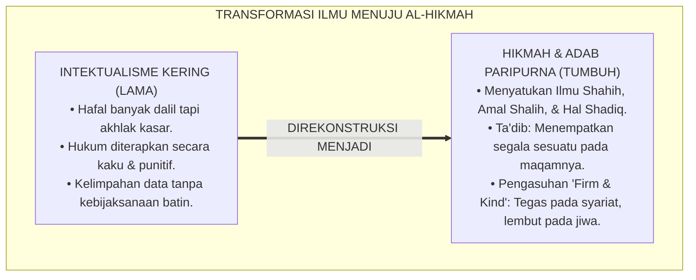
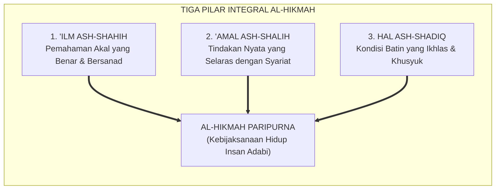
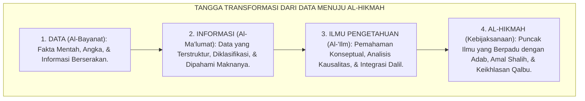
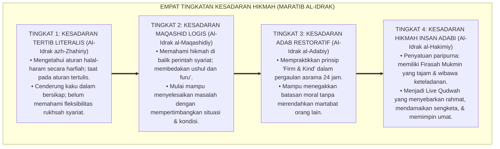
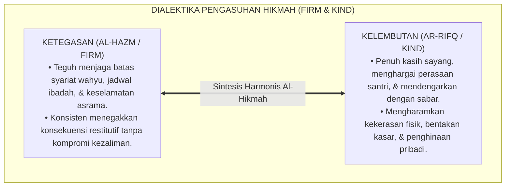
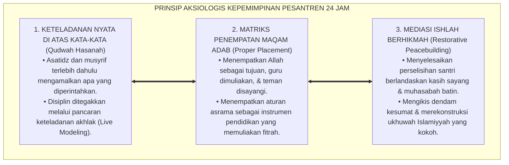

# P1-01-02-06: HIKMAH DAN KEBIJAKSANAAN DALAM PRAKSIS (AL-HIKMAH IN PRAXIS)
## *Monograf Riset Akademik: Puncak Integrasi Ilmu dan Amal (Al-Hikmah), Adab sebagai Penempatan Segala Sesuatu pada Maqamnya ('Adl), Dialektika Ketegasan & Kelembutan (Firm & Kind), Serta Formasi Insan Adabi di Pesantren 24 Jam*

**Nomor Identifikasi**: `P1-01-02-06/MONOGRAF-RISET-HIKMAH-PRAKSIS/2026`  
**Domain**: `01 Philosophy` > `01 Worldview` > `02 Epistemologi TUMBUH` (Sub-Modul 06: *Wisdom & Praxis*)  
**Klasifikasi Naskah**: *Academic Research Monograph* (Monograf Riset Akademik Fondasional)  
**Rumpun Disiplin Pengkaji**: Epistemologi Turats & Tasawuf Akhlaqi, Filsafat Pendidikan Islam (Ta'dib Al-Attas), Psikologi Moral & Kebijaksanaan (Phronesis), Desain Kurikulum Adab, Kepemimpinan Pengasuhan Asrama  

---

> ### 💡 INTISARI EKSEKUTIF (EXECUTIVE SUMMARY)
>
> * **Kelemahan Paradigma Lama: Keterpisahan Ilmu dari Amal & Adab:**  
>   Dunia pendidikan modern mengalami kelimpahan data (*information abundance*) namun kelaparan kebijaksanaan (*wisdom famine*). Banyak penuntut ilmu cerdas dalam menghafal teks dan mahir berdebat, namun bicaranya kasar, angkuh, dan tindakannya melukai perasaan sesama (*Epistemic-Moral Gap*).
> * **Inovasi Konseptual: Al-Hikmah sebagai Muara Paripurna Epistemologi Islam:**  
>   TUMBUH merumuskan **Al-Hikmah** sebagai anugerah tertinggi (*Khairan Katsira* - QS. Al-Baqarah: 269), yaitu kesatuan organik antara Ilmu yang Shahih (*'Ilm ash-Shahih*), Amal yang Shalih (*'Amal ash-Shalih*), dan Kondisi Ruhani yang Tulus (*Hal ash-Shadiq*). Hikmah menjelma dalam bentuk **Adab**: kemampuan menempatkan segala sesuatu pada posisi dan porsinya yang adil (*Putting things in their proper places*).
> * **Formulasi Operasional & Pembuktian Lapangan:**  
>   Monograf ini menguraikan matriks penempatan maqam adab lima dimensi, 4 Tingkatan Kesadaran Hikmah (*Maratib al-Idrak*), dialektika pengasuhan *Firm & Kind*, dan etika tata kelola kepemimpinan *Qudwah Hasanah*.

---

## 📑 DAFTAR ISI MONOGRAF

- [BAB I: LANDASAN TEORETIS & DISKURSUS KRITIS](#bab-i-landasan-teoretis--diskursus-kritis)
  - [1. Latar Belakang Masalah: Krisis Kebijaksanaan di Era Kelimpahan Informasi](#1-latar-belakang-masalah-krisis-kebijaksanaan-di-era-kelimpahan-informasi)
  - [2. Eksegesis Turats Hakikat Al-Hikmah: Anugerah Kebaikan yang Melimpah (QS. Al-Baqarah: 269 & Ibn Katsir)](#2-eksegesis-turats-hakikat-al-hikmah-anugerah-kebaikan-yang-melimpah-qs-al-baqarah-269--ibn-katsir)
  - [3. Tiga Dimensi Hakikat Hikmah: Penyatuan 'Ilm ash-Shahih, 'Amal ash-Shalih, & Hal ash-Shadiq](#3-tiga-dimensi-hakikat-hikmah-penyatuan-ilm-ash-shahih-amal-ash-shalih--hal-ash-shadiq)
  - [4. Formulasi Konsep Ta'dib & Keadilan: Meletakkan Segala Sesuatu pada Maqam yang Hakiki (Al-Attas)](#4-formulasi-konsep-tadb--keadilan-meletakkan-segala-sesuatu-pada-maqam-yang-hakiki-al-attas)
  - [5. Kasuistika Lapangan: Fenomena Kekakuan Pendisiplinan Asrama & Resolusi Restoratif](#5-kasuistika-lapangan-fenomena-kekakuan-pendisiplinan-asrama--resolusi-restoratif)
- [BAB II: FORMULASI KONSEPTUAL & PEMBAHASAN MENDALAM](#bab-ii-formulasi-konseptual--pembahasan-mendalam)
  - [1. Eksplanasi Teoretis Tangga Transformasi Kognisi: Dari Data Menuju Al-Hikmah](#1-eksplanasi-teoretis-tangga-transformasi-kognisi-dari-data-menuju-al-hikmah)
  - [2. Dekomposisi Dimensi & Empat Tingkatan Kesadaran Hikmah (Maratib al-Idrak)](#2-dekomposisi-dimensi--empat-tingkatan-kesadaran-hikmah-maratib-al-idrak)
  - [3. Dialektika Ketegasan dan Kasih Sayang (Firm & Kind) dalam Pengasuhan 24 Jam](#3-dialektika-ketegasan-dan-kasih-sayang-firm--kind-dalam-pengasuhan-24-jam)
  - [4. Prinsip Aksiologis & Etika Tata Kelola Kepemimpinan Qudwah Hasanah](#4-prinsip-aksiologis--etika-tata-kelola-kepemimpinan-qudwah-hasanah)
  - [5. Diskusi Filosofis Mendalam & Implikasi bagi Masa Depan Peradaban Pendidikan Islam](#5-diskusi-filosofis-mendalam--implikasi-bagi-masa-depan-peradaban-pendidikan-islam)
- [BAB III: KESIMPULAN & APARATUS AKADEMIS](#bab-iii-kesimpulan--aparatus-akademis)
  - [1. Tabel Sintesis Temuan Riset Hikmah dan Kebijaksanaan](#1-tabel-sintesis-temuan-riset-hikmah-dan-kebijaksanaan)
  - [2. Daftar Pustaka Akademis & Rujukan Turats Primer](#2-daftar-pustaka-akademis--rujukan-turats-primer)
  - [3. Catatan Kaki Akademis (Footnotes)](#3-catatan-kaki-akademis-footnotes)
  - [4. Glosarium Istilah Ilmiah & Turats Hikmah dan Adab](#4-glosarium-istilah-ilmiah--turats-hikmah-dan-adab)

---

# BAB I: LANDASAN TEORETIS & DISKURSUS KRITIS

---

### 1. Latar Belakang Masalah: Krisis Kebijaksanaan di Era Kelimpahan Informasi

Dunia pendidikan kontemporer mengalami anomali serius: manusia memiliki akses tanpa batas terhadap data dan informasi (*Information Abundance*), namun mengalami kelaparan akut akan hikmah kebijaksanaan (*Wisdom Famine*):
* **Pintar Tanpa Adab (*Intellectual Arrogance*)**: Banyak orang menguasai ilmu agama dan sains dengan nilai akademis sempurna, namun perilakunya arogan, ucapannya melukai hati sesama, dan tindakannya merusak harmoni sosial.
* **Kekakuan Fiqh Tanpa Ruh Kasih Sayang**: Pengasuhan asrama sering kali diterapkan secara kaku dan mekanis tanpa mempertimbangkan kondisi jiwa santri (*Hikmah at-Tarbiyah*). Hukum diterapkan semata-mata untuk menghukum, bukan untuk mendidik dan memulihkan.
* **Keniscayaan Al-Hikmah Sebagai Muara Keilmuan**: Epistemologi Islam menegaskan bahwa tujuan tertinggi ilmu bukanlah penumpukan informasi kognitif (*Al-Ma'lumat*), melainkan **Al-Hikmah (Kebijaksanaan Paripurna)** yang membuahkan amal shalih dan kemuliaan adab.[^1]

---

### 2. Eksegesis Turats Hakikat Al-Hikmah: Anugerah Kebaikan yang Melimpah (QS. Al-Baqarah: 269 & Ibn Katsir)

Al-Qur'an memuji orang-orang yang dianugerahi Al-Hikmah sebagai pemilik kebaikan yang tiada tara:

$$\text{يُؤْتِي الْحِكْمَةَ مَن يَشَاءُ ۚ وَمَن يُؤْتَ الْحِكْمَةَ فَقَدْ أُوتِيَ خَيْرًا كَثِيرًا ۗ وَمَا يَذَّكَّرُ إِلَّا أُولُو الْأَلْبَابِ}$$

*"Dia menganugerahkan Al-Hikmah (kebijaksanaan, pemahaman mendalam, dan ketepatan amal) kepada siapa yang Dia kehendaki. Dan barangsiapa yang dianugerahi Al-Hikmah itu, sungguh ia telah dianugerahi kebaikan yang sangat banyak. Dan tidak ada yang dapat mengambil pelajaran melainkan orang-orang yang berakal (Ulul Albab)."* (QS. Al-Baqarah [2]: 269).[^2]

Imam **Ibnu Katsir** dalam tafsirnya mengutip Ibnu Abbas: *"Al-Hikmah adalah memahami Al-Qur'an, mengetahui nasikh dan mansukh, muhkam dan mutasyabih, serta mengamalkan isinya dengan penuh keikhlasan dan adab."*[^3]

---

### 3. Tiga Dimensi Hakikat Hikmah: Penyatuan 'Ilm ash-Shahih, 'Amal ash-Shalih, & Hal ash-Shadiq

Para ulama tasawuf Sunni dan ushuluddin merumuskan bahwa Al-Hikmah hanya terwujud apabila tiga pilar utama menyatu:

Jika seseorang memiliki ilmu tanpa amal, ia menjadi fasik; jika beramal tanpa ilmu, ia tersesat; dan jika berilmu serta beramal tanpa keikhlasan batin (*Hal*), ia jatuh dalam kemunafikan (*Riya'*). Al-Hikmah adalah kesatuan mutlak ketiganya.[^4]

---

### 4. Formulasi Konsep Ta'dib & Keadilan: Meletakkan Segala Sesuatu pada Maqam yang Hakiki (Al-Attas)

Prof. **Syed Muhammad Naquib Al-Attas** merumuskan relasi fundamental antara Hikmah, Keadilan (*'Adl*), dan Adab:

$$\text{الْحِكْمَةُ هِيَ الْعِلْمُ الَّذِي يُمَكِّنُ الْإِنْسَانَ مِنْ وَضْعِ كُلِّ شَيْءٍ فِي مَوْضِعِهِ اللَّائِقِ بِهِ؛ وَالْعَدْلُ هُوَ الْحَالَةُ النَّاشِئَةُ عَنْ هَذَا الْوَضْعِ؛ وَالْأَدَبُ هُوَ التَّطْبِيقُ الْعَمَلِيُّ لِلْعَدْلِ وَالْحِكْمَةِ فِي الْحَيَاةِ}$$

*"**Al-Hikmah adalah ilmu yang memampukan manusia meletakkan segala sesuatu pada tempat dan porsinya yang tepat dan benar (*Proper Places*); dan Keadilan ('Adl) adalah kondisi yang terwujud dari penempatan yang tepat tersebut; sedangkan Adab adalah praksis operasional nyata dari keadilan dan hikmah tersebut dalam kehidupan**."*[^5]

---

### 5. Kasuistika Lapangan: Fenomena Kekakuan Pendisiplinan Asrama & Resolusi Restoratif

* **Studi Kasus: Musyrif Menghukum Santri Sakit yang Terlambat Shalat Berjamaah**  
  * **Dilema**: Musyrif menghukum santri yang terlambat shalat subuh dengan disiram air dan dijemur, tanpa memeriksa bahwa santri tersebut sedang demam tinggi 39°C.
  * **Analisis Pelanggaran Hikmah**: Musyrif bersikap zalim karena gagal meletakkan syariat pada tempatnya: syariat memberikan *Rukhsah* (keringanan) bagi orang sakit, bukan hukuman fisik.
  * **Resolusi Restoratif TUMBUH**: Pimpinan dewan asrama membatalkan hukuman; santri sakit segera dibawa ke klinik asrama untuk diobati; musyrif diberikan pembinaan mendalam mengenai fiqh pengasuhan nabawi (*Rifq* dan Hikmah). Musyrif belajar menyeimbangkan antara ketegasan aturan (*Firm*) dan kepekaan nurani (*Kind*).[^6]

---

# BAB II: FORMULASI KONSEPTUAL & PEMBAHASAN MENDALAM

---

### 1. Eksplanasi Teoretis Tangga Transformasi Kognisi: Dari Data Menuju Al-Hikmah

Ekosistem TUMBUH memetakan progresi keilmuan ke dalam **Tangga Transformasi Kognisi Epistemologis (*Sullam at-Tahawwul al-Ma'rifiy*)**:

#### 🔬 Pembahasan Mendalam Empat Tingkatan Tangga:
1. **Tingkat 1: Data (*Al-Bayanat*)**: Fakta mentah berupa hafalan lafal, teks kitab, atau catatan absensi santri. Data ini belum bernilai jika belum diolah.[^7]
2. **Tingkat 2: Informasi (*Al-Ma'lumat*)**: Data yang telah dipahami maknanya, seperti terjemahan ayat atau arti kosakata bahasa Arab.[^8]
3. **Tingkat 3: Ilmu (*Al-'Ilm*)**: Pengetahuan mendalam yang mampu menghubungkan sebab-akibat, membedah dalil, dan merumuskan argumentasi logika.[^9]
4. **Tingkat 4: Hikmah (*Al-Hikmah*)**: Puncak kematangan manusia, di mana ilmu tidak lagi sekadar menjadi teori di kepala, melainkan memancar dalam bentuk ketepatan tutur kata, kelembutan akhlak, keadilan bersikap, dan keteladanan hidup (*Live Qudwah*).[^10]

---

### 2. Dekomposisi Dimensi & Empat Tingkatan Kesadaran Hikmah (Maratib al-Idrak)

Transformasi kedewasaan berhikmah santri dan asatidz berlangsung melalui **Empat Tingkatan Kesadaran Hikmah (*Maratib al-Idrak al-Hikmiy*)**:

#### 🔄 Narasi Analitis Dinamika Transisi Filosofis Antar-Tingkatan:
* **Transisi Tingkat 1 ke Tingkat 2 (Dari Tekstual Menuju Maqashid)**: Santri mula-mula memahami syariat secara hitam-putih. Pada tingkatan kedua, santri memahami ruh maqashid: bahwa hukum diturunkan untuk mendatangkan kemaslahatan (*Jalbul Mashalih*) dan menolak bahaya (*Dar'ul Mafasid*).
* **Transisi Tingkat 2 ke Tingkat 3 (Dari Maqashid Menuju Adab Praksis)**: Pada tingkatan ketiga, santri mampu mengendalikan emosi dan bersikap bijak: saat menegur teman sekamar yang salah, santri memilih bahasa yang santun dan waktu yang tepat (*Firm & Kind*), tidak memalukannya di depan umum.
* **Transisi Tingkat 3 ke Tingkat 4 (Pencapaian Derajat Al-Hakim)**: Pada tingkatan tertinggi, santri memancarkan kematangan *Insan Adabi*: kehadirannya menenteramkan suasana, bicaranya sarat makna, dan keputusannya senantiasa adil serta membawa berkah bagi seluruh ekosistem.[^11]

---

### 3. Dialektika Ketegasan dan Kasih Sayang (Firm & Kind) dalam Pengasuhan 24 Jam

Ekosistem TUMBUH merumuskan praksis hikmah dalam pengasuhan melalui **Prinsip Tegas & Lembut (*Al-Hazm war-Rifq / Firm & Kind*)**:

Ketegasan tanpa kelembutan melahirkan kediktatoran (*Istibdad*); kelembutan tanpa ketegasan melahirkan sikap permisif (*Fawdha*). Al-Hikmah memadukan keduanya secara adil dan tepat.[^12]

---

### 4. Prinsip Aksiologis & Etika Tata Kelola Kepemimpinan Qudwah Hasanah

Hikmah dan adab melahirkan prinsip etika tata kelola kepemimpinan pesantren:

#### 📋 Panduan Etika Pengasuhan Lapangan:
1. **Kepemimpinan Berbasis Khidmah (*Servant Leadership*)**: Pemimpin memposisikan diri sebagai pelayan yang mengayomi dan memudahkan urusan santri.
2. **Klinik Konseling Hikmah**: Musyrif dilatih dalam mendengarkan aktif (*Active Empathetic Listening*) guna memahami akar permasalahan jiwa santri.[^13]
3. **Standarisasi Bahasa Komunikasi Positif**: Mengharamkan penggunaan kata-kata sarkasme, ejekan, atau labeling negatif dalam seluruh interaksi asrama 24 jam.[^14]

---

### 5. Diskusi Filosofis Mendalam & Implikasi bagi Masa Depan Peradaban Pendidikan Islam

Penerapan Al-Hikmah dalam praksis pendidikan membawa lompatan kualitatif bagi kemajuan peradaban:

* **Mencetak Pemimpin Peradaban Berkarakter Negarawan Ulama**:  
  Umat Islam tidak kekurangan orang pintar, melainkan krisis tokoh bijak yang berwibawa. Lulusan ekosistem TUMBUH disiapkan menjadi negarawan dan ulama yang mampu menyatukan perbedaan umat dan memimpin transformasi bangsa.
* **Menjadikan Pesantren Sebagai Laboratorium Perdamaian Dunia**:  
  Dengan mempraktikkan adab dan keadilan restoratif, pesantren menjadi miniatur masyarakat madani (*Bi'ah Shalihah*) yang damai, adil, sejahtera, dan penuh berkah.
* **Mengembalikan Mahkota Keilmuan Islam**:  
  Al-Hikmah adalah mutiara peradaban Islam yang hilang. Menghidupkan kembali hikmah berarti mengembalikan ruh kenabian ke dalam denyut nadi pendidikan Islam di era modern.[^15]

---

# BAB III: KESIMPULAN & APARATUS AKADEMIS

---

### 1. Tabel Sintesis Temuan Riset Hikmah dan Kebijaksanaan

| Dimensi Parameter | Pola Pendidikan Konvensional | Rekonstruksi Al-Hikmah TUMBUH | Landasan Rujukan Primer | Implikasi Praksis Lapangan |
| :--- | :--- | :--- | :--- | :--- |
| **Muara Ilmu** | Penumpukan hafalan data kognitif. | Penyatuan Ilmu, Amal, & Hal (*Al-Hikmah*).| QS. Al-Baqarah: 269; Ibn Katsir. | Ilmu berbuah amal shalih & keagungan adab. |
| **Konsep Adab** | Formalitas cium tangan tanpa ruh. | Menempatkan Segala Sesuatu pada Maqamnya.| Al-Attas (1980); Aristoteles (*Phronesis*).| Keadilan relasi: Khaliq, Asatidz, Santri, Alam. |
| **Pola Pengasuhan** | Keras diktator atau lembek permisif. | Dialektika Harmonis *Firm & Kind*. | HR. Muslim No. 2594; Nelsen (2006). | Tegas pada aturan, lembut pada kalbu anak. |
| **Resolusi Kasus** | Hukuman fisik keras & balas dendam. | Mediasi Islah & Restorasi Keberkahan. | Zehr (2002); Horner & Sugai (2015). | Santri sadar fitrah, meminta maaf, & berbenah. |
| **Profil Lulusan** | Intelektual kaku yang minim empati. | **Insan Adabi Generasi Ulul Albab.** | QS. Ali 'Imran: 190–191; Al-Ghazali. | Pemimpin berwibawa, bijak, & dicintai umat. |

---

### 2. Daftar Pustaka Akademis & Rujukan Turats Primer

1. **Al-Qur'an al-Karim wa Tarjamatu Ma'anihi**.
2. **Al-Attas, Syed Muhammad Naquib**. (1980). *The Concept of Education in Islam*. Kuala Lumpur: ABIM.
3. **Al-Attas, Syed Muhammad Naquib**. (1995). *Prolegomena to the Metaphysics of Islam*. Kuala Lumpur: ISTAC.
4. **Al-Ghazali, Abu Hamid Muhammad bin Muhammad**. (2011). *Ihya' 'Ulumiddin* (Kitab al-'Ilm & Kitab Adab al-Ulfah). Beirut: Dar al-Ma'rifah.
5. **Ibnu Katsir, 'Imaduddin Abul Fida' Isma'il**. (1420 H). *Tafsir al-Qur'an al-'Azhim*. Riyadh: Dar Thayyibah.
6. **Asy'ari, Muhammad Hasyim**. (1415 H). *Adab al-'Alim wal-Muta'allim*. Jombang: Maktabah At-Turats Al-Islami.
7. **Aristotle**. (350 BC / 2009). *The Nicomachean Ethics*. Oxford: Oxford World's Classics.
8. **Nelsen, J.**. (2006). *Positive Discipline*. New York: Ballantine Books.
9. **Sternberg, R. J.**. (1998). *A balance theory of wisdom*. Review of General Psychology, 2(4), 347–365.
10. **Horner, R. H., & Sugai, G.**. (2015). *School-wide PBIS: An Overview of the Research Base*. Remedial and Special Education, 36(2), 80–85.
11. **Zehr, H.**. (2002). *The Little Book of Restorative Justice*. Intercourse: Good Books.
12. **Deci, E. L., & Ryan, R. M.**. (2000). *The "what" and "why" of goal pursuits: Human needs and the self-determination of behavior*. Psychological Inquiry, 11(4), 227–268.

---

### 3. Catatan Kaki Akademis (*Footnotes*)

[^1]: Riset Epistemologi Hikmah dan Praksis Ekosistem Pesantren Berbasis TUMBUH, *Kritik atas Kesenjangan Ilmu dan Adab*, 2026.  
[^2]: QS. Al-Baqarah [2]: 269.  
[^3]: Ibnu Katsir, *Tafsir al-Qur'an al-'Azhim*, Jilid 1, hlm. 705–712.  
[^4]: Al-Ghazali, *Ihya' 'Ulumiddin*, Jilid 1, Kitab *Al-'Ilm*, hlm. 85–115.  
[^5]: Al-Attas, S. M. N. (1980), *The Concept of Education in Islam*, hlm. 20–48.  
[^6]: Dokumentasi Intervensi Restoratif Kasus Disiplin Musyrif Asrama TUMBUH, 2026.  
[^7]: Sternberg, R. J. (1998), *Review of General Psychology*, hlm. 347–365.  
[^8]: Al-Attas, S. M. N. (1995), *Prolegomena to the Metaphysics of Islam*, hlm. 140–175.  
[^9]: KH. Hasyim Asy'ari, *Adab al-'Alim wal-Muta'allim*, hlm. 18–38.  
[^10]: Aristotle (2009), *The Nicomachean Ethics*, hlm. 102–130.  
[^11]: Matriks Tingkatan Kesadaran Hikmah (*Maratib al-Idrak*) Ekosistem TUMBUH, 2026.  
[^12]: Nelsen, J. (2006), *Positive Discipline*, hlm. 45–75; *Shahih Muslim*, Hadits No. 2594 (*Innar Rifqa la yakunu fi syai'in illa zanah*).  
[^13]: Silabus Lokakarya Kepemimpinan Berbasis Qudwah dan Konseling Hikmah Musyrif dalam sistem TUMBUH, 2026.  
[^14]: Standar Komunikasi Positif dan Bebas Sarkasme Ekosistem Pesantren Berbasis TUMBUH, 2026.  
[^15]: Deklarasi Hikmah dan Transformasi Peradaban Dewan Riset Epistemologi TUMBUH, 2026.

---

### 4. Glosarium Istilah Ilmiah & Turats Hikmah dan Adab

1. **Al-Hikmah (الْحِكْمَةُ)**: Puncak integrasi antara ilmu yang shahih, amal yang shalih, dan keikhlasan qalbu yang memampukan seseorang menempatkan segala sesuatu pada posisi dan porsinya yang tepat.
2. **Ta'dib (التَّأْدِيبُ)**: Proses pendidikan Islam komprehensif yang berfokus pada penanaman adab dan keadilan ke dalam diri manusia agar menjadi Insan Adabi.
3. **'Adl / Keadilan (الْعَدْلُ)**: Kondisi harmonis di mana setiap entitas, hak, dan kewajiban diletakkan pada tempatnya yang semestinya sesuai syariat dan sunnatullah.
4. **Firm & Kind (Al-Hazm war-Rifq)**: Prinsip pengasuhan yang memadukan ketegasan mutlak dalam menjaga batas moral dengan kelembutan kasih sayang dalam memperlakukan jiwa anak.
5. **Proper Places (Mawaadhi' al-Asyya')**: Konsep fundamental Prof. Al-Attas mengenai pengenalan dan pengakuan atas hierarki wujud dan penempatan yang adil dalam kehidupan.
6. **Live Modeling (Qudwah Hasanah)**: Metode pedagogis di mana guru mengajarkan adab bukan melalui kata-kata ceramah, melainkan melalui keteladanan perilaku nyata yang dilihat murid.
7. **Phronesis (Praktische Klugheit)**: Konsep etika Aristoteles mengenai kebijaksanaan praktis dalam mengambil keputusan moral yang tepat pada situasi yang kompleks.
8. **Ulul Albab (أُولُو الأَلْبَابِ)**: Profil insan kamil yang dianugerahi Al-Hikmah oleh Allah, memadukan kedalaman spiritual, kecerdasan nalar, dan kemuliaan akhlak.
9. **Firasah Mukmin (فِرَاسَةُ الْمُؤْمِنِ)**: Kepekaan mata batin yang jernih yang dianugerahkan Allah kepada hamba yang bertakwa untuk memahami kondisi jiwa sesamanya.
10. **Wisdom Famine (Kelaparan Kebijaksanaan)**: Krisis peradaban modern di mana manusia memiliki kelimpahan data informasi tetapi kehilangan panduan moral dan kebijaksanaan hidup.
