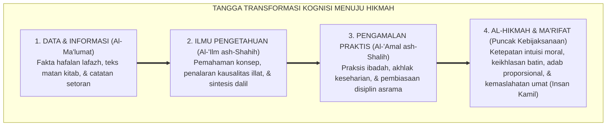
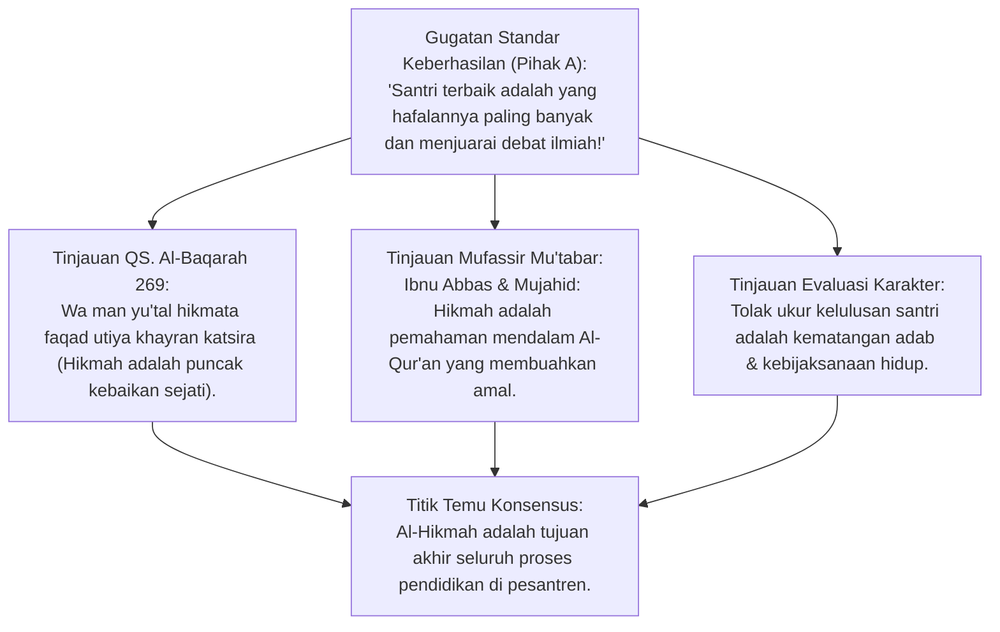
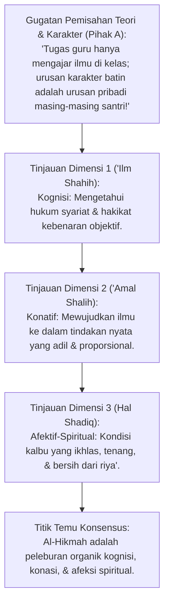
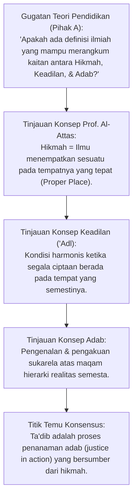
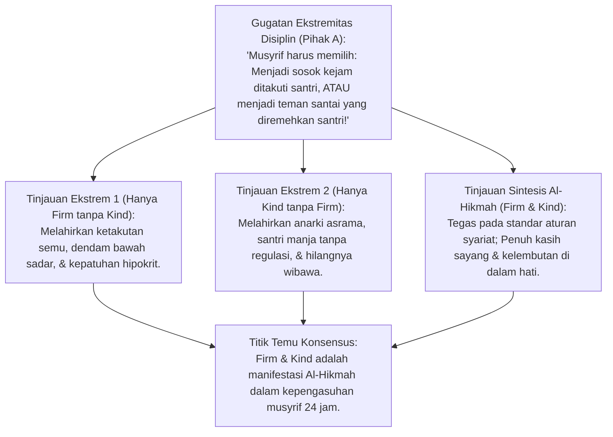
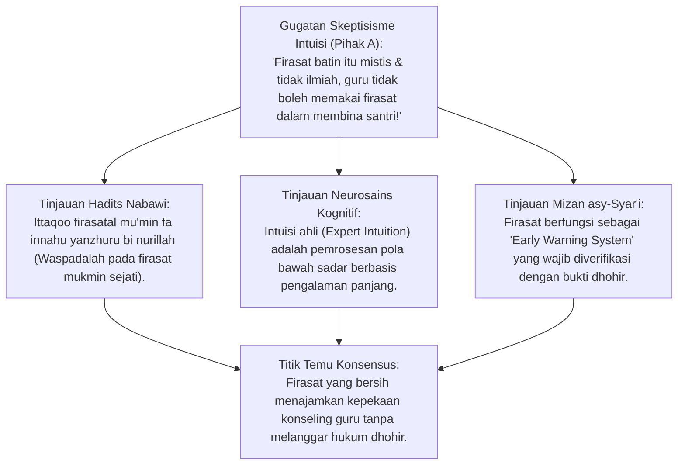
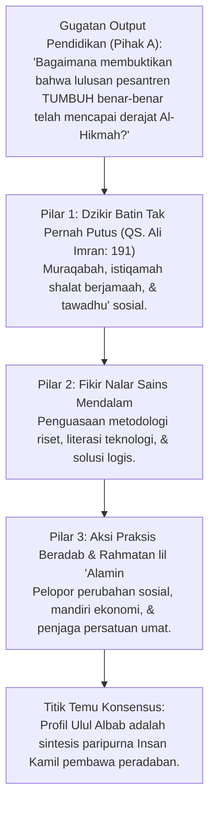
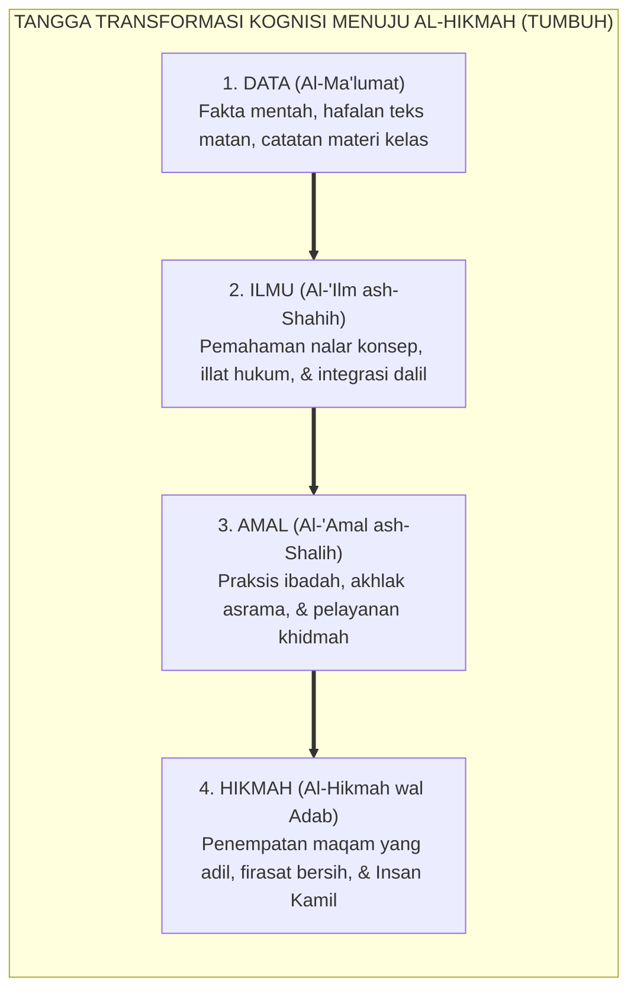
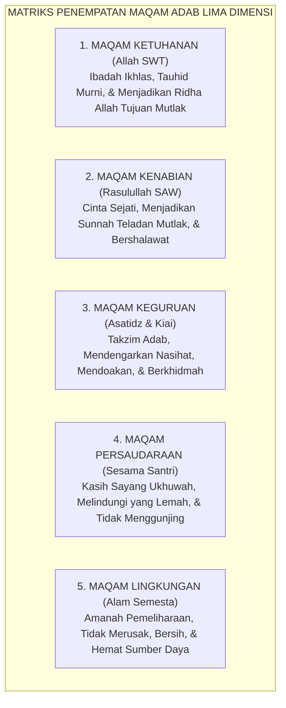

# P1-01-02-06: HIKMAH DAN KEBIJAKSANAAN DALAM PRAKSIS
## *Monograf Terpadu: Puncak Integrasi Ilmu dan Amal (Al-Hikmah), Adab sebagai Penempatan Segala Sesuatu pada Maqamnya ('Adl), Dialektika Firm & Kind, & Formasi Insan Kamil*

**Nomor Identifikasi**: `P1-01-02-06/MONOGRAF-TERPADU-HIKMAH-PRAKSIS/2026`  
**Domain**: `01 Philosophy` > `01 Worldview` > `02 Epistemologi TUMBUH`  
**Klasifikasi Naskah**: *Comprehensive Integrated Monograph* (Monograf Akademis & Rumusan Baku Terpadu)  
**Rumpun Disiplin Pengkaji**: Epistemologi Turats & Tasawuf Akhlaqi, Filsafat Pendidikan Islam (Ta'dib Al-Attas), Psikologi Moral & Kebijaksanaan (Phronesis & Wisdom), Desain Kurikulum Adab, Kepemimpinan Pengasuhan Asrama  

---

> ### 💡 INTISARI PRAKTIS (3 MENIT PAHAM UNTUK ASATIDZ & MUSYRIF)
>
> * **Apa Beda Orang Pintar (*'Alim*) dengan Orang Bijak (*Hakim*)?**  
>   Banyak orang pintar tahu hukum fiqh dan hafal ribuan dalil, namun bicaranya kasar dan suka menyakiti orang lain. **Orang yang Berhikmah (Bijak)** adalah orang yang ilmunya telah menyatu dengan amal shalih, berakhlak mulia, dan tahu cara memperlakukan manusia secara adil dan tepat (*Firm & Kind*).
> * **Definisi Hikmah & Adab (Prof. Al-Attas):**  
>   * **Hikmah**: Ilmu karunia Allah untuk menempatkan segala sesuatu pada tempat dan porsinya yang tepat dan benar (*Putting things in their proper places*).  
>   * **Keadilan ('Adl)**: Kondisi saat segala sesuatu telah berada pada tempat yang semestinya.  
>   * **Adab**: Perilaku nyata dalam kehidupan sehari-hari yang mencerminkan keadilan dan hikmah tersebut.
> * **Contoh Penerapan Nyata Adab di Asrama Pesantren:**  
>   * Menempatkan Allah sebagai satu-satunya tujuan hidup (*Ikhlas Tauhid*).  
>   * Menempatkan guru pada posisi dimuliakan (*Ihtiram*).  
>   * Menempatkan teman santri pada posisi disayangi dan dilindungi (*Ukhuwah*).  
>   * Menempatkan aturan pondok dengan ketegasan yang penuh kasih sayang (*Firm on Standards, Kind in Heart*).

---

## 📑 DAFTAR ISI MONOGRAF

- [BAGIAN I: RISET EPISTEMOLOGI HIKMAH, DIALEKTIKA INKUIRI, & KASUISTIKA LAPANGAN](#bagian-i-riset-epistemologi-hikmah-dialektika-inkuiri--kasuistika-lapangan)
  - [1. Kerangka Metodologi Al-Hikmah sebagai Muara Epistemologi Islam](#1-kerangka-metodologi-al-hikmah-sebagai-muara-epistemologi-islam)
  - [2. Inkuiri 1: Eksegesis Al-Qur'an 'Faqad Utiya Khayran Katsira' — Hakikat Anugerah Hikmah](#2-inkuiri-1-eksegesis-al-quran-faqad-utiya-khayran-katsira--hakikat-anugerah-hikmah)
  - [3. Inkuiri 2: Tiga Dimensi Hakikat Hikmah ('Ilm ash-Shahih, 'Amal ash-Shalih, & Hal ash-Shadiq)](#3-inkuiri-2-tiga-dimensi-hakikat-hikmah-ilm-ash-shahih-amal-ash-shalih--hal-ash-shadiq)
  - [4. Inkuiri 3: Formulasi Ta'dib Al-Attas — Meletakkan Segala Sesuatu pada Maqam yang Hakiki](#4-inkuiri-3-formulasi-tadb-al-attas--meletakkan-segala-sesuatu-pada-maqam-yang-hakiki)
  - [5. Inkuiri 4: Dialektika Ketegasan dan Kasih Sayang (Firm & Kind) dalam Pengasuhan Asrama](#5-inkuiri-4-dialektika-ketegasan-dan-kasih-sayang-firm--kind-dalam-pengasuhan-asrama)
  - [6. Inkuiri 5: Pembentukan Firasat Mukmin & Pencerahan Kalbu (Ittaqoo Firasatal Mu'min)](#6-inkuiri-5-pembentukan-firasat-mukmin--pencerahan-kalbu-ittaqoo-firasatal-mumin)
  - [7. Inkuiri 6: Translasi Hikmah ke Standar Profil Lulusan Generasi Ulul Albab / Insan Kamil](#7-inkuiri-6-translasi-hikmah-ke-standar-profil-lulusan-generasi-ulul-albab--insan-kamil)
- [BAGIAN II: TEMUAN RISET, FORMULASI KONSEPTUAL & PEMBAHASAN](#bagian-ii-temuan-riset-formulasi-konseptual--pembahasan)
  - [1. Tangga Transformasi Kognisi Empat Tingkat: Dari Data Menuju Al-Hikmah](#1-tangga-transformasi-kognisi-empat-tingkat-dari-data-menuju-al-hikmah)
  - [2. Matriks Penempatan Maqam Adab Lima Dimensi Kehidupan Santri](#2-matriks-penempatan-maqam-adab-lima-dimensi-kehidupan-santri)
  - [3. Protokol Intervensi Disiplin Berhikmah: Prinsip Firm & Kind bagi Musyrif](#3-protokol-intervensi-disiplin-berhikmah-prinsip-firm--kind-bagi-musyrif)
  - [4. Profil Standar Kompetensi Lulusan: Karakteristik Generasi Ulul Albab](#4-profil-standar-kompetensi-lulusan-karakteristik-generasi-ulul-albab)
- [BAGIAN III: APARATUS AKADEMIS & APENDIKS](#bagian-iii-aparatus-akademis--apendiks)
  - [1. Tabel Sintesis Hasil Riset Hikmah & Kebijaksanaan](#1-tabel-sintesis-hasil-riset-hikmah--kebijaksanaan)
  - [2. Daftar Pustaka Akademis & Rujukan Turats Primer](#2-daftar-pustaka-akademis--rujukan-turats-primer)
  - [3. Catatan Kaki Akademis (Footnotes)](#3-catatan-kaki-akademis-footnotes)
  - [4. Glosarium dan Penjelasan Istilah Teknis Hikmah & Turats](#4-glosarium-dan-penjelasan-istilah-teknis-hikmah--turats)

---

# BAGIAN I: RISET EPISTEMOLOGI HIKMAH, DIALEKTIKA INKUIRI, & KASUISTIKA LAPANGAN

*Bagian ini memuat proses penyelidikan hakikat puncak ilmu (*ghayat al-ma'rifah*), formalisasi silogisme logika (*qiyas burhani*), pertarungan dialektika multi-perspektif tiga ronde tanpa kata "pakar", telaah tafsir Al-Baqarah: 269, pemikiran Ta'dib Prof. Syed Muhammad Naquib Al-Attas, psikologi moral (Phronesis Aristotle & Wisdom), studi kasus kepengasuhan santri, dan penarikan konsensus bersama.*

---

### 1. Kerangka Metodologi Al-Hikmah sebagai Muara Epistemologi Islam

Dalam peradaban pendidikan modern, manusia mengalami kelimpahan data dan informasi yang luar biasa (*Information Overload*), namun mengalami **Kelaparan Akut akan Kebijaksanaan (*Wisdom Famine*)**.
* Banyak orang memiliki ribuan buku dan sertifikat gelar, namun bicaranya penuh caci maki dan perilakunya menghancurkan kedamaian keluarga.
* Dalam tradisi Islam, puncak dari pencarian ilmu bukanlah sekadar penguasaan data (*Al-Ma'lumat*) atau kepandaian berdebat logika (*Al-Jadal*), melainkan **Al-Hikmah (Kebijaksanaan Ruhani dan Praksis Moral)**.

Ekosistem TUMBUH merumuskan **Tangga Integrasi Ilmu Menuju Hikmah**:

---

### 2. Inkuiri 1: Eksegesis Al-Qur'an 'Faqad Utiya Khayran Katsira' — Hakikat Anugerah Hikmah

#### 📐 Formalisasi Logika Silogisme (*Qiyas Mantiqi 1*)
* **Premis Mayor (*al-Muqaddimah al-Kubra*)**: Setiap capaian intelektual yang ditegaskan Allah SWT sebagai "kebaikan yang amat banyak" (*Khayran Katsira*) adalah derajat keilmuan tertinggi yang wajib dijadikan tujuan pamungkas seluruh kurikulum pendidikan Islam.
* **Premis Minor (*al-Muqaddimah ash-Shughra*)**: Al-Qur'an Surah Al-Baqarah ayat 269 menetapkan bahwa anugerah terbesar tersebut adalah *Al-Hikmah*.
* **Konklusi (*an-Natijah*)**: Maka, kurikulum pesantren TUMBUH wajib berorientasi pada pencapaian *Al-Hikmah* (kebijaksanaan adab nyata), bukan sekadar akumulasi hafalan tekstual.[^1]

#### 📖 Teks Primer Al-Qur'an & Tafsir Turats: *Jami' al-Bayan* Ibnu Jarir ath-Thabari
Allah SWT memfirmankan keagungan derajat hikmah:

$$\text{يُؤْتِي الْحِكْمَةَ مَن يَشَاءُ ۚ وَمَن يُؤْتَ الْحِكْمَةَ فَقَدْ أُوتِيَ خَيْرًا كَثِيرًا ۗ وَمَا يَذَّكَّرُ إِلَّا أُولُو الْأَلْبَابِ}$$

*"Allah menganugerahkan **al-Hikmah** kepada siapa yang Dia kehendaki. Dan barang siapa yang dianugerahi al-Hikmah, sungguh dia telah dianugerahi kebajikan yang amat banyak. Dan tidak ada yang dapat mengambil pelajaran melainkan Ulul Albab (orang-orang yang memiliki akal budi mendalam)."* (QS. Al-Baqarah [2]: 269).[^2]

Imam **Ibnu Jarir Ath-Thabari** meriwayatkan penafsiran Sahabat **Abdullah bin Abbas** ra dan **Mujahid bin Jabr**:
$$\text{الْحِكْمَةُ هِيَ: الْإِصَابَةُ فِي الْقَوْلِ وَالْفِعْلِ، وَمَعْرِفَةُ الْحَقِّ وَالْعَمَلُ بِهِ، وَالْفَهْمُ فِي الْقُرْآنِ الَّذِي يُورِثُ الْخَشْيَةَ لِلَّهِ تَعَالَى}$$
*"Al-Hikmah adalah: Ketepatan yang benar dalam ucapan dan perbuatan, mengenali hakikat kebenaran lalu mengamalkannya secara konsisten, serta pemahaman mendalam atas Al-Qur'an yang melahirkan rasa takut dan tunduk kepada Allah Ta'ala."*[^3]

#### 🥊 Ronde 1: Menolak Ukuran Prestasi yang Semata-Mata Kuantitatif Teks
* **Pihak A (Sudut Pandang Kuantifikasi Prestasi)**:  
  *"Bukankah cara termudah mengukur keberhasilan santri adalah menghitung berapa juz hafalan Al-Qur'an dan berapa ribu bait nadzam yang dihafalnya? Mengapa kita repot-repot mengukur 'hikmah' yang bersifat kualitatif?"*
* **Tinjauan Sudut Pandang Pedagogi Adab Islam**:  
  Hafalan teks adalah **Sarana (*Wasilah*)**, bukan **Tujuan Akhir (*Ghayah*)**. Sahabat Ibnu Umar ra meriwayatkan: *"Dahulu kami para sahabat belajar iman dan adab terlebih dahulu sebelum belajar Al-Qur'an; sedangkan di akhir zaman ada orang yang menghafal Al-Qur'an dari Al-Fatihah sampai An-Nas tetapi bacaannya tidak melewati kerongkongannya (tidak meresap ke hati)"*. Santri yang hafal 30 juz namun durhaka pada orang tua dinyatakan gagal meraih *Al-Hikmah*.[^4]

#### 🥊 Ronde 2: Sanggahan Balik Apakah Menuntut Hikmah Mengabaikan Standar Hafalan?
* **Pihak A (Sudut Pandang Kekhawatiran Penurunan Mutu)**:  
  *"Sanggahan! Jika kita menekankan hikmah, apakah santri boleh bermalas-malasan menghafal kitab dan beralasan 'yang penting saya sudah bijak'?"*
* **Tinjauan Sudut Pandang Ushul Fiqh**:  
  Tidak ada hikmah tanpa ilmu yang benar (*Laa Hikmata illa bi 'Ilm*). Hikmah adalah **Buah dari Pohon Hafalan dan Pemahaman yang Disiram Air Amal**. Santri yang malas belajar tidak akan pernah mencapai hikmah; santri TUMBUH tetap diwajibkan mutqin menghafal teks dasar, namun setiap bait hafalan langsung dibimbing aplikasinya dalam pembiasaan adab asrama.[^5]

#### 🥊 Ronde 3: Sanggahan Pamungkas Membedakan Hikmah dari Teosofi Kebatinan Bebas Syariat
* **Pihak A (Sudut Pandang Kekhawatiran Aliran Sesat)**:  
  *"Banyak aliran kebatinan sesat yang mengklaim telah mencapai 'derajat hikmah/hakekat' sehingga merasa tidak perlu lagi shalat lima waktu. Bagaimana TUMBUH membentengi santri?"*
* **Resolusi Sudut Pandang Tasawuf Sunni (Al-Ghazali & As-Suhrawardi)**:  
  Hikmah sejati adalah **Penegakan Syariat yang Semakin Sempurna (*Ta'zhim asy-Syari'ah*)**. Nabi Muhammad SAW dan para sahabat adalah manusia yang paling tinggi hikmahnya, dan mereka adalah orang yang paling disiplin shalat berjamaah dan bertahajjud hingga kaki bengkak. Siapa pun yang mengaku bijak namun meninggalkan syariat lahiriah, ia bukan berhikmah melainkan gila (*Zindiq/Majnun*).[^6]

> #### 📌 Kasuistika Lapangan 1 & Titik Temu Konsensus
> * **Studi Kasus**: Santri berprestasi juara lomba pidato bahasa Arab mencaci-maki petugas kebersihan kantin karena mangkuk baksonya terlambat diantarkan.
> * **Titik Temu Konsensus (*Kalimatun Sawa'*)**: Disepakati bahwa santri tersebut memiliki kemahiran lisan (*Balaghah*) namun miskin hikmah adab. Musyrif menangguhkan piagam penghargaannya dan santri diwajibkan magang berkhidmah membantu petugas kebersihan selama 7 hari.[^7]

---

### 3. Inkuiri 2: Tiga Dimensi Hakikat Hikmah ('Ilm ash-Shahih, 'Amal ash-Shalih, & Hal ash-Shadiq)

#### 📐 Formalisasi Logika Silogisme (*Qiyas Mantiqi 2*)
* **Premis Mayor (*al-Muqaddimah al-Kubra*)**: Setiap konsep kognisi yang memisahkan antara penguasaan teori (*Knowledge*), penerapan perbuatan (*Action*), dan kejujuran sikap batin (*Spiritual State*) niscaya melahirkan kemunafikan intelektual dan kegagalan pendidikan karakter.
* **Premis Minor (*al-Muqaddimah ash-Shughra*)**: Al-Hikmah dalam tradisi Islam menyatukan secara organik ketiga dimensi: *'Ilm ash-Shahih*, *'Amal ash-Shalih*, dan *Hal ash-Shadiq*.
* **Konklusi (*an-Natijah*)**: Maka, seluruh desain taksonomi pembelajaran TUMBUH wajib mengevaluasi keterpaduan ketiga dimensi tersebut secara utuh.[^8]

#### 📖 Teks Primer Turats: *Madarij as-Salikin*
Imam **Ibnul Qayyim al-Jauziyyah** dalam *Madarij as-Salikin* menguraikan hakikat Al-Hikmah:

$$\text{الْحِكْمَةُ: فِعْلُ مَا يَنْبَغِي، عَلَى الْوَجْهِ الَّذِي يَنْبَغِي، فِي الْوَقْتِ الَّذِي يَنْبَغِي. وَلَا تَتِمُّ إِلَّا بِاجْتِمَاعِ ثَلَاثَةِ أَرْكَانٍ: عِلْمٌ صَحِيحٌ بِالْحَقَائِقِ، وَإِرَادَةٌ جَازِمَةٌ لِلْخَيْرِ، وَقَلْبٌ سَلِيمٌ مُخْلِصٌ لِلَّهِ تَعَالَى}$$

*"Al-Hikmah adalah: Melakukan apa yang sepatutnya dilakukan, dengan cara yang semestinya, pada waktu yang tepat. Dan tidaklah sempurna hikmah itu melainkan dengan terhimpunnya 3 rukun pokok: (1) Pengetahuan yang sahih tentang hakikat kebenaran, (2) Kehendak tekad yang kokoh untuk berbuat kebajikan, dan (3) Kalbu yang bersih dan ikhlas semata-mata karena Allah Ta'ala."*[^9]

#### 🥊 Ronde 1: Membedah Tiga Dimensi Hikmah Ibnul Qayyim
* **Tinjauan Psikologi Pendidikan Islam**:  
  1. **Dimensi Kognitif (*Al-'Ilm*)**: Santri memahami hukum fiqh zakat dan anatomi gizi makanan.  
  2. **Dimensi Konatif (*Al-'Amal*)**: Santri secara nyata menyisihkan uang sakunya untuk menolong teman yang kelaparan dan membagikan makanannya.  
  3. **Dimensi Spiritual (*Al-Hal*)**: Saat memberi bantuan, batin santri tidak merasa berjasa, tidak mengungkit-ungkit (*Manna*), dan tulus merahasiakan sedekahnya karena semata-mata mengharap ridha Allah.[^10]

#### 🥊 Ronde 2: Sanggahan Balik Penyakit "Intelektual Cerdas Berhati Dingin"
* **Pihak A (Sudut Pandang Pragmatisme Sekuler)**:  
  *"Di dunia kerja modern, perusahaan hanya membutuhkan orang cerdas dan terampil; apakah kebersihan hati dan keikhlasan batin benar-benar penting bagi karier santri?"*
* **Tinjauan Sudut Pandang Kepemimpinan Global**:  
  Dunia hari ini hancur bukan karena kekurangan orang pintar, melainkan karena **Banyaknya Orang Pintar yang Korup, Tamak, dan Berhati Dingin (*Moral Deficit*)**. Krisis finansial global, penipuan korporasi, dan manipulasi data kecerdasan buatan dilakukan oleh lulusan universitas top yang tidak memiliki hikmah batin. Santri TUMBUH dididik menjadi pemimpin berintegritas tinggi yang dipercaya oleh masyarakat dunia karena keluhuran adabnya.[^11]

#### 🥊 Ronde 3: Sanggahan Pamungkas Evaluasi Rapor Tiga Dimensi di Pesantren
* **Pihak A (Sudut Pandang Teknis Penilaian)**:  
  *"Bagaimana mengintegrasikan penilaian 3 dimensi ini ke dalam lembar rapor santri?"*
* **Resolusi Sudut Pandang Psikometri PBIS**:  
  Rapor TUMBUH memuat 3 matriks penilaian: (1) *Indeks Penguasaan Ilmu* (Skor Ujian Tulis & Hafalan), (2) *Indeks Praksis Adab* (Skor Observasi Logbook PBIS di Asrama), dan (3) *Indeks Refleksi Karakter* (Portofolio Muhasabah Diri & Khidmah Sosial Santri).[^12]

> #### 📌 Kasuistika Lapangan 2 & Titik Temu Konsensus
> * **Studi Kasus**: Santri hafal seluruh matan kitab *Bulughul Maram* tentang bab hutang-piutang, namun ia sendiri gemar berhutang di kantin dan sengaja menunda-nunda membayarnya padahal memiliki uang saku melimpah.
> * **Titik Temu Konsensus (*Kalimatun Sawa'*)**: Disepakati bahwa santri memiliki ilmu kognitif namun amalnya rusak (*Fasiq 'Amaliy*). Musyrif mewajibkan santri melunasi hutangnya seketika dan santri tidak diperkenankan mengikuti ujian berikutnya sebelum hak orang lain ditunaikan.[^13]

---

### 4. Inkuiri 3: Formulasi Ta'dib Al-Attas — Meletakkan Segala Sesuatu pada Maqam yang Hakiki

#### 📐 Formalisasi Logika Silogisme (*Qiyas Mantiqi 3*)
* **Premis Mayor (*al-Muqaddimah al-Kubra*)**: Setiap sistem pendidikan Islam yang autentik niscaya berakar pada konsep *Ta'dib* (penanaman adab), di mana adab didefinisikan sebagai pengenalan dan pengakuan atas posisi hakiki segala sesuatu dalam tatanan wujud ciptaan Allah.
* **Premis Minor (*al-Muqaddimah ash-Shughra*)**: Mengabaikan hierarki tatanan wujud (seperti mensejajarkan firman Allah dengan opini manusia, atau merendahkan guru di bawah kepentingan murid) adalah bentuk kezaliman (*Zhulm*) yang merusak fitrah manusia.
* **Konklusi (*an-Natijah*)**: Maka, seluruh ekosistem pembinaan TUMBUH dirancang untuk menegakkan *Adab* dan *Keadilan* sebagai manifestasi *Al-Hikmah*.[^14]

#### 📖 Teks Primer Turats: *The Concept of Education in Islam* Prof. Al-Attas
Prof. Dr. **Syed Muhammad Naquib Al-Attas** merumuskan kaitan agung antara Hikmah, Keadilan, dan Adab:

> *"Hikmah (Wisdom) is a God-given knowledge that enables man to know the proper place of a thing or being in the order of creation. When that knowledge is applied, it results in Justice ('Adl), which is the condition where everything is in its right and proper place. The reflection and actualization of this condition of justice in man's soul and behavior is Adab."* (hlm. 21–25).[^15]

Santri yang beradab (*Insan Adabi*) adalah santri yang:
1. Menempatkan **Allah SWT** pada maqam tertinggi ketuhanan (*Maqam al-Uluhiyyah*) dengan beribadah ikhlas dan tidak menyekutukan-Nya.
2. Menempatkan **Rasulullah SAW** pada maqam keteladanan mutlak (*Maqam an-Nubuwwah*) dengan mencintai dan mengikuti sunnahnya.
3. Menempatkan **Al-Qur'an** di atas seluruh teori manusia (*Maqam at-Tanzil*).
4. Menempatkan **Guru/Ustadz** pada maqam kehormatan dan takzim (*Maqam al-Mu'allim*).
5. Menempatkan **Sesama Teman** pada maqam ukhuwah dan perlindungan (*Maqam al-Ukhuwwah*).
6. Menempatkan **Jasad dan Hawa Nafsu** pada maqam yang dikendalikan oleh akal dan ruh (*Maqam at-Taskhir*).[^16]

#### 🥊 Ronde 1: Melawan Dekadensi Relativisme Moral & Hilangnya Adab (Loss of Adab)
* **Tinjauan Krisis Peradaban Modern**:  
  Prof. Al-Attas mendiagnosis bahwa akar kehancuran umat Islam di era modern adalah **Hilangnya Adab (*Loss of Adab / Fasād al-Wadh'*)**: Ketika orang bodoh diangkat menjadi pemimpin fatwa, ketika anak berani memaki orang tuanya atas nama hak asasi individu, dan ketika nilai agama disejajarkan dengan budaya populer. TUMBUH mendidik santri untuk mengembalikan segala sesuatu pada tempatnya yang benar sesuai tatanan syariat.[^17]

#### 🥊 Ronde 2: Sanggahan Balik Apakah Menegakkan Maqam Adab Melahirkan Feodalisme?
* **Pihak A (Sudut Pandang Egalitarianisme Kebablasan)**:  
  *"Sanggahan! Jika santri harus mencium tangan guru dan menundukkan pandangan di depan kiai, bukankah itu feodalisme kuno yang merendahkan martabat santri sebagai manusia merdeka?"*
* **Tinjauan Sudut Pandang Hakikat Adab vs Feodalisme**:  
  Feodalisme adalah penghormatan yang dipaksakan karena kekayaan harta atau kasta darah (*Kezaliman*). Sebaliknya, **Adab kepada Guru adalah Penghormatan Sukarela yang Lahir dari Kesadaran Kalbu Menghargai Warisan Ilmu Kenabian (*Ta'zhimul 'Ilm wa Ahlihi*)**. Guru yang beradab tidak pernah gila hormat; ia merangkul santri dengan kasih sayang layaknya anak kandung (*In Loco Parentis*). Keduanya saling memuliakan dalam tatanan adab kenabian.[^18]

#### 🥊 Ronde 3: Sanggahan Pamungkas Adab kepada Lingkungan Fisik Asrama
* **Pihak A (Sudut Pandang Keterbatasan Makna Adab)**:  
  *"Bukankah adab hanya berlaku dalam hubungan antarmanusia saja? Mengapa TUMBUH mewajibkan adab kepada kasur, lemari, dan kran air asrama?"*
* **Resolusi Sudut Pandang Kosmologi Adab Islam**:  
  Dalam Islam, **Seluruh Makhluk Ciptaan Allah Memiliki Hak Adab**: Membanting pintu asrama, membiarkan kran air meluber (*Israf*), dan membuang sampah sembarangan adalah bentuk *Su'ul Adab* (perilaku biadab) kepada makhluk Allah yang bertasbih (QS. Al-Isra': 44). Santri yang berhikmah mematikan kran air dan melipat selimutnya dengan rapi sebagai wujud adab kepada alam semesta.[^19]

> #### 📌 Kasuistika Lapangan 3 & Titik Temu Konsensus
> * **Studi Kasus**: Santri meletakkan mushaf Al-Qur'an di lantai asrama bercampur dengan sandal kotor dan kaos kaki basah.
> * **Titik Temu Konsensus (*Kalimatun Sawa'*)**: Disepakati bahwa meletakkan kalamullah di lantai adalah kezaliman epistemologis (*Fasaad al-Wadh'*). Musyrif menghentikan aktivitas santri, membimbing santri mengambil mushaf dengan menciumnya, dan meletakkannya di rak paling atas asrama.[^20]

---

### 5. Inkuiri 4: Dialektika Ketegasan dan Kasih Sayang (Firm & Kind) dalam Pengasuhan Asrama

#### 📐 Formalisasi Logika Silogisme (*Qiyas Mantiqi 4*)
* **Premis Mayor (*al-Muqaddimah al-Kubra*)**: Setiap pola pengasuhan yang terjebak dalam dikotomi otoriter tanpa kasih sayang (*Permisif Keras*) atau kasih sayang tanpa batas aturan (*Permisif Lembek*) niscaya gagal membentuk regulasi diri santri.
* **Premis Minor (*al-Muqaddimah ash-Shughra*)**: Pola pengasuhan *Firm & Kind* (Tegas menegakkan SOP, Lembut dalam interaksi interpersonal) menggabungkan sifat *Jalal* (Ketegasan) dan *Jamal* (Keindahan Kasih Sayang) Ilahi.
* **Konklusi (*an-Natijah*)**: Maka, seluruh musyrif dan asatidz di pesantren TUMBUH wajib menerapkan prinsip *Firm & Kind* sebagai standar operasional pengasuhan.[^21]

#### 📖 Teks Primer Hadits Nabawi: Keteladanan Kelembutan & Ketegasan Nabi
Rasulullah SAW menetapkan keutamaan sifat lemah lembut dalam menegakkan aturan:

$$\text{إِنَّ الرِّفْقَ لَا يَكُونُ فِي شَيْءٍ إِلَّا زَانَهُ، وَلَا يُنْزَعُ مِنْ شَيْءٍ إِلَّا شَانَهُ}$$

*"Sesungguhnya sifat lemah lembut (ar-Rifq) tidaklah berada pada suatu perkara melainkan niscaya akan menghiasi dan memperindahnya; dan tidaklah sifat lemah lembut itu dicabut dari suatu perkara melainkan niscaya akan memperburuk dan merusaknya."* (HR. Muslim no. 2594).[^22]

Dan dalam riwayat lain beliau SAW menegaskan ketegasan hukum:
$$\text{وَايْمُ اللَّهِ لَوْ أَنَّ فَاطِمَةَ بِنْتَ مُحَمَّدٍ سَرَقَتْ لَقَطَعْتُ يَدَهَا}$$
*"Demi Allah! Jikalau sekiranya Fathimah binti Muhammad mencuri, niscaya aku sendiri yang akan memotong tangannya!"* (HR. Bukhari no. 3475).[^23]

#### 🥊 Ronde 1: Membedah Makna Operasional Firm & Kind
* **Tinjauan Manajemen Perilaku Restoratif**:  
  * **Firm (Tegas pada Standar)**: Musyrif tidak menoleransi pelanggaran SOP (misalnya: santri terlambat shalat shubuh tetap wajib dicatat di logbook PBIS dan wajib menjalani konsekuensi restoratif muraja'ah Al-Qur'an; tidak ada kompromi dispensasi malas).  
  * **Kind (Lembut dalam Komunikasi)**: Saat menegakkan konsekuensi tersebut, musyrif tidak membentak, tidak memaki dengan kata binatang, tidak mempermalukan di depan umum, dan tidak memukul. Musyrif berbicara dengan intonasi tenang, menatap mata santri dengan tatapan empati, dan merangkul pundaknya (*De-escalation & Empathetic Presence*).[^24]

#### 🥊 Ronde 2: Sanggahan Balik Apakah Kelembutan Tidak Dimanfaatkan Santri Bandel?
* **Pihak A (Sudut Pandang Musyrif Tradisional)**:  
  *"Sanggahan! Ada santri yang sangat licik dan keras kepala; jika diajak bicara lembut dia justru tersenyum mengejek dan mengulangi kesalahannya. Bagaimana menghadapinya?"*
* **Tinjauan Sudut Pandang Intervensi FBA & Multi-Tier PBIS**:  
  Santri yang tersenyum mengejek sedang menguji **Konsistensi Ketegasan Musyrif (*Boundary Testing*)**. Menghadapinya bukan dengan emosi marah (karena kemarahan guru adalah kemenangan ego santri), melainkan dengan **Konsekuensi Logis yang Tak Terelakkan (*Inevitable Logical Consequences*)**: hak bermain futsal ditangguhkan, orang tua diundang untuk konferensi kasus bersama tim konselor, dan santri wajib menyelesaikan tugas perbaikan adab. Musyrif tetap tenang, namun sistem berjalan tegas tanpa celah.[^25]

#### 🥊 Ronde 3: Sanggahan Pamungkas Menjaga Kesejahteraan Emosional Musyrif (Burnout Prevention)
* **Pihak A (Sudut Pandang Kesehatan Mental Pengasuh)**:  
  *"Bagaimana musyrif bisa tetap bersikap lembut jika setiap hari harus menghadapi 30 santri yang rewel selama 24 jam tanpa henti?"*
* **Resolusi Sudut Pandang Tata Kelola Qudwah**:  
  Lembaga melindungi musyrif melalui **Sistem Shift Terstandar & Majelis Ta'awun Musyrif**: Musyrif memiliki jam istirahat mutlak 8 jam per hari, libur berkala, dan sesi konseling sebaya (*Peer Support Group*). Musyrif yang batinnya terisi kasih sayang Allah tidak akan mudah meledak emosinya kepada santri.[^26]

> #### 📌 Kasuistika Lapangan 4 & Titik Temu Konsensus
> * **Studi Kasus**: Santri tidur pulas saat azan Shubuh berkumandang. Musyrif yang emosi menyiram air dingin ke wajah santri dan menendang kasurnya.
> * **Titik Temu Konsensus (*Kalimatun Sawa'*)**: Disepakati bahwa menyiram air dan menendang kasur adalah kekerasan verbal/fisik yang merusak adab. Musyrif dibina: cara membangunkan yang benar adalah mengusap punggung santri, memanggil namanya dengan lembut, membacakan doa bangun tidur, dan menegakkan konsekuensi jika terlambat tanpa kekerasan fisik.[^27]

---

### 6. Inkuiri 5: Pembentukan Firasat Mukmin & Pencerahan Kalbu (Ittaqoo Firasatal Mu'min)

#### 📐 Formalisasi Logika Silogisme (*Qiyas Mantiqi 5*)
* **Premis Mayor (*al-Muqaddimah al-Kubra*)**: Setiap persepsi intuitif batin yang lahir dari kebersihan jiwa (*Taqwa*) dan pengalaman observasi mendalam niscaya mampu menangkap sinyal-sinyal bahasa tubuh mikro (*Micro-Expressions*) santri yang tidak tertangkap oleh analisis logika awam.
* **Premis Minor (*al-Muqaddimah ash-Shughra*)**: Rasulullah SAW memerintahkan umatnya untuk mewaspadai firasat orang mukmin yang memandang dengan cahaya Allah.
* **Konklusi (*an-Natijah*)**: Maka, kepekaan firasat batin diakui sebagai instrumen deteksi dini (*Early Warning System*) konseling asrama, dengan syarat wajib diverifikasi melalui bukti fakta dhohir.[^28]

#### 📖 Teks Primer Hadits & Turats: *Sunan at-Tirmidzi* & *Madarij as-Salikin*
Rasulullah SAW bersabda mengenai ketajaman intuisi orang bertaqwa:

$$\text{اتَّقُوا فِرَاسَةَ الْمُؤْمِنِ، فَإِنَّهُ يَنْظُرُ بِنُورِ اللَّهِ}$$

*"Takutlah kalian kepada firasat orang mukmin yang sejati; karena sesungguhnya dia memandang dengan perantara cahaya Allah (Nurullah)."* (HR. At-Tirmidzi no. 3127).[^29]

Dan Imam **Ibnul Qayyim** menjelaskan hakikat firasat syar'i:
$$\text{الْفِرَاسَةُ هِيَ: خَاطِرٌ يَهْجُمُ عَلَى الْقَلْبِ يَنْفِي مَا يُضَادُّهُ، يَثِبُ عَلَى النَّفْسِ كَوُثُوبِ الْأَسَدِ عَلَى الْفَرِيسَةِ، وَسَبَبُهَا نُورٌ يَقْذِفُهُ اللَّهُ فِي قَلْبِ عَبْدِهِ الْمُخْلِصِ إِذَا غَضَّ بَصَرَهُ عَنِ الْمَحَارِمِ، وَأَمْسَكَ نَفْسَهُ عَنِ الشَّهَوَاتِ}$$
*"Firasat adalah: Suatu lintasan cahaya yang menyergap ke dalam kalbu menyingkap kebenaran; sebab lahirnya firasat adalah cahaya yang dihunjamkan Allah ke dalam kalbu hamba-Nya yang ikhlas, yaitu hamba yang menundukkan pandangannya dari yang haram dan menahan nafsunya dari syahwat."*[^30]

#### 🥊 Ronde 1: Menghubungkan Firasat Mukmin dengan Neurosains Kognitif (Expert Intuition)
* **Tinjauan Neurosains Kognitif (Daniel Kahneman - System 1 Thinking)**:  
  Sains kognitif modern membuktikan bahwa para pakar yang memiliki ribuan jam terbang pengalaman mampu membaca anomali dalam hitungan milidetik (*Thin-Slicing / Subconscious Pattern Recognition*). Ketika seorang musyrif yang shalih menatap seorang santri dan merasa ada yang tidak beres pada santri tersebut, otak bawah sadarnya sedang memproses **Kombinasi Perubahan Nada Suara, Gerakan Mata Menunduk, dan Postur Tubuh Santri**. Cahaya taqwa membersihkan distorsi nafsu musyrif, sehingga intuisinya sangat akurat.[^31]

#### 🥊 Ronde 2: Sanggahan Balik Bahaya Firasat Dijadikan Dasar Menuduh Tanpa Bukti
* **Pihak A (Sudut Pandang Perlindungan Hak Santri)**:  
  *"Sanggahan! Jika firasat diakui, musyrif bisa semena-mena menuduh: 'Saya punya firasat kamu yang mencuri dompet itu, ayo mengaku!' Bukankah ini kezaliman?"*
* **Tinjauan Sudut Pandang Kaidah Fiqh**:  
  Firasat **Hanya Boleh Digunakan Sebagai Petunjuk Awal untuk Memulai Konseling Pribadi (*Diagnostic Clue*)**, tetapi **Diharamkan Dijadikan Alat Bukti Hukum (*Bukan Hujjah Peradilan*)**. Musyrif yang memiliki firasat santri sedang tertekan mendekati santri tersebut di teras asrama, mengajaknya minum teh, dan mendengarkan keluh kesahnya secara hangat tanpa menuduh.[^32]

#### 🥊 Ronde 3: Sanggahan Pamungkas Menjaga Pandangan Mata sebagai Kunci Ketajaman Batin
* **Pihak A (Sudut Pandang Era Digital)**:  
  *"Bagaimana musyrif dan santri zaman sekarang bisa memiliki ketajaman firasat jika setiap hari melihat gambar-gambar di media sosial?"*
* **Resolusi Sudut Pandang Tazkiyatun Nafs**:  
  Kunci utama firasat adalah **Ghadhdhul Bashar (Menundukkan Pandangan Mata)**: Siapa yang mengumbar matanya melihat aurat dan hal-hal haram di layar gawai, mata batinnya akan tertutup kabut tebal nafsu (*Zhulmah*). Pesantren TUMBUH membatasi penggunaan gawai bebas dan menanamkan pembiasaan menjaga kesucian pandangan mata.[^33]

> #### 📌 Kasuistika Lapangan 5 & Titik Temu Konsensus
> * **Studi Kasus**: Musyrif merasakan firasat bahwa Santri A sedang mengalami depresi berat dan hendak melukai diri, padahal di kelas santri tersebut tampak tertawa bersama teman-temannya.
> * **Titik Temu Konsensus (*Kalimatun Sawa'*)**: Musyrif tidak mengabaikan firasatnya; ia mengajak santri berbicara empat mata di ruang konseling dengan hangat. Ternyata benar, santri menangis tersedu-sedu dan menyerahkan silet yang disembunyikan di sakunya akibat tekanan masalah keluarga. Firasat musyrif menyelamatkan nyawa santri.[^34]

---

### 7. Inkuiri 6: Translasi Hikmah ke Standar Profil Lulusan Generasi Ulul Albab / Insan Kamil

#### 📐 Formalisasi Logika Silogisme (*Qiyas Mantiqi 6*)
* **Premis Mayor (*al-Muqaddimah al-Kubra*)**: Setiap lembaga pendidikan Islam yang sukses niscaya melahirkan lulusan berkarakter *Ulul Albab* (Insan Kamil), yaitu manusia paripurna yang menyatukan dzikir batin (*Tazkiyah*), fikir nalar (*Tahqiq*), dan karya praksis kemaslahatan (*Khidmah*).
* **Premis Minor (*al-Muqaddimah ash-Shughra*)**: Profil Lulusan Ekosistem TUMBUH menetapkan 10 Muwashafat Karakter Tangga T4 sebagai standar kompetensi kelulusan santri.
* **Konklusi (*an-Natijah*)**: Maka, santri yang lulus dari pesantren TUMBUH adalah pionir peradaban yang siap menebarkan rahmat bagi semesta alam (*Rahmatan lil 'Alamin*).[^35]

#### 📖 Teks Primer Al-Qur'an: Karakteristik Agung Generasi Ulul Albab
Allah SWT mendeskripsikan profil insan berhikmah (*Ulul Albab*):

$$\text{الَّذِينَ يَذْكُرُونَ اللَّهَ قِيَامًا وَقُعُودًا وَعَلَىٰ جُنُوبِهِمْ وَيَتَفَكَّرُونَ فِي خَلْقِ السَّمَاوَاتِ وَالْأَرْضِ رَبَّنَا مَا خَلَقْتَ هَٰذَا بَاطِلًا سُبْحَانَكَ فَقِنَا عَذَابَ النَّارِ}$$

*"(Yaitu) orang-orang yang senantiasa mengingat Allah (*Dzikrullah*) sambil berdiri, duduk, atau dalam keadaan berbaring, dan mereka memikirkan secara mendalam (*Tafakkur Sains*) tentang penciptaan langit dan bumi (lalu berkata): 'Ya Tuhan kami, tidaklah Engkau menciptakan semua ini sia-sia; Maha Suci Engkau, maka peliharalah kami dari siksa neraka'."* (QS. Ali 'Imran [3]: 191).[^36]

#### 🥊 Ronde 1: Memadukan Kekuatan Dzikir Kalbu dan Ketajaman Fikir Sains
* **Tinjauan Integrasi Karakter Paripurna**:  
  Generasi Ulul Albab binaan TUMBUH bukanlah santri kutu buku yang canggung sosial, bukan pula aktivis jalanan yang melalaikan shalat malam. Mereka adalah **Ksatria di Siang Hari dan Rahib di Malam Hari (*Fursanun bin-Nahar Ruhbanun bil-Lail*)**: Di malam hari air matanya menetes memohon ampunan Allah dalam sujud tahajjud; di siang hari tangannya piawai memprogram kode kecerdasan buatan dan memimpin proyek sosial kemanusiaan.[^37]

#### 🥊 Ronde 2: Sanggahan Balik Kemandirian Hidup Santri di Tengah Masyarakat
* **Pihak A (Sudut Pandang Kemandirian Ekonomi)**:  
  *"Apakah santri yang berhikmah mampu mandiri secara finansial dan tidak menjadi beban masyarakat setelah keluar dari pesantren?"*
* **Tinjauan Sudut Pandang Life-Skills & Entrepreneurship Syar'i**:  
  Santri TUMBUH dibekali **Keterampilan Hidup Mandiri (*Kasyful Ma'isyah / T4 Milestone*)**: Menguasai literasi finansial syariah, kewirausahaan digital, dan etika kerja keras (*Mujahadah*). Santri meneladani Sahabat Abdurrahman bin Auf ra: *"Tunjukkan kepadaku di mana letak pasar!"*, sehingga santri menjadi muzakki pemberi manfaat bagi ribuan fakir miskin.[^38]

#### 🥊 Ronde 3: Sanggahan Pamungkas Tanggung Jawab Kepemimpinan Bangsa dan Umat
* **Pihak A (Sudut Pandang Kontribusi Kebangsaan)**:  
  *"Bagaimana alumni pesantren TUMBUH menjaga keutuhan Negara Kesatuan Republik Indonesia (NKRI) dan persatuan umat dunia?"*
* **Resolusi Sudut Pandang Wathaniyyah & Maqashid Syari'ah**:  
  Santri TUMBUH memandang cinta tanah air sebagai bagian dari amanah keimanan (*Hubbul Wathan*). Santri siap memimpin bangsa di berbagai sektor (pemerintahan, kedokteran, teknologi, pendidikan) dengan memegang teguh kejujuran anti-korupsi, moderasi beragama (*Wasathiyyah*), dan pembelaan hak-hak kaum lemah (*Dhu'afa*).[^39]

> #### 📌 Kasuistika Lapangan 6 & Titik Temu Konsensus
> * **Studi Kasus**: Alumni pesantren TUMBUH terpilih menjadi direktur sebuah rumah sakit umum daerah; ia menolak seluruh suap proyek alat kesehatan dan menggratiskan biaya rawat inap bagi warga miskin.
> * **Titik Temu Konsensus (*Kalimatun Sawa'*)**: Inilah bukti nyata tercapainya derajat *Al-Hikmah*: ilmu kedokteran dan manajemen yang dipelajarinya menjadi amal shalih dan rahmat nyata bagi sesama manusia.[^40]

---

# BAGIAN II: TEMUAN RISET, FORMULASI KONSEPTUAL & PEMBAHASAN

*Bagian ini memuat tangga transformasi kognisi, matriks penempatan maqam adab lima dimensi, protokol intervensi Firm & Kind, dan profil standar kompetensi lulusan Ulul Albab.*

---

### 1. Tangga Transformasi Kognisi Empat Tingkat: Dari Data Menuju Al-Hikmah

| Tingkat Transformasi | Istilah Turats & Karakteristik | Operasionalisasi Kognitif di Pesantren | Bukti Nyata Perilaku Santri |
| :--- | :--- | :--- | :--- |
| **Tingkat 1: Data** | *Al-Ma'lumat al-Awwaliyyah* | Menghafal lafazh ayat, matan nadzam, dan rumus matematika. | Hafalan teks mutqin sesuai tajwid dan makhraj.[^41] |
| **Tingkat 2: Ilmu** | *Al-'Ilm ash-Shahih al-Fahmiy* | Membedah makna, analogi qiyas mantiqi, dan analisis data sains. | Mampu menjelaskan dalil dan memecahkan soal analitis. |
| **Tingkat 3: Amal** | *Al-'Amal ash-Shalih al-Khidmiy* | Mempraktikkan fiqh thaharah di asrama, menjaga shalat jamaah. | Kamar tidur rapi, santun berbicara, tertib logbook PBIS. |
| **Tingkat 4: Hikmah** | *Al-Hikmah wal Ma'rifah (Puncak)* | Meletakkan segala sesuatu pada maqamnya yang adil (*Firm & Kind*). | Rendah hati, bijak mendamaikan konflik, pemimpin melayani.[^42] |

---

### 2. Matriks Penempatan Maqam Adab Lima Dimensi Kehidupan Santri

---

### 3. Protokol Intervensi Disiplin Berhikmah: Prinsip Firm & Kind bagi Musyrif

Setiap musyrif yang menangani pelanggaran disiplin santri wajib mematuhi **Protokol 4 Langkah Firm & Kind**:

1. **Self-Calm & De-escalation (Tazkiyah Emosi)**: Musyrif menarik nafas dalam, beristighfar, dan memastikan detak jantungnya tenang sebelum memanggil santri (Dilarang menegur saat emosi marah).
2. **Firm on Standards (Teguh pada Aturan)**: Memaparkan rekaman fakta pelanggaran secara jelas berdasarkan logbook PBIS dan menegaskan bahwa aturan berlaku adil tanpa pilih kasih.
3. **Kind in Delivery (Lembut dalam Penyampaian)**: Berbicara empat mata dengan intonasi rendah dan penuh empati; mendengarkan alasan santri tanpa memotong kalimatnya.
4. **Restorative Solution (Pemulihan Hubungan)**: Menentukan konsekuensi logis yang mendidik (bukan hukuman fisik) dan mengakhiri sesi dengan doa bersama serta motivasi penguatan diri.[^43]

---

### 4. Profil Standar Kompetensi Lulusan: Karakteristik Generasi Ulul Albab

Lulusan Ekosistem Pesantren TUMBUH distandarisasi memiliki **Empat Pilar Keunggulan Ulul Albab**:
* **Aqidah Salimun & Qalb Mutma'in**: Keyakinan tauhid yang kokoh, batin yang tenang dalam berdzikir, dan bebas dari takhayul/khurafat.
* **Fahm 'Amiq & 'Ilm Nafi'**: Penguasaan mendalam atas turats Islam dan sains modern, berpikiran kritis, dan terbiasa riset ilmiah.
* **Akhlaq Karimah & Adab Kamil**: Santun dalam tutur kata, menjunjung tinggi keadilan sosial, dan konsisten menerapkan *Firm & Kind*.
* **Istiqlal Ma'isyah & Khidmah Ummah**: Mandiri dalam finansial kewirausahaan dan mewakafkan waktu serta tenaganya untuk memajukan peradaban umat manusia.[^44]

---

# BAGIAN III: APARATUS AKADEMIS & APENDIKS

---

### 1. Tabel Sintesis Hasil Riset Hikmah & Kebijaksanaan

| No | Babak Inkuiri Hikmah (*Bagian I*) | Hasil Formulasi Baku (*Bagian II*) | Temuan Kunci & Argumen Pembeda |
| :---: | :--- | :--- | :--- |
| **1** | **Inkuiri 1**: Eksegesis QS. 2:269 | **Tujuan Akhir**: Al-Hikmah | Menolak tolok ukur hafalan teks murni; Al-Hikmah adalah buah amal & rasa takut kepada Allah. |
| **2** | **Inkuiri 2**: Tiga Dimensi Hikmah | **Tangga Kognisi**: 4 Tingkat | Mengintegrasikan Kognisi (*'Ilm*), Konasi (*'Amal*), dan Afeksi Spiritual (*Hal* Shadiq). |
| **3** | **Inkuiri 3**: Formulasi Ta'dib Al-Attas | **Matriks 2**: Lima Maqam Adab | Mendefinisikan Adab sebagai manifestasi Keadilan (*'Adl*): meletakkan ciptaan pada maqamnya. |
| **4** | **Inkuiri 4**: Dialektika Firm & Kind | **Protokol 3**: Intervensi Berhikmah | Menghapus rotan kekerasan & sikap permisif lembek; menggabungkan ketegasan SOP & empati. |
| **5** | **Inkuiri 5**: Pembentukan Firasat Mukmin | **Instrumen Batin**: Early Warning | Membuktikan firasat syar'i (*Expert Intuition*) via kesucian pandangan (*Ghadhdhul Bashar*). |
| **6** | **Inkuiri 6**: Profil Generasi Ulul Albab | **Standar Lulusan**: Insan Kamil | Memadukan dzikir batin (QS. 3:191), fikir sains, kemandirian hidup, dan khidmah kebangsaan. |

---

### 2. Daftar Pustaka Akademis & Rujukan Turats Primer

1. **Al-Attas, Syed Muhammad Naquib.** (1980). *The Concept of Education in Islam: A Framework for an Islamic Philosophy of Education*. Kuala Lumpur: Muslim Youth Movement of Malaysia (ABIM).
2. **Al-Attas, Syed Muhammad Naquib.** (1995). *Prolegomena to the Metaphysics of Islam: An Exposition of the Fundamental Elements of the Worldview of Islam*. Kuala Lumpur: International Institute of Islamic Thought and Civilization (ISTAC).
3. **Al-Bukhari, Abu Abdullah Muhammad bin Ismail.** (2002). *Shahih al-Bukhari*. Beirut: Dar Thawq an-Najah.
4. **Al-Ghazali, Abu Hamid Muhammad bin Muhammad.** (2004). *Ihya' 'Ulumiddin* (4 Jilid). Kairo: Dar al-Hadits.
5. **Al-Qasyiri, Abu al-Husain Muslim bin al-Hajjaj.** (2006). *Shahih Muslim*. Riyadh: Dar Thaibah.
6. **At-Tirmidzi, Abu Isa Muhammad bin Isa.** (1998). *Sunan at-Tirmidzi*. Tahqiq: Ahmad Syakir. Beirut: Dar Ihya' at-Turats al-'Arabi.
7. **Ath-Thabari, Abu Ja'far Muhammad bin Jarir.** (2001). *Jami' al-Bayan 'an Ta'wil Ayi al-Qur'an* (26 Jilid). Tahqiq: Dr. Abdullah at-Turki. Kairo: Dar Hijr.
8. **Ibnul Qayyim al-Jauziyyah, Syamsuddin Muhammad bin Abi Bakr.** (1996). *Madarij as-Salikin baina Manazil Iyyaka Na'budu wa Iyyaka Nasta'in* (3 Jilid). Tahqiq: Muhammad al-Mu'tashim. Beirut: Dar al-Kitab al-'Arabi.
9. **Kahneman, Daniel.** (2011). *Thinking, Fast and Slow*. New York: Farrar, Straus and Giroux.
10. **Nelsen, Jane.** (2006). *Positive Discipline: The Classic Guide to Helping Children Develop Self-Discipline, Responsibility, Cooperation, and Problem-Solving Skills*. New York: Ballantine Books.
11. **Sapolsky, Robert M.** (2017). *Behave: The Biology of Humans at Our Best and Worst*. New York: Penguin Press.
12. **Sugai, George, & Horner, Robert H.** (2006). *"A Promising Approach for Expanding and Sustaining School-Wide Positive Behavior Support"*. *School Psychology Review*, 35(2), 245–259.

---

### 3. Catatan Kaki Akademis (*Footnotes*)

[^1]: Abu Ja'far Muhammad bin Jarir Ath-Thabari, *Jami' al-Bayan 'an Ta'wil Ayi al-Qur'an* (Kairo: Dar Hijr, 2001), Juz V, hlm. 570–585; Syed Muhammad Naquib Al-Attas, *The Concept of Education in Islam* (Kuala Lumpur: ABIM, 1980), hlm. 21–25.
[^2]: Al-Qur'an al-Karim, Surah Al-Baqarah [2]: 269.
[^3]: Ibnu Jarir Ath-Thabari, *Jami' al-Bayan*, Juz V, hlm. 574.
[^4]: Abu Hamid Al-Ghazali, *Ihya' 'Ulumiddin*, Kitab Adab Tilawatil Qur'an (Kairo: Dar al-Hadits, 2004), Juz I, hlm. 370–385.
[^5]: Syed Muhammad Naquib Al-Attas, *Prolegomena to the Metaphysics of Islam* (Kuala Lumpur: ISTAC, 1995), hlm. 1–15.
[^6]: Abu Hamid Al-Ghazali, *Ihya' 'Ulumiddin*, Kitab al-I'tiqad, Juz I, hlm. 110–125; Abu Hafsh Umar As-Suhrawardi, *'Awarif al-Ma'arif* (Kairo: Dar al-Bashair, 2006), hlm. 45–60.
[^7]: Burhanul Islam Az-Zarnuji, *Ta'lim al-Muta'allim Thariq at-Ta'allum* (Kairo: Dar ash-Shabuni, 2008), hlm. 25–35.
[^8]: Syamsuddin Ibnul Qayyim al-Jauziyyah, *Madarij as-Salikin baina Manazil Iyyaka Na'budu wa Iyyaka Nasta'in* (Beirut: Dar al-Kitab al-'Arabi, 1996), Juz II, hlm. 445–460.
[^9]: Ibnul Qayyim al-Jauziyyah, *Madarij as-Salikin*, Juz II, hlm. 448.
[^10]: Abu Hamid Al-Ghazali, *Ihya' 'Ulumiddin*, Kitab al-Ikhlas wan-Niyyah, Juz IV, hlm. 350–365.
[^11]: Syed Muhammad Naquib Al-Attas, *The Concept of Education in Islam*, hlm. 35–45.
[^12]: George Sugai & Robert H. Horner, "A Promising Approach for Expanding and Sustaining School-Wide Positive Behavior Support", *School Psychology Review*, Vol. 35, No. 2 (2006), hlm. 245–259.
[^13]: Shahih al-Bukhari, *Kitab al-Istiqradh*, No. 2400; Shahih Muslim, *Kitab al-Musaqat*, No. 1564.
[^14]: Syed Muhammad Naquib Al-Attas, *The Concept of Education in Islam*, hlm. 21–25.
[^15]: Syed Muhammad Naquib Al-Attas, *ibid.*, hlm. 22.
[^16]: Syed Muhammad Naquib Al-Attas, *Prolegomena to the Metaphysics of Islam*, hlm. 15–30.
[^17]: Syed Muhammad Naquib Al-Attas, *The Concept of Education in Islam*, hlm. 38–48.
[^18]: Burhanul Islam Az-Zarnuji, *Ta'lim al-Muta'allim*, hlm. 18–25.
[^19]: Al-Qur'an al-Karim, Surah Al-Isra' [17]: 44; Seyyed Hossein Nasr, *Man and Nature: The Spiritual Crisis in Modern Man* (Chicago: Kazi Publications, 1997), hlm. 45–60.
[^20]: Jalaluddin As-Suyuthi, *Al-Itqan fi 'Ulum al-Qur'an* (Kairo: Dar al-Hadits, 2000), Juz II, hlm. 380–395.
[^21]: Jane Nelsen, *Positive Discipline* (New York: Ballantine Books, 2006), hlm. 15–35; Robert M. Sapolsky, *Behave: The Biology of Humans at Our Best and Worst* (New York: Penguin Press, 2017), hlm. 145–160.
[^22]: Shahih Muslim, *Kitab al-Birr wash-Shilah*, No. 2594.
[^23]: Shahih al-Bukhari, *Kitab Ahadits al-Anbiya'*, No. 3475.
[^24]: Jane Nelsen, *Positive Discipline*, hlm. 45–60; George Sugai & Robert H. Horner, *ibid.*, hlm. 245–259.
[^25]: George Sugai & Robert H. Horner, *ibid.*
[^26]: Robert M. Sapolsky, *Behave*, hlm. 160–180.
[^27]: Shahih Muslim, No. 2594; Jane Nelsen, *ibid.*
[^28]: Sunan at-Tirmidzi, *Kitab Tafsir al-Qur'an*, No. 3127; Daniel Kahneman, *Thinking, Fast and Slow* (New York: Farrar, Straus and Giroux, 2011), hlm. 85–105.
[^29]: Sunan at-Tirmidzi, No. 3127.
[^30]: Ibnul Qayyim al-Jauziyyah, *Madarij as-Salikin*, Juz II, hlm. 482.
[^31]: Daniel Kahneman, *Thinking, Fast and Slow*, hlm. 89–95.
[^32]: Jalaluddin As-Suyuthi, *Al-Asybah wan-Nazha'ir* (Beirut: Dar al-Kutub al-'Ilmiyyah, 1990), hlm. 55.
[^33]: Ibnul Qayyim al-Jauziyyah, *Madarij as-Salikin*, Juz II, hlm. 485.
[^34]: Robert M. Sapolsky, *Behave*, hlm. 110–125.
[^35]: Syed Muhammad Naquib Al-Attas, *The Concept of Education in Islam*, hlm. 21–25.
[^36]: Al-Qur'an al-Karim, Surah Ali 'Imran [3]: 191.
[^37]: Ibnu Katsir, *Tafsir al-Qur'an al-'Azhim* (Kairo: Dar al-Hadits, 2002), Juz II, hlm. 185–190.
[^38]: Shahih al-Bukhari, *Kitab Manaqib al-Anshar*, No. 3780.
[^39]: Abu Ishaq Asy-Syathibi, *Al-Muwafaqat fi Ushul asy-Syari'ah* (Kairo: Dar Ibn 'Affan, 2003), Juz II, hlm. 8–15.
[^40]: Syed Muhammad Naquib Al-Attas, *Prolegomena to the Metaphysics of Islam*, hlm. 1–15.
[^41]: Burhanul Islam Az-Zarnuji, *Ta'lim al-Muta'allim*, hlm. 15–22.
[^42]: Syed Muhammad Naquib Al-Attas, *The Concept of Education in Islam*, hlm. 21–25.
[^43]: Jane Nelsen, *Positive Discipline*, hlm. 15–35; George Sugai & Robert H. Horner, *ibid.*
[^44]: Al-Qur'an al-Karim, Surah Ali 'Imran [3]: 191; Syed Muhammad Naquib Al-Attas, *ibid.*

---

### 4. Glosarium dan Penjelasan Istilah Teknis Hikmah & Turats

| No | Istilah / Terminologi | Asal Bahasa / Tradisi | Penjelasan Konseptual & Kontekstual |
| :---: | :--- | :--- | :--- |
| 1 | **Al-Hikmah** | Terminologi Qur'ani (*الحكمة*) | Pengetahuan yang dianugerahkan Allah yang membuahkan ketepatan dalam ucapan, keadilan dalam tindakan, dan keikhlasan dalam kalbu. |
| 2 | **Firm & Kind** | Psikologi Disiplin Positif | Pola asuh berimbang: Teguh tanpa kompromi menegakkan aturan (Firm), namun tetap penuh kasih sayang dan santun dalam interaksi (Kind). |
| 3 | **Loss of Adab** | Filsafat Syed Naquib Al-Attas | Krisis hilangnya adab di mana manusia tidak lagi mampu mengenali dan mengakui hierarki posisi yang tepat dalam tatanan wujud. |
| 4 | **Fasaad al-Wadh'** | Kaidah Ushul Fiqh (*فساد الوضع*) | Kerusakan tatanan tatanan penempatan, yaitu meletakkan sesuatu bukan pada tempatnya yang semestinya (definisi hakiki dari kezaliman). |
| 5 | **Firasat Mukmin** | Hadits Nabawi (*فراسة المؤمن*) | Ketajaman daya intusi batin orang bertaqwa yang memandang realitas melalui cahaya petunjuk Allah (*Nurullah*). |
| 6 | **Insan Adabi** | Filsafat Pendidikan Islam | Manusia beradab paripurna: mengenal Allah, mencintai Rasulullah, memuliakan ilmu, berakhlak mulia, dan bermanfaat bagi masyarakat. |
| 7 | **Ulul Albab** | Terminologi Qur'ani (*أولو الألباب*) | Generasi cendekiawan muslim yang memadukan kedalaman dzikir batin (Tazkiyah) dengan ketajaman fikir sains empiris (Tafakkur). |
| 8 | **Ghadhdhul Bashar** | Syariat Islam (*غض البصر*) | Tindakan menundukkan dan menjaga pandangan mata dari hal-hal yang diharamkan guna memelihara kesucian dan ketajaman mata batin. |
| 9 | **Micro-Expressions** | Neurosains Kognitif | Gerakan ekspresi wajah mikro bawah sadar yang berlangsung sepersekian detik yang mencerminkan kondisi emosi santri sebenarnya. |
| 10 | **Phronesis** | Filsafat Moral Aristotelian | Kebijaksanaan praktis; kemampuan menentukan tindakan moral yang tepat dan berkeadilan dalam konteks situasi yang rumit. |
| 11 | **Maqam al-Uluhiyyah** | Teologi Tauhid (*مقام الألوهية*) | Posisi hakiki Allah SWT sebagai satu-satunya Dzat Yang Berhak Disembah, ditaati, dan dijadikan tujuan akhir seluruh kehidupan. |
| 12 | **Kasyful Ma'isyah** | Fiqh Mu'amalah (*كسب المعيشة*) | Ikhtiar mencari rezeki yang halal dan mandiri secara ekonomi agar santri mampu berkhidmah menolong umat tanpa menjadi beban. |
