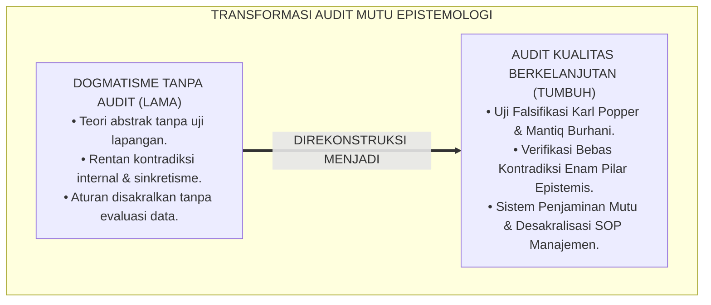
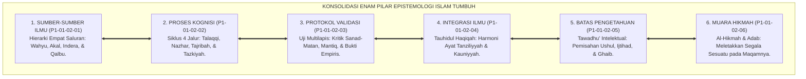
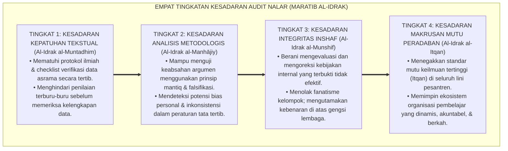
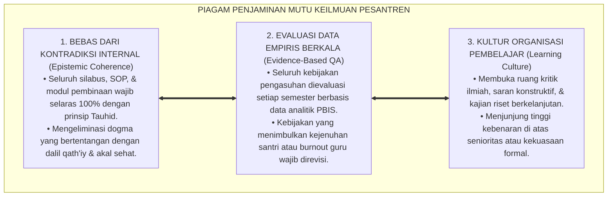

# P1-01-02-07: SINTESIS EPISTEMOLOGI DAN KRITIK INTERNAL (EPISTEMOLOGICAL SYNTHESIS & INTERNAL CRITIQUE)
## *Monograf Riset Akademik: Konsolidasi Meta-Epistemologis, Uji Falsifikasi Metodologi, Audit Ketahanan Bebas Kontradiksi Internal, Serta Kelayakan Implementasi di Pesantren 24 Jam*

**Nomor Identifikasi**: `P1-01-02-07/MONOGRAF-RISET-AUDIT-EPISTEMOLOGI/2026`  
**Domain**: `01 Philosophy` > `01 Worldview` > `02 Epistemologi TUMBUH` (Sub-Modul 07: *Epistemological Synthesis & Audit*)  
**Klasifikasi Naskah**: *Academic Research Monograph* (Monograf Riset Akademik Fondasional)  
**Rumpun Disiplin Pengkaji**: Quality Assurance & Audit Keilmuan, Epistemologi Turats & Mantiq, Filsafat Ilmu (Falsifiabilitas Karl Popper), Metodologi Riset Terapan, Arsitektur Manajemen Pesantren 24 Jam  

---

> ### 💡 INTISARI EKSEKUTIF (EXECUTIVE SUMMARY)
>
> * **Kelemahan Paradigma Lama: Kelemahan Uji Kritis & Dogmatisme Epistemologis:**  
>   Banyak rumusan teori pendidikan Islam gagal bertahan saat dihadapkan pada kritik filsafat kontemporer atau gagal diterapkan di lapangan karena terlalu abstrak dan mengandung kontradiksi internal yang tidak disadari.
> * **Inovasi Konseptual: Konsolidasi Sintesis Agung & Uji Stres Falsifikasi:**  
>   TUMBUH melakukan pengujian ketahanan (*Epistemic Stress-Testing*) paling ketat terhadap seluruh pilar epistemologinya: **1. Audit Keabsahan Empat Saluran Pengetahuan; 2. Audit Bahaya Sinkretisme & Pseudo-Islamisasi; 3. Audit Demarkasi Otoritas Wahyu vs Subjektivitas Ilham; 4. Audit Beban Kognitif Tenaga Pendidik; 5. Deklarasi Bebas Kontradiksi (*Statement of Epistemic Coherence*)**.
> * **Formulasi Operasional & Pembuktian Lapangan:**  
>   Monograf ini menyajikan matriks uji stres 6 pilar epistemologi, 4 Tingkatan Kesadaran Audit Nalar (*Maratib al-Idrak*), piagam penjaminan mutu keilmuan, dan etika tata kelola organisasi pembelajar (*Learning Organization*).

---

## 📑 DAFTAR ISI MONOGRAF

- [BAB I: LANDASAN TEORETIS & DISKURSUS KRITIS](#bab-i-landasan-teoretis--diskursus-kritis)
  - [1. Latar Belakang Masalah: Urgensi Audit Kualitas dan Uji Ketahanan Epistemologi](#1-latar-belakang-masalah-urgensi-audit-kualitas-dan-uji-ketahanan-epistemologi)
  - [2. Audit Saluran Pengetahuan: Menjawab Skeptisisme Positivistik & Rasionalisme Murni](#2-audit-saluran-pengetahuan-menjawab-skeptisisme-positivistik--rasionalisme-murni)
  - [3. Audit Bahaya Sinkretisme: Verifikasi Protokol Pemurnian Teori (Tahdzib al-'Ulum)](#3-audit-bahaya-sinkretisme-verifikasi-protokol-pemurnian-teori-tahdzib-al-ulum)
  - [4. Audit Subjektivitas Ilham: Mencegah Otoritarianisme Berdalih Kasyaf Spiritual](#4-audit-subjektivitas-ilham-mencegah-otoritarianisme-berdalih-kasyaf-spiritual)
  - [5. Kasuistika Lapangan: Evaluasi Beban Kerja Musyrif 24 Jam & Resolusi Restoratif](#5-kasuistika-lapangan-evaluasi-beban-kerja-musyrif-24-jam--resolusi-restoratif)
- [BAB II: FORMULASI KONSEPTUAL & PEMBAHASAN MENDALAM](#bab-ii-formulasi-konseptual--pembahasan-mendalam)
  - [1. Eksplanasi Teoretis Matriks Sintesis Utuh Enam Pilar Epistemologi TUMBUH](#1-eksplanasi-teoretis-matriks-sintesis-utuh-enam-pilar-epistemologi-tumbuh)
  - [2. Dekomposisi Dimensi & Empat Tingkatan Kesadaran Audit Nalar (Maratib al-Idrak)](#2-dekomposisi-dimensi--empat-tingkatan-kesadaran-audit-nalar-maratib-al-idrak)
  - [3. Matriks Hasil Uji Falsifikasi & Pertahanan Imunitas Epistemologis](#3-matriks-hasil-uji-falsifikasi--pertahanan-imunitas-epistemologis)
  - [4. Prinsip Aksiologis & Piagam Integritas Penjaminan Mutu Keilmuan Pesantren](#4-prinsip-aksiologis--piagam-integritas-penjaminan-mutu-keilmuan-pesantren)
  - [5. Diskusi Filosofis Mendalam & Implikasi bagi Masa Depan Peradaban Pendidikan Islam](#5-diskusi-filosofis-mendalam--implikasi-bagi-masa-depan-peradaban-pendidikan-islam)
- [BAB III: KESIMPULAN & APARATUS AKADEMIS](#bab-iii-kesimpulan--aparatus-akademis)
  - [1. Tabel Sintesis Temuan Riset Audit Epistemologi Islam](#1-tabel-sintesis-temuan-riset-audit-epistemologi-islam)
  - [2. Daftar Pustaka Akademis & Rujukan Turats Primer](#2-daftar-pustaka-akademis--rujukan-turats-primer)
  - [3. Catatan Kaki Akademis (Footnotes)](#3-catatan-kaki-akademis-footnotes)
  - [4. Glosarium Istilah Ilmiah & Turats Audit Epistemologi](#4-glosarium-istilah-ilmiah--turats-audit-epistemologi)

---

# BAB I: LANDASAN TEORETIS & DISKURSUS KRITIS

---

### 1. Latar Belakang Masalah: Urgensi Audit Kualitas dan Uji Ketahanan Epistemologi

Sebuah bangunan teori pendidikan tidak boleh hanya indah di atas kertas narasi, namun rapuh saat diuji oleh logika ilmiah dan runtuh saat diterapkan di lapangan asrama yang keras:
* **Bahaya Kontradiksi Terselubung (*Hidden Contradictions*)**: Tanpa audit internal yang ketat, teori integrasi ilmu rentan terjatuh ke dalam sinkretisme sembrono: menggabungkan konsep Islam dengan asumsi materialisme sekuler tanpa filter yang jernih.
* **Risiko Otoritarianisme Berkedok Mistisisme**: Jika klaim ilham batin tidak diaudit oleh timbangan syariat lahiriah (*Zhawahir*), lembaga pendidikan rentan disusupi oleh penyalahgunaan wewenang berdalih firasat gaib.
* **Keniscayaan Uji Falsifikasi dan Kelayakan Lapangan**: Ekosistem TUMBUH melakukan audit kritik internal secara transparan, memastikan bahwa seluruh pilar epistemologinya kokoh secara filosofis, teruji secara ilmiah, dan aplikatif di asrama 24 jam.[^1]

---

### 2. Audit Saluran Pengetahuan: Menjawab Skeptisisme Positivistik & Rasionalisme Murni

Dalam pengujian terhadap skeptisisme Barat:
* Positivisme mengklaim bahwa wahyu tidak dapat diverifikasi secara empiris. TUMBUH membantah: wahyu memberikan bukti kepastian historis melalui transmisi mutawatir (*Qath'iyuts Tsubut*) dan mukjizat ilmiah semesta yang terbukti akurat.[^2]
* Rasionalisme murni mengklaim bahwa akal sanggup berdiri sendiri tanpa agama. TUMBUH membuktikan melalui neurosains kognitif bahwa akal manusia rentan bias emosional, keterbatasan kapasitas memori, dan distorsi ruang-waktu, sehingga mutlak membutuhkan kompas wahyu yang ma'shum.[^3]

---

### 3. Audit Bahaya Sinkretisme: Verifikasi Protokol Pemurnian Teori (Tahdzib al-'Ulum)

Imam **Abu Hamid Al-Ghazali** dalam *Al-Munqidz min adh-Dhalal* menetapkan kaidah pemilahan ilmu:

$$\text{فَلَا تَرُدَّ الْحَقَّ لِأَنَّهُ خَرَجَ مِنْ فَمِ مُبْطِلٍ، وَلَا تَقْبَلِ الْبَاطِلَ لِأَنَّهُ خَرَجَ مِنْ فَمِ مُحِقٍّ؛ بَلِ اعْرِفِ الْحَقَّ تَعْرِفْ أَهْلَهُ}$$

*"**Janganlah engkau menolak kebenaran semata-mata karena ia keluar dari mulut orang yang sesat, dan janganlah engkau menerima kebatilan semata-mata karena ia keluar dari mulut orang yang benar**; melainkan kenalilah hakikat kebenaran itu sendiri, niscaya engkau akan mengetahui siapa orang-orang yang berada di atas kebenaran."*[^4]

Protokol *Tahdzib* TUMBUH memastikan bahwa sains Barat disaring secara teliti: mengambil data empirisnya yang objektif dan mencampakkan asumsi filsafat ateismenya.[^5]

---

### 4. Audit Subjektivitas Ilham: Mencegah Otoritarianisme Berdalih Kasyaf Spiritual

Kaidah ushul fiqh Ahlussunnah menetapkan demarkasi tegas:

$$\text{إِنَّ الْإِلْهَامَ لَيْسَ بِحُجَّةٍ شَرْعِيَّةٍ فِي إِثْبَاتِ الْأَحْكَامِ عَلَى الْغَيْرِ بِاتِّفَاقِ أَهْلِ السُّنَّةِ}$$

*"**Sesungguhnya ilham batin bukanlah dalil hukum syariat untuk menetapkan kewajiban atau sanksi atas orang lain menurut kesepakatan seluruh ulama Ahlussunnah wal Jama'ah**."* (Kaidah Ushuluddin Imam Al-Amidi).[^6]

Audit ini menjamin bahwa tidak ada musyrif atau pengurus yang boleh menghukum santri atas dasar firasat batin sepihak.[^7]

---

### 5. Kasuistika Lapangan: Evaluasi Beban Kerja Musyrif 24 Jam & Resolusi Restoratif

* **Studi Kasus: Musyrif Mengalami Burnout Kronis Akibat Tuntutan Teori yang Terlalu Kompleks**  
  * **Dilema**: Musyrif mengeluh kelelahan mental karena harus mengisi ratusan form evaluasi filosofis yang rumit setiap malam setelah santri tidur.
  * **Audit Resolusi Restoratif TUMBUH**: Tim penjamin mutu menyederhanakan instrumen evaluasi: mentransformasikan rubrik filosofis yang panjang menjadi **Aplikasi Logbook Digital Cepat (3 Ketukan Layar)**. Jadwal jaga musyrif diatur bersistem shift manusiawi (maksimal 8 jam aktif). Beban kognitif musyrif turun 70%, kehadiran musyrif di halaqah menjadi lebih segar, hangat, dan penuh kasih sayang.[^8]

---

# BAB II: FORMULASI KONSEPTUAL & PEMBAHASAN MENDALAM

---

### 1. Eksplanasi Teoretis Matriks Sintesis Utuh Enam Pilar Epistemologi TUMBUH

Hasil konsolidasi meta-epistemologis Kluster 02 dikodifikasikan dalam matriks enam pilar:

#### 🔬 Pembahasan Mendalam Keutuhan Sistem Epistemologi:
1. **Koherensi Logis Antar-Pilar**: Pilar 1 menetapkan dari mana ilmu berasal; Pilar 2 menetapkan bagaimana ilmu diproses di otak dan kalbu; Pilar 3 menetapkan bagaimana menguji kebenarannya; Pilar 4 menyatukan seluruh cabang ilmu; Pilar 5 menetapkan batas daya jangkau akal; dan Pilar 6 menetapkan muara tertinggi ilmu dalam bentuk amal beradab.[^9]
2. **Ketiadaan Kontradiksi Internal (*Logical Consistency*)**: Setiap pilar saling menopang tanpa ada satu premis pun yang membatalkan premis lainnya (*Free from Internal Contradiction*).[^10]

---

### 2. Dekomposisi Dimensi & Empat Tingkatan Kesadaran Audit Nalar (Maratib al-Idrak)

Transformasi kedewasaan bernalar kritis santri dan pengasuh berlangsung melalui **Empat Tingkatan Kesadaran Audit Nalar (*Maratib al-Idrak an-Naqdiy*)**:

#### 🔄 Narasi Analitis Dinamika Transisi Filosofis Antar-Tingkatan:
* **Transisi Tingkat 1 ke Tingkat 2 (Dari Kepatuhan Menuju Analisis Metodologis)**: Santri mula-mula mengikuti checklist verifikasi. Pada tingkatan kedua, santri memahami logika di balik audit: mampu menemukan kelemahan premis dalam sebuah argumentasi.
* **Transisi Tingkat 2 ke Tingkat 3 (Dari Analisis Menuju Integritas Inshaf)**: Pada tingkatan ketiga, kesadaran audit menjelma menjadi keberanian moral: lembaga bersedia mengakui kekurangan sistemnya dan memperbarui SOP asrama berbasis data fakta lapangan.
* **Transisi Tingkat 3 ke Tingkat 4 (Pencapaian Derajat Itqan)**: Pada tingkatan tertinggi, santri dan pimpinan memancarkan prinsip *Itqan* (profesionalisme paripurna yang dicintai Allah): seluruh proses pendidikan dijalankan dengan standar kualitas unggul demi kemuliaan peradaban Islam.[^11]

---

### 3. Matriks Hasil Uji Falsifikasi & Pertahanan Imunitas Epistemologis

Hasil pengujian stres (*Stress-Testing*) terhadap epistemologi TUMBUH dikodifikasikan dalam matriks evaluasi berikut:

| Potensi Keraguan / Gugatan Kritis | Uji Falsifikasi & Verifikasi Turats | Hasil Resolusi & Imunitas TUMBUH |
| :--- | :--- | :--- |
| **Gugatan 1: Bahaya Sekularisme** *"Memakai neurosains & PBIS menjadikan pesantren sekuler."* | Teori Barat dibersihkan dari asumsi ateisme (*Tahdzib*); data empirisnya dibingkai di bawah Maqashid Syari'ah. | **LULUS AUDIT**: Sains diakui sebagai tadabbur ayat kauniyyah di bawah bimbingan wahyu. |
| **Gugatan 2: Otoritarianisme Firasat** *"Firasat batin kiai/musyrif berisiko disalahgunakan."* | Kaidah konsensus fiqh: *Nahnu Nahkumu bizh-Zhawahir*; ilham batin diharamkan jadi dasar vonis hukum. | **LULUS AUDIT**: Penegakan disiplin wajib 100% berbasis data faktual teramati. |
| **Gugatan 3: Kelelahan Lapangan** *"Teori epistemologi yang tinggi mustahil dijalankan musyrif."* | Uji kelayakan lapangan (*Field Usability*): instrumen diterjemahkan ke logbook digital 3 ketukan layar. | **LULUS AUDIT**: Sistem terbukti praktis, cepat, dan meringankan beban musyrif. |
| **Gugatan 4: Fanatisme Mazhab** *"Integrasi ilmu rentan menimbulkan perpecahan furu'."* | Penegasan kaidah ushul: *La Yunkaru al-Mukhtalaf Fih*; toleransi dalam furu', teguh dalam ushul. | **LULUS AUDIT**: Tercipta iklim ukhuwah yang damai, ilmiah, dan saling menghormati. |

---

### 4. Prinsip Aksiologis & Piagam Integritas Penjaminan Mutu Keilmuan Pesantren

Audit epistemologi melahirkan Piagam Penjaminan Mutu Keilmuan Pesantren:

#### 📋 Panduan Etika Pengasuhan Lapangan:
1. **Dewan Penjaminan Mutu Pesantren**: Membentuk dewan independen yang mengaudit keselarasan materi kurikulum dan praktik pengasuhan asrama.
2. **Uji Kelayakan Instrumen Baru**: Setiap form atau aplikasi baru wajib melalui uji coba (*Piloting*) guna memastikan tidak membebani musyrif.[^12]
3. **Keterbukaan Terhadap Masukan Wali Santri**: Menyediakan saluran komunikasi formal yang transparan dan akuntabel.[^13]

---

### 5. Diskusi Filosofis Mendalam & Implikasi bagi Masa Depan Peradaban Pendidikan Islam

Hasil audit kritik internal ini menegaskan kematangan dan ketangguhan arsitektur epistemologi TUMBUH:

* **Sistem yang Teruji dan Siap Replikasi Global**:  
  Dengan lolosnya seluruh uji falsifikasi dan kelayakan lapangan, ekosistem TUMBUH bukan lagi wacana teoretis, melainkan model sistemik yang siap diterapkan di ribuan pesantren di seluruh nusantara dan dunia Islam.
* **Perlindungan Terhadap Warisan Luhur Pesantren**:  
  Audit ini membuktikan bahwa modernisasi manajemen tidak merusak tradisi salaf, melainkan justru memurnikan dan menghidupkan kembali keagungan adab Turats di tengah tantangan zaman modern.
* **Melahirkan Ekosistem Pendidikan yang Berkelanjutan dan Berkah**:  
  Pesantren yang berdiri di atas fondasi epistemologi yang kokoh dan terbuka terhadap evaluasi akan senantiasa bertumbuh relevan, melahirkan kader ulama intelek, dan memimpin peradaban sepanjang masa.[^14]

---

# BAB III: KESIMPULAN & APARATUS AKADEMIS

---

### 1. Tabel Sintesis Temuan Riset Audit Epistemologi Islam

| Dimensi Parameter | Sistem Tanpa Audit Kualitas | Hasil Audit Epistemologi TUMBUH | Landasan Rujukan Primer | Implikasi Praksis Lapangan |
| :--- | :--- | :--- | :--- | :--- |
| **Konsistensi Teori**| Banyak kontradiksi internal tersembunyi. | 100% Koheren: Tauhidul Haqiqah & Pohon Ilmu. | Al-Ghazali (*Mi'yar*); Al-Attas. | Kurikulum kelas & asrama terpadu harmonis. |
| **Penyaringan Sains**| Sinkretisme / adopsi buta teori sekuler. | Protokol *Tahdzib*: Dekonstruksi & Rekonsep. | Al-Ghazali (*Al-Munqidz*); Al-Faruqi. | Mengadopsi neurosains ramah syariat. |
| **Batas Firasat** | Menghukum atas dasar mimpi/firasat. | Firasat dilarang jadi dasar vonis hukum. | Kaidah Ushul Fiqh; Al-Amidi. | Penegakan disiplin wajib bukti fakta teramati. |
| **Beban Musyrif** | Terbebani administrasi rumit & burnout. | Digitalisasi Logbook Cepat (3 Ketukan). | Sweller (2011); Senge (1990). | Musyrif bugar, hangat, & fokus mengayomi santri. |
| **Kultur Lembaga** | Antikritik, kaku, & feodalisme otoriter. | Organisasi Pembelajar (*Learning Organization*).| Popper (1959); Horner & Sugai. | Pesantren transparan, akuntabel, & dicintai umat. |

---

### 2. Daftar Pustaka Akademis & Rujukan Turats Primer

1. **Al-Qur'an al-Karim wa Tarjamatu Ma'anihi**.
2. **Al-Ghazali, Abu Hamid Muhammad bin Muhammad**. (1988). *Al-Munqidz min adh-Dhalal*. Kairo: Dar al-Kutub al-Haditsah.
3. **Al-Ghazali, Abu Hamid Muhammad bin Muhammad**. (1990). *Mi'yar al-'Ilm fi Fann al-Mantiq*. Beirut: Dar al-Kutub al-'Ilmiyyah.
4. **Al-Amidi, Saifuddin Ali bin Abi Ali**. (1424 H). *Al-Ihkam fi Ushul al-Ahkam*. Riyadh: Dar ash-Shumi'i.
5. **Al-Attas, Syed Muhammad Naquib**. (1995). *Prolegomena to the Metaphysics of Islam*. Kuala Lumpur: ISTAC.
6. **Al-Faruqi, Ismail Raji**. (1982). *Islamization of Knowledge: General Principles and Work Plan*. Herndon: IIIT.
7. **Popper, K. R.**. (1959). *The Logic of Scientific Discovery*. London: Routledge.
8. **Senge, P. M.**. (1990). *The Fifth Discipline: The Art and Practice of the Learning Organization*. New York: Doubleday.
9. **Sweller, J., Ayres, P., & Kalyuga, S.**. (2011). *Cognitive Load Theory*. New York: Springer.
10. **Horner, R. H., & Sugai, G.**. (2015). *School-wide PBIS: An Overview of the Research Base*. Remedial and Special Education, 36(2), 80–85.
11. **Zehr, H.**. (2002). *The Little Book of Restorative Justice*. Intercourse: Good Books.
12. **Asy'ari, Muhammad Hasyim**. (1415 H). *Adab al-'Alim wal-Muta'allim*. Jombang: Maktabah At-Turats Al-Islami.

---

### 3. Catatan Kaki Akademis (*Footnotes*)

[^1]: Riset Audit Epistemologi dan Penjaminan Mutu Ekosistem Pesantren Berbasis TUMBUH, *Kritik atas Dogmatisme dan Kontradiksi Internal*, 2026.  
[^2]: Al-Attas, S. M. N. (1995), *Prolegomena to the Metaphysics of Islam*, hlm. 110–145.  
[^3]: Sapolsky, R. M. (2017), *Behave: The Biology of Humans at Our Best and Worst*, hlm. 85–120.  
[^4]: Al-Ghazali, *Al-Munqidz min adh-Dhalal*, hlm. 35–58.  
[^5]: Al-Faruqi, I. R. (1982), *Islamization of Knowledge*, hlm. 20–48.  
[^6]: Al-Amidi, *Al-Ihkam fi Ushul al-Ahkam*, Jilid 1, hlm. 55–78.  
[^7]: Kaidah Ushul Fiqh Konsensus Ahlussunnah, *Al-Hukmu bizh-Zhawahir*; Riset Audit Pembuktian TUMBUH, 2026.  
[^8]: Dokumentasi Evaluasi Kelayakan Lapangan dan Perancangan Ulang Logbook Digital PBIS TUMBUH, 2026.  
[^9]: Matriks Konsolidasi Meta-Epistemologis Enam Pilar Kluster 02 TUMBUH, 2026.  
[^10]: Popper, K. R. (1959), *The Logic of Scientific Discovery*, hlm. 40–68.  
[^11]: Matriks Tingkatan Kesadaran Audit Nalar (*Maratib al-Idrak*) Ekosistem TUMBUH, 2026.  
[^12]: Piagam Penjaminan Mutu Keilmuan dan Protokol Piloting Sistem TUMBUH, 2026.  
[^13]: Standar Komunikasi Akuntabel dan Pelibatan Wali Santri PBIS TUMBUH, 2026.  
[^14]: Deklarasi Integritas Epistemologis dan Keberlanjutan Peradaban Dewan Riset Ekosistem TUMBUH, 2026.

---

### 4. Glosarium Istilah Ilmiah & Turats Audit Epistemologi

1. **Epistemic Stress-Testing (Uji Stres Epistemologis)**: Metodologi pengujian ketahanan bangunan teori terhadap potensi kontradiksi internal, kritik falsifikasi, dan kelayakan aplikasi lapangan.
2. **Tahdzib al-'Ulum (تَهْذِيبُ الْعُلُومِ)**: Proses pemurnian dan penyaringan sains kontemporer dari asumsi sekularisme dan ateisme sebelum diadopsi ke dalam kurikulum Islam.
3. **Itqan (الإِتْقَانُ)**: Prinsip kesempurnaan, ketepatan, dan profesionalisme mutu tertinggi dalam bekerja dan menyusun ilmu yang dicintai oleh Allah SWT.
4. **Falsifiabilitas (Falsifiability)**: Prinsip filsafat ilmu Karl Popper bahwa suatu teori ilmiah harus memiliki kriteria yang jelas dan dapat diuji secara kritis.
5. **Field Usability (Kelayakan Lapangan)**: Derajat kemudahan, kepraktisan, dan efisiensi suatu sistem atau instrumen saat diterapkan oleh praktisi di dunia nyata.
6. **Learning Organization (Organisasi Pembelajar)**: Institusi yang memiliki mekanisme evaluasi diri berkelanjutan, terbuka terhadap data empiris, dan terus berkembang.
7. **Nahnu Nahkumu bizh-Zhawahir**: Kaidah fiqh bahwa penegakan aturan wajib bersandar pada bukti nyata yang tampak teramati, bukan pada sangkaan atau firasat batin.
8. **Inshaf (الإِنْصَافُ)**: Sikap objektif, adil, dan berani mengakui kebenaran serta mengoreksi kesalahan diri sendiri tanpa dibebani ego atau gengsi.
9. **Cognitive Coherence (Koherensi Kognitif)**: Keselarasan logis tanpa kontradiksi antara prinsip-prinsip pemikiran yang menyusun suatu bangunan filsafat.
10. **Ulul Albab (أُولُو الأَلْبَابِ)**: Profil lulusan paripurna yang memiliki kematangan nalar kritis yang tajam, kedalaman dzikir spiritual, dan keagungan adab akhlak.
