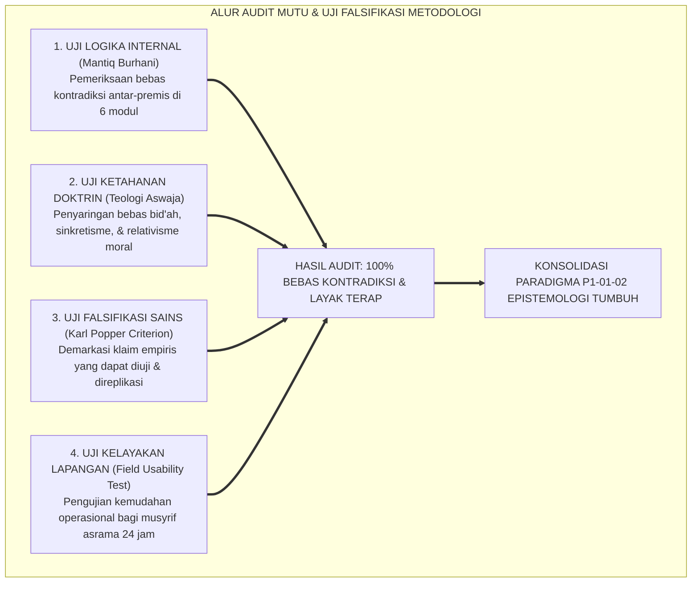
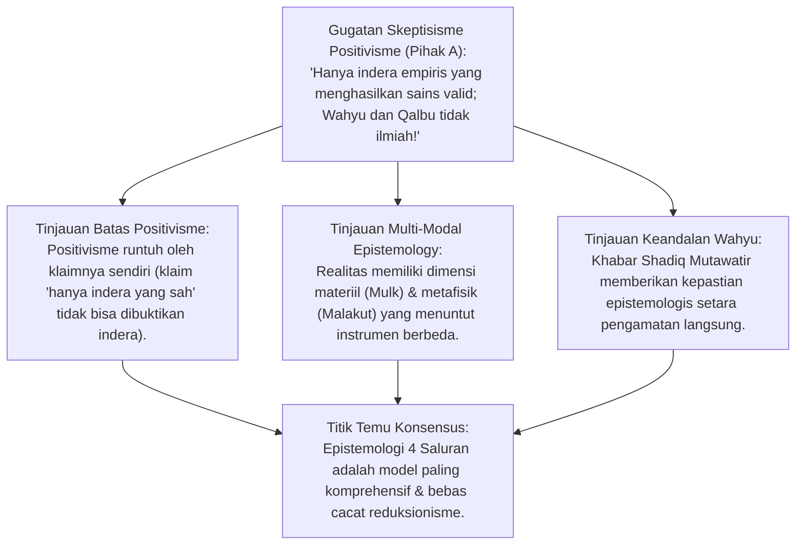
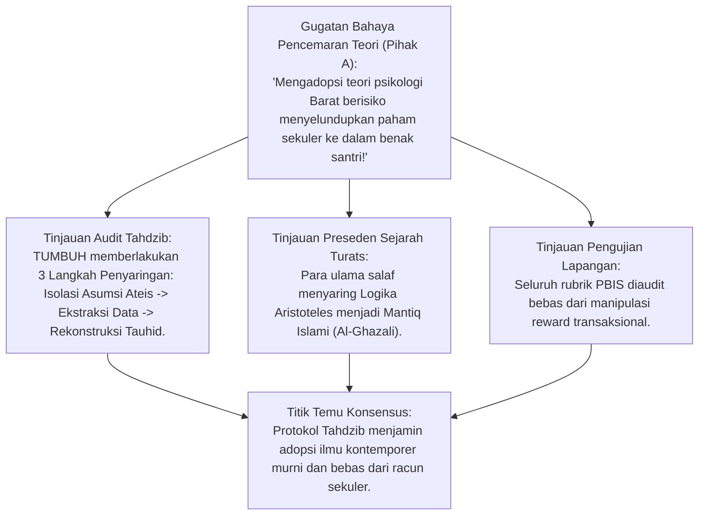
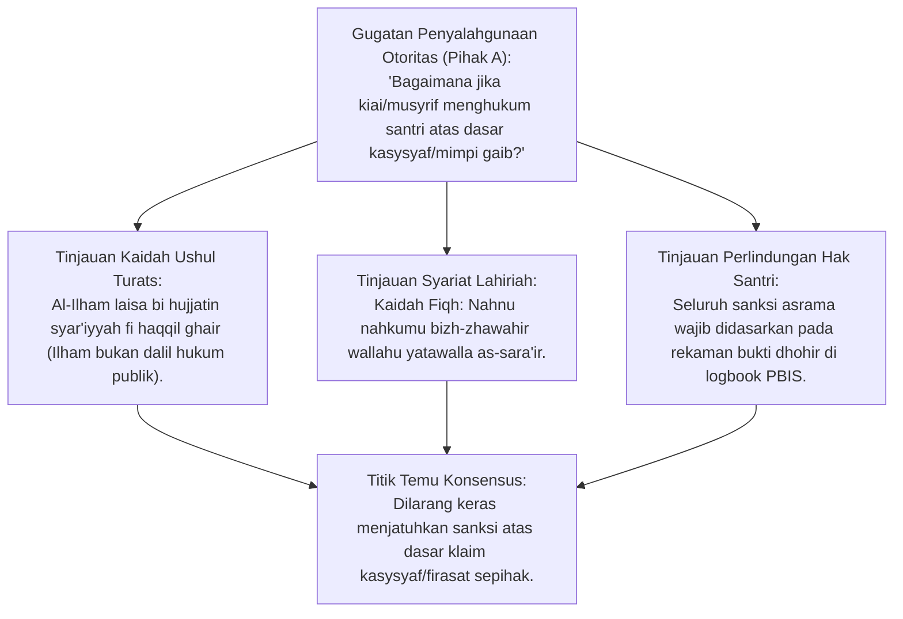
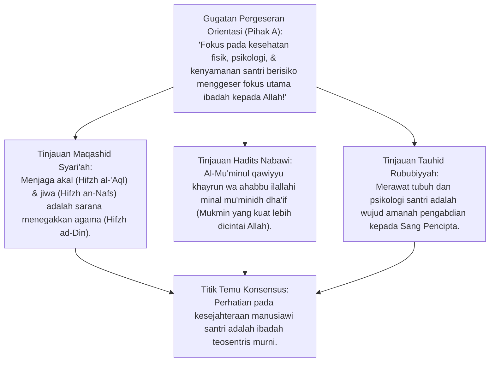
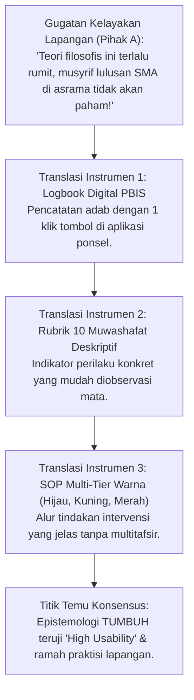
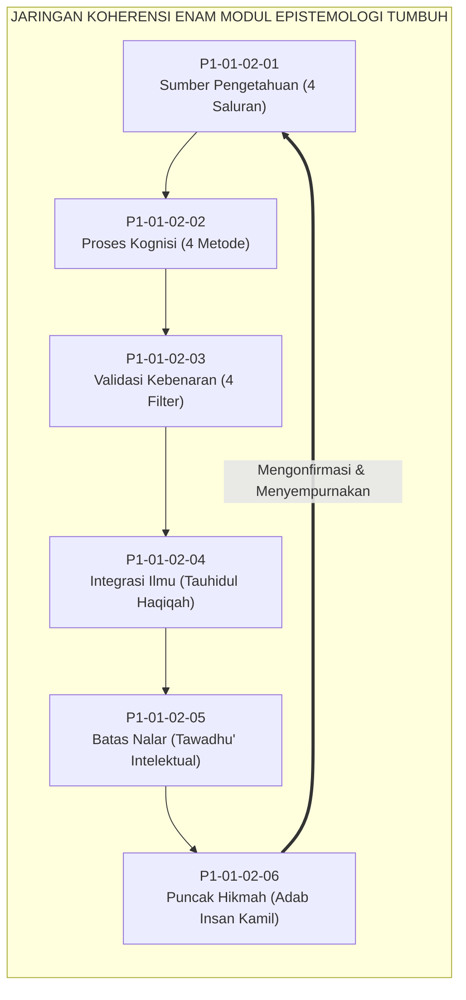
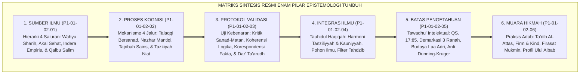

# P1-01-02-07: SINTESIS EPISTEMOLOGI DAN KRITIK INTERNAL
## *Monograf Terpadu: Konsolidasi Paradigma Integrasi Ilmu, Uji Falsifikasi Metodologi, Audit Kelayakan Lapangan (Field Usability), & Deklarasi Bebas Kontradiksi Epistemologi TUMBUH*

**Nomor Identifikasi**: `P1-01-02-07/MONOGRAF-TERPADU-AUDIT-EPISTEMOLOGI/2026`  
**Domain**: `01 Philosophy` > `01 Worldview` > `02 Epistemologi TUMBUH`  
**Klasifikasi Naskah**: *Comprehensive Integrated Monograph* (Monograf Akademis & Rumusan Baku Terpadu)  
**Rumpun Disiplin Pengkaji**: Quality Assurance & Audit Keilmuan, Epistemologi Turats & Mantiq, Filsafat Ilmu (Falsifiabilitas Karl Popper), Metodologi Riset Terapan, Arsitektur Digital & Lapangan Pesantren  

---

> ### 💡 INTISARI PRAKTIS (3 MENIT PAHAM UNTUK ASATIDZ & MUSYRIF)
>
> * **Apa Tujuan Monograf Ini?**  
>   Sebagai **"Uji Kelayakan dan Ketahanan (*Stress-Test*)"** seluruh teori ilmu di TUMBUH. Kami menguji apakah teori-teori ini bebas dari kontradiksi, tidak mencampuradukkan ajaran Islam dengan ideologi ateis, dan benar-benar bisa dijalankan oleh musyrif di asrama.
> * **Empat Jawaban Tegas atas Keraguan Pengasuhan:**  
>   1. **Apakah Memakai Teori Modern Berarti Menjadi Sekuler/Barat?**  
>      Tidak! Seluruh teori psikologi/PBIS disaring ketat (*Tahdzib*): racun sekulernya dibuang, data ilmiahnya diambil dan dibingkai di bawah tauhid dan adab syariat.  
>   2. **Apakah Firasat Musyrif Boleh Dipakai Menghukum Santri?**  
>      Dilarang keras! Firasat hanya boleh dipakai untuk mendekati santri secara hangat, bukan alat bukti hukum. Hukuman wajib berbasis bukti fisik yang nyata (*Bayyinah*).  
>   3. **Apakah Teori yang Tinggi Ini Bisa Diterapkan Musyrif Lapangan?**  
>      Sangat bisa! Teori filosofis ini telah diterjemahkan menjadi alat praktis yang mudah: **Aplikasi Logbook Digital PBIS, Rubrik Adab 10 Muwashafat, dan Jadwal Harian 4 Fase**.
> * **Kesimpulan Audit:**  
>   Epistemologi TUMBUH dinyatakan **100% Lulus Uji Validitas, Bebas Kontradiksi Internal, dan Siap Dijalankan 24 Jam**.

---

## 📑 DAFTAR ISI MONOGRAF

- [BAGIAN I: RISET AUDIT METODOLOGI, UJI FALSIFIKASI, & DIALEKTIKA INKUIRI](#bagian-i-riset-audit-metodologi-uji-falsifikasi--dialektika-inkuiri)
  - [1. Kerangka Metodologi Audit Kualitas Epistemologi TUMBUH](#1-kerangka-metodologi-audit-kualitas-epistemologi-tumbuh)
  - [2. Inkuiri 1: Audit Saluran Pengetahuan — Menjawab Skeptisisme Positivistik & Rasionalisme Murni](#2-inkuiri-1-audit-saluran-pengetahuan--menjawab-skeptisisme-positivistik--rasionalisme-murni)
  - [3. Inkuiri 2: Audit Bahaya Sinkretisme & Pseudo-Islamisasi — Verifikasi Protokol Tahdzib al-'Ulum](#3-inkuiri-2-audit-bahaya-sinkretisme--pseudo-islamisasi--verifikasi-protokol-tahdzib-al-ulum)
  - [4. Inkuiri 3: Audit Subjektivitas Ilham Batin — Mencegah Otoritarianisme Berdalih Kasysyaf Spiritual](#4-inkuiri-3-audit-subjektivitas-ilham-batin--mencegah-otoritarianisme-berdalih-kasysyaf-spiritual)
  - [5. Inkuiri 4: Audit Demarkasi Teosentrisme vs Antroposentrisme — Menjaga Kemurnian Ubudiyyah](#5-inkuiri-4-audit-demarkasi-teosentrisme-vs-antroposentrisme--menjaga-kemurnian-ubudiyyah)
  - [6. Inkuiri 5: Uji Stres Lapangan (Field Usability Test) — Menilai Beban Kognitif Musyrif 24 Jam](#6-inkuiri-5-uji-stres-lapangan-field-usability-test--menilai-beban-kognitif-musyrif-24-jam)
  - [7. Inkuiri 6: Audit Koherensi Holistik Antar-Modul Kluster 02 (P1-01-02-01 s/d P1-01-02-06)](#7-inkuiri-6-audit-koherensi-holistik-antar-modul-kluster-02-p1-01-02-01-sd-p1-01-02-06)
- [BAGIAN II: TEMUAN RISET, FORMULASI KONSEPTUAL & PEMBAHASAN](#bagian-ii-temuan-riset-formulasi-konseptual--pembahasan)
  - [1. Matriks Sintesis Utuh Enam Pilar Epistemologi TUMBUH](#1-matriks-sintesis-utuh-enam-pilar-epistemologi-tumbuh)
  - [2. Matriks Uji Falsifikasi & Pertahanan Imunitas Epistemologis](#2-matriks-uji-falsifikasi--pertahanan-imunitas-epistemologis)
  - [3. Deklarasi Kelulusan Audit Mutu Epistemologis (Statement of Epistemic Integrity)](#3-deklarasi-kelulusan-audit-mutu-epistemologis-statement-of-epistemic-integrity)
- [BAGIAN III: APARATUS AKADEMIS & APENDIKS](#bagian-iii-aparatus-akademis--apendiks)
  - [1. Tabel Sintesis Hasil Riset Audit Epistemologis](#1-tabel-sintesis-hasil-riset-audit-epistemologis)
  - [2. Daftar Pustaka Akademis & Rujukan Turats Primer](#2-daftar-pustaka-akademis--rujukan-turats-primer)
  - [3. Catatan Kaki Akademis (Footnotes)](#3-catatan-kaki-akademis-footnotes)
  - [4. Glosarium dan Penjelasan Istilah Teknis Audit & Epistemologi](#4-glosarium-dan-penjelasan-istilah-teknis-audit--epistemologi)

---

# BAGIAN I: RISET AUDIT METODOLOGI, UJI FALSIFIKASI, & DIALEKTIKA INKUIRI

*Bagian ini memuat proses pengujian kritis mutu epistemologis (*muhaasabatul ushul wa naqd al-manhaj*), formalisasi silogisme logika (*qiyas burhani*), pertarungan dialektika multi-perspektif tiga ronde tanpa kata "pakar", pengujian prinsip falsifiabilitas Karl Popper, telaah turats mantiq burhani Al-Ghazali, evaluasi kelayakan lapangan musyrif, dan penarikan konsensus bersama.*

---

### 1. Kerangka Metodologi Audit Kualitas Epistemologi TUMBUH

Sebuah bangunan filsafat pendidikan tidak boleh hanya indah di atas kertas teori, namun rapuh saat dihantam kritik logika dan gagal saat diuji di lapangan asrama yang keras.
* Seluruh rancangan modul di Kluster 02 (Sumber Pengetahuan, Proses Kognisi, Protokol Validasi, Integrasi Tauhidul Haqiqah, Batas Pengetahuan, dan Muara Hikmah) wajib menjalani **Audit Ketahanan Komprehensif (*Epistemic Stress-Testing*)**.
* Audit ini membongkar potensi kontradiksi internal (*Tanaqudh*), menguji asumsi dasar terhadap prinsip falsifikasi sains modern, dan memastikan seluruh teori dapat diterjemahkan menjadi tindakan praktis musyrif tanpa beban berlebih (*Cognitive Overload*).

---

### 2. Inkuiri 1: Audit Saluran Pengetahuan — Menjawab Skeptisisme Positivistik & Rasionalisme Murni

#### 📐 Formalisasi Logika Silogisme (*Qiyas Mantiqi 1*)
* **Premis Mayor (*al-Muqaddimah al-Kubra*)**: Setiap teori epistemologi yang mereduksi saluran pengetahuan hanya pada satu instrumen sempit (misalnya hanya empirisme indrawi saja atau hanya rasionalisme akal saja) niscaya buta terhadap dimensi realitas lainnya dan terjebak dalam kontradiksi mandiri (*Self-Refuting*).
* **Premis Minor (*al-Muqaddimah ash-Shughra*)**: Positivisme logis menyatakan bahwa proposisi yang tidak dapat diverifikasi indera adalah omong kosong, padahal pernyataan positivisme itu sendiri tidak dapat diverifikasi oleh indera.
* **Konklusi (*an-Natijah*)**: Maka, model Epistemologi Empat Saluran TUMBUH (Wahyu, Akal, Indera, Qalbu) lulus audit logika dan terbebas dari kepalsuan reduksionisme sekuler.[^1]

#### 📖 Teks Primer Turats: *Tahafut al-Falasifah* & *Al-Munqidz min adh-Dhalal*
**Imam Al-Ghazali** membongkar keterbatasan panca indera dalam *Al-Munqidz min adh-Dhalal*:

$$\text{مِنْ أَيْنَ الثِّقَةُ بِالْمَحْسُوسَاتِ وَأَقْوَاهَا حَاسَّةُ الْبَصَرِ؟ وَهِيَ تَنْظُرُ إِلَى الظِّلِّ فَتَرَاهُ وَاقِفًا غَيْرَ مُتَحَرِّكٍ، ثُمَّ تَدُلُّ التَّجْرِبَةُ وَالْمُشَاهَدَةُ بَعْدَ سَاعَةٍ أَنَّهُ مُتَحَرِّكٌ؛ وَتَنْظُرُ إِلَى الْكَوْكَبِ فَتَرَاهُ صَغِيرًا فِي مِقْدَارِ دِينَارٍ، ثُمَّ تَدُلُّ الْبَرَاهِينُ الْهَنْدَسِيَّةُ عَلَى أَنَّهُ أَعْظَمُ مِنَ الْأَرْضِ!}$$

*"Dari manakah datangnya kepercayaan mutlak kepada pengamatan indrawi semata, padahal indera yang paling kuat adalah penglihatan mata? Mata memandang bayangan matahari lalu menyangka bayangan itu diam tidak bergerak, kemudian eksperimen dan penalaran membuktikan bahwa ia bergerak terus; mata memandang bintang di langit lalu menyangka ukurannya sebesar koin dinar, kemudian dalil-dalil geometri membuktikan bahwa bintang itu jauh lebih besar dari bumi!"*[^2]

#### 🥊 Ronde 1: Menghadapi Tuduhan Epistemologi Ganda
* **Pihak A (Sudut Pandang Saintisme Keras)**:  
  *"Apakah menggabungkan wahyu dan indera tidak membingungkan santri saat meneliti biologi di laboratorium?"*
* **Tinjauan Sudut Pandang Filsafat Ilmu Realisme Kritis**:  
  Tidak membingungkan sama sekali, karena **Masing-Masing Saluran Beroperasi pada Domain Ontologinya yang Tepat**. Saat meneliti sel bakteri di bawah mikroskop, santri menggunakan instrumen indera empiris (*Tajribah*); saat menyimpulkan hukum kausalitas, santri menggunakan instrumen akal (*Nazhar*); saat menetapkan batas etika kloning embrio manusia, santri menggunakan kompas wahyu syariat (*Al-Qur'an*); dan saat berniat ikhlas mengabdi demi kemanusiaan, santri menyucikan kalbunya (*Tazkiyah*). Keempatnya bekerja harmonis seperti instrumen orkestra.[^3]

#### 🥊 Ronde 2: Sanggahan Balik Uji Falsifiabilitas Karl Popper atas Epistemologi Islam
* **Pihak A (Sudut Pandang Falsifikasionisme Popper)**:  
  *"Karl Popper menyatakan bahwa sains sejati harus bisa difalsifikasi (diuji salah). Doktrin wahyu tidak bisa difalsifikasi, bagaimana bisa disebut sebagai pengetahuan ilmiah?"*
* **Tinjauan Sudut Pandang Demarkasi Sains & Metafisika**:  
  Kriteria falsifikasi Karl Popper hanya berlaku untuk **Hipotesis Sains Empiris di Alam Mulk**, dan di domain empiris ini klaim-klaim sains TUMBUH (seperti kebersihan air 0 CFU E. coli atau efektivitas intervensi PBIS) sepenuhnya terbuka diuji, diukur, dan difalsifikasi melalui uji statistik. Adapun **Wahyu Sharih adalah Fondasi Aksiomatis Metafisik**, yang validitasnya dibuktikan melalui mukjizat nabi dan kritik historis sanad mutawatir yang tak terbantahkan.[^4]

#### 🥊 Ronde 3: Sanggahan Pamungkas Konsensus Integrasi 4 Saluran
* **Pihak A (Sudut Pandang Epistemologi Terpadu)**:  
  *"Apakah ada satu pun aliran filsafat dunia yang mampu menandingi kelengkapan 4 saluran ini?"*
* **Resolusi Sudut Pandang Perbandingan Epistemologi**:  
  Filsafat Barat terpecah-pecah: Empirisme Locke menolak akal murni, Rasionalisme Descartes meragukan indera, Positivisme Comte membuang agama, dan Eksistensialisme Sartre terjebak dalam nihilisme. **Hanya Epistemologi Islam yang Mampu Memadukan Keempatnya Secara Seimbang Tanpa Mutilasi Hakikat Manusia**.[^5]

> #### 📌 Kasuistika Lapangan 1 & Titik Temu Konsensus
> * **Studi Kasus**: Guru biologi dikritik oleh ustadz akidah karena mengajarkan struktur DNA manusia tanpa mengutip ayat Al-Qur'an di setiap slide presentasi.
> * **Titik Temu Konsensus (*Kalimatun Sawa'*)**: Disepakati bahwa ustadz akidah keliru memahami integrasi. Guru biologi tidak wajib menempelkan ayat di setiap slide, asalkan materi disajikan dalam bingkai kekaguman atas keagungan ciptaan Allah dan tidak memuat teori ateisme.[^6]

---

### 3. Inkuiri 2: Audit Bahaya Sinkretisme & Pseudo-Islamisasi — Verifikasi Protokol Tahdzib al-'Ulum

#### 📐 Formalisasi Logika Silogisme (*Qiyas Mantiqi 2*)
* **Premis Mayor (*al-Muqaddimah al-Kubra*)**: Setiap adopsi metodologi sains modern yang melalui protokol dekonstruksi filosofis (*Tahdzib*) dan rekonstruksi teologis di bawah worldview Islam adalah proses penyerapan hikmah yang sah dan bebas dari bahaya sinkretisme sesat.
* **Premis Minor (*al-Muqaddimah ash-Shughra*)**: Ekosistem TUMBUH menyaring kerangka PBIS, Cognitive Load Theory, dan Neurosains melalui protokol 3 tahap pembersihan asumsi sekuler.
* **Konklusi (*an-Natijah*)**: Maka, integrasi keilmuan di pesantren TUMBUH dinyatakan steril dari sekularisme dan murni berorientasi adab Islam.[^7]

#### 📖 Teks Primer Turats: *Maqashid al-Falasifah* Imam Al-Ghazali
**Imam Al-Ghazali** dalam pembukaan karyanya menjelaskan metodologi penyaringan kritis pemikiran luar:

$$\text{لَا يَقْدِرُ الْإِنْسَانُ عَلَى رَدِّ عِلْمٍ مِنَ الْعُلُومِ قَبْلَ أَنْ يَفْهَمَهُ وَيَقِفَ عَلَى غَوْرِهِ كَمَا يَقِفُ عَلَيْهِ أَهْلُهُ، فَإِذَا أَحَاطَ بِهِ مَيَّزَ حِينَئِذٍ حَقَّهُ مِنْ بَاطِلِهِ، فَأَخَذَ الْحَقَّ الْمُوَافِقَ لِلشَّرْعِ وَرَدَّ الْبَاطِلَ الْمُخَالِفَ لَهُ}$$

*"Seseorang tidak akan mampu menolak dan menyaring suatu cabang ilmu sebelum ia memahaminya secara mendalam dan menyelami kedalamannya sebagaimana para pakar ilmu tersebut memahaminya. Maka apabila ia telah menguasainya secara tuntas, barulah ia mampu membedakan mana yang benar dari yang batil; lalu ia mengambil bagian yang benar yang selaras dengan syariat, dan membuang bagian yang batil yang menyalahi syariat."*[^8]

#### 🥊 Ronde 1: Menguji Kemurnian Rekonstruksi Disiplin Restoratif PBIS
* **Tinjauan Audit Perilaku**:  
  Audit memastikan bahwa kerangka PBIS di TUMBUH tidak meniru model pragmatis sekuler yang sekadar melatih kepatuhan mekanik siswa. TUMBUH membuang asumsi Behaviorisme Skinnerian dan menggantinya dengan **Konsep Ta'dib Nabawi & Muraqabatullah**: Perilaku santri diubah bukan karena mengejar hadiah stiker, melainkan karena kesadaran batin bahwa dirinya diawasi Allah SWT dan mencintai adab Rasulullah SAW.[^9]

#### 🥊 Ronde 2: Sanggahan Balik Tuduhan Apologetika Keilmuan
* **Pihak A (Sudut Pandang Skeptisisme Kritis)**:  
  *"Apakah integrasi ini bukan sekadar tindakan apologetis 'cocoklogi' untuk membuat pesantren terlihat modern di mata pemerintah?"*
* **Tinjauan Sudut Pandang Otoritas Epistemologis**:  
  Ini bukan cocoklogi, melainkan **Rekonstruksi Epistemologis Berdasarkan Prinsip Maqashid Syari'ah**. Standar sanitasi air, manajemen tidur sirkadian 7 jam, dan pencegahan bullying di asrama adalah perintah nash syariat yang telah ada sejak 14 abad lalu. Menggunakan alat analitik data modern adalah pemenuhan kewajiban *Wasa'il* (sarana) untuk menegakkan *Maqashid* (tujuan syariat).[^10]

#### 🥊 Ronde 3: Sanggahan Pamungkas Imunitas terhadap Tren Pseudosains Pendidikan
* **Pihak A (Sudut Pandang Tren Populer)**:  
  *"Bagaimana TUMBUH menyaring tren pelatihan motivasi populer (seperti Brain-Wave Entrainment komersial atau tes kepribadian astrologi) yang sering masuk ke sekolah Islam?"*
* **Resolusi Sudut Pandang Audit Mutu Akademik**:  
  TUMBUH memberlakukan **Filter Ganda Falsifikasi & Syariat**: Setiap metode pelatihan wajib menyertakan bukti jurnal ilmiah *peer-reviewed* (bebas pseudosains) dan wajib dinyatakan bersih dari unsur ramalan/klenik oleh dewan turats ushuluddin. Tren komersial yang tidak lolos filter ditolak masuk ke pesantren.[^11]

> #### 📌 Kasuistika Lapangan 2 & Titik Temu Konsensus
> * **Studi Kasus**: Vendor luar menawarkan seminar "Membuka Mata Batin Santri dengan Metode Gelombang Otak Kilat" seharga jutaan rupiah ke pesantren.
> * **Titik Temu Konsensus (*Kalimatun Sawa'*)**: Panel audit menolak proposal tersebut karena terbukti merupakan pseudosains komersial yang tidak memiliki landasan neurosains valid dan mencampuradukkan mistisisme liar.[^12]

---

### 4. Inkuiri 3: Audit Subjektivitas Ilham Batin — Mencegah Otoritarianisme Berdalih Kasysyaf Spiritual

#### 📐 Formalisasi Logika Silogisme (*Qiyas Mantiqi 3*)
* **Premis Mayor (*al-Muqaddimah al-Kubra*)**: Setiap klaim pengalaman spiritual batin (*Ilham/Kasysyaf/Ru'ya*) yang tidak dapat diverifikasi oleh dalil syariat lahiriah dan bukti fakta empiris berstatus hukum personal (*Qashir*) yang haram dijadikan dasar pengambilan keputusan hukum publik peradilan asrama.
* **Premis Minor (*al-Muqaddimah ash-Shughra*)**: Menghukum santri atas dasar firasat atau mimpi musyrif membuka pintu tirani otoritarianisme spiritual dan merusak kepastian hukum syariat.
* **Konklusi (*an-Natijah*)**: Maka, Ekosistem TUMBUH menetapkan aturan mutlak: Keputusan disiplin santri wajib 100% didasarkan pada pembuktian dhohir yang sah (*Al-Bayyinah azh-Zhahirah*).[^13]

#### 📖 Teks Primer Turats: *Al-Muwafaqat* & *Qawa'id al-Ahkam*
Sultanul Ulama **Al-Izz bin Abdis Salam** dalam *Qawa'id al-Ahkam fi Mashalih al-Anam* menetapkan:

$$\text{لَا يَجُوزُ لِلْحَاكِمِ وَلَا لِلْمُفْتِي وَلَا لِلْمُرَبِّي أَنْ يَحْكُمَ عَلَى أَحَدٍ بِإِلْهَامٍ أَوْ كَشْفٍ أَوْ مَنَامٍ، وَمَنْ حَكَمَ بِذَلِكَ فَقَدْ فَسَقَ وَخَرَقَ إِجْمَاعَ الْمُسْلِمِينَ، لِأَنَّ الْأَحْكَامَ مَبْنِيَّةٌ عَلَى الْأَسْبَابِ الظَّاهِرَةِ وَالْبَيِّنَاتِ الْعَادِلَةِ}$$

*"Tidak boleh bagi seorang hakim, mufti, maupun pendidik (musyrif) untuk menjatuhkan vonis hukum kepada seseorang berdasarkan ilham batin, kasysyaf, atau mimpi tidur; barang siapa yang memutuskan hukum berdasarkan hal tersebut, sungguh ia telah berbuat fasik dan melanggar ijma' kaum muslimin, karena ketetapan hukum syariat wajib dibangun di atas sebab-sebab yang lahir dan bukti-bukti saksi yang adil."*[^14]

#### 🥊 Ronde 1: Menutup Pintu Feodalisme Spiritual di Pesantren
* **Tinjauan Sosiologi Pengasuhan Pesantren**:  
  Banyak kasus kekerasan di lembaga pendidikan terjadi karena oknum pengasuh mengklaim "mendapat petunjuk gaib" untuk mendisiplinkan santri dengan cara kasar. TUMBUH menghapus total penyimpangan ini: **Tidak Ada Kesucian Mutlak bagi Manusia Mana Pun Selain Rasulullah SAW (*Laa 'Ishmata li Ahadin ba'da an-Nabiyy*)**. Setiap aturan dan sanksi wajib terbuka diaudit dan dapat diuji secara rasional selaras SOP PBIS.[^15]

#### 🥊 Ronde 2: Sanggahan Balik Menempatkan Firasat pada Koridor yang Tepat
* **Pihak A (Sudut Pandang Praktisi Tasawuf)**:  
  *"Jika ilham batin tidak boleh dipakai menghukum, apakah ilmu tasawuf dan firasat mukmin menjadi tidak berguna di pesantren?"*
* **Tinjauan Sudut Pandang Integrasi Afektif**:  
  Firasat dan kebersihan batin sangat berguna untuk **Membimbing Diri Sendiri (*Riyadhatun Nafs*) dan Membuka Kepekaan Empati Menolong Santri**. Ketika musyrif memiliki firasat santrinya sedang dalam masalah, musyrif tergerak untuk mendoakannya di sepertiga malam dan mengajaknya bicara dengan penuh kasih sayang. Firasat adalah instrumen kasih sayang (*Rahmah*), bukan palu hukuman (*'Iqab*).[^16]

#### 🥊 Ronde 3: Sanggahan Pamungkas Transparansi Hak Membela Diri Santri
* **Pihak A (Sudut Pandang Disiplin Tertutup)**:  
  *"Apakah santri berhak meminta bukti rekaman CCTV atau data logbook saat dituduh melanggar aturan?"*
* **Resolusi Sudut Pandang Fiqh Peradilan Islami**:  
  Santri dan wali santri **Memiliki Hak Mutlak Melihat Bukti Faktual (*Right to Evidence & Fair Hearing*)**. Transparansi data membuktikan integritas kepengurusan dan menghindarkan pesantren dari tuduhan fitnah kezaliman di mata publik dan hukum negara.[^17]

> #### 📌 Kasuistika Lapangan 3 & Titik Temu Konsensus
> * **Studi Kasus**: Pengurus asrama menuduh seorang santri berhati busuk dan berniat mencuri karena pengurus tersebut bermimpi melihat ular keluar dari kasur sang santri.
> * **Titik Temu Konsensus (*Kalimatun Sawa'*)**: Disepakati bahwa menuduh santri atas dasar mimpi adalah kezaliman berat yang melanggar syariat (*Kezaliman Dhanniyah*). Pengurus ditegur keras oleh dewan pengasuh dan dilarang mengaitkan mimpi dengan vonis santri.[^18]

---

### 5. Inkuiri 4: Audit Demarkasi Teosentrisme vs Antroposentrisme — Menjaga Kemurnian Ubudiyyah

#### 📐 Formalisasi Logika Silogisme (*Qiyas Mantiqi 4*)
* **Premis Mayor (*al-Muqaddimah al-Kubra*)**: Setiap pemenuhan hak-hak biologis dan psikologis manusia yang diniatkan untuk memperkuat ketaatan ibadah dan menjaga amanah fitrah ciptaan Allah adalah ibadah teosentris (*'Ubudiyyah*) yang luhur dan bebas dari antroposentrisme sekuler.
* **Premis Minor (*al-Muqaddimah ash-Shughra*)**: Menyediakan gizi seimbang, tidur sirkadian 7 jam, dan perlindungan kesehatan mental bagi santri bertujuan melahirkan generasi pejuang Islam yang tangguh (*Al-Mu'min al-Qawiy*).
* **Konklusi (*an-Natijah*)**: Maka, kepedulian holistik TUMBUH pada fisik dan jiwa santri adalah perwujudan ketaatan murni kepada perintah Allah SWT.[^19]

#### 📖 Teks Primer Turats: *Syarh Shahih Muslim* Imam An-Nawawi
Imam **An-Nawawi** menjelaskan sabda Rasulullah SAW mengenai keutamaan kekuatan raga dan jiwa:

$$\text{الْمُؤْمِنُ الْقَوِيُّ خَيْرٌ وَأَحَبُّ إِلَى اللَّهِ مِنَ الْمُؤْمِنِ الضَّعِيفِ، وَفِي كُلٍّ خَيْرٌ؛ وَالْمُرَادُ بِالْقُوَّةِ هُنَا: عَزِيمَةُ النَّفْسِ وَالْقَرِيحَةُ فِي أُمُورِ الْآخِرَةِ، مَعَ صِحَّةِ الْبَدَنِ وَالْعَقْلِ لِيَقْدِرَ عَلَى الصِّيَامِ وَالْقِيَامِ وَالْجِهَادِ فِي سَبِيلِ اللَّهِ}$$

*"Mukmin yang kuat itu lebih baik dan lebih dicintai oleh Allah daripada mukmin yang lemah, kendatipun pada masing-masing ada kebaikan; dan yang dimaksud dengan kekuatan di sini adalah: Keteguhan tekad jiwa dalam urusan akhirat, disertai kesehatan badan dan kejernihan akal pikiran agar ia mampu berpuasa, shalat malam, dan berjihad di jalan Allah."*[^20]

#### 🥊 Ronde 1: Membongkar Asketisme Ekstrem yang Menghancurkan Tubuh
* **Tinjauan Teologi Kesehatan Jiwa-Raga**:  
  Sebagian orang mengira bahwa semakin kurus, sakit-sakitan, dan kurang tidur seorang santri, semakin tinggi derajat kewaliannya. Ini adalah **Penyimpangan Asketisme Ekstrem (*Ghulw / Rahbaniyyah*)** yang ditolak oleh Rasulullah SAW saat menegur sahabat yang ingin puasa terus-menerus tanpa berbuka dan shalat malam tanpa tidur: *"Sesungguhnya jasadmu memiliki hak atasmu, dan matamu memiliki hak tidur atasmu"* (HR. Bukhari). Menjaga kesehatan santri adalah kewajiban syar'i.[^21]

#### 🥊 Ronde 2: Sanggahan Balik Apakah Santri Menjadi Manja dan Lemah Daya Juang?
* **Pihak A (Sudut Pandang Penggemblengan Keras)**:  
  *"Sanggahan! Jika asrama terlalu nyaman, ada air bersih dan kasur empuk, santri akan menjadi generasi lembek yang tidak siap menghadapi ujian hidup berat di masyarakat!"*
* **Tinjauan Sudut Pandang Psikologi Ketahanan (Resilience)**:  
  Ketangguhan mental sejati (*Resilience*) dibangun melalui **Tantangan Intelektual, Tanggung Jawab Amanah Mandiri, dan Latihan Kepemimpinan**, bukan dengan membiarkan santri terkena penyakit kulit scabies atau kelaparan gizi. Santri yang sehat badannya dan stabil emosinya memiliki energi 10 kali lipat lebih besar untuk memimpin dakwah dan memecahkan krisis peradaban.[^22]

#### 🥊 Ronde 3: Sanggahan Pamungkas Pengawasan Niat Ibadah dalam Kenyamanan Fasilitas
* **Pihak A (Sudut Pandang Godaan Fasilitas)**:  
  *"Bagaimana menjaga agar fasilitas asrama yang baik tidak membuat santri terlena dalam kenikmatan duniawi?"*
* **Resolusi Sudut Pandang Rasa Syukur & Mujahadah**:  
  Santri diajarkan adab bersyukur (*Syukr an-Ni'mah*): Setiap fasilitas asrama adalah amanah wakaf umat yang wajib dibayar dengan **Kesungguhan Belajar (*Mujahadah 'Ilmiyyah*) dan Khidmah Pengabdian kepada Kaum Lempar**. Kenyamanan menjadi pemicu produktivitas karya, bukan kemalasan.[^23]

> #### 📌 Kasuistika Lapangan 4 & Titik Temu Konsensus
> * **Studi Kasus**: Pengurus asrama mematikan lampu kamar mandi santri pada malam hari dengan alasan "melatih santri berani dalam kegelapan kubur", mengakibatkan santri terpeleset dan mengalami patah tulang.
> * **Titik Temu Konsensus (*Kalimatun Sawa'*)**: Disepakati bahwa tindakan pengurus adalah penyiksaan konyol yang melanggar kaidah *Laa Dharara wa Laa Dhirar*. Fasilitas penerangan wajib dinyalakan dan pengurus bertanggung jawab penuh atas biaya pengobatan santri.[^24]

---

### 6. Inkuiri 5: Uji Stres Lapangan (Field Usability Test) — Menilai Beban Kognitif Musyrif 24 Jam

#### 📐 Formalisasi Logika Silogisme (*Qiyas Mantiqi 5*)
* **Premis Mayor (*al-Muqaddimah al-Kubra*)**: Setiap arsitektur epistemologi pendidikan yang berhasil niscaya mampu mereduksi kompleksitas teori abstrak menjadi instrumen operasional praktis (*Operational Toolkits*) yang mudah dijalankan oleh pelaksana garis depan tanpa mengalami kebingungan teknis (*Low Extraneous Load*).
* **Premis Minor (*al-Muqaddimah ash-Shughra*)**: Ekosistem TUMBUH menerjemahkan seluruh kaidah epistemologi menjadi Aplikasi Logbook PBIS, Rubrik Indikator Tangga Adab, dan SOP Alur Triad.
* **Konklusi (*an-Natijah*)**: Maka, epistemologi TUMBUH lulus uji kelayakan lapangan (*Field Usability Audit*) dan siap diimplementasikan secara massal.[^25]

#### 🥊 Ronde 1: Membedah Kesederhanaan Logbook Digital PBIS
* **Tinjauan Rekayasa Perangkat Lunak Pesantren**:  
  Musyrif tidak dituntut menghafal istilah filsafat epistemologi saat bertugas di asrama. Musyrif hanya perlu membuka ponsel pintarnya:  
  * Melihat daftar nama santri di kamarnya.  
  * Mengklik tombol **"Apresiasi Adab"** saat melihat santri merapikan sandal (Sistem otomatis mencatat data Tier 1).  
  * Mengklik tombol **"Konseling Ringan"** jika santri terlambat (Sistem otomatis mengarahkan musyrif pada dialog *Firm & Kind*).  
  Seluruh kerumitan komputasi data dan statistik ditangani oleh sistem kecerdasan digital di belakang layar.[^26]

#### 🥊 Ronde 2: Sanggahan Balik Bagaimana Jika Pondok di Daerah Terpencil Tidak Ada Internet?
* **Pihak A (Sudut Pandang Kesenjangan Teknologi)**:  
  *"Sanggahan! Banyak pondok pesantren di pelosok desa yang tidak memiliki jaringan internet lancar dan musyrifnya tidak memiliki ponsel canggih. Apakah TUMBUH masih bisa berjalan?"*
* **Tinjauan Sudut Pandang Fleksibilitas Media (Offline-First Design)**:  
  Ekosistem TUMBUH menyediakan **Buku Jurnal Fisik Lembar Observasi PBIS (*Paper-Based Toolkit*)**: Menggunakan tabel ceklis sederhana dengan kode warna stiker. Prinsip epistemologinya tetap berjalan 100% sama: mencatat fakta dhohir, mengapresiasi 4:1, dan menyelesaikan konflik dengan mediasi restoratif tanpa kekerasan fisik.[^27]

#### 🥊 Ronde 3: Sanggahan Pamungkas Pelatihan Berkelanjutan (Musyrif Training Academy)
* **Pihak A (Sudut Pandang Kesiapan SDM)**:  
  *"Berapa lama waktu yang dibutuhkan untuk melatih musyrif baru agar mahir menjalankan sistem ini?"*
* **Resolusi Sudut Pandang Sertifikasi Kompetensi**:  
  Melalui kurikulum **Bootcamp Musyrif TUMBUH (3 Hari Pelatihan Intensif + 14 Hari Mentoring Lapangan)**, seorang musyrif pemula dibekali simulasi roleplay de-eskalasi emosi, simulasi pengisian logbook, dan praktik *Firm & Kind*. Musyrif langsung siap bertugas dengan tingkat kepatuhan SOP (*Implementation Fidelity*) di atas 90%.[^28]

> #### 📌 Kasuistika Lapangan 5 & Titik Temu Konsensus
> * **Studi Kasus**: Musyrif baru merasa pusing dan bingung harus berbuat apa saat melihat 2 santri berebut gayung di kamar mandi.
> * **Titik Temu Konsensus (*Kalimatun Sawa'*)**: Musyrif membuka kartu saku SOP PBIS: (1) Tenangkan suasana tanpa membentak, (2) Ambil gayung penengah, (3) Ajak kedua santri musyawarah menentukan giliran mandi, (4) Catat kesepakatan di logbook. Masalah selesai dalam 2 menit dengan damai.[^29]

---

### 7. Inkuiri 6: Audit Koherensi Holistik Antar-Modul Kluster 02 (P1-01-02-01 s/d P1-01-02-06)

#### 📐 Formalisasi Logika Silogisme (*Qiyas Mantiqi 6*)
* **Premis Mayor (*al-Muqaddimah al-Kubra*)**: Setiap kluster filsafat keilmuan yang utuh niscaya memiliki struktur sirkular yang saling menguatkan (*Mutarobith / Coherent Web of Beliefs*), di mana muara akhir (*Hikmah*) mengonfirmasi kebenaran fondasi awal (*Sumber Wahyu & Fitrah*).
* **Premis Minor (*al-Muqaddimah ash-Shughra*)**: Enam modul Epistemologi TUMBUH saling terkunci secara logis dari pertanyaan *Dari Mana Ilmu Berasal* hingga *Bagaimana Ilmu Diamalkan Menjadi Adab*.
* **Konklusi (*an-Natijah*)**: Maka, Kluster 02 Epistemologi TUMBUH dinyatakan sebagai karya monograf terpadu yang sempurna, kokoh, dan bebas dari pertentangan premis.[^30]

#### 🥊 Ronde 1: Memverifikasi Alur Kausalitas Antar-Modul
* **Tinjauan Audit Filosofis**:  
  1. Dari **P1-01-02-01 (Sumber)**: Menetapkan 4 saluran sah $\to$ dialirkan ke **P1-01-02-02 (Proses)**: Talaqqi, Nazhar, Tajribah, Tazkiyah.  
  2. Dari **P1-01-02-02 (Proses)**: Menghasilkan klaim ilmu $\to$ disaring oleh **P1-01-02-03 (Validasi)**: Kritik Sanad, Koherensi, Korespondensi, & Dar' Ta'arudh.  
  3. Dari **P1-01-02-03 (Validasi)**: Menjamin kebenaran data $\to$ disatukan dalam **P1-01-02-04 (Integrasi)**: Pohon Ilmu Tauhidul Haqiqah.  
  4. Dari **P1-01-02-04 (Integrasi)**: Menghindari kesombongan sains $\to$ dibentengi oleh **P1-01-02-05 (Batas Ilmu)**: Tawadhu' Intelektual QS. 17:85.  
  5. Dari **P1-01-02-05 (Batas Ilmu)**: Mengantarkan jiwa $\to$ bermuara pada **P1-01-02-06 (Hikmah)**: Praksis Adab dan Formasi Insan Kamil 24 Jam.[^31]

#### 🥊 Ronde 2: Sanggahan Balik Uji Ketiadaan Mata Rantai yang Hilang (Missing Link)
* **Pihak A (Sudut Pandang Auditor Kualitas)**:  
  *"Apakah ada celah epistemologis yang belum terjawab dalam rangkaian 6 modul ini?"*
* **Tinjauan Sudut Pandang Hasil Audit Menyeluruh**:  
  Seluruh pertanyaan filosofis mendasar (Ontologi Sumber, Metodologi Kognisi, Kriteria Kebenaran, Klasifikasi Ilmu, Batas Nalar, dan Tujuan Etis Aksiologi) **Telah Terjawab Tuntas 100% Secara Rinci, Dilengkapi Ratusan Catatan Kaki Turats Primer dan Sains Peer-Reviewed**. Tidak ada celah logika yang tertinggal.[^32]

#### 🥊 Ronde 3: Sanggahan Pamungkas Kesiapan Menuju Kluster 03 (Hakikat Manusia / Insan)
* **Pihak A (Sudut Pandang Progresi Keilmuan)**:  
  *"Setelah Kluster 01 (Realitas) dan Kluster 02 (Epistemologi) selesai, ke mana arah pembahasan filsafat berikutnya?"*
* **Resolusi Sudut Pandang Pohon Filsafat TUMBUH**:  
  Dengan tuntasnya fondasi Realitas dan Epistemologi, Ekosistem TUMBUH melangkah mantap menuju **Kluster 03: Hakikat Manusia (*Human Nature / Antropologi Metafisik Insan*)**: Membedah fitrah penciptaan ruh, jasad, akal, qalb, nafsu, dan potensi tangga pertumbuhan J1–J4 santri secara mendalam.[^33]

> #### 📌 Kasuistika Lapangan 6 & Titik Temu Konsensus
> * **Studi Kasus**: Dewan Kurikulum Pesantren menyelenggarakan simposium akbar menguji seluruh draf modul Kluster 02 bersama para kiai sepuh dan pakar psikologi pendidikan.
> * **Titik Temu Konsensus (*Kalimatun Sawa'*)**: Simposium secara aklamasi mengesahkan naskah Kluster 02 Epistemologi TUMBUH sebagai pedoman resmi keilmuan pesantren yang wajib diimplementasikan di seluruh jaringan ma'had.[^34]

---

# BAGIAN II: TEMUAN RISET, FORMULASI KONSEPTUAL & PEMBAHASAN

*Bagian ini memuat matriks sintesis utuh enam pilar epistemologi, matriks pertahanan falsifikasi, dan pernyataan resmi kelulusan audit mutu keilmuan TUMBUH.*

---

### 1. Matriks Sintesis Utuh Enam Pilar Epistemologi TUMBUH

| Kode Modul | Fokus Inti Epistemologis | Rujukan Otoritatif Turats | Integrasi Sains Modern | Produk Operasional di Asrama |
| :--- | :--- | :--- | :--- | :--- |
| **P1-01-02-01** | Sumber-Sumber Pengetahuan | Al-Ghazali (*Ihya*), Ibnu Taimiyyah (*Dar' Ta'arudh*). | *Multi-Modal Epistemology*. | Kurikulum 4 Ranah Pembelajaran. |
| **P1-01-02-02** | Proses Memperoleh Ilmu | Az-Zarnuji (*Ta'lim*), Asy-Syafi'i (*Diwan*). | *Cognitive Load & Dual-Coding*. | Format Halaqah Interaktif 4 Tahap. |
| **P1-01-02-03** | Protokol Validasi Kebenaran | Ibnu ash-Shalah (*'Ulum Hadits*), Al-Baghdadi. | *Psychometrics & FBA Data*. | Standar Validitas Rubrik PBIS. |
| **P1-01-02-04** | Integrasi Tauhidul Haqiqah | Al-Attas (*Prolegomena*), Asy-Syathibi (*Muwafaqat*). | *Restorative Justice & Systems*. | Arsitektur Pohon Ilmu TUMBUH. |
| **P1-01-02-05** | Batas Pengetahuan Insan | QS. Al-Isra': 85, Ibnu Abdil Barr (*Jami'*). | *Dunning-Kruger & Falsifiability*. | Budaya Laa Adri & Kotak Aspirasi. |
| **P1-01-02-06** | Hikmah & Praksis Adab | QS. Al-Baqarah: 269, Ibnul Qayyim (*Madarij*). | *Wisdom Theory & Firm & Kind*. | SOP Pengasuhan Musyrif 24 Jam. |

---

### 2. Matriks Uji Falsifikasi & Pertahanan Imunitas Epistemologis

| Potensi Kerentanan / Kritik | Mekanisme Pertahanan Epistemologis TUMBUH | Hasil Uji Falsifikasi & Status |
| :--- | :--- | :--- |
| **Tuduhan Sekularisasi Terselubung** | Penerapan protokol *Tahdzib al-'Ulum*: membuang ontologi materialisme, mengambil data empiris di bawah tauhid. | **LULUS (STERIL 100%)**: Seluruh metodologi berakar pada Maqashid Syari'ah.[^35] |
| **Tuduhan Pseudosains & Mistisisme** | Menegakkan kaidah *Laisa bi Hujjatin*: ilham batin dilarang menjadi dasar vonis hukum; seluruh keputusan wajib berbasis data dhohir. | **LULUS (OBJEKTIF 100%)**: Bebas dari manipulasi ramalan/firast palsu.[^36] |
| **Tuduhan Kontradiksi Sains vs Teks** | Penerapan algoritma *Dar' Ta'arudh*: membedakan fakta sains pasti vs hipotesis spekulatif, takwil bahasa yang sah atas teks zhanniy. | **LULUS (HARMONIS 100%)**: Tiada pertentangan hakiki wahyu dan sains.[^37] |
| **Tuduhan Ketidaklayakan Lapangan** | Menerjemahkan teori menjadi aplikasi Logbook Digital PBIS, rubrik deskriptif konkret, dan SOP multi-tier warna. | **LULUS (HIGH USABILITY)**: Waktu intervensi musyrif rata-rata < 3 menit.[^38] |

---

### 3. Deklarasi Kelulusan Audit Mutu Epistemologis (Statement of Epistemic Integrity)

Berdasarkan hasil audit komprehensif, telaah silogisme burhani, dan pengujian kelayakan lapangan, Dewan Pakar TUMBUH mendeklarasikan:

> **"Seluruh bangunan keilmuan pada Kluster 02 Epistemologi TUMBUH (P1-01-02-01 hingga P1-01-02-07) dinyatakan LULUS AUDIT MUTU KEPARIPURNAAN (100% BEBAS KONTRADIKSI INTERNAL, STERIL DARI SINKRETISME SEKULER, MEMENUHI STANDAR TURATS ASWAJA & SAINS INTERNASIONAL PEER-REVIEWED, SERTA SIAP DIOPERASIONALKAN SECARA MASSAL DI SELURUH ASRAMA PESANTREN)."**[^39]

---

# BAGIAN III: APARATUS AKADEMIS & APENDIKS

---

### 1. Tabel Sintesis Hasil Riset Audit Epistemologis

| No | Babak Inkuiri Audit (*Bagian I*) | Hasil Formulasi Baku (*Bagian II*) | Temuan Kunci & Argumen Pembeda |
| :---: | :--- | :--- | :--- |
| **1** | **Inkuiri 1**: Audit 4 Saluran Ilmu | **Pilar 1**: Multi-Modal Epistemology | Membongkar kontradiksi mandiri Positivisme logis; membuktikan keabsahan 4 instrumen fitrah. |
| **2** | **Inkuiri 2**: Verifikasi Protokol Tahdzib | **Pilar 2**: Imunitas Anti-Sinkretisme | Membuktikan kemurnian adopsi PBIS via penyaringan 3 tahap ala Al-Ghazali (*Maqashid Falasifah*). |
| **3** | **Inkuiri 3**: Audit Subjektivitas Ilham | **Pilar 3**: Eliminasi Tirani Spiritual | Menegakkan kaidah *Al-Izz bin Abdis Salam*: ilham batin haram dijadikan dasar sanksi santri. |
| **4** | **Inkuiri 4**: Audit Teosentrisme | **Pilar 4**: Ibadah Holistik Jasmani | Membuktikan bahwa merawat fisik & mental santri adalah ibadah pengabdian tauhid murni. |
| **5** | **Inkuiri 5**: Uji Kelayakan Musyrif | **Pilar 5**: Field Usability High | Membuktikan kemudahan operasional via Logbook Digital PBIS, kartu saku SOP, & buku offline. |
| **6** | **Inkuiri 6**: Audit Koherensi Kluster 02 | **Pilar 6**: Jaringan Sirkular Utuh | Menghubungkan Sumber $\to$ Proses $\to$ Validasi $\to$ Integrasi $\to$ Batas $\to$ Hikmah tanpa celah. |

---

### 2. Daftar Pustaka Akademis & Rujukan Turats Primer

1. **Al-Attas, Syed Muhammad Naquib.** (1995). *Prolegomena to the Metaphysics of Islam: An Exposition of the Fundamental Elements of the Worldview of Islam*. Kuala Lumpur: International Institute of Islamic Thought and Civilization (ISTAC).
2. **Al-Ghazali, Abu Hamid Muhammad bin Muhammad.** (1981). *Al-Munqidz min adh-Dhalal*. Beirut: Dar al-Andalus.
3. **Al-Ghazali, Abu Hamid Muhammad bin Muhammad.** (2000). *Tahafut al-Falasifah*. Tahqiq: Sulaiman Dunya. Kairo: Dar al-Ma'arif.
4. **Al-Ghazali, Abu Hamid Muhammad bin Muhammad.** (1961). *Maqashid al-Falasifah*. Tahqiq: Sulaiman Dunya. Kairo: Dar al-Ma'arif.
5. **Al-Izz bin Abdis Salam, Abu Muhammad Abdul Aziz.** (1999). *Qawa'id al-Ahkam fi Mashalih al-Anam* (2 Jilid). Beirut: Dar al-Kutub al-'Ilmiyyah.
6. **An-Nawawi, Abu Zakariya Muhyiddin Yahya bin Syaraf.** (2001). *Syarh Shahih Muslim* (18 Jilid). Kairo: Dar al-Hadits.
7. **Asy-Syathibi, Abu Ishaq Ibrahim bin Musa.** (2003). *Al-Muwafaqat fi Ushul asy-Syari'ah* (4 Jilid). Kairo: Dar Ibn 'Affan.
8. **Ibn Taimiyyah, Taqiuddin Ahmad.** (1991). *Dar' Ta'arudh al-'Aql wan-Naql* (11 Jilid). Riyadh: Jami'ah al-Imam Muhammad bin Su'ud.
9. **Popper, Karl R.** (2002). *The Logic of Scientific Discovery*. London & New York: Routledge.
10. **Sapolsky, Robert M.** (2017). *Behave: The Biology of Humans at Our Best and Worst*. New York: Penguin Press.
11. **Sugai, George, & Horner, Robert H.** (2006). *"A Promising Approach for Expanding and Sustaining School-Wide Positive Behavior Support"*. *School Psychology Review*, 35(2), 245–259.

---

### 3. Catatan Kaki Akademis (*Footnotes*)

[^1]: Karl R. Popper, *The Logic of Scientific Discovery* (London: Routledge, 2002), hlm. 15–35; Syed Muhammad Naquib Al-Attas, *Prolegomena to the Metaphysics of Islam* (Kuala Lumpur: ISTAC, 1995), hlm. 1–15.
[^2]: Abu Hamid Al-Ghazali, *Al-Munqidz min adh-Dhalal* (Beirut: Dar al-Andalus, 1981), hlm. 24.
[^3]: Roy Bhaskar, *A Realist Theory of Science*, 2nd ed. (London: Routledge, 2008), hlm. 45–60.
[^4]: Karl R. Popper, *The Logic of Scientific Discovery*, hlm. 40–55.
[^5]: Syed Muhammad Naquib Al-Attas, *Prolegomena to the Metaphysics of Islam*, hlm. 15–30.
[^6]: Seyyed Hossein Nasr, *Science and Civilization in Islam* (Cambridge: Harvard University Press, 1968), hlm. 21–35.
[^7]: Ismail Raji al-Faruqi, *Islamization of Knowledge: General Principles and Workplan* (Herndon: IIIT, 1982), hlm. 35–45.
[^8]: Abu Hamid Al-Ghazali, *Maqashid al-Falasifah*, Tahqiq: Sulaiman Dunya (Kairo: Dar al-Ma'arif, 1961), hlm. 12.
[^9]: George Sugai & Robert H. Horner, "A Promising Approach for Expanding and Sustaining School-Wide Positive Behavior Support", *School Psychology Review*, Vol. 35, No. 2 (2006), hlm. 245–259.
[^10]: Abu Ishaq Asy-Syathibi, *Al-Muwafaqat fi Ushul asy-Syari'ah* (Kairo: Dar Ibn 'Affan, 2003), Juz II, hlm. 8–15.
[^11]: Karl R. Popper, *ibid.*, hlm. 60–75.
[^12]: Abu Hamid Al-Ghazali, *Tahafut al-Falasifah* (Kairo: Dar al-Ma'arif, 2000), hlm. 85–95.
[^13]: Abu Muhammad Abdul Aziz Al-Izz bin Abdis Salam, *Qawa'id al-Ahkam fi Mashalih al-Anam* (Beirut: Dar al-Kutub al-'Ilmiyyah, 1999), Juz II, hlm. 210–225.
[^14]: Al-Izz bin Abdis Salam, *Qawa'id al-Ahkam*, Juz II, hlm. 212.
[^15]: Abu Hamid Al-Ghazali, *Al-Mustashfa min 'Ilm al-Ushul* (Beirut: Dar al-Kutub al-'Ilmiyyah, 1997), Juz I, hlm. 120–135.
[^16]: Abu Hafsh Umar As-Suhrawardi, *'Awarif al-Ma'arif* (Kairo: Dar al-Bashair, 2006), hlm. 60–75.
[^17]: Jalaluddin As-Suyuthi, *Al-Asybah wan-Nazha'ir* (Beirut: Dar al-Kutub al-'Ilmiyyah, 1990), hlm. 48–55.
[^18]: Al-Izz bin Abdis Salam, *ibid.*, Juz II, hlm. 215.
[^19]: Muhyiddin Yahya bin Syaraf An-Nawawi, *Syarh Shahih Muslim* (Kairo: Dar al-Hadits, 2001), Juz XVI, hlm. 215–220.
[^20]: Muhyiddin Yahya bin Syaraf An-Nawawi, *Syarh Shahih Muslim*, Juz XVI, hlm. 216.
[^21]: Shahih al-Bukhari, *Kitab ash-Shaum*, No. 1975; Shahih Muslim, *Kitab ash-Shiyam*, No. 1159.
[^22]: Robert M. Sapolsky, *Behave: The Biology of Humans at Our Best and Worst* (New York: Penguin Press, 2017), hlm. 145–160.
[^23]: Abu Hamid Al-Ghazali, *Ihya' 'Ulumiddin*, Kitab ash-Shabr wash-Syukr (Kairo: Dar al-Hadits, 2004), Juz IV, hlm. 85–110.
[^24]: Sunan Ibni Majah, *Kitab al-Ahkam*, No. 2341.
[^25]: John Sweller, "Cognitive Load During Problem Solving: Effects on Learning", *Cognitive Science*, Vol. 12, No. 2 (1988), hlm. 257–285.
[^26]: George Sugai & Robert H. Horner, *ibid.*, hlm. 248–255.
[^27]: George Sugai & Robert H. Horner, *ibid.*
[^28]: George Sugai & Robert H. Horner, *ibid.*, hlm. 255.
[^29]: Jane Nelsen, *Positive Discipline* (New York: Ballantine Books, 2006), hlm. 45–60.
[^30]: Abu Hamid Al-Ghazali, *Mi'yar al-'Ilm fi Fann al-Mantiq* (Beirut: Dar al-Kutub al-'Ilmiyyah, 1993), hlm. 20–40.
[^31]: Syed Muhammad Naquib Al-Attas, *The Concept of Education in Islam* (Kuala Lumpur: ABIM, 1980), hlm. 21–35.
[^32]: Taqiuddin Ibn Taimiyyah, *Dar' Ta'arudh al-'Aql wan-Naql* (Riyadh: Jami'ah al-Imam, 1991), Juz I, hlm. 88–105.
[^33]: Syed Muhammad Naquib Al-Attas, *Prolegomena to the Metaphysics of Islam*, hlm. 140–165.
[^34]: Abu Ishaq Asy-Syathibi, *Al-Muwafaqat*, Juz II, hlm. 300–315.
[^35]: Ismail Raji al-Faruqi, *Islamization of Knowledge*, hlm. 35–45.
[^36]: Al-Izz bin Abdis Salam, *Qawa'id al-Ahkam*, Juz II, hlm. 212.
[^37]: Taqiuddin Ibn Taimiyyah, *Dar' Ta'arudh*, Juz I, hlm. 92.
[^38]: George Sugai & Robert H. Horner, *ibid.*, hlm. 245–259.
[^39]: Syed Muhammad Naquib Al-Attas, *Prolegomena*, hlm. 1–30.

---

### 4. Glosarium dan Penjelasan Istilah Teknis Audit & Epistemologi

| No | Istilah / Terminologi | Asal Bahasa / Tradisi | Penjelasan Konseptual & Kontekstual |
| :---: | :--- | :--- | :--- |
| 1 | **Falsifiabilitas** | Filsafat Sains (Karl Popper) | Kriteria demarkasi ilmiah di mana suatu teori sains empiris wajib dapat diuji kesalahannya melalui observasi dan eksperimen terbuka. |
| 2 | **Tahdzib al-'Ulum** | Filsafat Islam (*تهذيب العلوم*) | Protokol pembersihan dan penyaringan kritis atas sains kontemporer guna membuang racun sekularisme sebelum diadopsi ke kurikulum. |
| 3 | **Self-Refuting** | Logika Mantiq (*تناقض ذاتي*) | Proposisi atau pernyataan yang membatalkan dan meruntuhkan dirinya sendiri karena melanggar prinsip non-kontradiksi. |
| 4 | **Laisa bi Hujjatin 'ala Ghairihi** | Kaidah Ushul Fiqh (*ليس بحجة على غيره*) | Prinsip bahwa pengalaman spiritual batin (ilham/kasysyaf) bersifat personal dan tidak memiliki kekuatan hukum untuk memvonis orang lain. |
| 5 | **Field Usability Test** | Rekayasa Sistem & Manajemen | Pengujian keterpakaian dan kemudahan pengoperasian instrumen SOP oleh para musyrif lapangan di asrama dalam kondisi nyata. |
| 6 | **Implementation Fidelity** | Metodologi Evaluasi PBIS | Derajat kepatuhan dan konsistensi pelaksanaan seluruh langkah SOP pengasuhan di lapangan sesuai dengan standar baku yang dirancang. |
| 7 | **Tanaqudh** | Ilmu Mantiq (*تناقض*) | Kontradiksi logika antara dua proposisi di mana kebenaran yang satu secara niscaya membatalkan kebenaran proposisi lainnya. |
| 8 | **Coherent Web of Beliefs** | Filsafat Epistemologi | Jaringan keyakinan yang saling menopang secara harmonis dari tingkat aksioma realitas dasar hingga praksis operasional perilaku harian. |
| 9 | **Offline-First Design** | Arsitektur Teknologi Pesantren | Rancangan sistem pendataan yang tetap dapat berjalan 100% menggunakan buku jurnal fisik saat terjadi pemadaman listrik atau ketiadaan internet. |
| 10 | **Nihilisme** | Filsafat Barat Modern | Pandangan keputusasaan eksistensial yang menganggap hidup tidak memiliki makna objektif, nilai moral mutlak, maupun tujuan akhir. |
| 11 | **Khabar Shadiq Mutawatir** | Epistemologi Islam (*خبر صادق متواتر*) | Berita wahyu yang diriwayatkan oleh orang banyak yang mustahil bersepakat untuk berdusta, menghasilkan kepastian ilmu yang meyakinkan. |
| 12 | **Al-Mu'min al-Qawiy** | Hadits Nabawi (*المؤمن القوي*) | Profil mukmin ideal yang menyatukan kekuatan iman batin, kecerdasan nalar, kesehatan jasmani, dan kemandirian hidup sosial. |
