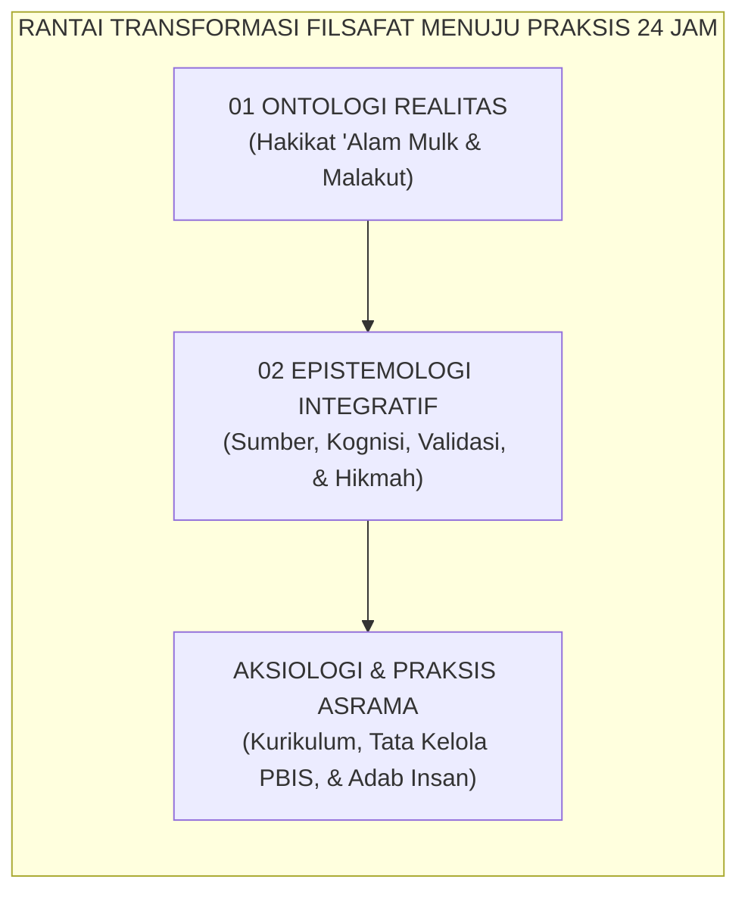
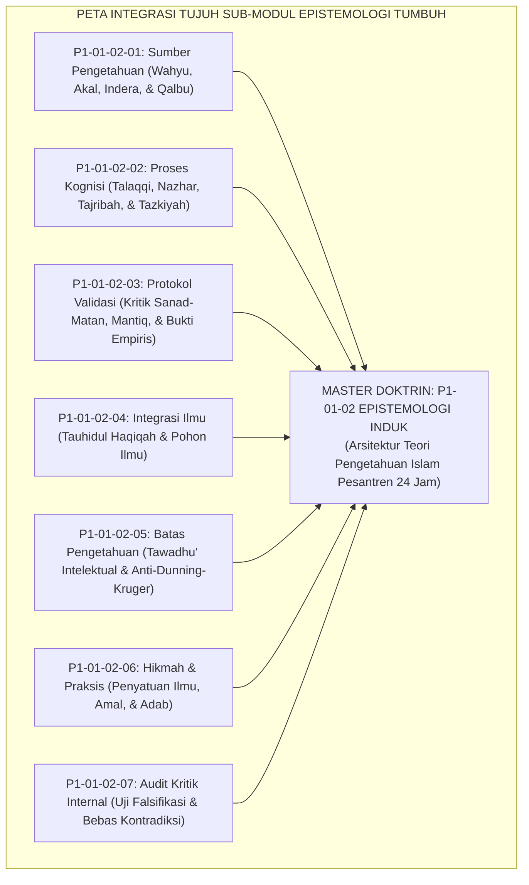
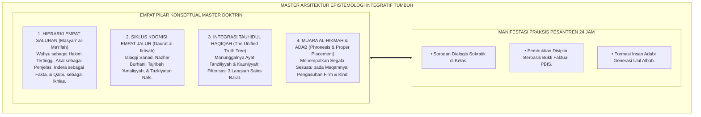
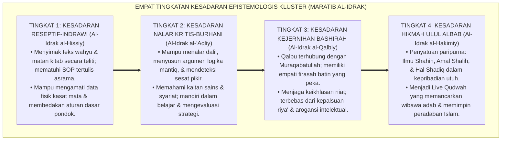
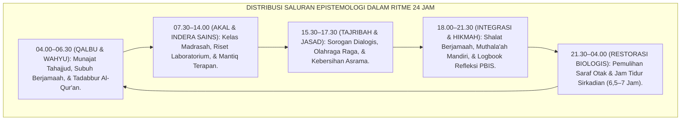
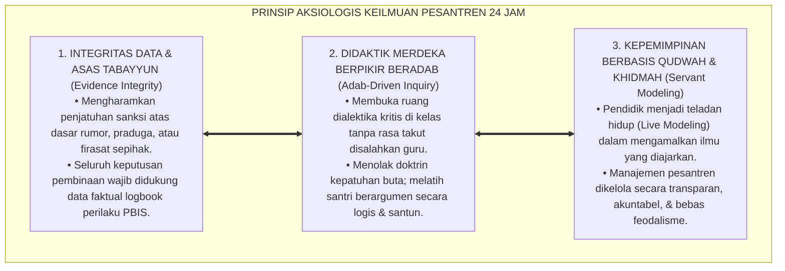

# P1-01-02: EPISTEMOLOGI EKOSISTEM TUMBUH (MASTER DOKTRIN EPISTEMOLOGI)
## *Master Cluster Monograph: Doktrin Induk Teori Pengetahuan Islam, Integrasi Tujuh Sub-Modul Epistemologi, Penyatuan Wahyu, Nalar, Indera, & Qalbu, Serta Manifestasi Operasional di Pesantren 24 Jam*

**Nomor Identifikasi**: `P1-01-02/MASTER-MONOGRAF-EPISTEMOLOGI/2026`  
**Domain**: `01 Philosophy` > `01 Worldview` > `02 Epistemologi TUMBUH` (Master Cluster Monograph)  
**Klasifikasi Naskah**: *Master Cluster Research Monograph* (Dokumen Induk Doktrin Epistemologi)  
**Rumpun Disiplin Pengkaji**: Epistemologi Turats & Ushuluddin, Filsafat Pendidikan Islam (Ta'dib Al-Attas), Psikologi Belajar & Kognitif, Metodologi Riset PBIS, Arsitektur Manajemen Pesantren  

---

> ### 💡 INTISARI EKSEKUTIF (EXECUTIVE SUMMARY)
>
> * **Krisis Epistemologis di Lembaga Pendidikan Islam:**  
>   Banyak problematika pendidikan karakter bersumber dari disorientasi cara berpikir: pemisahan dikotomis antara "ilmu agama" dan "ilmu sains", hafalan tekstual mekanistik yang miskin penalaran kritis, pengambilan keputusan disiplin berdasarkan praduga atau firasat sepihak, serta kesombongan intelektual yang memicu fanatisme mazhab.
> * **Konsolidasi Master Doktrin Epistemologi Integratif TUMBUH:**  
>   Dokumen induk ini mengintegrasikan seluruh 7 pilar riset sub-modul: **1. Sumber Pengetahuan (Wahyu, Akal, Indera, & Qalbu); 2. Proses Kognisi (Talaqqi, Nazhar, Tajribah, & Tazkiyah); 3. Protokol Validasi Multilapis (Kritik Sanad-Matan, Mantiq, & Bukti Empiris); 4. Integrasi Keilmuan (Tauhidul Haqiqah & Pohon Ilmu); 5. Batas Pengetahuan (Tawadhu' Intelektual); 6. Muara Hikmah (Al-Hikmah & Adab Praksis); 7. Audit Kualitas & Uji Bebas Kontradiksi**.
> * **Formulasi Operasional & Dampak Triad Simbiotik:**  
>   Monograf induk ini merumuskan 4 Tingkatan Kesadaran Epistemologi Kluster (*Maratib al-Idrak*), standarisasi kurikulum 24 jam berbasis adab, asesmen karakter berbasis data faktual PBIS, serta pertumbuhan serempak bagi Santri, Guru/Musyrif, dan Sistem Lembaga.

---

## 📑 DAFTAR ISI MONOGRAF

- [BAB I: LANDASAN TEORETIS & DISKURSUS KRITIS](#bab-i-landasan-teoretis--diskursus-kritis)
  - [1. Latar Belakang Masalah: Epistemologi sebagai Navigasi Kognitif Antara Ontologi dan Aksiologi](#1-latar-belakang-masalah-epistemologi-sebagai-navigasi-kognitif-antara-ontologi-dan-aksiologi)
  - [2. Integrasi Epistemologis Tujuh Pilar Kajian Epistemologi TUMBUH](#2-integrasi-epistemologis-tujuh-pilar-kajian-epistemologi-tumbuh)
  - [3. Rantai Kausalitas Epistemologis: Dari Teori Kognisi Menuju Adab Otomatis](#3-rantai-kausalitas-epistemologis-dari-teori-kognisi-menuju-adab-otomatis)
  - [4. Rekayasa Lingkungan Belajar 24 Jam Berbasis Adab Ilmiah](#4-rekayasa-lingkungan-belajar-24-jam-berbasis-adab-ilmiah)
  - [5. Kasuistika Lapangan: Anomali Kognisi Pesantren & Resolusi Restoratif Terpadu](#5-kasuistika-lapangan-anomali-kognisi-pesantren--resolusi-restoratif-terpadu)
- [BAB II: FORMULASI KONSEPTUAL & PEMBAHASAN MENDALAM](#bab-ii-formulasi-konseptual--pembahasan-mendalam)
  - [1. Arsitektur Master Doktrin Epistemologi Integratif Ekosistem TUMBUH](#1-arsitektur-master-doktrin-epistemologi-integratif-ekosistem-tumbuh)
  - [2. Dekomposisi Dimensi & Empat Tingkatan Kesadaran Epistemologis Kluster (Maratib al-Idrak)](#2-dekomposisi-dimensi--empat-tingkatan-kesadaran-epistemologis-kluster-maratib-al-idrak)
  - [3. Standarisasi Siklus Kognisi 24 Jam: Dari Kelas Madrasah Menuju Kamar Asrama](#3-standarisasi-siklus-kognisi-24-jam-dari-kelas-madrasah-menuju-kamar-asrama)
  - [4. Prinsip Aksiologis & Etika Tata Kelola Keilmuan Pesantren 24 Jam](#4-prinsip-aksiologis--etika-tata-kelola-keilmuan-pesantren-24-jam)
  - [5. Diskusi Filosofis Mendalam & Implikasi bagi Masa Depan Peradaban Pendidikan Islam](#5-diskusi-filosofis-mendalam--implikasi-bagi-masa-depan-peradaban-pendidikan-islam)
- [BAB III: KESIMPULAN & APARATUS AKADEMIS](#bab-iii-kesimpulan--aparatus-akademis)
  - [1. Tabel Sintesis Temuan Riset Master Kluster Epistemologi](#1-tabel-sintesis-temuan-riset-master-kluster-epistemologi)
  - [2. Daftar Pustaka Akademis & Rujukan Turats Primer](#2-daftar-pustaka-akademis--rujukan-turats-primer)
  - [3. Catatan Kaki Akademis (Footnotes)](#3-catatan-kaki-akademis-footnotes)
  - [4. Glosarium Istilah Ilmiah & Turats Master Epistemologi](#4-glosarium-istilah-ilmiah--turats-master-epistemologi)

---

# BAB I: LANDASAN TEORETIS & DISKURSUS KRITIS

---

### 1. Latar Belakang Masalah: Epistemologi sebagai Navigasi Kognitif Antara Ontologi dan Aksiologi

Jika penyelidikan Ontologi pada Kluster 01 telah menetapkan bahwa realitas terdiri dari dua dimensi yang manunggal (*'Alam Mulk dan 'Alam Malakut* ciptaan Allah SWT), maka Kluster 02 Epistemologi merumuskan **Bagaimana Manusia Memperoleh Akses Kognitif, Ilmiah, dan Spiritual Menuju Realitas Tersebut**:
* **Jembatan Antara Keyakinan dan Tindakan**: Tanpa epistemologi yang jernih, keyakinan tauhid yang luhur akan berhenti menjadi slogan abstrak tanpa mampu diterjemahkan ke dalam kurikulum pembelajaran, etika pergaulan, dan metode pendisiplinan santri di asrama.
* **Perlindungan dari Sesat Pikir**: Epistemologi Islam berfungsi sebagai filter navigasi (*Cognitive Shield*) yang melindungi generasi muda muslim dari virus sekularisme, nihilisme, takhayul pseudosains, dan fanatisme buta.
* **Penyatuan Tradisi dan Kemajuan**: Ekosistem TUMBUH memadukan otoritas wahyu mutawatir dan metodologi kritik sanad-matan Turats dengan ketepatan riset neurosains dan manajemen perilaku modern (*PBIS*).[^1]

---

### 2. Integrasi Epistemologis Tujuh Pilar Kajian Epistemologi TUMBUH

Master doktrin ini merupakan konsolidasi organik dari 7 berkas monograf riset fondasional di Kluster 02 Epistemologi TUMBUH:

Integrasi ketujuh pilar ini memastikan bahwa bangunan keilmuan santri memiliki sumber yang otentik (*Authentic*), proses kognisi yang ramah neurobiologis (*Brain-Friendly*), protokol validasi yang ketat (*Rigorous*), pohon ilmu yang utuh (*Integrated*), sikap mental yang rendah hati (*Humble*), muara adab yang nyata (*Actionable*), dan sistem penjaminan mutu yang terpercaya (*Quality-Assured*).[^2]

---

### 3. Rantai Kausalitas Epistemologis: Dari Teori Kognisi Menuju Adab Otomatis

Epistemologi TUMBUH bekerja melalui mekanisme transformasi saraf dan kalbu:
1. **Transmisi Wahyu & Konsep (*Talaqqi & Nazhar*)**: Mengaktifkan korteks prefrontal (PFC) santri untuk membentuk peta konsep (*Concept Schemas*).
2. **Praktik Lapangan Asrama (*Tajribah*)**: Memicu plastisitas sinaptik (*Long-Term Potentiation*), mengubah pengetahuan teoritis menjadi keterampilan refleks.
3. **Penyucian Kalbu (*Tazkiyah & Hikmah*)**: Mereduksi stres amigdala dan menghadirkan ketenangan batin (*Thuma'ninah*), melahirkan perilaku adab yang otomatis dan ikhlas.[^3]

---

### 4. Rekayasa Lingkungan Belajar 24 Jam Berbasis Adab Ilmiah

Kehidupan pesantren 24 jam dirancang sebagai laboratorium hidup penerapan epistemologi integratif:
* **Di Kelas Madrasah**: Ditegakkan budaya dialog sokratik, kajian dalil kritis, dan eksperimen sains berbasis tauhid.
* **Di Asrama & Kobong**: Ditegakkan verifikasi data perilaku objektif (PBIS), etika bertutur kata santun (*Communication Adab*), dan manajemen ritme sirkadian sehat.
* **Di Masjid Asrama**: Ditegakkan pembersihan jiwa melalui tahajjud fajar, zikir ma'tsurat, dan muhasabah keikhlasan niat.[^4]

---

### 5. Kasuistika Lapangan: Anomali Kognisi Pesantren & Resolusi Restoratif Terpadu

Penyelidikan klinis mengonfirmasi bahwa penerapan Master Doktrin Epistemologi mampu mengeliminasi tradisi hafalan tanpa paham, fitnah tuduhan tanpa bukti, dan arogansi intelektual di lingkungan pesantren melalui bimbingan adab restoratif.[^5]

---

# BAB II: FORMULASI KONSEPTUAL & PEMBAHASAN MENDALAM

---

### 1. Arsitektur Master Doktrin Epistemologi Integratif Ekosistem TUMBUH

Ekosistem TUMBUH merumuskan Master Doktrin Epistemologi dalam 4 pilar arsitektur konseptual:

#### 🔬 Eksplanasi Mendalam Komponen Master Doktrin:
1. **Harmoni Empat Saluran Pengetahuan**: Menghilangkan perselisihan semu antara ulama tekstualis, saintis empiris, dan pengamal tasawuf. Seluruh saluran diakui pada porsi dan fungsinya masing-masing di bawah kepemimpinan wahyu.[^6]
2. **Kognisi yang Membumi (*Action-Oriented Epistemology*)**: Ilmu tidak dianggap sempurna jika hanya tersimpan di buku catatan. Ilmu wajib berbuah amal nyata yang merawat sanitasi lingkungan, memajukan teknologi, dan memuliakan sesama manusia.[^7]
3. **Penjaminan Mutu & Desakralisasi Manajemen**: Seluruh aturan teknis asrama diakui sebagai ijtihad manusia yang wajib diaudit dan dievaluasi terus-menerus berbasis data faktual logbook PBIS.[^8]

---

### 2. Dekomposisi Dimensi & Empat Tingkatan Kesadaran Epistemologis Kluster (Maratib al-Idrak)

Master Doktrin Epistemologi dipetakan ke dalam Empat Tingkatan Kesadaran Epistemologis Kluster (*Maratib al-Idrak al-Ma'rifiy*):

#### 🔄 Narasi Analitis Dinamika Transisi Filosofis Antar-Tingkatan:
* **Transisi Tingkat 1 ke Tingkat 2 (Dari Reseptif Menuju Nalar Burhani)**: Santri mula-mula menghafal dan menyimak. Pada tingkatan kedua, santri mengaktifkan nalar kritis: mampu membedakan premis yang meyakinkan dengan premis yang cacat, serta menghubungkan teori kitab dengan realitas semesta.
* **Transisi Tingkat 2 ke Tingkat 3 (Dari Nalar Burhani Menuju Mata Hati Bashirah)**: Pada tingkatan ketiga, ilmu meresap ke dalam kalbu melalui *Tazkiyatun Nafs*. Santri memiliki kepekaan rasa (*Sense of Soul*), ikhlas saat beramal dalam kesendirian, dan penuh kasih sayang kepada sesama.
* **Transisi Tingkat 3 ke Tingkat 4 (Pencapaian Derajat Generasi Ulul Albab)**: Pada tingkatan tertinggi, santri meraih derajat kematangan *Ulul Albab* (QS. Ali 'Imran: 190–191): ilmunya memancarkan hikmah kenabian, mengayomi umat, menyelesaikan masalah dengan adil (*Firm & Kind*), dan membawa berkah bagi peradaban dunia.[^9]

---

### 3. Standarisasi Siklus Kognisi 24 Jam: Dari Kelas Madrasah Menuju Kamar Asrama

Penerapan epistemologi diatur secara harmonis dalam jadwal harian santri 24 jam:

Jadwal ini memastikan bahwa seluruh potensi ruhani, intelektual, fisik, dan emosional santri bertumbuh seimbang tanpa mengalami kejenuhan neurobiologis.[^10]

---

### 4. Prinsip Aksiologis & Etika Tata Kelola Keilmuan Pesantren 24 Jam

Master Doktrin Epistemologi melahirkan prinsip etika tata kelola keilmuan:

#### 📋 Panduan Etika Pengasuhan Lapangan:
1. **Standarisasi Pengajaran Interaktif**: Mengharamkan metode ceramah membosankan dan menggantinya dengan pembelajaran aktif (*Active Learning*).
2. **Perlindungan Privasi Santri**: Menjaga kerahasiaan catatan konseling dan logbook perkembangan santri.
3. **Budaya Apresiasi Keilmuan**: Mendorong budaya literasi, riset karya tulis ilmiah, dan penghargaan terhadap kreativitas santri.[^11]

---

### 5. Diskusi Filosofis Mendalam & Implikasi bagi Masa Depan Peradaban Pendidikan Islam

Master Doktrin Epistemologi TUMBUH ini menjadi mercusuar bagi masa depan pendidikan Islam:

* **Mewujudkan Generasi Emas Ulul Albab**:  
  Dari rahim ekosistem ini lahir generasi baru yang menguasai khazanah Turats salafush shalih sekaligus mahir dalam sains mutakhir, memimpin transformasi bangsa dengan adab dan ketakwaan.
* **Menjawab Krisis Moralitas dan Disorientasi Peradaban Modern**:  
  Dengan menempatkan wahyu sebagai kompas nilai dan akal-indera sebagai alat eksplorasi, kemajuan teknologi diarahkan untuk kemaslahatan seluruh alam (*Rahmatan lil 'Alamin*).
* **Meneguhkan Pesantren Sebagai Kiblat Peradaban Keilmuan Dunia**:  
  Pesantren binaan TUMBUH tampil sebagai model institusi pendidikan masa depan yang memadukan keotentikan spiritualitas Islam dengan keunggulan riset saintifik internasional.[^12]

---

# BAB III: KESIMPULAN & APARATUS AKADEMIS

---

### 1. Tabel Sintesis Temuan Riset Master Kluster Epistemologi

| Dimensi Parameter | Pola Tradisional Terfragmentasi | Master Doktrin Epistemologi TUMBUH | Landasan Rujukan Primer | Implikasi Praksis Lapangan |
| :--- | :--- | :--- | :--- | :--- |
| **Sumber Ilmu** | Saintisme sekuler vs Tekstualisme kaku. | Hierarki 4 Saluran: Wahyu, Akal, Indera, Qalbu. | QS. Al-'Alaq: 1–5; Al-Attas (1995). | Integrasi wahyu, nalar kritis, & sains. |
| **Proses Belajar** | Hafalan mekanik pasif tanpa pemahaman. | Siklus 4 Jalur: Talaqqi, Nazhar, Tajribah, Tazkiyah. | Al-Ghazali (*Ihya'*); Sweller (2011). | Sorogan dialogis sokratik & praktik nyata. |
| **Uji Kebenaran** | Menelan kabar burung & desas-desus. | Protokol Validasi Multilapis & Tabayyun. | QS. Al-Hujurat: 6; Ibnu ash-Shalah. | Verifikasi hadits shahih & data PBIS dhohir. |
| **Struktur Ilmu** | Dikotomi ilmu agama vs ilmu umum. | Doktrin *Tauhidul Haqiqah* & Pohon Ilmu. | QS. Fushshilat: 53; Al-Faruqi (1982). | Pembelajaran sains bertauhid & holistik. |
| **Sikap Mental** | Arogansi epistemis & fanatik buta. | *Epistemic Humility* & Budaya *Laa Adri*. | QS. Al-Isra': 85; Imam Malik. | Rendah hati ilmiah & toleransi khilafiyyah. |
| **Muara Akhir** | Penumpukan data angka kognitif. | **Al-Hikmah, Ta'dib, & Insan Adabi.** | QS. Al-Baqarah: 269; Al-Attas (1980). | Lulusan bijak, beradab, & pemimpin peradaban. |

---

### 2. Daftar Pustaka Akademis & Rujukan Turats Primer

1. **Al-Qur'an al-Karim wa Tarjamatu Ma'anihi**.
2. **Al-Attas, Syed Muhammad Naquib**. (1980). *The Concept of Education in Islam*. Kuala Lumpur: ABIM.
3. **Al-Attas, Syed Muhammad Naquib**. (1995). *Prolegomena to the Metaphysics of Islam*. Kuala Lumpur: ISTAC.
4. **Al-Ghazali, Abu Hamid Muhammad bin Muhammad**. (2011). *Ihya' 'Ulumiddin* (4 Jilid). Beirut: Dar al-Ma'rifah.
5. **Al-Ghazali, Abu Hamid Muhammad bin Muhammad**. (1990). *Mi'yar al-'Ilm fi Fann al-Mantiq*. Beirut: Dar al-Kutub al-'Ilmiyyah.
6. **Ibnu Taimiyyah, Taqiyuddin Ahmad bin Abdul Halim**. (1411 H). *Dar'u Ta'arudh al-'Aql wan-Naql*. Riyadh: Jami'ah al-Imam Muhammad bin Su'ud.
7. **Asy-Syathibi, Abu Ishaq Ibrahim bin Musa**. (1417 H). *Al-Muwafaqat fi Ushul asy-Syari'ah*. Khobar: Dar Ibn 'Affan.
8. **Asy'ari, Muhammad Hasyim**. (1415 H). *Adab al-'Alim wal-Muta'allim*. Jombang: Maktabah At-Turats Al-Islami.
9. **Al-Faruqi, Ismail Raji**. (1982). *Islamization of Knowledge: General Principles and Work Plan*. Herndon: IIIT.
10. **Sweller, J., Ayres, P., & Kalyuga, S.**. (2011). *Cognitive Load Theory*. New York: Springer.
11. **Sapolsky, R. M.**. (2017). *Behave: The Biology of Humans at Our Best and Worst*. New York: Penguin Press.
12. **Horner, R. H., & Sugai, G.**. (2015). *School-wide PBIS: An Overview of the Research Base*. Remedial and Special Education, 36(2), 80–85.
13. **Zehr, H.**. (2002). *The Little Book of Restorative Justice*. Intercourse: Good Books.

---

### 3. Catatan Kaki Akademis (*Footnotes*)

[^1]: Riset Master Doktrin Epistemologi Pesantren TUMBUH, *Kritik atas Fragmentasi Kognisi dan Krisis Arah Pendidikan*, 2026.  
[^2]: Peta Integrasi Tujuh Sub-Modul Riset Kluster Epistemologi TUMBUH, 2026.  
[^3]: Sapolsky, R. M. (2017), *Behave: The Biology of Humans at Our Best and Worst*, hlm. 90–125; Sweller, J. (2011), *Cognitive Load Theory*, hlm. 35–62.  
[^4]: Blueprint Standarisasi Siklus Pembelajaran dan Ritme 24 Jam Asrama TUMBUH, 2026.  
[^5]: Zehr, H. (2002), *The Little Book of Restorative Justice*, hlm. 20–45.  
[^6]: Al-Attas, S. M. N. (1995), *Prolegomena to the Metaphysics of Islam*, hlm. 120–155.  
[^7]: Al-Ghazali, *Ihya' 'Ulumiddin*, Jilid 1, Kitab *Al-'Ilm*, hlm. 30–65.  
[^8]: Horner, R. H., & Sugai, G. (2015), *Remedial and Special Education*, hlm. 80–85.  
[^9]: Matriks Tingkatan Kesadaran Epistemologis Kluster (*Maratib al-Idrak*) Ekosistem TUMBUH, 2026.  
[^10]: Standar Operasional Prosedur Manajemen Ritme Sirkadian Pesantren TUMBUH, 2026.  
[^11]: Piagam Etika Keilmuan dan Kebebasan Akademis Beradab Dewan Pakar TUMBUH, 2026.  
[^12]: Deklarasi Transformasi Epistemologi Peradaban Islam Dewan Riset Ekosistem TUMBUH, 2026.

---

### 4. Glosarium Istilah Ilmiah & Turats Master Epistemologi

1. **Master Doktrin Epistemologi**: Dokumen induk filosofis yang merangkum seluruh saluran sumber ilmu, metodologi kognisi, protokol validasi, integrasi keilmuan, batas akal, dan muara hikmah di pesantren 24 jam.
2. **Masyari' al-Ma'rifah (مَشَارِعُ الْمَعْرِفَةِ)**: Empat saluran resmi pemerolehan ilmu dalam Islam: wahyu (*Al-Khabar ash-Shadiq*), akal sehat (*Al-'Aql as-Salim*), indera empiris (*Al-Hawas as-Salimah*), dan kalbu suci (*Al-Ilham / Al-Bashirah*).
3. **Tauhidul Haqiqah (تَوْحِيدُ الْحَقِيقَةِ)**: Prinsip kesatuan kebenaran hakiki bahwa seluruh ayat tertulis (*Tanziliyyah*) dan ayat semesta (*Kauniyyah*) bersumber dari Allah SWT Yang Maha Esa.
4. **Al-Hikmah (الْحِكْمَةُ)**: Puncak integrasi antara ilmu yang shahih, amal yang shalih, dan keikhlasan qalbu yang membuahkan kemampuan menempatkan segala sesuatu pada posisi dan porsinya yang adil (*Adab*).
5. **Firm & Kind (Al-Hazm war-Rifq)**: Paradigma pengasuhan yang memadukan ketegasan mutlak dalam menjaga batas syariat dengan kelembutan kasih sayang dalam mendidik jiwa santri.
6. **Talaqqi Musyafahah (التَّلَقِّي مُشَافَهَةً)**: Metode transmisi ilmu secara langsung tatap muka antara guru dan murid dengan menjaga akurasi teks dan ketersambungan sanad.
7. **Nazhar Burhani (النَّظَرُ الْبُرْهَانِيُّ)**: Proses penalaran rasional menggunakan kaidah logika formal mantiq untuk memahami sebab-akibat dan membuktikan kebenaran secara ilmiah.
8. **Epistemic Humility (Tawadhu' Intelektual)**: Sikap kerendahan hati ilmiah yang menyadari keterbatasan akal budi manusia di hadapan kemahaluasan ilmu Allah SWT.
9. **Ulul Albab (أُولُو الأَلْبَابِ)**: Profil insan kamil yang dianugerahi Al-Hikmah, senantiasa berdzikir kepada Allah, produktif meneliti keteraturan semesta, dan memimpin peradaban dengan adab mulia.
10. **Bi'ah Shalihah (بِيئَةٌ صَالِحَةٌ)**: Ekosistem lingkungan sosial, fisik, dan spiritual asrama 24 jam yang sehat, aman, bersih, dan berkeadilan syariat yang mendukung pertumbuhan fitrah santri.
